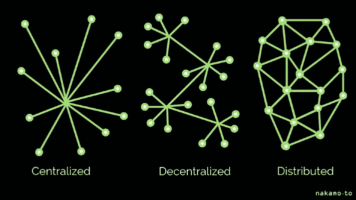

# 第 6 章

### 6.2.1 合约代码
[130](https://doi.org/10.1007/978-1-4842-8975-4_6#Sec5)

### 6.2.2 编译并部署合约
[137](https://doi.org/10.1007/978-1-4842-8975-4_6#Sec6)

### 6.3 本章小结
[144](https://doi.org/10.1007/978-1-4842-8975-4_6#Sec7)

## 第 7 章：IPFS 与 NFT
[147](https://doi.org/10.1007/978-1-4842-8975-4_7)

### 7.1 IPFS
[147](https://doi.org/10.1007/978-1-4842-8975-4_7#Sec1)

#### 7.1.1 IPFS：三万英尺鸟瞰
[149](https://doi.org/10.1007/978-1-4842-8975-4_7#Sec2)

#### 7.1.2 安装
[150](https://doi.org/10.1007/978-1-4842-8975-4_7#Sec3)

### 7.2 ERC-721
[152](https://doi.org/10.1007/978-1-4842-8975-4_7#Sec4)

### 7.3 创建 ERC-721 代币并部署至 IPFS
[153](https://doi.org/10.1007/978-1-4842-8975-4_7#Sec5)

### 7.4 本章小结
[165](https://doi.org/10.1007/978-1-4842-8975-4_7#Sec6)

## 第 8 章：Hardhat
[167](https://doi.org/10.1007/978-1-4842-8975-4_8)

### 8.1 Hardhat 框架的安装
[167](https://doi.org/10.1007/978-1-4842-8975-4_8#Sec1)

### 8.2 Hardhat 工作流程
[167](https://doi.org/10.1007/978-1-4842-8975-4_8#Sec2)

### 8.3 智能合约的部署
[172](https://doi.org/10.1007/978-1-4842-8975-4_8#Sec3)

### 8.4 本章小结
[179](https://doi.org/10.1007/978-1-4842-8975-4_8#Sec4)

## 索引
181

## 关于作者

**Shashank Mohan Jain** 在 IT 行业拥有约 22 年的工作经验，主要专注于云计算、机器学习和分布式系统领域。他对虚拟化技术、安全性和复杂系统有浓厚兴趣。他在云计算、物联网和机器学习领域拥有多项软件专利。他是多个知名云计算会议的演讲嘉宾。Shashank 持有 Sun、Microsoft 和 Linux 内核认证。

## 关于技术审校

**Prasanth Sahoo** 是一位思想领袖、兼职教授、技术演讲者，也是区块链、DevOps、云和敏捷领域的全职实践者，目前就职于 PDI Software。因其在学术服务中对社区的知识分享，他被 TCS 全球社区授予 2019 年度区块链与云专家奖。他热衷于通过辅导、指导和培养技巧，处理各种社区倡议来推动数字技术计划。Prasanth 拥有一项个人专利，迄今为止已与超过 5 万名专业人士互动，其中大多来自技术领域。他是区块链委员会、加密货币认证联盟、Scrum Alliance、Scrum 组织以及国际商业分析协会的工作组成员。

## 引言

我们生活在一个激动人心的时代。我们几乎每天都在见证技术领域的革命。Web3 正是这样一场革命。

随着 Web3 和区块链技术的出现，我们编写应用程序的方式正在改变。本书的核心理念是为读者提供 Web3 的基础入门知识。本书将使读者能够理解 Web3 的细微差别，并创建简单的应用程序，例如创建自己的代币或 NFT。

## 第 1 章：去中心化与 Web3

在本章中，我们将探讨从 Web 1.0 和 2.0 演进到 Web 3.0 的历程。

### 1.1 Web 1.0

在 Web 1.0 时代，网站提供的是用超文本标记语言（HTML）编写的静态内容（而非动态内容）。数据和内容是通过静态文件系统（而非数据库）发送的，网页只包含极少量的交互信息。

以下是 Web 1.0 中包含的主要技术列表：

- HTML（超文本标记语言）
- 在超文本传输协议（HTTP）中编码的 URL（统一资源定位符）

### 1.2 Web 2.0

由于 Web 1.0 中的大多数内容是静态的，这催生了 Web 2.0。

© Shashank Mohan Jain 2023  
S. M. Jain，《Web3 简要介绍》，[`doi.org/10.1007/978-1-4842-8975-4_1`](https://doi.org/10.1007/978-1-4842-8975-4_1#DOI)

我们绝大多数人只体验过万维网的最新迭代版本，有时被称为 Web 2.0、交互式读写网络和社会化网络。参与 Web 2.0 的创造过程并不要求你具备任何开发经验。

大量应用程序的设计方式使得任何人都可以制作自己的程序版本。

你能够产生想法，并将这些想法传达给世界各地的人们。你可以将视频上传到 Web 2.0，数百万用户都能观看、互动和评论它。Web 2.0 应用程序包括社交媒体网站，如 YouTube、Facebook、Flickr、Instagram 和 Twitter 等。想想这些网站刚推出时有多受欢迎，再比较一下它们现在有多受欢迎。

Web 2.0 允许应用程序扩展，但也催生了控制所有用户数据的中心化平台。这给了它们进行数据挖掘的机会和可能，数据挖掘既可用于积极目的，也可用于消极目的。

由于用户逐渐丧失对这些中心化平台的控制，这导致了 Web 3.0 的出现。

### 1.3 Web 3.0

Web 2.0 的设计本质上依赖于中心化系统。这些系统可能是分布式的，但并非去中心化的。这意味着对这些系统的控制权掌握在个人或一群个人手中。

随着隐私和数据使用问题的开始浮现，这导致了巨大的问题。

这导致了 Web 3.0 的演进，它将去中心化作为首要要求。这意味着 Web3 的应用程序将以去中心化的方式部署，其应用程序的数据存储也将是去中心化的。

因此，在理解 Web3 格局之前，对去中心化有一个概念非常重要。

#### 1.3.1 去中心化简介

“不加思考地尊重权威是真理最大的敌人。”阿尔伯特·爱因斯坦的这句名言，极大地促使我们思考：是应该存在由权威控制的系统，从而要求我们完全相信和信任这个权威，还是应该存在去中心化的系统，以共识作为决策的根本？中心化系统，顾名思义，可能受中心权威的意志所控制，而去中心化系统则更倾向于包容性的决策，从而减少该系统内部腐败的机会。


```markdown

# 去中心化与分布式系统

在去中心化设置中，没有所有者或主节点。只有参与网络的`peer`节点。这些节点在需要时通过交换消息来达成共识。管理这些网络的协议确保整个节点系统处于一致状态。网络中的每个节点都拥有所有已记录数据的最新副本。去中心化网络还可以分发数据以验证特定的私人信息，而无需将该信息交给第三方。这种验证之所以成为可能，是因为数据不必传输。数据的验证是利用基于共识的技术完成的，其中网络上的节点在特定时间点同意整个系统的特定状态。

去中心化网络中的每个参与节点独立于网络中的其他节点运行。去中心化节点通过使用通用标准相互交互，但它们保持独立性并负责自己的隐私管理，而不是遵循中心化权威的指令。这不仅有助于维护网络的安全性，还确保其以民主方式进行治理。

图 1-1 展示了在中心化、去中心化和分布式网络中节点如何连接和通信。



**图 1-1.** 中心化、去中心化和分布式网络之间的区别

“中心化”和“去中心化”这两个术语都指的是控制级别。在中心化系统中（例如，个人或企业），控制权仅由一个组织或个人行使。没有任何单一实体控制去中心化系统的运行。相反，控制权分散在多个不同的自治实体之间。

位置上的差异被理解为分布。

在非分布式系统中，也称为共地系统，系统的所有组件都位于同一物理位置。

分布式系统是其不同组件可以位于不同物理位置的系统。

#### 1.3.2 网络的不同拓扑结构

网络可以在不同的拓扑设置中进行配置。以下部分将介绍其中几种。

##### 1.3.2.1 中心化且非分布式

如果你正在构建一个将在 Windows 计算机上运行的独立应用程序，这种配置是非分布式的，同时也作为一个中心化系统运行。你的应用程序由一个方（应用程序供应商）控制，而另一个方（例如 Microsoft）负责你的操作系统（中心化）。应用程序和操作系统都本地存储在你的个人计算机上，使它们都是非分布式组件。

##### 1.3.2.2 中心化但分布式

想象一下，你正在使用一个托管在 Amazon Web Services 上并在 AWS 虚拟机中运行的云应用程序。这种配置既是中心化的，也是分布式的。你的应用程序和操作系统都受 AWS 控制（中心化）。云存储同时托管应用程序和操作系统，它们可能被分区到多个位置。

#### 1.3.3 去中心化系统

就其本质而言，去中心化系统将是分布式的。点对点软件可以被视为去中心化系统的一个例子，它被定义为“需要多个方做出自己独立决策的系统”。

在去中心化系统中，不可能有一个单一的、中心化的权威机构代表所有不同方做出决策。相反，每个方（也称为`peer`）负责在实现自身个体目标的方向上做出本地自主决策，这些目标可能与其他`peer`追求的目标一致或不一致。`peer`之间进行一对一的通信，在此期间他们可以交换信息或为其他`peer`执行服务。在去中心化系统中，开放系统是指`peer`的参与不受任何限制的系统。`peer`可以随时自行决定加入或离开系统。

在信息被添加到区块链（去中心化系统的一个例子）之前，参与网络的节点必须使用称为共识机制的某种方法来决定其是否准确。一旦数据更新到区块中，它就会被发送到网络中的所有节点。这使得更改已添加到账本中的信息变得极其困难。

在去中心化网络上改变状态需要大多数节点反映更新后的状态，这是一件非常困难的事情，因此去中心化的节点网络是不可变的。这与更改单个中心化数据库中的数据形成对比。如果打破了不可变性规则，验证节点将忽略此类信息。

将职能和权力从中心位置或权威机构分散出去的过程称为去中心化。在去中心化架构中，很难（如果不是不可能）识别出一个特定的中心。万维网是作为去中心化平台创建的。诸如`Bitcoin`和`Ethereum`之类的区块链技术展示了去中心化架构和系统。

随着技术格局的变化，去中心化结构不断涌现。去中心化有能力改变很多事情，从治理和工业到司法系统。

现在，有了这些关于去中心化的基础知识，我们可以开始理解`Web 3.0`生态系统。

`Web 3.0`应用程序构建在区块链上，区块链是由众多点对点`peer`节点组成的去中心化网络。区块链用于记录用户之间发生的交易。在`Web 3.0`生态系统的背景下，这些应用程序被称为去中心化应用程序（`DApps`），这是一个经常使用的术语。网络中的参与者（称为开发者）因其努力提供最高质量的服务而获得报酬，以维护一个既健壮又安全的去中心化网络。

在高层面上，`Web 3.0`架构包括四个主要部分，如下所示：

1. **区块链** – 一个由`peer`节点组成的点对点网络负责维护这些全局状态机。全球任何人都可以访问并写入状态机。本质上，它不是由单个公司拥有，而是由网络中的所有参与者共同拥有。用户可以将新数据上传到区块链，但不能编辑已经添加的数据。有许多类型的区块链可用，例如`Ethereum`、`Solana`、`Polkadot`等。
2. **智能合约** – `Ethereum`区块链可以托管一个称为智能合约的东西，它是一种在区块链上运行的计算机程序。这些合约由应用程序开发者使用高级编程语言（如`Solidity`或`Vyper`）编写，以指定状态转换背后的逻辑。我们将在[第 3 章](https://doi.org/10.1007/978-1-4842-8975-4_3)讨论`Solidity`。
3. **以太坊虚拟机（`EVM`）** – 它是一种虚拟机，负责执行智能合约中概述的逻辑。它负责管理状态机。

```


## 第 1 章：去中心化与 Web3

状态之间的转换。它通常基于字节码运行，而字节码是通过获取 Solidity 源代码并经由 Solidity 编译器编译生成的。

4\. 前端/用户界面 – 用户界面（UI）逻辑由前端定义，这与任何其他应用程序中的情况相同。然而，它确实需要与智能合约进行通信，而智能合约是描述应用程序工作方式的程序。

在我们开发一个简单的 Web3 应用之前，需要熟悉某些技术和环境。我们将从 Remix 集成开发环境（IDE）开始，在本章中，我们将使用该环境作为开发和部署基于智能合约的 Web3 应用的环境。

### 1.3.4 Web3 案例研究

我们每一位专业人士都听说过领英（LinkedIn），它是一个面向专业人士的社交网络。它由领英公司控制，其老板可以决定平台规则。如果他们愿意，也可以选择审查哪些人。但我们不必担心。有一个名为 Entre 的 Web3 替代品。可以通过[`joinentre.com/`](https://joinentre.com/)访问。它是一个使用 Web3 技术构建的去中心化专业网络。目前拥有约 5 万名成员，并且仍在增长。它提供职位发布、活动日历以及许多其他功能。

由于这是一个去中心化平台，规则很难由中央权威机构更改。

除此之外，还有其他 Web3 平台，例如作为 Twitter 替代品的 Deso，以及作为 YouTube 替代品的 Odysee。可以说，就技术形态而言，我们正处在一个非常激动人心的时代。

### 1.4 总结

在本章中，我们简要介绍了 Web 3.0、去中心化及其形式的概念。在下一章中，我们将向读者介绍区块链生态系统及其各种类型。我们还将研究一些现有区块链网络（如比特币和以太坊）的运行方式。

## 第 2 章：区块链

区块链技术为传统的分布式数据库提出了一种创新思路。在非传统环境中利用现有技术正是创新的源泉。当我们想到像 Postgres 这样的传统数据库时，存在一个主节点，它接受写入请求，并负责将状态变化同步到其他 Postgres 节点。在像区块链这样的去中心化设置中，没有主节点，但它仍然服务于更新账本并确保网络中其他节点正确反映更新状态的相同目的。

存在着大量不同种类的区块链和区块链技术应用。区块链是一项包罗万象的技术，目前正被集成到全球各种不同的平台和硬件中。

区块链是一种数据结构，它能够创建数据的数字账本，并将该数据共享到一个由互不关联的各方组成的网络中。存在着大量不同种类的区块链。

### 2.1 区块链的类型

区块链可以分为三大类。

© Shashank Mohan Jain 2023  
S. M. Jain, *《Web3 简明介绍》*, [`doi.org/10.1007/978-1-4842-8975-4_2`](https://doi.org/10.1007/978-1-4842-8975-4_2#DOI)

#### 2.1.1 公有区块链

像比特币这样对公众开放的区块链，是大型的分布式网络，每个网络都由其自身的原生代币管理。它们拥有由社区维护的开源代码，并欢迎任何人参与，无论其参与程度如何。

#### 2.1.2 私有区块链

私有区块链通常比公有区块链规模小，并且不使用代币。它们的成员资格受到严格监控和监管。由可信成员组成并涉及机密信息交换的联盟倾向于使用这类区块链。例如，一家公司在其自有数据中心内使用区块链。IBM 有一个名为 Hyperledger 的实现，已被多家公司采用。

#### 2.1.3 许可型区块链

许可型区块链是指用户需要获得许可才能访问的区块链。这与公有链和私有链截然不同。企业设置可能会寻求一种许可型区块链，在其企业边界内更多地将其当作一个去中心化数据库来使用。许可型区块链的例子包括 Ripple 和 IBM Food Trust。

区块链之所以声名鹊起，原因如下：

1. **其去中心化特性** – 区块链设置在其架构中倡导去中心化。这意味着，在像比特币或以太坊这样强大的区块链网络中，没有中心化权威机构。任何人都可以通过启动自己的节点并成为区块链网络的一部分来参与这些网络。这确实是一项赋权功能。

2. **不可篡改的存储数据结构** – 存储在区块链上的所有数据都会永久记录在全球的节点/计算机集群中。可以将其视为一个永久的记录账本。要从这个账本中删除一条记录，需要网络中的大多数节点同意，如果网络像比特币或以太坊那样庞大，这实际上是不可能的。

尽管规则因区块链而异，但通常对区块链的任何改变或状态变更都是由一个实体完成的，然后该实体将更改发布到网络上，供其他节点验证。只有当大多数节点同意该状态时，该交易才被视为有效。

谁有权更改状态的机制可能因区块链而异，这取决于链的底层算法。

例如，对于基于比特币的区块链，存在工作量证明算法，它让节点参与解决一个数学难题，首先解决该难题的节点获得在账本上写入的权利。然后，写入者将更改广播到网络，供验证者验证更改。

### 2.2 什么是区块链？

区块链是一种不依赖中心化权威机构来管理系统或账本状态的点对点网络。组成网络的计算机可以在物理上分布。“全节点”是这类计算机的另一个常见名称。

一旦数据被录入区块链数据库，要删除或更改这些数据就极其困难，甚至是不可能的。这意味着，一旦数据被记录并复制到全球众多节点上，与记录在中心化账本上的数据相比，数据消费者可以对数据有更高程度的信任。这意味着像产权、结婚证、发票等记录可以永久记录在链上，无需担心被篡改。

在商业和银行业中依赖中心化系统的流程，如资金结算和电汇，现在可以在没有中心化权威机构的情况下完成。拥有安全的数字记录对全球经济的影响极为重大。

### 2.3 区块链的构建模块

区块链生态系统有三个主要组成部分。

#### 2.3.1 区块

区块是特定时间段内录入账本的交易列表。每个区块链都有其独特的维度、时间间隔以及触发区块创建的事件。


