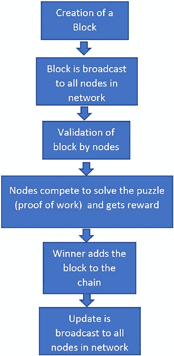
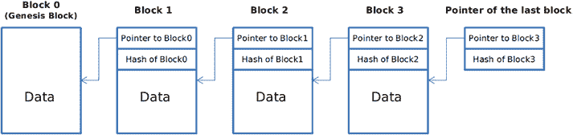

# 工作量证明

`工作量证明`具有诸多显著优势，尤其适用于比特币这种相对简单但极具价值的加密货币。它是一种经过验证的可靠方法，能够确保去中心化区块链保持安全状态。随着加密货币价格持续上涨，更多矿工将被激励加入网络，从而提升网络算力与安全等级。比特币网络在其算法中内置了难度调整机制，该机制如同反馈回路，可根据需求动态调整挖矿难度。若矿工数量庞大，且因硬件资源充足而挖矿速度过快，算法会提高挖矿难度，确保每个区块的生成时间维持在 10 分钟左右。

`工作量证明`算法所用的数学难题并非传统意义上的实体拼图。它利用了加密哈希的单向函数作为底层机制。

## 加密哈希函数

加密哈希函数被设计为确定性的单向函数。

这意味着任何内容——无论是几行文字、文档、图片还是视频——都能被压缩至特定长度。例如，在基于`SHA 256`的哈希函数中，无论输入内容体积大小，输出始终为 256 位。哈希函数的另一个特性是：对同一内容反复运行同一哈希函数，生成的哈希值必然相同。这便是确定性的来源。

如先前所述，它是单向函数：从输入到输出易于实现，但从输出反向推导输入则不可能（或可称为计算不可行）。比特币正利用这一特性构建其`工作量证明`算法。

## 挖矿过程

简而言之，比特币网络会提供一个哈希值作为目标，要求矿工通过以下两个输入生成哈希：

- 区块头
- 一个名为`随机数`的随机数值

矿工需将两者结合，生成一个小于网络为特定区块提供的目标哈希值。如前所述，由于哈希是单向函数，矿工必须不断尝试不同的`随机数`与区块头的组合，反复计算哈希，直至结果满足系统设定的目标条件。

除了暴力计算这些哈希值，别无他法。

## 权益证明

以太坊区块链最初采用`工作量证明`算法，但现已转向`权益证明`算法。在`权益证明`机制中，网络参与者需质押货币才能挖取以太币（以太坊区块链的加密货币）。例如，若我想成为网络的验证者，就必须质押一定资金以验证交易。此举将个人利益与网络绑定，从而抑制作弊动机。因此，与比特币消耗能源不同，以太坊倡导参与者通过质押资金来维护网络。

系统将从所有质押者中，选择质押金额最高者作为交易验证者，并为其任务发放奖励。

一旦胜选者验证完最新交易区块，其他验证者即可对该区块进行有效性验证。当网络达到预设的确认数或证明数量时，区块链便会更新。

## 工作量证明与权益证明的主要区别

两种共识机制最显著的区别在于能耗需求。`权益证明`区块链的运行能耗远低于基于`工作量证明`的区块链。关于哪种机制更能代表货币价值，至今争论不休。

这两种共识机制均设有经济惩罚措施，旨在惩戒破坏网络的恶意行为者，并警示他人。在`工作量证明`系统中，提交无效信息或区块的矿工将损失计算能力、能源和时间等沉没成本——比特币及其他加密货币正是如此运作。

其核心理念是对作弊行为设置高额惩罚。

在`工作量证明`中，风险在于消耗的能源；而在`权益证明`中，风险在于质押的资金。例如，若发现网络参与者接受了欺诈性区块，其质押资金的一部分将被“罚没”作为惩罚。

网络将设定验证者奖励可被削减的最高限额。

## 区块链架构

万维网的传统架构采用客户端-服务器网络。由于这是一个由多名具有修改权限的管理员控制的中心化数据库，服务器将所有必要信息存储于单一位置以便于更新。

而在区块链技术的分布式网络架构中，每位网络参与者都负责维护、批准和更新新条目。系统不仅由多人控制，更由区块链网络全体成员共同掌控。每位成员需确保所有记录和流程合规，最终保障数据的有效性和安全性。因此，互不信任的各方也能达成共识。

简而言之，区块链可被描述为一个组织在`P2P`网络上的去中心化分布式交易账本，该账本既可公开也可私有。该网络由大量计算机组成，其设计确保未经网络中所有计算机（即每台独立计算机）达成共识，数据无法被篡改。

区块链技术通过包含按特定顺序排列的交易区块列表来呈现其底层结构。这些列表可以简单数据库或纯文本文件（使用`txt`格式）的形式存储。可将区块链视为由交易区块组成的持久化链表。

## 节点、区块、矿工与链

我们已讨论过区块链语境中的节点、区块与链的概念。还有一个需要提及的重要实体——矿工。以比特币区块链为例，矿工是负责改变区块链状态的实体。这种状态变更通过向链上添加新区块实现。要获得状态变更权限，矿工必须解出数学难题。该难题要求为系统提供的哈希值找到对应数字。因此，矿工需遍历所有数字组合，验证每个数字的哈希值是否匹配。全球众多矿工同时进行此计算，最先胜出的矿工将获得写入新区块的权限。矿工写入区块后，会将其发布至网络供验证者校验。验证过程很简单：矿工需同时提供哈希值及其对应的数字，验证者只需计算该数字的哈希值，并与系统要求的目标哈希值比对即可。一旦多数矿工验证通过，该区块便会在全网复制，并逐步添加至网络中所有计算机。

## 第 2 章：区块链

在较高层面上，比特币区块链中的交易流程如图 2-1 所示。



**图 2-1.** 交易在比特币区块链上的运作方式

### 2.8 加密密钥

由于公共区块链网络是无需许可且去信任化的，我们需要一种机制来在缺乏中心化权威机构的情况下对用户进行身份验证。这一任务通过为网络上的每个参与者提供一对`私钥`和`公钥`来实现。私钥由用户持有，并应受到高度保护。私钥用于签署用户的交易，而公钥（对所有人可见）则可用于验证签名者。通过这种方式，无需中心化权威机构，利用私钥和公钥基础设施，即可在去中心化的区块链网络上实现安全性。



### 2.9 区块链与单向链表的比较

区块链的数据结构与单向链表的数据结构具有一定程度的相似性，如图 2-2 所示。

**图 2-2.** 区块链描绘出的类似链表的结构

我们可以看到，第一个区块被称为创世区块，此后创建的每一个新区块都持有对前一个区块的引用。例如，区块 1 将持有对区块 0 的引用，区块 2 持有对区块 1 的引用，依此类推。除了这个指针之外，还会存储前一个区块的哈希值。这看起来就像一个单向链表数据结构。要向该列表添加元素，我们需要使用`工作量证明`或`权益证明`，但在区块链上删除操作极其困难，这与链表不同，在链表中删除节点很容易。

本质上，区块链是不可变的。没有任何记录可以被删除。如果我们尝试思考一下，对任何一个区块的任何修改都意味着该区块之后的所有区块都必须用前一个区块的哈希值进行更新。

对于像比特币这样的网络来说，这意味着需要巨大的计算能力才能使用`工作量证明`来修改区块。这也是攻击比特币区块链网络几乎不可能的原因之一。

接下来，我们将介绍以太坊区块链，它是我们将在本书后续所有工作中使用的可编程区块链。

### 2.10 以太坊

以太坊是一个区块链网络，它包含一种图灵完备的编程语言，可用于构建各种去中心化应用（也称为 DApp）。以太坊网络由其自身的加密货币以太币驱动。以太坊网络目前因支持使用智能合约而广为人知。智能合约可以比作包含特定价值的加密银行保险柜。

必须满足某些条件才能解锁这些加密保险柜。`Solidity` 这种编程语言主要用于创建智能合约。`Solidity` 是一种相对易于学习的面向对象编程语言。我们将在[第 3 章](https://doi.org/10.1007/978-1-4842-8975-4_3)中看到更多关于 `Solidity` 的内容。

以太坊基于两种账户类型运作：

1. **外部拥有账户 (EOA)**
   私钥用于控制外部拥有账户。每个 EOA 都由一对公私钥保护。用户可以通过创建和签署交易来进行通信。

2. **合约账户**
   合约代码用于管理合约账户。这些代码与账户一起保存。每个合约账户都有一个关联的以太币余额。每当这些账户从 EOA 收到交易或从另一个合约收到消息时，其合约代码就会被激活。当合约代码被激活时，可以读取/写入本地存储的消息、发送消息以及创建合约。

### 2.11 总结

在本章中，我们涵盖了区块链架构的基础知识，以及像`工作量证明`和`权益证明`这类在比特币和以太坊等区块链网络中常用的不同共识算法。

在下一章中，我们将介绍 `Solidity`，它是以太坊区块链上使用的语言，以及如何使用 `Solidity` 创建智能合约。

## 第 3 章：Solidity

你听说过或遇到过智能合约吗？如果有人与世隔绝，可能还没听说过它。话虽如此，智能合约定义了一种我们可以在区块链上执行代码的方式。

用于定义这些智能合约的语言之一是 `Solidity`。

`Solidity` 允许我们对以太坊区块链进行编程，从而为去中心化应用开发的巨大可能性打开了大门。区块链初学者学习 `Solidity` 很重要。透彻理解如何利用 `Solidity` 进行智能合约开发，以及深入审视其各个组成部分，是至关重要的。

学习者还应该反思示例，以便更好地理解构成 `Solidity` 架构和运作的组件。同样，深入思考 `Solidity` 的各种应用可能有助于更好地理解其重要性。此外，许多学生都想知道：“学习 `Solidity` 容易吗？” 重要的是要知道，如果你有一个好的教程可以跟随学习，那么学习 `Solidity` 会更简单。

本章提供了对 `Solidity` 以及其他相关元素（如类型、函数、事件和继承）的全面总结。

© Shashank Mohan Jain 2023
S. M. Jain，《Web3 简介》，[`doi.org/10.1007/978-1-4842-8975-4_3`](https://doi.org/10.1007/978-1-4842-8975-4_3#DOI)

### 3.1 什么是 Solidity？

`Solidity` 是一种高级编程语言，其主要目的是促进智能合约的创建和执行。`C++`、`JavaScript` 和 `Python` 是对 `Solidity` 产生影响的主要编程语言。`Solidity` 由 Gavin Wood 提出，并由 Christian Reitwiessner 领导下的以太坊团队编写。此外，`Solidity` 的设计重点在于以太坊虚拟机。

在以太坊区块链上，可以借助 `Solidity` 来创建去中心化应用，通常称为 DApp。2015 年对 `Solidity` 来说是一个转折点。在这个简化的版本中，`Solidity` 主要强调的特性是其关键组成部分，展示了 `Solidity` 在不同背景下的有效性。当你学习 `Solidity` 时，你会注意到它具有以下重要特性：

1. 智能合约是使用 `Solidity` 实现的，它是一种静态类型语言。可以使用面向对象或面向合约的框架来创建和部署智能合约。
2. 可以使用 `Solidity` 编程语言创建用于投票、共识、多重签名钱包和其他应用的合约。

在我们开始理解 `Solidity` 的细微差别之前，我们需要了解几件事。

### 3.2 以太坊

使用以太坊作为学习 `Solidity` 的起点是显而易见的。以太坊虚拟机是 `Solidity` 的主要目标，这意味着读者应该关注以太坊在 `Solidity` 环境中的情况。这个开源且去中心化的平台有助于执行智能合约，并且建立在区块链技术之上。以太坊是一个开源软件平台，它利用区块链技术来帮助开发者创建和部署去中心化应用。

以太币是驱动以太坊网络的加密资产。应用开发者使用以太币来支付以太坊网络上的交易服务和费用，使其不仅仅是一种可转让的加密货币。

#### 以太坊燃料机制

以太坊使用第二种代币类型来向矿工支付费用，以换取他们将交易包含在以太坊区块链的特定区块中。对于所有涉及智能合约的交易，`gas`（燃料）都是一个必不可少的组成部分，而以太坊的`gas`代币则构成了链条中至关重要的一环。以太坊`gas`是吸引那些想要在区块链上部署智能合约的矿工的关键因素。

#### 3.2.1 以太坊虚拟机

以太坊虚拟机（`EVM`）是以太坊区块链的关键组成部分。以太坊中的智能合约可以在此虚拟机中执行。没有`EVM`，全球公共节点网络就不可能为运行不可信代码提供必要的安全性和能力。

现在，既然我们可以运行不可信代码，运行环境就需要为我们提供适当的安全措施，例如防范拒绝服务攻击。以太坊通过引入`gas`概念来抵御此类攻击。

### 3.3 智能合约

用户在应用程序中编写的所有业务逻辑都应当在智能合约中定义。因此，尽快牢固掌握智能合约的基础知识至关重要。

在编写智能合约之前，应当掌握 Solidity 编程语言的基础知识。这正是我们接下来要做的。

### 3.4 理解 Solidity 语法

#### 3.4.1 编译指示

`pragma`指令是 Solidity 智能合约中的第一行代码；例如，Solidity `0.4.16` 版本的源代码示例中的`pragma`指令就是如此。不仅如此：该合约还可与高于指定版本的 Solidity 版本兼容。此外，智能合约的`pragma`指令也将其限定在 `0.9.0` 版本范围内。

`pragma`语法示例：

```solidity
pragma solidity ^0.8.13;
```

#### 3.4.2 变量

任何计算机语言都离不开变量。因此，你需要通过 Solidity 课程来学习变量以及如何使用它们来存储信息。请记住，变量仅仅是内存中用于存储值的占位符。因此，通过声明一个变量，你是在预先预留内存空间。

Solidity 支持多种数据类型，例如`整数`、`字符串`、`布尔值`等。根据变量的数据类型，操作系统决定分配多少预留内存以及在其中存储何种实体。

学习 Solidity 需要理解变量。Solidity 中的变量可分为三类：状态变量、局部变量和全局变量。状态变量是永久保存在合约存储中的变量。局部变量的值则在函数执行过程中存在。

另一方面，全局变量是位于全局命名空间中的独特变量，有助于检索与区块链相关的数据。作为一种静态类型语言，Solidity 要求在定义状态变量或局部变量时指定其类型。由于没有`null`或`undefined`的概念，所有声明的变量都会根据其类型被赋予一个默认值。这里有必要进一步探讨 Solidity 中的变量，具体如下：

1.  **状态变量** – 存储在合约存储中的变量。
    例如：
    ```solidity
    pragma solidity ^0.8.13;

    contract NewsBlog {
        uint newsCount; // newsCount 是一个状态变量

        constructor() public {
            newsCount = 1; // 初始化状态变量
        }
    }
    ```

2.  **局部变量** – 在函数执行过程中其值得以保留的变量。
    例如：
    ```solidity
    pragma solidity ^0.8.13;

    contract NewsBlog {
        uint newsCount; // newsCount 是一个状态变量

        constructor() public {
            newsCount = 1; // 初始化状态变量
        }

        function addToNews() public view returns(uint) {
            uint news=1; //news 是在函数作用域内使用的局部变量示例
            uint res=newsCount+news;
            return res;
        }
    }
    ```

3.  **全局变量** – 全局命名空间中包含...