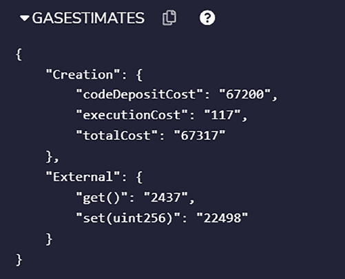

# 第 3 章 Solidity

##### 3.4.14.4 转账函数

`address.transfer` 函数：

- 向指定账户发送以 wei 计量的以太币数量；
- 如果出现错误，会回滚到之前的状态并引发异常；
- 附带 2300 gas 的 gas 补贴。

在发送以太币之前，`.transfer()` 方法会通过 `balance` 属性检查地址的可用余额。此操作在幕后完成。

##### 3.4.14.5 合约相关函数

Solidity 提供了一种高级语法，用于调用在其他合约中定义的函数（例如：`Contractx.callFunction(...)`）。然而，要使用这种高级语法，必须在编译过程开始之前先了解目标合约的接口。

`Call`、`delegatecode` 和 `staticcall` 是三种特殊的操作码，EVM 可用其与其他智能合约进行通信。EVM 总共提供四种用于此目的的特殊操作码。

##### 3.4.14.6 以太坊中的 Gas

在以太坊中，我们必须为每一次计算付费，计算量以 gas 为单位计量。以下对 gas 的定义包含在以太坊文档中：

> “Gas 是指在以太坊网络上执行特定操作所需计算工作量的计量单位。由于每笔以太坊交易都需要计算资源来执行，因此每笔交易都需要支付费用。Gas 指成功在以太坊上进行交易所需要的费用。”

##### 3.4.14.7 以太坊交易成本

由于过去（20 世纪 60 年代或 70 年代）计算机资源成本高昂，并且人们深刻意识到计算操作的成本，因此人们共享计算机。在那之后，个人计算机的推出极大地提高了计算机资源的可访问性，除非在资源严重受限的情况下，人们不再过多考虑成本问题。

由于以太坊虚拟机充当着以太坊网络的公共计算机，我们必须像过去一样考虑如何有效利用其资源。然而，由于其执行环境的分布式特性，以太坊使用的是交易费用而非分时方法。

比方说，我们创建这个合约：

```
pragma solidity 0.8.13;

contract Sample {
    uint z;

    function set(uint x) public {
        z = x;
    }

    function get() public view returns (uint) {
        return z;
    }
}
```

如果我们想查看调用 `get` 函数的 gas 费用，可以在图 3-1 中看到。该视图是通过 Remix IDE 实现的。我们将在后续章节中详细介绍，所以不必担心。



**图 3-1.** 函数的 gas 估算

对于 `set` 函数，gas 成本为 22498。

### 3.5 本章小结

在本章中，我们了解了 Solidity，即以太坊区块链所使用的语言。我们深入探讨了 Solidity 语言的不同构造和语法细节，例如类型、运算符、循环等。

在下一章中，我们将探讨钱包的概念及其工作原理和操作方式。

---

## 第 4 章：钱包与网关

用户可以通过使用钱包来管理他们在比特币或以太坊等区块链网络上的账户。有了以太坊账户，用户就可以参与以太坊区块链网络，例如在其上进行交易。

以太坊区块链上的地址是一个以 `0x` 开头的公开字母和数字字符串。由于以太坊地址由数字和字母的字符串表示，因此可以检查区块链上任何以太坊地址的余额。然而，无法确定谁控制了任何给定的地址。用户可以通过钱包（可以是软件或硬件）来控制无限数量的地址。

以太坊钱包的用户可以使用私钥在钱包内转移资金。该密钥充当以太坊钱包的控制机制。因此，这些私钥应该只有创建钱包的人知道，因为任何知道这些密钥的人都可以访问钱包中的资金。

以太坊钱包种类繁多，有些可以存储在计算机或移动设备上，有些可以通过一张纸、钛板或其他硬件离线存储。您可以选择最适合自己需求的以太坊钱包类型。

© Shashank Mohan Jain 2023

S. M. Jain，《Web3 简要介绍》[, https://doi.org/10.1007/978-1-4842-8975-4_4](https://doi.org/10.1007/978-1-4842-8975-4_4#DOI)

需要使用安全密钥（即私钥）来创建钱包。钱包可以被视为存储用户私钥和公钥的仓库。在密码学中，私钥可用于签署交易，公钥可用于验证签名者。其理念是用户自己保管私钥，并在网络上分享公钥。这样，用户就可以签署想要执行的交易，而使用其公钥的验证者可以验证她是否是这些交易的签署者。钱包通过为客户提供与链交互的统一场所和抽象层，简化了密钥管理过程。想要避免管理钱包的人可以利用第三方交易所（如币安），这些交易所代用户管理钱包。由于这些交易所大多是中心化的，其服务器一旦受损，就可能导致用户钱包受损。因此，如果您的密钥通过交易所管理的钱包存放在交易所，风险需自行承担。正如俗话所说：“你的密钥，你的钱。”从安全角度来看，将密钥保存在交易所之外始终是更明智的选择。

### 4.1 钱包类型

有些人将以太坊资产存放在面向用户设计的钱包中，而另一些人则使用加密货币交易所或其他服务，例如由面向用户钱包提供的在线市场或借贷服务。这类钱包被称为托管钱包，其特点在于它们代用户存储私钥。用户并不直接控制钱包中的资金；相反，服务代表用户管理钱包。这种安排需要成本。

他方不履行其义务的风险被称为交易对手风险。当通过使用托管钱包将资金存放于第三方时，这种风险会增加。例如，存储私钥的服务存在被黑客攻击或恶意行为的风险。

不同的用户可能会受益于使用特定类型的钱包。目前有大量钱包可供用户选择。大多数钱包使用以太坊或基于 ERC 20 标准的代币来访问区块链上的应用。这种访问是通过在区块链网络上执行智能合约形式的代码来实现的。ERC 20 是为在链上创建代币而定义的一组标准。这允许人们创建自己的代币，如果需要，这些代币可以用于他们自己的应用程序。

目前有以下几种不同类型的钱包：

1.  **移动钱包** – 例如 `bitcoin.com` 应用，它提供了一个在区块链上进行交易时使用密钥的界面。
2.  **桌面钱包** – 作为桌面应用程序安装，可以在笔记本电脑或家用电脑上使用。此类钱包的一个例子是 `electrum`。
3.  **网络扩展** – 这些是基于浏览器的扩展，允许通过浏览器访问钱包。


