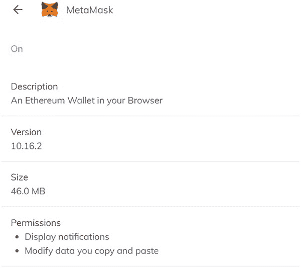
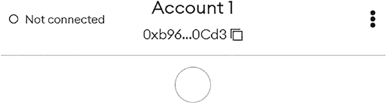
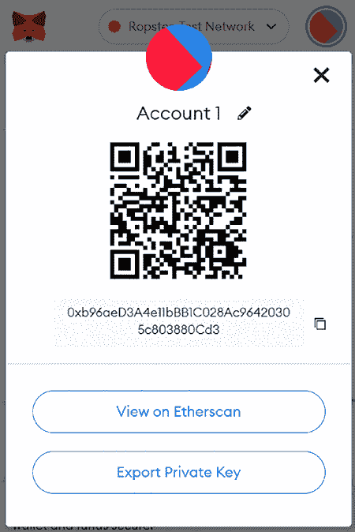
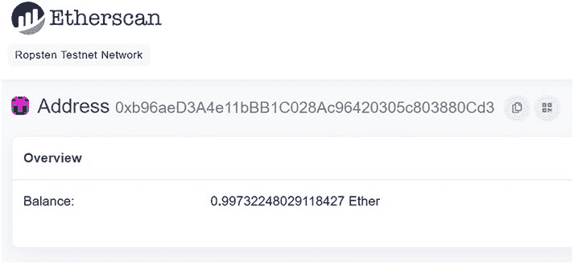
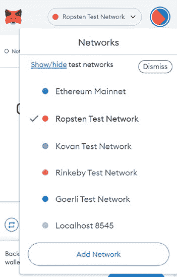
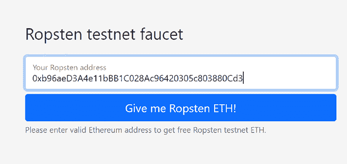

# 钱包与网关

在浏览器内。MetaMask 就是此类钱包的一个例子。

## 硬件钱包

这些是可用于安全管理钱包的物理硬件设备。这是保护密钥安全的最可靠方式。

## 第 4 章：钱包与网关

在本章中，我们将讨论 MetaMask 钱包，它可作为 Chrome 和 Brave 等浏览器的扩展程序使用。

选定钱包后，我们需要资金才能与以太坊网络进行交互。这些资金以以太币的形式存在，这是以太坊区块链上使用的加密货币。以太币可以通过 Binance 或 Coinbase 等交易所购买。

以太坊区块链上的所有交易都由节点验证，这些节点被称为验证节点。他们会收取验证交易的手续费，这笔费用（称为 gas）必须由发起特定交易的用户支付。用户可以通过多种方式，根据执行特定智能合约所需的预估资源来检查预估的 gas 费用。

由于生产环境下的以太坊网络（也称为主网）会为每笔交易收取 gas 费用，因此在主网上进行开发是不可行的。为了促进基于以太坊区块链的去中心化应用开发，有许多可用的开发网络，称为测试网，它们允许开发者使用与以太坊区块链完全相同的接口来开发应用，而无需承担真实的 gas 成本。

### 4.2 那么，什么是测试网？

当有人开始开发去中心化应用时，他们可以将其部署到测试网络上，从接口角度看，测试网络与主网络相同。这个测试网络就是所谓的测试网。这为开发者、社区以及您提供了一个在涉及真实资产之前进行测试的机会。测试网上的以太币和代币很容易获取，并且在现实世界中毫无价值。

目前有四个主要的测试网在运行，每个测试网的工作方式都与生产区块链（存放您真实以太币和代币的地方）类似。在大多数情况下，项目只会在一个测试网上开发，尽管个别开发者可能会有自己偏好或最喜欢的测试网。

1. **Ropsten** – 一个基于工作量证明的测试网区块链，与以太坊最为相似
2. **Rinkeby** – 一个由 Geth 团队发起的、基于权威证明的区块链
3. **Kovan** – 同样是一个基于权威证明的区块链
4. **Goerli** – 一个基于权威证明的测试网

要将我们的钱包连接到这些测试网中的任何一个，我们需要具备以下两样东西：

1. 在本地机器上安装一个钱包。这里我们将使用 MetaMask 作为钱包。
2. 一个像 Infura 这样的网关，使我们的钱包能够连接到这些测试网。

### 4.3 MetaMask

MetaMask 属于我们称之为分层确定性钱包（HD 钱包）家族。请参阅 [`coinsutra.com/hd-wallets-deterministic-wallet/`](https://coinsutra.com/hd-wallets-deterministic-wallet/)。

#### 4.3.1 安装

为了方便您，接下来两个步骤详细说明了 MetaMask 的安装和配置说明。之后，我们将介绍一些您应该熟悉的不同配置。

我们可以将 MetaMask 安装为 Chrome/Brave 浏览器的扩展程序。图 4-1 展示了该扩展程序在 Brave 浏览器上的样子。

***图 4-1.** Brave 浏览器上的 MetaMask 扩展程序*

通过设置一个密码，并对您共享电脑的任何其他人保密，确保只有您自己能访问您的 MetaMask 账户。

提交密码后，您将立即看到您的那组 12 个助记词。

即使他们不知道您在上一步中为账户设置的密码，任何知道这 12 个单词的人都可以登录您的账户。您绝不应该将助记词分享给您不完全信任的人。如果您忘记了密码或电脑出了状况，您将需要重新输入这 12 个单词才能重新访问您的钱包。

启动 MetaMask 钱包扩展程序后，我们在右侧看到三个堆叠的点，如图 4-2 所示。

***图 4-2.** MetaMask 钱包扩展程序*

点击这三个点，我们可以获取账户详情，如图 4-3 所示。

***图 4-3.** MetaMask 钱包的账户详情*

我们可以通过点击“在 Etherscan 上查看”按钮来在 Etherscan 上查看账户，如图 4-4 所示。

***图 4-4.** 以太坊区块链浏览器的账户视图*

点击下拉菜单以显示可用网络，如图 4-5 所示。

***图 4-5.** MetaMask 钱包可用的网络*

在我们从测试网向钱包添加资金之前，我们需要了解 MetaMask 如何实现与这些测试网的连接。

一种选择是自行运行一个测试网节点，然后将钱包连接到该节点。另一种选择是通过托管测试网进行连接。

有一些测试网的托管服务提供商。这里，我们讨论其中一个，称为 Infura。

Infura 是一个基础设施即服务（IaaS）和 Web3 后端提供商，为区块链开发者提供各种服务和工具。

这包括 Infura 平台的应用程序编程接口（API）套件。Infura Web3 服务的核心是其旗舰产品 Infura 以太坊 API。然而，与星际文件系统（IPFS）和 Filecoin 的通信目前也正在开发中。话虽如此，某些 Infura 的替代品目前提供了比 Infura 本身更广泛的跨链连接能力。尽管以太坊是目前发布去中心化应用最流行的可编程区块链，但许多区块链开发者目前仍在寻找 Infura 的替代品。这发生在币安智能链（BSC）和 Polygon 网络（原 Matic 网络）日益广为人知的情况下。

Infura 网关的高级架构如图 4-6 所示。

***图 4-6.** Infura 架构*

在图 4-6 的左侧，我们看到钱包通过 HTTPS 或 WebSockets 连接到 Infura 基础设施。Infura 则提供与区块链网络（如以太坊主网或测试网）的连接。Infura 充当钱包通往区块链世界的网关。

使用 Infura 以太坊 API 的用户能够将更多时间和资源投入到进行市场研究和产品开发等活动中。此外，用户还可获得一个简单易用的仪表板，从而更深入地了解应用的运行状况。利用该仪表板可以轻松进行应用分析和配置。此外，开发者还可以追踪使用时间。

