# 排版后的内容

各类请求类型的有效性，以及更多其他内容。这些洞察使开发者能够通过更深入地了解应用程序的用户来改进他们的程序。此外，Infura 以太坊 API 既兼容测试网也兼容主网，并且使用通过 HTTPS 和 WSS 传输的、与客户端兼容的 JSON-RPC。用户还可以获得作为附加功能提供的以太坊存档节点数据的访问权限。

Infura 是 MetaMask 使用的默认节点提供商，不过用户可以选择切换到其他节点提供商，甚至自己托管节点。

现在让我们向 MetaMask 钱包中添加一些资金。

在本例中，我们将使用 Ropsten 测试网进行一些实验。

导航至 [`faucet.egorfine.com/`](https://faucet.egorfine.com/)。

我们会看到一个类似图 4-7 所示的界面。

***图 4-7.** Ropsten 测试网水龙头*

在地址字段中，我们需要填入从 MetaMask 钱包获取的公钥。点击 *给我 Ropsten ETH！* 按钮后，我们会看到如图 4-8 所示的结果。

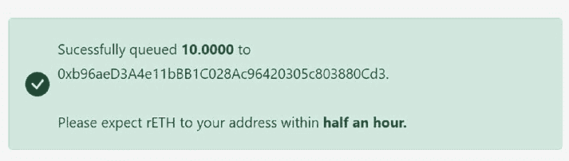

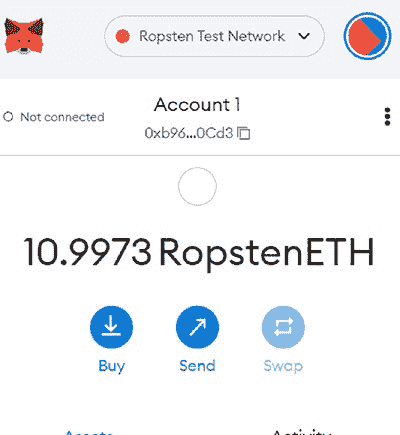

***图 4-8.** ETH 添加到钱包的确认信息*

我们可以检查 MetaMask 钱包，看看资金是否已到账，如图 4-9 所示。

***图 4-9.** MetaMask 钱包视图。显示已存入钱包的 Ropsten ETH*

可以看到我的钱包里有 10.9973 ETH，其中 0.9973 是之前就有的余额。

我们将查看 Etherscan 来确认这笔交易。我们会看到如图 4-10 所示的界面。

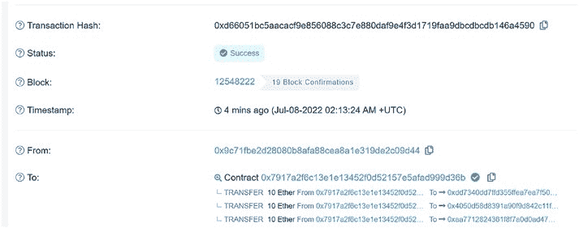

***图 4-10.** Etherscan 交易视图*

可以看到，我的账户在 Ropsten 网络上收到了 10 个以太币。

当我们创建智能合约并调用其函数时，会用到这些资金。我们已经在上一章讨论过 Gas 费用。

首先，我们将创建一个简单的网页，使用 `web3.js` 库通过 Infura 连接到测试网。下面我们先简单介绍一下 `web3.js`。

### 4.4 Web3.js

可以通过基于 HTTP 的协议来使用以太坊 API。

因此，我们可以创建 HTTP 客户端，从而与以太坊网络（主网或测试网）进行交互。为简化开发流程，以太坊基金会创建了一个 JavaScript 库，允许我们以编程方式访问以太坊区块链。他们将这个库命名为 `web3.js`，顾名思义，它是用于基于 web3 的应用程序，并且该库本身是用 JavaScript 编程语言编写的。

这个库包含不同的模块，将在接下来的小节中予以介绍。

#### 4.4.1 web3-eth

`web3.js` 的用户能够通过 `web3-eth` 模块连接到以太坊区块链，该模块提供了实现此功能的方法。

更具体地说，这些方法能够与智能合约、由其他方控制的账户、节点、已挖掘的区块以及交易进行通信。

使用 `web3-eth` 库提供的方法，用户可以对交易进行签名，检查以太坊钱包中的余额，以及通过互联网将已签名的交易发送到以太坊区块链。

#### 4.4.2 web3-shh

如果使用 `web3-shh` 模块，你将能够与 Whisper 协议进行交互。Whisper 是一种消息传递协议，旨在促进消息的轻松广播以及低级别、异步的数据传输。以下是两个说明这一点的实例：

1. 当调用 `web3.shh.post` 时，网络会收到一条 Whisper 消息。
2. 除了发送消息，用户还可以使用 `web3.shh.subscribe` 方法来订阅消息。这使得用户能够从网络接收消息。

#### 4.4.3 web3-bzz


进入`/path/to/xxx`目录，找到`xxx.json`。

在表达式`cvar = avar + bvar`中，加法运算符（`+`）将`avar`与`bvar`相加，得到它们的和`cvar`。

在`List.of(arg0, arg1, arg2)`中，`List`接口的工厂方法`of()`接受一系列的元素，返回包含它们的只读列表。

之后我们这样调用`cmd`命令：`cmd arg0 arg1 arg2`。

```
if (condVar > someVal) {console.log("xxx")}
```

---

清晰了解区块链上存储的数据类型符合用户利益。通常，我们只在链上存储交易数据。

其他数据，如文档、图片、视频等，并不存储在区块链上。我们可以使用像`Swarm`、`ipfs`等去中心化存储服务来满足这些需求。不过，我们可以将对这些内容的引用存储在区块链上。这正是`web3-bzz`模块的作用所在。它为我们提供了一个基于库的抽象，用于与`Swarm`通信。

我们可以使用`web3.bzz.upload`和`web3.bzz.download`方法将图片、文档、视频和音频片段上传到`Swarm`网络，或从其中下载。

#### 4.4.4 web3-net

如果你使用`web3-net`模块，你将能够与以太坊节点的网络属性进行交互。通过`web3-net`模块，你可以获取节点的信息。该模块允许我们提取关于以太坊节点本身的元数据。例如，可以通过调用`web3.net.getID`获取网络 ID，而使用`web3.net.peerCount`将返回连接到特定节点的对等节点数量。

#### 4.4.5 web3-utils

`web3-utils`模块允许我们使用该库模块中定义的一些实用函数。`web3-utils`中包含一系列实用函数，可用于搜索数据库、转换数字以及检查某个值是否满足给定条件。以下是三个说明性的例子：

1. `web3.utils.toWei`是一个从`wei`转换为`ether`的转换器。
2. `web3.utils.hex`通过`ToNumberString`函数将十六进制值转换为字符串。
3. `web3.utils.isAddress`函数判断给定字符串是否表示一个有效的以太坊地址。

### 4.5 Infura 设置

由于我们使用`Infura`作为网关，因此需要配置`Infura`端点，以便在我们的应用程序中使用。

为了访问`Infura`网络，首先要做的是注册一个`Infura`账户并获取`API`密钥。我们可以访问`https://infura.io`来使用`Infura`。

请访问`Infura`网站为自己创建一个新账户。

打开账户创建页面时，你将看到如图 4-11 所示的界面。


**图 4-11.** Infura 账户创建页面

下一步是进入仪表盘页面，点击“创建新项目”按钮。为你的项目命名，然后点击“创建”按钮，如图 4-12 所示。

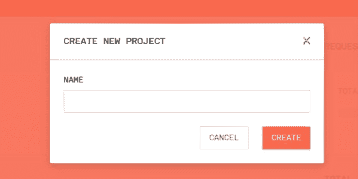

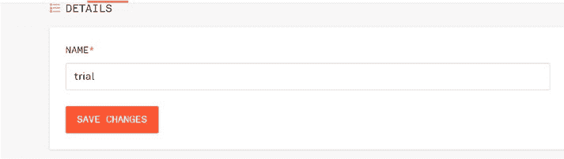

**图 4-12.** 创建新项目界面

我创建了一个名为`trial`的项目，如图 4-13 所示。

**图 4-13.** 创建名为 trial 的项目

接下来，我们获取项目 ID 和项目密钥，如图 4-14 所示。

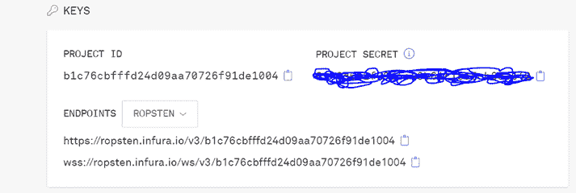

**图 4-14.** 我们创建的 Infura 项目的密钥

由于我使用的是`Ropsten`网络，我选择端点作为`Ropsten`。

我们得到两个端点：

1. 基于 HTTPS
2. 安全的 Web Socket

#### 4.5.1 通过 Infura 网关与 Ropsten 网络交互

请复制 HTTPS 端点 URL。请记住，此 URL 包含你的项目 ID。我们将在接下来创建的 HTML 页面中使用此 URL。

创建目录`web3`，并进入该目录。

在`web3`目录下，创建一个 HTML 页面。将以下内容复制到此 HTML 页面中：

```html
<html>
<header>
<title>Sample Infura connectivity check</title>
<script
  //导入 web3.js 库
  src="https://cdn.jsdelivr.net/gh/ethereum/web3.js@1.0.0-beta.36/dist/web3.min.js" 
  integrity="sha256-nWBTbvxhJgjslRyuAKJHK+XcZPlCnmIAAMixz6EefVk=" 
  crossorigin="anonymous">
</script>
<script src="https://code.jquery.com/jquery-3.4.1.min.js"
```


好的，作为一名高级文档工程师和翻译员，我将严格按照您的注意事项和示例格式，将提供的英文文本翻译为中文。


```html
`integrity="sha256-CSXorXvZcTkaix6Yvo6HppcZGetbYMGWSFlBw8HfCJo="`

`crossorigin="anonymous"></script>`

```html
<script>
if (typeof web3 !== 'undefined') {
web3 = new Web3(web3.currentProvider);
} else {
// Set the provider you want from Web3.providers
//see the ropsten url is the one we copied from infura web3 = new Web3(new Web3.providers.HttpProvider("https://ropsten.infura.io/v3/b1c76cbfffd24d09aa70726f91de1004"));
}
</script>
```

```html
</header>
<body>
<div>
//get the last block on the ropstentestnet
<h2>Latest Block</h2><span id="lastblock"></span>
</div>
```

``

## 第 4 章 钱包与网关

```html
<script>
web3.eth.getBlockNumber(function (err, res) { if (err) console.log(err)
$( "#lastblock" ).text(res)
})
</script>
```

```html
</body>
</html>
```

在浏览器中加载此页面后，我们得到以下输出：我们看到的响应如图 4-15 所示。

**图 4-15.** 通过 web3 库获取最新区块

这意味着我们的测试成功通过 Infura 网关连接到了 Ropsten 测试网。

我们修改以下 HTML 文件以提取更多信息，例如 ETH 余额和节点信息：

```html
<html>
<header>
<title>Sample Infura connectivity check</title>
<script
Chapter 4 Wallets and GateWays
src="https://cdn.jsdelivr.net/gh/ethereum/web3.js@1.0.0-beta.36/dist/web3.min.js" integrity="sha256- nWBTbvxhJgjslRyuAK
JHK+XcZPlCnmIAAMixz6EefVk=" crossorigin="anonymous"></script>
<script src="https://code.jquery.com/jquery-3.4.1.min.js"
integrity="sha256-CSXorXvZcTkaix6Yvo6HppcZGetbYMGWSFlBw8HfCJo="
crossorigin="anonymous"></script>
<script>
if (typeof web3 !== 'undefined') {
web3 = new Web3(web3.currentProvider);
} else {
// Set the provider you want from Web3.providers
web3 = new Web3(new Web3.providers.HttpProvider("https://ropsten.infura.io/v3/b1c76cbfffd24d09aa70726f91de1004"));
}
</script>
</header>
<body>
<div>
<h2>Latest Block</h2><span id="lastblock"></span>
<h2>My balance</h2><span id="balance"></span>
<h2>node information</h2><span id="nodeInfo"></span>
</div>
<script>
Chapter 4 Wallets and GateWays
web3.eth.getBlockNumber(function (err, res) { if (err) console.log(err)
$( "#lastblock" ).text(res)
})
web3.eth.getBalance("0xb96aeD3A4e11bBB1C028Ac96420305c803880Cd3", function (err, res) { if (err) console.log(err) $( "#balance" ).text(res)
})
web3.eth.getNodeInfo(function (err, res) { if (err) console.log(err)
$( "#nodeInfo" ).text(res)
})
</script>
</body>
</html>
```

在浏览器中加载此文件将得到如图 4-16 所示的输出。

``

## 第 4 章 钱包与网关

**图 4-16.** 显示区块信息和余额信息

我们通过浏览器展示的相同功能，可以使用 `nodejs` 作为基于 JavaScript 的应用服务器来实现。

### 4.6 本章小结

在本章中，我们了解了不同类型的钱包及其工作原理。

我们详细介绍了 MetaMask 钱包的工作方式。我们还了解了网关的工作原理及其在 `web3` 世界中的用途。

在下一章中，我们将探讨如何使用 Remix IDE（一个基于浏览器的环境）来编译和部署智能合约。

# 第 5 章

# Remix IDE 简介

为了开发智能合约并管理这些合约的生命周期（如编译、测试、部署和更新），我们需要一个集成开发环境 (IDE)。有许多可用的选项。Remix IDE 是一个基于 Web 的 IDE（这意味着它不需要安装任何软件）。Remix 配备了一套完整的开发和部署工具，用于开发和管理智能合约的生命周期。

在本章中，我们将向您介绍 Remix IDE，并了解它如何帮助创建和管理智能合约的生命周期。

### 5.1 Remix IDE

Remix IDE 提供了一个基于浏览器的环境，用于在区块链网络上创建、编译、测试和部署基于以太坊的智能合约。实际上，使用 Remix IDE 是小菜一碟！在本章中，我们将介绍如何利用它。


# Remix IDE

Remix IDE 的布局分为不同面板，每个面板都有不同的用途，如图 5-1 所示。

© Shashank Mohan Jain 2023

S. M. Jain 著，《Web3 简介》[，https://doi.org/10.1007/978-1-4842-8975-4_5](https://doi.org/10.1007/978-1-4842-8975-4_5#DOI)

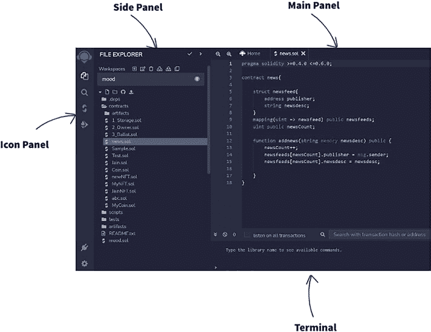

**图 5-1.** *展示 Remix IDE 的不同部分*

1. **图标面板** – 显示编译、运行和部署智能合约等功能对应的不同图标。
2. **侧面板** – 显示文件资源管理器，我们可以在其中创建基于 Solidity 的智能合约。
3. **主面板** – 专用于编辑文件。我们将在本章后续部分展示示例。
4. **终端** – 在此处查看各种命令的执行结果。你可以直接从终端运行自定义脚本。

## Remix IDE 入门

我们将逐一介绍构成 Remix IDE 的每个组件。我们将创建一个简单的智能合约，然后对其进行编译，并使用 MetaMask 将其部署到 Ropsten 测试网络上。别担心：我们将逐步引导你完成编写智能合约的整个过程。

我们创建的智能合约有两个简单功能：
1. 设置一条你选择的消息。这将把消息存储在 Ropsten 网络上。
2. 检索该消息。

要创建这些智能合约，我们需要了解 Solidity 和 MetaMask，以及 Remix IDE。我们已经在之前的章节中学习了 Solidity 和 MetaMask 的工作原理。现在，让我们开始吧。

通过 Remix IDE 创建任何智能合约至少包含三个基本步骤：
1. 使用 Solidity 编写智能合约。
2. 编译合约。
3. 部署合约。

要创建合约，请导航至 [`remix.ethereum.org/`](https://remix.ethereum.org/) 上的 Remix IDE，如图 5-2 所示。

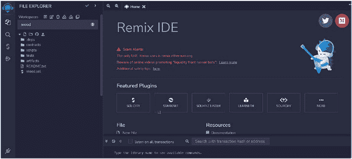

**图 5-2.** *Remix IDE 的主页*

在默认工作区下，我们看到一个名为 `contracts` 的文件夹。右键单击它，然后单击**新建文件**。

我创建了一个名为 `Test.sol` 的文件，如图 5-3 所示。

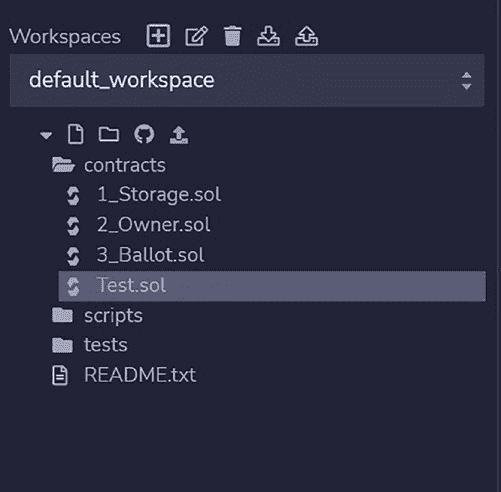

**图 5-3.** *创建一个名为 `Test.sol` 的新文件（`.sol` 是 Solidity 的文件扩展名）*

将代码清单 5-1 中的代码复制到右侧窗口中。

***代码清单 5-1.*** *简单智能合约的代码*

```solidity
pragma solidity 0.8.5;

contract Test{

    // 用于保存消息的状态变量
    string private message;

    // 将消息初始化为 "Hello!!"。
    constructor() public {
        message = "Welcome";
    }

    /** @dev 用于设置新消息的函数。
     * @param newMessage 新的消息。
     */
    function setMessage(string memory newMessage) public {
        message = newMessage;
    }

    /** @dev 用于返回消息的函数。
     * @return 消息字符串。
     */
    function getMessage() public view returns (string memory) {
        return message;
    }

}
```

正如我们所看到的，这会使用 Solidity 语言创建一个名为 `Test` 的合约。该合约有两个函数：
1. `setMessage()`
2. `getMessage()`

## 编译合约

现在是时候编译合约了，如图 5-4 所示。

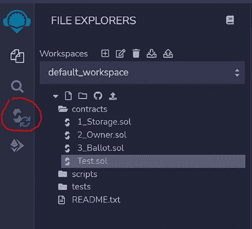

**图 5-4.** *通过单击**编译**按钮（红色圆圈所示）来编译 `Test.sol` 文件*

单击突出显示的红色按钮。我们将看到如图 5-5 所示的屏幕。

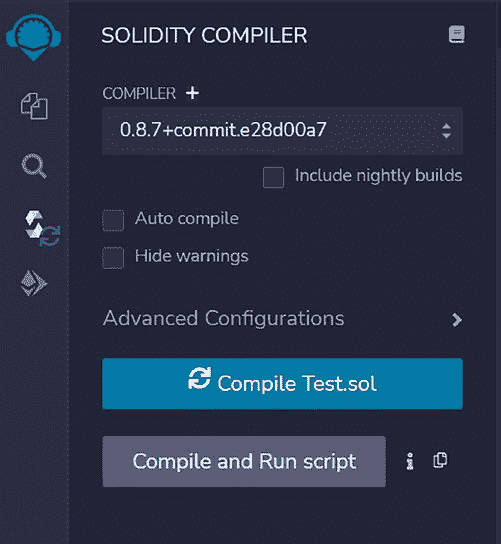

**图 5-5.** *智能合约的编译画面*

单击**编译 Test.sol** 按钮，将出现如图 5-6 所示的画面。

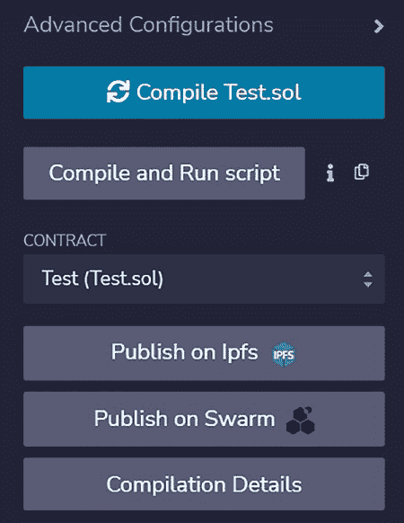

**图 5-6.** *已编译的 `Test.sol`*

单击**编译详情**按钮，以探索合约和环境的各个方面，如图 5-7 所示。


# 第 5 章 Remix IDE 简介

***图 5-7.** 查看编译器版本和语言*

智能合约编译完成后，我们需要进行部署。点击图 5-8 中红色高亮显示的按钮。

***图 5-8.** 红色圆圈标注的部署按钮*

点击`部署`按钮后，界面将如图 5-9 所示。

***图 5-9.** 选择部署环境*

如图 5-10 所示，我们可以从多个部署环境中选择。

***图 5-10.** 智能合约的不同部署环境*

在我们的操作中，需要选择`注入的 Web3`环境，该环境将连接至`MetaMask`钱包，用于签名交易和支付燃料费。

选择`注入的 Web3`环境后，我们将看到`Ropsten`网络，这是我们为`MetaMask`钱包选择的网络。如图 5-11 所示。

***图 5-11.** 选择 Ropsten 测试网络进行部署*

在图 5-11 中，我们还可以看到另外两个显示区域。“账户”指我们通过`MetaMask`创建的账户，“燃料限制”是通过`Remix`执行交易时允许的最大燃料量。

现在，我们点击`部署`按钮。这将打开`MetaMask`钱包（我们将`MetaMask`部署为 Brave 浏览器扩展），如图 5-12 所示。

***图 5-12.** MetaMask 钱包弹出，确认支付部署燃料费*

我们可以看到本次交易需支付的燃料费用（以以太币计）。

确认交易后，即可将其发布到`Ropsten`测试网。

我们可以在`Etherscan`上查看交易状态，如图 5-13 所示。

***图 5-13.** Etherscan 上部署交易的视图*

如图所示，交易最初处于`待处理`状态。同时，`来自`字段中的密钥是我的账户公钥。我们也可以打开`MetaMask`上的账户详情来验证该密钥，如图 5-14 所示。

***图 5-14.** MetaMask 钱包显示公钥，可在 Etherscan 上验证*

几秒钟后，交易在`Ropsten`测试网上得到确认。详情如图 5-15 所示。

***图 5-15.** Etherscan 上部署交易的视图（已完成状态）*

我们现在还能看到一个`收件人`字段。此字段对应的是合约地址。

请记住，在第[3 章](https://doi.org/10.1007/978-1-4842-8975-4_3)中我们讨论过两种类型的地址。这就是合约地址。

我们也可以在`Remix IDE`中验证这一点，如图 5-16 所示。

***图 5-16.** Remix IDE 上的合约函数*

除了合约地址，`Remix IDE`还提供了调用这些合约的方法。

接下来，让我们调用刚部署的智能合约中的`setMessage`函数。

在文本框中设置消息后，界面将如图 5-17 所示。

***图 5-17.** 输入消息以调用智能合约函数*

点击`setMessage`按钮后，`MetaMask`钱包将再次打开，允许我们签名交易并支付燃料费。

我们可以由图 5-18 查看费用金额等信息。

***图 5-18.** MetaMask 钱包显示燃料费详情*


***图 5-18.** 调用智能合约 `setMessage` 函数消耗的 Gas*

现在我们将在 MetaMask 中确认这笔交易。我们可以在 Etherscan 上查看交易详情，如图 5-19 所示。

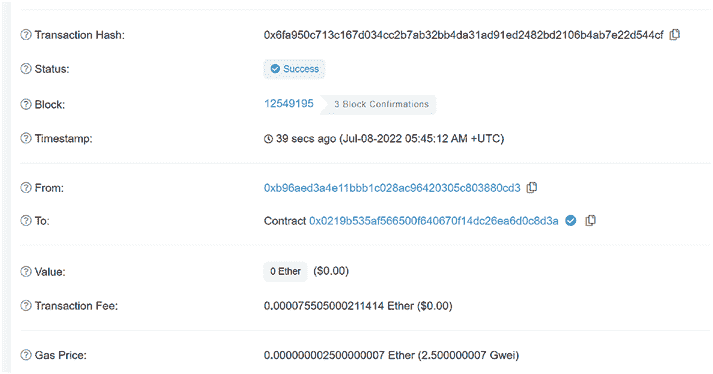

**第 5 章 Remix IDE 简介**

***图 5-19.** Etherscan 上智能合约函数调用交易的视图*

关于刚刚展示的数字，有几点需要记住。

交易所使用的 Gas 数量以每笔交易消耗的 Gas 单位来计量。而这一数量反映了交易的复杂程度。它取决于智能合约所使用的操作数量以及存储空间大小。

你愿意为每个 Gas 单位支付的价格被称为每单位 Gas 价格。你的交易将因此以不同的速度被处理。这一过程被称为优先 Gas 拍卖（PGA），这意味着所有交易都在参与一场拍卖，以决定哪些矿工将有机会将他们的交易纳入即将被挖掘的区块中。

用于支付交易费用的 ETH 金额通过以下公式计算：

`交易费用 = 消耗的 Gas 单位 × 每单位 Gas 价格`

**第 5 章 Remix IDE 简介**

通过点击 `getMessage` 按钮调用 `getMessage` 函数，在 Remix IDE 控制台中会得到以下输出：

```
{
  "0": "string: hello Web3"
}
```

这正是我们在链上设置的消息。

### 5.2 创建自己的代币

现在，凭借对 Solidity、MetaMask 和 Remix 的了解，我们将转向以太坊区块链上一个更具体的应用示例。

你可能曾无数次幻想并渴望拥有自己的加密货币。随着 ERC-20 标准的发展，创建自己的代币并非难事。我们将在本节中详细探讨。

ERC 是“以太坊征求意见稿”的缩写，其中的数字 20 是提案的标识符。ERC-20 的开发旨在改进 ETH 网络。

ERC-20 是在以太坊区块链上为去中心化应用创建代币的标准。所有基于以太坊的代币都必须遵循 ERC-20 标准，该标准为创建这些代币提供了一套规则。

根据 ERC-20 的定义，代币是基于区块链的资产，可以发送和接收，并具有价值。在很大程度上，ERC-20 代币类似于比特币和莱特币等加密货币，区别在于 ERC-20 代币仅在以太坊区块链网络上运行。

在 ERC-20 标准制定之前，任何想要创建自己代币的人都必须从零开始，这导致了大量不同类型代币的出现。之所以如此，是因为当时没有开发新代币的具体指南或结构。添加新型代币要求钱包和交易平台的开发者阅读并理解每种代币的源代码，然后才能在其各自平台上使用这些代币。这是一个尤为艰巨的过程。不言而喻，在任何程序中集成新代币都相当具有挑战性。钱包可以集成基于 ERC-20 的代币到其平台，并允许通过这些应用使用此类代币。ERC-20 代币标准几乎使得不同代币之间的交互变得简单且无缝。

该标准规定了智能合约必须实现的九个功能，以及三个可选实现的功能，其中包括：

- `totalSupply` – 该函数指定了该代币的总供应量。一旦达到最大容量，便无法再生成更多的代币。


- `balanceOf` – 此函数在调用时返回特定钱包的余额。我们将展示如何从 Remix IDE 调用它。
- `transfer` – 此函数将代币转移到特定地址。在这种情况下，代币从发送者地址中扣除。
- `transferFrom` – 此函数将代币从一个用户地址转移到另一个用户地址。这里，供应中的可用代币数量保持不变，但这是两个账户之间的转移。
- `approve` – 此函数根据代币的总量，判断智能合约是否允许向用户分配特定数量的代币。

## 第 5 章 Remix IDE 简介

- `allowance` – 此函数检查转让人地址是否有足够的代币可转移给受让人。

简单来说，`ERC-20` 提供了允许在以太坊区块链上创建代币的规范或接口。

打开 Remix IDE，在 `Contract` 目录下创建一个文件，并将其命名为 `Jain.sol`。

将代码从 `Listing 5-2` 复制到文件 `Jain.sol` 中。

***Listing 5-2.*** 基于 ERC-20 规范创建自定义代币的代码

```solidity
// this is the ERC-20 interface which we will implement to create our own coin

pragma solidity 0.8.5;

interface ERC20Interface {

    function totalSupply() external view returns (uint);

    function balanceOf(address tokenOwner) external view returns (uint balance);

    function allowance(address tokenOwner, address spender) external view returns (uint remaining);

    function transfer(address to, uint tokens) external returns (bool success);

    function approve(address spender, uint tokens) external returns (bool success);

    function transferFrom(address from, address to, uint tokens) external returns (bool success);

    event Transfer(address indexed from, address indexed to, uint tokens);

    event Approval(address indexed tokenOwner, address indexed spender, uint tokens);

}
```

## 第 5 章 Remix IDE 简介

```solidity
// implementation code for ERC20 interface
//here we create a smart contract named JainToken

contract JainToken is ERC20Interface {

    string public myTokenSymbol;
    string public myTokenName;
    uint8 public tokenDecimals;
    uint public _totalSupplyOfToken;

    mapping(address => uint) tokenBalances;
    mapping(address => mapping(address => uint)) allowed;

    //this is where we initialize our token with total supply, name etc
    constructor() public {
        myTokenSymbol = "JAIN";
        myTokenName = "Shashank Jain Coin";
        tokenDecimals = 2;
        _totalSupplyOfToken = 200000;
        tokenBalances[msg.sender] = _totalSupplyOfToken;
        emit Transfer(address(0), msg.sender, _totalSupplyOfToken);
    }

    // function to return the supply at any point in time.
    function totalSupply() public override view returns (uint) {
        return _totalSupplyOfToken - tokenBalances[address(0)];
    }

    //function to check balance of tokens at a specific address
    function balanceOf(address tokenOwner) public override view returns (uint balance) {
        return tokenBalances[tokenOwner];
    }
```

## 第 5 章 Remix IDE 简介

```solidity
    // function for transferring tokens to a specific address.
    function transfer(address to, uint tokens) public override returns (bool success) {
        //checks if there is enough balance in the sender address
        require(tokens <= tokenBalances[msg.sender]);
        //deduct tokens from the sender
        tokenBalances[msg.sender] = tokenBalances[msg.sender]-tokens;
        // add tokens to the recipient address
        tokenBalances[to] = tokenBalances[to] + tokens;
        // once transfer is done emit a message
        emit Transfer(msg.sender, to, tokens);
        return true;
    }

    function approve(address spender, uint tokens) public override returns (bool success) {
        allowed[msg.sender][spender] = tokens;
        emit Approval(msg.sender, spender, tokens);
        return true;
    }

    // this is same as approve but here we can specify from address which can be different from message sender
    function transferFrom(address from, address to, uint tokens) public override returns (bool success) {
        require(tokens <= tokenBalances[from]);
        tokenBalances[from] = tokenBalances[from]-tokens;
        require(tokens <= allowed[from][msg.sender]);
```


`allowed[from][msg.sender] = allowed[from][msg.sender] - tokens;`

## 第 5 章：Remix IDE 简介

```solidity
uint c = 0;
c = tokenBalances[to] + tokens;
require(c >= tokenBalances[to]);
emit Transfer(from, to, tokens);
return true;
}

// 检查代币拥有者是否被授权进行转账
function allowance(address tokenOwner, address spender) public override view returns (uint remaining) {
    return allowed[tokenOwner][spender];
}

fallback() external payable {
    revert();
}
```

该代币的名称为 Shashank Jain Coin，其符号为 JAIN。我们将供应量固定为 200000。

编译并部署合约。记得选择 **Injected Web3** 作为环境来连接 MetaMask，如图 5-20 所示。

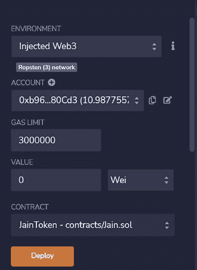

**图 5-20.** Remix IDE 显示部署界面

它会在 MetaMask 中请求批准交易，如图 5-21 所示。

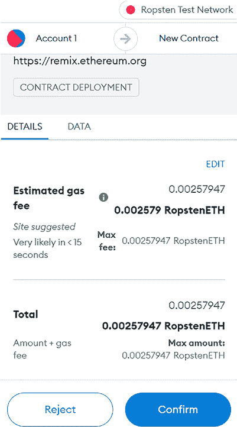

**图 5-21.** MetaMask 在部署时弹出并请求确认

一旦我们确认，就可以在 Etherscan 中看到交易，如图 5-22 所示。

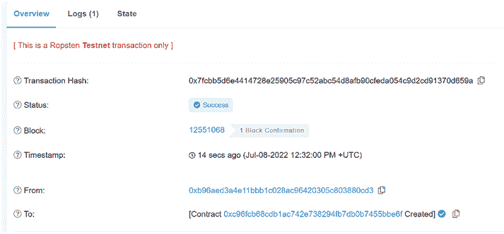

**图 5-22.** 刚刚完成交易的 Etherscan 视图

`https://ropsten.etherscan.io/tx/0x7fcbb5d6e4414728e25905c97c52abc54d8afb90cfeda054c9d2cd91370d659a`

从**目标地址**字段复制合约地址。在我的例子中是 `0xc96fcb68cdb1ac742e738294fb7db0b7455bbe6f`。

现在我们导航回 Remix IDE 并打开合约，如图 5-23 所示。

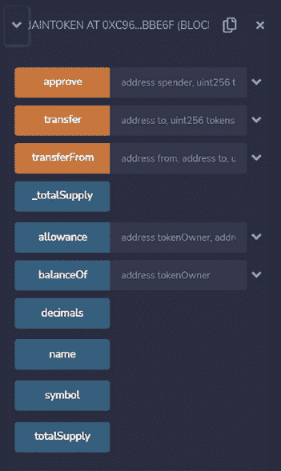

**图 5-23.** 已部署合约的 Remix 视图

如果你部署了多个合约，请确保根据合约地址选择正确的合约。

我们调用的第一个函数是检查代币余额。由于代币拥有者账户就是创建合约的账户，我们将从 MetaMask 复制账户地址。打开 MetaMask，如图 5-24 所示。

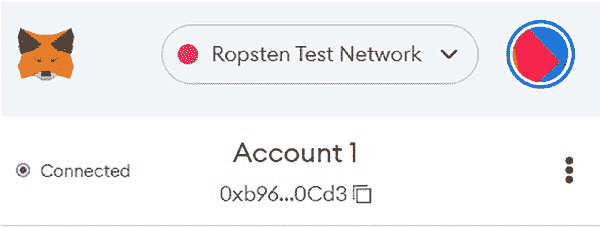 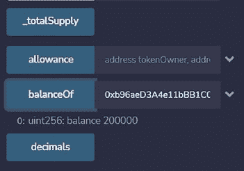

**图 5-24.** MetaMask 显示账户信息

我的例子中拥有者地址是 `0xb96aeD3A4e11bBB1C028Ac96420305c803880Cd3`。

我们现在使用 Remix IDE 中已部署合约的 API 来检查此账户的余额，如图 5-25 所示。

**图 5-25.** 输入地址以检查余额

我们可以看到，此账户中的代币数量与我们创建和部署合约时编程设定的数量一致。

接下来，我们将一些代币从此账户转移到另一个账户。我已在 MetaMask 中创建了另一个名为“test”的账户，如图 5-26 所示。

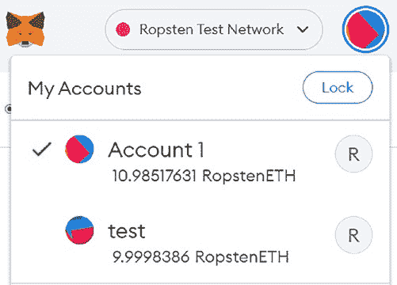

**图 5-26.** MetaMask 显示我的两个账户

得到“test”账户的地址为 `0x1A703B299d764B4e28Dc2C7849CFeDF9979D2430`。

现在我们将使用 Remix IDE 中的 API 向此地址转账 100 个代币。

由于我们将小数位数保留为两位，显示的代币数量将为 `tokens/10²`，也就是 `tokens/100`。因此，当我们转账 100 个代币时，显示为 1 个 JAIN 代币。我们可以在图 5-27 中看到已部署合约的转账函数。

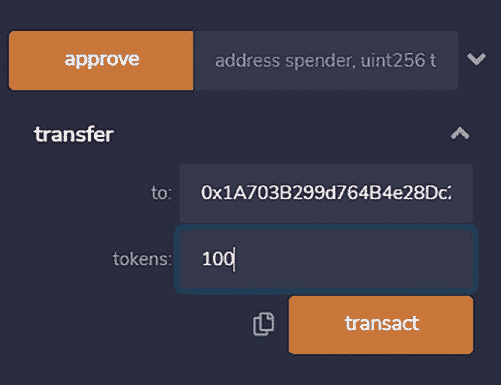

**图 5-27.** 已部署合约转账函数的 Remix 视图

点击**交易**按钮。MetaMask 会弹出请求批准，如图 5-28 所示。

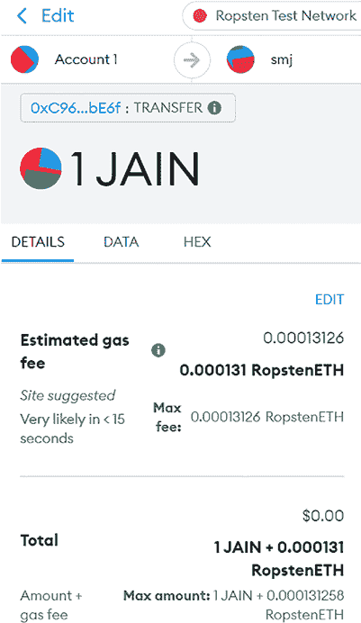


***图 5-28.** MetaMask 中的转账交易视图* 该交易请求转移 1 个 `JAIN` 代币。

我们确认该交易。

现在，为了在 MetaMask 中显示我们的 ERC 代币，请点击“资产”选项卡，如图 5-29 所示。

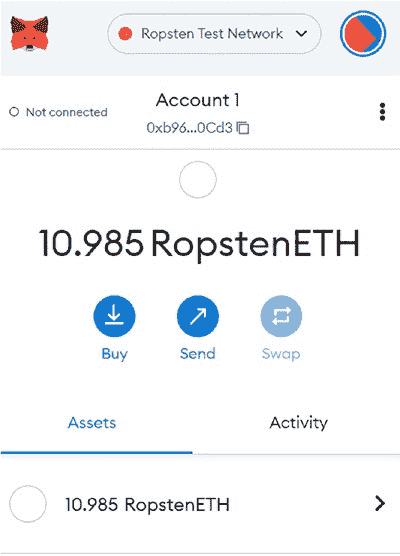

第 5 章 Remix IDE 简介

***图 5-29.** MetaMask 账户视图*

在“资产”选项卡中，我们需要点击“导入代币”按钮。粘贴代币合约地址。粘贴后，“代币符号”字段会自动填充，如图 5-30 所示。

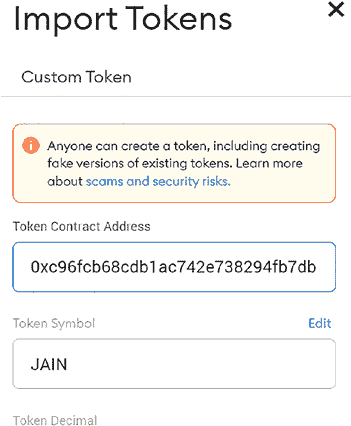

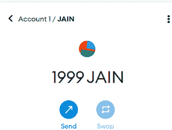

第 5 章 Remix IDE 简介

***图 5-30.** 导入我们的代币（JAIN 代币）* 现在我们将看到 JAIN 代币的余额，如图 5-31 所示。

***图 5-31.** 账户 1 中的 JAIN 代币余额*

接下来，我们导航到接收方账户，检查 JAIN 代币是否到账。我们仍需要在测试账户中导入 JAIN 代币。导入完成后，我们可以在测试账户中看到余额，如图 5-32 所示。

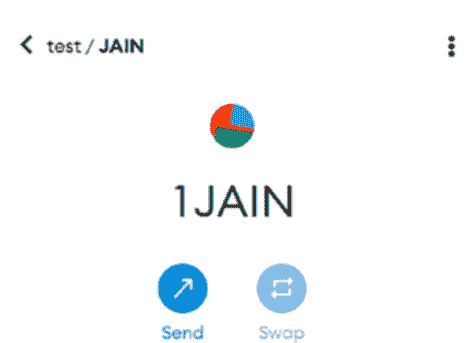

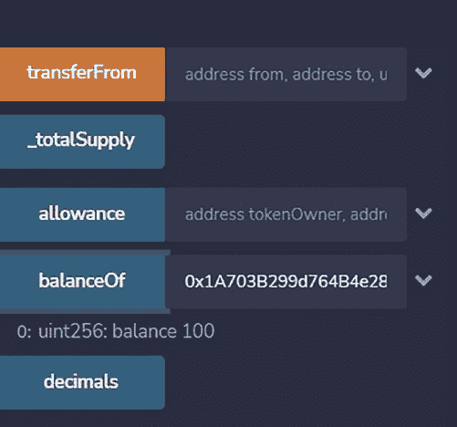

第 5 章 Remix IDE 简介

***图 5-32.** 显示 1 个 JAIN 代币已到达测试账户* 现在我们看到测试账户已收到 1 个 JAIN 代币。

我们返回 Remix IDE，并在此检查余额，如图 5-33 所示。

***图 5-33.** 测试账户中的余额*

我们在 Remix IDE 中看到余额为 100。

第 5 章 Remix IDE 简介 **5.3 本章小结**

在本章中，我们向读者介绍了 Web3 应用的概念。

我们学习了 Remix IDE，以及一个简单的 Web3 应用示例——通过 MetaMask 钱包在 Ropsten 测试网上部署的 ERC-20 代币。

在下一章中，我们将向读者介绍 Truffle，这是另一个用于 DApp 开发的集成开发环境。

**第 6 章**

**Truffle**

到目前为止，我们已经了解了如何使用 Remix 集成开发环境（IDE）来创建智能合约、编译合约，并将合约部署到区块链网络中。在我们的示例中，我们将合约部署到了 Ropsten 测试网络。除了 Remix 之外，还有一些独立的框架允许我们创建、编译、测试和部署合约。Truffle 就是其中一种可用的框架。

**6.1 安装 Truffle**

在使用 Truffle 之前，我们需要安装以下软件。我们将在一台 Windows 机器上进行安装，但在 Linux 系统上的步骤类似。

**6.1.1 安装 Node**

从以下链接安装 `node.js`（版本 16.16.0）：https://nodejs.org/en/download/

这将一并安装 `npm` 8.11.0。

© Shashank Mohan Jain 2023

S. M. Jain，*A Brief Introduction to Web3*[，https://doi.org/10.1007/978-1-4842-8975-4_6](https://doi.org/10.1007/978-1-4842-8975-4_6#DOI)

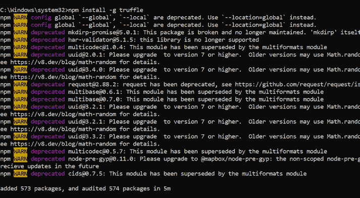

第 6 章 Truffle

**6.1.2 安装 Truffle**

Node 包管理器（NPM）是安装 Truffle 的最佳方式。在你的电脑上安装 NPM 后，打开终端并输入以下命令来安装 Truffle：

```
npm install --global windows-build-tools@4.0.0
```

```
npm install -g truffle
```

运行这些命令后，我们将看到类似图 6-1 的输出。

***图 6-1.** Truffle 安装*

安装 `dotenv` 包，以便在你的本地机器上使用 `.env` 文件存储私有的环境变量。

```
npm install dotenv
```

接下来安装 HD Wallet 的依赖项：

```
npm i @truffle/hdwallet-provider@next
```

第 6 章 Truffle

**6.2 通过 Truffle 部署智能合约**

通过执行以下命令为你的项目创建一个新文件夹：`mkdir mycoin`

通过执行以下命令进入新目录：`cd mycoin`

通过执行以下命令初始化一个 Truffle 项目：`truffle init`

这将创建以下目录：

• `contracts/` – 此目录用于保存所有智能合约。


*   `migrations/` – 该目录包含用于部署智能合约的脚本。
*   `test/` – 该目录存放智能合约的测试代码。

最后，我们需要一个名为 `truffle-config.js` 的文件，它包含配置数据，并且应该放在项目根目录中。

使用以下命令切换到 `contracts` 目录：`cd contracts`

创建一个名为 `Coin.sol` 的文件，将清单 6-1 中的合约代码复制到文件中，然后将 `Coin.sol` 文件保存在 `contracts` 目录下。

## 第 6 章 truffle

### 6.2.1 合约代码

**清单 6-1.** 基于 ERC-20 的智能合约代码

```
pragma solidity 0.8.15;

interface ERC20Interface {

function totalSupply() external view returns (uint);

function balanceOf(address tokenOwner) external view
returns (uint balance);

function allowance(address tokenOwner, address spender) external view returns (uint remaining);

function transfer(address to, uint tokens) external returns (bool success);

function approve(address spender, uint tokens) external returns (bool success);

function transferFrom(address from, address to, uint
tokens) external returns (bool success);

event Transfer(address indexed from, address indexed to, uint tokens);

event Approval(address indexed tokenOwner, address indexed spender, uint tokens);

}

contract Coin is ERC20Interface {

string public tokenSymbol;

string public tokenName;

uint8 public tokenDecimals;

uint public _totalSupplyOfToken;

mapping(address => uint) tokenBalances;

mapping(address => mapping(address => uint)) allowed; 130

Chapter 6 truffle

//this is where we initialize our token with total supply , name etc

constructor() public {

tokenSymbol = "ISH";

tokenName = "Isha Jain Coin";

tokenDecimals = 2;

_totalSupplyOfToken = 500000;

tokenBalances[msg.sender] = _totalSupplyOfToken;

emit Transfer(address(0), msg.sender, _total
SupplyOfToken);

}

// function to return the supply at any point in time.

function totalSupply() public override view returns
(uint) {

return _totalSupplyOfToken - tokenBalances
[address(0)];

}

//function to check balance of tokens at a specific address function balanceOf(address tokenOwner) public override view returns (uint balance) {

return tokenBalances[tokenOwner];

}

// function for transferring tokens to a specific address.

function transfer(address to, uint tokens) public override returns (bool success) {

//checks if there is enough balance in the sender address require(tokens <= tokenBalances[msg.sender]);

//deduct tokens from the sender

tokenBalances[msg.sender] = tokenBalances[msg.
sender]-tokens;

// add tokens to the recipient address

Chapter 6 truffle

tokenBalances[to] = tokenBalances[to] + tokens;

// once transfer is done emit a message

emit Transfer(msg.sender, to, tokens);

return true;

}

function approve(address spender, uint tokens) public override returns (bool success) {

allowed[msg.sender][spender] = tokens;

emit Approval(msg.sender, spender, tokens);

return true;

}

// this is same as approve but here we can specify from address which can be different from //message sender

function transferFrom(address from, address to, uint
tokens) public override returns (bool success) {

require(tokens <= tokenBalances[from]);

tokenBalances[from] = tokenBalances[from]-tokens;

require(tokens <= allowed[from][msg.sender]);

allowed[from][msg.sender] = allowed[from][msg.
sender]-tokens;

uint c=0;

c = tokenBalances[to] + tokens;

require(c >=tokenBalances[to] );

emit Transfer(from, to, tokens);

return true;

}

// checks if tokenOwner is allowed to make the transfer function allowance(address tokenOwner, address
spender) public override view returns (uint remaining) {

Chapter 6 truffle

return allowed[tokenOwner][spender];

}

fallback() external payable {

revert();

}

}
```

在 `migrations` 目录中创建一个名为 `2_deploy_contract.js` 的文件。

复制以下内容

```
const Coin_Contract = artifacts.require("Coin");
module.exports = function(deployer) {
deployer.deploy(Coin_Contract);
};
```

在项目的根目录（`mycoin` 目录）中创建一个 `.env` 文件，内容如下：


`INFURA_API_URL = "wss://ropsten.infura.io/ws/v3/<<your infura project id>> "`

`MNEMONIC = "your meta mask mnemonic"`

`INFURA_API_URL` 应该使用基于 `wss`（Web Socket）的端点，而不是 `https`。

登录到你的 Infura 账户后，你应该会看到类似于图 6-2 的内容。

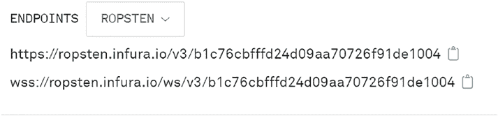

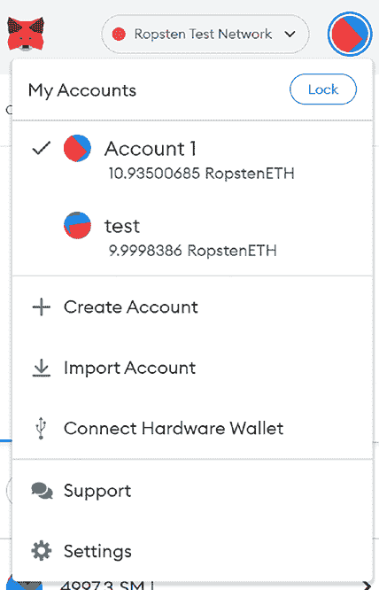

（第 6 章 truffle）

***图 6-2.** Ropsten 网络的不同端点* 我们可以按照图 6-3 到图 6-5 的截图，从 MetaMask 应用程序中获取助记词。

***图 6-3.** MetaMask 账户*

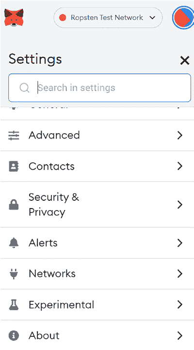

（第 6 章 truffle）

点击设置，你应该会看到类似于图 6-4 的内容。

***图 6-4.** MetaMask 的设置*

点击“安全与隐私”，你应该会看到如图 6-5 所示的界面。

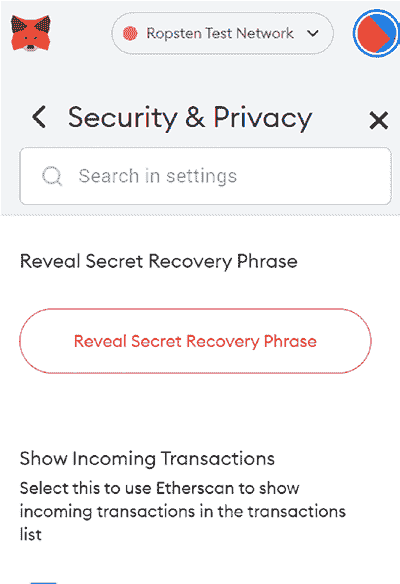

（第 6 章 truffle）

***图 6-5.** MetaMask 中的安全与隐私设置* 点击“显示秘密恢复短语”按钮。它会要求输入你的 MetaMask 密码，然后显示你的助记词。

项目根目录（对于我们创建的项目来说是 `mycoin` 目录）下有一个 `truffle-config.js` 文件。修改 `truffle-config.js` 文件，在文件顶部添加以下内容：

```javascript
require('dotenv').config();

const HDWalletProvider = require('@truffle/hdwallet-provider');

// 这提供了一个间接方式，从 .env 文件加载 Infura URL 和助记词

const { INFURA_API_URL, MNEMONIC } = process.env;
```

（第 6 章 truffle）

此外，在 `truffle-config.js` 文件的 `Networks` 部分，添加以下内容：

```javascript
ropsten: {

provider: () => new HDWalletProvider(MNEMONIC, INFURA_API_URL),

network_id: 3,

gas: 5500000,

timeoutBlocks: 200,

skipDryRun: true

},
```

正如我们所见，现在 Infura URL 和助记词是从 `.env` 文件中加载的。出于安全目的，这种间接方式是必要的。然后，Ropsten 网络提供者使用该 URL 连接到 Ropsten 网络，并使用助记词与 MetaMask 钱包进行交互。

**6.2.2 编译和部署合约**

使用以下命令编译合约：

`truffle compile`

使用以下命令部署合约：

`truffle migrate --network ropsten`

运行部署命令后，我们将看到如图 6-6 所示的结果。

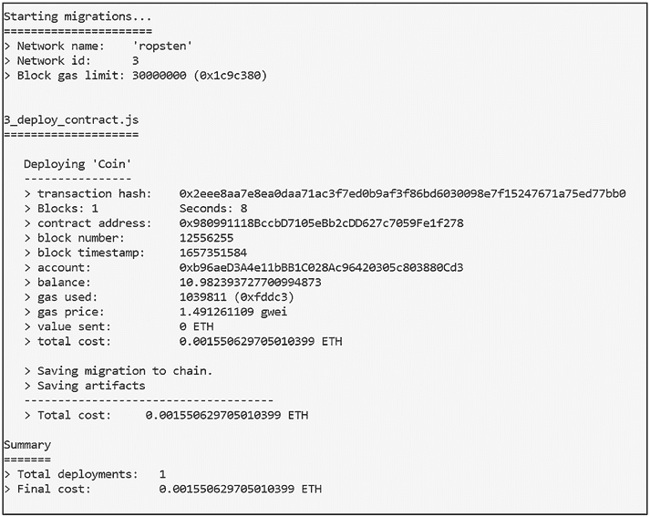

（第 6 章 truffle）

***图 6-6.** 通过 Truffle 界面部署 ERC-20 代币* 我们可以前往 Etherscan 查看交易 `0x2eee8aa7e8ea0daa71ac3f7ed0b9af3f86bd6030098e7f15247671a75ed77bb0` 并检查其状态，如图 6-7 所示。前往：`https://ropsten.etherscan.io/tx/0x2eee8aa7e8ea0daa71ac3f7ed0b9af3f86bd6030098e7f15247671a75ed77bb0`

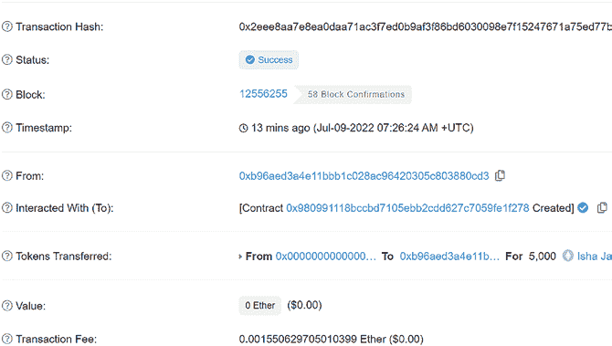

（第 6 章 truffle）

***图 6-7.** 智能合约部署的 Etherscan 视图* 我们也可以在 Etherscan 上查看合约地址。合约地址是 `0x980991118BccbD7105eBb2cDD627c7059Fe1f278`。前往：`https://ropsten.etherscan.io/address/0x980991118BccbD7105eBb2cDD627c7059Fe1f278`

我们刚刚部署了一个创建名为“ISH”的代币的合约。该合约已部署到 Ropsten 测试网。

现在我们将展示如何使用 Truffle 控制台与此合约进行交互。

打开另一个命令窗口。导航到项目目录（`mycoin`）。输入以下命令：

`truffle console –network ropsten`

控制台打开后，发出以下命令：

`let instance = await Coin.deployed()`

（第 6 章 truffle）

一旦智能合约部署在 Ropsten 测试网上，我们就可以通过 Truffle 框架本身调用合约上的不同函数。

有一个名为 `balanceOf` 的函数，用于显示该地址的 ISH 代币余额。

使用以下命令调用它：

`instance.balanceOf("0xb96aeD3A4e11bBB1C028Ac96420305c803880Cd3")`


在我的案例中，我使用的地址是合约创建者的地址，根据合约代码，该地址拥有所有代币。运行上述命令后，我们将看到如下输出：

```
BN {
  negative: 0,
  words: [ 499000, <1 empty item> ],
  length: 1,
  red: null
}
```

我们可以看到该地址拥有 `499,000` 个 `ISH` 代币。由于我已经将一些代币转移到另一个地址，所以我们拥有的代币少于 `500,000` 个。

我将通过运行以下命令来检查接收 `ISH` 代币的地址的余额：

`instance.balanceOf("0x1A703B299d764B4e28Dc2C7849CFeDF9979D2430")`

这将显示以下输出：

```
BN {
  negative: 0,
  words: [ 1000, <1 empty item> ],
  length: 1,
  red: null
}
```

现在，让我们调用`transfer`函数来转移一些`ISH`代币。

在控制台中执行以下命令：

`instance.transfer("0x1A703B299d764B4e28Dc2C7849CFeDF9979D2430", 1000)`

这里，我们将`1000`个`ISH`代币转移到地址`0x1A703B299d764B4e28Dc2C7849CFeDF9979D2430`。

执行命令后，我们看到以下输出：

```
{
  tx: '0xd174faeb28e4b9c1d409c2cf10b7d215e52b44973e4bfc1350fb37a01282fb7a',
  receipt: {
    blockHash: '0x516715ace04223d3a36331140d7c569c62a2b4016a52b8d9b49d740efb41448f',
    blockNumber: 12556678,
    contractAddress: null,
    cumulativeGasUsed: 1294778,
    effectiveGasPrice: 1491261109,
    from: '0xb96aed3a4e11bbb1c028ac96420305c803880cd3',
    gasUsed: 35415,
    logs: [ [Object] ],
    logsBloom: '0x0000000000000000000000000000000000000000000001000000000',
    status: true,
    to: '0x980991118bccbd7105ebb2cdd627c7059fe1f278',
    transactionHash: '0xd174faeb28e4b9c1d409c2cf10b7d215e52b44973e4bfc1350fb37a01282fb7a',
    transactionIndex: 19,
    type: '0x0',
    rawLogs: [ [Object] ]
  },
  logs: [
    {
      address: '0x980991118BccbD7105eBb2cDD627c7059Fe1f278',
      blockHash: '0x516715ace04223d3a36331140d7c569c62a2b4016a52b8d9b49d740efb41448f',
      blockNumber: 12556678,
      logIndex: 18,
      removed: false,
      transactionHash: '0xd174faeb28e4b9c1d409c2cf10b7d215e52b44973e4bfc1350fb37a01282fb7a',
      transactionIndex: 19,
      id: 'log_1e6ce129',
      event: 'Transfer',
      args: [Result]
    }
  ]
}
```

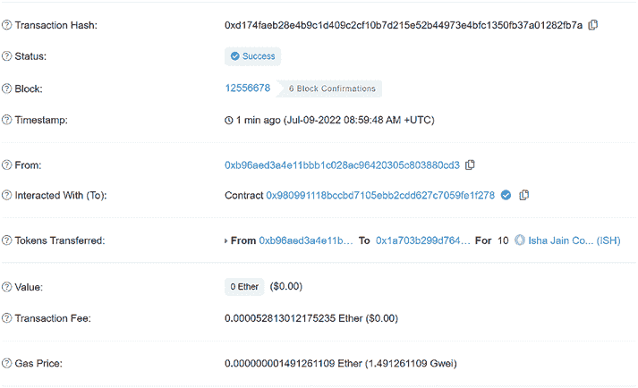

我们可以通过以下链接在 Etherscan 上验证交易 ID `0xd174faeb28e4b9c1d409c2cf10b7d215e52b44973e4bfc1350fb37a01282fb7`，如图 6-8 所示：`https://ropsten.etherscan.io/tx/0xd174faeb28e4b9c1d409c2cf10b7d215e52b44973e4bfc1350fb37a01282fb7a`

**图 6-8.** 在 Etherscan 上查看交易的余额

我们可以看到它显示为 `10` 个 `ISH` 代币，因为我们选择保留两位小数。所以 `1,000` 个代币除以 `100`。

现在，让我们检查转账方和接收方的余额。

在控制台中运行以下命令来检查转账方的余额：

`instance.balanceOf("0xb96aeD3A4e11bBB1C028Ac96420305c803880Cd3")`

我们得到以下输出：

```
BN {
  negative: 0,
  words: [ 498000, <1 empty item> ],
  length: 1,
  red: null
}
```

现在，通过执行以下命令来检查接收方的余额：

`instance.balanceOf("0x1A703B299d764B4e28Dc2C7849CFeDF9979D2430")`

这将得到以下输出：

```
BN {
  negative: 0,
  words: [ 2000, <1 empty item> ],
  length: 1,
  red: null
}
```

我们可以看到 `1,000` 个 `ISH` 代币已从转账方扣除并添加到接收方。

### 6.3 总结

在本章中，我们研究了智能合约开发中最著名的框架之一——Truffle。我们使用 Truffle 框架创建了一个基于 ERC-20 的代币，并将其部署到 Ropsten 测试网络。我们还学会了如何通过调用不同的代币函数来与该代币交互。

在下一章中，我们将稍作转移，学习一种名为星际文件系统（IPFS）的替代性去中心化存储技术。我们将把数字资产存储在 IPFS 中，然后了解如何使用 ERC-751 标准通过 Remix Web IDE 创建 NFT。

## 第 7 章
**IPFS 和 NFT**


```markdown
当你想到构建去中心化应用时，脑海中一定会浮现出像以太坊这样的区块链平台。区块链技术对于状态管理、通过智能合约自动化操作以及经济价值交易极其有益。

但你的应用内容究竟存储在哪里呢？

图片？视频？构成应用前端的所有 HTML、CSS 和 JavaScript 文件具体存储在哪里？你的用户访问的内容以及你使用的应用是从中心化的 AWS 服务器加载的吗？

这些内容必须存储在区块链上，而这是一个既耗时又耗钱的过程。你的区块链应用需要去中心化的存储！

### 7.1 IPFS

星际文件系统（IPFS）是一种点对点的超媒体协议，旨在让万维网更加开放、快速和安全。

IPFS 是一个用于存储和分发内容的协议。每个用户都作为一个节点运行，就像在区块链技术领域（服务器）一样。

节点之间能够相互通信并共享文件。

© Shashank Mohan Jain 2023

S. M. Jain, *A Brief Introduction to Web3*[, https://doi.org/10.1007/978-1-4842-8975-4_7](https://doi.org/10.1007/978-1-4842-8975-4_7#DOI)

### 第七章 IPFS 和 NFT

首先，IPFS 被认为是去中心化的，因为内容是从成千上万个对等节点组成的网络中加载的，而不是从单一的中央服务器加载。每一比特的数据都使用密码学进行哈希处理，从而生成一种安全且独一无二的内容标识符，称为 CID。

既然点对点文件共享已经存在了一段时间，那么你可能会问，IPFS 在这方面有什么独特之处？IPFS 目前是去中心化互联网最著名且最广泛使用的替代方案，因为它拥有多项在加密货币行业中脱颖而出的有利特性。

IPFS 是不可变的，这意味着一旦数据被添加到网络中，就无法以任何方式更改。用户能够验证他们查看的数据没有被篡改。可以发布更新，但这些更新总会以新文件的形式出现；现有文件永远不会被覆盖。

IPFS 通过在数据添加到网络时先进行分块、再存储、最后哈希处理，来防止数据重复。这使得重复数据能够映射到相同的节点，因此只创建一个条目。假设新文件与网络中已有的文件有些相似，那么随着网络规模变大，向网络中添加它所需的存储空间会更少。

IPFS 是去中心化的，这意味着即使某些节点被移除或添加，网络也能继续运行。即使大量节点下线，整个系统也能正常运行。除非摧毁构成网络的每一个节点，否则无法删除信息或审查文件。

这个系统的去中心化是最重要的方面。

接下来会出现一些对比中心化网络与分布式网络外观的图示。

关键点在于，Facebook 实际上拥有第一个网络，148

### 第七章 IPFS 和 NFT

因此他们是该网络上唯一可信的信息来源。在第二个网络中，没有哪个节点比其它节点更重要。

#### 7.1.1 IPFS：30,000 英尺俯瞰

在我们开始之前，让我们先从一个高层视角看看 IPFS 在幕后做了什么，以便我们对即将涉及的内容有所了解。作为 IPFS 网络中的一个节点，你负责建立与网络中其它数十个节点的连接，并充当这些节点的路由点。你将这些节点称为你的对等节点。
```


## 第 7 章：IPFS 与 NFT

网络中的每个节点在特定时刻要么是客户端，要么是某条内容。作为用户，您需要负责维护一份对等节点列表，以便整理出可用的清单。在网络的另一端拥有少量熟人（其 ID 与您自身 ID 相差较大），并在邻近区域拥有大量朋友（其 ID 与您非常相似）。

当请求内容时（无论是您自己需要，还是因对等节点请求），您可以选择将搜索范围限制在那些您熟悉的、且距离内容 ID 最近的节点上。该请求平均在 `Log(N)` 时间内即可完成。此外，在内容返回过程中，每个节点都会创建一份数据缓存，以便后续搜索时能更快地访问。这些缓存机制非常激进，并且由于数据永不改变，从而降低了网络成本。

之后，您可以通过运行本地节点，或者将内容 ID 传递给现有节点进行路由，从而检索到存储的内容。

## 第 7 章：IPFS 与 NFT

#### 7.1.2 安装

对于 Windows 系统，请从 [`dist.ipfs.io/#go-ipfs`](https://dist.ipfs.io/#go-ipfs) 下载 IPFS 守护进程。

另一种选择是从 [`docs.ipfs.tech/install/ipfs-desktop/`](https://docs.ipfs.tech/install/ipfs-desktop/) 安装 IPFS 桌面应用程序。

本章中，我们将使用 IPFS 守护进程：

```
C:\Users\I074560>cd \shashank\apress\web3
C:\shashank\apress\web3>mkdir ipfs
C:\shashank\apress\web3>cd kubo
C:\shashank\apress\web3\kubo>ipfs.exe init
```

上述操作将产生以下输出：

```
generating ED25519 keypair...done
peer identity:
12D3KooWRzcEvQWq8wvr4AckSVVjRtUAvXLxc37J8uVLaGa2Bt4G
initializing IPFS node at c:\shashank\apress\web3\ipfs
```

要开始使用，请输入以下命令：

```
ipfs cat /ipfs/QmQPeNsJPyVWPFDVHb77w8G42Fvo15z4bG2X8D2GhfbSXc/readme
```

然后，运行以下命令：

```
ipfs cat /ipfs/QmQPeNsJPyVWPFDVHb77w8G42Fvo15z4bG2X8D2GhfbSXc/readme
```

这将检查 IPFS 的安装情况，如图 7-1 所示。

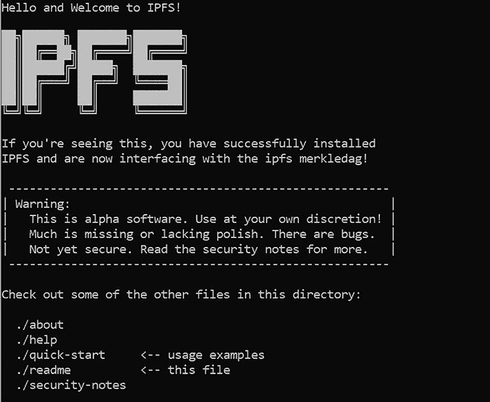

现在让我们向 IPFS 添加内容。打开另一个终端并运行以下命令：

```
echo "This is my first content to IPFS" | ipfs add
```

这将返回以下输出：

```
added QmdWENEwy4RRdvfuR6Jk86AMe7TV89yUFZec2YKHZqAKqF
```

返回的哈希值就是该内容的**内容标识符 (CID)**。

### 7.2 ERC-721

我们在第 [5](https://doi.org/10.1007/978-1-4842-8975-4_5) 章和第 [6](https://doi.org/10.1007/978-1-4842-8975-4_6) 章中看到了如何使用 ERC-20 标准创建代币。但代币是一种同质化实体，这意味着每个代币与其他代币都是等价的。许多应用程序的需求需要为不同的资产赋予不同的价值，例如一件数字艺术品的价值不能等同于另一件数字艺术品的价值。我们需要一种机制来在区块链上表示此类资产的价值。这一需求催生了 ERC-721 规范，该规范专门处理非同质化代币（简称 **NFT**）。

ERC-721 提供了一个接口，定义了构建非同质化代币所需的函数。以下是 ERC-721 标准定义的所有函数和事件的列表。

ERC-721 标准定义了一些与 ERC-20 标准兼容的函数。这一变化使得现有钱包能够更简单地显示基本的代币信息。

### 与 ERC-20 类似的函数：

- **`name`**：该字段用于定义代币的名称。
- **`symbol`**：该字段用于记录代币的符号。
- **`totalSupply`**：该函数表示 NFT 的总供应量。供应量也可以是动态的。
- **`balanceOf`**：该函数返回某个地址所拥有的 NFT 总数。


### 与代币所有权相关的主要函数：

- `ownerOf`：此函数返回当前拥有某个代币的地址。由于 ERC-721 代币具有非同质化且可单独识别的特性，每个代币都拥有一个存储在区块链上的唯一 ID。
- `approve`：此函数允许 NFT 的所有者授权另一个账户代其转移代币。
- `transfer`：此函数允许 NFT 的所有者将其转移到另一个地址。

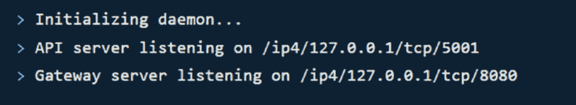

### 与元数据相关的函数：

- `tokenMetadata`：顾名思义，此函数允许发现 NFT 的元数据；例如，该 NFT 持有的是何种数据，是音频、图片还是其他内容。

除了这些函数外，ERC-721 规范还定义了两个事件：

- `Transfer`：当代币所有权从一个用户转移到另一个用户时，会触发此事件，以便后续用户能够控制该代币。
- `Approve`：每当调用 `approve` 函数时，就会触发此事件，这意味着每当一个用户授权另一个用户获取某个代币的所有权时，该事件都会发生。

### 7.3 创建 ERC-721 代币并将其部署到 IPFS

在对 IPFS 和 NFT 有了高层次了解之后，是时候来看一个同时使用这两种技术的简单用例了。

我们的预期用例是创建一个数字资产并将其上传到 IPFS。

在将数字资产添加到 IPFS 之前，请确保使用以下命令启动 IPFS 守护进程：

```
ipfs daemon
```

IPFS 守护进程将启动，如图 7-2 所示。

**图 7-2.** IPFS 守护进程

守护进程启动后，我们将通过在不同的控制台中运行以下命令，将图像添加到 IPFS：

```
ipfs add <<文件名>>
```

这会给我们返回一个哈希值（CID）。获取此 CID 后，要将文件传播到其他节点，我们只需使用以下固定命令：

```
ipfs pin add <<上述获取的 CID>>
```

这将使内容可通过如下 IPFS 命令访问：

```
ipfs object get <<CID>>
```

这将返回上传到 IPFS 的图像。

我们也可以使用像 `ipfs.io` 或 `cloudflare` 这样的网关来获取内容。

在本示例中，资产可通过以下地址访问：

- `https://cloudflare-ipfs.com/ipfs/QmbBp5huHazG582ean3eGGwWXkkVKnRc7V5te16ByWNs2N`
- `https://ipfs.io/ipfs/QmbBp5huHazG582ean3eGGwWXkkVKnRc7V5te16ByWNs2N`

这里 `QmbBp5huHazG582ean3eGGwWXkkVKnRc7V5te16ByWNs2N` 是内容（图像）的 CID。

一旦我们上传了图像，我们将创建一个捕获资产元数据的 JSON 文件。其中的图像 URL 是通过 `ipfs.io` 网关生成的 IPFS URL。

```json
{
  "name": "Shashank Jain NFT",
  "description": "此图片展示了一台笔记本电脑的图像",
  "image": "https://ipfs.io/ipfs/QmbBp5huHazG582ean3eGGwWXkkVKnRc7V5te16ByWNs2N"
}
```

将文件命名为 `nft.json`。

使用以下命令将其添加到 IPFS：

```
ipfs add nft.json
```

使用以下命令将其固定：

```
ipfs pin add <<从 ipfs add 命令输出中获取的哈希值>>
```

在我的案例中，此 JSON 文件可通过以下地址访问：

- `https://cloudflare-ipfs.com/ipfs/QmZwaouD8bVMoNgznszxsSAS7W9EgkdfC5rF7TSzz1Q25N`
- `https://ipfs.io/ipfs/QmZwaouD8bVMoNgznszxsSAS7W9EgkdfC5rF7TSzz1Q25N`

完成这部分工作后，我们将使用 Remix IDE 创建智能合约。

在浏览器中导航至 `https://remix.ethereum.org/` 打开 Remix IDE。

在 `Contracts` 目录下创建一个名为 `MyNFT.sol` 的文件。

将清单 7-1 中的代码复制到该文件中。

**清单 7-1.** ERC-721 实现

```solidity
//SDPX-License-Identifier: MIT
pragma solidity 0.8.0;

import "https://github.com/0xcert/ethereum-erc721/src/contracts/tokens/nf-token-metadata.sol";
import "https://github.com/0xcert/ethereum-erc721/src/contracts/ownership/ownable.sol";

contract MyNFT is NFTokenMetadata, Ownable {

    constructor() {
        // NFT 的名称
        nftName = "Shashank Jain NFT";
        // NFT 的符号
    }
}
```


```solidity
nftSymbol = "LAPTOP";

}

// 此函数提供铸造功能，_to 变量将存储 NFT 接收者的地址。
// tokenId 存储代币标识符，uri 存储引用实际文件位置的 URL。
// 在我们的案例中，文件存储在 IPFS 中，因此将使用 IPFS URL。

function mint(address _to, uint256 _tokenId, string calldata _uri) external onlyOwner {
    super._mint(_to, _tokenId);
    super._setTokenUri(_tokenId, _uri);
}

}
```

在第 1 行指定 SPDX 许可证类型是 Solidity 0.8 版本之后引入的新特性。跳过此注释不会导致错误，但会收到一条警告。

Solidity 版本在第 2 行声明。

第 4 行和第 5 行导入了 `0xcert/ethereum-erc721` 合约。

本合约继承了 ERC-721 规范中的大部分代码。

我们实现了 `mint` 方法，它接收三个输入参数：

1.  NFT 需要转移到的地址
2.  代币 ID（一个随机数）
3.  URI（指向我们上传到 IPFS 的元数据文件的 URL）

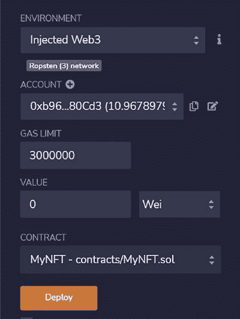

## 第 7 章：IPFS 与 NFT

编译合约。编译成功后，我们需要部署合约。

将环境字段设置为 `Web3 Injected`，以便我们将其连接到 MetaMask 进行交易签名，如图 7-3 所示。

***图 7-3.** 用于部署 ERC-721 代币的 Remix IDE*

点击 `Deploy` 按钮，合约将部署到 Ropsten 测试网络，如图 7-4 所示。

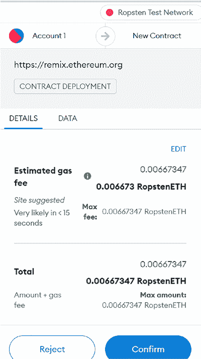

***图 7-4.** 用于批准交易的 MetaMask 钱包*

点击 `Confirm` 按钮。首先，我们可以看到交易处于 `Pending`（待处理）状态，如图 7-5 所示。

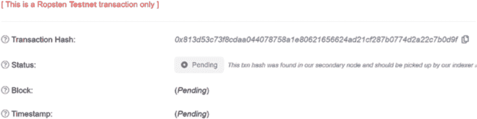

***图 7-5.** 基于 ERC-721 的 NFT 部署交易的 Etherscan 视图*

等待几秒钟后，交易将在网络上得到确认。

我们可以在 Etherscan 上查看此交易：`https://ropsten.etherscan.io/tx/0x813d53c73f8cdaa044078758a1e80621656624ad21cf287b0774d2a22c7b0d9f`

现在，我们将通过 Remix 调用合约的一些函数。我们可以在图 7-6 中看到合约函数。

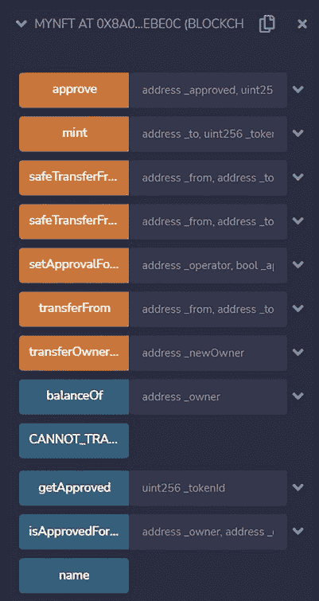

***图 7-6.** Remix IDE 中的 ERC-721 函数*

有些函数是继承而来的。我们已经重写了 `mint` 函数。

首先，让我们铸造一个 NFT，如图 7-7 所示。

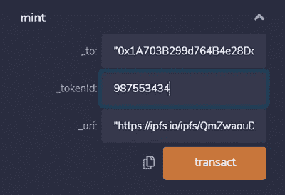

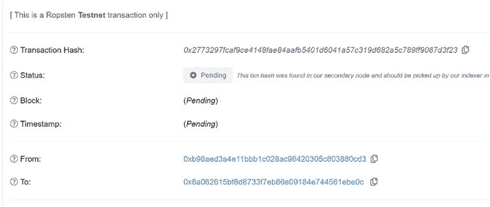

***图 7-7.** Remix IDE 中的 Mint 函数。我们为代币 ID 填入一个随机 ID，为 URI 填入 IPFS URL，并在 `_to` 字段中填入接收者地址*

如前所述，该函数有三个输入参数。

现在点击 `Transact` 按钮。

通过 MetaMask 确认后，我们可以在 Etherscan 上看到该交易，如图 7-8 所示。

***图 7-8.** NFT 的 Etherscan 视图*

确认后，我们在 Etherscan 上看到以下内容，如图 7-9 所示。

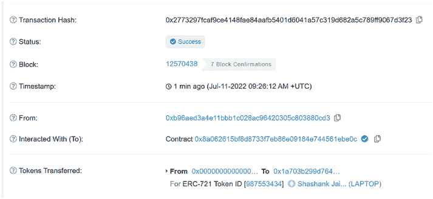

***图 7-9.** NFT 交易的 Etherscan 视图*

在这里，我们可以看到已将 NFT 转移到了 `0x1A703B299d764B4e28Dc2C7849CFeDF9979D2430` 地址。

代币详情可以在这里找到，如图 7-10 所示。

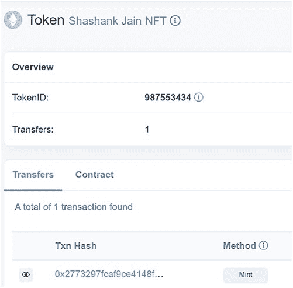

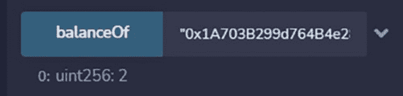

***图 7-10.** NFT 的 Etherscan 视图*

其 Etherscan 地址是 `https://ropsten.etherscan.io/token/0x8a062615bf8d8733f7eb86e09184e744561ebe0c?a=987553434`。

我们再次向同一地址发起一笔 NFT 转移，然后在 Remix 中通过提供 NFT 受益人的地址来点击 `balanceOf` 函数，如图 7-11 所示。

***图 7-11.** Remix IDE 中显示的 `balanceOf` 函数*

我们看到该地址在其账户中收到了两个 NFT。

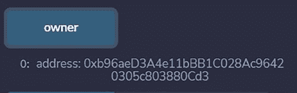

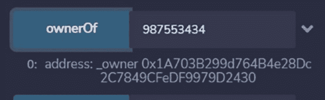

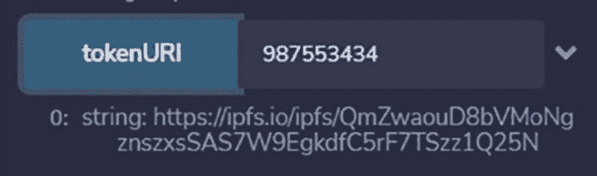


## 第 7 章：IPFS 与 NFT

要获取合约的所有者，我们点击 `Owner`。得到的结果如图 7-12 所示。

***图 7-12.** Remix IDE 中显示的所有者函数*

你可以通过传入代币 ID 来查询 NFT 的所有者，如图 7-13 所示。

***图 7-13.** Remix IDE 中的 OwnerOf 函数*

接下来，我们检查`tokenURI`函数，如图 7-14 所示。

***图 7-14.** Remix IDE 中显示的代币 URI（此处为 IPFS URI）*

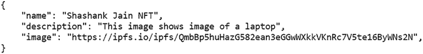

这里我们同样将代币 ID 作为输入传入。可以看到它返回了存储在 IPFS 中的 NFT 元数据 URL：

`https://ipfs.io/ipfs/QmZwaouD8bVMoNgznszxsSAS7W9EgkdfC5rF7TSzz1Q25N`

图 7-15 展示了该文件的内容。

***图 7-15.** NFT 使用的文件内容*

我们留给读者尝试使用 `Truffle` 进行同样的练习。

### 7.4 本章小结

在本章中，我们了解了 IPFS，即星际文件系统。我们探讨了如何通过 IPFS 上传和检索内容。

接着，我们探索了关于创建 NFT 的 ERC-721 规范。我们使用 Remix 和 IPFS 创建了一个简单的 NFT。

在下一章中，我们将简要了解另一个用于智能合约生命周期的框架，即 `Hardhat`。

## 第 8 章：Hardhat

在前面的章节中，我们已经了解了如何使用 Remix IDE 和 `Truffle` 管理基于以太坊的智能合约生命周期。现在我们将学习另一个名为 `Hardhat` 的框架，它同样可用于管理智能合约的生命周期。该生命周期包括创建、编译、测试和部署合约等任务。

你可以在 `Hardhat` 的全程辅助下创建智能合约。它在测试已实现的合约以及开发"未来假设"时也能提供极大的帮助。

### 8.1 Hardhat 框架的安装

从以下链接安装 `node.js`（版本 16.16.0）：`https://nodejs.org/en/download/`

以下步骤会附带安装 `npm` 8.11.0：

使用 `npm` 安装 `hardhat`：

```
npm install -d hardhat
```

### 8.2 Hardhat 工作流程

在此阶段，合约将进行编码并接受测试。由于你需要测试每一行代码，编写智能合约和测试代码通常是同步进行的。`Hardhat` 在这方面表现尤为出色，因为它提供了许多用于测试和优化代码的出色插件。

在部署步骤中，你首先需要编译代码，这涉及将 Solidity 代码转换为字节码。接着，你将在部署前对代码进行优化。`Hardhat` 提供了大量优秀的插件。

现在 `Hardhat` 已成功安装，让我们开始一个全新的 `Hardhat` 项目。我们将使用 `npx` 来完成。`npx` 有助于处理 `node.js` 的可执行文件。

创建一个名为 `coin` 的项目目录：

```
mkdir coin
cd coin
```

使用命令：

```
npx hardhat
```

***图 8-1.** Hardhat 安装*

安装以下依赖项：

```
npm install --save-dev @nomiclabs/hardhat-ethers ethers @nomiclabs/hardhat-waffle ethereum-waffle chai
```

切换到 `coin` 目录：

```
cd coin
```

我们将从创建合约开始。

在 `coin` 目录内创建一个名为 `Contracts` 的目录，并将清单 8-1 中的文件复制到 `contracts` 目录中。

***清单 8-1.** 代币合约代码*

```
// SPDX-License-Identifier: LGPL-3.0-only
pragma solidity 0.8.15;

interface ERC20Interface {
    function totalSupply() external view returns (uint);
    function balanceOf(address tokenOwner) external view returns (uint balance);
    function allowance(address tokenOwner, address spender) external view returns (uint remaining);
    function transfer(address to, uint tokens) external returns (bool success);
```


```solidity
function approve(address spender, uint tokens) external returns (bool success);

function transferFrom(address from, address to, uint tokens) external returns (bool success);

event Transfer(address indexed from, address indexed to, uint tokens);

event Approval(address indexed tokenOwner, address indexed spender, uint tokens);

}

contract Coin is ERC20Interface {

string public tokenSymbol;

string public tokenName;

uint8 public tokenDecimals;

uint public _totalSupplyOfToken;

mapping(address => uint) tokenBalances;

mapping(address => mapping(address => uint)) allowed;

//这里我们用总供应量、名称等来初始化代币

constructor() public {

tokenSymbol = "ISH";

tokenName = "Isha Jain Coin";

tokenDecimals = 2;

_totalSupplyOfToken = 500000;

tokenBalances[msg.sender] = _totalSupplyOfToken;

emit Transfer(address(0), msg.sender, _totalSupplyOfToken);

}

// 用于随时返回供应量的函数。

function totalSupply() public override view returns (uint) {

return _totalSupplyOfToken - tokenBalances[address(0)];

}

//用于检查特定地址代币余额的函数  
function balanceOf(address tokenOwner) public override view returns (uint balance) {

return tokenBalances[tokenOwner];

}

// 用于将代币转移到特定地址的函数。

function transfer(address to, uint tokens) public override returns (bool success) {

//检查发送方地址是否有足够的余额  
require(tokens <= tokenBalances[msg.sender]);

//从发送方扣除代币

tokenBalances[msg.sender] = tokenBalances[msg.sender] - tokens;

//向接收方地址添加代币

tokenBalances[to] = tokenBalances[to] + tokens;

//转账完成后发出消息

emit Transfer(msg.sender, to, tokens);

return true;

}

function approve(address spender, uint tokens) public override returns (bool success) {

allowed[msg.sender][spender] = tokens;

emit Approval(msg.sender, spender, tokens);

return true;

}

// 这个函数与 approve 类似，但此处我们可以指定一个与消息发送者不同的 from 地址

function transferFrom(address from, address to, uint tokens) public override returns (bool success) {

require(tokens <= tokenBalances[from]);

tokenBalances[from] = tokenBalances[from] - tokens;

require(tokens <= allowed[from][msg.sender]);

allowed[from][msg.sender] = allowed[from][msg.sender] - tokens;

uint c = 0;

c = tokenBalances[to] + tokens;

require(c >= tokenBalances[to]);

emit Transfer(from, to, tokens);

return true;

}

// 检查 tokenOwner 是否被授权进行转账  
function allowance(address tokenOwner, address spender) public override view returns (uint remaining) {

return allowed[tokenOwner][spender];

}

fallback() external payable {

revert();

}

}
```

# 第 8 章 hardhat

### 8.3 智能合约的部署

在 `Coin` 目录下创建一个名为 `hardhat.config.js` 的文件，内容如下：

```javascript
/** @type import('hardhat/config').HardhatUserConfig */

require("@nomiclabs/hardhat-ethers")
require("@nomiclabs/hardhat-waffle")

module.exports = {
  solidity: "0.8.9",
  networks: {
    ropsten: {
      url: "https://ropsten.infura.io/v3/<<你的 infura 项目 ID>>",
      accounts: {
        mnemonic: "<<你的助记词>>",
        path: "m/44'/60'/0'/0",
        initialIndex: 0,
        count: 20,
        passphrase: "",
      },
    },
  },
};
```

在 `Coin` 目录下创建一个名为 `Deployments` 的目录。

创建一个名为 `deployToken.js` 的文件，并从清单 8-2 中复制代码。

***清单 8-2.*** 部署代码

```javascript
async function main() {
  const Coin = await ethers.getContractFactory("Coin");
  const coin = await Coin.deploy();
  await coin.deployed();
  console.log("Coin deployed to:", coin.address);
}

main()
  .then(() => process.exit(0))
  .catch((error) => {
    console.error(error);
    process.exit(1);
  });
```

使用以下命令将合约部署到 Ropsten 网络：

```bash
npx hardhat run deployments/deployToken.js --network Ropsten
```

我们将看到如图 8-2 所示的输出。


#### **图 8-2.** 使用 `hardhat` 部署基于 ERC-20 标准代币的输出结果

该合约可在 Etherscan 上通过以下 URL 查看：

`https://ropsten.etherscan.io/address/0xc136c20061344B0D6096adB6edd651aaCEFE0D7e`

你可以通过以下链接查看交易：`https://ropsten.etherscan.io/tx/0x048c3b3f04519df9b316363e177e26d1716ba62460ee4764b6d0297c6b7ccd93`

我们可以看到 ISH 代币已被转移到创建者地址，如图 8-3 所示。

#### **图 8-3.** Etherscan 上的部署交易视图

第 8 章 `hardhat`

为了调用已部署合约的函数，请在 `Deployments` 目录下创建一个 `invoke.js` 文件。

#### **清单 8-3.** 调用智能合约函数的代码

```
async function main() {
  const MyContract = await ethers.getContractFactory("Coin");
  const contract = await MyContract.attach(
    "0xc136c20061344B0D6096adB6edd651aaCEFE0D7e" // 已部署的合约地址
  );
  // 现在你可以调用合约的函数
  console.log(await contract.balanceOf("0xb96aeD3A4e11bBB1C028Ac96420305c803880Cd3"));
}

main()
  .then(() => process.exit(0))
  .catch((error) => {
    console.error(error);
    process.exit(1);
  });
```

在 Coin 目录下运行以下命令来调用该函数：

`npx hardhat run deployments/invoke.js --network ropsten`

我们会得到以下输出：

`BigNumber { value: "500000" }`

在 `Deployments` 目录下创建另一个名为 `transfer.js` 的文件，并将清单 8-4 中的代码复制到该文件中。

第 8 章 `hardhat`

#### **清单 8-4.** 转账代币的代码

```
async function main() {
  const MyContract = await ethers.getContractFactory("Coin");
  const contract = await MyContract.attach(
    "0xc136c20061344B0D6096adB6edd651aaCEFE0D7e" // 已部署的合约地址
  );
  // 现在你可以调用合约的函数
  console.log(await contract.transfer("0x1A703B299d764B4e28Dc2C7849CFeDF9979D2430",200));
}

main()
  .then(() => process.exit(0))
  .catch((error) => {
    console.error(error);
    process.exit(1);
  });
```

使用以下命令执行代码：

`npx hardhat run deployments/transfer.js --network ropsten`

我们将看到命令的输出，如图 8-4 所示。

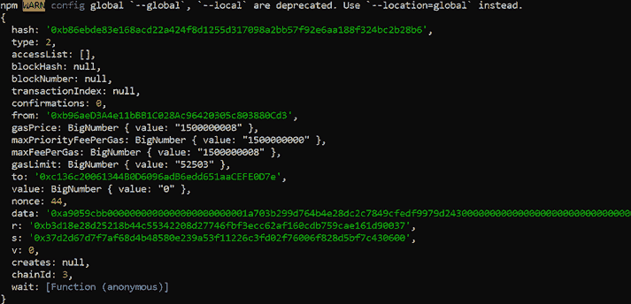


第 8 章 `hardhat`

#### **图 8-4.** 智能合约转账函数调用的 Hardhat 输出

我们可以在 Etherscan 上看到该交易，如图 8-5 所示。

`https://ropsten.etherscan.io/tx/0xb86ebde83e168acd22a424f8d1255d317098a2bb57f92e6aa188f324bc2b28b6`

#### **图 8-5.** Etherscan 上的智能合约转账交易视图

我们可以看到，由于使用的小数位数为两位，转账反映的是 2 个 ISH 代币。

现在，我们使用修改后的 `invoke.js` 代码（清单 8-5） 来检查接收方地址的余额。

第 8 章 `hardhat`

#### **清单 8-5.** 检查账户余额的代码

```
async function main() {
  const MyContract = await ethers.getContractFactory("Coin");
  const contract = await MyContract.attach(
    "0xc136c20061344B0D6096adB6edd651aaCEFE0D7e" // 已部署的合约地址
  );
  // 现在你可以调用合约的函数，我们通过传入接收方地址来调用 balanceOf 函数。
  console.log(await contract.balanceOf("0x1a703b299d764b4e28dc2c7849cfedf9979d2430"));
}

main()
  .then(() => process.exit(0))
  .catch((error) => {
    console.error(error);
    process.exit(1);
  });
```

现在执行以下命令：

`npx hardhat run deployments/invoke.js --network ropsten`

这将输出以下内容：

`BigNumber { value: "200" }`

这与我们转给接收方的数量（200 个代币）相符。

在 MetaMask 和 Etherscan 中，这显示为 2 个 ISH 代币，因为我们在创建代币时将配置的小数位数设置为两位。

第 8 章 `hardhat`

## 8.4 总结


好的，作为一名高级文档工程师和翻译员，我已根据您提供的注意事项和示例，对原文进行了翻译。

以下是为您准备的译文：


在本章中，我们研究了一个名为 `Hardhat` 的框架，用于合约部署和测试。我们探讨了 `Hardhat` 的安装，以及如何使用它来部署合约。我们还研究了如何使用同一框架来调用智能合约上的函数。

**索引**
**A**
数据结构，11
网络，15
抽象合约，52–54
许可的，12
Postgres 节点，11
**B**
私有的，12
余额，59–60，125
公开的，12
币安，64，66，73
设置，12
币安智能链（BSC），73
比特币，6，9，12，15–23，25，
**C**
26，63，109
大写，33
区块链技术，6，
中心化权威，3，5，13，23
11，18，147
Coinbase，32，66
算法，13
`Coin.sol` 文件，129
应用，16
共识，17
架构
工作量证明，19
客户端-服务器网络，21
内容标识符（CID），148，
节点，22
151，154
交易流程，22
合约代码，26，129–137
验证过程，22
加密货币，14，15，17–19，21，
区块，14
25，29，64，66，109，148
链，15
加密密钥
分类，11
区块链网络，23
组件，14
计算机，13
数据结构，24
加密货币，17
创世区块，24
密码学，64，148
数据，13
托管钱包，64，65
数据库，14
© Shashank Mohan Jain 2023
S. M. Jain, *A Brief Introduction to Web3*[, https://doi.org/10.1007/978-1-4842-8975-4](https://doi.org/10.1007/978-1-4842-8975-4#DOI)
索引
**D**
以太坊虚拟机（EVM），
7，28，29，60，61
去中心化，6
Etherscan，70，71，75，76，104，105，
中心化，4
107，108，117，138，139，143，
组件，4
159，161–163，174，177，178
网络，3
Etherscan 交易
设置，3
视图，76
去中心化应用
外部拥有账户（EOA），
（DApps），6，25，27–29，66，
25，26，56，60
73，109，147
去中心化系统，3–8
`2_deploy_contract.js` 文件，133
**F，G**
`deployToken.js` 文件，173，174
函数修饰符，43–46
桌面钱包，65
**E**
**H**
ERC-20 标准，109，110，152
Hardhat，167
智能合约，130
依赖项，169
函数，110，111
部署，基于 ERC20 的
ERC-721 标准，152，153
币，174
NFT 部署
部署步骤，168
交易，159
安装，167
函数，160
智能合约
实现，155
部署，172–175
代币，157
函数，175
以太币，66
转账交易，177
以太坊，6，12，13，15，17，26，27，
Etherscan 上的交易，177
29，61，63，109
工作流程，167，168
地址，35，56
`hardhat.config.js` 文件，172
API，76
硬件
区块链，20，28，63，111
钱包，65
基于 ERC 20 标准的
哈希函数，19，57
代币，65
超文本标记语言
钱包，63
（HTML），1，82，84，147
索引
**I**
**J，K**
Infura，72，73
JAIN，114，120，122，124，125
账户创建页面，79，80
架构，73
创建新项目屏幕，80，81
**L**
默认节点提供者，74
库，54，55
以太坊 API，73，74
LinkedIn，8
IaaS 和 Web3 后端
循环，37–39，62
提供者，72
基础设施，73
项目 ID 和项目
**M**
密钥，81，82
合并通配符，44
名为 trial 的项目，81
MetaMask 钱包，66，91，134
Ropsten 网络，84
账户详情，69，70
Rropsten 网络，82–87
Etherscan 上的账户，70，71
Web3 服务，72
ETH 确认，75
注入式 Web3 环境，101
Brave 浏览器扩展，68
集成开发
HD 钱包，67
环境（IDE），62，89，
Infura，72–74
*参见* Remix IDE
安装和配置
接口，53–54，65，66，72，76，
说明，68
110，111，137，139，152
可用网络，71，72
星际文件系统
Ropsten ETH，75
（IPFS），147
Ropsten 测试网，74
256 位哈希，149
钱包扩展，69
CID，148
移动钱包，65
内容 ID，149
`MyNFT.sol` 文件，155
去中心化，148
安装，150，151
**N，O**
点对点文件共享，148
星际文件系统（IPFS），
网络，4，8
72，145，147，165
云应用，5
IPFS 控制台，151
独立应用，5
ISH 币代币，174
NFTokenMetadata，155
索引
Node 包管理器（NPM），128
部署按钮，98，99
非同质化代币（NFTs），
部署环境，
145，147–165
100，101
部署屏幕，115
**P，Q**
ERC-20 规范，111
ERC-721 函数，160
点对点软件，5
Etherscan 视图
Polygon 网络，73
部署
优先 Gas 拍卖（PGA），108
交易，103–105
私钥，23–25，56–58，63–65
智能合约函数
编程语言，7，17，25，
调用交易，
28，30，34，35，37，39，
107，108
41，56，76
刚刚完成的交易，117
权益证明算法，20
首页，92
权益证明区块链，20
图标面板，90
工作量证明区块链，18
`Jain.sol` 文件，111
JAIN 代币，124，125
**R**
主面板，90
文本框中的消息，106
Remix IDE
MetaMask 视图
来自的账户地址
账户，123
MetaMask，118
转账交易，122
测试账户余额，125
MetaMask 钱包，102–104
基于浏览器的环境，89
面板，89，90
简单智能合约代码，93
Remix 视图，已部署的
智能合约编译屏幕，96
合约，118
编译后的 `Test.sol` 文件，96，97
用于部署的 Ropsten 测试网络，101，102
编译器版本和
`setMessage` 函数，107
语言，97，98
侧边面板，90
合约函数，105，106
智能合约创建，91
用于已部署合约，119
Solidity 和 MetaMask，91
已部署合约的转账
终端，90
函数，120，121
`Test.sol` 文件，92，93
索引
MetaMask 中的交易批准，115，116
视图函数，46
Ropsten 网络，76，82–87，91，
可见性要求，51
101，134，137，174
Solidity 编程
Ropsten 测试网络，74，91，
语言，30
102–104，126，127，139，140，
144，157
**T**
测试网，66
**S**
Goerli，67
Shashank Jain
Kovan，67
币，114
运行中，67
智能合约，7，8，17，25–30，39，
Rinkeby，67
41，42，48，56，57，59，65，66，
Ropsten，67
76，77，87，89–91，96，101，
`Test.sol` 文件，92，93，95–97
106–108，110，112，127，
代币，66，67，109–126
129–137，139，144，147，155，
`transfer` 函数，35，60，120，121，
165，167，172–178
141，177
Solidity，26，28，30，32，33，39，41，56
`transfer.js` 文件，175
地址数据类型，59
Truffle，127，144
算术运算，35
安装，127，128
赋值，37
安装 Node.js，127
比较，36
NPM，128
环境，56
智能合约部署
以太坊，57
`Coin.sol` 文件，129
关键字 `event`，55
编译和
`fallback` 函数，48
部署，
函数重载，50
合约，137–144
函数，41
合约代码，130，133
逻辑，36
MetaMask 账户，134
`pragma` 指令，30
`mkdir mycoin` 命令，129
纯函数，47
MetaMask 中的安全与隐私设置，136
类型，34
设置，MetaMask，135
变量，31，34
`truffle init` 命令，129
索引
**U**
Web 1.0，1
Web 2.0 应用，2
用户界面（UI），8
Web 3.0，2
应用，6，8
**V**
架构，7
验证者节点，66
演进，2
平台，8
`web3.js` 库，76
**W**
`web3-bzz` 模块，77，78
钱包，63
`web3-eth` 模块，77
作为托管钱包，64
`web3-net` 模块，78
桌面钱包，65
`web3-shh` 模块，77
硬件钱包，65
`web3-utils` 模块，78
MetaMask 钱包，66 (*参见*
Web 扩展，65
MetaMask 钱包)
移动钱包，65
**X，Y，Z**
私钥和公钥，64
测试网，67
`0xcert/ethereum-erc721` 包，156
Web 扩展，65

# 文档大纲


*   目录
*   关于作者
*   关于技术审稿人
*   引言
*   第 1 章：去中心化与 Web3
    *   1.1 Web 1.0
    *   1.2 Web 2.0
    *   1.3 Web 3.0
        *   1.3.1 去中心化简介
        *   1.3.2 不同的网络拓扑结构
            *   1.3.2.1 中心化且非分布式
            *   1.3.2.2 中心化但分布式
        *   1.3.3 去中心化系统
        *   1.3.4 Web3 案例研究
    *   1.4 小结
*   第 2 章：区块链
    *   2.1 区块链的类型
        *   2.1.1 公有区块链
        *   2.1.2 私有区块链
        *   2.1.3 许可型区块链
    *   2.2 什么是区块链？
    *   2.3 区块链的组成模块
        *   2.3.1 区块
        *   2.3.2 链
        *   2.3.3 网络
    *   2.4 区块链的应用场景
    *   2.5 发展演进
    *   2.6 共识机制
        *   2.6.1 工作量证明
        *   2.6.2 权益证明
    *   2.7 区块链架构
    *   2.8 密码学密钥
    *   2.9 区块链与单向链表的对比
    *   2.10 以太坊
    *   2.11 小结
*   第 3 章：Solidity
    *   3.1 什么是 Solidity？
    *   3.2 以太坊
        *   3.2.1 以太坊虚拟机
    *   3.3 智能合约
    *   3.4 理解 Solidity 语法
        *   3.4.1 Pragma
        *   3.4.2 变量
            *   3.4.2.1 变量命名
            *   3.4.2.2 变量的作用域
        *   3.4.3 值类型
        *   3.4.4 地址
        *   3.4.5 Solidity 中的运算符
            *   3.4.5.1 算术运算符
            *   3.4.5.2 比较运算符
            *   3.4.5.3 逻辑运算符
            *   3.4.5.4 赋值运算符
        *   3.4.6 循环
        *   3.4.7 决策流程
        *   3.4.8 Solidity 中的函数
            *   3.4.8.1 函数修饰符
            *   3.4.8.2 视图函数
            *   3.4.8.3 纯函数
            *   3.4.8.4 回退函数
            *   3.4.8.5 Solidity 中的函数重载
        *   3.4.9 抽象合约
        *   3.4.10 接口
        *   3.4.11 库
        *   3.4.12 事件
        *   3.4.13 Solidity 中的错误处理
        *   3.4.14 Solidity 与地址
            *   3.4.14.1 以太坊地址
            *   3.4.14.2 地址在 Solidity 中的使用
            *   3.4.14.3 Balance 方法
            *   3.4.14.4 Transfer 函数
            *   3.4.14.5 与合约相关的函数
            *   3.4.14.6 以太坊中的 Gas
            *   3.4.14.7 以太坊交易成本
    *   3.5 小结
*   第 4 章：钱包与网关
    *   4.1 钱包的类型
    *   4.2 那么，什么是测试网？
    *   4.3 MetaMask
        *   4.3.1 安装
    *   4.4 Web3.js
        *   4.4.1 web3-eth
        *   4.4.2 web3-shh
        *   4.4.3 web3-bzz
        *   4.4.4 web3-net
        *   4.4.5 web3-utils
    *   4.5 Infura 设置
        *   4.5.1 通过 Infura 网关与 Ropsten 网络交互
    *   4.6 小结
*   第 5 章：Remix IDE 介绍
    *   5.1 Remix IDE
    *   5.2 创建自己的代币
    *   5.3 小结
*   第 6 章：Truffle
    *   6.1 Truffle 安装
        *   6.1.1 安装 Node
        *   6.1.2 安装 Truffle
    *   6.2 通过 Truffle 部署智能合约
        *   6.2.1 合约代码
        *   6.2.2 编译并部署合约
    *   6.3 小结
*   第 7 章：IPFS 与 NFT
    *   7.1 IPFS
        *   7.1.1 IPFS：三萬英尺高空视角
        *   7.1.2 安装
    *   7.2 ERC-721
    *   7.3 创建 ERC-721 代币并部署到 IPFS
    *   7.4 小结
*   第 8 章：Hardhat
    *   8.1 Hardhat 框架的安装
    *   8.2 Hardhat 的工作流程
    *   8.3 智能合约的部署
    *   8.4 小结
*   索引
