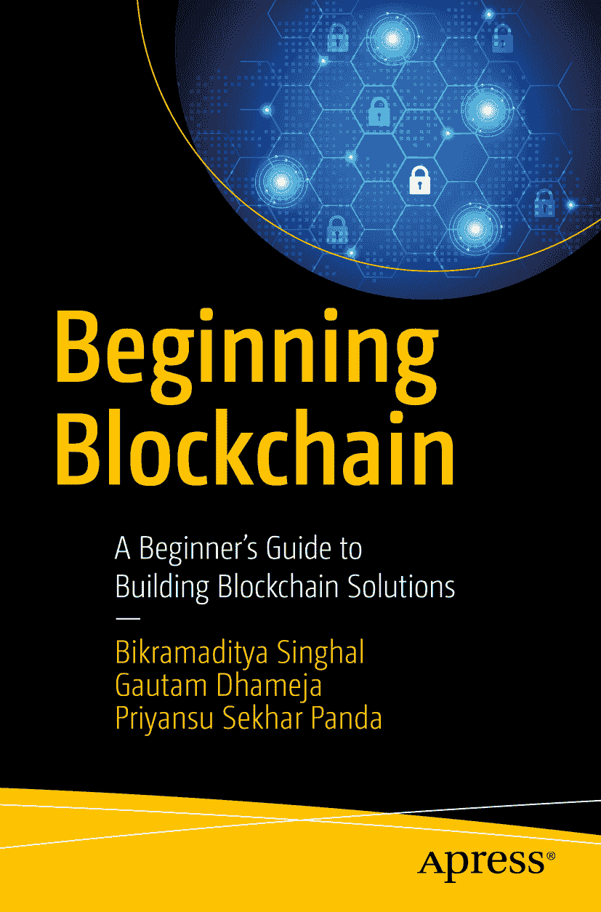

# Bikramaditya Singhal、Gautam Dhameja 与 Priyansu Sekhar Panda 著

## **区块链入门**

### 构建区块链解决方案的初学者指南

ISBN 978-1-4842-3443-3 电子版 ISBN 978-1-4842-3444-0
`doi.org/10.1007/978-1-4842-3444-0`
美国国会图书馆控制号：2018945613
© Bikramaditya Singhal、Gautam Dhameja、Priyansu Sekhar Panda 2018 "标准 Apress 出版"

本书中可能出现商标名称、标识和图片。对于商标名称、标识或图片，我们仅在编辑性用途中及为维护商标所有者利益而使用，无意侵犯商标权。本书中使用商品名称、商标、服务标记及类似术语时，即使未标明其商标属性，也不应视为对其所有权状态的论断。尽管本书中的建议和信息在出版时被认为是真实准确的，但作者、编辑及出版商均不对可能存在的任何错误或遗漏承担法律责任。出版商对本书所含内容不作任何明示或暗示的担保。本书经由 Springer Science+Business Media New York 向全球图书贸易发行，地址：233 Spring Street, 6th Floor, New York, NY 10013。电话：1-800-SPRINGER，传真：(201) 348-4505，电子邮件：orders-ny@springer-sbm.com，或访问 www.springeronline.com。Apress Media, LLC 是加利福尼亚有限责任公司，其唯一成员（所有者）为 Springer Science + Business Media Finance Inc（SSBM Finance Inc）。SSBM Finance Inc 是特拉华州公司。

## 引言

《**区块链入门**》是一本为希望学习区块链技术基础、实际应用及开发实践的人而写的书。本书涵盖了充足的历史背景与理论知识，帮助你为区块链学习之旅打下坚实基础；同时，通过编码示例介绍了相关的开发实践，帮助你快速上手区块链项目。

第一章带你进入区块链世界并设定背景。第二章深入探讨区块链的核心组件。第三章聚焦于比特币的技术概念，以便通过比特币作为区块链加密货币的应用案例来演示第二章讨论的内容。第四章专门讲解以太坊区块链，旨在展示区块链如何被编程用于更多应用场景，而不仅限于加密货币。第五章中，你将通过比特币和以太坊的基本交易示例掌握区块链开发要领。第六章作为最后一章，演示了一个去中心化应用（DApp）的端到端开发。学完本章后，你将掌握足够的工具和技术，能够用适用的区块链解决方案解决许多现实世界的业务问题。开启你通往无限可能的旅程吧。

本书作者提及的任何源代码或其他补充材料，均可通过本书的产品页面（`www.apress.com/978-1-4842-3443-3`）在 `GitHub` 上获取。更多详细信息，请访问 `www.apress.com/source-code`。