# 区块链简介

区块链是一股新的颠覆性浪潮，它已开始重塑商业、社交和政治互动，以及任何其他形式的价值交换。同样，这不仅是变革，更是一场正在快速演进的现实。截至撰写本文时，已有超过 40 家顶级金融机构以及众多跨行业企业开始探索区块链，以降低交易成本、加快交易速度、减少欺诈风险，并消除中间人或中介服务。一些机构正试图重新构想传统系统和服务，将其提升至新水平，同时推出新型服务产品。

本书将详细探讨区块链。如果你是区块链新手，可按章节顺序阅读；也可以仅挑选与你相关的章节。本章将解释区块链的含义、其演变过程，以及结合一些用途和案例，阐述其在当今世界的重要性。它将为你提供一个由外而内的视角，助你更深入地探究区块链。

## 区块链的前世今生

最早为互联网奠定基础的数字化颠覆之一，是 20 世纪 70 年代的 `TCP/IP`（传输控制协议/网际协议）。在 `TCP/IP` 之前，是电路交换的时代，通信双方需要建立专用连接。`TCP/IP` 则采用了更开放、点对点的分组交换设计，无需预先建立专用线路。

20 世纪 90 年代初，互联网通过 `万维网` 向公众开放时，本应更加开放和点对点。这是因为其建立在开放且去中心化的 `TCP/IP` 之上。任何新技术，尤其是革命性技术，面世时要么自行消亡，要么产生巨大影响并成为公认标准。人们适应了万维网革命，并以各种可能的方式利用其优势。结果，万维网的发展方式可能并未完全符合其最初构想。它本可以更开放、更易接入、更具点对点特性。许多新技术和企业在此基础上发展，最终形成了今天的局面——更加中心化。人们逐渐习惯了技术所提供的一切。即使一笔国际交易需要数天才能结算，或成本过高，或可靠性不足，人们也习以为常。

让我们更仔细地审视银行系统及其演变。从古老的以物易物时代到法定货币，交易与结算并无本质区别，因为它们并非两个独立实体。例如，如果爱丽丝需要付给鲍勃 10 美元，她只需将一张 10 美元钞票交给鲍勃，交易即可当场结清。无需银行从爱丽丝账户扣款 10 美元并存入鲍勃账户，也无需银行作为信任系统来确保爱丽丝不欺骗鲍勃。然而，与不在身边的人直接交易却很困难。因此，银行系统不断发展，提供了更多服务，使交易能够覆盖全球各个角落。借助互联网，地理不再成为限制，银行业务比以往任何时候都更加便捷。不仅是银行业务，互联网还促进了网络上的各种价值交换。

技术使印度人能够与英国人进行货币交易，但需要付出成本。此类交易需要数天才能结算，而且费用高昂。此类多方交易始终需要银行来建立信任并确保安全。如果技术本身能在没有这些中介和中心化系统的情况下实现信任与安全，那会怎样？不知何故，技术建立信任的这一部分始终缺失，导致银行、托管服务、清算所、登记机构等中心化系统应运而生。区块链正是互联网革命拼图中缺失的那一块，它以密码学安全的方式实现了去信任（`trustless`）系统。

中本聪——世人皆知这个化名——或许认为，自 20 世纪 80 年代以来，货币系统就未曾受到技术革命的触动。银行作为中心化机构，维护交易记录、管理互动、强制信任与安全，并规范整个系统。整个商业依赖于这些金融机构，它们作为可信第三方处理支付。金融中介增加了交易结算的成本和时间，也限制了交易规模。中介是解决争端所需，但这意味着完全不可逆的交易永远无法实现。这导致人们交易时需要信任他人。显然，这种官僚体制必须改变，以跟上经济预期的数字化转型。因此，中本聪发明了一种名为 `比特币` 的加密货币，其背后支撑技术正是区块链。比特币只是区块链在货币领域的一个应用案例，它解决了基于信任的模型固有的弱点。本书将深入探讨比特币和区块链的基本原理。

## 什么是区块链？

互联网已经彻底改变了生活、社会和商业的诸多方面。然而，我们在前一节了解到，在过去的几十年里，人们和机构之间相互执行交易的方式并没有太大改变。区块链被认为是完成互联网版图、使其更加开放、更易访问、更可靠的关键组件。

要理解区块链，你必须从商业角度和技术角度两方面来理解。让我们首先在商业交易的语境下理解它，把握其“是什么”，然后在接下来的章节中深入技术层面，理解其“如何运作”。

区块链是一个点对点的价值（不仅仅是金钱！）交易记录系统。这意味着，它不需要银行、经纪商或其他托管服务等可信中介作为可信的第三方。例如，如果爱丽丝支付给鲍勃 10 美元，为什么需要通过银行呢？请看图 1-1。

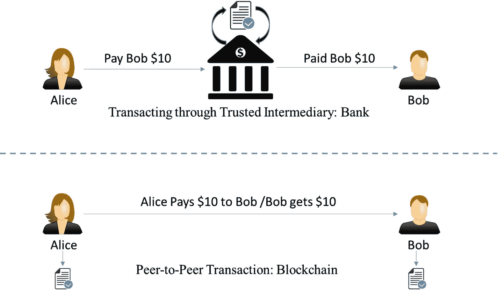

图 1-1：通过中介的交易 vs. 点对点交易

现在让我们看另一个例子。一笔典型的股票交易在几秒钟内完成，但其结算却需要数周。这在数字时代是可取的吗？当然不是！图 1-2 展示了当前的情况。

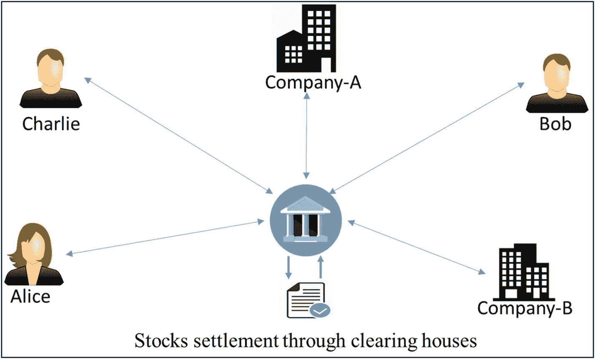

图 1-2：通过中介清算所进行的股票交易

如果有人想从一家公司或个人那里购买一些股票，他们可以直接从对方那里购买并即时结算，无需中间涉及经纪商、清算所或其他金融机构。针对这种情况的去中心化、点对点解决方案可以如图 1-3 所示。

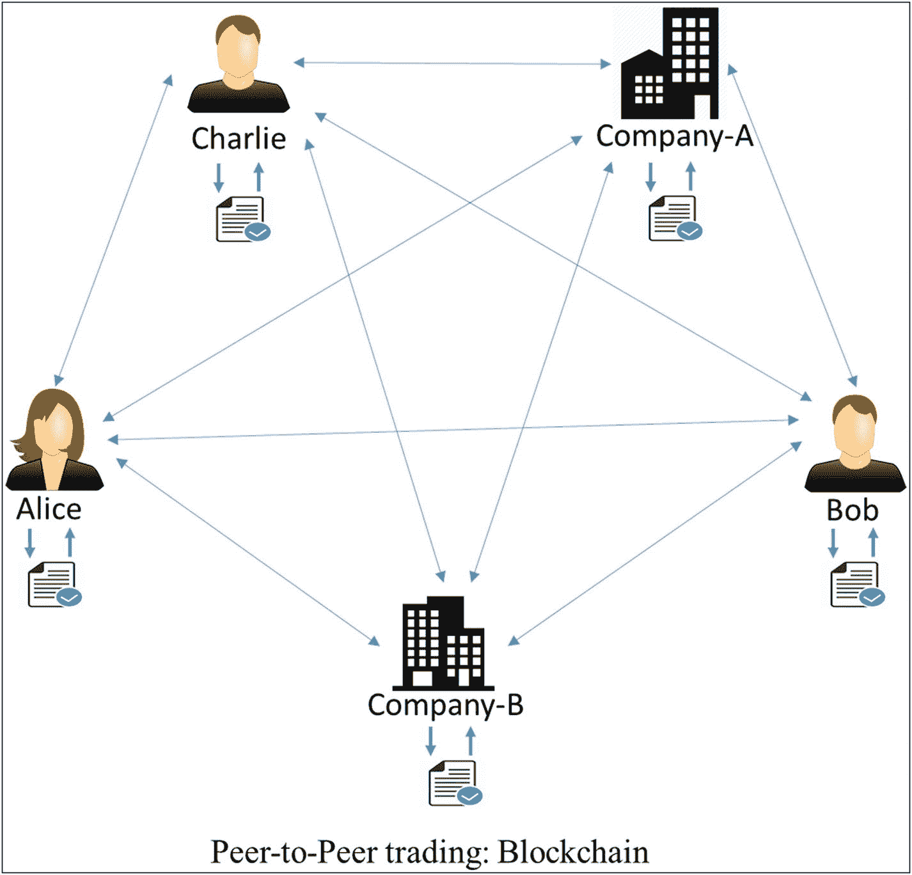

图 1-3：点对点股票交易

请注意，在区块链的设定中，交易和结算并非两个不同的实体！交易类似于，比方说，法定货币交易：如果某人付给另一个人一张 10 美元的纸币，那么他们就不再拥有它，而这张 10 美元纸币就物理地转移到了新主人手中。

既然你已经从功能层面，在高层次上理解了区块链，让我们再从技术角度稍作探讨，这样将其命名为“区块链”的原因就变得更清晰了。我们将在技术上看到它“是什么”，而将其“如何运作”留给第 2 章。

请阅读以下陈述，如果这些概念在你的理解中还不能很好地融合在一起，不必担心。你可能需要重新回顾它，但请耐心读完本书。

- 区块链是一个点对点的价值交易系统，中间没有可信的第三方。
- 它是一个共享的、去中心化的、开放的交易分类账。这个账本数据库在大量节点上进行复制。
- 这个账本数据库是一个只可追加的数据库，不能被更改或篡改。这意味着每一条记录都是永久性的记录。在其上的任何新条目都会反映在不同节点上托管的数据库的所有副本中。
- 不需要可信第三方作为中介来验证、保护和结算交易。
- 它是互联网之上的又一层，并能与其他互联网技术共存。
- 正如 `TCP/IP` 被设计用于实现开放系统一样，区块链技术被设计用于实现真正的去中心化。为此，比特币的创造者将其开源，以期激发许多去中心化应用。

一个典型的区块链可能如图 1-4 所示。

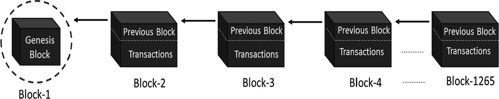

图 1-4：区块链数据结构

区块链网络上的每个节点都拥有图 1-4 所示区块链的相同副本，其中每个区块都是交易的集合，因此得名。如你所见，每个区块有两个主要部分。“区块头”部分链接回链中的前一个区块。这意味着每个区块头都包含前一个区块的哈希值，这样任何人都无法篡改前一个区块中的任何交易。我们将在后续章节中深入了解这个概念。区块的另一部分是“主体内容”，其中包含一个经过验证的交易列表，包括交易金额、相关方的地址以及一些其他细节。因此，给定最新的区块，就可以访问区块链中的所有先前区块。

让我们考虑一个实际例子，看看交易是如何发生的，以及账本是如何在网络中更新的，从而了解这个系统是如何工作的：

假设有三个参与者——爱丽丝、鲍勃和查理——他们在一个区块链网络上相互进行一些货币交易。让我们一步步地经历这些交易，以理解区块链的开放和去中心化特性。

### 步骤 1：

假设爱丽丝最初有 50 美元，这是所有交易的起源，并且每个节点都知道这一点，如图 1-5 所示。

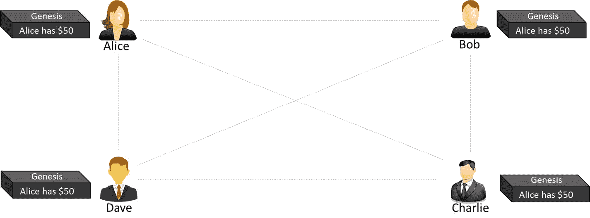

图 1-5：创世区块

### 步骤 2：

爱丽丝支付 20 美元给鲍勃，完成了一笔交易。观察区块链如何在每个节点上更新，如图 1-6 所示。

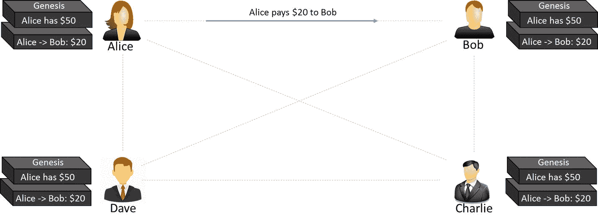

图 1-6：第一笔交易

### 步骤 3：

鲍勃支付 10 美元给查理，完成了另一笔交易，区块链更新如图 1-7 所示。

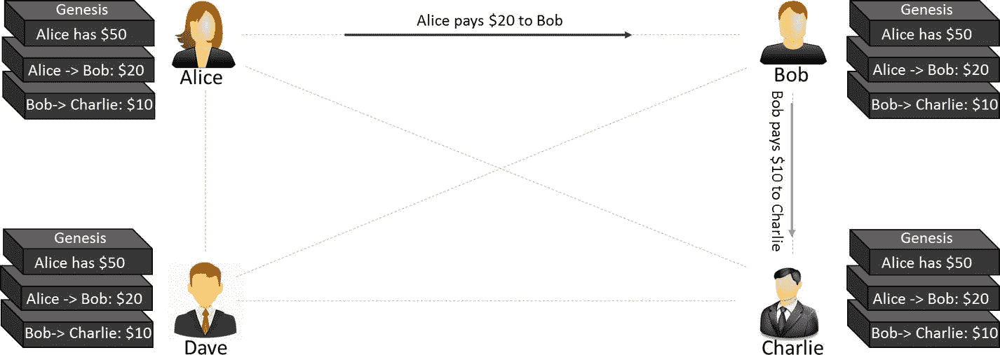

图 1-7：第二笔交易

请注意，区块中的交易数据是不可变的。所有交易都是完全不可逆的。任何更改都会导致一笔新的交易，而该交易将得到所有参与节点的验证。每个节点都有自己的区块链副本。

如果你心中冒出许多问题，比如“如果爱丽丝向戴夫支付相同金额以实现双花，或者如果她账户资金不足却进行支付怎么办？”“安全性如何保证？”等等，那太好了！我们将在接下来的章节中详细介绍这些内容。

## 中心化与去中心化系统

我们探讨中心化与去中心化之争的根本原因，在于区块链的设计初衷是去中心化的，它挑战了传统的中心化设计。然而，“去中心化”和“中心化”这两个术语并不总是清晰明了。它们在许多地方定义模糊，甚至具有误导性。原因在于，几乎不存在纯粹的中心化或去中心化系统。本节中的大部分概念和示例，灵感均来源于 `以太坊` 区块链创始人维塔利克·布特林（`Vitalik Buterin`）的笔记。

那么，什么是分布式系统呢？为了不干扰当前的讨论，我们先理解它并将其排除在讨论范围之外。请注意，无论一个系统是中心化还是去中心化，它依然可以是分布式的。中心化分布式系统是指存在一个主节点负责分解任务或数据，并将负载分布到各个节点上。另一方面，去中心化分布式系统则不存在这样一个“主”节点，但计算任务仍然是分布式的。区块链就是这样一个例子，我们将在本书后面看到许多它的图示。图 1-8 以图形方式展示了中心化分布式系统可能的样子。

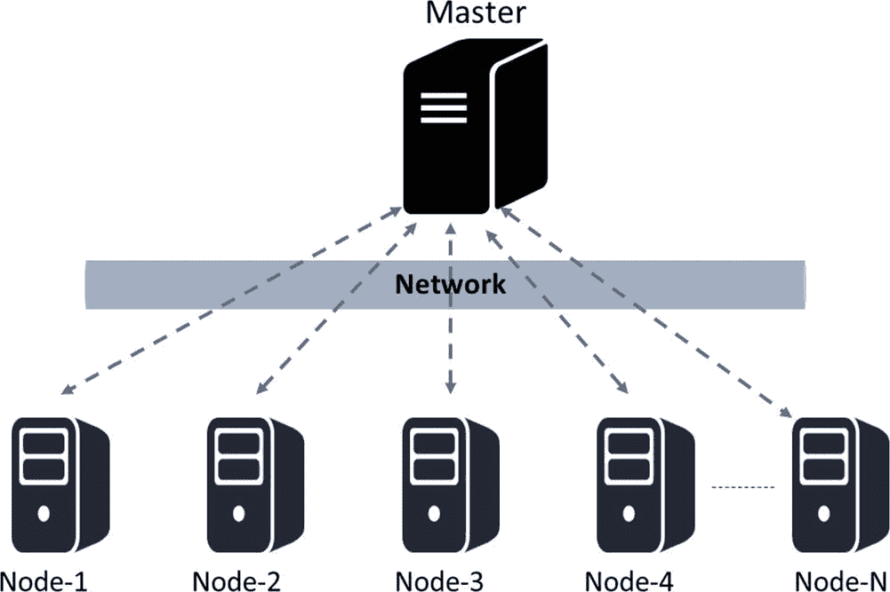

图 1-8：一个具有中心化控制的分布式系统

例如，这种表示类似于 `Hadoop` 的实现。尽管由于分布式计算，这种设计在计算速度上更快，但它也因中心化而受到限制。

让我们继续讨论中心化与去中心化。极其重要的是，一个系统是中心化还是去中心化，并不仅限于技术架构。我们要表达的意思是，一个系统在技术上可能是中心化或去中心化的，但在逻辑上或政治上可能并非如此。为了能够根据需求正确地设计系统，让我们来看看这些不同的视角：

- **技术架构**：从技术架构的角度来看，一个系统可以是中心化或去中心化的。我们考虑的是设计一个系统使用了多少台物理计算机（或节点），在系统完全崩溃之前能承受多少个节点故障等。
- **政治视角**：这个视角指的是个人、群体或整个组织对系统拥有的控制权。如果系统的计算机由他们控制，那么该系统自然就是中心化的。然而，如果没有特定的个人或群体控制该系统，并且每个人对系统拥有平等的权利，那么在政治意义上它就是去中心化的系统！
- **逻辑视角**：一个系统可以根据其呈现出来的样貌，在逻辑上是中心化或去中心化的，而不管其在技术上或政治上是中心化还是去中心化的。另一种类比是，如果你将一个系统（比如计算设备）垂直切成两半，每一半都包含服务提供者和消费者，如果它们能作为独立单元运行，那么就是去中心化的，否则就是中心化的。

所有上述视角对于设计一个实际系统并将其称为中心化或去中心化都至关重要。让我们讨论一些混合了这些视角的示例，以澄清你可能存在的任何困惑：

- 如果你观察企业，它们在架构上是中心化的（一个总部），在政治上是中心化的（由首席执行官或董事会管理），并且在逻辑上也是中心化的（你无法真正将它们切成两半）。
- 我们的交流语言从每个角度来看都是去中心化的——架构上、政治上以及逻辑上。对于两个人之间的交流而言，通常他们的语言既不受政治影响，也不在逻辑上依赖于其他人的交流语言。
- 像 `BitTorrent` 这样的种子系统，从每个角度来看也都是去中心化的。任何节点都可以是提供者或消费者，所以即使你将系统切成两半，它仍然能运行。
- 另一方面，内容分发网络在架构上是去中心化的，逻辑上也是去中心化的，但在政治上是中心化的，因为它由企业拥有。亚马逊 `CloudFront` 就是一个例子。
- 现在让我们考虑区块链。区块链的目标是实现去中心化。因此，它在设计上就是架构上去中心化的。同时，从政治角度来看，它也是去中心化的，因为没有人控制它。然而，它在逻辑上是中心化的，因为存在一个共同认可的全局状态，整个系统就像一个单一的全球计算机一样运行。

让我们分别探讨这些术语，并进行比较，以便理解为什么区块链在设计上是去中心化的。

### 中心化系统

顾名思义，中心化系统具有集中控制权，拥有所有管理权限。这类系统易于设计、维护、建立信任和管理，但存在许多固有的局限性，如下所示：

- 它们存在单点故障，因此稳定性较差。
- 它们更容易受到攻击，因此安全性较低。
- 权力集中可能导致不道德的操作。
- 在大多数情况下，可扩展性困难。

一个典型的中心化系统可能如图 1-9 所示。

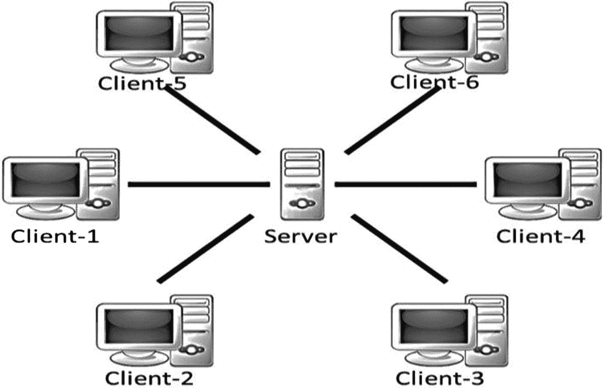

图 1-9：一个中心化系统

### 去中心化系统

顾名思义，去中心化系统没有集中控制权，每个节点拥有平等的权限。这类系统难以设计、维护、管理或建立信任。但是，它们不存在传统中心化系统的那些局限性。去中心化系统具有以下优势：

- 它们没有单点故障，因此更稳定，容错性更强。
- 抗攻击能力强，因为没有容易攻击的中心点，因此更安全。
- 在所有节点之间权力对等的对称系统，因此不道德操作的空间更小，通常具有民主性质。

一个典型的去中心化系统可能如图 1-10 所示。

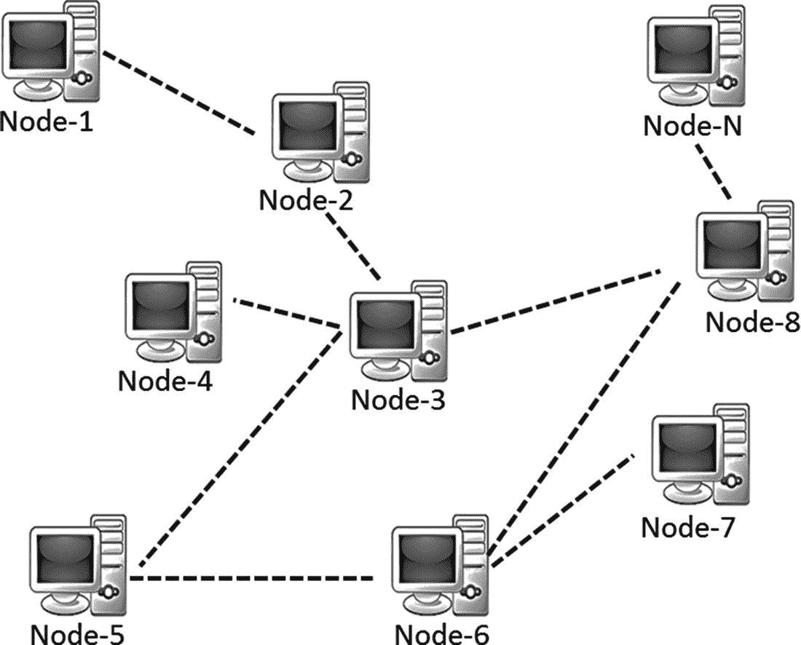

图 1-10：一个去中心化系统

请注意，分布式系统也可以是去中心化的。区块链就是一个例子！然而，与常见的分布式系统不同，任务不会被子划分并委派给各个节点，因为在区块链中没有主节点来做这件事。贡献节点并非只承担部分工作，而是有兴趣的节点（或随机选中的节点）执行整个工作。一个典型的去中心化且分布式的系统，实际上是一个点对点系统，可能如图 1-11 所示。

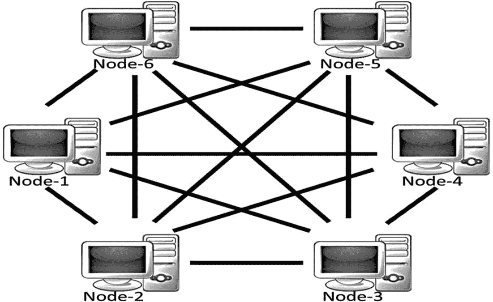

图 1-11：一个去中心化的点对点系统

## 区块链的层次结构

截至目前，以太坊等公有区块链变体正处于成熟过程中，在这些区块链之上构建复杂应用可能并非明智之举。请记住，区块链从来不仅仅是一项技术，而是商业原则、经济学、博弈论、密码学与计算机科学工程的结合。大多数现实世界中的应用本质上都相当复杂，建议从零开始构建区块链解决方案。

本节的目的仅为让您概览区块链的各个层次，并在后续章节深入探讨核心基础知识。首先，让我们回顾一下对 TCP/IP 协议栈的基本理解。TCP/IP 协议栈中的分层方法实际上是实现开放系统的一种标准。拥有抽象层不仅有助于更好地理解协议栈，也有助于构建符合该协议栈的产品，从而实现开放系统。此外，各层之间的相互抽象使系统更健壮且易于维护。对任何一层的更改都不会影响其他层。再次强调，不要将 TCP/IP 的类比与区块链的层次混淆。TCP/IP 是每个互联网应用都使用的通信协议，区块链亦是如此。

进入区块链领域。目前尚无公认的全球标准能够将区块链组件清晰划分为不同层次。分层异构架构是必要的，但就目前而言，这仍是未来的发展方向。因此，我们将尝试构建区块链层次，以便更好地理解这项技术，并在市场上数百种区块链/加密货币变体之间建立类比。请参见图 1-12 中区块链的高层级分层表示。

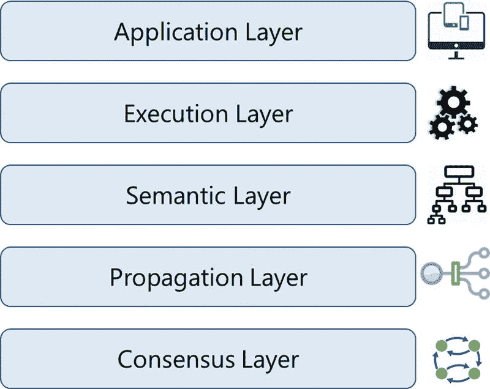
图 1-12 区块链的各个层次

您可能会疑惑为什么是五层，而不是更细粒度或更少的层。显然，层数不能太多也不能太少；这将是复杂度、健壮性、适应性等因素之间的权衡。这里的目的同样不是标准化区块链技术，而是建立更好的理解。请记住，所有这些层都存在于所有节点上。

在本书的第 6 章中，我们将从零开始构建一个去中心化应用，并通过实际用例学习区块链如何在所有这些层上运行。

### 应用层

由于区块链的特性，如数据的不可篡改性、参与者之间的透明性、对抗攻击的韧性等，诸多应用正在被构建。某些应用仅在应用层构建，将任何可用的区块链“风味”视为既定事实；而另一些应用在应用层构建，并与区块链中的其他层交织在一起。这就是为什么应用层应被视为区块链的一部分。

这是您编写所需功能、为最终用户构建应用的层次。它通常涉及传统的软件开发技术栈，如客户端编程结构、脚本、API、开发框架等。对于将区块链视为后端处理的应用，这些应用可能需要托管在 Web 服务器上，这可能需要 Web 应用开发、服务器端编程和 API 等。理想情况下，良好的区块链应用不采用客户端–服务器模型，也没有客户端访问的集中式服务器——这正是比特币的工作方式。

您可能听说过或已经学习过链下网络的概念。其思想是构建那些并非所有事务都依赖区块链，而是明智地使用区块链的应用。换句话说，这个概念是为了确保繁重的工作在应用层完成，或大量的存储需求在链下处理，从而使核心区块链轻量且高效，网络流量也不会过大。

### 执行层

执行层是区块链网络中所有节点执行由应用层排序的指令的地方。这些指令可能是简单指令，也可能是以智能合约形式存在的一组多个指令。无论哪种情况，都需要执行程序或脚本来确保交易的正确执行。区块链网络中的所有节点都必须独立执行这些程序/脚本。在同一组输入和条件下，程序/脚本的确定性执行在所有节点上总能产生相同输出，这有助于避免不一致性。

在比特币的情况下，这些是简单的脚本，并非图灵完备，仅允许有限的指令集。而以太坊和 Hyperledger 则允许复杂的执行。以太坊的代码或其用`solidity`编写的智能合约会被编译为`字节码`或`机器码`，在其自身的`以太坊虚拟机`上执行。Hyperledger 对其链码智能合约采用了更简单的方法。它支持在 Docker 镜像内运行已编译的机器码，并支持多种高级语言，如 Java 和 Go。

#### 语义层

语义层是一个逻辑层，因为交易和区块之间存在有序性。一笔交易，无论有效与否，都包含一组指令，这些指令会通过执行层，但在语义层得到验证。以比特币为例，诸如是否花费了合法的交易、是否存在双重支付攻击、交易发起者是否获得授权等进行交易的验证都在这一层完成。你将在后续章节中学到，比特币实际上是以交易的形式呈现，这些交易代表了系统的状态。要能够花费一个比特币，你必须消耗一个或多个之前的交易记录，并且不存在“账户”的概念。这意味着当某人进行交易时，他们会使用之前的某笔交易记录，在该记录中他们至少收到了当前要花费的金额。所有节点都必须通过遍历之前的交易来验证这笔交易，以确认其合法性。相比之下，以太坊则采用了账户体系。这意味着发起交易的一方和接收交易的一方的账户都会得到更新。

在这一层，可以定义系统的规则，例如数据模型和数据结构。有些情况可能比简单的交易更为复杂。复杂的指令集通常被编码到智能合约中。当接收到一笔交易并调用智能合约时，系统的状态便会更新。智能合约是一种特殊类型的账户，它包含可执行代码和私有状态。一个区块通常包含一组交易和一些智能合约。诸如默克尔树之类的数据结构在这一层被定义，区块头中的默克尔根用于维护区块头与区块内交易集（通常是磁盘上的键值存储）之间的关系。此外，数据模型、存储模式、基于内存/磁盘的处理方式等，都可在这一逻辑层中定义。

除上述之外，正是语义层定义了区块之间如何相互链接。区块链中的每个区块都包含前一个区块的哈希值，一直追溯到创世区块。尽管区块链的最终状态是由所有层共同贡献达成的，但区块之间的链接方式需要在这一层定义。根据不同的用例，你可能会想在这一层编写额外的功能。

#### 传播层

之前的各层更像是一种个体现象：与系统中其他节点的协调不多。传播层是一个点对点通信层，它允许节点相互发现、相互通信，并根据网络的当前状态进行同步。当一笔交易发生时，我们知道它会广播到整个网络。同样，当一个节点想要提议一个有效区块时，它会立即传播到整个网络，以便其他节点将其视为最新区块，并在此基础上进行构建。因此，网络中交易/区块的传播是在这一层定义的，这确保了整个网络的稳定性。按照设计，大多数区块链系统的设计方式是，当它们得知一个新的交易/区块时，会立即将其转发给所有直接相连的节点。

在异步的互联网网络中，交易或区块的传播常常存在延迟问题。有些传播在几秒内完成，而有些则需要更长时间，这取决于节点的容量、网络带宽以及其他一些因素。

#### 共识层

对于大多数区块链系统而言，共识层通常是基础层。该层的主要目的是让所有节点就账本的一致状态达成共识。根据不同的用例，节点之间达成共识的方式可能有所不同。区块链的安全性和保障性正是在这一层得到确认的。在比特币或以太坊中，共识是通过称为“挖矿”的适当激励技术实现的。对于一个公共区块链要实现自我可持续性，必须存在某种激励机制，这种机制不仅有助于维持网络的活性，还能强制执行共识。比特币和以太坊使用工作量证明（`PoW`）共识机制来随机选择一个可以提议区块的节点。一旦该区块被提议并传播到所有节点，它们就会检查该区块是否为包含所有合法交易的有效区块，并且`PoW`难题是否被正确解决；然后节点将这个区块添加到它们自己的区块链副本中，并在此基础上继续构建。共识协议有许多不同的变体，例如权益证明（`PoS`）、委托权益证明（`dPoS`）、实用拜占庭容错（`PBFT`）等，我们将在后续章节中详细讨论。

## 为什么区块链很重要？

我们探讨了中心化系统和去中心化系统的设计方面，并对去中心化系统相对于中心化系统的技术优势有了一些了解。我们还学习了区块链的不同层级。作为一个去中心化的点对点系统，区块链具有一些固有的优势和复杂性。请记住，它并不是能够解决世界上所有问题的万能药，但在某些特定场景下，它正是当下的迫切需求。也存在一些情况，将现有解决方案进行区块链化，会使其更健壮、更透明、更安全。然而，如果方法不当，它同样可能导致灾难！现在，让我们从业务和功能的角度来分析区块链。

### 中心化系统的局限性

如果你快速浏览一下软件演进的历程，你会发现许多软件解决方案都采用中心化设计。其原因不仅在于中心化系统易于开发和维护，还因为我们已经习惯依赖这样的设计来信任系统。我们总是需要一个可信的第三方来确保自己不会受骗或成为骗局的受害者。如果没有事先的商业关系，与他人进行交易甚至扩大规模都很困难。人们可能不会与自己从未听说过的人做生意。

让我们举一个例子来更好地理解这一点。如今，当我们从亚马逊订购商品时，我们会感到安全，并确信商品能够送达。商品的生产者是一方，而买家是另一方。那么亚马逊在这里扮演了什么角色？它是作为一个充当可信中介的赋能者，同时也从交易中抽取一部分利润。买家信任卖家，而这种信任关系实际上是由这些可信的第三方强加的。区块链所提出的是，在现代数字时代，我们实际上并不需要中间的第三方来强制建立信任，并且技术已经足够成熟来处理这一点。在区块链中，信任默认是网络固有的一部分，我们将在后续章节中进一步探讨。

让我们快速了解传统中心化系统的一些缺点：

*   信任问题
*   安全问题
*   隐私问题——数据销售的隐私正受到损害
*   交易的成本和时间因素

相对于中心化系统，去中心化系统的一些优势可能是：

*   消除中介
*   更简单、更真实的交易验证
*   以更低的成本提高安全性
*   更高的透明度
*   去中心化和不可篡改性

### 区块链的采用现状

2009 年，`区块链`随着一种名为`比特币`的数字加密货币通过一份简单的邮件列表问世。在其推出后不久，人们便意识到了它超越加密货币的巨大潜力。一些公司推出了不同形式的`区块链`产品，例如`以太坊`、`超级账本`等。`微软`和`IBM`分别在其`Azure`和`Bluemix`云平台上推出了 SaaS（软件即服务）产品。众多初创公司如雨后春笋般成立，许多成熟企业也启动了`区块链`计划，专注于解决以往难以解决的一些业务问题。

现在才说`区块链`拥有以某种方式颠覆几乎每个行业的巨大潜力已经太迟了；这场革命早已开始。它已经对金融服务市场产生了巨大影响。现在很难找到一家尚未探索`区块链`的全球性银行或金融机构。除了金融市场，在媒体和娱乐、能源交易、预测市场、零售连锁、忠诚度奖励系统、保险、物流与供应链、医疗记录以及政府和军事应用等领域，也已开始或正在采取相关举措。

截至撰写本文时，许多初创公司和现有企业都已能看到基于`区块链`的系统如何真正解决一些痛点，并在许多方面带来益处。然而，设计出正确的`区块链`解决方案相当具有挑战性。虽然有一些关于`区块链`产品或解决方案的绝佳想法，但构建或实施这些想法同样困难。有一些用例只能建立在公共`区块链`上。设计一个拥有适当挖矿生态系统的自我维持型`区块链`很困难，而就现有的、可用于构建非加密货币应用的公共`区块链`而言，除了`以太坊`之外别无他选。一个`区块链`应用是仅在应用层构建并直接使用底层，还是需要从头开始构建，这是一个难以抉择的问题。此外还存在一些技术挑战。`区块链`仍在成熟过程中，要获得主流采用可能还需要几年时间。截至目前，已有多种方案来解决`区块链`的可扩展性问题。在本书中，我们将努力从所有这些角度建立起扎实的理解。现在，让我们在下一小节看看一些具体的用途和用例。

## 区块链的用途与用例

在本节中，我们将了解已在金融、保险、银行、医疗、政府、供应链、物联网（IoT）、媒体和娱乐等行业中采取的一些举措。然而，可能性是无限的！在中心化系统中难以实现的真正共享经济，可以通过`区块链`技术实现（例如，`Uber`、`Airbnb`的点对点版本）。让公民能够拥有自己的身份（自主主权数字身份）并利用这项技术将自己的数据货币化也是可能的。现在，让我们先来看一些现有的用例。

*   任何类型的财产或资产，无论是物理的还是数字的，例如笔记本电脑、手机、钻石、汽车、房地产、电子注册、数字文件等，都可以在`区块链`上注册。这可以使这些资产在人与人之间进行交易、维护交易日志，并验证有效性或所有权。此外，还可以开发公证服务、存在性证明、定制化保险方案等更多用例。
*   `区块链`上正在开发许多金融用例，例如跨境支付、股票交易、忠诚度与奖励系统、银行间的了解你的客户（KYC）等。首次代币发行（ICO）是截至撰写本文时最热门的用例之一。ICO 是当今利用加密货币作为数字资产进行众筹的最佳方式。ICO 中的代币可以被视为企业中的数字股票，非常便于购买和交易。
*   `区块链`可以用来实现“群体智慧”，通过利用集体智慧来引领和塑造商业、经济及各种国家现象！基于群体智慧的金融和经济预测、去中心化预测市场、去中心化投票以及股票交易都可以在`区块链`上实现。
*   确定音乐版税的过程历来复杂。互联网带来的音乐流媒体服务促进了更高的市场渗透率，但也使版税确定变得更加复杂。通过维护一个包含音乐版权所有权信息以及授权媒体内容分发的公共账本，`区块链`在很大程度上可以解决这个问题。
*   这是一个物联网时代，到处都有数十亿的物联网设备，并且还有更多设备将加入进来。大量不同的品牌、型号和通信协议使得建立一个中心化系统来控制设备并提供通用数据交换平台变得困难。这也是`区块链`的一个应用领域，可用于为物联网设备构建一个去中心化的点对点系统，使它们能够相互通信。ADEPT（自主去中心化点对点遥测技术）是 IBM 和三星的联合项目，它开发了一个平台，利用`比特币`底层设计的元素来构建一个设备分布式网络——即一个去中心化的物联网。ADEPT 在平台中使用了三种协议：用于文件共享的`BitTorrent`、用于智能合约的`以太坊`以及用于点对点消息传递的`TeleHash`。IOTA 基金会是另一个类似的举措。
*   在政府部门，`区块链`也获得了发展势头。有一些用例在技术上需要去中心化，但在政治上应由政府管理：土地登记、车辆登记与管理、电子投票等都是一些活跃的用例。供应链是`区块链`有众多优秀用例的另一个领域。全球的供应链一直容易发生纠纷，因为在这些系统中维持透明度一向很困难。

## 总结

在本章中，我们涵盖了`区块链`的演变、它的历史、它是什么、其设计优势，以及为什么它如此重要，并附带了一些相关的用例。在本节中，我们将结合技术革命，总结其具有变革性的贡献。

20 世纪 90 年代，互联网的大规模普及改变了人们的经商方式。它消除了信息创建和传播中的摩擦。这为新的市场、更多的机遇和可能性铺平了道路。同样地，今天的`区块链`通过消除三个关键领域的摩擦，将互联网提升到了一个全新的水平：控制权、信任和价值。

**控制权**：`区块链`通过使系统去中心化来分配控制权。

**信任**：`区块链`是一个不可变、防篡改的账本。它向所有节点提供一个单一、共享的事实来源，使系统无需信任。这意味着，与任何未知个人或实体进行交易不再需要信任，信任是系统设计所固有的。

**价值**：`区块链`能够以任何形式交换价值。人们可以在没有中心化实体或中介的情况下发行和转移资产。

在第 2 章中，我们将深入探讨`区块链`的基础知识。