# 2. 区块链的工作原理

我们正站在一场新数字革命的边缘。区块链很可能是自互联网本身以来最伟大的发明！它是下一代互联网交互系统中最具前景的技术，并受到了众多行业领域以及学术界的广泛关注。如今，许多组织已经意识到，他们需要为区块链做好准备，以便在市场中维持自己的地位。我们在第 1 章中已经看了一些用例，但其可能性是无限的。尽管区块链并非解决所有商业问题的万能灵药，但它已经开始影响大多数商业功能及其技术实现。

为了能够利用区块链解决一些现实世界的商业问题，我们实际上需要对其是什么以及如何运作有细致入微的理解。为此，需要通过不同的视角来理解它，例如商业、技术和法律视角。本章旨在深入探讨区块链技术的细节，并全面理解其运作方式。

## 奠定区块链基础

区块链不仅仅是一项技术，它大多与商业功能和用例相结合。在其加密货币的实现中，它还与经济学原理交织在一起。在本节中，我们将主要关注其技术方面。从技术上讲，区块链是密码学、博弈论和计算机科学工程学概念的巧妙融合，如图 2-1 所示。

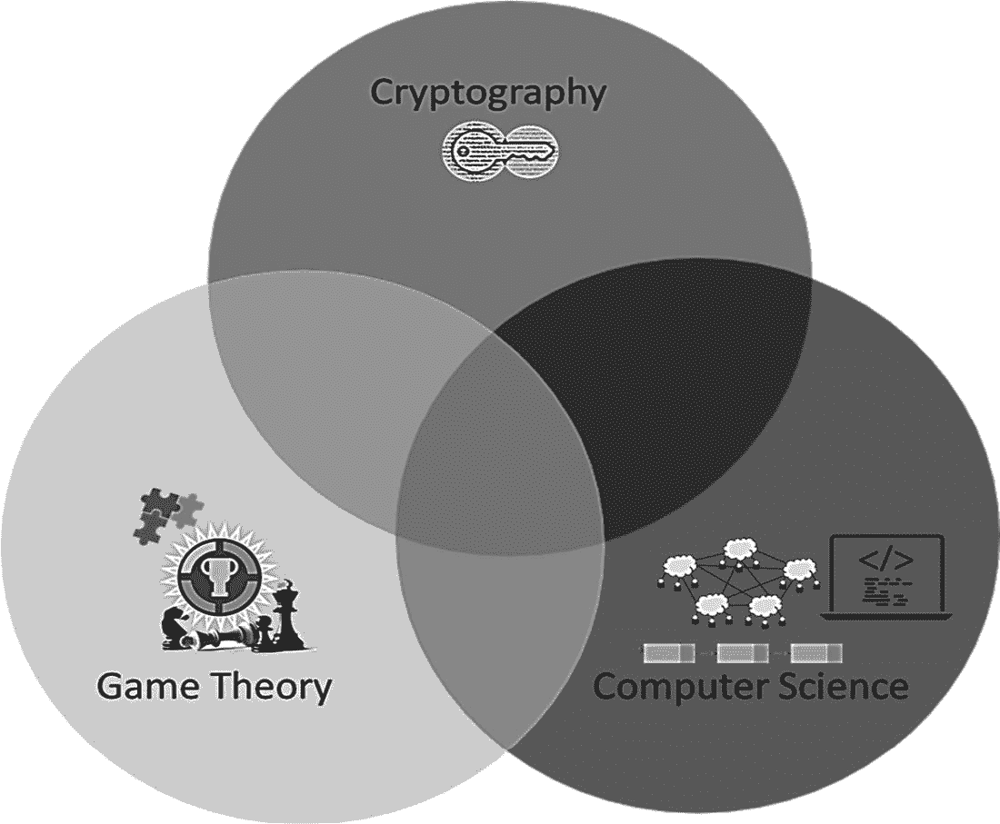
图 2-1 — 区块链的核心

让我们从宏观层面看看这些组件在区块链系统中扮演的角色，并最终深入探讨其基本原理。在此之前，让我们快速回顾一下传统的中心化系统是如何工作的。传统方法是由一个中心化实体来维护唯一的交易/修改历史。这样做是为了对整个数据库实施并发控制，并通过中介机构将信任注入系统。那么，这样一个稳定的系统又有什么问题呢？中心化系统必须被信任，无论其中涉及的人是否诚实！此外，由于中介机构的存在，成本和交易时间显然可能会更高。现在想想权力的集中化；对整个系统拥有完全控制权，使得中心化权威几乎可以为所欲为。

现在，让我们看看区块链如何通过使用密码学、博弈论和计算机科学概念来解决这些由中心化中介引起的问题。无论用例如何，交易都使用密码学来确保安全。使用密码学，可以确保是由有效用户发起交易，并且没有人能够伪造欺诈性交易。这意味着，从密码学上可以保证，爱丽丝无论如何都无法通过伪造鲍勃的签名来代表他进行交易。现在，如果某个节点或用户试图发起双重支付攻击（例如，某人只有十美元，却试图向多人支付相同的金额）会怎样？请密切关注此处——尽管没有足够的资金，某人仍然可以发起一次在密码学上正确的双重支付。防止双重支付的唯一方法是让每个节点都了解所有交易。这又引出了另一个有趣的问题。既然每个节点都应该维护交易数据库，他们如何才能就一个共同的数据库状态达成一致？再者，当一个或多个计算节点故意试图颠覆系统并试图注入欺诈性的数据库状态时，系统又如何能保持不受影响？这类问题中的大多数都属于拜占庭将军问题（稍后描述）。好吧，因为区块链，这个问题变得更加广为人知，但它其实已经存在很久了。如果你看看数据中心解决方案或分布式数据库解决方案，拜占庭将军问题正是它们为了保持容错性而需要处理的一个明显且常见的问题。这类情况及其解决方案实际上源于博弈论。博弈论领域提供了一种截然不同的方法来确定系统将如何运作。博弈论中的技术可以说是最复杂、最现实的技术。它们通常不考虑一个节点是诚实的、恶意的、有道德的，还是具有任何其他类似特性，而是认为参与者根据他们能获得的利益行事，而不是基于道德价值观。博弈论在区块链中的唯一目的是确保系统是稳定的（即处于纳什均衡状态），并且参与者之间达成共识。

存在着不同类型的商业问题和情况，其复杂程度也各不相同。因此，底层的密码学和博弈论共识协议在不同的用例中可能有所不同。然而，维护经过验证的交易的一致日志或数据库这一普遍原则是相同的。虽然密码学和博弈论的概念已经存在相当长的时间，但正是计算机科学这一部分，通过数据结构和点对点网络通信技术将这些零散的部分缝合在一起。显然，需要在数字世界中实现任何逻辑或数学概念，就少不了“智能软件工程”。正是计算机科学工程技术将密码学和博弈论概念融入到应用程序中，通过数据结构和网络通信组件，实现了节点之间的去中心化和分布式计算。

## 密码学

密码学是区块链最重要的组成部分。它本身就是一个研究领域，基于相当复杂、难以理解的高级数学技术。我们将努力在本节中对部分密码学概念建立扎实的理解，因为不同的问题可能需要不同的密码学解决方案；没有一种方案能放之四海而皆准。你可以跳过一些细节，或在需要时再查阅，但它是确保系统安全的最重要组成部分。由于设计较弱或密码学实现不佳，已有许多关于钱包和交易所被攻击的报道。

密码学已有两千多年的历史。它是利用加密技术对信息进行保密的科学。然而，保密性并非唯一目标。密码学还有其他各种用途，如下所列，我们将在后面探讨：

* **保密性**：只有预期或授权的接收者才能理解消息。它也可以被称为隐私或秘密。
* **数据完整性**：数据不能被对手故意篡改，也不能因无意或意外错误而修改。虽然数据完整性无法阻止数据的更改，但它可以提供一种检测数据是否被修改的手段。
* **身份认证**：发送者的真实性得到保证，并且接收者可以验证。
* **不可否认性**：发送者在发送消息后，以后不能否认他们发送过该消息。这意味着一个实体（个人或系统）不能拒绝承认先前承诺或行动的所有权。

任何形式的信息，如文本消息、数字数据或计算机程序，都可以称为 **明文**。其思想是使用加密算法和密钥对明文进行加密，生成 **密文**。然后可以将密文发送给预期的接收者，接收者使用解密算法和密钥解密，得到明文。

我们举个例子。Alice 想要向 Bob 发送一条消息（`m`）。如果她直接发送消息，任何对手（例如 Eve）都可以轻易拦截消息，导致保密性受损。因此，Alice 希望使用加密算法（`E`）和密钥（`k`）对消息进行加密，生成称为“密文”的加密消息。对手必须同时知道算法（`E`）和密钥（`k`）才能拦截消息。算法和密钥越强，对手攻击的难度就越大。请注意，设计至少具有 **可证明安全性** 的区块链系统始终是可取的。这意味着系统必须能够抵御对手的某些类型的可行攻击。

这种方法的常见步骤集可以如图 2-2 所示。

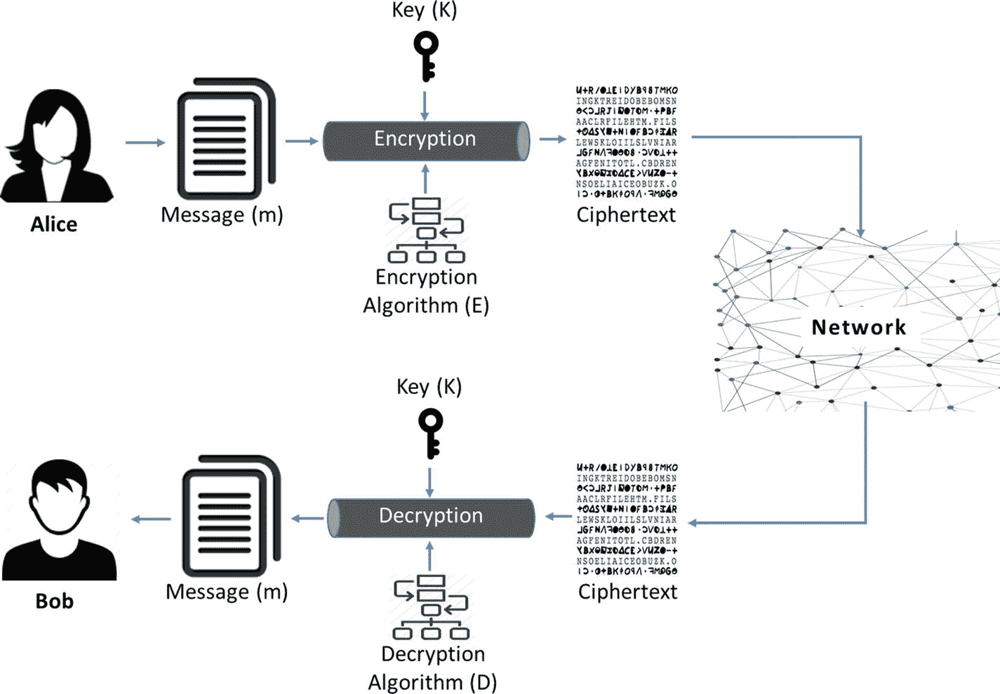
图 2-2 — 密码学的一般工作原理

广义上讲，有两种密码学：对称密钥密码学和 **非对称密钥**（也称为公钥）密码学。下面我们分别研究一下。

### 对称密钥密码学

在上一节中，我们了解了 Alice 如何加密消息并将密文发送给 Bob。然后 Bob 可以解密密文以获取原始消息。如果加密和解密使用相同的密钥，则称为 **对称密钥密码学**。这意味着 Alice 和 Bob 在交换密文之前必须就一个称为“共享秘密”的密钥（`k`）达成一致。因此，过程如下：

Alice——发送方：
* 使用加密算法 `E` 和密钥 `k` 对明文消息 `m` 进行加密，生成密文 `c`
* `c = E(k, m)`
* 将密文 `c` 发送给 Bob

Bob——接收方：
* 使用解密算法 `D` 和相同的密钥 `k` 对密文 `c` 进行解密，得到明文 `m`
* `m = D(k, c)`

你是否注意到发送方和接收方使用了相同的密钥（`k`）？他们如何就相同的密钥达成一致并相互共享？显然，他们需要一条安全的分配渠道来共享密钥。这通常如图 2-3 所示。

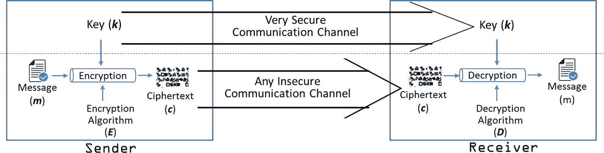
图 2-3 — 对称密码学

对称密钥密码学被广泛使用；最常见的用途是安全的文件传输协议，如 `HTTPS`、`SFTP` 和 `WebDAVS`。对称密码系统通常更快，并且在数据量巨大时更有用。

请注意，对称密钥密码学存在两种变体：**流密码** 和 **分组密码**。我们将在以下章节讨论它们，但在此之前，我们将研究 **柯克霍夫原则** 和 **异或函数**，以便能够理解密码系统的实际工作原理。

#### 柯克霍夫原则与异或函数

**柯克霍夫原则** 指出，一个密码系统即使除了密钥之外关于系统的所有内容都是公开的，也应该是安全的。此外，一般的假设是消息传输信道从来都不安全，消息在传输过程中很容易被拦截。这意味着，即使加密算法 `E` 和解密算法 `D` 是公开的，并且消息在传输过程中有可能被拦截，但由于共享秘密的存在，消息仍然是安全的。因此，在对称密码系统中，密钥必须保密。

异或函数是许多加密和解密算法的基本构建块。我们来看一下它以理解它是如何实现密码学的。异或，也称为“**异或**”，用符号 `⊕` 表示，可以通过以下真值表（表 2-1）来展现。

表 2-1 — 异或真值表

| A | B | A ⊕ B |
| --- | --- | --- |
| 0 | 0 | 0 |
| 1 | 0 | 1 |
| 0 | 1 | 1 |
| 1 | 1 | 0 |

异或函数具有以下性质，这些性质对于理解密码学背后的数学原理非常重要：

* **结合律**：`A ⊕ (B ⊕ C) = (A ⊕ B) ⊕ C`
* **交换律**：`A ⊕ B = B ⊕ A`
* **非运算**：`A ⊕ 1 = Ā`
* **同一律**：`A ⊕ A = 0`

利用这些性质，现在就可以理解如何使用明文“`m`”和密钥“`k`”计算密文“`c`”，然后使用相同的密钥“`k`”解密密文“`c`”以得到明文“`m`”。加密和解密使用相同的异或函数。

`m ⊕ k = c` 且 `c ⊕ k = m`

前面的例子是理解加密和解密的最简单形式。请注意，只需与密钥（即共享秘密，仅由预期方知道）进行异或运算，就能非常简单地得到原始明文消息。每个人可能都知道这里的加密或解密算法是异或，但不知道密钥。

### 流密码 vs. 分组密码

流密码和分组密码算法在对明文进行编码和解码的方式上有所不同。

流密码将明文的一个符号转换为密文的一个符号。这意味着加密过程每次只处理明文的一个比特或字节。在逐比特加密的场景中，为了加密明文的每一比特，会生成并使用不同的密钥。因此，它使用无限长的伪随机比特流作为密钥，并与明文的输入比特执行 `XOR`（异或）运算来生成密文。要使这样的系统保持安全，伪随机密钥流生成器必须是安全且不可预测的。流密码是对一种被证明为完美密码（称为“一次性密码本”，我们稍后将讨论）的近似实现。

那么，伪随机密钥流最初是如何生成的呢？它们通常是通过数字移位寄存器，从一个随机种子值串行生成的。流密码相当简单，执行速度也更快。你可以离线生成伪随机比特并极快地解密，但在大多数情况下需要保持同步。

我们看到，生成密钥流的伪随机数生成器是确保安全质量的核心部件——而这恰恰是其最大的缺点。过去，伪随机数生成器曾多次被攻击，导致流密码逐渐被淘汰。最广泛使用的流密码是用于 `SSL`、`TLS` 以及 Wi-Fi `WEP`/`WPA` 等多种协议的 `RC4`（Rivest 密码 4）。后来发现 `RC4` 存在漏洞，Mozilla 和微软已建议尽可能避免使用它。

另一个缺点是：输入文本中一个比特的所有信息都包含在其对应的一个密文比特中，这是一个低扩散性的问题。如果单个比特的信息能够分布到密文输出的多个比特中，安全性会更高，而这正是分组密码的特点。流密码的例子包括一次性密码本、`RC4`、`FISH`、`SNOW`、`SEAL`、`A5/1` 等。

另一方面，分组密码基于将明文划分为相对较大、长度固定的比特组（即分组）的想法，并使用相同的密钥对每个分组分别进行编码。它是一种确定性的算法，使用对称密钥进行不变的变换。这意味着，当你使用相同的密钥加密相同的明文分组时，会得到相同的结果。

每个分组的常见大小为 64 位、128 位和 256 位，称为分组长度，其生成的密文分组也具有相同的长度。我们选择，比如说，一个 `r` 位的密钥 `k` 来加密长度为 `n` 的每个分组。那么请注意，这里我们将密钥 `k` 的排列限制在 `2^r` 的一个非常小的子集内。这意味着“完美密码”的概念在此并不适用。尽管如此，随机选择 `r` 位的密钥仍然很重要，从某种意义上说，更多的随机性意味着更高的保密性。

使用分组密码加密或解密消息时，我们需要将其置于一种“工作模式”中，该模式定义了如何重复应用密码的单一分组操作，以转换大于一个分组的数据量。实际上，工作模式不仅仅是为了将数据分割成固定大小的块，它还有更重要的目的。我们了解到分组密码是一种确定性算法。这意味着，包含相同数据的分组，使用相同密钥加密后，会产生相同的密文——这非常危险！它会泄露大量信息。这里的思路是以某种方式将明文分组与刚生成的密文分组混合起来，这样，对于相同的输入分组，其对应的密文输出也会不同。当我们后续章节讲解 `DES` 和 `AES` 算法时，这一点会变得更清晰。

请注意，不同的工作模式会实现不同的特性，从而增强底层分组密码的安全性。虽然我们不打算深入探讨工作模式的细节，但这里列出一些供你参考：电子密码本模式（`ECB`）、密码分组链接模式（`CBC`）、密文反馈模式（`CFB`）、输出反馈模式（`OFB`）和计数器模式（`CTR`）。

与流密码相比，分组密码的加密或解密速度稍慢。与错误传播少得多的流密码不同，分组密码中一个比特的错误可能会破坏整个分组。相反，分组密码具有高扩散性的优点，这意味着每一个输入明文比特都会被扩散到多个密文符号中。分组密码的例子包括 `DES`、`3DES`、`AES` 等。

> 注  
> 确定性算法是指，给定特定输入，总是产生相同输出的算法。

### 一次性密码本

这是一种对称流密码，其中明文、密钥和密文都是比特串。并且，它完全基于“纯随机”密钥（而非伪随机密钥）的假设，使用该密钥可以实现“完美保密性”。此外，根据设计，该密钥只能使用一次。这带来的问题是，密钥必须至少和明文一样长。这意味着，如果你要加密一个 1GB 的文件，密钥也需要 1GB！这在实际应用的许多情况下都不切实际。

#### 示例

表 2-2 使用异或运算的加密示例

| 明文   | 1 | 0 | 0 | 1 | 1 | 1 | 0 | 0 | 1 | 0 | 1 | 0 | 1 | 1 | 0 | 1 | 1 | 0 |
|-----------|---|---|---|---|---|---|---|---|---|---|---|---|---|---|---|---|---|---|
| 密钥   | 0 | 1 | 0 | 0 | 1 | 1 | 0 | 1 | 1 | 1 | 0 | 0 | 1 | 0 | 1 | 0 | 1 | 1 |
| 密文   | 1 | 1 | 0 | 1 | 0 | 0 | 0 | 1 | 0 | 1 | 1 | 0 | 0 | 1 | 1 | 1 | 0 | 1 |

你可以参考上一节中的`XOR`真值表，了解密文是如何通过明文与密钥进行`XOR`运算生成的。请注意，明文、密钥和密文都是 18 位长。

在这里，接收方收到密文后，只需再次与密钥进行`XOR`运算即可得到明文。你可以自己用表 2-2 尝试一下，会得到相同的明文。

这种一次性密码本的主要问题更多地在于实践性而非理论性。发送方和接收方如何商定一个可供使用的密钥呢？如果发送方和接收方已经有一条安全信道，那他们为什么还需要密钥？如果他们并没有安全信道（这正是我们使用密码学的原因），那他们又该如何安全地共享密钥呢？这被称为“密钥分发问题”。

解决方法是使用伪随机数生成器（`PRNG`）来近似实现一次性密码本。这是一种确定性算法，它使用一个种子值生成一系列并非真正随机的随机数；这本身就是一个问题。要使该系统工作，发送方和接收方必须拥有相同的种子值。与共享整个密钥相比，共享那个种子值要好得多；但前提是它必须安全。对于那些既知道算法也知道种子的人来说，该系统容易被攻破。

##### 数据加密标准

数据加密标准（`DES`）是一种对称分组密码技术。它使用 64 位块大小和 64 位密钥进行加密和解密。在 64 位密钥中，有 8 位保留用于奇偶校验，因此实际密钥长度为 56 位。事实证明，它容易受到暴力攻击，并且可以在不到一天的时间内被破解。根据摩尔定律，未来破解速度会快得多，因此由于其密钥长度，其使用已大量弃用。它曾非常流行，被用于银行应用、`ATM`以及其它商业应用中，并且更多用于硬件实现而非软件实现。本节我们将对`DES`加密进行一个高级描述。

在对称密码学中，大量分组密码采用一种称为“Feistel 密码”或“Feistel 网络”的设计方案。Feistel 密码由多轮处理组成，使用密钥对明文进行处理，每一轮都包含一个替换步骤，后跟一个置换步骤。轮数越多，安全性可能越高，但加密/解密速度会变慢。`DES`基于一个具有 16 轮的 Feistel 密码。`DES`算法的一般步骤序列如图 2-4 所示。

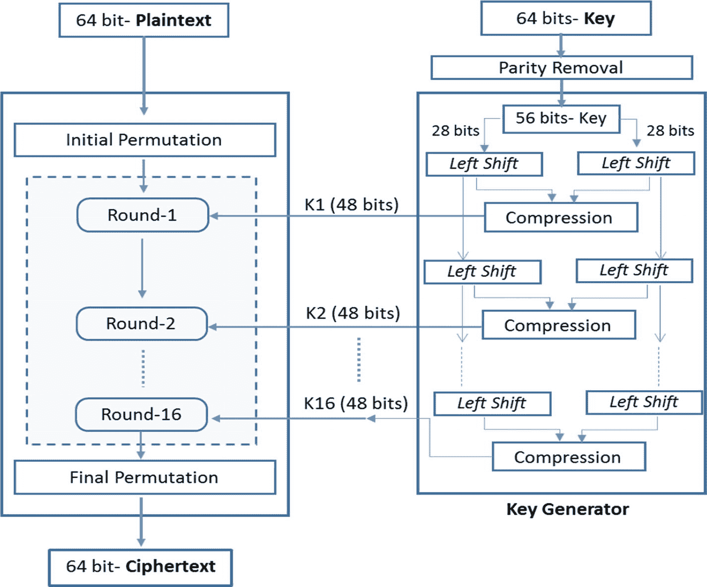

图 2-4 `DES`密码学

我们先讨论密钥生成器，然后再进入加密部分。

- 如前所述，密钥也是 64 位长。由于有 8 位用作奇偶校验位（更准确地说，是第 8、16、24、32、40、48、56 和 64 位），因此只有 56 位用于加密和解密。
- 去除奇偶校验位后，56 位密钥被分成两个 28 位的块。然后在每一轮中，对它们进行按位左移。我们知道`DES`使用 16 轮的 Feistel 网络。请注意，每一轮都接收上一轮左移后的位块，然后在当前轮中再次左移一位。
- 接着，两个左移后的 28 位块通过一个压缩机制合并，输出一个 48 位的密钥，称为子密钥，用于加密。类似地，在每一轮中，来自上一轮的两个 28 位块会再次左移一位，然后合并并压缩为 48 位密钥。该密钥随后被输入到同一轮的加密函数中。

现在我们来看`DES`如何使用 Feistel 密码轮进行加密：

- 前面讨论的 Feistel 轮会重复 16 次，其中一轮的输出作为下一轮的输入。
- 当所有 16 轮结束后，第 16 轮的输出再次进行交换，使得左侧块变为右侧块，反之亦然。
- 然后将这两个块合并成一个 64 位块，并通过一个置换操作，该操作是初始置换函数的逆操作，最终得到 64 位的密文输出。

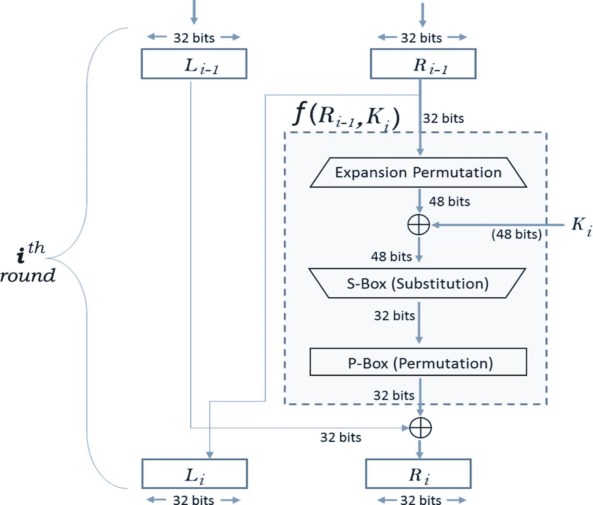

图 2-5 `DES`的轮函数

- 首先，明文输入被分成 64 位的块。如果消息的位数不能被 64 整除，则最后一个块会被填充，使其成为 64 位块。
- 每个 64 位输入数据块都要经过一个初始置换（`IP`）轮。它只是置换，即通过转置输入块，按照特定模式重新排列所有 64 位输入。它本身没有密码学意义，其目标是使以字节大小的格式将明文/密文加载到`DES`芯片中变得更容易。
- 在`IP`轮之后，64 位块被分成两个 32 位块：左块（`L`）和右块（`R`）。在每一轮中，这些块被表示为`L[i]`和`R[i]`，其中下标“i”表示轮数。因此，`IP`轮的输出被记为`L[0]`和`R[0]`。
- 现在 Feistel 轮开始。第一轮以`L[0]`和`R[0]`作为输入，并遵循以下步骤：
  - 右侧的 32 位块（`R`）原样传递到左侧，而左侧的 32 位块（`L`）则与该轮的密钥`k`以及右侧的 32 位块（`R`）进行运算，如下所示：
  - `L[i] = R[i-1]`
  - `R[i] = L[i-1] XOR F(R[i-1], K[i])`，其中“i”是轮数
  - `F()`被称为“密码函数”，实际上是每一轮的核心部分。这个`F()`函数中包含了多个步骤或操作。
  - 第一步，32 位的`R`块经过扩展并置换，输出一个 48 位的块。
  - 第二步，这个 48 位的块与同一轮密钥生成器提供的 48 位子密钥进行`XOR`运算。
  - 第三步，这个 48 位的`XOR`结果被送入替换盒，以将位数缩减回 32 位。这个`S`盒中的替换操作是`DES`中唯一的非线性操作，对该算法的安全性贡献显著。
  - 第四步，`S`盒的 32 位输出被送入置换盒（`P`盒），这只是一个置换操作，输出一个 32 位块，它实际上是`F()`密码函数的最终输出。
  - 然后，`F()`的输出与输入到该轮的 32 位`L`块进行`XOR`运算。这个`XOR`结果随后成为该轮最终的`R`块输出。
  - 请参考图 2-5 来理解每一轮中发生的各种操作。

我们了解了`DES`算法实际是如何工作的。解密也以类似的方式按相反顺序进行。我们不再深入这些细节，但留给您去探索。

最后总结一下`DES`的局限性。56 位密钥长度容易受到暴力攻击，并且每轮用于替换的`S`盒由于一些固有的弱点也容易受到密码分析攻击。由于这些原因，高级加密标准（`AES`）已在尽可能大的程度上取代了`DES`。现在许多应用都选择`AES`而非`DES`。

### 高级加密标准

与`DES`类似，`AES`算法也是一种对称分组密码，但并非基于 Feistel 网络。`AES`在更广义上使用了代替-置换网络。它不仅提供了更高的安全性，还提供了更快的速度！根据`AES`标准，分组大小固定为 128 位，并允许选择三种密钥：128 位、192 位和 256 位。根据密钥的选择，`AES`被命名为 `AES-128`、`AES-192` 和 `AES-256`。

在 `AES` 中，加密轮数取决于密钥长度。对于 `AES-128`，有十轮；对于 `AES-192`，有 12 轮；而对于 `AES-256`，有 14 轮。在本节中，我们的讨论仅限于密钥长度为 128 位（即 `AES-128`）的情况，因为其他 `AES` 变体的处理过程基本相同。唯一变化的是“密钥调度”，我们将在本节后面探讨。

与 `DES` 不同，`AES` 加密轮次是迭代的，并且在每一轮中处理整个 128 位的数据块。此外，与 `DES` 不同，`AES` 的解密过程与加密过程并不十分相似。

为了理解每一轮中的处理步骤，请将 128 位数据块视为 16 个字节，其中各个字节排列成一个 4 × 4 矩阵，如下所示：

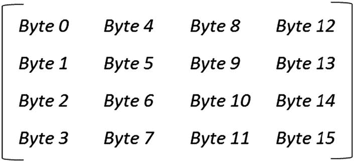

如图所示，这个 4 × 4 的字节矩阵被称为状态数组。请注意，每一轮都会输入一个状态数组并产生一个输出状态数组。

`AES` 还使用了另一个术语“字”，在进一步讨论之前需要对其进行定义。一个字节由八位组成，而一个字由四个字节组成，即 32 位。状态数组每一列中的四个字节构成 32 位的字，可称为状态字。状态数组可以如下所示：

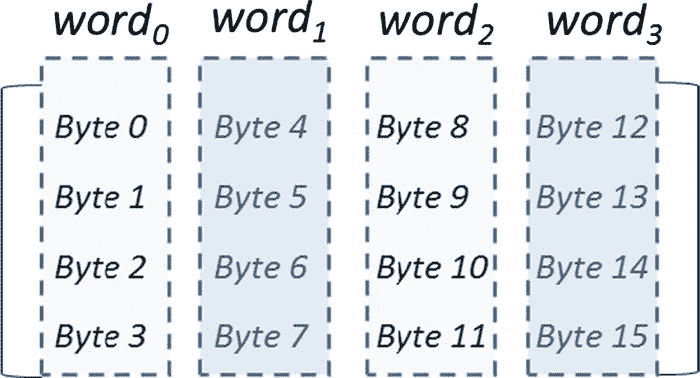

此外，每个字节都可以用两个十六进制数表示。例如：如果 8 位字节是 `{00111010}`，则可以用十六进制表示法表示为 `3A`。`3` 代表左边四位 `0011`，`A` 代表右边四位 `1010`。

现在来概括每一轮，每一轮的处理发生在字节级别，包括字节级代替，然后是字级置换，因此它是一个代替-置换网络。当我们讨论每轮中的各种操作时，将进一步了解细节。`AES` 的整体加密和解密过程可以用图 2-6 表示。

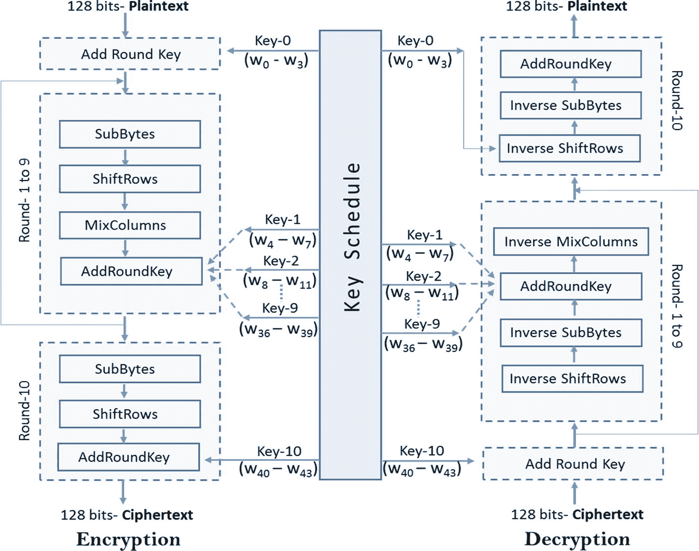

图 2-6 AES 加密技术

如果你仔细观察图 2-6，会发现解密过程并非仅仅是加密的逆过程。轮中的操作以不同的顺序执行！轮函数的所有步骤——`SubBytes`、`ShiftRows`、`MixColumns`、`AddRoundKey`——都是可逆的。另外，请注意各轮本质上是迭代的。第 1 轮到第 9 轮包含所有四种操作，而最后一轮仅排除了 `MixColumns` 操作。现在，让我们对轮函数中发生的每个操作建立一个高层次的理解。

`SubBytes`：这是一个代替步骤。在这里，每个字节被表示为两个十六进制数字。例如，取一个字节 `{00111010}`，用两个十六进制数字表示，比如 `{3A}`。要找到它的代替值，请参考 S 盒查找表（16 × 16 表），找到第 3 行和第 A 列对应的值。因此，对于 `{3A}`，相应的代替值将是 `{80}`。这一步为密码提供了非线性特性。

`ShiftRows`：这是一个变换步骤，基于状态数组的矩阵表示。它包含以下移位操作：

- 第一行不移位，保持原样
- 第二行循环左移一个字节
- 第三行循环左移两个字节
- 第四行（最后一行）循环左移三个字节

可以如下表示：

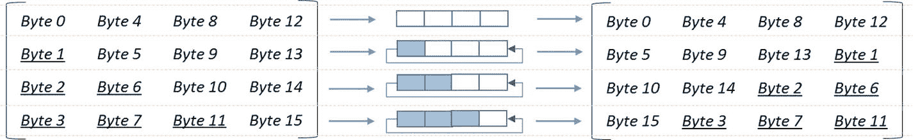

`MixColumns`：这也是一个变换步骤，状态的所有四列与一个固定多项式（`C[x]`）相乘，并转换为新列。在此过程中，列中的每个字节被映射到一个新值，该值是列中所有四个字节的函数。这通过状态的矩阵乘法实现，如下所示：

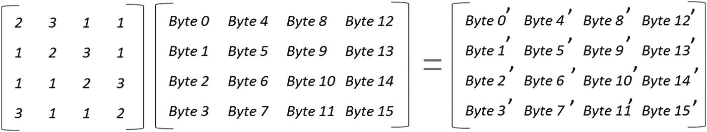

矩阵乘法与通常相同，但“与”乘积通过“异或”运算处理。让我们看一个示例来理解这个过程。`Byte 0'` 的计算如下：

`Byte 0' = (2 . Byte0) ⊕ (3 . Byte1) ⊕ Byte3 ⊕ Byte4`

需要注意的是，这个 `MixColumns` 步骤与 `ShiftRows` 步骤一起，为密码提供了必要的扩散特性（一个字节的信息扩散到多个字节）。

`AddRoundKey`：这又是一个变换步骤，其中 128 位的轮密钥按列主序与 128 位的状态进行逐位“异或”运算。因此，该操作是按列进行的，即状态字列中的四个字节与轮密钥的一个字进行运算。与我们表示 128 位明文块的方式相同，128 位密钥也应表示在相同的 4 × 4 矩阵中，如下所示：

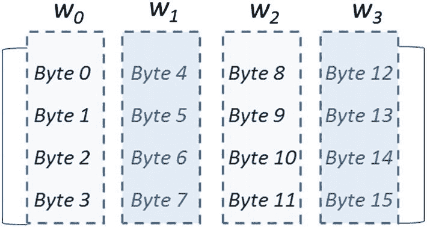

128 位密钥

此操作影响状态的每一位。现在回想一下，共有十轮，每一轮都有自己的轮密钥。由于在轮开始之前有一个 `AddRoundKey` 步骤，因此实际上有十一（10 + 1）次 `AddRoundKey` 操作。在一轮中，所有 128 位的子密钥，即子密钥的所有四个字，都与 128 位的输入数据块进行“异或”运算。因此，总共需要 44 个密钥字，`w[0]` 到 `w[43]`。这就是为什么 128 位密钥必须经过密钥扩展操作的原因，我们稍后会讲到。

请注意，密钥字 `[w[0], w[1], w[2], w[3]]` 在基于轮的处理开始之前与初始输入块进行“异或”运算。其余 40 个密钥字 `w[4]` 到 `w[43]` 在每一轮中每次使用四个字。

#### AES 密钥扩展

`AES` 密钥扩展算法接收一个 128 位的加密密钥（四个字的密钥）作为输入，并从中生成一个包含 44 个密钥字的调度表。其设计思路是，使得密钥中一位的改变会显著影响所有轮密钥。

密钥扩展操作的设计原则是，每组四个字的密钥以四字对四字的方式产生下一组四个字的密钥。用图形表示很容易解释这一点，下面开始：

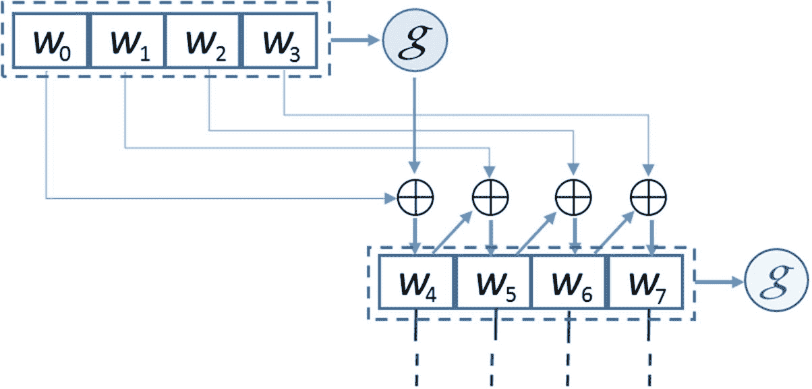

图 2-7 AES 密钥扩展

我们将通过参考该图快速了解密钥扩展所发生的操作。

##### 排版后的 Markdown 文档

- 初始的 128 位密钥被排列为四个字：`[w[0], w[1], w[2], w[3]]`。
- 现在看一下扩展后的字：`[w[4], w[5], w[6], w[7]]`。请注意，`w[5]`依赖于`w[4]`和`w[1]`。这意味着每个扩展后的字都依赖于紧邻的前一个字（即`w[i-1]`）以及向后四个位置的字（即`w[i-4]`）。对`w[6]`也进行同样的测试。如你所见，这里只执行了一个简单的异或（XOR）操作。
- 那么，`w[4]`呢？或者任何其他位置是四的倍数的字，例如`w[8]`或`w[12]`？对于这些字，使用了一个更为复杂的函数，记为“`g`”。它基本上是一个三步函数。第一步，输入的四个字块循环左移一个字节。例如，`[w[0], w[1], w[2], w[3]]`变为`[w[1], w[2], w[3], w[0]]`。第二步，将输入的四个字节字（例如`[w[1], w[2], w[3], w[0]]`）作为输入，并使用 S 盒对每个字节进行字节替换。然后，第三步，将第二步的结果与称为轮常数（记为`Rcon[]`）的东西进行异或操作。轮常数是一个字，其中最右边的三个字节始终为零。例如，`[x, 0, 0, 0]`。这意味着`Rcon[]`的目的仅仅是对第二步输出密钥字的最左边字节执行异或操作。同时请注意，每一轮的`Rcon[]`都不同。这样，复杂函数“`g`”的最终输出就生成了，然后将其与`w[i-4]`进行异或操作，从而得到`w[i]`，其中“`i`”是 4 的倍数。
- 这就是 `AES` 中密钥扩展的方式。

最后一轮输出的状态数组被重新排列，形成 128 位的密文块。类似地，解密过程以不同的顺序进行，我们在 `AES` 过程图中看到过这一点。本意是让你对算法在高级层面上的工作原理有一个初步了解，在本节中，我们将把讨论限制在加密过程上。

`AES` 算法由 NIST（美国国家标准与技术研究院）标准化。它存在处理时间较长的局限性。假设你正在发送一个只有 1 兆字节的文件（8388608 位）并用 `AES` 加密。使用 128 位 `AES` 算法，此加密所需的步骤数将是 8388608 / 128 = 65536 个数据块！使用并行处理方法可以提高 `AES` 的效率，但在处理大量数据时仍然不太适合。

### 对称密钥密码学中的挑战

对称密钥密码学存在一些局限性。下面列出了其中的几个：

- 密钥必须在任何通信之前由发送方和接收方共享。这需要一个安全的密钥建立机制。
- 发送方和接收方必须相互信任，因为他们使用相同的对称密钥。如果接收方被攻击者入侵，或者接收方故意与他人共享密钥，系统就会受到损害。
- 一个由 n 个节点组成的大型网络需要管理 n(n–1)/2 个密钥对。
- 建议为每个通信会话更改密钥。
- 通常需要一个可信的第三方来进行有效的密钥管理，这本身就是一个大问题。

## 密码学哈希函数

哈希函数是最重要的密码学原语之一的数学函数，并且是区块链数据结构的一个组成部分。它们被广泛用于许多密码学协议、信息安全应用，如数字签名和消息认证码（MAC）。由于它用于非对称密钥密码学，我们将在进入非对称密码学之前在此讨论它。请注意，本节涵盖的概念可能与学术教科书不符，并稍微偏向区块链生态系统。

密码学哈希函数是一类适用于密码学的特殊哈希函数，我们将仅围绕它进行讨论。因此，密码学哈希函数是一种单向函数，它将任意长度的输入数据转换，并生成固定长度的输出。输出通常称为“哈希值”或“消息摘要”。它可以如图 2-8 所示表示。

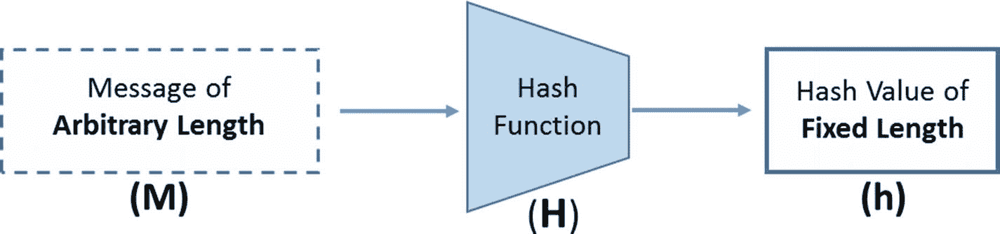

**图 2-8** 哈希函数的基本形式

为了使哈希函数达到其设计目的并可用，它们应具备以下核心属性：

*   输入可以是任意大小的字符串，但输出是固定长度的，例如，256 位输出或 512 位输出。
*   对于任何给定的消息，哈希值都应是可高效计算的。
*   它是确定性的，这意味着相同的输入提供给相同的哈希函数，每次都产生相同的哈希值。
*   除了尝试所有可能的消息外，从哈希值反向推导并生成消息是不可行的（尽管并非不可能！）。
*   消息中的任何微小变化都应该极大地影响输出哈希值，这样就没有人能够在小变化后将新的哈希值与旧的哈希值关联起来。

除了上述核心属性外，它们还应满足以下安全属性，才能被视为密码学协议：

*   **抗碰撞性**：这意味着找到两个不同的输入（例如 `X` 和 `Y`）使它们哈希到相同值是不可行的。

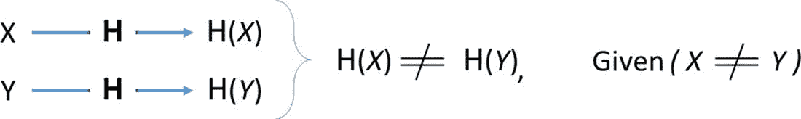

这使得哈希函数`H()`具有抗碰撞性，因为没有人能找到`X`和`Y`，使得`H(X) = H(Y)`。注意，这个哈希函数是一个压缩函数，因为它将给定的输入压缩为比输入更短的固定大小输出。因此，与输出空间（固定大小）相比，输入空间（任意大小）过于庞大。如果输出是一个 256 位的哈希值，那么输出空间最多可以有`2²⁵⁶`个值，并且不会超出这个范围。这意味着碰撞必然存在。然而，找到这种碰撞极其困难。根据“生日悖论”的原理，我们可以推断出，通过遍历输出空间的平方根次数，应该能够找到碰撞。因此，取`2¹²⁸ + 1`个输入，找到碰撞的可能性很高；但要计算这个数字是极其庞大的，这非常不可行！接下来我们讨论这个属性在何处有用。在大多数在线存储、云文件存储、对象存储、应用商店等场景中，“抗碰撞性”被广泛用于确保文件的完整性。例如：有人计算出一个文件的消息摘要并将其上传到云存储。之后，当他们下载该文件时，他们可以重新计算消息摘要，并与之前保存的摘要进行交叉比对。通过这种方式，可以确保文件是否因传输问题或某些蓄意尝试而损坏。正是由于抗碰撞性的特性，没有人能够找到一个不同的文件或修改过的文件，其哈希值与原始文件的哈希值相同。

*   **抗原像性**：这个属性意味着在计算上无法逆向一个哈希函数；即，从输出`H(X)`找到输入`X`是不可行的。因此，这个属性也可以称为“隐藏”属性。请特别注意这里；这种情况还有一个微妙的方面。请注意，当`X`可以是世界上的任何东西时，这个属性很容易实现。然而，如果`X`只取有限数量的值，并且这些值对攻击者是已知的，那么他们可以轻松计算出`X`的所有可能值，并找出哪个值的哈希与结果匹配。示例：一个实验室决定为实验的成功结果准备消息摘要，这样任何能够访问结果数据库的攻击者都无法理解其内容，因为系统中存储的是哈希后的输出。假设实验只有三种可能的结果，如`OP111`、`OP112`和`OP113`，其中只有一个是成功的，比如说`OP112`。于是，实验室决定对其进行哈希，计算`H(OP112)`，并将哈希值存储在系统中。虽然攻击者无法从`H(OP112)`找到`OP112`，但他们可以简单地哈希所有可能的实验结果，即`H(OP111)`、`H(OP112)`和`H(OP113)`，然后发现只有`H(OP112)`与系统中存储的值匹配。这种情况当然很脆弱！这意味着，当哈希函数的输入来自一个有限的空间并且不是分布广泛的分布时，它是弱的。然而，有一个解决方案如下：我们取一个输入，比如“`X`”，它分布不广，就像我们刚才讨论的只有少数可能值的实验结果一样。如果我们将它与另一个随机输入（比如“`r`”）拼接起来，该输入来自一个具有高最小熵的概率分布，那么从`H(r || X)`中找到`X`将变得困难。这里，高最小熵意味着分布非常广泛，并且没有特定的值容易出现。假设“`r`”是从 256 位分布中选取的。对于攻击者来说，要精确得到与输入一起使用的“`r`”值，成功的概率是`1/2²⁵⁶`，这几乎是不可能实现的。唯一的方法是一个接一个地考虑这个分布的所有可能值——这又是实际上不可能的。值“`r`”也被称为“nonce”。在密码学中，nonce 是一个只能使用一次的随机数。现在我们来讨论抗原像性属性在何处有用。它在承诺一个值时非常有用，因此“承诺”就是这里的用例。这可以通过一个例子更好地解释。假设你参与了一些博彩或赌博活动。假设你必须承诺你的选择，并将其公开宣布。然而，别人不应该能猜出你在赌什么，而且你以后也不能否认你的赌注。因此，你利用了哈希函数的抗原像性属性。你对你所赌选择的哈希值进行公开声明。没有人能够逆向哈希函数并找出你在赌什么。同时，你以后也不能说你的选择是另一个，因为如果你对另一个选择进行哈希，它将与你之前公开声明的不匹配。建议使用我们上一段中解释过的 nonce “`r`”来设计此类系统。

*   **第二抗原像性**：这个属性与“抗碰撞性”略有不同。它意味着给定一个输入`X`及其哈希值`H(X)`，找到`Y`使得`H(X) = H(Y)`是不可行的。与抗碰撞性不同，这里讨论的是针对一个固定的、给定的`X`。这意味着，如果一个哈希函数已经具有抗碰撞性，那么它也必然具有第二抗原像性。

从刚才讨论的哈希函数性质中，还可以推导出另一个在比特币中非常有用的性质。让我们从技术角度来探究它，并在我们读到第 3 章时，了解比特币是如何利用它进行挖矿的。这个性质的名字叫“谜题友好性”。这个名字意味着，找到解没有捷径，唯一的方法就是遍历输入空间中所有可能的选项。我们在此不打算试图定义它，而是直接尝试理解它的真正含义。让我们考虑这个例子：`H(r || X) = Z`，其中“r”是从一个具有高最小熵的分布中选取的，“X”是与“r”拼接的输入，“Z”是哈希输出的值。这个性质意味着，对于一个攻击者来说，找到一个恰好能哈希到“Z”的值“Y”是非常困难的。也就是说，`H(r´ || Y) = Z`，其中`r´`是与“r”同样以随机方式选择的输入的一部分。这意味着，当输入的一部分被充分随机化后，就很难通过一个快速的解法来攻破哈希函数；唯一的方法就是用所有可能的随机值进行测试。

在前一个例子中，如果“Z”是一个`n`位的输出，那么它只是从`2^n`个可能值中取了一个值。请仔细注意，你输入的一部分，比如“r”，来自一个高最小熵分布，它必须与你的输入`X`拼接在一起。现在到了设计搜索谜题的有趣部分。假设`Z`是一个`n`位的输出，是一个包含`2^n`个可能值的集合，而不仅仅是一个精确的值。你被要求找到一个`r`的值，使得当它与`X`拼接后进行哈希时，结果落在这个包含`2^n`个值的输出集合内；这样就形成了一个搜索谜题。其思想是找出所有可能的`r`值，直到它落入`Z`的范围内。请注意，这里`Z`的大小将输出空间限制到了一个更小的、包含`2^n`个可能值的集合。输出空间越小，问题就越难。显然，如果范围很大，找到其中的一个值就比较容易；而如果范围非常窄，只有少数几种可能性，那么在该范围内找到一个值就很难。这就是“r”（在哈希函数输入中称为“nonce”）的巧妙之处。无论你取哪个随机值“r”，它都会与“X”拼接，并一遍又一遍地通过相同的哈希函数，直到你找到正确的、满足`Z`所需范围的 nonce 值“r”。除了尝试所有可能的值之外，绝对没有任何捷径！

请注意，对于一个`n`位的哈希值输出，要破解抗原像性和抗第二原像性平均需要`2^n`的算力，而抗碰撞性则需要`2^(n/2)`的算力。

我们讨论了哈希函数的各种基本属性和安全属性。在接下来的章节中，我们将了解一些重要的哈希函数，并在适当的情况下进行更深入的探讨。

### 关于不同哈希函数的温馨提示

最古老的哈希函数或压缩函数之一是`MD4`哈希函数。它属于消息摘要（MD）家族。MD 家族的其他成员包括`MD5`和`MD6`，并且`MD4`还有许多其他变体，例如`RIPEMD`。MD 系列的算法通过处理 512 位的数据块来生成 128 位的消息摘要。它们曾被广泛用作校验和来验证数据完整性。许多文件服务器或软件仓库曾提供预先计算好的`MD5`校验和，用户可以用它来与自己下载的文件进行对比检查。然而，在 MD 家族中发现了许多漏洞，它已被弃用。

另一个这样的哈希函数家族是安全哈希算法（SHA）家族。这个家族主要有四种算法，例如`SHA-0`、`SHA-1`、`SHA-2`和`SHA-3`。这个家族中提出的第一个算法被命名为 SHA，但后来的版本带来了安全修复和更新，因此它被赋予了“旧称”，变成了`SHA-0`。它被发现存在一个严重但未公开的安全缺陷，随后被停止使用。后来，`SHA-1`被提出作为`SHA-0`的替代品。`SHA-1`增加了一个额外的计算步骤，解决了`SHA-0`中的问题。`SHA-0`和`SHA-1`都是 160 位的哈希函数，处理 512 位的数据块大小。`SHA-1`由美国国家安全局（NSA）设计，用于数字签名算法（DSA）。它曾被广泛应用于许多安全工具和互联网协议中，例如 SSL、SSH、TLS 等。它也用于一些版本控制系统（如 Mercurial、Git 等）的一致性检查，而并非真正用于安全目的。后来，大约在 2005 年，在其发现了密码学弱点，并在 2010 年后被弃用。我们将在接下来的章节中详细介绍`SHA-2`和`SHA-3`。

### SHA-2

它属于 SHA 哈希函数家族，但其本身又是一个哈希函数家族。它有许多 SHA 变体，例如`SHA-224`、`SHA-256`、`SHA-384`、`SHA-512`、`SHA-512/224`和`SHA-512/256`。`SHA-256`和`SHA-512`是原始的哈希函数，其他变体都是由它们衍生而来。`SHA-2`系列的哈希函数广泛应用于 SSL、SSH、TLS、PGP、MIME 等应用中。

`SHA-224`是`SHA-256`的一个截断版本，使用了不同的初始值或初始化向量（IV）。请注意，应用了不同截断的 SHA 变体可能会产生相同位长度的哈希输出，因此在不同 SHA 变体中应用不同的初始化向量，以便能够正确地区分它们。现在回到`SHA-224`的计算，它是一个两步过程。首先，使用与`SHA-256`中使用的默认 IV 不同的 IV 来计算`SHA-256`值。其次，将得到的 256 位哈希值截断为 224 位；通常保留左侧的 224 位，但选择权在你手中。

`SHA-384`是`SHA-512`的一个截断版本，就像`SHA-224`是`SHA-256`的截断版本一样。类似地，`SHA-512/224`和`SHA-512/256`都是`SHA-512`的截断版本。你是不是想知道为什么存在这种“截断”的概念？请注意，截断并不仅限于我们刚才提到的那些，还可能存在各种其他变体。截断的主要原因可能如下：

*   某些应用需要特定长度（与默认长度不同）的消息摘要。
*   无论我们使用哪种`SHA-2`变体，都可以根据我们希望维持的安全属性来选择截断级别。例如：考虑到当今的计算能力，当需要抗碰撞性时，我们应该至少保留 160 位；当只需要抗原像性时，我们应该至少保留 80 位。像抗碰撞性这样的安全属性会随着截断而降低，但应该选择截断级别，使得找到碰撞在计算上不可行。
*   截断还有助于保持与旧版应用的向后兼容性。例如：`SHA-224`提供 112 位的安全性，可以与三重 DES（3DES）的密钥长度相匹配。

谈到效率，`SHA-256`基于 32 位字，而`SHA-512`基于 64 位字。因此，在 64 位架构上，与`SHA-1`或其他`SHA-256`变体相比，`SHA-512`及其所有截断变体可以以更快的速度计算，并提供更好的安全级别。

表 2-3 是摘自 NIST 论文的一个表格，它概括了`SHA-1`和不同`SHA-2`算法的属性。

**表 2-3** SHA-1 和 SHA-2 哈希函数概览

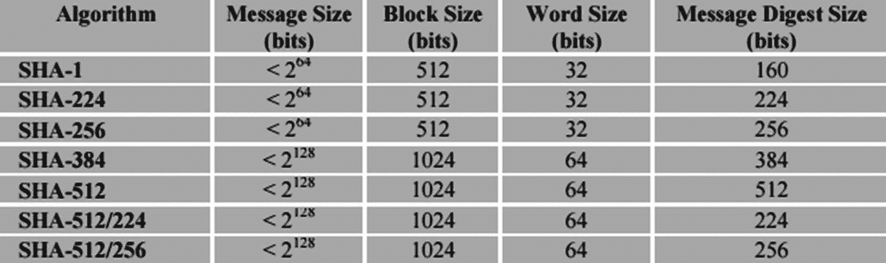

根据经验法则，建议在非必要的情况下不要进行截断。某些哈希函数可以容忍截断，而有些则不能，这还取决于你如何使用它以及使用的上下文。

### SHA-256 与 SHA-512

如前所述，`SHA-256` 属于 `SHA-2` 哈希函数家族，且正是比特币所使用的！顾名思义，它会产生一个 256 位的哈希值，因而得名。根据生日悖论，它能提供 `2¹²⁸` 位的安全性。

回顾一下，哈希函数接收任意长度的输入，并产生固定大小的输出。任意长度的输入并非直接送入压缩函数，而是先在送入压缩函数前被分割成固定长度的数据块。这意味着需要一种构造方法，能够通过从任意长度的输入数据构建固定大小的输入块来迭代调用压缩函数，并产生固定长度的输出。存在多种构造方法，例如 Merkle-Damgård 构造、树形构造和海绵构造。已经证明，如果底层的压缩函数是抗碰撞的，那么采用任何构造方法的整体哈希函数也应是抗碰撞的。

`SHA-256` 所使用的构造方法是 Merkle-Damgård 构造，让我们通过图 2-9 来看看它是如何工作的。

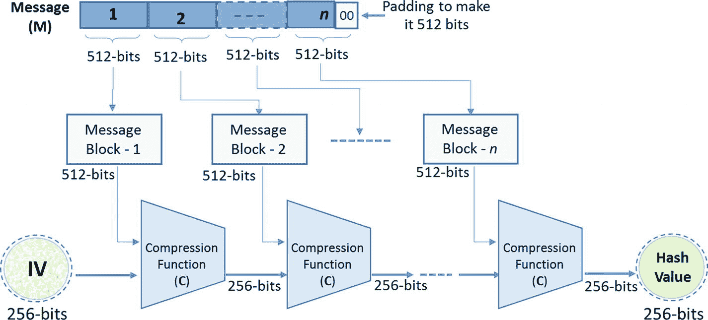
图 2-9 `SHA-256` 的 Merkle-Damgård 构造

参照该图，为计算最终的哈希值，需按指定顺序执行以下步骤（高级概述）：

- 如图所示，消息首先被分割成 512 位的数据块。当消息长度不是 512 位的整数倍时（通常是这种情况），最后一个数据块位数不足，因此需要对其进行填充，使其达到 512 位。
- 这些 512 位的数据块进一步被分割成 16 个 32 位的字（16 × 32 = 512）。
- 每个数据块都要经过 64 轮轮函数处理，其中每个 32 位字会经历一系列运算。轮函数是一些常见函数的组合，例如 `XOR`、`AND`、`OR`、`NOT`、按位左/右移位等，本书不对这些细节进行深入探讨。

与 `SHA-256` 类似，`SHA-512` 的步骤和操作也相当相似，因为 `SHA-512` 同样使用 Merkle-Damgård 构造。主要区别在于 `SHA-512` 中有 80 轮轮函数，且字长为 64 位。`SHA-512` 的数据块大小为 1024 位，进一步被分割成 16 个 64 位的字。输出的消息摘要长度为 512 位，即八个 64 位的字。当 `SHA-512` 逐渐兴起并开始被许多应用使用时，一些人为了面向未来而转向了 `SHA-3` 算法。`SHA-3` 只是一种不同的哈希方法，并非真正替代 `SHA-256` 或 `SHA-512`，尽管它允许调整参数。我们将在后续章节中了解更多关于 `SHA-3` 的细节。

### RIPEMD

RACE 完整性基元评估消息摘要（`RIPEMD`）哈希函数是 `MD4` 哈希函数的一个变体，设计思路几乎相同。由于它在比特币中被使用，我们将对其进行简要讨论。

最初的 `RIPEMD` 为 128 位，后来开发了 `RIPEMD-160`。该算法存在 128 位、256 位和 320 位的版本，分别称为 `RIPEMD-128`、`RIPEMD-256` 和 `RIPEMD-320`，但我们的讨论将仅限于最流行且广泛使用的 `RIPEMD-160`。

`RIPEMD-160` 是一种密码学哈希函数，其压缩函数基于 Merkle–Damgård 构造。输入被分割成 512 位的数据块，当输入位数不是 512 的倍数时进行填充。输出的 160 位哈希值通常表示为 40 位的十六进制数。

压缩函数由 80 个阶段组成，这些阶段又由两条并行的线路构成，每条线路包含 5 轮，每轮有 16 个步骤（5 × 16 = 80）。压缩函数对十六个 32 位的字（512 位的数据块）进行操作。

> **注意：** 比特币在地址生成中同时使用了 `SHA-256` 和 `RIPEMD-160` 哈希。`RIPEMD-160` 用于将 `SHA-256` 的哈希值输出进一步缩短至 160 位。

### SHA-3

2015 年，Keccak（发音为“ket-chak”）算法被 NIST 标准化为 `SHA-3`。请注意，其目的并非真正取代 `SHA-2` 标准，而是与它共存互补，尽管在某些情况下可以选择 `SHA-3` 而非 `SHA-2`。

由于 `SHA-1` 和 `SHA-2` 都基于 Merkle-Damgård 构造，因此需要一种不同的哈希函数方法。因此，不使用 Merkle-Damgård 构造是 NIST 设定的标准之一。这是因为新设计不应受到 Merkle-Damgård 构造的局限性（如多重碰撞）的影响。Keccak，即后来的 `SHA-3`，采用了一种称为海绵构造的不同构造方法。

为了实现向后兼容，要求 `SHA-3` 能够产生可变长度的输出，例如 224、256、384 和 512 位，以及其他任意长度的输出。这样一来，`SHA-3` 成为了一个密码学哈希函数家族，包括 `SHA3-224`、`SHA3-256`、`SHA3-384`、`SHA3-512`，以及两个可扩展输出函数 (XOF)，分别称为 `SHAKE128` 和 `SHAKE256`。此外，`SHA-3` 必须有一个可调参数（容量），以允许在安全性和性能之间进行权衡。由于 `SHAKE128` 和 `SHAKE256` 是 XOF，它们的输出可以扩展到任何所需的长度，故而得名。

下图（图 2-10）展示了 `SHA-3`（Keccak 算法）的高级设计。

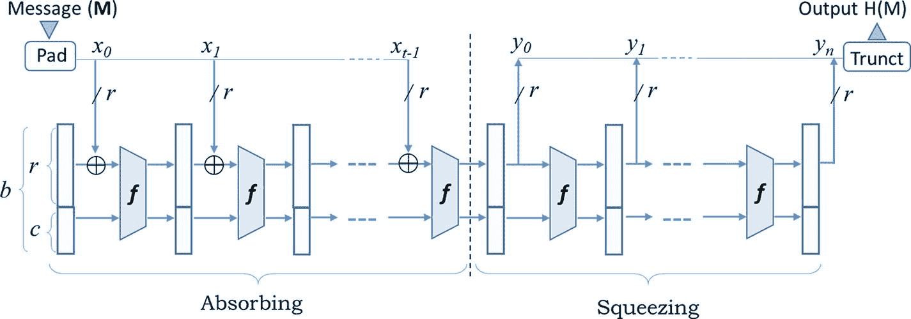
图 2-10 `SHA-3` 的海绵构造

`SHA-3` 所执行的一系列步骤如下：

- 如图 2-10 所示，消息首先被分割成大小为 `r` 位的数据块 (`x[i]`)。如果输入数据不是 `r` 位的整数倍，则需要填充。如果你对这个 `r` 感到疑惑，不用担心，我们稍后会解释。现在，让我们关注填充是如何进行的。对于一个不是 `r` 位整数倍且包含一些消息 `m` 的消息块 `x[i]`，填充过程如下所示：
`x[i] = m || P 1 {0}* 1`
`P` 是一个预定义的比特串，后跟 `1 {0}* 1`，这意味着一个前导 `1` 和一个尾随 `1`，以及一些数量的零（也可能没有零位），这可以使 `x[i]` 成为 `r` 的整数倍。表 2-4 展示了 `P` 的各种值。

表 2-4 `SHA-3` 变体中的填充

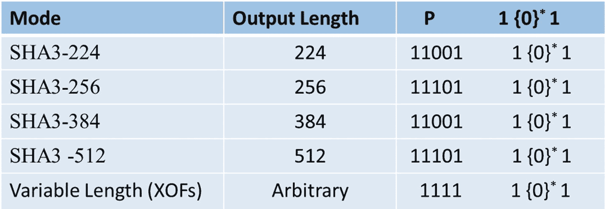

#### SHA-3 海绵结构与 Keccak-f

如图 2-10 所示，`SHA-3` 海绵结构大致分为两个阶段：第一阶段是输入的“吸收”阶段，第二阶段是输出的“挤压”阶段。在吸收阶段，消息分组（`x[i]`）会经历算法的各种运算；而在挤压阶段，则会计算出可配置长度的输出。请注意，这两个阶段都使用了同一个名为“Keccak-f”的函数。

对于 `SHA3-224`、`SHA3-256`、`SHA3-384` 和 `SHA3-512`（这些算法实际上是 `SHA-2` 的替代品）的计算而言，仅使用第一个输出分组 `y[0]` 的初始若干比特，并根据所需的长度进行截断。

`SHA-3` 的设计目标是能够通过调优参数，对其安全强度、输入和输出大小进行调节。

如图中所示，“b”表示状态的宽度，且必须满足 `r + c = b`。此外，“b”取决于指数“ℓ”，关系为 `b = 25 × 2^ℓ`。由于“ℓ”的取值范围是 0 到 6，因此“b”可能的宽度为 `{25, 50, 100, 200, 400, 800, 1600}`。在实际应用中，建议不要使用“b”最小的两个值，因为它们仅用于对算法进行分析和密码分析。

在等式 `r + c = b` 中，我们看到的“r”用于预处理消息，并将其划分为长度为“r”的分组。这被称为“比特率”。参数“c”被称为“容量”，它只需满足条件 `r + c = b ∈ {25, 50, 100, 200, 400, 800, 1600}` 并计算得出。这样，“r”和“c”就被用作调优参数，以在安全性和性能之间进行权衡。

对于 `SHA-3`，指数值 ℓ 固定为“6”，因此 `b` 的值为 1600 比特。对于这个给定的 `b = 1600`，有两个可接受的比特率值：`r = 1344` 和 `r = 1088`。这对应着两个不同的“c”值。因此，当 `r = 1344` 时，`c = 256`；当 `r = 1088` 时，`c = 512`。

现在，让我们来看一下这个算法的核心引擎，即 Keccak-f，它也被称为“Keccak-f 置换”。每个 Keccak-f 中包含“n”轮，其中“n”的计算方式为：`n = 12 + 2ℓ`。由于 `SHA-3` 的 ℓ 值为 6，因此每个 Keccak-f 将包含 24 轮。每一轮接收“b”位（`r + c`）的输入，并产生相同数量（“b”位）的输出。

在每一轮中，输入的“b”被称为一个状态。这个状态数组“b”可以被表示为一个三维（3-D）数组 `b = (5 x 5 × w)`，其中字大小 `w = 2^ℓ`。因此，`w = 64` 比特，这意味着有 `5 × 5 = 25` 个字，每个字 64 比特。回想一下，对于 `SHA-3`，ℓ = 6，所以 `b = 5 × 5 x 64 = 1600`。这个三维数组可以如图 2-11 所示。

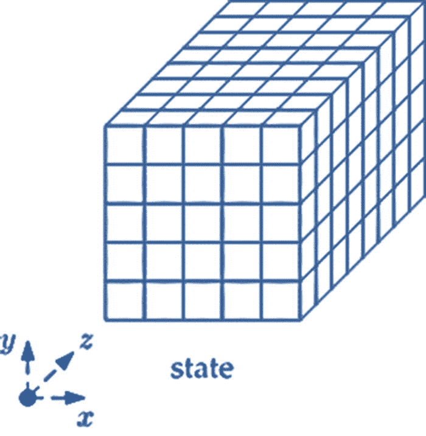
图 2-11：`SHA-3` 中的状态数组表示

每一轮由五个步骤组成，如图 2-12 所示，状态数组会在每个步骤中被处理。

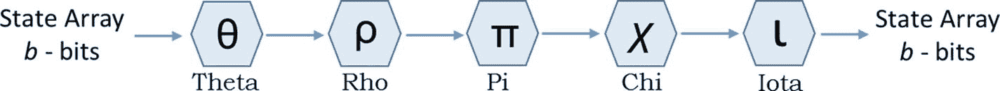
图 2-12：`SHA-3` 每一轮中的五个步骤

在深入了解这五个步骤的细节之前，让我们快速了解它们在高级层面上的作用：

- **Theta（θ）步骤**：执行 XOR 运算以提供微小的扩散。
- **Rho（ρ）步骤**：对 25 个字中的每一个执行按位循环移位。
- **Pi（π）步骤**：对 25 个字中的每一个执行置换。
- **Chi（χ）步骤**：在此步骤中，通过将比特与其行中后续的两个比特相结合来替换比特。
- **Iota（ι）步骤**：将一个轮常数与该状态中的一个字进行 XOR 运算，以打破对称性。

Keccak-f 的最后一轮产生 `y[0]` 输出，这对于 `SHA-2` 替代模式（即输出为 224、256、384 和 512 比特的模式）来说已经足够。请注意，`y[0]` 的最低有效位用于生成所需长度的输出。在需要可变长度输出的情况下，除了 `y[0]` 之外，还可以使用 `y[1]`、`y[2]`、`y[3]`…等其他输出比特。

在 `SHA-3` 的实际应用中，人们发现它在软件中的性能不错（尽管不如 `SHA-2`），但在硬件中的性能非常出色（优于 `SHA-2`）。

### 哈希函数的应用

加密哈希函数在不同场景下有许多不同的用途。以下是一些示例用例：

- 哈希函数用于验证信息的完整性和真实性。
- 哈希函数也可用于在哈希表中索引数据。这可以加快搜索过程。如果基于哈希值进行搜索（假设哈希值比整个数据短得多），那么显然会比搜索整个数据更快。
- 它们可用于安全地验证用户身份，而无需在本地存储密码。想象一种情况，你不希望在服务器上存储密码，原因显而易见：如果攻击者入侵了服务器，他们也无法从存储的哈希值中获取密码。每次用户尝试登录时，都会计算输入密码的哈希值，并将其与存储的哈希值进行比对。这很安全，不是吗？
- 由于哈希函数是单向函数，它们可用于实现伪随机数生成器（PRNG）。
- 比特币使用哈希函数作为工作量证明（PoW）算法。我们将在比特币章节中详细探讨这一点。
- 比特币还使用哈希函数来生成地址，以提高安全性和隐私性。
- 两个最重要的应用是数字签名和消息认证码（MAC），例如基于哈希的消息认证码（HMAC）。

理解了哈希函数的工作原理和特性后，可以发现哈希函数还有很多其他应用场景。

**注**

互联网工程任务组（IETF）于 1999 年采用了 SSL 协议 3.0 版（SSLv3），将其重命名为传输层安全协议（TLS）1.0 版（TLSv1），并在 RFC 2246 中进行了定义。就基本操作而言，SSLv3 和 TLSv1 是兼容的。

#### 哈希函数代码示例

以下是一些不同哈希函数的代码示例。本节旨在让您初步了解如何以编程方式使用哈希函数。代码示例使用 Python 编写，但在不同语言中会非常相似；您只需找到合适的库函数即可。

```python
# -*- coding: utf-8 -*-
import hashlib
# hashlib 模块是 Python 中流行的哈希计算模块
# hashlib 中提供了 md5()、sha1()、sha224()、sha256()、sha384()和 sha512()的构造函数
md=hashlib.md5()
md.update("The quick brown fox jumps over the lazy dog")
print md.digest()
print "摘要大小:", md.digest_size, "\n", "块大小: ", md.block_size
# 比较 SHA224、SHA256、SHA384、SHA512 的摘要
print "摘要 SHA224", hashlib.sha224("The quick brown fox jumps over the lazy dog").hexdigest()
print "摘要 SHA256", hashlib.sha256("The quick brown fox jumps over the lazy dog").hexdigest()
print "摘要 SHA384", hashlib.sha384("The quick brown fox jumps over the lazy dog").hexdigest()
print "摘要 SHA512", hashlib.sha512("The quick brown fox jumps over the lazy dog").hexdigest()
# 所有哈希输出都是唯一的
# RIPEMD160 160 位哈希示例
h = hashlib.new('ripemd160')
h.update("The quick brown fox jumps over the lazy dog")
h.hexdigest()
# 密钥派生算法：
# 原生哈希算法无法抵御暴力破解攻击。
# 密钥派生算法用于保护密码哈希。
import hashlib, binascii
algorithm='sha256'
password='HomeWifi'
salt='salt' # salt 是随机数据，可作为单向函数的附加输入
nu_rounds=1000
key_length=64 # dklen 是派生密钥的长度
dk = hashlib.pbkdf2_hmac(algorithm,password, salt, nu_rounds, dklen=key_length)
print '派生密钥: ',dk
print '十六进制格式的派生密钥 :', binascii.hexlify(dk)
# 检查哈希的属性
import hashlib
input = "示例输入文本"
for i in xrange(20):
    # 将迭代器附加到文本末尾
    input_text = input + str(i)
    # 显示输入和哈希结果
    print input_text, ':',  hashlib.sha256(input_text).hexdigest()
```

### MAC 与 HMAC

`HMAC` 是 `MAC`（消息认证码）的一种类型。顾名思义，`MAC` 的目的是使用对称密钥提供消息认证，并使用哈希函数提供消息完整性。因此，发送方将 `MAC` 与消息一起发送，供接收方验证和信任。接收方已经拥有密钥 `K`（由于使用的是对称密钥加密技术，因此发送方和接收方已事先就密钥达成一致）；他们只需使用该密钥计算消息的 `MAC`，然后将其与随消息一起发送的 `MAC` 进行比对。

在最简单的形式中，`MAC = H(key || message)`。`HMAC` 实际上是一种将哈希函数转换为 `MAC` 的技术。在 `HMAC` 中，哈希函数可以与密钥及其派生密钥一起多次应用。`HMAC` 广泛应用于基于 RFID 的系统、TLS 等。在 SSL/TLS（HTTPS 是 SSL/TLS 中的 TTP）中，`HMAC` 用于让客户端和服务器验证并确保交换的数据在传输过程中未被篡改。下面我们来了解一些广泛使用的重要 MAC 策略：

- **先 MAC 后加密**：此技术要求先对明文计算 `MAC`，将其附加到数据后，再对所有内容进行加密。此方案不提供密文的完整性。在接收端，必须首先进行消息解密，然后才能检查消息的完整性。不过，它确保了明文的完整性。TLS 使用此 `MAC` 方案来确保客户端-服务器通信会话是安全的。
- **加密与 MAC 同时进行**：此技术要求对消息或明文进行加密和 `MAC` 计算，然后将 `MAC` 附加到加密消息或密文的末尾。请注意，`MAC` 是在明文上计算的，因此可以保证明文的完整性，但不能保证密文的完整性，这为某些攻击留下了空间。与前一方案不同，明文的完整性可以得到验证。SSH（安全外壳）使用此 `MAC` 方案。
- **先加密后 MAC**：此技术要求先对明文进行加密，然后计算密文的 `MAC`。然后将此密文的 `MAC` 附加到密文本身上。此方案确保了密文的完整性，因此可以首先检查完整性，如果有效，则进行解密。它可以轻松过滤掉无效的密文，这在许多情况下提高了效率。此外，由于 `MAC` 位于密文中，它绝不会泄露关于明文的任何信息。它通常是最理想的方案，并且应用更广泛。它被用于 IPsec 中。

### 非对称密钥密码学

非对称密钥密码学，也称为“公钥密码学”，是由迪菲和赫尔曼提出的一项革命性概念。通过引入数字签名，他们解决了对称密码系统中密钥分发的问题。请注意，非对称密钥密码学并未消除对对称密钥密码学的需求。它们通常相互补充；一方的优势可以弥补另一方的劣势。

让我们看一个实际场景来理解此类系统是如何运作的。假设爱丽丝想秘密地发送一条消息给鲍勃，确保除了鲍勃之外没有人能理解这条消息，那么这需要以下步骤：

**爱丽丝——发送者：**
- 使用加密算法 `E` 和公钥 `Puk[Bob]` 对明文消息 `m` 进行加密，以生成密文 `c`。
`c = E(Puk[Bob], m)`
- 将密文 `c` 发送给鲍勃。

**鲍勃——接收者：**
- 使用解密算法 `D` 及其私钥 `Prk[Bob]` 对密文 `c` 进行解密，以获得原始明文 `m`。
`m = D(Prk[Bob], c)`

此类系统可以如图 2-13 所示。

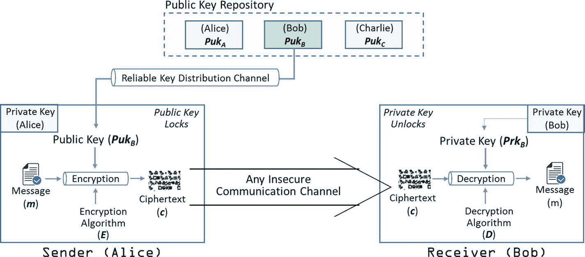
图 2-13
用于保密的非对称密码学

请注意，公钥应保存在人人可访问的公共存储库中，而私钥则必须作为严密保守的秘密保存。公钥密码学也提供了一种身份验证方式。接收者鲍勃可以用同样的方式验证消息 `m` 来源的真实性。

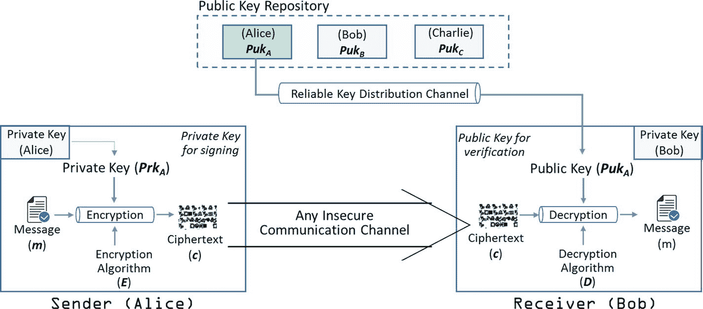
图 2-14
用于身份验证的非对称密码学

在图 2-14 的例子中，消息是使用爱丽丝的私钥准备的，因此可以确保该消息确实来自爱丽丝。因此，整个消息充当了数字签名。请注意，保密性和身份验证都是可取的。为了实现这一点，公钥加密必须使用两次。消息应首先使用发送者的私钥进行加密以提供数字签名。然后，它应使用接收者的公钥进行加密以提供保密性。可以表示为：
- `c = E[Puk[Bob], E(Prk[Alice], m)]`
- `m = D[Puk[Alice], D(Prk[Bob], c)]`

如您所见，解密完全按照相反的顺序进行。请注意，这里公钥密码学被使用了四次：两次用于加密，两次用于解密。发送者也可以仅对从待发送消息中派生出的一小块数据（而非整个消息）应用私钥来签署消息。在现实世界中，像 Google Play 或 Apple App Store 这样的应用商店要求软件应用在发布前必须进行数字签名。

我们了解了非对称密码学中两种密钥的用途，可以总结如下：
- 公钥对人人皆知且可访问。它们可用于加密消息或验证签名。
- 私钥对个人而言极其私密。它们用于解密消息或创建签名。

在非对称或公钥密码学中，不存在密钥分发问题，因为不再需要交换约定的密钥。然而，这种方法也存在一个重大挑战。如何确保某人用来加密消息的公钥确实是预期接收者的公钥，而不是入侵者或窃听者的公钥？为了解决这个问题，引入了被称为公钥基础设施（PKI）的受信任第三方概念。通过 PKI，公钥的真实性通过用户身份的认证或公证过程得到保证。PKI 的运作方式是，它们通过数字签名将验证过的公钥嵌入到安全证书中并提供。

公钥加密方案也可以称为单向函数或陷门函数。这是因为使用公钥 `Puk` 加密明文很容易，但反向操作实际上是不可能的。不掌握秘密或私钥 `Prk`（这实际上是陷门信息），任何人都无法从加密的密文中推断出原始明文。此外，仅就密钥而言，它们在数学上是相关的，但从计算上从一个推导出另一个是不可行的。

我们讨论了公钥密码学的重要目标，例如通过数字签名实现密钥建立、身份验证和不可否认性，以及通过加密实现保密性。然而，并非所有公钥密码学算法都能提供这三个特性。此外，这些算法在其底层计算问题方面也各不相同，并据此进行分类。某些算法（例如 `RSA`）基于整数因式分解方案，因为分解大数很困难。某些算法基于有限域中的离散对数问题，例如 Diffie–Hellman 密钥交换（`DH`）和 `DSA`。离散对数问题的一个推广版本是椭圆曲线（`EC`）公钥方案。椭圆曲线数字签名算法（`ECDSA`）就是一个例子。我们将在下一节介绍这些算法中的绝大部分。

### RSA

以罗恩·李维斯特、阿迪·萨莫尔和伦纳德·阿德曼命名的`RSA`算法可能是使用最广泛的密码学算法之一。它基于分解极大数的实际困难。在`RSA`中，对于某个`n`，明文和密文是介于`0`和`n − 1`之间的整数。

我们将从两个方面讨论`RSA`方案。首先是密钥对的生成，其次是加密和解密的工作原理。由于模运算为密钥生成提供了机制，让我们快速了解一下它。

#### 模运算

设`m`是一个称为模数的正整数。两个整数`a`和`b`对模数`m`同余，如果：

```
a ≡ b (mod m)，这意味着 a − b = m . k，其中 k 为某个整数。
```

示例：如果`a ≡ 16 (mod 10)`，那么`a`可以有以下解：

```
a = . . ., −24, −14, −4, 6, 16, 26, 36, 46
```

这些数字中的任何一个减去`16`都能被`10`整除。例如，`−24 −16 = −40`，它可以被`10`整除。请注意，`a ≡ 36 (mod 10)`也可以有相同的`a`的解。

根据商余定理，存在一个满足条件`0 ≤ a < m`的唯一解`a`。在示例`a ≡ 16 (mod 10)`中，只有值`6`满足条件`0 ≤ 6 < 10`。这就是`RSA`算法加密/解密过程中将要使用的内容。

现在让我们看一下逆模。如果`b`是`a`模`m`的逆元，那么它可以表示为：

```
a b ≡ 1 (mod m)，这意味着 a b − 1 = m . k，其中 k 为某个整数。
```

示例：`3`模`10`的逆元是`7`，因为

```
3 · 7 = 1 (mod 10) => 21 − 1 = 20，它可以被 10 整除。
```

### 密钥对的生成

如前所述，任何一方想要参与非对称加密通信，都需要一对私钥和公钥。在RSA方案中，公钥由` (e, n) `组成，其中`n`称为模数，`e`称为公钥指数。类似地，私钥由` (d, n) `组成，其中`n`是相同的模数，`d`是私钥指数。

让我们通过一个例子来看看这些密钥是如何生成的：

-   生成一对大素数`p`和`q`。为了便于理解，我们在此以两个较小的素数为例。那么，令这两个素数为`p = 7`和`q = 17`。
-   计算RSA模数`n`，即`n = pq`。这个`n`应该是一个大数，通常至少为512位。在我们的例子中，模数`n` = `pq = 119`。
-   找到一个公钥指数`e`，使得`1 < e < (p − 1)(q − 1)`，并且`e`与`(p − 1)(q − 1)`除了1之外没有公因子。这意味着`e`和`(p − 1)(q − 1)`互质。注意，满足此条件的值可能有多个，都可以作为`e`，但只需选取其中一个。
-   在我们的例子中，`(p − 1)(q − 1) = 6 × 16 = 96`。所以，`e`必须小于96且与96互质。我们令`e`为5。
-   现在，数对` (e, n) `就构成了公钥，应该被公开。所以，在我们的例子中，公钥是`(5, 119)`。
-   使用`p`、`q`和`e`计算私钥指数`d`，其中数字`d`是`e`关于模`(p − 1)(q − 1)`的逆元。这意味着`d`乘以`e`等于1模`(p − 1)(q − 1)`，并且`d < (p − 1)(q − 1)`。这可以表示为：

```
e d = 1 mod (p − 1)(q − 1)
```

-   注意，这个乘法逆元是私钥和公钥之间的纽带。虽然密钥并非彼此派生而来，但它们之间存在关联。
-   在我们的例子中，我们必须找到满足上述方程的`d`。即，`5 d = 1 mod 96`并且`d < 96`。
-   求解`d`的多个值（可以使用扩展欧几里得算法计算），我们可以看到`d = 77`满足我们的条件。验算一下：`77 × 5 = 385`，并且`385 − 1 = 384`能被96整除，因为`4 × 96 + 1 = 385`。
-   我们可以得出结论，在我们的例子中，私钥将是`(77, 119)`。
-   现在你就得到了你的密钥对！

### 使用密钥对进行加密/解密

一旦密钥生成，加密和解密的过程就相当简单了。其背后的数学原理如下：

使用公钥`(e, n)`将明文消息`m`加密为密文消息`c`的方法如下：

```
c = m^e (mod n)
```

给定公钥`(e, n)`和明文消息`m`。

使用私钥`(d, n)`将密文消息`c`解密为明文消息`m`的方法如下：

```
m = c^d (mod n)
```

给定私钥`(d, n)`和密文`c`。

注意，RSA方案是一种分组密码，其中输入被分成RSA算法可以处理的小块。此外，对于某个收发送双方都已知的整数`n`，明文和密文都是0到`n − 1`之间的整数。这意味着输入的明文被表示为整数，当它经过RSA处理变成密文时，它们仍然是整数，但不再是输入的整数；我们加密了它们，记得吗？现在，考虑与前面例子相同的密钥对，让我们逐步理解它实际是如何工作的：

-   发送方想要向接收方发送一条文本消息，接收方的公钥是已知的，假设为`(e, n)`。
-   发送方将文本消息分成若干块，这些块可以表示为一串小于`n`的数字。
-   明文的密文等价物可以使用`c = m^e (mod n)`求得。如果明文`m`是19，公钥是`(5, 119)`，其中`e = 5`且`n = 119`，那么密文`c`将是`19⁵ (mod 119) = 2,476,099 (mod 119) = 66`，66是余数，20,807是商，我们不需要商。所以，`c = 66`。
-   当密文66被接收方收到后，需要使用`m = c^d (mod n)`对其进行解密以获得明文。
-   接收方已经持有私钥`(d, n)`，其中`d = 77`且`n = 119`，并收到了发送方发送的密文`c = 66`。因此，接收方可以轻松地使用这些值恢复出明文，即`m = 66⁷⁷ (mod 119) = 19`。
-   关于模算术的计算，有很多在线计算器可供您尝试，例如：`http://comnuan.com/cmnn02/cmnn02008/`。

我们已经了解了RSA算法背后的数学原理。现在我们知道`n`（应该是一个非常大的数）是公开的。尽管它是公开的，但分解这个大数以得到素数`p`和`q`是极其困难的。RSA方案正是基于这种分解大数的实际困难。如果`p`和`q`不够大，或者公钥`e`很小，那么RSA的强度就会下降。目前，RSA密钥的长度通常在1024到2048位之间。注意，RSA密码术的计算开销会随着密钥大小的增加而增加。

在数据量巨大的情况下，建议使用对称加密技术，并使用如RSA这样的非对称加密技术来共享密钥。此外，我们探讨了RSA在加密和解密方面的一个方面。然而，它也可以通过数字签名用于身份验证。简而言之，人们可以对数据进行哈希处理，使用自己的私钥对其进行签名，然后将其与数据一起共享。接收方可以使用发送方的公钥进行验证，以确保数据是由发送方而非其他人发送的。这样，除了安全的密钥传输之外，公钥加密方法RSA还通过数字签名提供了身份验证。请注意，在这种情况下，也可以使用一种称为数字签名算法（DSA）的不同算法，我们将在下一节中学习。

RSA被广泛应用于Web浏览器上的HTTPS、电子邮件、VPN和卫星电视中。此外，许多商业应用或应用商店中的应用也使用RSA进行数字签名。SSH也使用公钥密码术；当你连接到SSH服务器时，它会广播一个公钥，该公钥可用于加密发送到该服务器的数据。然后，服务器可以使用其私钥解密数据。

#### 数字签名算法

`DSA`由美国国家安全局（NSA）设计，作为数字签名标准（`DSS`）的一部分，并由美国国家标准与技术研究院（NIST）标准化。请注意，其主要目标是数字签名消息，而非加密。换句话说，`RSA`既可用于密钥管理也可用于身份验证，而`DSA`仅用于身份验证。此外，与基于大数因子分解的`RSA`不同，`DSA`基于离散对数。从高层来看，`DSA`的使用方式如图2-15所示。

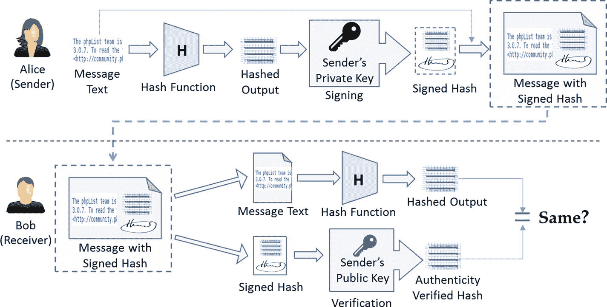

图2-15

数字签名算法（`DSA`）

如图2-15所示，消息先被哈希处理，然后再进行签名，因为这样比先签名再哈希更安全。理想情况下，你希望在执行其他操作之前先验证真实性。因此，在消息签名后，签名的哈希值会与消息一起标记并发送给接收方。接收方随后可以检查真实性并获取哈希值，同时对消息进行哈希处理以再次得到哈希值，并检查两个哈希值是否匹配。通过这种方式，`DSA`提供了以下安全特性：

-   **真实性**：由私钥签名，并由公钥验证。
-   **数据完整性**：若数据被篡改，哈希值将不匹配。
-   **不可否认性**：由于发送方进行了签名，他们之后无法否认自己发送过该消息。在数据交换可能引发争议的情况下，不可否认性是最理想的特性。例如，一旦电子订单下达，若在此情况下启用了不可否认性，购买方就无法否认该采购订单。

一个典型的`DSA`方案包含三种算法：(1) 密钥生成，(2) 签名生成，以及 (3) 签名验证。

#### 椭圆曲线密码学

椭圆曲线密码学（`ECC`）实际上是从Diffie-Hellman密码学发展而来的。它被发现是一种实现公钥密码学的替代机制。它实际上指的是一套密码协议，并像`DSA`一样基于离散对数问题。然而，人们认为离散对数问题在应用于椭圆曲线上的点时难度更大。因此，对于给定的密钥大小，`ECC`提供了更高的安全性。一个160位的`ECC`密钥被认为与1024位的`RSA`密钥同样安全。由于`ECC`中较小的密钥大小能比其他公钥算法提供更高的安全性和性能，它被广泛应用于小型嵌入式设备、传感器及其他物联网设备等。目前已有针对`ECC`的极其高效的硬件实现方案。

`ECC`基于有限域上椭圆曲线的一组数学相关数值。而且，它和椭圆形状毫无关系！从数学上讲，椭圆曲线满足以下数学方程：

```
y² = x³ + ax + b，其中 4 a³ + 27 b² ≠ 0
```

随着`a`和`b`值的不同，曲线会呈现出如下图中所示的不同形状：

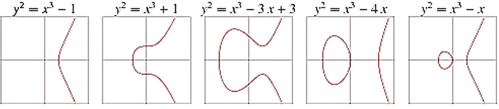

密码学中使用的椭圆曲线有几个重要特性，例如：

-   它们呈水平对称。也就是说，X轴下方的部分与上方的部分互为镜像。因此，曲线上任意一点相对于X轴反射后，仍位于曲线上。
-   任何非垂直直线最多能与曲线相交于三个点。
-   如果你在椭圆曲线上选取两个点`P`和`Q`，并通过它们画一条直线，该直线可能会与曲线恰好再多相交于一点。我们将其称为（`-R`）。如果通过（`-R`）画一条垂直线，它将与曲线相交于一点，我们称之为`R`，它是点（`-R`）的反射。那么，第三个属性意味着`P + Q = R`。这被称为“点加法”，即椭圆曲线上的两个点相加，会得到该曲线上的另一个点。请参考下图以直观理解这三个属性。

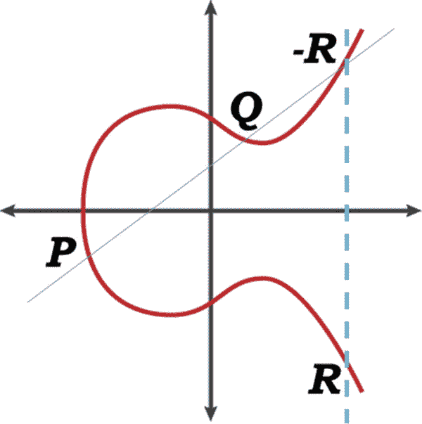

-   因此，你可以对曲线上的任意两点应用点加法。在上一个要点中，我们对`P`和`Q`执行了点加法（`P + Q`），找到了`-R`，并最终得到了`R`。一旦我们得到`R`，就可以从`P`到`R`画一条直线，该直线会再次与曲线相交于第三点。然后，我们可以取那个点，并沿垂直线移动，直到它再次与曲线相交。这就变成了对点`P`和`R`的点加法。对于一个固定的`P`，这个反复得出新点的过程可以无限继续下去，我们也会持续在曲线上得到新的点。
-   现在，如果不是两个点`P`和`Q`，而是对同一个点`P`（即`P`和`P`，称为“点加倍”）应用这个操作呢？显然，通过`P`点可以有无数条直线，因此我们只考虑切线。该切线将与曲线再多相交一点，从该点引出的垂直线将再次与曲线相交，从而得到最终的值。具体表示如下：

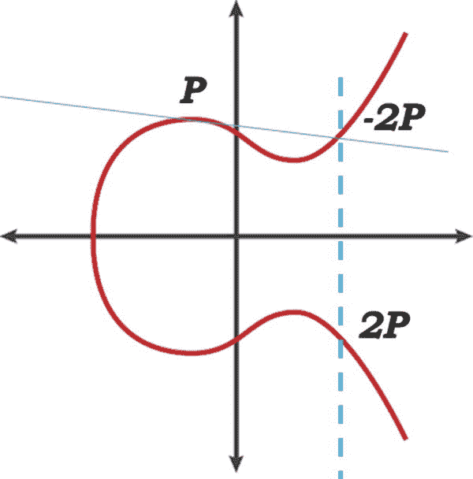

-   很明显，我们可以对初始点应用`n`次点加倍，每次都会引导我们到达曲线上的一个不同点。如图所示，第一次对点`P`应用点加倍时，我们得到了结果点`2P`。现在，如果重复这个过程`n`次，我们将会到达曲线上的一个点，如下图中所示：

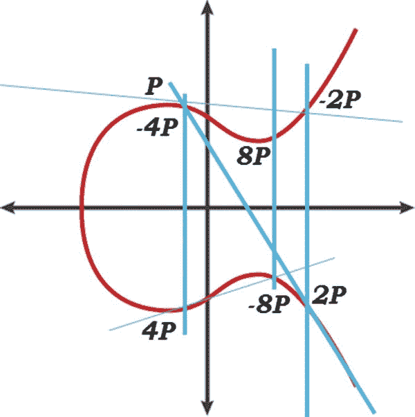

在所述场景中，当给定初始点和最终点时，除了逐一尝试所有可能的`n`之外，无法判断点倍运算被应用了多少次（`n`）才到达最终结果点。这就是椭圆曲线密码学中的离散对数问题，它指出：给定点`G`和`Q`（其中`Q`是`G`的倍数），求`d`使得`Q = dG`。这构成了一个没有捷径的单向函数。此处，`Q`是公钥，`d`是私钥。你能从公钥`Q`中提取出私钥`d`吗？这就是椭圆曲线离散对数问题，在计算上难以求解。

此外，曲线必须定义在一个有限域上，并且不能趋于无穷大！这意味着`X`轴上的“最大值”必须被限制在某个值，因此当达到最大值时，我们只需将值翻转。在椭圆曲线密码学（ECC）系统中，这个值用`P`表示（并非此处图表中使用的`P`），被称为“模数”值，它也定义了密钥长度，从而定义了有限域。在许多ECC实现中，`P`会选择一个质数。

-   增大`P`的规模会使曲线上可用的值增多，从而提供更高的安全性。
-   我们观察到，点加法和点倍运算是寻找用于加密和解密的数值的基础。

因此，为了定义一个ECC系统，需要定义以下域参数：

-   曲线方程：`y² = x³ + ax + b`，其中`4a³ + 27b² ≠ 0`
-   `P`：质数，指定曲线所在的有限域（模数值）
-   `a`和`b`：定义椭圆曲线的系数
-   `G`：曲线上的基点或生成点。所有点运算都从该点开始，并且它定义了循环子群。
-   `n`：曲线上直到结果线变为垂直时的点运算次数。即`G`的阶，也就是使得`nG = ∞`的最小正数。它通常是质数。
-   `h`：称为“余因子”，等于曲线的阶除以`n`。它是一个整数值，通常接近1。

请注意，ECC是生成密钥的优秀技术，但它需要与其他技术结合使用以实现数字签名和密钥交换。例如，椭圆曲线迪菲-赫尔曼（ECDH）广泛用于密钥交换，而椭圆曲线数字签名算法（ECDSA）则用于数字签名。

### 椭圆曲线数字签名算法

ECDSA是一种使用ECC进行密钥生成的数字签名算法（DSA）。顾名思义，它的目的是数字签名，而非加密。在更小的密钥尺寸、更高的安全性和更优的性能方面，ECDSA可以成为RSA的一个更好的替代方案。它是比特币中使用的最重要的密码学组件之一！

我们已经了解了数字签名如何用于在发送方和接收方之间建立信任。由于可以通过数字签名验证发送方的真实性和消息的完整性，两个未知方可以相互进行交易。请注意，发送方和接收方在开始通信前必须就域参数达成一致。

ECDSA大致包含三个步骤：密钥生成、签名生成和签名验证。

#### 密钥生成

由于域参数（`P`、`a`、`b`、`G`、`n`、`h`）是预先设定的，双方都已知曲线和基点。此外，使其成为有限域的质数`P`也是已知的（`P`通常是160位，也可能更大）。因此，发送方（例如Alice）按以下步骤生成密钥：

-   在区间`[1, n - 1]`内选择一个随机整数`d`
-   计算`Q = dG`
-   声明`Q`为公钥，并将`d`作为私钥妥善保管

#### 签名生成

密钥生成后，发送方Alice将使用私钥`d`对消息（`m`）进行签名。她将按指定顺序执行以下步骤来生成签名：

-   在区间`[1, n - 1]`内选择一个随机数`k`
-   计算`k.G`，得到新坐标`(x[1], y[1])`，并计算`r = x[1] mod n`
-   如果`r = 0`，则从头重新开始
-   计算`e = SHA-1(m)`
-   计算`s = k^(-1)(e + d.r) mod n`
-   如果`s = 0`，则从第一步重新开始
-   Alice对消息`m`的签名现在为`(r, s)`

#### 签名验证

假设Bob是接收方，他可以访问域参数和发送方Alice的公钥`Q`。作为安全措施，Bob应首先验证他拥有的数据——即域参数、签名和Alice的公钥`Q`——全部有效。为了验证Alice对消息（`m`）的签名，Bob将按指定顺序执行以下操作：

-   验证`r`和`s`是区间`[1, n - 1]`内的整数
-   计算`e = SHA-1(m)`
-   计算`w = s^(-1) mod n`
-   计算`u[1] = ew mod n` 和 `u[2] = rw mod n`
-   计算`X = u[1]G + u[2]G`，其中`X`代表坐标，例如`(x[2], y[2])`
-   计算`v = x[1] mod n`
-   如果`r = v`则接受签名，否则拒绝

在本节中，我们了解了ECDSA背后的数学原理。回想一下，我们在生成密钥和签名时都使用了随机数。确保生成的随机数实际上是密码学意义上的随机数至关重要。在许多用例中，使用160位ECDSA，因为它需要与SHA-1哈希函数匹配。

在众多用例中，ECDSA被用于数字证书。在最简单的形式中，数字证书是一个公钥，与设备ID和证书过期日期捆绑在一起。这样，证书使我们能够检查并确认公钥属于谁，以及所考虑的设备是否是网络的合法成员。这些证书对于防止密钥建立协议中的“冒充攻击”非常重要。许多TLS证书都是基于ECDSA密钥对，并且这种用法正在持续增长。

### 非对称密钥密码学代码示例

以下是一些不同公钥算法的代码示例。本节旨在让你初步了解如何以编程方式使用不同算法。代码示例使用 Python 编写，但在不同语言中会非常相似；你只需找到要使用的正确库函数即可。

```python
# -*- coding: utf-8 -*-
import Crypto
from Crypto.PublicKey import RSA
from Crypto import Random
from hashlib import sha256
# 生成密钥的函数，默认长度为 1024
def generate_key(KEY_LENGTH=1024):
    random_value= Random.new().read
    keyPair=RSA.generate(KEY_LENGTH,random_value)
    return keyPair
# 为爱丽丝和鲍勃生成密钥
bobKey=generate_key()
aliceKey=generate_key()
# 打印爱丽丝和鲍勃的公钥。此密钥可以共享
alicePK=aliceKey.publickey()
bobPK=bobKey.publickey()
print "爱丽丝的公钥:", alicePK
print "鲍勃的公钥:", bobPK
# 爱丽丝想向鲍勃发送一条秘密消息。为爱丽丝创建一条虚拟消息
secret_message="爱丽丝给鲍勃的秘密消息"
print "消息",  secret_message
# 生成签名的函数
def generate_signature(key,message):
    message_hash=sha256(message).digest()
    signature=key.sign(message_hash,'')
    return signature
# 为秘密消息生成签名
alice_sign=generate_signature(aliceKey,secret_message)
# 在网络中发送消息之前，使用鲍勃的公钥加密消息...
encrypted_for_bob  = bobPK.encrypt(secret_message, 32)
# 鲍勃使用自己的私钥解密消息...
decrypted_message   = bobKey.decrypt(encrypted_for_bob)
print "解密后的消息:", decrypted_message
# 鲍勃将使用以下函数，通过爱丽丝的公钥验证她的签名
def verify_signature(message,PublicKey,signature):
    message_hash=sha256(message).digest()
    verify = PublicKey.verify(message_hash,signature)
    return verify
# 鲍勃使用解密后的消息和爱丽丝的公钥进行验证
print "爱丽丝对解密后消息的签名是否有效？", verify_signature(decrypted_message,alicePK, alice_sign)
```

### ECDSA 算法

```python
import ecdsa
# SECP256k1 是比特币椭圆曲线
signingKey = ecdsa.SigningKey.generate(curve=ecdsa.SECP256k1)
# 获取验证密钥
verifyingKey = signingKey.get_verifying_key()
# 生成消息的签名
signature = signingKey.sign(b"signed message")
# 验证签名对于消息是否有效
verifyingKey.verify(signature, b"signed message") # 正确。签名有效
# 验证签名对于消息是否有效
assert verifyingKey.verify(signature, b"message") # 抛出错误。签名对该消息无效
```

### Diffie-Hellman 密钥交换

我们在前面的章节中已经学习了对称密钥密码学。回想一下，在发送方和接收方之间共享秘密是一个非常巨大的挑战。根据经验法则，我们现在知道通信信道总是不安全的。总是可能存在一个名叫伊芙的攻击者，试图通过各种不同类型的攻击来拦截你正在传输的消息。因此，DH 技术被开发出来，用于安全地交换密码密钥。显然，你一定会疑惑，当通信信道本身不安全时，如何可能进行安全的密钥交换？好吧，在本节后面你将看到，DH 技术并非真正地在两方之间共享整个秘密密钥，而是关于共同创建密钥。归根结底，重要的是发送方和接收方拥有相同的密钥。然而，请记住，这不是非对称密钥密码学，因为在交换过程中并未进行加密/解密。事实上，它是后来设计非对称密钥密码学的基础。我们现在讨论这项技术的原因在于，我们在上一节中已经学习的许多数学知识在这里很有用。

在进入数学解释之前，让我们先尝试从高层次理解这个概念。请看下图（图 2-16），它用颜色对 DH 算法进行了简单解释。

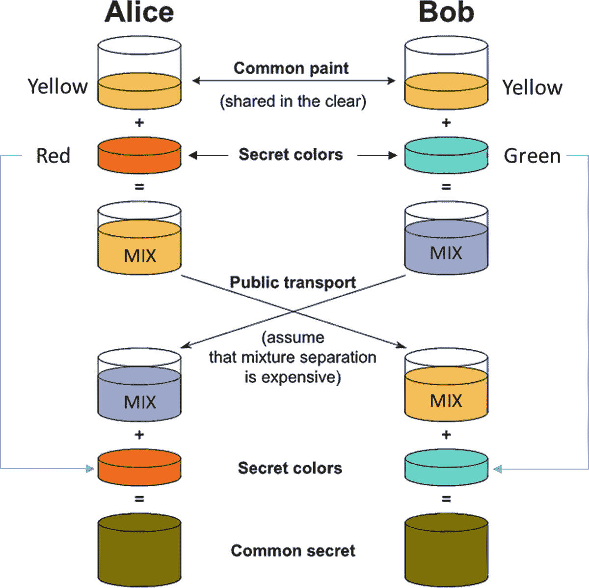

**图 2-16**

Diffie-Hellman 密钥交换示意图

注意，在第一步中，只有黄色在两方之间共享，它可以代表任何其他颜色或一个随机数。然后，双方将自己的秘密加入其中并制作成混合物。该混合物再次通过同一个不安全的信道共享。接着，各方将自己的秘密加入其中，形成最终的公共秘密。在这个使用颜色的示例中，观察公共秘密是由相同颜色组合而成的。现在，让我们看看密钥生成过程中实际发生的数学步骤：

* 爱丽丝和鲍勃约定 `P = 23` 和 `G = 9`
* 爱丽丝选择私钥 `a = 4`，计算 `9⁴ mod 23 = 6`，并将其发送给鲍勃
* 鲍勃选择私钥 `b = 3`，计算 `9³ mod 23 = 16`，并将其发送给爱丽丝
* 爱丽丝计算 `16⁴ mod 23 = 9`
* 鲍勃计算 `6³ mod 23 = 9`

如果你遵循这些步骤，你会发现爱丽丝和鲍勃都能在自己的终端生成相同的秘密密钥，该密钥可用于加密/解密。为了便于理解，我们在示例中使用了较小的数字，但在实际应用场景中会使用大质数。为了更好地理解，让我们浏览以下代码片段，看看如何以简单的方式实现 DH 算法：

```cpp
/* 使用 Diffie-Hellman 密钥交换算法为两方计算密钥的程序 */
// 返回 a ^ b mod P 值的函数
long long int power(long long int a, long long int b, long long int P)
{
    if (b == 1)
        return a;
    else
        return (((long long int)pow(a, b)) % P);
}
// DH 密钥计算的主程序
int main()
{
    long long int P, G, x, a, y, b, ka, kb;
    // 双方约定公钥 G 和 P
    P = 23; // 取一个质数 P
    printf("P 的值为: %lld\n", P);
    G = 9; // 取 P 的一个本原根 G
    printf("G 的值为: %lld\n\n", G);
    // 爱丽丝将选择私钥 a
    a = 4; // a 是选择的私钥
    printf("爱丽丝的私钥 a: %lld\n", a);
    x = power(G, a, P); // 获取生成的密钥
    // 鲍勃将选择私钥 b
    b = 3; // b 是选择的私钥
    printf("鲍勃的私钥 b: %lld\n\n", b);
    y = power(G, b, P); // 获取生成的密钥
    // 密钥交换后生成秘密密钥
    ka = power(y, a, P); // 爱丽丝的秘密密钥
    kb = power(x, b, P); // 鲍勃的秘密密钥
    printf("爱丽丝的秘密密钥是: %lld\n", ka);
    printf("鲍勃的秘密密钥是: %lld\n", kb);
    return 0;
}
```

> **注意：** 虽然传统上使用离散对数问题（`x^y mod p`），但一般流程也可以修改为使用椭圆曲线密码学。

## 对称密码学与非对称密码学

我们已探讨了对称密码算法和非对称密码算法的多个方面与类型。显然，它们的设计目标和应用场景各不相同。下面通过对比分析，以便在合适的场景选用正确的算法。

**表 2-5**  
对称与非对称密钥技术要求对比

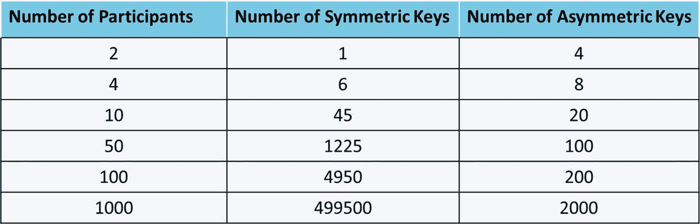

- `对称密钥密码学` 也称为 `私钥密码学`。同样地，`非对称密钥密码学` 也被称为 `公钥密码学`。
- 与 `非对称密钥密码学` 不同，`对称密钥密码学` 中的密钥交换或分发是一个令人头疼的问题。
- `非对称加密` 计算量相当大，因为密钥长度通常很大，因此加密和解密过程较慢。相比之下，`对称加密` 速度更快。
- `对称密钥密码学` 适用于长消息，因为其加解密速度快。`非对称密钥密码学` 适用于短消息，其加解密速度较慢。
- 在 `对称密钥密码学` 中，明文和密文中的符号会被置换或替换。在 `非对称密钥密码学` 中，明文和密文被当作整数处理。
- 在许多情况下，当使用 `对称密钥` 进行加密和解密时，会利用 `非对称密钥` 技术来共享和协商加密所用的密钥。
- `非对称密钥密码学` 在涉及无预先关系各方的不可信环境中具有最强的应用价值。由于未知各方没有机会预先建立共享密钥，因此通过 `公钥密码学` 来保障敏感数据共享的安全性。
- `对称密码技术` 无法提供数字签名功能，而数字签名只能通过 `非对称密码学` 实现。
- 另一个典型场景是一组节点之间相互通信所需的密钥数量。假设有 100 个参与者需要采用 `对称密钥密码学`，你认为需要多少密钥？可以将这个问题看作一个 100 阶的完全图问题：每个顶点需要 99 条边才能与所有人相连，因此每个参与者需要 99 个密钥才能与所有其他节点建立安全连接。那么，总共需要的密钥数量为 `100 × (100 − 1) / 2 = 4,950`。将其推广到 "n" 个参与者的情况，总共需要 `n × (n − 1) / 2` 个密钥。随着参与者数量的增加，这将变得极其棘手！然而，在 `非对称密钥密码学` 中，每个参与者只需要两个密钥（一个私钥和一个公钥）。对于一个包含 100 个参与者的网络，总共只需要 200 个密钥。表 2-5 提供了一些示例数据，用以说明当参与者数量增加时，所需密钥数量的增长情况。

## 博弈论

博弈论无疑是一个相当古老的概念，并已被广泛应用于现实生活中的许多复杂问题求解。我们在此简要介绍这个主题，是因为它在比特币以及许多其他区块链解决方案中均有应用。博弈论由约翰·冯·诺伊曼正式提出，用于研究经济决策。后来，由于约翰·福布斯·纳什的“纳什均衡”理论，博弈论得到了更广泛的普及，我们稍后将对此进行探讨。首先，让我们理解什么是博弈论。

博弈论是一门关于博弈的理论，这里所说的博弈不仅仅是儿童玩耍的游戏。大多数情况下，它涉及两方或多方在某种策略行为下的互动。例如：一场板球锦标赛是一个博弈，法庭上双方律师和陪审团的对峙是一个博弈，两个兄弟姐妹争夺冰淇淋是一个博弈，一场政治选举是一个博弈，一个交通信号灯也是一个博弈。再比如：假设你申请了一份区块链工作并被录用，对方给出了一个薪资报价，但你拒绝了，认为供需之间存在巨大差距，对方很可能会提高报价。你可能会想，什么不是博弈？其实，在现实情境中，几乎所有事情都是一场博弈。因此，“博弈”可以定义为一种涉及“关联理性选择”的情境。这意味着任何参与者可获得的预期结果不仅取决于他们自己的选择，也取决于其他人在特定情境下做出的选择。换句话说，如果你的命运受到他人行为的影响，那么你就身处一场博弈之中。那么，究竟什么是博弈论？

博弈论是对复杂博弈中策略的研究。它是一门基于目标，在特定情境下做出最佳决策或选择最优策略的艺术。要做到这一点，必须理解对手的策略，以及对手认为你会采取什么行动。让我们看一个简单的例子：有一对兄妹。冰箱里有两份冰淇淋，一份是橙子味，一份是芒果味。哥哥想吃橙子味的，但他知道如果自己选了橙子味，妹妹就会哭闹着也要橙子味。于是，他选择了芒果味的冰淇淋，事情正如所料，妹妹也想要芒果味的。这时，哥哥假装牺牲了芒果味的冰淇淋，把它让给妹妹，自己吃掉了橙子味的。注意这个情境：这对双方来说是一种双赢，而这正是哥哥的目标。如果哥哥想要，他可以简单地和妹妹打一架，如果他的目标是拿到橙子味冰淇淋，那他就能得手。在第二种情况中，哥哥会制定策略，找准下手的位置，既不让妹妹受重伤，又能让她放弃橙子味冰淇淋。这就是博弈论：你的目标是什么，你该做出怎样的最佳抉择？

### 博弈论：一个商业场景示例

让我们再看一个例子——这次更偏向商业场景。假设你是一个向城镇供应蔬菜的供应商。比如说，有三条路可以到达该城镇，其中一条是常规路线，因为路程更短、路况更好，几乎每个人都走这条路。有一天，你发现常规路线因维修工程而被封锁，你完全无法走那条路。现在只剩下另外两条路可选：一条是通往目的城镇的捷径，但路比较窄；另一条路稍长一些，但路面宽阔。此时，你必须制定一个策略，决定走这两条路中的哪一条。情况可能是这样的：路上交通繁忙，许多人会试图通过最短的路线。这可能导致那条路严重拥堵，造成巨大延误。因此，你决定走较长的路线，以便准时到达城镇，但代价是多花几美元的油费。你确信，如果你能准时到达并以好价格早早卖出蔬菜，这点成本很容易就能弥补回来。这就是博弈论：为了实现你心中的目标（通常是找到一个最优解决方案），你的最佳行动是什么？

在许多情况下，你所扮演的角色和你的目标在制定策略时都起着至关重要的作用。例如：如果你是一个体育赛事的组织者，而不是参赛者，那么你会制定一个策略，其目标可能是希望参赛者遵守规则并遵循流程。这是因为你并不在乎最终谁赢，你只是一个组织者。另一方面，参赛者会通过考虑对手的优缺点以及组织者制定的规则来制定获胜策略，因为违反规则可能会受到处罚。现在，让我们考虑你扮演组织者角色的情况。你应该考虑是否可能出现这样一种情况：某参赛者违反规则而失去一分，但却让对手受伤到无法继续比赛的程度。因此，你必须考虑参赛者可能会想什么，并据此制定你的规则。

让我们根据从之前例子中学到的内容，再次尝试定义博弈论。它是一种将现实生活情境建模为游戏形式的方法，并分析一个人或实体在给定情境下为了期望结果所能采取的最佳策略或行动。博弈论的概念几乎被广泛应用于生活的方方面面，例如政治、社交媒体、城市规划、竞标、博彩、市场营销、分布式存储、分布式计算、供应链以及金融等，仅举几例。利用博弈论的概念，可以设计出参与者无需依赖其情感或道德价值观就能遵守规则的系统。如果你想要超越仅仅构建概念验证，将你的产品或解决方案投入生产，那么你应该将博弈论列为最重要的元素之一。它可以帮助你构建稳健的解决方案，并让你用各种有趣的场景来测试它。事实上，很多人已经在用博弈论的视角思考问题，只是他们自己不知道这就是博弈论。然而，如果你掌握了博弈论中的众多工具和技术，这绝对会有所帮助。

# 纳什均衡

在上一节中，我们看了不同的博弈例子。博弈有很多种分类方式，例如合作/非合作博弈、对称/非对称博弈、零和/非零和博弈、同时/顺序博弈等。更一般地说，这里让我们聚焦于合作/非合作视角，因为它与`纳什均衡`有关。

顾名思义，在合作博弈中，玩家相互合作，可以结成联盟。此外，可能存在某种外部力量来确保玩家之间的合作行为。另一方面，在非合作博弈中，玩家作为个体竞争，没有结成联盟的空间。参与者只关心自己的利益。同时，也没有外部力量来强制实施合作行为。

`纳什均衡`指出，在任意一个玩家都了解彼此策略的非合作博弈中，至少存在一个均衡点，在该均衡点上，所有玩家都发挥其最佳策略以获得最大收益，并且任何一方都不会因改变自身策略而获益。如果你知道其他玩家的策略，并且你也有自己的策略，如果你无法通过改变自己的策略而获益，那么这就是`纳什均衡`的状态。因此，`纳什均衡`中的每一个策略，都是对该均衡中所有其他策略的最佳回应。

请注意，一个玩家可能作为个体玩家制定策略以求获胜，但并非通过确保对手得到最差结果来击败对手。此外，任何游戏如果重复进行，最终都可能陷入`纳什均衡`。

在下一节中，我们将通过“囚徒困境”来具体理解`纳什均衡`。

## 囚徒困境

现实生活中的许多博弈也可能是非零和博弈。囚徒困境便是其中一例，它大致可归类为对称博弈。这是因为，如果你交换玩家的身份（例如，如果玩家“A”和“B”参与游戏，则“A”变为“B”，“B”变为“A”），且策略不变，那么收益保持不变。这就是对称博弈的含义。

我们直接从一个例子开始。假设有两个人，鲍勃和查理，他们因独立贩卖毒品（例如，在不同地点）被警察抓获。他们被关在不同的牢房接受审讯。警方告知他们，此罪行将被判处两年监禁。现在，警方不知何故怀疑这两人也可能参与了上周刚发生的抢劫案。如果他们没抢劫，反正也是两年监禁。因此，警方需要设计一个策略来查明真相。于是他们是这么做的。

警方找到鲍勃，给了他一个选择，一个听起来不错的选项：如果鲍勃认罪而查理不认罪，那么鲍勃的刑罚将降至一年，而查理将获刑五年。然而，如果鲍勃否认而查理认罪，那么鲍勃将获刑五年，查理仅获刑一年。另外，如果两人都认罪，那么两人都将被监禁三年。同样，警方也给了查理相同的选择。你认为他们会怎么做？这种情况就称为囚徒困境。

鲍勃和查理身处两个不同的牢房，无法交流。如果两人都否认并各自服刑两年（仅针对毒品案），这似乎是该情况下的全局最优解。但即使他们能交谈，也未必真正信任对方。

现在鲍勃心里会怎么想？他有两个选择：认罪或否认。他知道查理会做出对自己最有利的选择，他自己也不例外。如果他否认而查理认罪，那他就会陷入麻烦，获刑五年，而查理只需坐一年牢。他当然不想陷入这种境地。

如果鲍勃认罪，那么查理有两个选择：认罪或否认。鲍勃想，如果他认罪，那么无论查理怎么做，他最多不会超过三年。我们来列举一下鲍勃面临的这些情况。

- 鲍勃认罪，查理否认——鲍勃获刑一年，查理获刑五年（鲍勃认罪情况下的最佳情况）
- 鲍勃认罪，查理也认罪——鲍勃和查理均获刑三年（鲍勃认罪情况下的最差情况）

这种情况称为`纳什均衡`，即每一方都在给定对方选择的情况下做出了最优行动。这绝非全局最优解，但代表了作为个体的最佳选择。现在，如果你作为旁观者来看，你会说双方都应该否认并各自获刑两年。但当你作为参与者参与博弈时，你最终就会陷入`纳什均衡`。请注意，这是最稳定的阶段，此时你改变自己的决定不会带来任何好处。这可以用图 2-17 所示的图形来表示。

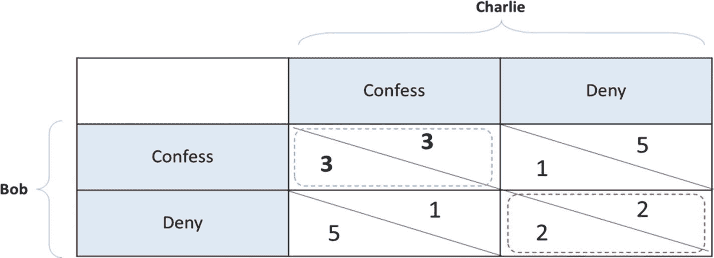

图 2-17 囚徒困境——收益矩阵

## 拜占庭将军问题

在上一节中，我们了解了博弈的不同例子，并学习了一些博弈论概念。现在我们将讨论一个源自古代的具体问题，它至今仍被广泛用于解决许多计算机科学以及现实生活中的问题。

`拜占庭将军问题`是拜占庭军队在进攻一座城市时遇到的问题。情况直截了当，却极难处理。简单来说，情况是：多个由不同将军指挥的军队派系包围了一座城市，意图攻克它。胜利的唯一机会是所有将军同时进攻城市。然而，问题在于如何达成共识。这意味着要么所有将军都进攻，要么所有将军都撤退。如果部分进攻、部分撤退，那么他们战败的可能性就更大。我们通过一个具体的数字例子来更好地理解这种情况。

假设有一个场景，拜占庭军队的五个派系包围了一座城市。如果五位将军中至少有三位愿意进攻，他们就进攻城市，否则就撤退。如果将军中存在叛徒，他可以这样做：在愿意进攻的将军面前投票支持进攻，在愿意撤退的将军面前投票支持撤退。他之所以能这样做，是因为军队分散在各个派系中，这使得集中协调变得困难。这可能导致两位将军进攻城市，却因寡不敌众而战败。这种情况还可能引发更复杂的问题：

- 如果有不止一个叛徒怎么办？
- 将军之间如何进行消息协调？
- 如果信使被城市指挥官抓获、杀害或收买怎么办？
- 如果某个叛徒将军伪造了不同的消息来欺骗其他将军怎么办？
- 如何找出哪些将军是诚实的，哪些是叛徒？

如你所见，要对城市进行协同进攻，有太多挑战需要解决。这可以用图 2-18 所示的图形来表示。

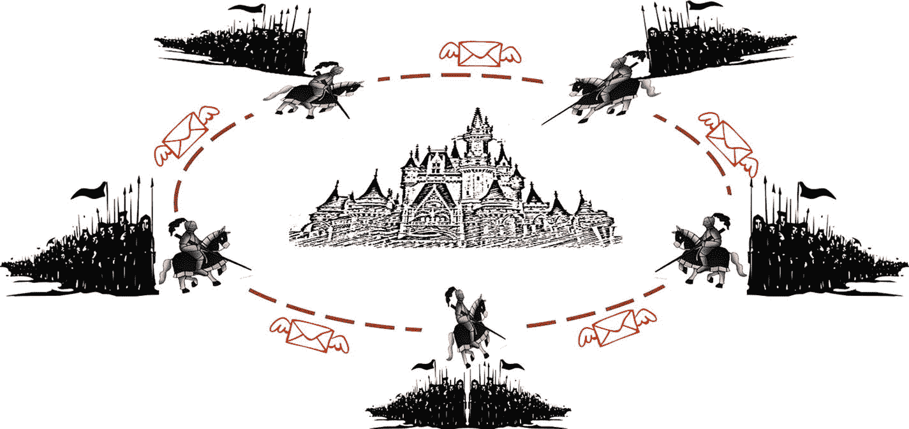

图 2-18 拜占庭军队进攻城市

现实生活中有无数场景与`拜占庭将军问题`类似。一群人如何就某个投票议程达成共识，如何维护分布式或去中心化数据库的一致性状态，或者如何维护区块链在网络中各节点副本的一致性状态，这些都是与`拜占庭将军问题`相似的例子。但请注意，针对这些不同问题的解决方案在不同情境下可能截然不同。我们将在本书后面探讨比特币如何解决`拜占庭将军问题`。

## 零和博弈

博弈论中的零和博弈概念十分直白。在这类博弈中，一方的收益等价于另一方的损失。举例来说：一方赢得的数额恰好等于对手损失的数额，这意味着参与者的选择既不能增加也不能减少特定情境下的可用资源。

`扑克`、`国际象棋`、`围棋`等是零和博弈的几个例子。更广泛地说，那些只有一人获胜而对手落败的博弈，如网球、羽毛球等，也属于零和博弈。许多金融工具，如`互换`、`远期合约`和`期权`，也可被描述为零和工具。

在许多现实生活场景中，收益与损失难以量化。因此，相比非零和博弈，零和博弈并不那么常见。大多数金融交易或贸易以及股票市场都是非零和博弈。然而，保险领域却是零和博弈发挥重要作用的地方。不妨思考一下保险计划是如何运作的。我们向保险公司支付保费，以防范事故、住院、死亡等困难情况。想到自己已投保，我们得以安心生活，而在遭遇困境时，保险公司也会给予相应赔偿。这确实提供了一份帮助我们渡过难关的财务保障。请注意，并非每位支付保费的人都会遭遇事故或住院，而真正需要理赔的人所需的金额远超其支付的保费。你看，即便考虑到保险公司的运营成本，这里的一切也相当平衡。此外，保险公司可能会将我们支付的保费进行投资并获得一定回报。即便如此，这依然是一个零和博弈。

再举一个不同的例子：如果有一个职位正在举行面试招聘，那么最终录用的候选人实际上是以其他候选人的落选为代价的。这同样是一个零和博弈。

你可能会问，研究零和博弈有什么用处。其实，仅仅意识到零和情境的存在，对于理解和制定复杂问题的策略就非常有用。我们可以分析在特定的交易场景中，自己是否能够实际获益。

# 为何要学习博弈论

博弈论是一种革命性的跨学科现象，它将心理学、经济学、数学、哲学以及众多其他学术领域广泛地融合在一起。

我们说博弈论与现实世界的问题息息相关。然而，问题是无穷无尽的。博弈论的概念也是无穷无尽的吗？当然！我们每天都在有意或无意地运用博弈论，因为我们总是会动脑筋，在特定情境下采取最佳策略行动。不是吗？既然如此，为什么还要学习博弈论呢？

原因在于，博弈论中有大量案例能帮助我们换一种方式思考。一些已发展成熟的理论，如`纳什均衡`，就与许多现实生活情境相关。在很多现实场景中，参与者或决策者面对的决策矩阵类似于“囚徒困境”。因此，学习这些概念不仅能帮助我们以更数学化的方式构建问题，还能让我们做出最佳决策。它让我们识别出，在任何给定的互动中，每位参与者在选择策略行动之前应考虑哪些方面。它告诉我们首先要确定博弈的类型：参与者是谁，他们的目标或目的是什么，他们可能采取什么行动等，以便能采取最佳行动。现实生活中的许多决策涉及不同方；博弈论为理性决策提供了基础。

我们在前一节学习的`拜占庭将军问题`，广泛应用于分布式存储解决方案和数据中心，以维护各计算节点间的数据一致性。

## 计算机科学工程

如前所述，正是巧妙地运用计算机科学的概念，将密码学、博弈论等许多其他领域的组件缝合在一起，才构建出了区块链。在本节中，我们将学习区块链中用到的一些重要的计算机科学组件。

### 区块链

正如我们将要了解的，区块链本质上是一种区块链数据结构；从某种意义上说，它是由一个个区块链接而成的链条。当我们提到一个区块时，它可以指代单笔交易，也可以指代多笔交易组合在一起。我们将从哈希指针开始讨论，它是区块链数据结构的基本构建单元。

哈希指针是一种指向数据块的密码学哈希值，其中哈希指针本身就是该数据块的哈希值（图 2-19）。与指向下一个区块以便你能访问它的链表不同，哈希指针指向前一个数据块，并提供一种验证数据未被篡改的方法。

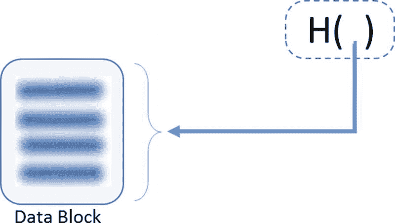

图 2-19 针对交易区块的哈希指针

哈希指针的目的是构建一个防篡改的区块链，该区块链可被视为单一事实来源。区块链如何实现这一目标？其工作原理是，当前区块的区块头中存储了前一个区块的哈希值，而当前区块及其区块头的哈希值则会存储在下一个区块的区块头中。这就形成了我们能在图 2-20 中看到的区块链。

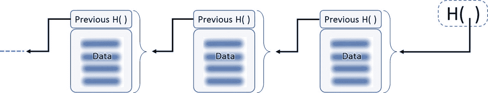

图 2-20 通过哈希指针链接的区块链中的区块

正如我们所观察到的，每个区块都指向其前一个区块，即“父区块”。每个新添加到链上的区块，都会成为下一个待添加区块的父区块。这个过程一直追溯到区块链中创建的第一个区块，它被称为“创世区块”。在这种通过哈希值反向链接区块的设计中，任何人想要篡改任何区块中的数据实际上都是不可行的。我们已经了解了哈希函数的特性，因此知道如果数据被篡改，哈希值将无法匹配。那如果有人也同时更改了哈希值呢？让我们关注图 2-21 来理解为何以任何方式篡改数据都是不可能的。

- 假如你还更改了区块 1235 的区块头中存储的哈希值，使其与被篡改后的数据完美匹配。换句话说，你对篡改后的数据块 1234 计算哈希值，然后用这个新哈希值替换区块 1235 区块头中存储的那个。但这样操作后，区块 1235 的哈希值本身也会改变（因为区块 1235 指的是数据和区块头的整体），并且这个新哈希值将无法与区块 1236 区块头中存储的哈希值匹配。
- 你必须一直这样做，直到最后一个或最新的哈希值。由于网络中的所有人或多数人已经拥有区块链以及最新哈希值的副本，因此绝无可能同时攻击大多数系统并更改所有哈希值。
- 这使得它成为一种防篡改的区块链数据结构。

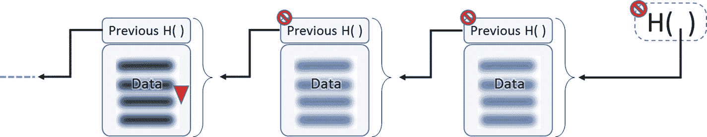

图 2-21 任何更改区块头或区块内容的尝试都会破坏整个链条。假设你篡改了区块 1234 中的数据。如果这样做，存储在区块 1235 区块头中的哈希值将无法匹配。

这清楚地意味着每个区块都可以通过其哈希值唯一标识。要计算这个哈希值，你可以使用我们在密码学部分讨论过的`SHA2`或`SHA3`哈希函数族。如果你使用`SHA-256`对区块进行哈希计算，它将产生一个 256 位的哈希输出，例如：

```
000000000000000a73b6a2af7bad40ec3fc2a83dafd76ef15f3d1b71a7132765
```

注意其中只有 64 个字符。由于哈希输出使用十六进制字符表示，而每个十六进制数字可以用四位比特表示，因此输出是 64 × 4 = 256 位。在许多地方，你通常会看到 256 位的哈希输出就是用这 64 个十六进制字符表示的。

区块的结构，即区块大小、数据和区块头部分、一个区块中的交易数量等，是你在设计区块链解决方案时需要决定的事项。对于现有的区块链，如比特币、以太坊或超级账本，其结构已经定义好，你必须理解这些结构才能在这些平台之上进行构建。我们将在本书后面详细研究比特币和以太坊的区块链。

### 默克尔树

默克尔树是一种由密码学哈希指针构成的二叉树，因此它是一种二叉哈希树。它以发明者拉尔夫·默克尔的名字命名。它是区块链解决方案（如比特币）中使用的另一种有用的数据结构。默克尔树是通过对配对的数椐（通常是叶子层的交易）进行哈希计算，然后对哈希输出结果逐层向上重复哈希，直至根节点（称为默克尔根）构建而成的。像其他树一样，它是自底向上构建的。在比特币中，叶子节点始终是区块链中单个区块的交易。我们将稍后讨论使用默克尔树的好处，这样你可以自行决定叶子节点是交易还是区块中的交易组。一个典型的默克尔树可以如图 2-22 所示。

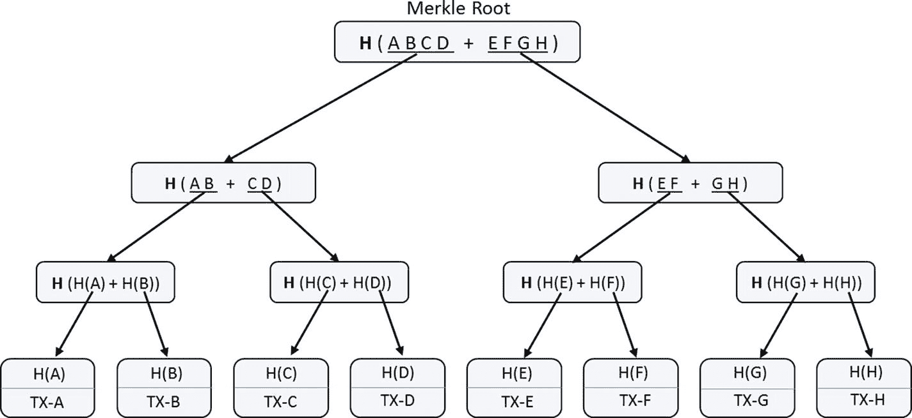

图 2-22 默克尔树表示

与哈希指针数据结构类似，默克尔树也是防篡改的。篡改树中任何层级的数据，都无法与层级结构中上一级存储的哈希值匹配，也无法与直到根节点的哈希值匹配。攻击者要改变整棵树中的所有哈希值是非常困难的。它还保证了交易顺序的完整性。即使你只更改了交易的顺序，从该节点到默克尔根的树中哈希值也会改变。

这里有一种情况。默克尔树是二叉树，叶子层应该有偶数个项目。如果项目数量是奇数该怎么办？一个好的解决方案是复制最后一个交易的哈希值。因为我们复制的是哈希值，这意味着只是相同的交易，并不会产生任何诸如双花或重复交易的问题。这样，就有可能平衡这棵树。

在我们讨论的区块链中，如果我们要通过哈希值查找一笔交易，或检查过去是否发生过某笔交易，我们该如何找到那笔交易呢？唯一的方法是不断遍历，直到找到与这笔交易的哈希值完全匹配的区块。这正是默克尔树可以大显身手的地方。

默克尔树提供了一种非常高效的方式来验证特定的交易是否属于某个特定的区块。如果默克尔树中有“n”笔交易（叶子项），那么这种验证只需要 `Log(n)` 时间，如图 2-23 所示。

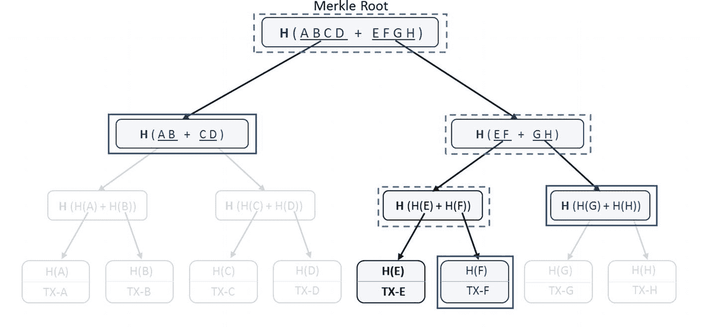

图 2-23 默克尔树中的验证

要验证一笔交易或任何其他叶子项是否属于某个默克尔树，我们不需要所有的项和整棵树。相反，只需要它的一个子集，正如我们在图 2-23 中所见。我们可以直接从要验证的交易及其兄弟节点（因为是二叉树，所以会有一个兄弟叶子项）开始，计算这两者的哈希值，并检查它是否与它们的父哈希值匹配。然后，用该父哈希值及其在该层的兄弟节点继续此过程，将它们一起哈希以得到它们的父哈希值。一直持续这个过程直到顶部的根哈希值，是实现交易验证的最快方式（对于 n 个项目，只需 `Log(n)` 时间）。在图中，只需要实线矩形中的数据，而虚线矩形中的数据则可以在给定实线矩形数据的情况下计算得出。由于有八个交易元素（n = 8），验证只需要三次计算（log2 8 = 3）。

## 区块链数据结构与默克尔树的结合

现在，考虑区块链数据结构和默克尔树的混合体如何？想象区块链中每个区块包含大量交易的情况。由于这是区块链，前一个区块的哈希已经存在；现在，将区块中所有交易的默克尔根包含进来，有助于更快地验证交易。如果我们需要验证声称来自（例如）区块`22456`的一笔交易，我们可以获取该区块的交易，验证默克尔树，并快速确认该交易是否有效。我们已经看到，使用默克尔树验证交易非常容易且快速。尽管区块链中的区块具有防篡改特性，几乎不允许对区块内容进行任何修改，但默克尔树也确保了交易的顺序得以保留。

在典型的区块链环境中，可能存在许多情况，其中一个节点（为简单起见，假设任何没有完整区块链数据的节点，即轻节点）需要验证过去是否发生了某笔交易。实际上，这里需要验证两件事：交易作为区块的一部分，以及区块作为区块链的一部分。为此，节点不必下载区块中的所有交易，只需向网络请求与区块哈希和交易哈希相关的信息即可。网络中拥有相关信息的对等节点可以用该交易的默克尔路径来响应。你可能会问，如何信任网络中未知对等节点与你共享的数据？你已经知道哈希函数是单向的。因此，恶意节点绝无可能伪造出与给定哈希值匹配的交易；从交易级别到默克尔根级别，这甚至更加困难。

默克尔树的使用不仅限于区块链：它们还广泛应用于其他许多应用程序，例如`BitTorrent`、`Cassandra`（一个`NoSQL`数据库）、`Apache Wave`等。

# 默克尔树的示例代码片段

本节旨在让你初步了解如何编写最基本的默克尔树代码。代码示例使用 `Python`，但其他语言中也相当类似；你只需要找到正确的库函数即可。

```python
# -*- coding: utf-8 -*-
from hashlib import sha256

class MerkelTree(object):
    def __init__(self):
        pass

    def chunks(self, transaction, n):
        # This function yeilds "n" number of transaction at time
        for i in range(0, len(transaction), n):
            yield transaction[i:i+n]

    def merkel_tree(self, transactions):
        # Here we will find the merkel tree hash of all transactions passed to this fuction
        # Problem is solved using recursion techqiue
        # Given a list of transactions, we concatinate the hashes in groups of two and compute
        # the hash of the group, then keep the hash of group. We repeat this step till
        # we reach a single hash
        sub_tree = []
        for i in self.chunks(transactions, 2):
            if len(i) == 2:
                hash_val = sha256((str(i[0]) + str(i[1])).encode()).hexdigest()
            else:
                hash_val = sha256((str(i[0]) + str(i[0])).encode()).hexdigest()
            sub_tree.append(hash_val)
        # When the sub_tree has only one hash then we reached our merkel tree hash.
        # Otherwise, we call this fuction recursively
        if len(sub_tree) == 1:
            return sub_tree[0]
        else:
            return self.merkel_tree(sub_tree)

if __name__ == '__main__':
    mk = MerkelTree()
    merkel_hash = mk.merkel_tree(["TX1", "TX2", "TX3", "TX4", "TX5", "TX6"])
    print(merkel_hash)
```

# 综合应用

到本节为止，我们已经涵盖了帮助理解区块链真正工作原理的所有必要组件。通过研究密码学、博弈论和计算机科学工程概念，我们应该已经对区块链如何运作有了概念。尽管这些概念已经存在了很长时间，但没有人能想象到这些古老的知识如何被用来构建像区块链这样变革性的技术。让我们快速回顾一下目前涵盖的一些基础知识，我们将在这些概念的基础上进一步构建理解。以下是它们：

- 加密函数是单向的，不可逆。它们是确定性的，对于给定输入产生相同输出。对输入的任何更改都会在再次哈希时产生完全不同的输出。
- 使用公钥密码学，可以实现数字签名。它有助于验证签名者/实体的真实性。考虑到私钥是保密的，伪造他人身份的签名是不可行的。此外，如果某人对任何文档或交易进行了签名，他们之后不能否认。
- 使用博弈论原则和最佳实践，可以设计出在大多数异常情况下都能维持的健壮系统。需要妥善处理能够面对拜占庭将军问题的系统。我们对任何系统设计的方法都应当使参与者通过遵守规则获得最大收益；偏离协议不应使他们真正受益。
- 区块链数据结构通过使用加密哈希，提供了一条防篡改的区块链。默克尔树的使用使交易验证变得更容易、更快速。

牢记所有这些概念，现在让我们思考一个真实的区块链实现。要使这样一个去中心化系统正常运行，你认为需要解决哪些问题？嗯，有很多问题；有些问题对大多数区块链用例来说是通用的，有些则是特定的。让我们至少讨论一些需要解决的场景：

- 谁来维护分布式交易账本？是所有参与者都维护，还是只有少数人维护？对于那些计算能力不足以处理交易或没有足够存储空间容纳整个交易历史的计算节点怎么办？
- 如何维持分布式账本的单一一致状态？网络延迟、数据包丢失、故意黑客攻击等是不可避免的。系统如何应对所有这些情况？
- 谁来验证或无效交易？是只有少数授权节点验证，还是所有节点共同达成共识？如果某些节点在特定时间不可用怎么办？
- 如果某些计算节点故意想要破坏系统或试图拒绝某些交易怎么办？
- 当没有中心化实体负责时，如何升级系统？在去中心化网络中，如果一些计算节点升级了自己而其他节点没有，该怎么办？

实际上，除了刚才提到的这些问题之外，还有更多需要解决的问题。现在我们让你带着这些思考，但大多数疑问应该会在本章结束前得到澄清。

让我们从设计任何去中心化解决方案可能需要的区块链系统的一些基本构建块开始。

# 区块链解决方案的属性

到目前为止，我们只学习了区块链解决方案的技术方面，以了解区块链如何工作。在本节中，我们将学习区块链的一些期望属性。

## 不可变性

这是维护区块链交易原子性的最期望属性。一旦交易被记录，就不能被更改。如果交易被广播到网络，那么几乎每个人都有一份副本。随着时间的推移，越来越多的区块被添加到区块链中，不可变性增加，经过一定时间后，它变得完全不可变。对于某人来说，篡改一系列这么多区块的数据实际上是不可行的，因为它们受到密码学保护。因此，任何被记录的交易都将永远存在于系统中。

## 防伪造

由于交易公开，去中心化方案容易遭受各种攻击。最明显的当属伪造企图，尤其是在涉及任何有价值交易时。密码学哈希和数字签名可用于确保系统具有防伪造能力。我们已经了解到，在计算上伪造他人签名是不可行的。如果你发起一笔交易并对其哈希值进行签名，那么之后任何人都无法篡改交易内容，并声称你签署的是另一笔交易。同样，你之后也无法声称从未做过这笔交易，因为签名者就是你本人。

## 民主性

任何点对点去中心化系统在设计上都应当具备民主性（对于私有区块链可能不完全适用，这一点我们稍后再讨论）。系统中不应存在任何比其它节点更强大的实体。每一位参与者在任何情况下都应享有平等权利，决策需在多数节点达成共识时做出。

## 防双花

双花攻击在货币及非货币交易中都相当常见。在加密货币环境中，双花是指试图将相同金额支付给多人。例如：你账户中有 100 美元，却向两个或更多方各支付 90 美元，这就是一种双花行为。对于比特币这类没有“期末余额”概念的加密货币来说，情况略有不同。交易的输入（即你向某人付款时）是另一笔交易的输出，在该交易中你收到的金额至少等于你本次支付的金额。假设鲍勃之前从爱丽丝那里收到了 10 美元。如果今天鲍勃想向查理支付 8 美元，那么他从爱丽丝处收到 10 美元的那笔交易将成为与查理交易的输入。因此，鲍勃不能多次使用同一笔输入（爱丽丝支付给他的 10 美元）向其他人付款，从而实施双花。再举一个不同的例子：某人拥有一块土地，却将同一块土地卖给了两个人。

在中心化系统中，防止双花相当容易，因为中心机构知晓所有交易。区块链解决方案也应当能够抵御此类双花攻击。虽然密码学能确保交易的真实性，但无法帮助防止双花。因为从技术上讲，正常交易和双花交易都是真实的。因此，防止双花的唯一可能途径是知晓所有交易。如果我们了解过去发生的所有交易，就能判断一笔交易是否属于双花尝试。因此，验证交易的节点必须能够访问自创世块以来的完整区块链数据。

## 账本状态一致性

我们刚刚讨论的各项性质在一定程度上确保了账本的整体一致性。设想一种情况：某些节点故意希望阻止某笔交易，使其被拒绝。或者，如果某些节点因故与账本不同步，导致不知道其离线期间发生的几笔交易，那么对这些节点而言，某笔交易可能看起来像是欺诈。那么，如何确保参与者之间达成共识，这是一个需要非常谨慎处理的问题。请回想一下“拜占庭将军问题”。针对特定情况选择合适的共识机制，对于确保去中心化方案的稳定性起着最重要的作用。我们将在本书后面学习不同的共识机制。

## 弹性

网络应具备足够的弹性，以承受临时节点故障、某些计算节点偶尔不可用、网络延迟和数据包丢失等情况。

## 可审计性

区块链是一条通过哈希值链接而成的区块链条。由于交易区块一直链接回创世块，可审计性已经存在，我们必须确保这一点无论如何都不会被破坏。此外，如果某人想验证过去是否发生过某笔交易，那么这种验证应该能够快速完成。

# 区块链交易

当我们谈论区块链时，指的是交易的区块链，对吧？因此，整个过程始于一笔交易，该交易会经历一系列步骤，最终被记录在区块链中。由于区块链是一种点对点的现象，如果你处理的用例每秒涉及大量交易，你可能不希望让所有交易都充斥整个网络。显然，当个人或实体发起交易时，他们只需将其广播到整个网络。一旦完成广播，交易必须由多个节点进行验证。验证通过后，它需要再次广播到整个网络，以便该交易被纳入区块链。

那么，为什么不采用交易链而非区块链呢？如果你的业务场景不涉及大量交易，这在某种程度上可能是合理的。然而，如果每秒有海量交易发生，那么在交易层面进行哈希运算、保留其踪迹，并将其广播到网络中，可能会导致系统不稳定。你可能希望将一定数量的交易分组到一个区块中，然后广播该区块。广播单个交易可能会变得成本高昂。

另一个使用区块链而非交易链的重要原因是防止女巫攻击。在第 3 章中，你将更详细地了解 `PoW` 挖矿算法是如何运作的，以及如何随机选择一个节点来提议区块。如果不是这样，人们可能会创建自己节点的副本以破坏系统。

在最简化的形式下，区块链交易通过以下步骤被纳入区块链：

- 每笔新交易都会被广播到网络中，以便所有计算节点在交易发生时知晓该事实（以确保系统具有双花防护能力）。
- 交易可能会由节点通过检查其真实性进行验证，以决定接受或拒绝。
- 随后，节点可能会将多笔交易分组形成区块，并与网络中的其他节点共享。
- 此时便遇到了难点：谁来提议这些由各节点自行分组的交易区块？广义上讲，新区块的生成应受到控制，但不能采用中心化方式，且机制应确保每个节点拥有平等优先级。所有节点就某个区块达成一致的过程被称为共识，但根据你的用例，存在不同的算法来实现这一目标。我们将在下一节讨论不同的共识机制。
- 尽管由于网络延迟、数据包丢失和地理位置等因素，不存在全局时间的概念，但此类系统仍然能够运行，因为区块是按顺序逐一添加的。因此，我们可以认为区块按照它们到达的顺序被打上时间戳，并被添加到区块链中。
- 一旦网络中的节点一致接受某个区块，该区块就会被纳入区块链，并且它包含前一个区块的哈希值。这样一来，区块链便会延长一个区块。

我们已经讨论过区块链的数据结构和默克尔树，因此现在能理解它们的价值了。回想一下，当节点需要验证一笔交易时，它可以通过默克尔路径更高效地完成验证。网络中的其他节点无需共享完整的区块数据来证明某笔交易在一个区块中的成员资格。从技术上讲，“布隆过滤器”这类内存高效且对计算机友好的数据结构在此类场景中被广泛用于测试成员资格。

此外，请注意，为了能够验证交易，节点理想情况下应在本地拥有完整的区块链数据（交易及其元数据）。你应该根据用例选择一个高效的存储机制，供节点采用。

# 分布式共识机制

当节点通过本地保存完整区块链数据的副本以知晓整个交易历史，从而防止双花，并且能够通过数字签名验证交易的真实性时，共识的作用又是什么？想象一下存在一个或多个恶意节点的情况。难道它们不能把无效交易说成有效交易，或者反过来吗？回想一下拜占庭将军问题，这在许多去中心化系统中极有可能发生。为了克服此类问题，我们需要建立适当的共识机制。

到目前为止，我们讨论中尚不明确的一点是：谁来提议区块？显然，并非所有节点都应同时向其他节点提议区块，因为这只会制造混乱，更别提要保持账本状态的一致性了。另一方面，如果只是交易而没有将它们分组为区块，你可能会辩称：如果每笔交易都被广播到整个网络，并且网络中的每个节点都对这些单独的交易进行投票，这只会使系统复杂化，并导致性能低下。

因此，出于显而易见的原因，将交易分组为区块非常重要，并且需要基于每个区块达成共识。解决此问题的最佳策略是：一次只应有一个节点提议一个区块，其余节点应验证该区块中的交易，如果交易有效，则将其添加到各自的区块链中。我们知道每个节点都维护着自己的账本副本，并且没有用于同步的中央来源。因此，如果任何一个节点提议一个区块，而其余节点都同意它，那么所有这些节点都会将该区块添加到各自的区块链中。在这种设计中，你倾向于区块创建之间至少有几分钟的间隔，而不应出现多个区块同时到达的情况。现在的问题是：谁可能是那个幸运的节点来提议区块？这是最棘手的部分，也可能导致适当的共识；我们将在不同的共识机制下讨论这一方面。

这些共识机制实际上源于博弈论。你的系统设计应确保节点在遵守规则时能获得最大收益。确保节点诚实行为的一个方面是奖励诚实行为，惩罚欺诈活动。然而，这里有一个陷阱。在像比特币这样的公有区块链中，一个人可以拥有许多不同的公共身份，而且这些身份是相当匿名的。惩罚此类身份变得非常困难，因为它们可以选择为自己创建新身份来规避惩罚。另一方面，奖励它们效果很好，因为即使有人拥有多个身份，他们也可以愉快地接受给予他们的奖励。因此，这取决于你的业务场景：如果身份是匿名的，那么惩罚可能不起作用，但如果身份不是匿名的，则可能效果良好。尽管有很好的机制来选择提议下一个区块的节点，你仍可能要考虑这种奖励/惩罚的方面。这是因为你永远无法预先知道所选节点是恶意节点还是诚实节点。请记住我们可能经常使用的术语 `挖矿`，它指的是生成新区块。

共识的目标还在于确保网络足够健壮，能够抵御各种类型的攻击。无论根据用例选择何种共识算法，它都必须符合拜占庭容错共识的框架才能被接受。现在让我们学习一些与区块链场景相关的共识机制，我们可能在不同的情况下使用它们。

# 工作量证明（Proof of Work）

`PoW` 共识机制已经存在了相当长的时间。然而，它在比特币中的使用方式，加上其他概念的引入，使其变得更加流行。我们将在基础层面讨论这一共识机制，并在第 3 章中考察它在比特币中的实现方式。

`PoW` 算法背后的理念是：在将一组交易区块提交给整个网络之前，需要为该区块完成一定的工作量。`PoW` 实际上是一段数据，它在计算和时间层面难以生成，但易于验证。`PoW` 的旧用途之一是防止垃圾邮件。如果在发送一封邮件之前必须完成一定的工作量，那么向大量人群发送垃圾邮件就需要执行大量的计算。这有助于阻止垃圾邮件。同样，在区块链中，如果在生成一个区块之前需要执行一定量的计算密集型工作，那么这可以在两方面发挥作用：一是这肯定会耗费一些时间；二是，如果某个节点试图向一个区块中注入欺诈交易，那么该区块被其他节点拒绝，对于提出该区块的节点来说代价将非常高昂。这是因为为获得 `PoW` 所执行的计算将变得毫无价值。

试想一下，几乎不费什么力气就提出一个区块，与付出艰苦努力才能提出一个区块之间的区别。如果几乎不需要什么努力，那么提出一个包含欺诈交易的区块并被拒绝，就不会是什么大问题。人们可能会一直抱着侥幸心理提出这样的区块，期望某个时候能通过并成功上链。相反，为提出一个区块付出艰苦努力，能够以一种巧妙的方式防止节点注入欺诈交易。

此外，工作的难度应该是可调整的，这样才能控制区块生成的速度。你一定在想，如果我们讨论的是需要一定计算和时间的工作，那它到底是一种什么样的工作呢？这是一项非常简单但巧妙的任务。这里举个例子可以帮助理解。想象一个问题：你需要找到一个数字，对该数字进行哈希运算后，得到的哈希输出必须以字母“a”开头。你会怎么做？我们已经了解了哈希函数，并且知道对此没有捷径可循。所以你只能不断地猜测（比如随便选一个数字，然后不断加一）数字，并对它们进行哈希运算，看看是否符合要求。如果需要提高难度，那么就可以规定哈希输出必须以三个连续的“a”开头。显然，找到类似“axxxxxxx”的解要比找到“aaaxxxxx”的解容易，因为后者约束更多。

在上面的例子中，如果有多个不同的节点都在努力解决这样一个计算难题，那么你永远无法知道哪个节点会先解出来。这可以用来随机选择一个节点（这次是真正的随机，因为背后没有任何算法）来解出难题并提出区块。需要特别注意的是，在公有链的情况下，那些投入计算资源的节点必须因其诚实行为而获得奖励，否则这种系统将难以为继。

# 权益证明（Proof of Stake）

`权益证明`（`PoS`）算法是另一种在分布式共识领域相当流行的共识算法。然而，它的巧妙之处在于，它与挖矿无关，而是与验证交易区块有关。这里没有因为生成新币而产生的挖矿奖励，矿工（更准确地说是验证者，但为了便于解释，我们将继续使用“矿工”一词）只能获得交易手续费。

在 `PoS` 系统中，验证者需要质押他们的权益（抵押他们希望作为赌注的加密货币数量），才能参与验证交易。验证者生成一个区块的概率与其质押量成正比；质押的数额越大，他们验证新区块交易的可能性就越高。矿工只需要证明他们在特定时间点，在特定货币系统中，拥有所有可用货币的一定百分比即可。例如，如果一个矿工拥有以太坊网络中所有以太币（`ETH`）的 2%，那么他就能挖到以太坊上所有交易的 2%。据此，系统决定由谁来创建新的交易区块，而这会根据你所使用的具体 `PoS` 算法而有所不同。是的，`PoS` 算法有多种变体，例如朴素的 `PoS`、委托 `PoS`、基于链的 `PoS`、`拜占庭容错风格的 PoS` 以及 `Casper PoS` 等等。`委托权益证明`（`DPOS`）被 Bitshares 采用，而 `Casper PoS` 正在被开发用于以太坊。

由于在 `PoS` 系统中，区块的创建者是确定的（基于质押量），因此其工作速度比 `PoW` 系统快得多。同时，由于没有区块奖励，只有交易手续费，所有的数字货币都需要在系统初始时创建，并且其总量在整个过程中是固定的。

`PoS` 系统能更好地防御恶意攻击，因为发动攻击会危及全部的质押金额。此外，由于它不需要消耗大量电力和占用 CPU 周期，在适用的情况下，它比 `PoW` 系统更具优先性。

### PBFT

`PBFT` 是 `实用拜占庭容错`（`Practical Byzantine Fault Tolerance`）算法的缩写，是为区块链用例可考虑的众多共识算法之一。在众多的区块链项目中，Hyperledger、Stellar 和 Ripple 是采用 `PBFT` 共识的几个项目。

与 `PoS` 算法类似，`PBFT` 也是一种不用于产生挖矿奖励的算法。然而，它们各自在实现细节上是不同的。`PBFT` 的内部工作原理超出了本书的讨论范围，但从高层次来看，请求会被广播到所有参与节点，这些节点都拥有各自的数据副本或内部状态。当节点收到请求时，它们会根据自身的内部状态执行计算。计算的结果随后会与系统中的所有其他节点共享。因此，每个节点都知晓其他节点正在计算什么。结合自身的计算结果以及其他节点传来的结果，它们会做出决策并提交一个最终值，该值会再次在节点间共享。此时，每个节点都知晓所有其他节点的最终决策。然后，所有节点都响应其最终决策，基于多数原则，达成最终共识。这如 图 2-24 所示。

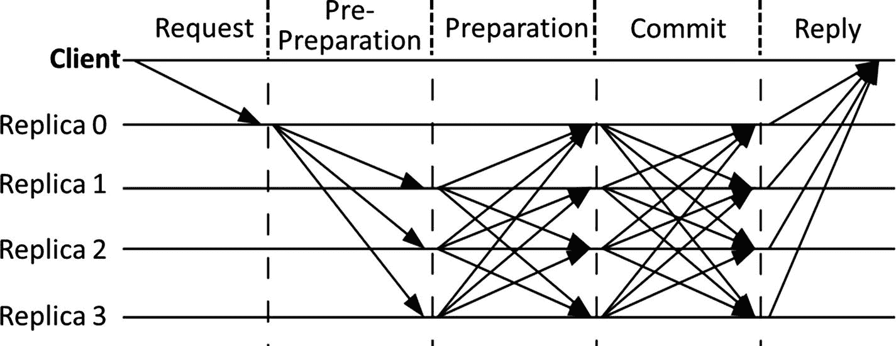
**图 2-24**
`PBFT` 共识方法

基于所需的工作量，`PBFT` 可以比其他共识算法更高效。然而，由于该算法的设计方式，系统中的匿名性可能会受到损害。即使在非区块链环境中，它也是使用最广泛的共识算法之一。

### 区块链应用

虽然我们在本章中探讨了区块链的具体细节，但同样重要的是，要了解它如何被用于构建区块链解决方案。目前正在构建的应用中，有些将区块链视为网络服务器背后的后端数据库，而另一些则是完全去中心化、没有中心服务器的应用。例如，比特币区块链就是一个没有可发送请求的服务器的区块链应用！每一笔交易都会广播到整个网络。然而，也有可能构建一个托管在中心化网络服务器上的网络应用，并在需要时更新比特币区块链。请看图 2-25，其中显示了一个比特币节点在某个时间点向可达节点广播交易的过程。

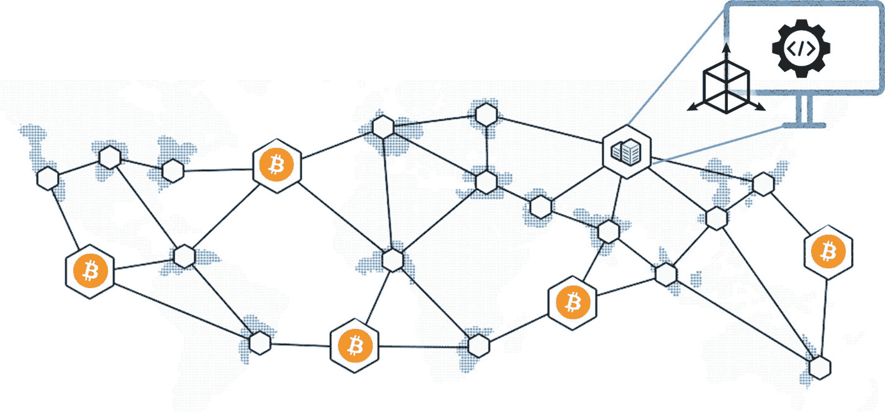
**图 2-25**
比特币区块链节点

从软件应用的角度来看，每个节点都是自给自足的，并维护着各自的区块链数据库副本。以比特币区块链为基准，没有中心服务器的区块链应用似乎是最纯粹的去中心化应用，它们大多属于“公有区块链”类别。通常，对于这类公有区块链，使用来自诸如 Microsoft Azure、IBM Bluemix 等云服务提供商的资源还不太普遍。然而，对于大多数私有区块链来说，云服务提供商已开始受到欢迎。打个比方，可能有多个网络应用服务于不同的部门或参与者，它们都拥有自己的区块链后端，并且这些区块链彼此之间保持同步。在这种设置下，虽然技术上实现了去中心化，但从治理角度看，它可能仍然是中心化的。即使实施了控制或治理，由于能够访问单一真相来源，系统仍然能够保持透明度和信任。请看图 2-26，它可能类似于大多数正在构建的区块链概念验证或应用，其中区块链由某些云服务提供商通过其提供的`区块链即服务`（`BaaS`）产品来托管。

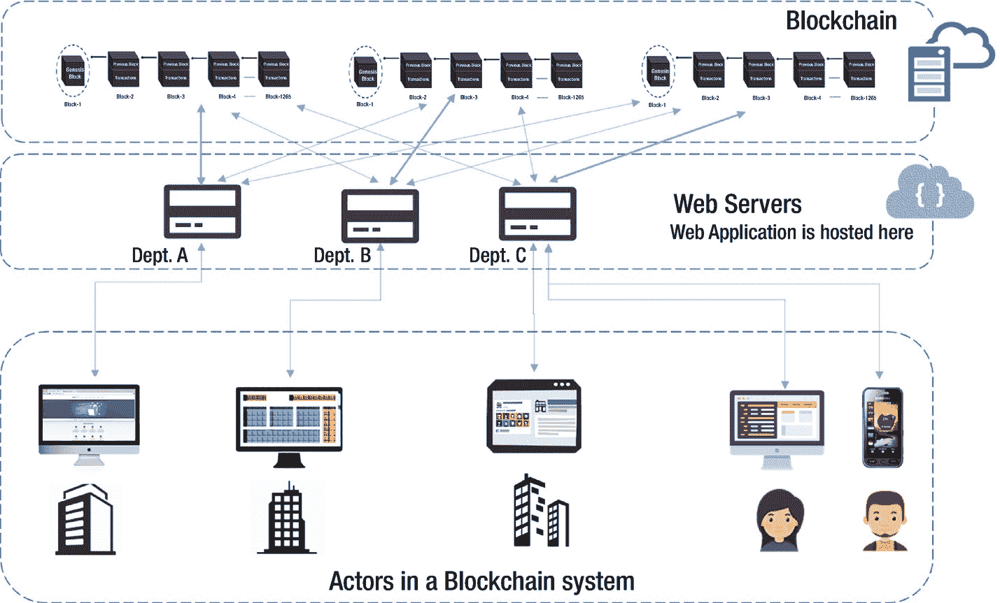
**图 2-26**
云端支持的区块链系统

并不一定所有部门都需要各自不同的网络应用。一个网络应用可以通过适当的访问控制机制处理系统中多个不同参与者的请求。让系统中的所有参与者都拥有自己的区块链副本可能是个好主意。拥有本地区块链副本不仅有助于维护系统的透明度，还可能通过随时访问数据来帮助生成数据驱动的见解。系统中不同参与者维护的不同“区块链”在设计上保持一致，这要归功于诸如`PoW`、`PoS`等共识算法。大多数私有区块链倾向于使用除`PoW`之外的任何共识算法，以减轻资源消耗，并尽可能节省电力和计算能力。当涉及到私有或联盟链时，`PoS`共识机制相当常见。由于区块链正在颠覆商业的诸多方面，并且没有更好的方法来实现它们之间的透明度，因此在云端创建“按使用付费”模式的区块链解决方案正越来越受欢迎。云服务正在帮助企业以最低的前期投资，在其由区块链驱动的数字化转型之旅中实现跨越式发展。

还有在以太坊区块链网络上构建的去中心化应用（`DApps`）。这些应用可以是私有以太坊上的许可制，也可以是公有以太坊网络上的非许可制。同时，这些应用也可以服务于同一公有以太坊网络上的不同用例。虽然我们将在本书后面详细介绍以太坊的具体内容，但请先看图 2-27，以高层次了解这些应用可能的样子。

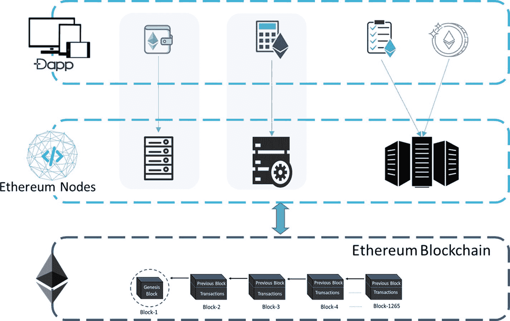
**图 2-27**
以太坊网络上的`DApps`

正如前面章节所讨论的，开发区块链应用只受限于你的想象力。可以构建纯粹的区块链原生应用。目前也在构建将区块链仅视为后端的应用，以及使用传统应用并仅将区块链用于某些特定目的的混合应用。到目前为止，区块链的可扩展性是最主要的问题之一。虽然可扩展性本身仍处于研究阶段，但让我们先学习一些扩展技术。

### 扩展区块链

我们从历史的角度审视了区块链，并了解了它何以成为当今最具颠覆性的技术之一。在本章的技术探讨中，我们了解到大多数区块链变体固有的可扩展性问题。根据设计，区块链难以扩展，因此它成为了学术界和一些创新驱动型企业的研究领域。看看比特币的采用情况，由于固有的可扩展性挑战，它并没有被用来取代法定货币。你不能用比特币买杯咖啡，然后等待一小时交易才结算。因此，比特币正被用作一种资产类别供投资者投资。截至目前，比特币区块链网络无法容纳像 Visa 或 MasterCard 那样多的交易量。

回想一下我们目前学过的共识协议，例如比特币或以太坊的`PoW`，或其他一些区块链变体（如 Multichain、Hyperledger、Ripple 或 Tendermint）的`PoS`及其他`BFT`共识。所有这些共识算法的主要目标都是实现拜占庭容错。根据设计，区块链网络中的每个节点（至少是全节点）都维护着整个区块链的本地副本，验证所有交易和区块，响应网络中其他节点的请求等，以实现去中心化，但这却成为了可扩展性的瓶颈。看看这里的讽刺之处——我们在中心化系统中增加更多服务器以提升可扩展性，但这在去中心化系统中却不适用，因为随着节点数量增加，延迟只会增加。虽然在去中心化网络中，节点数量增加可能会提高去中心化程度，但网络中的交易数量也会增加，从而导致对计算和存储资源的需求增加。请记住，这种情况更适用于公有区块链，而对私有区块链影响较小。与公有链相比，私有链更容易扩展，因为控制实体可以定义和设置具有高计算能力和更大带宽的节点规格。此外，某些任务可以从区块链上卸载并在链下计算，这也有助于系统良好地扩展。

在本章中，我们将学习一些通用的扩展技术，并在各自的章节中讨论比特币和以太坊特有的扩展技术。请记住，并非所有扩展技术都适用于所有类型的区块链变体或用例。最好的方法是理解这些技术原理，并在特定情况下使用最合适的技术。

#### 链下计算

链下计算是扩展区块链解决方案最有前景的技术之一。其核心理念是限制区块链的使用，将繁重的计算任务放在链外完成，仅将最终结果存储在链上。请注意，链下计算并没有标准的执行方式，它高度依赖于具体场景和解决问题的人群。此外，不同类型的区块链可能需要采用不同的链下计算方法。从宏观层面看，它就像是区块链之上的一层，负责处理大量计算密集型工作，并明智地使用区块链资源。显然，通过链下计算你可能无法保留区块链的所有特性，但同样，你也并非所有计算需求都需要依赖区块链，可以仅将其用于解决特定痛点。

链下计算可以在侧链上进行，可以分布在随机节点组中，也可以是中心化的。侧链独立于主区块链，它不仅有助于更好地扩展区块链，还能将损害隔离在侧链内，防止主区块链受到侧链问题的波及。一个典型的侧链例子是比特币的“闪电网络”，它有助于以极低费用快速执行交易，并能支持微支付。比特币的另一个侧链例子是“零币”，其主要目的并非可扩展性，而是隐私保护。如果你使用零币进行比特币交易，你的交易将无法被追踪，从而保护了隐私。本书将把讨论范围限定在通用的可扩展性技术上，不会深入探讨比特币的可扩展性细节。

此时你可能产生一个显而易见的问题：如果交易通过链下发送，人们如何验证其真实性？首先，创建一笔有效交易并不需要区块链。我们在本章的“密码学”部分已经了解了区块链系统所使用的非对称密钥密码学。要进行交易，你必须拥有一个私钥的所有权，这样你才能对交易进行签名。交易创建后，将其纳入区块链会带来诸多优势。例如，比特币区块链可以防止双重支付，还有其他优势。目前，你只需明白一点：只要你拥有自己账户的私钥，就能创建交易。

比特币区块链是一种“无状态”区块链，它不维护账户的状态。比特币区块链中的所有信息都以交易的形式存在。要发起一笔交易，你必须消耗一笔之前的交易，而且账户没有所谓的“期末余额”概念。相比之下，以太坊区块链则是“有状态”的！以太坊区块链中的区块包含了整个区块的状态信息，其中就包括账户余额。当网络中每个节点都维护这些状态信息时，它们会占用大量空间。对于其他有状态的区块链而言，情况也是如此。

让我们通过一个例子来更好地理解。假设爱丽丝和鲍勃双方之间有多笔交易。比方说，他们通常每个月有 50 笔货币交易。在一个有状态的区块链中，所有这些单独的交易都会包含各自的状态信息，并且这些信息将由所有节点维护。为了解决这一挑战，“状态通道”的概念应运而生。其理念是，只在月底或达到某个交易阈值时，才将最终结果更新到区块链上，而不是更新每一笔交易。

状态通道本质上是用户、对象或服务之间的双向通信通道。通过使用密码学技术，它可以实现绝对安全。为了让你对其工作原理有所了解，请参考图 2-28。

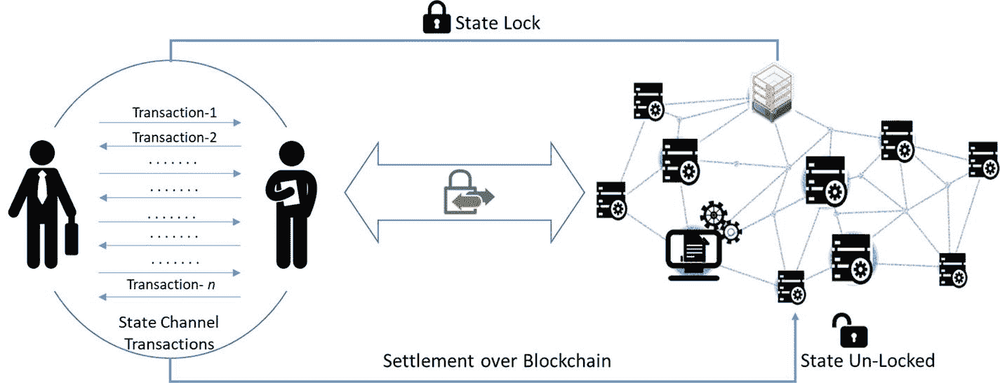
**图 2-28**
用于链下计算的状态通道

请注意，链下状态通道通常是私密的，并且仅限于一组参与者之间。请记住，第一步需要锁定参与者在区块链上的状态。这可以通过多重签名方案或基于智能合约的锁定来实现。锁定后，参与者之间进行密码学保护的交易。所有交易都经过密码学签名，使其可验证，并且这些交易不会立即提交到区块链。如前所述，这些状态通道可以预设生命周期，也可以根据交易量、交易次数或其他任何可量化指标来设定其存续范围。最终，交易的最终结果会在区块链上结算，并解锁状态，这是最后一步。

状态通道在不同的用例中可以有截然不同的实现方式，其具体实现实际上交由开发者决定。这无疑是前进的方向，也是区块链应用走向主流采纳最关键的核心组件之一。对于比特币而言，闪电网络就是为了实现链下计算并加速支付交易而设计的。类似地，“雷电网络”则是为以太坊区块链设计的。还有许多其他类似的开发项目，旨在使区块链网络上的微支付更快、更可行。

#### 区块链状态分片

分片是一种早已存在的可扩展性技术，也是数据库中备受关注的话题。人们在不同场景中以不同方式运用这一技术来解决特定的可扩展性挑战。在理解分片如何应用于区块链扩展之前，我们首先需要了解其含义。

当处理大规模数据集时，磁盘读写始终是性能瓶颈。通过将数据分散到多个磁盘上，读写操作可以并行执行，延迟显著降低。这种技术被称为分片。请参见图 2-29。

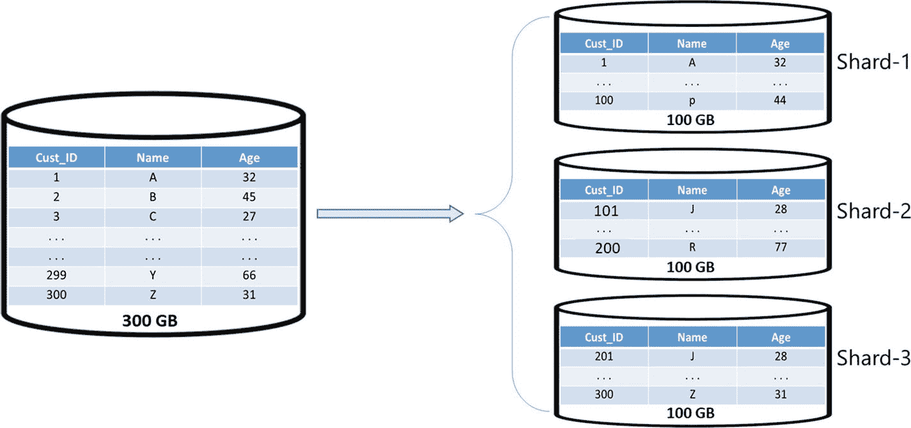
**图 2-29**
数据库分片示例

注意图 2-29 中如何通过水平分区将 300GB 的数据库表拆分为三个各 100GB 的分片，并存储在不同服务器实例上。同样的概念也适用于区块链——将整个区块链状态划分为包含各自子状态的不同分片。当然，这绝非像数据库分片那样简单地进行水平分区即可。

那么，分片在区块链中究竟如何运作？其核心理念是：节点无需下载并维护整个区块链的副本，只需下载与其相关的部分（分片）。这样一来，节点只需处理与所存储数据相关的交易，从而支持交易的并行执行。当交易发生时，它会被路由到受影响的特定分片节点。从另一个角度看，所有节点无需对每笔交易都进行全量计算和验证。当处理特定交易需要涉及多个分片时，可以定义分片间的通信机制或协议。请注意，不同区块链可能采用不同形式的分片技术。

举例来说，你可以针对特定场景选择合适的分片技术。例如，一种方案要求每个分片包含多个独立账户。换句话说，每个独立账户归属于某个分片（这更适用于以太坊这类有状态的区块链），同一分片内的账户之间极易进行交易。显然，要实现分片功能，还需要在分片级别进行额外的抽象提取，而节点仅需保存部分信息。

### 本章小结

在本章中，我们深入探讨了密码学、博弈论和计算机科学工程的核心基础原理。所学的概念将帮助你设计出满足特定需求的区块链解决方案。区块链绝非解决所有问题的银弹。然而，在真正需要区块链的场景下，很可能需要根据不同设计构造，采用不同风格的解决方案。

我们学习了多种用于保障交易安全的密码学技术，以及哈希函数的实用价值，探讨了如何利用博弈论设计稳健的解决方案，并掌握了区块链数据结构、默克尔树等计算机科学核心基础。部分概念附有示例代码片段，可助你快速上手区块链相关任务。

下一章，我们将学习比特币这一区块链应用案例及其具体运作原理。