# 比特币如何运作

多亏了比特币，区块链技术如今风靡一时！我们所熟知的区块链，是比特币及其发明者中本聪献给全世界的礼物。如果你好奇中本聪是谁，这是化名，背后是创建比特币的未知个人或团体。建议你无需追查发明者身份，而是理解并欣赏比特币背后精妙的技术。学习比特币的技术基础，将使你能够理解市场上其他区块链应用。

由于比特币多年来已证明了区块链技术的稳健性，人们如今对其充满信心，并开始探索其他可能的应用方式。上一章我们已经初步了解了区块链在技术层面的运作方式，但学习比特币能让你真正领略区块链的魅力。你可以将比特币视为区块链技术的一个加密货币应用案例。因此，本章不仅帮助你理解比特币的具体运作方式，还能让你了解如何像比特币一样，利用区块链技术构建不同的应用场景。

本章将详细讲解比特币，在此过程中，许多区块链基础原理也将通过更多实战视角得到阐明。如果你已熟悉比特币基础，可以跳过本章；否则，建议按顺序学习本章内容。本章将解释比特币是什么、其技术设计原理，并分析其固有的优势与不足。

## 货币的历史

你是否曾好奇货币是什么，以及它为何存在？货币主要是用于交换价值（即任何具有价值的事物）的媒介。它有其历史渊源。我们将快速回顾历史，以理解货币如何演变至我们今天所知的形态，以及比特币如何将其推向更高层次。

并非每个人都拥有一切。在远古时代，当没有货币概念时，人们仍然想出如何用自己过剩的物品去交换他人那里所需的东西。那就是物物交换的时代。用小麦换稻谷，或用橙子换柠檬，就是当时的交换系统。这固然不错，但如果拥有小麦的人需要药品，而对方却没有呢？例如：爱丽丝有小麦并需要药品，但鲍勃知道她认识有橙子的人，而鲍勃需要小麦。在这种情况下，交换就无法进行。因此，他们不得不寻找第三人——查理，他可能既需要橙子又有多余的药品。图 3-1 对此情景进行了图示说明。

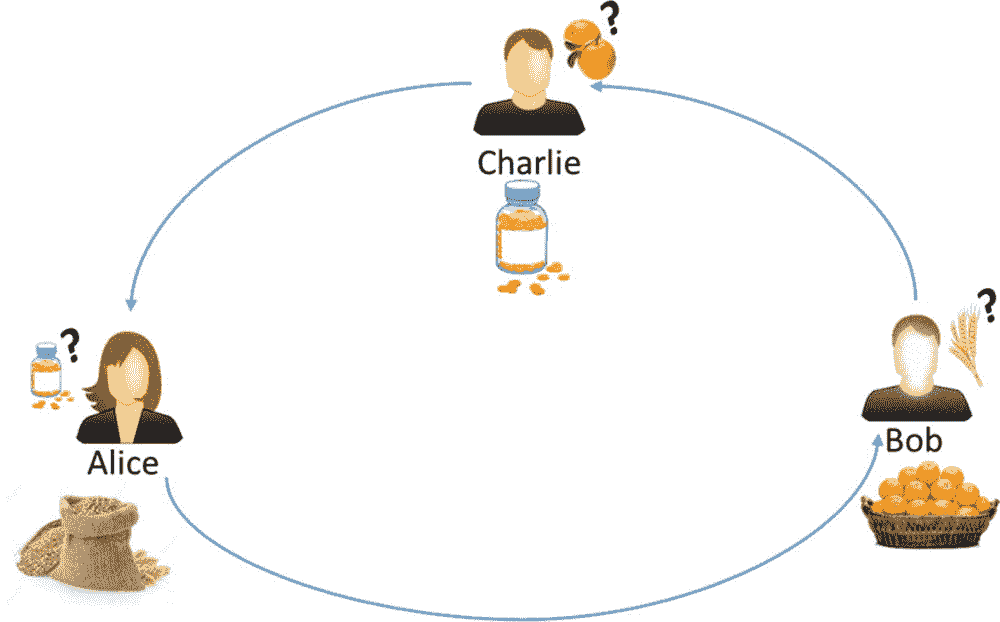

图 3-1 原始的物物交换系统

在之前的例子中，找到像查理这样能轻易契合这个难题的人总是很困难；这个问题必须得到解决。于是，人们开始思考一种商品化的价值交换体系。有一些物品是每个人都需要的，比如牛奶、盐、种子、羊等。这个系统几乎奏效了！但不久之后，人们意识到储存这类商品既不方便又困难重重。

最终，人们找到了更好的工具作为金融媒介，比如金属片。人们对稀有金属的重视程度远高于普通金属。黄金和白银因其不易腐蚀而位居榜首。随后，各国开始铸造带有官方印章的货币（不同重量的金属硬币）。虽然金属片和硬币比之前的系统更好，因为人们可以轻松储存和携带它们，但它们容易失窃。寺庙在此刻发挥了作用，因为人们信任它们，并坚信没人会从寺庙偷东西。祭司会给存入黄金的人一张收据，上面注明收到的黄金/白银数量，作为承认其存款的承诺，并保证在存户返回时将同等数量的金属归还给收据持有人。持有收据的人可以在市场上流通这张收据，以换取他们想要的东西。这就是我们银行体系的雏形。这种收据起到了法定货币的作用，而寺庙则扮演了人们信任的中心化银行角色。请参考图 3-2 来理解当时这个体系的运作方式。

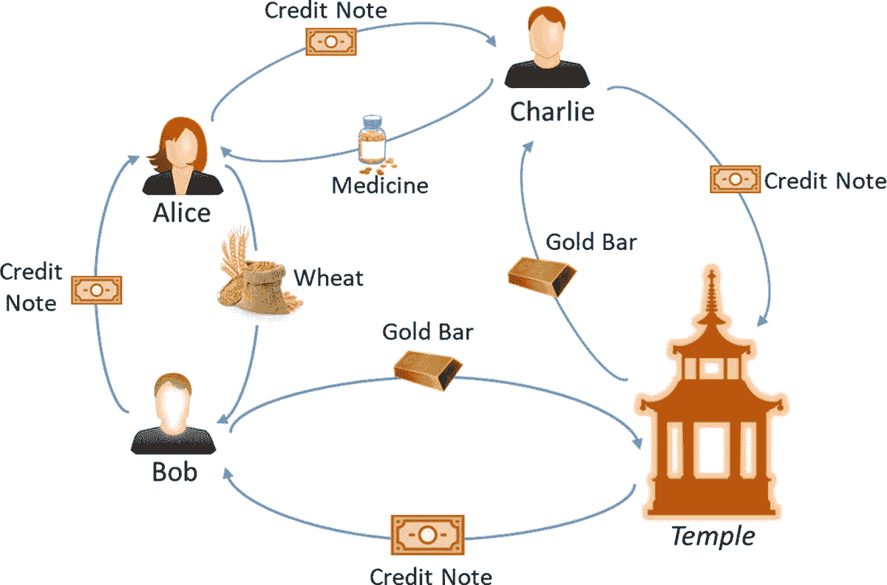

图 3-2 银行时代的开端

在上述体系中，货币总是由某种贵金属（如黄金或白银）支撑。即使在政府和银行取代了寺庙之后，这个体系依然延续。这就是商品货币如何进入市场，成为商品和服务价值交换的通用媒介。那个时代存在的任何货币都是由黄金/白银支撑的。

慢慢地，政府引入了“法定货币”作为法定偿还货币，这种货币不再由黄金或白银支撑。它纯粹基于信任，从某种意义上说，人们别无选择，只能信任政府。法定货币没有任何内在价值，它仅由政府的信用背书。今天，我们熟知的货币都是法定货币。因此，当今货币的价值取决于发行和使用该货币的司法管辖区内政府的稳定性和表现。这些纸币本身就是货币，银行里并没有比它更有价值的东西。这就是银行体系的状况，而与此同时，数字世界正在形成。

大约在 20 世纪 90 年代，互联网世界蓬勃发展，银行系统也开始数字化。由于法定货币仍存在一些不便之处（例如容易损坏和失窃），银行向人们保证可以转向数字化！这个时代甚至不再需要印刷纸币。货币变成了银行计算机系统中的数字。今天，如果每个账户持有人都去各自的银行，要求提取他们账户中相应金额的纸币，银行将陷入巨大的麻烦！全世界流通的真实货币总量与全球数字货币总量相比，简直是微不足道。

## 比特币的诞生

在第一章中，我们探讨了互联网革命的技术层面；在本章的前一部分，我们回顾了货币的演变。现在，我们应将两者结合起来，以理解中本聪设计比特币（一种加密货币）背后的视角。在本节及本文的其他部分，我们将尝试详细阐述中本聪在其比特币白皮书中的论述。

我们了解了寺庙，以及后来的政府和银行在从物物交换演变而来的货币体系中所扮演的角色。即使在今天，情况依然如此。如果你仔细审视这些体系，你会发现使这些体系稳定的关键因素是“信任”元素。人们曾经信任寺庙，后来信任政府和银行。今天，整个互联网商业都依赖于中心化的、可信的第三方来处理支付。尽管互联网被设计成点对点网络，但人们却在其上构建中心化系统，以延续旧有的做法。嗯，从技术上讲，考虑到 21 世纪初技术的成熟度，构建一个点对点系统是相当困难的。因此，交易成本、交易结算时间以及中心化带来的其他问题显而易见。实物货币则并非如此，因为交易即意味着结算。

是否存在一种由计算能力支撑的数字货币，就像黄金曾用来支撑流通货币一样？答案是“是的”，这要归功于中本聪的比特币。比特币的设计使得双方能够基于密码学证明进行电子支付，而非基于对中间第三方机构的信任。由于技术的进步，这在如今成为可能。在本章中，我们将看到中本聪如何在 2008 年结合密码学、博弈论和计算机科学工程原理来设计比特币系统。自 2009 年上线至今，该系统一直非常稳定且强大，足以抵御任何类型的网络攻击。它经受住了时间的考验，并确立了自己作为全球货币的地位。

### 什么是比特币？

区块链提供了一种加密货币：数字货币！正如我们可以在没有银行或其他中心化实体的情况下使用实体货币进行交易一样，比特币旨在促进无需可信中介的点对点货币交易。我们先来看看它是什么，然后在后续章节中再了解它的实际运作原理。比特币是一种去中心化的加密货币，不受任何国家限制，是一种全球性货币。它在技术、逻辑以及政治等各个方面都是去中心化的。当交易被验证时，新的比特币就会被挖出，并且最多只能产生 2100 万个比特币。大约要到 2140 年才能达到 2100 万个比特币的产量。任何拥有强大算力的人都可以参与挖矿并生成新的比特币。在所有比特币都被生成之后，就无法再铸造新的货币，只有流通中的比特币会被使用。请注意，比特币不像国家法定货币那样有固定的面额。根据设计，比特币可以具有任意价值，精度可达小数点后八位。因此，比特币的最小单位是 `0.00000001 BTC`，称为 `1 Satoshi`。

矿工通过挖矿交易来铸造新币，并赚取交易发起者愿意支付的交易手续费。当比特币总数达到 2100 万时，矿工将仅为了交易手续费而验证交易。如果有人试图发起一笔没有交易手续费的交易，它仍然可能被挖出，因为只要这是一笔有效的交易，并且矿工更关注能让他生成新币的挖矿奖励。

你是否好奇是什么决定了比特币的价值？当货币以黄金为支撑时，它具有重大意义，并且很容易根据金本位来评估其价值。当我们说比特币以人们用于挖矿的算力为支撑时，这还不足以理解它是如何获得价值的。这里需要一点经济学知识来理解。

当法定货币首次推出时，它是以黄金为支撑的。由于人们相信黄金，因此他们也相信法定货币。几十年后，货币不再以黄金为支撑，完全依赖于各国政府。人们继续相信它，是因为他们自己组建或参与组建了他们自己的政府。由于政府确保其价值，人们信任它，所以它获得了这种价值。在国际环境中，特定国家货币的价值取决于多种因素，其中最重要的是“供求关系”。请记住，一些大量印刷法定纸币的国家已经破产了；它们的经济崩溃了！必须保持平衡，而要理解这一点，需要更多的经济学知识，这超出了本书的范围。所以，我们现在还是回到比特币上来。

当比特币首次推出时，它并没有一个人们会相信的官方价格或价值。如果有人想用一些美元来出售它，我起初是绝对不会买的。渐渐地，随着交易的开始，它产生了价格，当时一个比特币甚至不值一美元。由于比特币是通过一个称为“挖矿”的竞争性、去中心化过程产生的，并且以固定的速率生成，总量上限为 2100 万个，这使得比特币成为一种稀缺资源。现在将这个背景联系回“供求关系”的游戏，比特币的价值开始膨胀。慢慢地，当全球开始相信它时，其价格甚至从几美元飙升至数千美元。比特币在用户、商家、初创公司、大型企业以及其他群体中的采用率正以前所未有的速度增长，因为它们被当作货币形式使用。因此，比特币的价值深受“信任”、“采用率”和“供求关系”的影响，其价格由市场决定。

那么，问题来了，为什么比特币的价值在撰写本文时如此波动，且起伏很大？一个显而易见的原因是供求关系。我们知道，流通中的比特币数量是有限的，只有 2100 万个，并且它们的生成速度随着时间的推移而下降。由于这种设计，供求之间总是存在差距，从而导致这种波动性。另一个原因是比特币从未在单一地点交易。全球有如此多的交易所，所有这些交易所都有自己的交易价格。你所看到的指数是从多个交易所收集比特币交易价格然后取平均值得到的。同样，由于所有这些指数并非从同一组交易所收集数据，因此它们之间也不匹配。类似地，流动性因素（即任何给定时间在整个市场中流动的比特币数量）也会影响比特币价格的波动性。目前，这绝对是一种高风险资产，但随着时间的推移可能会趋于稳定。让我们来看看以下可能影响比特币供求关系，从而影响其价格的因素列表：
- 人们对比特币的信心以及对不确定性的恐惧
- 媒体对比特币正面和负面消息的报道
- 一些人持有比特币但不允许其在市场流通，而另一些人则不断买卖以最小化风险。这就是比特币流动性水平不断变化的原因。
- 大型电商巨头对比特币的接受程度
- 特定国家对比特币的禁令

如果你现在想知道比特币是否存在完全崩盘的可能性，那么答案是“有”。世界上有很多国家的货币体系崩溃的例子。嗯，它们崩溃有政治和经济原因，例如恶性通货膨胀，但比特币并非如此，因为人们无法随心所欲地生成任意多的比特币，而且比特币的总数是固定的。然而，比特币存在技术或密码学层面失败的可能性。请注意，自 2008 年诞生以来，比特币已经经受住了时间的考验，并且它有可能随着时间的推移变得更大，但这无法保证！

### 使用比特币

开始使用比特币并不需要任何专业技术。你只需下载一个比特币钱包，然后就能开始使用了。当你在笔记本电脑或手机上安装并运行一个钱包时，它会生成你的第一个比特币地址（公钥）。不过，你可以生成更多地址，而且应该这么做。最佳实践是每个比特币地址只使用一次。虽然地址重复使用在比特币中是可行的，但这并非其设计初衷。重复使用地址会损害隐私和机密性。例如，如果你重复使用同一个地址，并用同一个私钥签署交易，接收方很容易就能可靠地判断出该地址属于你。如果同一个地址用于多笔交易，所有这些交易都能被追踪，找到你的身份就会变得更加容易。请记住，比特币并非完全匿名；它被认为是化名的，并且有一些方法可以追溯到交易源头，从而揭露其所有者。

你必须向愿意向你转账比特币的人透露你的比特币地址。这非常安全，因为公钥本来就是公开的。我们知道比特币中没有“期末余额”的概念，所有记录都以交易形式存在。比特币钱包可以轻松计算出其可花费余额，因为它们拥有接收交易时所用对应公钥的私钥。市面上有许多钱包提供商提供了各种各样的比特币钱包。有移动钱包、桌面钱包、基于浏览器的网页钱包、硬件钱包等等，其安全级别各不相同。在使用比特币时，你需要对钱包的安全性极度谨慎。比特币交易是不可逆的。

你一定想知道这些钱包有多安全。实际上，不同类型的钱包具有不同的安全级别，这取决于你打算如何使用它们。许多在线钱包服务都曾遭遇过安全漏洞。只要适用，启用双因素认证总是一个好习惯。如果你经常使用比特币，一个不错的做法是在钱包里存放少量资金，并将剩余资金单独存放在一个安全的环境中。不连接网络的离线钱包或冷钱包能为储蓄提供最高级别的安全保护。此外，为了避免丢失电脑/手机，你应该为你的钱包设置适当的备份机制。请记住，如果你丢失了私钥，你就会丢失与它相关的所有资金。

如果你没有作为运行全节点的矿工加入比特币网络，那么你只能成为比特币的用户或交易者。你肯定需要一个交易所，在那里你可以用美元或交易所接受的其他货币购买一些比特币。你应该优先从合法且安全的交易所购买比特币。有许多交易所遭受安全漏洞的例子。

## 比特币区块链

我们已经在上一章中介绍了基本的区块链数据结构，并涵盖了区块链数据结构的基本构建块，例如哈希技术和非对称加密。我们将在此部分学习比特币区块链的具体细节。

比特币区块链与其他任何区块链一样，具有相似的区块链数据结构。比特币核心客户端使用谷歌的 `LevelDB` 数据库在内部存储区块链数据结构。每个区块通过其哈希值（比特币使用 `SHA256` 哈希算法）来标识。每个区块的头部都包含前一个区块的哈希值。请记住，这个哈希不仅仅是前一个区块头的哈希，而是包括头部在内的整个区块的哈希，并且这个链条一直追溯到创世区块。创世区块是任何区块链的起点。典型的比特币区块链如图 3-3 所示。

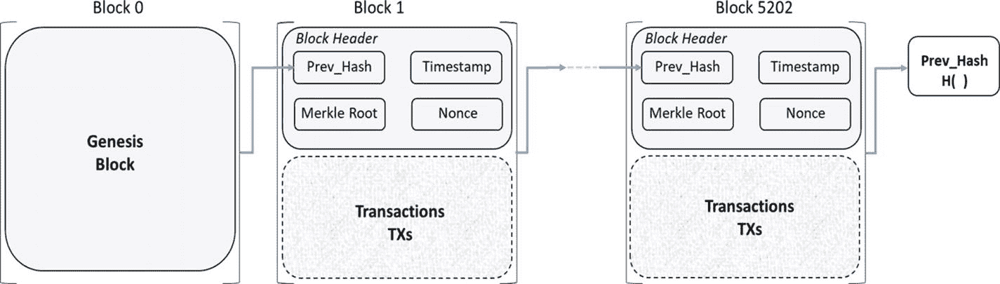

图 3-3 比特币区块链

正如你在这个区块链中看到的，每个区块都有一个包含头部信息的区块头部分，以及一个主体部分，其中打包了该区块的所有交易。每个区块的头部都包含前一个区块的哈希值。因此，更改链中任何一个区块都不会那么容易；所有后续区块都必须相应地进行更改。例如：如果有人试图更改之前记录在，比如说，第 441 号区块中的一笔交易，在更改交易后，第 442 号区块头部中包含的该区块（第 441 号）哈希值将不匹配，因此也必须进行更改。用新的哈希值更改头部后，你还需要更新序列中下一个区块（即第 443 号区块）头部中的哈希值，这个过程将一直持续到当前区块，这是一项艰巨的工作。当我们知道每个节点都有自己的副本，并且入侵所有节点（或至少 51% 的节点）是不可行的时候，这几乎变得不可能。

在区块链中，只有一条通往创世区块的真实路径。然而，如果你从创世区块开始，则可能出现分叉。当两个区块同时被提出并且两者都是有效的时，只有一个会成为真实链的一部分，另一个则成为孤块。每个节点都建立在最长的链上，并且无论它先听到哪个，哪个链最终成为最长链，它就会在那个链上继续构建。这种情况可以如图 3-4 所示。

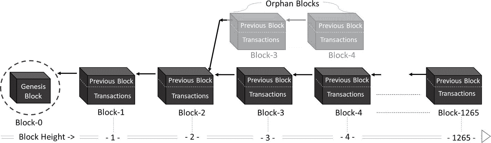

图 3-4 真实区块链中的孤块

观察图 3-4，在区块高度 3 处，有两个区块被提议作为第 3 号区块，但只有其中一个能成功进入最终的区块链，其余的被遗弃成为孤块。很明显，在某个特定的区块高度，可能存在一个或多个区块，因为在这个高度也可能存在一些孤块，所以区块高度并不是唯一识别区块的最佳方式，而区块哈希值才是正确的方法。

### 区块结构

比特币区块链的区块结构对所有区块都是固定的，并包含特定的字段及其对应的必需数据。请查看图 3-5（区块结构的鸟瞰图），稍后我们将在本章中进一步了解各个字段。

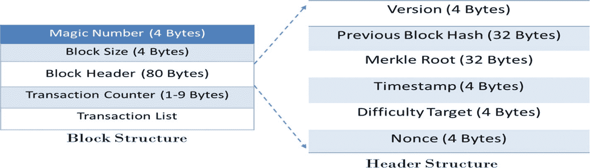

图 3-5 比特币区块链的区块结构

典型的区块结构如表 3-1 所示。

**表 3-1 区块结构**

| 字段 | 大小 | 描述 |
| --- | --- | --- |
| `魔数` | 4 字节 | 固定值为 `0xD9B4BEF9`，表示区块的起始，并表明该区块来自主网或生产网络。 |
| `区块大小` | 4 字节 | 表示区块的大小。最初的比特币区块大小为 `1MB`，而名为“比特币现金”的较新版本区块大小为 `2MB`。 |
| `区块头` | 80 字节 | 包含大量信息，例如前一个区块的哈希值、随机数、默克尔根等。 |
| `交易计数器` | 1–9 字节（可变长度） | 表示区块中包含的交易总数。并非每笔交易的大小都相同，每个区块中的交易数量也是可变的。 |
| `交易列表` | 数量可变但大小固定 | 列出给定区块中发生的所有交易。根据区块大小（`1MB` 或 `2MB`），该字段占据区块中的剩余空间。 |

现在，让我们聚焦（表 3-2）区块中的“区块头”部分，了解它所维护的各种不同字段。

**表 3-2 区块头组成**

| 字段 | 大小 | 描述 |
| --- | --- | --- |
| `版本号` | 4 字节 | 表示比特币协议的版本号。理想情况下，运行比特币协议的每个节点都应具有相同的版本号。 |
| `前一个区块哈希值` | 32 字节 | 包含链中前一个区块头的哈希值。当前一个区块头中的所有字段合并并使用 `SHA256` 算法进行哈希处理后，会产生一个 256 位（即 32 字节）的结果。 |
| `默克尔根` | 32 字节 | 区块中交易的哈希值按设计构成一棵默克尔树，默克尔根就是这棵默克尔树的根哈希值。如果区块中的一笔交易被修改，那么计算出的结果将与默克尔根不匹配。这种方式确保了仅保存前一个区块头的哈希值就足以维护安全的区块链。此外，默克尔树有助于在 `O(n)` 时间内判断一笔交易是否属于某个区块，并且速度相当快！ |
| `时间戳` | 4 字节 | 比特币网络中不存在全局时间概念。因此，该字段以 `Unix` 时间格式表示区块创建的近似时间。 |
| `难度目标` | 4 字节 | 该区块被挖出时为其设定的工作量证明（`PoW`）难度级别。 |
| `随机数` | 4 字节 | 挖矿过程中满足工作量证明（`PoW`）难题的随机数。 |

前面表格中展示的区块字段及其相应解释足以让我们入门，我们还将进一步探究少数几个需要更详细解释的字段。

# 默克尔树

我们在前一章已经介绍了默克尔树的概念。在本节中，我们将仅探讨比特币如何使用默克尔树。比特币区块链中的每个区块都包含所有交易的哈希值，而这些交易的默克尔根则包含在该区块的区块头中。从真正意义上讲，当我们说每个区块头包含整个前一个区块的哈希值时，其信任基础在于它仅包含前一个区块头的哈希值。尽管如此，这已经足够了，因为区块头已经包含了默克尔根。如果区块中的一笔交易被篡改，默克尔根将不再匹配，这种设计仍然保持了区块链的完整性。

默克尔树是一种交易哈希值的树形数据结构。默克尔树中的“叶节点”实际上代表交易的哈希值，而树的根就是默克尔根。请参考图 3-6。

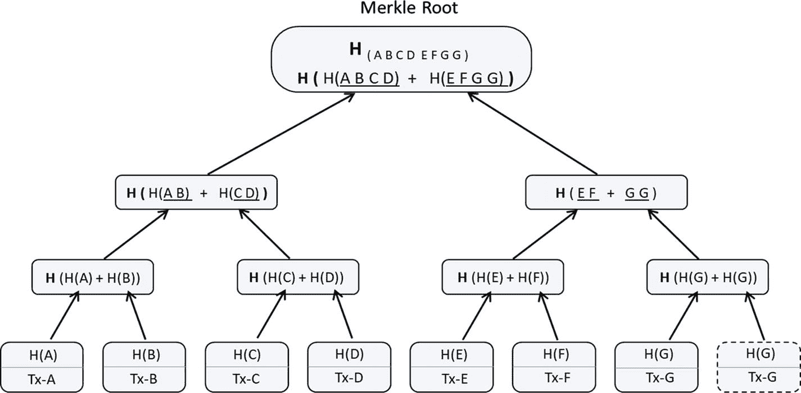

图 3-6 默克尔树表示

请注意，七笔交易 A、B、C、D、E、F 和 G 的哈希值构成了树的叶节点。由于有七笔交易，但在二叉树中总叶节点数应为偶数，因此最后一个叶节点被重复。每个 32 字节（即 256 位）的交易哈希值是通过对交易应用两次 `SHA256` 计算得出的。类似地，两个交易的哈希值连接起来（62 字节），然后使用 `SHA256` 进行两次哈希运算，得到 32 字节的父哈希值。

只需交易对应的默克尔路径就足以验证该交易是否属于某个区块，因此效率相当高。因此，实际的区块链可以如图 3-7 所示。

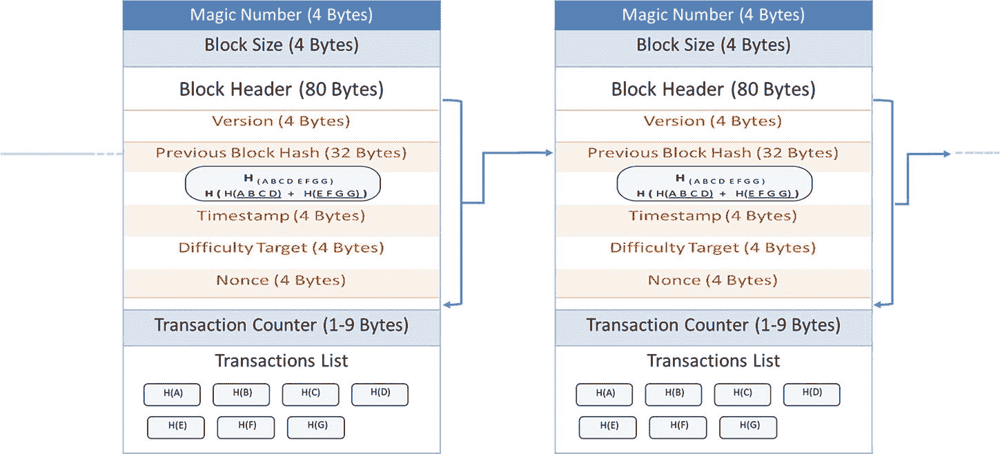

图 3-7 默克尔树表示

# 难度目标

难度目标是驱动比特币工作量证明（PoW）的关键。其核心思想是：当一个区块填满了有效交易后，需要计算该区块头部的哈希值，使其小于同一头部中的难度目标。头部中的随机数 `nonce` 从零开始。矿工必须不断递增这个 `nonce` 并对头部进行哈希运算，直到哈希值小于目标值。

头部中四个字节（32 位）的难度位定义了该区块被挖出所需的目标值（256 位）。需要找到这样一个 `nonce`，使得整个区块头部的哈希值小于目标值。请记住，目标值越低，找到小于该值的头部哈希就越困难。由于比特币使用 `SHA256` 算法，每次计算区块头部的哈希时，输出结果都是介于 `0` 和 `2²⁵⁶` 之间的任意一个数，这个数字相当巨大。如果使用你的 `nonce` 计算出的哈希值小于目标值，则该区块将被整个网络接受；否则，你必须尝试另一个 `nonce`，直到满足条件。至此，我们仍未明确难度目标是如何根据每个头部中的难度位计算出来的。

目标值可以根据头部中四个字节（八个十六进制数）的难度位，通过一个预设的公式推导出来。每个节点在安装时都默认附带了这个公式（因为它随二进制文件一同提供）。以下是计算难度的公式：

```
target = coefficient * 2^(8 * (exponent – 3))
```

请注意，这个公式中包含“系数”（coefficient）和“指数”（exponent）项，它们都包含在四个字节的难度位中。我们举一个例子来更好地说明这一点。如果四个字节的难度位以十六进制表示为 `0x1b0404cb`，那么前两个十六进制数字构成指数项，即 `0x1b`，剩余部分构成系数项，即 `0x0404cb`。将这些值代入目标公式求解：

```
target = 0x0404cb * 2^(0x08 * (0x1b – 0x03))
target = 0x00000000000404CB000000000000000000000000000000000000000000000000
```

比特币的设计目标是每生成 2,016 个区块需要花费两周时间。计算一下，平均每个区块的产生时间约为十分钟。在这个异步网络中，要想通过现有的 PoW 机制精确编程实现每个区块都耗时十分钟是非常困难的。实际上，这只是一个区块的平均时间，一个比特币区块可能在一分钟内生成，也可能需要 15 分钟才能生成。因此，难度的设计会根据生成 2,016 个区块是小于还是大于两周时间而相应增加或减少。生成 2,016 个区块所需的时间可以通过每个区块头部时间戳字段中的时间计算得出。假设生成 2,016 个区块花费了 `T` 时间（这个时间绝不会恰好是两周），那么每个区块的难度目标就会乘以（`T / 2 周`）。因此，如果 `T` 小于两周，[难度目标 × (`T / 2 周`)]的结果就会增大；反之则会减小。

由此可见，难度目标是可以调整的，可以根据之前所述的情况设置得更难或更易。你可能会想，在去中心化的系统中，是谁在调整这个难度呢？有一个经验法则你必须始终牢记：在这种去中心化设计中，任何操作都必须在每个节点上独立进行。每经过 2,016 个区块，所有节点都会各自独立计算新的难度目标值，并且它们得出的结论是一致的，因为已经为此定义了一个公式。以下是该公式的再次表述：

```
新目标 = 旧目标 * (T / 2 周)
= 新目标 = 旧目标 * (生成 2016 个区块所花费的时间（秒） / 1,209,600 秒)
```

**注意：** 诸如 2,016 个区块和两周（1,209,600 秒）的 `TargetTimespan` 等参数，在 `chainparams.cpp` 文件中定义如下：

```
consensus.nPowTargetTimespan = 14 * 24 * 60 * 60; // 两周
consensus.nPowTargetSpacing = 10 * 60;
consensus.nMinerConfirmationWindow = 2016; // nPowTargetTimespan / nPowTargetSpacing
```

请注意，这里是（`T / 2 周`），而不是（`2 周 / T`）。其目的在于，当需要增加挖矿难度、从而花费更多时间时，就降低难度目标值。目标哈希值越小，找到小于该值的哈希就越困难。例如：如果挖出 2,016 个区块花费了十天时间，那么（`T / 2 周`）就是一个分数，这个分数与“旧目标”相乘后，会进一步降低“新目标”的值，使其小于旧值。这将使得找到合适哈希更加困难，需要更多时间。这就是区块平均生成时间维持在十分钟的原理。想象一下，如果难度目标是固定的且不可调整的，你认为会出现什么问题？请记住，随着更强大的计算机被用于区块挖矿，硬件的计算能力会随时间推移而增长。如果同时有 10 个、100 个甚至 1,000 个区块被提出，这对于网络的正常运行来说是不可取的。因此，其理念是，即使越来越多强大的计算节点加入比特币网络，通过调整难度目标，提出一个区块所需的平均时间仍然应该保持在十分钟。此外，矿工提出区块的几率取决于他们拥有的算力与所有矿工总全球算力之比。

你是不是在想，为什么是十分钟，而不是 12 分钟？或者为什么不是六分钟？请记住，在去中心化的异步系统中，所有节点需要一定的时间间隔才能达成共识。如果没有时间间隔，大量区块会仅以微小的延迟接踵而至，相比交易链，区块链也就没有优化优势可言了。每一笔交易是一次广播，每一个新区块也是一次广播。此外，区块链为系统带来的有序性，在交易链中是很难实现的。借助区块的概念，可以将来自任意发送方到任意接收方的无关交易包含在同一个区块中，这在交易链中是难以维护的。一个有效的区块广播，比验证后逐个广播交易要高效得多。现在回到十分钟的讨论，它完全可以少一点或多一点，但两个连续区块之间必然存在一定的时间间隔。设想你是一名矿工，正在挖编号为 4567 的区块，但另一个矿工运气更好，率先提出了编号为 4567 的区块，而你正在解决密码学难题时收到了这个区块。你现在要做的就是验证这个区块，如果它有效，就将其添加到本地区块链副本中，并立即开始挖掘编号为 4568 的区块。你肯定不希望自己刚验证完区块 4567（由于网络延迟，你收到此区块的时间比其他矿工稍晚），就发现别人已经提出了区块 4568。那么问题来了：这十分钟是不是最佳选择？嗯，很难用一个词来解释，但十分钟的时间间隔解决了由于异步网络、时间延迟、数据包丢失、系统容量等带来的诸多问题。有可能可以进一步优化到比如五分钟左右，你可以在许多新的加密货币和其他区块链应用案例中看到这一点。

# 创世区块

如下列代码所示，第一个区块（即区块 0）被称为创世区块。请记住，创世区块必须被硬编码到区块链应用程序中，比特币也是如此。你可以将其视为一个特殊区块，因为它不包含任何对先前区块的引用。比特币的创世区块创建于 2009 年其诞生之时。如果你打开比特币核心，特别是 `chainparams.cpp` 文件，就会看到创世区块是如何被静态编码的。通过使用比特币核心的命令行引用，你可以使用创世区块的哈希值进行查询，从而获得相同的信息，如下所示：

```
$ bitcoin-cli getblock 000000000019d6689c085ae165831e934ff763ae46a2a6c172b3f1b60a8ce26f
```

```
{
"hash" : "000000000019d6689c085ae165831e934ff763ae46a2a6c172b3f1b60a8ce26f",
"confirmations" : 308321,
"size" : 285,
"height" : 0,
"version" : 1,
"merkleroot" : "4a5e1e4baab89f3a32518a88c31bc87f618f76673e2cc77ab2127b7afdeda33b",
"tx" : ["4a5e1e4baab89f3a32518a88c31bc87f618f76673e2cc77ab2127b7afdeda33b"],
"time" : 1231006505,
"nonce" : 2083236893,
"bits" : "1d00ffff",
"difficulty" : 1.00000000,
"nextblockhash" : "00000000839a8e6886ab5951d76f411475428afc90947ee320161bbf18eb6048"
}
```

上述命令的输出结果：如果你将上述输出中的 Unix 时间戳进行转换，将会得到以下日期时间信息：2009 年 1 月 3 日星期六 23:45:05。你也可以从网站 `https://blockchain.info` 获取相同的信息。只需导航到该网站，将哈希值粘贴到右上角的搜索框中，然后按“回车”键。你将看到以下内容（表 3-4）。

**表 3-4 哈希信息**

| 哈希值 |
| --- |
| 哈希 | `000000000019d6689c085ae165831e934ff763ae46a2a6c172b3f1b60a8ce26f` |
| 前一个区块 | `0000000000000000000000000000000000000000000000000000000000000000` |
| 后一个区块 | `00000000839a8e6886ab5951d76f411475428afc90947ee320161bbf18eb6048` |
| 默克尔根 | `4a5e1e4baab89f3a32518a88c31bc87f618f76673e2cc77ab2127b7afdeda33b` |

**表 3-3 交易信息**

| 摘要 |
| --- |
| 交易数量 | 1 |
| 输出总额 | 50 BTC |
| 预计交易量 | 0 BTC |
| 交易费用 | 0 BTC |
| 高度 | `0` (主链) |
| 时间戳 | 2009-01-03 18:15:05 |
| 接收时间 | 2009-01-03 18:15:05 |
| 中继方 | 未知 |
| 难度 | 1 |
| 目标值 | 486604799 |
| 大小 | 0.285 kB |
| 权重 | 0.896 kWU |
| 版本 | 1 |
| 随机数 | 2083236893 |
| 区块奖励 | 50 BTC |

在这个区块 0 中，只有一笔交易，即一笔 Coinbase 交易。Coinbase 交易是矿工获得的交易。此类交易没有输入，它们只能生成新的比特币。如果你查看与此区块关联的交易，其显示方式如下所示（图 3-8）。

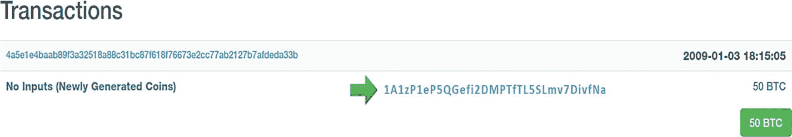

图 3-8 区块 0 中的 Coinbase 交易

# 比特币网络

如前所述，比特币网络是一个点对点网络。在此类系统中，没有中心化服务器，每个节点都受到平等对待。在这样的系统中，没有主从现象，也没有层级结构。由于它运行在互联网上，因此使用了相同的 TCP/IP 协议栈，如图 3-9 所示。

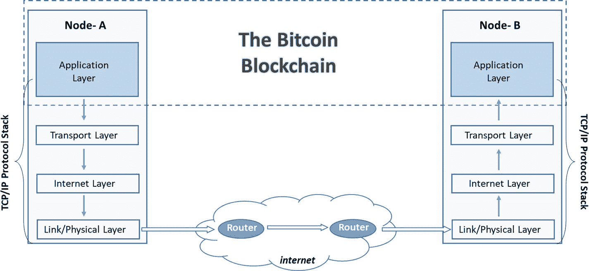

图 3-9 互联网上的比特币区块链网络

上图显示了比特币网络如何在相同的互联网协议栈上共存。比特币网络是高度动态的，节点可以随意加入和离开网络，系统仍然可以工作。此外，尽管比特币网络本质上是异步的，并且存在网络延迟和数据包丢失，但该系统非常稳健——这要归功于比特币的设计！

比特币网络是一个去中心化网络，没有单点故障，也没有中央权威机构。采用这种设计，你将如何评估比特币网络的规模？由于节点可以随意加入和离开，因此没有恰当的方法来估算。然而，人们尝试对比特币网络进行研究，一些人声称网络中始终有接近 10,000 个节点保持连接，同时可能有数百万个节点在运行。

比特币网络中的每个节点在权限上是平等的，并且具有扁平结构，但节点可以是全节点或轻量级节点。全节点几乎可以执行比特币系统中的所有允许活动，例如挖掘交易和广播交易，并且可以提供钱包服务。全节点还提供路由功能，以参与和维护比特币网络。要成为全节点，你必须下载包含迄今为止发生的所有交易的整个区块链数据库。此外，该节点必须永久连接到比特币网络并监听所有发生的交易。拥有良好的网络连接、良好的存储空间（至少 200GB）以及至少 2GB 的专用 RAM 非常重要。随着时间的推移，此要求可能会进一步变化，并需要更多资源。

另一方面，轻量级节点无法挖掘新区块，但可以通过使用简化支付验证来验证交易。它们也被称为“瘦客户端”。比特币网络中的绝大多数节点都是 SPV 节点。它们也可以参与矿池挖矿，其中有许多节点共同尝试挖掘新区块。轻量级节点可以帮助全节点验证交易。SPV 的一个很好的例子是钱包（客户端）。如果你正在运行一个钱包，并且有人向你汇款，你可以作为比特币网络中的一个节点，下载与你相关的交易，以便你可以检查向你发送比特币的人是否确实拥有它们。

需要注意的是，SPV 的安全性不如完全验证节点，因为它通常只包含区块头，而不是整个区块。因此，SPV 无法验证交易，因为它没有某个区块的交易记录，而且除了自己的交易外，它也没有所有未花费的交易输出。

## 新节点的网络发现

现在思考一下，当一个新节点想要加入网络时，它是如何联系到该网络的？它并不是一个 `192.168.1.X` 这样的内网，你可以向 IP `192.168.1.255` 广播，让 `192.168.1.X` 网络内的所有计算机都能收到广播消息。网络交换机被设计为允许此类广播数据包。但请记住，我们谈论的是互联网，而比特币正运行于其上。如果你在伦敦运行一个节点，那么很有可能在伦敦、俄罗斯、爱尔兰、美国和印度还有其他节点，它们都通过互联网使用公共 IP 地址连接在一起。

这里的问题是，当一个全新节点加入网络时，它如何找出对等节点？并没有一个中心服务器像典型的基于互联网的 Web 应用那样来响应它们的请求。区块链是去中心化的，还记得吗？首次启动时，`Bitcoin Core` 或 `BitcoinJ` 程序没有任何全节点的 IP 地址。因此，它们配备了多种方法来寻找对等节点。其中一种方法是 DNS 种子。多个 DNS 种子被硬编码在其中。此外，DNS 系统中还维护着几个主机名，这些主机名解析为一组运行比特币节点的 IP 地址列表。DNS 种子由比特币社区成员维护。一些社区成员通过手动输入 IP 地址和端口号来提供静态 DNS 种子。同时，一些社区成员提供动态 DNS 种子服务器，这些服务器可以自动获取在默认比特币端口（主网为`8333`，测试网为`18333`）上运行的活动比特币节点的 IP 地址。如果你对 DNS 种子执行 `NSLOOKUP` 查询，你会得到一堆运行比特币节点的 IP 地址。

客户端（`Bitcoin Core` 或 `BitcoinJ`）也维护着一个硬编码的 IP 地址列表，这些地址指向一些（不是单个！）稳定的比特币节点。这类节点可以称为引导节点，其端点已经包含在源代码中。每次下载二进制文件时，都会随二进制文件一起下载一份最新的活动节点列表。一旦建立了比特币节点连接，就很容易拉取当前时间点活跃的其他比特币节点列表。新节点如何成为网络一部分的图示，可以在下图中找到。

### 第一步
假设在某个时间点，比特币网络中有六个活跃节点。请参考图 3-10。

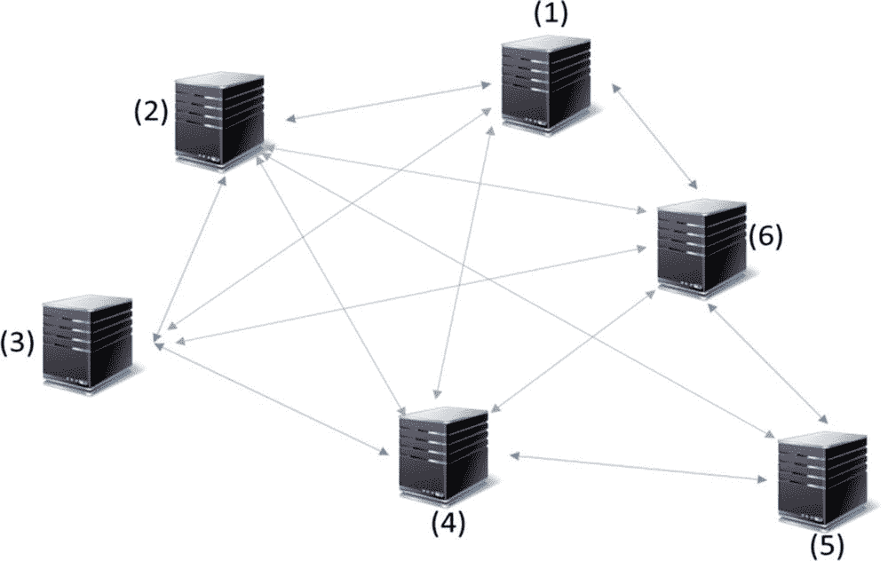

`图 3-10` – 通用比特币网络

### 第二步
有一个新节点，假设是第七个节点，它刚刚出现并试图加入现有的比特币网络，但尚未建立任何连接。请参考图 3-11。

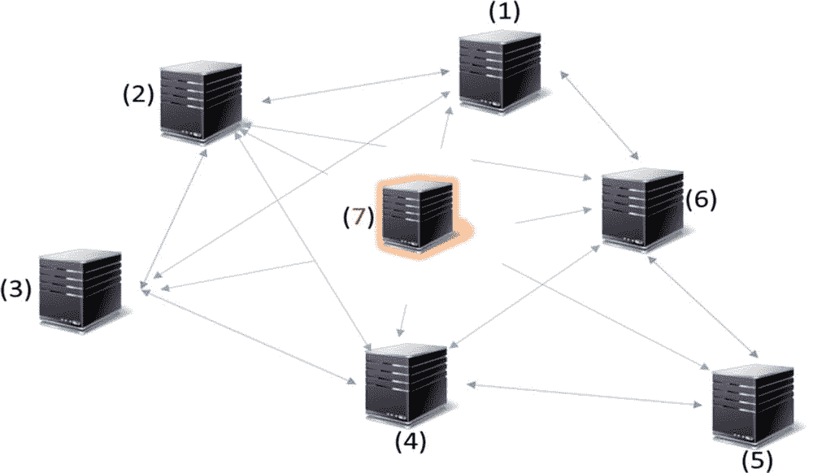

`图 3-11` – 尝试加入网络的新节点

### 第三步
第七个节点将尝试联系尽可能多的节点，要么使用 DNS 种子，要么使用其列表中已有的稳定比特币节点列表——如图 3-12 所示。


`图 3-12` – 新比特币节点联系一些对等节点

在图中，我们跳过了 DNS 解析部分。这与你在浏览器中输入网站名称、DNS 解析后获取 IP 地址的过程相同，该 IP 地址随后被用作目标 Web 服务器的地址，用于发送 TCP 数据包。为了连接到一个新的对等节点，该节点会在端口 `8333` 上建立一个 TCP 连接（端口 `8333` 是比特币的知名端口，但也可能不同）。然后，两个节点通过交换版本号、时间、IP 地址、区块链高度等信息进行握手。在 `net.cpp` 中定义的 “Version” 消息的实际比特币代码如下：

```
PushMessage( "version", PROTOCOL_VERSION, nLocalServices, nTime, addrYou, addrMe,
nLocalHostNonce, FormatSubVersion(CLIENT_NAME, CLIENT_VERSION,
std::vector<string>()), nBestHeight, true );
```

通过这条 `Version` 消息，会检查两个节点之间的兼容性，这是进一步通信的第一步。

### 第四步
在第四步中，被请求的节点将以其所知的其他活跃比特币节点的 IP 地址和对应端口号列表作为响应。请注意，某些活跃节点可能在任何时候都不知道网络中的每一个比特币节点。端口号很重要，因为一旦 TCP 数据包到达目标节点，操作系统就会使用端口号将消息定向到系统上运行的正确应用程序或进程。请参考图 3-13。


`图 3-13` – 对等比特币节点响应新节点的网络请求

请注意，可能只需要一个对等节点就足以引导节点连接到比特币网络；但节点必须继续发现并连接新的对等节点。这是因为节点随时可能加入或离开，没有哪个连接是可靠的。

### 第五步
在第五步中，新的第七个节点会根据从上一步骤中联系到的节点那里收到的列表，与所有可到达的比特币节点建立连接。图 3-14 展示了这一过程。

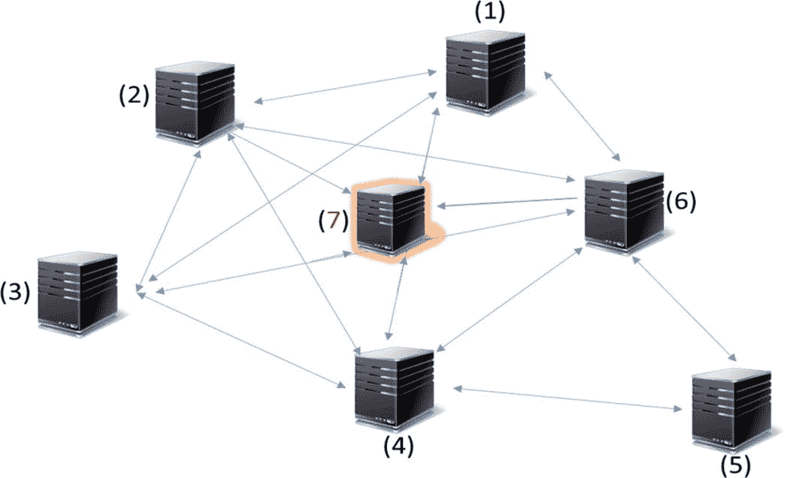

`图 3-14` – 新节点成为比特币网络的一部分

## 比特币交易

比特币交易是比特币系统的基本构建模块。比特币交易大致可分为两大类：

- **Coinbase 交易（铸币交易）**：比特币区块链中的每个区块都包含一笔由矿工自己打包的 Coinbase 交易，用于开采新币。矿工无法控制每个区块能挖到多少新币，因为这一数量由网络本身控制。初始时每区块奖励为 50 BTC，此后每 210,000 个区块减半一次，直至比特币总量达到 2100 万枚。
- **普通交易**：普通交易与一般的货币兑换非常相似，即某人试图将自己拥有的部分金额转移给他人。在比特币中，一切都以交易形式呈现。要花费一定金额，必须消耗其先前收到该金额的交易——这些就是比特币中的普通交易。本章将重点讨论这类普通交易。

每个比特币持有者可以通过对之前收到比特币的交易哈希（与接收者的公钥一起）进行数字签名，将币转移给他人。收款方或接收者已经拥有付款方的公钥，因此他们可以验证交易。下图（图 3-15）来自中本聪的白皮书，直观地展示了这一过程。

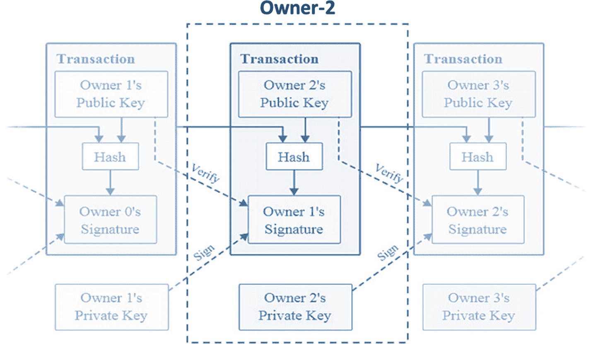

`图 3-15` 比特币交易

请注意图中高亮显示的 `Owner-2`（所有者 2）部分。由于 `Owner-1`（所有者 1）正在发起这笔交易，他使用自己的私钥对两项内容的哈希进行签名：一是他自己先前收到金额的那笔交易，二是 `Owner-2` 的公钥。该签名可以很容易地使用 `Owner-1` 的公钥进行验证，以确保这是一笔合法交易。类似地，当 `Owner-2` 要向 `Owner-3` 发起转账时，他会使用自己的私钥对先前交易（即他从 `Owner-1` 收到的那笔）的哈希以及 `Owner-3` 的公钥进行签名。网络中任何节点都可以并且将会验证这类交易。显然，由于每笔交易都会被广播，大多数节点都拥有完整的交易历史，从而能够防止双重支付尝试。

比特币网络中没有"期末余额"的概念，一个人持有的总金额是其拥有的所有公开地址收到的全部传入交易的总和。你可以创建任意数量的公开地址。如果你有十个公开地址，那么无论哪些交易发送到这些地址，你都可以使用自己的私钥来花费这些交易（即未花费的交易，或 `UTXO`）。假设你需要花费 5 个比特币，那么你有以下几种选择：

- 使用之前收到 5 个或更多比特币的其中一笔交易。向接收者转移 5 个比特币，支付一定数额作为交易费，剩余部分转回给自己。参见图 3-16。

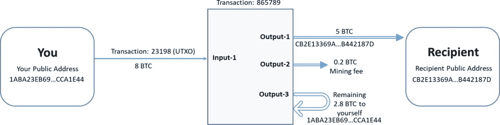

`图 3-16` 单笔交易输入的比特币交易

- 使用你收到的多笔先前交易，这些交易金额总和超过 5 个比特币。向接收者转移 5 个比特币，支付一定数额作为交易费，剩余部分转回给自己。参见图 3-17。

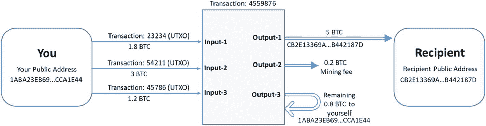

`图 3-17` 多笔交易输入的比特币交易

如你所见，每笔交易都以之前的某笔（或多笔）交易作为输入。系统不会维护一个账户说"你有 8 BTC，你可以花费不超过这个金额的任何数额"；如果你花费 5 BTC，剩余余额就是 3 BTC。在比特币中，一切皆为交易，交易有输入和输出。如果某笔输出尚未被花费，该输出就是 `UTXO`。

我们知道，网络中的每笔交易都会被广播到整个网络。无论某人是否运行节点，他们都可以发起一笔交易，该交易会被发布到所有可访问的比特币节点。接收比特币的节点会进一步将交易广播给其他节点，整个网络通常会被交易信息"淹没"。这种机制有时被称为八卦协议（Gossip Protocol），它在防止双重支付攻击中起着重要作用。回顾第 2 章内容，防止双重支付的唯一方法就是了解所有交易。

每个节点都会维护一个其所听闻的所有交易的集合，并且只广播那些尚未在列表中的新交易。节点会一直保留这些交易，直到该交易被打包进区块并成为区块链的一部分。这是因为，即使某个区块包含所有有效交易并被提议为有效区块，它仍可能因未成为最长链的一部分而被孤立。一旦确认该区块已成为最长链的一部分，该区块中的交易便会从交易列表中移除。比特币网络中的每个全节点都必须维护整个未花费交易列表（`UTXO`），即使它们数量高达数百万。如果某笔交易存在于 `UTXO` 列表中，那么它就不太可能是双重支付尝试。在确认某笔交易不是双重支付攻击，并从其他角度验证交易有效后，节点会广播该交易。如果你在想，在数百万个 `UTXO` 中搜索以检查双重支付会有多快——你问对方向了。由于交易输出按其哈希值排序，在有序的哈希列表中搜索条目是非常快的。

现在，让我们深入思考并探索双重支付场景。完全有可能出现 Alice (A) 试图用同一笔交易同时支付给 Bob (B) 和 Charlie (C) 的情况（交易的输入是一笔前序交易，不存在期末余额的概念）。这种场景如图 3-18 所示。

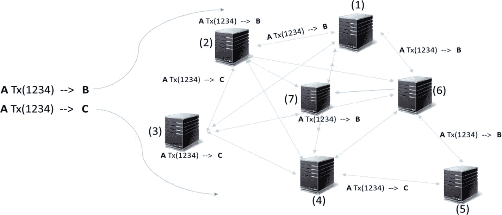

`图 3-18` 比特币网络中的双重支付交易场景

请注意图中所示的以下情况：

- A 试图将同一笔交易同时支付给 B 和 C。
- 节点 2 收到了交易 `A Tx(1234) --> B`，节点 3 收到了交易 `A Tx(1234) --> C`。
- 对于节点 2 和节点 3，各自收到的交易都是合法的。
- 当节点 3 试图将交易 `A Tx(1234) --> C` 广播给节点 2 时（每个节点都会广播新交易），节点 2 会拒绝此交易，因为它已经拥有一个具有相同输入交易 `Tx(1234)` 的交易 `A Tx(1234) --> B`。
- 其他节点也会发生类似情况，它们要么持有交易 `A Tx(1234) --> B`，要么持有交易 `A Tx(1234) --> C`，具体取决于哪个交易先到达它们，但不会同时持有两者。
- 在挖矿过程中，无论哪个节点获得提议区块的权利，都会将其持有的交易包含在内。这笔交易将成为区块链的一部分，而其他持有另一笔交易的节点则会直接丢弃涉及 `Tx(1234)` 的交易，因为它将不再是 `UTXO`。

## 共识与区块挖矿

在上一节中，我们研究了细粒度的交易。接下来，我们将学习交易如何被打包成一个区块，以及节点之间如何达成共识，使得整个网络接受该区块以扩展区块链。请注意，“区块挖矿”指的是在区块链中成功创建一个新区块。在比特币中，正是分布式的 PoW（工作量证明）共识算法，通过维持去中心化来帮助挖出新区块。在这样的网络中达成分布式共识是非常困难的。尽管该术语在 Facebook、Google、Amazon 等分布式系统中已存在数十年（因为它们拥有数百万台服务器，需要保证所存储数据的一致性），但共识一词很大程度上是因比特币而广为人知的。本章我们将深入探讨共识与挖矿的具体细节。

首先，请记住：比特币网络中的一切都是以交易形式呈现的。如果你想发起一笔交易，你必须消耗一个或多个之前的交易作为输入，并生成另一笔交易。我们已经知道，用户必须使用自己的私钥对交易进行签名，以确保交易是由合法用户发起的。然而，尽管有这种密码学安全保障，用户难道不能重复花费一笔已经用过的交易吗？例如：爱丽丝在一笔交易编号为`1234`的交易中收到了 10 枚比特币。她完全可以再次使用同一笔交易`1234`，将这 10 枚比特币分别转给鲍勃和查理。因为她会用自己的私钥签名，这意味着这是一笔合法的交易，那么你认为什么能阻止她进行双重支付呢？请注意，在比特币中，你无法阻止她尝试双重支付，但系统的设计会使得这种尝试无法成功。阻止这类尝试的唯一方法是知晓所有正在发生的交易。这就是为什么比特币中的所有交易都会广播到整个网络。一旦一笔交易被花费，它就不再属于 `UTXO`（未花费交易输出）集合，并会生成一个新的交易编号成为 `UTXO` 的一部分，且只有接收方才能花费它。这就是节点验证交易的方式。

另外，防止双重支付攻击的唯一方法就是知晓所有交易。当你了解所有交易时，你就能知道哪些已被花费以及哪些是 `UTXO`。当一个矿工提议一个新区块时，要求该区块内的所有交易都是有效的。这是否意味着提议区块的节点不能包含无效交易？答案是“可以”。它们确实可以注入欺诈性交易，但其他节点会拒绝该区块。该节点为完成 PoW（我们稍后会详细讲解）所消耗的算力和电力将付诸东流！因此，得益于 PoW 共识，节点绝不会想提议一个无效区块。尽管没有全局时间的概念，但请注意，交易被组合成一个区块并成为区块链的一部分，更多的区块一个接一个地被添加到链上，这便有了顺序！需要仔细注意：区块链保留了交易发生的顺序。这样一来，共识在区块层面达成，并一直传递到细粒度的交易层面。

基于我们目前的理解，现在我们知道比特币网络中的每个节点都有自己的区块链副本，并不存在所谓的“全局区块链”；毕竟它是一个去中心化网络。每个节点的区块链副本中都包含许多交易。同样正确的是，每个节点都维护着一个 `UTXO` 列表，当获得机会（节点会被随机选中——我们后面会看到具体方式）提议一个区块时，它们会尽可能多地包含交易，直到达到 1MB 或 2MB 的区块上限。如果该区块成功加入区块链，这些交易就会从 `UTXO` 列表中移除。这里需要注意的是，每个节点可能拥有不同的未确认交易列表，因为某些交易可能没有被部分节点接收到。

现在该看看 PoW 算法是如何实际运作的了。我们之前了解过每个区块头部中的难度目标字段。每个挖矿节点都试图解决这个密码学难题，期望能幸运地成功并提议一个区块。它们如此急切地想要提议区块，是因为一旦它们提议的区块成为区块链的一部分，就能获得巨大的收益。每个人在发起交易时，都可以预留一部分交易费用给矿工。我们知道，所有节点都维护着一个尚未纳入区块链的交易列表，当它们获得提议区块的机会时，会尽可能多地选取交易来组成一个区块。显然，它们会选择所有能带来最高收益的交易，而留下那些手续费很少或没有手续费的交易。那些低手续费的交易可能需要一段时间才能被纳入区块，而完全没有手续费的交易机会则更小。除了交易费用之外，提议新区块的节点还会获得新比特币作为奖励。每成功挖出一个区块，就会产生新的比特币，并且提议该区块的矿工会获得所有这些新币；这是在比特币系统中创造新比特币的唯一途径。这被称为“区块奖励”。从技术上讲，提议区块的节点会在其提议的区块中包含一个名为“币基交易”的特殊交易，该交易的接收地址就是该矿工自己的地址。比特币刚推出时，区块奖励是 50 枚比特币（`BTC`）。根据设计，比特币总量只有 21,000,000 `BTC`，因此区块奖励每 210,000 个区块减半一次。它从 50 开始，然后变成 25，再变成 12.5，以此类推，直到某个时间点（达到 21,000,000 `BTC` 时）趋向于零。以下是来自 `Bitcoin Core`（`main.cpp`）展示减半过程的代码片段：

```cpp
int64_t GetBlockValue(int nHeight, int64_t nFees)
{
    int64_t nSubsidy = 50 * COIN;
    int halvings = nHeight / Params().SubsidyHalvingInterval();
    // 当右移操作未定义时，强制区块奖励归零。
    if (halvings >= 64)
        return nFees;
    // 每 210,000 个区块（大约每 4 年）奖励减半。
    nSubsidy >>= halvings;
    return nSubsidy + nFees;
}
```

注意上述代码片段中区块奖励是如何减半的。以下解释能更清晰地描述这一设计：

```
//区块奖励减半，保持在 50%
BlockReward = BlockReward >> 1;
//区块奖励再次减半，保持在 25%
BlockReward = BlockReward-(BlockReward>>2);
//区块奖励再次减半，保持在 12.5%
BlockReward = BlockReward - (BlockReward>>3);
```

### 理解比特币挖矿中的工作量证明

尽管奖励看起来很诱人，但要幸运地成为那个获得区块提议权的节点并不容易。如果你不够幸运，你做的所有工作都将白费；这就是一个劣势！那么，节点在 PoW 中具体做什么呢？现在我们回到难度难题上来。每个挖矿节点始终都在努力提议一个区块，但在某个时间点只有一个能成功。假设一个区块已经被提出，现在所有挖矿节点都在努力提议一个新区块。让我们逐步了解这个过程，并理解整个流程：

# 第一步

矿工使用软件来跟踪交易，剔除那些已经成功进入区块链的交易，拒绝欺诈交易，并解决密码学难题以提议一个新区块，然后将其广播到整个网络。最好的挖矿软件是官方的 Bitcoin Core，但人们也提出了许多其他变体。如果你登录这个链接（[`https://bitcoin.org/en/download`](https://bitcoin.org/en/download)），你会发现官方的 Bitcoin Core 支持 Windows、Linux、Mac OS、Ubuntu 和 ARM Linux。因此，当我们说挖矿节点选择所有交易（可能是能带给矿工最高利润的交易），直到达到 1MB（比特币现金为 2MB）的区块限制时，它们也会对这些交易进行哈希运算，并生成将成为新区块头一部分的`梅克尔根`。这个`梅克尔根`代表了所有交易。

# 第二步

他们准备区块头。除了随机数（`nonce`），其余所有信息在这一步都是可用的。挖矿节点的工作是通过对区块头进行两次哈希运算，并与难度目标进行比较，以找出满足小于难度目标条件的随机数。他们不断改变随机数，直到满足条件，而且没有捷径可以快速找到随机数；必须尝试每一种可能的选项。我们之前已经了解了如何使用区块头本身包含的四个字节数据来计算难度目标，并学习了它是如何每两周调整一次的。这个过程如下所示：

```
H [ H (版本 | 上一个区块哈希 | 梅克尔根 | 时间戳 | 难度目标 | 随机数) ]
< [ 难度目标 ]
```

# 第三步

矿工在第二步中通过将随机数字段递增“1”来不断改变它，直到满足条件——这是一个递归过程。每个节点的难度目标都是相同的，所有节点都在尝试解决同一个问题，但请记住，它们可能拥有不同变体的交易池，因此它们的`梅克尔根`也会不同。由于每个节点都在尝试延长最长的主区块链，所以上一个区块的哈希值将是相同的。

因此，最终区块头的两次 Sha256 哈希值必须小于目标值，才能将区块提议给整个网络。参考以下示例以更好地理解：

```
目标值   : 0000000000000074cd00000000000000000000000000000000000000000000000
哈希值   : 0000000000000074cc4471deff052ced7f0734e4eda86c845a2fcf0553ed7f0
```

注意，哈希值和目标值具有相同数量的前导零（即 14 个），并且`74cc`小于`74cd`，因此它满足条件，这个区块现在可以被提议。在许多地方，你会发现这种解释是用目标和哈希的近似值来简化的，并且只计算前导零。如果哈希值的前导零多于目标值，则满足条件。再次记住，目标值中的零越多，找到满足条件的哈希值就越困难。

让我们将到目前为止学到的知识与实际的比特币实现联系起来。我们知道，区块生成时间被设定为十分钟——正如我们已经讨论过的，这被编码在比特币二进制程序中，即两周内生成 2016 个区块，并且在发生硬分叉之前不会改变。你可以在网站 [`https://blockchain.info`](https://blockchain.info/) 上浏览已提议的区块，查看满足难度目标的哈希值，并亲眼看到不同区块的哈希值会有不同的前导零个数，这只是为了将平均区块生成时间设定为十分钟。在最初的日子，前导零的数量大约是 9 或 10 个，而今天已经增加到大约 18 到 20 个零。当更多具有更高算力的计算节点加入网络时，它可能会进一步增加。

# 第四步

一旦矿工找到了有效的区块，他们会立即将该区块发布到整个网络。接收到这个区块的每个节点都会独立地重新检查提出该区块的矿工是否确实解决了挖矿难题。对于这些节点来说，验证过程只需一步，如下所示：

```
H [H (版本| 上一个区块哈希 | 梅克尔根 | 时间戳 | 难度目标 | 找到的随机数)]
< [ 难度目标 ]
```

注意，它们只使用包含提议矿工找到的随机数的区块头，来检查哈希值是否小于目标值且有效。如果`nonce`有效且条件满足，那么它们会检查区块中提议的每个交易与其在区块头中的`梅克尔根`是否一致。如果所有交易都有效，它们就会将这个区块添加到本地区块链副本中。这个新区块包含一个`币基交易`，用于生成新的币（最初是 50 BTC，然后是 25，然后是 12.5，并如所述不断减半），作为对提出有效区块的矿工的奖励。

这里要注意的是，区块挖矿不是一件容易的事，这要归功于 PoW 挖矿算法。对于一个节点来说，要提议一个无效区块，它必须耗费大量的电力和 CPU 周期来找到`nonce`并提议区块，而该区块最终会被网络中的节点拒绝。如果这是一项容易的任务，许多节点就会不断尝试，用无效的区块淹没网络。到现在，你必须理解并欣赏比特币是如何以博弈论的方式防止这种情况的！矿工遵守规则总是有利可图的，并且不遵守规则不会带来任何额外好处。

在前面的步骤中，我们学习了比特币中实现的 PoW 挖矿过程。这种设计中最出色的一点是随机选择获得区块提议权的挖矿节点。没有人知道谁会幸运地找到正确的`nonce`并提议一个区块，这纯粹是一个随机现象。我们已经知道，生成真正的随机数相当困难，而这正是大多数密码学实现中最容易受到攻击的薄弱环节。采用像比特币这样的设计，随机选择一个节点来提议区块是真正随机的。

比特币挖矿中另一个出色之处是区块奖励。这是成功提议新区块的矿工通过同一区块中的`币基交易`获得的奖励。矿工还会获得他们包含在区块中的所有交易相关联的交易费用。因此，一个区块的挖矿奖励是区块奖励和交易费用的组合，如下所示：

```
挖矿奖励 = 区块奖励 + 区块中所有交易的总交易费用
```

我们已知，挖矿是比特币系统中创造新比特币的唯一途径，但这是挖矿的目的吗？不！挖矿的目的是挖掘新区块，而新比特币的生成以及交易费是为了激励矿工，让越来越多的矿工对挖矿感兴趣。显然，如果你赚不到钱，为什么还要挖矿？这又是博弈论。恰当的激励设计是使系统去中心化且能自我维持的关键。请注意，比特币系统没有惩罚不诚实行为节点的方法，它只会奖励诚实行为。比特币区块链网络中的参与者，例如仅使用比特币的个人或矿工，都通过其公钥来识别。他们可以生成尽可能多的密钥对，这使得系统成为一个假名系统。一个节点无法通过其在`coinbase`交易中使用的公钥被唯一标识，因为在下一秒它就可以创建一个新的密钥对，并以一个新的网络地址出现。因此，恰当的激励是确保系统参与者诚实行为的最佳方式——再次体现了博弈论的魅力！

现在问你一个问题。在广播一个区块后，假设某个节点验证了它，发现`nonce`值、交易以及其他一切均有效，并将其加入本地区块链副本。这是否意味着该区块中的所有交易都已被结算和确认？嗯，并非如此！有可能两个区块同时产生，当一个节点开始扩展其中一个区块时，有可能大多数节点正在扩展另一个区块。最终，最长的区块链会成为主链。这种情况下，一个完全有效、包含所有合法交易和有效`nonce`值以满足挖矿难题的区块，仍然可能被比特币网络抛弃。这些未能成为最终区块链一部分的区块被称为`孤块`。这个解释表明，任何时候都存在一个或多个区块被孤立的可能性。因此，最佳策略是等待更多区块添加到链上。换句话说，当一个交易接收到多个确认时，可以认为它已属于最终共识链的一部分，不会被孤立。随着某个区块之后添加了任意数量的区块，该区块中的交易就会收到相应数量的确认。虽然对于在接收交易前应获得多少确认并无明确规定，但六个确认已是最佳实践。即使有四个确认，也足以安全地假定交易已被确认，但六个确认是最佳实践，因为随着确认次数增加，区块被孤立的可能性呈指数级下降。

# 区块传播

比特币使用工作量证明挖矿来随机选择一个能够提议有效区块的节点。一旦矿工找到有效区块，他们就会将该区块广播至整个网络。网络中的区块传播方式与交易相同。每个接收到新区块的节点会进一步广播它，以便最终该区块到达网络中的每个节点。请注意，除非区块从其视角来看属于最长链的一部分，否则节点不会广播它。当节点接收到提议的新区块时，它们不仅会验证区块头并检查哈希值是否在可接受范围内，还会验证该区块中包含的每一笔交易。至此可以明确，对于比特币网络中的节点来说，验证区块比验证交易要复杂一些。与交易类似，有可能同时提出两个有效的区块。在这种情况下，节点会保留这两个区块，并开始在来自最长链的那个区块之上进行构建。

我们必须理解，区块在整个网络中传播并到达每个节点总是存在延迟。区块大小与传播时间呈线性比例关系，即区块大小每增加 `1 kB`，延迟就会线性增加。显然，这种网络延迟会影响区块链的增长速度。Decker 和 Wattenhofer 进行的一项测量研究讨论了这种情况。请参考图 3-19，该图展示了区块大小与到达 25%（线 1）、50%（线 2）和 75%（线 3）被监控节点所需时间之间的关系。

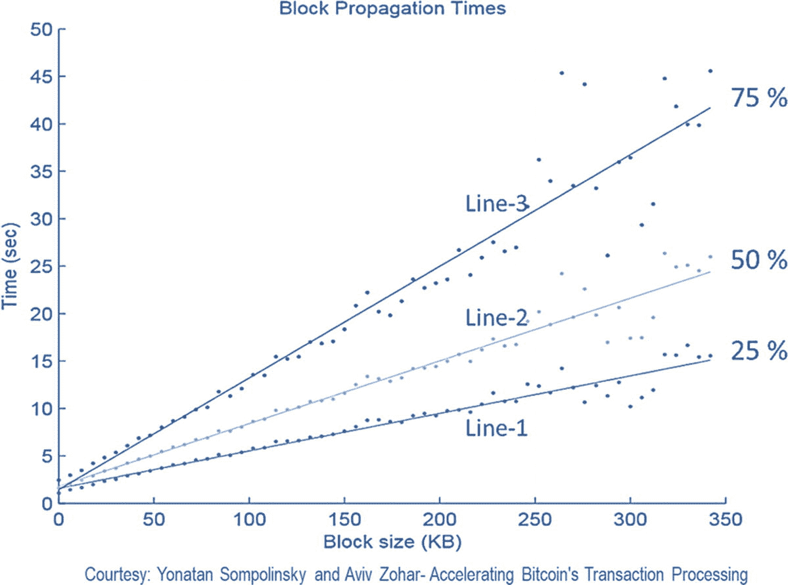

图 3-19

区块传播时间与区块大小的关系

网络带宽是导致这种网络延迟的主要原因，并且它在全球各地并不一致。除此之外，我们知道区块的广播数据包需要经过多次跳转才能最终到达所有节点。典型的比特币区块大小为 `1 MB`，而通过硬分叉产生的新变体（比特币现金）的区块大小为 `2 MB`；你可以想象由此带来的延迟固有限制。根据网络研究，一个月内有超过一百万个比特币节点连接到比特币网络，并且有数千个全节点几乎永久性地连接到网络。

# 综合应用

从高层次来看，如果我们只是按事件发生的顺序列出，那么流程如下：

*   所有新交易都会被广播到所有节点。
*   听到新交易的每个节点将它们收集到一个区块中。
*   每个挖矿节点努力为其区块找到困难的工作量证明，以便能够将其提交给网络。
*   当一个节点幸运地为工作量证明难题找到正确的 `nonce` 值时，它就会将该区块广播给所有节点。
*   仅当 `nonce` 值和区块中的所有交易均有效且未被花销时，节点才接受提议的区块。
*   比特币网络节点通过努力创建链中的下一个区块来表达对区块的接受，并使用被接受区块的哈希作为它们将要挖矿的新区块的前一哈希。

## 比特币脚本

我们在前面的章节中从高层次了解了比特币交易。在本节中，我们将深入探讨实现交易的实际编程结构。每一笔比特币交易的输入和输出都嵌入了脚本。比特币脚本是基于栈的，我们稍后会看到，并且是从左到右进行评估。请记住，比特币脚本不是图灵完备的，因此你不能像使用其他图灵完备语言（如 `C`、`C++` 或 `Java` 等）那样实现任何和所有功能。比特币脚本中没有循环的概念，因此脚本的执行时间不是可变的，而是与指令数量成正比。这意味着脚本在有限的时间内执行，不可能陷入循环。而且，最重要的是，脚本一定会终止。现在我们了解了脚本的一些知识，那么它们在何处运行呢？无论是通过编程方式、钱包软件还是其他任何程序进行交易时，脚本都会被注入交易中，而矿工的任务就是在挖矿时运行这些脚本。比特币脚本的目的是使网络节点能够确保可用资金仅由真正拥有它们的授权方进行索取和花费。

## 重新审视比特币交易

比特币网络中的交易是一种价值转移，它会广播至全网，并最终出现在区块链的某个区块中。通常，我们看起来像是比特币从一个账户或钱包转移到另一个，但实际上，它是从一笔交易转移到另一笔交易。在深入细节之前，请记住，比特币地址本质上就是参与者`公钥`经过双重哈希运算后的输出。`公钥`首先通过`SHA256`哈希算法，然后通过`RIPEMD160`哈希算法，分别进行哈希运算，以生成 160 位的比特币地址。我们已经在上一章中介绍过这些哈希技术。现在，让我们更深入一点地了解交易。请看下面的交易树（图 3-20），即比特币中的交易流程。

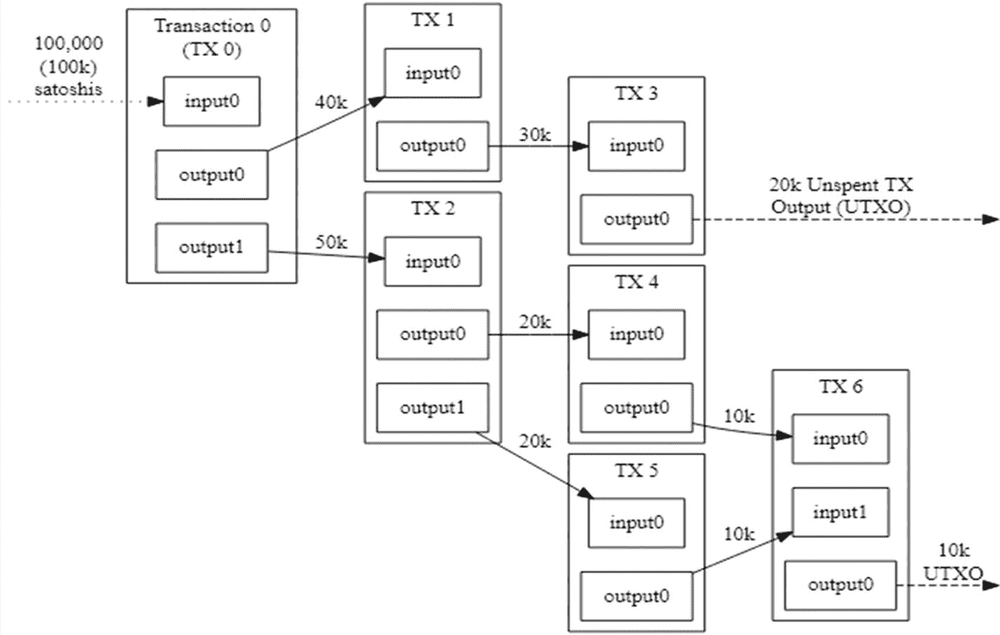

**图 3-20** 典型的比特币交易结构

请注意，前一笔交易的输出成为新交易的输入，这个过程会永远持续下去。在上图中，如果你是那个从前一笔输出中获得 100K 的人，那么这便成为了新交易中可花费的输入。请注意，在`Tx 0`中，你花费了 40K 和 50K 并支付了这些金额，剩余金额（10K）则成为了矿工费。默认情况下，剩余金额会支付给矿工，所以你需要小心，不要忽略这种情况，而实际情况通常也是如此。在相同情况下，你可以从剩余的 10K 中，比如说，将 9K 转回自己的地址，留下 1K 作为矿工费。当一笔金额未被花费，即该交易未被用作新交易的输入时，它就是一个`UTXO`，可以在以后花费。显然，它之前的交易已被花费。因此，你持有的所有账户（`公钥`）对应的所有`UTXO`的总和，就是你的钱包余额。

在此暂停一下，思考一下这该如何编程实现。请记住，交易的输入和输出都配有相关的脚本来使其成为可能。正是通过这些脚本，才能确保你是进行交易的授权用户，并且你拥有从前一笔交易中收到的必要金额。这意味着输入和输出同等重要。交易内容的结构如下所示：

```
交易输出 = 要转移的比特币数量 + 输出脚本
交易输入 = 对前一笔交易输出的引用 + 输入脚本
```

先查看输出脚本还是输入脚本，实际上是一个先有鸡还是先有蛋的问题。但我们将先查看输出脚本，因为它将被下一笔交易的输入脚本所消耗。让我们重复并准确理解这一点：在进行一笔交易时，当前交易的输出脚本只是为了能允许未来的交易将其作为输入来消费，但对于当前这笔交易而言，是前一笔交易的输出脚本让你能够花费它。这就是为什么输出脚本包含接收者的`公钥`和正在转移的价值（比特币数量）。当输出脚本被用作输入时，其主要目的是根据`公钥`验证`签名`。输出脚本也被称为`ScriptPubKey`。除非此输出被花费，否则它始终是一个等待被花费的`UTXO`。

交易输入数据结构中的输入脚本包含了如何消耗你想要花费的前一笔交易的机制。因此，它必须包含对该前一笔交易的引用。前一笔交易的哈希值和索引号`{hash, index}`精确定位了你收到当前正在花费的金额的位置。“索引”的目的是识别前一笔交易中的目标输出。如果你是前一笔交易的接收者，你必须提供你的`签名`，以证明你是该交易目标`公钥`的合法所有者。这将使你能够花费该笔交易。此外，你还必须提供你的`公钥`，该`公钥`经过哈希运算后将与之前交易中用作目标地址的`公钥`相匹配。输入脚本也被称为`ScriptSig`。脚本的最终目标是将`签名`和密钥推入栈中。

一个典型的比特币交易包含以下字段（表 3-5）。

**表 3-5** 比特币交易字段

| 字段 | 大小 | 描述 |
| --- | --- | --- |
| 版本号 | 4 字节 | 当前为 1。它告知比特币节点和矿工使用哪套规则来验证此交易。 |
| 输入计数 | 1 - 9 字节 | 正整数（`VI = VarInt`）。表示输入的总数。 |
| 输入列表 | 可变长度 | 列出交易的所有输入。 |
| 输出计数 | 1 - 9 字节 | 正整数（`VI = VarInt`）。表示输出的总数。 |
| 输出列表 | 可变长度 | 列出交易的所有输出。 |
| 锁定时间 | 4 字节 | 当前未使用。它表示交易是在矿工验证后立即包含进区块链区块，还是需要等待一段时间才能包含进区块。 |

现在，让我们来看看上一节讨论的相同交易结构的另一种表示形式。这是为了更详细地了解交易结构及其各种组成部分。现在请参考图 3-21。

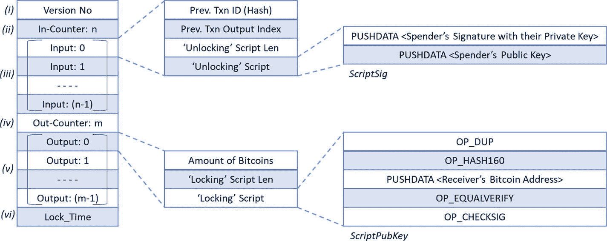

**图 3-21** 比特币交易的细粒度组件

如上图所示，`签名`或`公钥`等数据项都嵌入在脚本中，并成为交易的一部分。仅仅通过查看比特币交易的细粒度组件，你的许多疑问就能得到直接解答。脚本中的指令被推入栈中并执行，我们稍后将详细探讨这一点。

当比特币节点接收到交易广播时，它们会按照以下步骤，将前一笔交易的输出脚本与当前交易的输入脚本结合起来，各自独立地验证这些交易。

- 找到前一笔交易，其输出被用作当前交易的输入。“Prev. Txn ID (Hash)”字段包含该前一笔交易的哈希值。
- 在前一笔交易的输出中，找到收到资金的确切索引。由于一笔交易中可能有多个接收方，因此使用该索引来识别当前交易的发起方，其地址在前一笔交易中被用作接收方。
- 使用称为`ScriptSig`的解锁脚本来使用前一笔交易中的输出脚本。请注意，在图 3-21 中，前面有一个指定该解锁脚本长度的字段。
- 将该输出脚本与输入脚本连接起来，只需将其附加到输入脚本之后，形成验证脚本，然后执行该验证脚本（请记住，这是一种基于栈的脚本语言）。
- `amount`值实际存在于输出脚本中，即`ScriptPubKey`。它是一个锁定脚本，用于锁定交易输出的花费条件，并确保只有该交易发送到的比特币地址的合法所有者才能在以后索取它。请注意，在它之前还有一个锁定脚本长度字段。对于当前交易，此输出脚本仅用于提供信息，并在将来所有者尝试花费它时发挥作用。
- 验证脚本通过验证`签名`来决定当前交易输入是否有权花费之前的`UTXO`。如果验证脚本成功运行，则确认该交易有效，并且交易成功。

让我们通过图示来更深入地理解前面的解释。假设 Alice 支付给 Bob 5 BTC。这意味着 Alice 在之前的一笔交易中收到了 5 BTC，该交易使用`ScriptPubKey`锁定。Alice 可以通过使用`ScriptSig`解锁来证明自己是该交易的合法所有者，并将其花给 Bob。类似地，如果 Bob 尝试将 3 BTC 支付给 Charlie，并将 2 BTC 支付给自己，那么情况如下所示（图 3-22）。

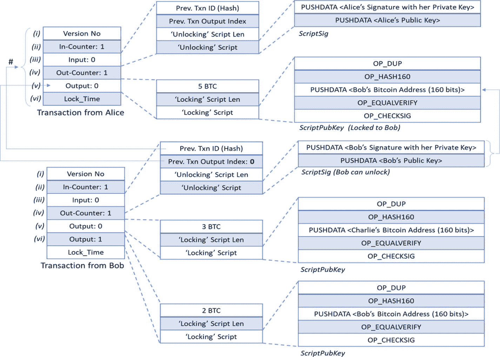

图 3-22

比特币脚本的实际示例

当比特币网络，更准确地说是矿工，收到来自 Alice 的交易时，他们会检查并确认这是一笔有效交易，然后通过将其包含在他们的区块中（提出区块的矿工负责此事）来批准该交易。当这种情况发生时，该交易的输出成为 Bob 名下的`UTXO`的一部分，Bob 可以在以后花费它。这正是我们示例中发生的事情——Bob 也将其花给了 Charlie。Bob 通过使用前一笔交易，用自己的`签名`和`公钥`解锁它来完成此操作，以证明他是 Alice 曾使用的比特币地址的所有者。请注意，Bob 的交易中有两个输出。由于他从 Alice 那里收到了 5 BTC，并向 Charlie 支付了 3 BTC，他必须将剩余的金额转给自己，这样它就变成了 Bob 自己绑定的 2 BTC 的`UTXO`，他将来可以花费它。在 Bob 的交易中，支付给 Charlie 的 3 BTC 使用锁定脚本锁定，只有 Charlie 以后才能花费。

你现在是否在想这些脚本是如何组合并一起执行的？请记住，当前交易的解锁脚本与前一笔交易的锁定脚本一起运行。如前所述，运行脚本是矿工的工作，这些操作不会在钱包软件中发生。在前面的示例中，当 Bob 进行交易时，矿工们执行 Bob 交易中的`ScriptSig`解锁脚本，然后立即按顺序执行 Alice 交易中的`ScriptPubKey`锁定脚本。如果组合后的验证脚本在基于栈的顺序执行中成功运行并返回`TRUE`，则验证该交易的所有节点都会接受 Bob 的交易。在下一节中，我们将更详细地研究比特币脚本以及比特币脚本虚拟机如何在组合脚本命令执行期间处理栈。然而，在本节中，请查看以下从开发者角度表示交易的示例：

```
{
"hash": "a320ba8bbe163f26cafb2092306c153f87c1c2609b25db0c13664ae1afca78ce",
"ver": 1,
"vin_sz": 1,
"vout_sz": 1,
"lock_time": 0,
"size": 51,
"in":[
{
"prev_out":{
"hash":"83cd5e9b704c0a4cb6066e3a1642b483adc8f73a76791c82a73dfa381281d32f",
"n":0
},
"scriptSig":"63883d3d2dea35029d17d25b8a926675def0045c397d3df55b0ae145ef80db7849599b930220ab13bd2dda2ca0a67e2c5cd28030bb9b7b3dcacf176652dac82fe9d5873f3409661281d32f6d35b46906cd562bf8b48f4f938c077bcb29d46b0560fa5c61813d3d2d"
}
],
"out":[
{
"value":"0.08",
"scriptPubKey":"OP_DUP OP_HASH160 b3a2c0d84ec82cff932b5c3231567a0d48ab4c78
OP_EQUALVERIFY OP_CHECKSIG"
}
]
}
```
*仅包含一个输入和一个输出的示例代码*

请注意，比特币交易并未加密，因此可以浏览和查看已收录到区块中的每一笔交易。

## 脚本

脚本实际上是用每笔交易记录的一系列指令，它描述了下一个用户如何获得这些收到的比特币并进行花费。比特币使用基于栈的、非图灵完备的脚本语言，指令按从左到右的顺序处理。请记住，它是故意设计为非图灵完备的！

我们在上一节中了解了输入和输出脚本。现在我们知道了，输入脚本`ScriptSig`是解锁脚本，包含两个部分：`公钥`和`签名`。使用`公钥`是因为它的哈希值对应于上一笔交易中该交易花费的目标比特币地址。ECDSA 数字`签名`的目的是证明`公钥`的所有权，从而证明比特币地址的所有权，以便进一步花费。同样，上一笔交易中的输出脚本`ScriptPubKey`的作用是将交易锁定给比特币地址的合法所有者。这两个脚本——当前交易的`ScriptSig`和上一笔交易的`ScriptPubKey`——会被合并起来执行。看看它们合并后的样子（图 3-23）。

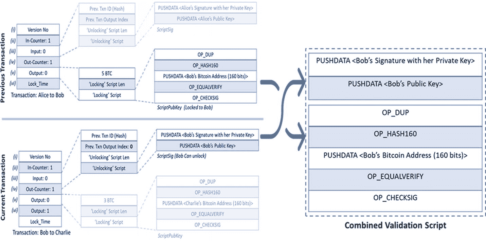

图 3-23

组合验证脚本的形成

正如我们已经了解的，需要注意的重要一点是，比特币脚本要么成功执行，要么失败。当交易有效时，它会成功执行，没有任何错误。比特币脚本语言是一种非常简化的编程语言版本，体积很小，总共只有 256 条指令。在这 256 条指令中，有 15 条被禁用，75 条被保留（可能供以后使用）。这些基本指令包括数学运算、逻辑运算（`if`/`then`）、错误报告和仅返回语句。除此之外，还有一些额外的密码学指令，例如哈希计算、`签名`验证等。我们不会深入所有可用的指令集，只关注本章将要用到的那些。以下是一些指令：

- `OP_DUP`：复制栈顶项。
- `OP_HASH160`：执行两次哈希运算，先使用`SHA256`，然后使用`RIPEMD160`。
- `OP_EQUALVERIFY`：如果输入匹配则返回`TRUE`，否则返回`FALSE`并将交易标记为无效。
- `OP_CHECKSIG`：使用输入`公钥`本身，检查输入的`签名`对于当前交易的哈希值是否为有效`签名`。

要执行这些指令，我们只需将这些指令压入栈中，然后执行。除了栈占用的内存外，不需要额外的内存，这使得比特币脚本非常高效。如你所见，脚本中有两种指令：数据指令和操作码。前面的列表项都是操作码，而我们之前看到的组合验证脚本则包含了这两种指令。数据指令只是将数据压入栈中，并不执行任何功能；而操作码的唯一目的是对栈中的数据执行某些功能，并在适用时将其弹出。让我们讨论一下鲍勃的交易如何在这样一个基于栈的实现中执行。回想一下组合脚本，其中鲍勃试图在当前交易中花费之前收到的一笔交易，将其发送给查理（图 3-24）。

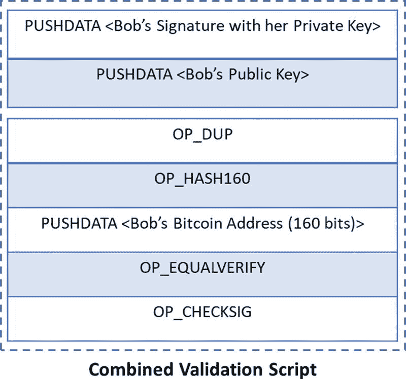

图 3-24

`ScriptPubKey` 和 `CheckSig` 的组合脚本

相应的基于栈的实现如下所示（图 3-25）。

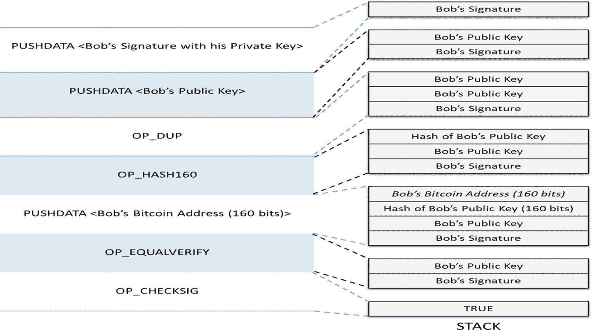

图 3-25

比特币脚本基于栈实现的示例

尽管前面的基于栈的实现是不言自明的，但我们还是快速浏览一下这里发生了什么。

- 首先是鲍勃的`签名`——一个数据指令，因此被压入栈中。
- 然后是鲍勃的`公钥`——同样是一个数据指令，被压入栈中。
- 接着是`OP_DUP`，一个操作码。它复制栈中的第一项，因此鲍勃的`公钥`被复制，成为栈中的第三项。
- 接下来是`OP_HASH160`，一个操作码，它对鲍勃的`公钥`执行两次哈希：先使用`SHA256`，再使用`RIPEMD160`，最终的 160 位输出替换了鲍勃的`公钥`，成为栈顶。
- 然后是鲍勃的比特币地址（160 位）——一个数据指令，被压入栈中。
- 接下来是一个操作码`OP_EQUALVERIFY`，它检查栈中的顶部两项，如果它们匹配，则将它们都弹出，否则抛出错误，脚本终止。
- 最后又是一个操作码`OP_CHECKSIG`，它检查`公钥`是否与`签名`匹配，以验证所有者的真实性。这个操作码还能够消耗这两个输入并将它们从栈中弹出。

你可能会想，如果有人试图注入欺诈性脚本或滥用它们会怎样。请注意，比特币脚本是标准化的，矿工们了解它们。任何不符合标准的内容都会被矿工丢弃，因为他们不会浪费时间执行这样的交易。

## 全节点与简易支付验证（SPV）

我们已经在本章中对全节点和 SPV 有了初步了解。很明显，实现全节点和轻量级节点的概念是为了简化比特币的使用并使其更易于适应。在本节中，我们将深入探讨这些变体的技术细节，并理解它们的目的。

### 全节点

全节点是比特币网络中最核心的组件。它们是那些从全球各地维护和运行比特币的节点。正如已经讨论过的，它们下载包含所有交易的整个区块链，从创世区块一直到最新发现的区块。最新的区块定义了区块链的高度。

全节点非常安全，因为它们拥有整条链。对于攻击者来说，要成功欺骗一个节点，需要提出一条替代区块链，而这实际上是不可能的。真正的链是累计工作量证明最大的链，要提出一个新的欺诈区块在计算上是不可行的。如果一个区块中的所有交易无效，攻击者执行的工作量证明挖矿将是徒劳的，因为其他矿工不会在其之上进行挖矿。这样的区块很快就会成为孤块。全节点在本地构建并维护自己的区块链副本。它们不依赖网络进行交易验证，因为它们是自给自足的。它们只关心了解其他节点提出的新区块，以便在验证区块后更新自己的本地副本。因此，我们了解到，每个全节点必须处理所有交易；它们必须存储整个数据库——包括当前正在广播的每一笔交易、历史上曾经花费的每一笔交易以及`UTXO`列表；参与维护整个比特币网络；并且还必须为 SPV 客户端提供服务。

请注意，全节点使用的比特币软件种类繁多，它们在软件架构上差异很大，并使用不同的编程语言编写。然而，使用最广泛的是“Bitcoin Core”软件；超过四分之三的网络节点都在使用它。

### SPV（简易支付验证）

比特币设计中有个很棒的概念，即简易支付验证（`SPV`）节点，它可以在不运行完整节点的情况下验证交易。`SPV`的工作方式是，在初次同步到比特币网络时，仅下载所有区块的区块头。在比特币中，每个区块头大小为 80 字节，下载所有区块头的数据量并不大，总计仅几兆字节。

`SPV`的目的是提供一种机制，无需整个区块链数据，即可验证特定交易是否存在于区块链的某个区块中。每个区块头都包含默克尔根（即区块哈希）。我们知道每笔交易都有一个哈希值，通过我们在上一章讨论过的默克尔树证明，可以将该交易哈希链接到区块哈希。区块中的所有交易构成默克尔树的叶子节点，而区块哈希则构成默克尔树的根节点。默克尔树的精妙之处在于，只需要区块的一小部分数据，就能证明某笔交易确实属于该区块。因此，为了确认一笔交易，一个`SPV`会做两件事：首先，检查某笔交易的默克尔树证明，以确定它属于该区块；其次，检查该区块是否属于主链，并且其后至少还有六个区块被创建，才能确认它属于最长链。图 3-26 描绘了这一过程。

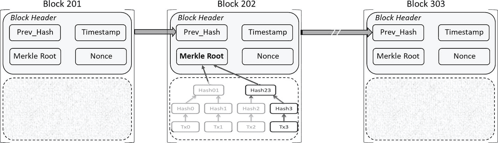

图 3-26
SPV 区块头中的默克尔根

让我们深入探究一下`SPV`在验证交易时实际运作的技术细节。从高层次来看，它需要以下步骤：

- 对于`SPV`所连接的对等节点，它会与其中许多节点建立布隆过滤器，理想情况下不只是连接一个节点，因为该节点有可能实施拒绝服务攻击或进行欺骗。布隆过滤器的目的是仅匹配`SPV`感兴趣的交易，而不是区块中的其他交易，同时不泄露`SPV`感兴趣的是哪些地址或密钥。
- 对等节点将相关的交易以`merkleblock`消息的形式发回，该消息包含默克尔根和指向感兴趣交易的默克尔路径，如上图所示。`merkleblock`消息的大小仅为几千字节，非常高效。
- 然后，`SPV`就可以很容易地验证一笔交易是否真正属于区块链中的某个区块。
- 交易验证完成后，下一步就是检查该区块是否确实是真正的最长区块链的一部分。

下图（图 3-27）展示了此 SPV 与其对等节点的通信步骤。

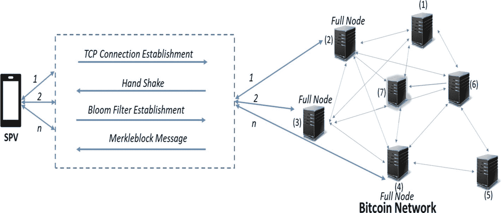

图 3-27
SPV 与比特币网络的通信机制

## 比特币钱包

比特币钱包与你日常生活中使用的钱包非常相似，你可以访问它，并随时进行支付。然而，比特币钱包是一种数字现象。回想一下我们在上一节使用的例子，爱丽丝向鲍勃支付了一些金额。如果鲍勃没有账户，她该如何操作呢？在比特币环境中，账户或钱包由比特币地址表示。鲍勃必须先生成一个密钥对（私钥/公钥）。比特币使用 `ECDSA` 算法，并采用 `secp256k1` 曲线（别担心，这只是曲线类型——一种标准推荐）。首先，生成一个随机比特串作为私钥，然后通过确定性方式将其转换为公钥。正如我们在第 2 章中学到的，私钥和公钥在数学上是相关的，并且可以随时（确定性地）从私钥生成公钥。因此，实际上并不需要保存公钥本身。通过软件实现无法做到真正的随机性，所以许多服务器或应用程序使用硬件安全模块（`HSM`）来生成真正的随机比特，并保护私钥。与公钥不同，私钥绝对需要以最高安全级别进行保存。如果丢失了私钥，你就无法生成签名来证明你拥有公钥（或比特币地址）的所有权，而该地址在任何交易中都可能收到了金额。公钥经过两次哈希运算生成比特币地址：首先使用 `SHA256`，然后使用 `RIPEMD160`。这个过程也是确定性的，因此给定一个公钥，只需进行几次哈希运算就能生成比特币地址。

请注意，比特币地址实际上并不会泄露公钥。这是因为地址是经过双重哈希处理的公钥，要通过比特币地址找到公钥是相当不可行的。然而，对于拥有公钥的人来说，很容易就能声明对比特币地址的所有权。比特币中的哈希技术缩短并混淆了[公钥](https://bitcoin.org/en/glossary/public-key#The%20public%20portion%20of%20a%20keypair%20which%20can%20be%20used%20to%20verify%20signatures%20made%20with%20the%20private%20portion%20of%20the%20keypair.)。这既方便了手动抄写，也提供了安全性，以防出现未预料到的问题——那些问题可能允许从[公钥](https://bitcoin.org/en/glossary/public-key#The%20public%20portion%20of%20a%20keypair%20which%20can%20be%20used%20to%20verify%20signatures%20made%20with%20the%20private%20portion%20of%20the%20keypair.)重构出[私钥](https://bitcoin.org/en/glossary/private-key#The%20private%20portion%20of%20a%20keypair%20which%20can%20create%20signatures%20that%20other%20people%20can%20verify%20using%20the%20public%20key.)。这可能是最安全的实现方式！公钥仅在交易输出的所有者声明所有权时才会被揭示，而不是在交易发送给他们的那一刻，如图 3-28 所示。

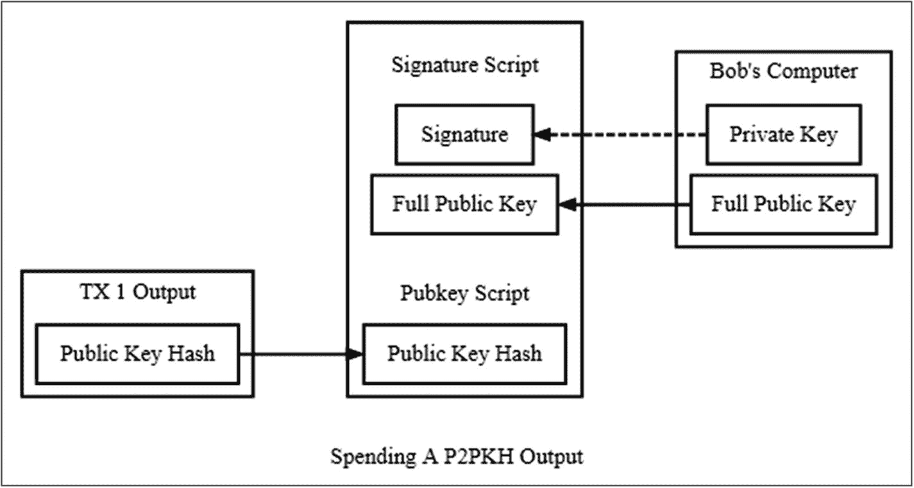
*图 3-28：声明交易时揭示公钥*

比特币钱包本质上就是 `SPV`，并由完整节点提供服务。我们已经了解了 `SPV` 的功能，因此在本节中，我们将看看一些特定于钱包的活动。我们都知道，要进行一笔交易或接收一笔交易，你不需要运行完整节点。你所需要的只是一个能够保存你的私钥/公钥对的钱包，以便能够进行和接收交易（实际上是查看和验证发送给你的交易）。我们在学习 `SPV` 部分时已经了解了验证部分。现在让我们来看看如何使用钱包发起一笔交易。

建议你运行自己的全节点并将钱包连接到该节点，因为这是在比特币上进行操作最安全的方式。不过，这并不是强制要求，你仍然可以在不维护自己节点的情况下工作。请记住，当你查询一个节点时，必须提供你的公开地址才能获取 UTXO 列表，这意味着全节点会获知你的公开地址，这会造成隐私泄露！钱包所要做的只是获取 UTXO 列表，以便用私钥签名交易，并将该交易发布到比特币网络中。这可以通过创建自己的钱包软件或使用第三方钱包服务来实现。然而，请谨慎对待钱包服务提供商，因为你正在允许他们控制你的私钥。无论是他们故意盗取你的比特币，还是他们自身被黑客攻击（许多钱包服务都曾发生过这种情况），你都会损失比特币。归根结底，尽管比特币网络是去中心化的，但所有钱包服务提供商都是中心化的。通过钱包软件发起比特币交易的典型图示如下所示（图 3-29）。

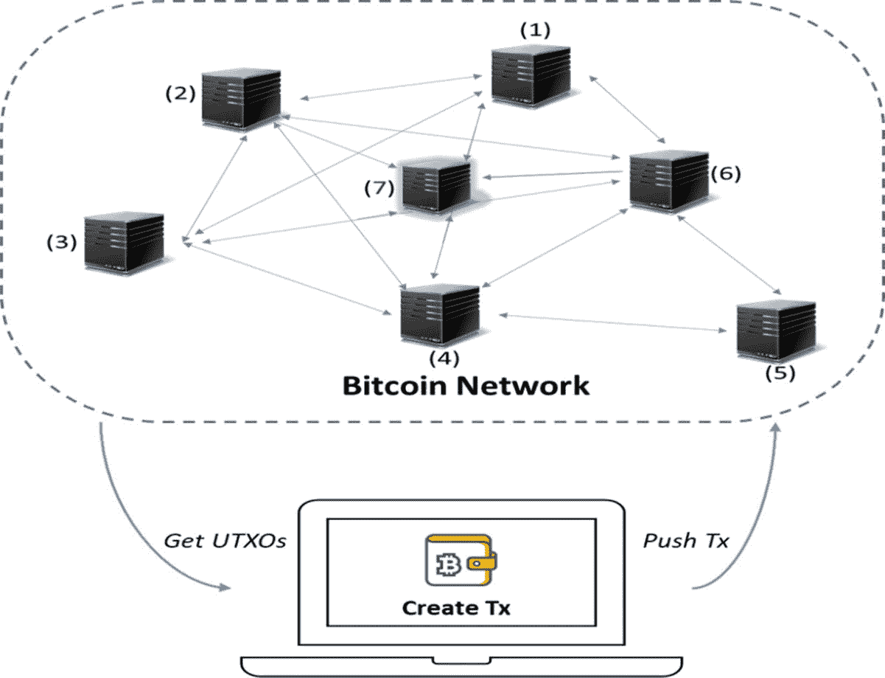
*图 3-29：钱包应用程序与比特币网络交互*

一个可以用作比特币钱包的 `SPV` 客户端示例是 `BitcoinJ`。`BitcoinJ` 实际上是一个用于与比特币协议交互、维护钱包以及发起/验证交易的库。它不需要像 Bitcoin Core 这样的本地全节点，可以作为轻客户端节点运行。尽管它是用 Java 实现的，但可以从任何兼容 JVM 的语言（如 JavaScript 和 Python）中使用。

## 摘要

在本章中，我们学习了如何将上一章讨论的区块链概念组合起来，构建比特币作为区块链技术的一种加密货币用例。我们涵盖了比特币的演变、历史、定义、设计优势及其为何如此重要。我们深入了解了比特币网络、交易、区块、区块链、共识机制以及所有这些要素如何相互衔接的细节。然后，我们学习了与比特币区块链系统交互所需钱包解决方案的要求。

20 世纪 90 年代，互联网的普及改变了人们的经商方式。它消除了信息创建和传播中的摩擦。这为新市场、更多机遇和可能性铺平了道路。同样地，如今的区块链正在将互联网提升到一个全新的水平。比特币只是区块链的一种加密货币应用，而可能性是无限的。在下一章中，我们将学习以太坊如何运作，以及它如何成为单一公共区块链网络上各种去中心化应用的事实标准。