# 以太坊的工作原理

区块链应用的时代才刚刚开始。以太坊将成为构建去中心化应用的事实上的区块链平台。我们在前几章已经学到，公共区块链的用例不仅限于加密货币，其可能性只受限于你的想象力！以太坊已经在许多商业领域取得进展，不仅最适合公共区块链用例，也适用于私有区块链用例。以太坊已经为区块链平台树立了标杆，必须深入研究，才能设想如何借助或不借助以太坊来构建可用的去中心化应用。如今，得益于以太坊，即使仅具备最少的密码学、博弈论、数学或复杂编码以及计算机科学基础知识，也能构建区块链应用。

在本书第 3 章中，我们通过深入探讨协议和比特币应用，学习了比特币的工作原理。我们见证了加密货币方面如何与比特币协议紧密交织。我们了解到，比特币并非区块链上的比特币，而是特币区块链。在本章中，我们将学习以太坊如何成功构建了一个抽象基础层，该层能够在同一个区块链平台上赋能各种不同的区块链用例。

## 从比特币到以太坊

显然，区块链技术是 2009 年随比特币一同出现的。在比特币经受住时间的考验后，人们开始相信区块链的潜力。如今，其用例已超越银行和金融领域，扩展到供应链、零售、电子商务、医疗保健、能源以及政府等其他行业。这是因为不同类型的区块链已经出现，并解决特定的业务问题。尽管如此，也有像以太坊这样的公共区块链平台，允许在同一个公共以太坊平台上构建不同的去中心化用例。

借助比特币，去中心化的点对点加密货币交易成为可能。人们意识到，区块链不仅可用于交易加密货币，还可用于交易和追踪任何具有价值的东西。人们开始探索是否可以将同一个比特币网络用于其他用例。举个例子，`存在性证明` 就是一个这样的用例，它将文档的哈希值注入比特币区块链网络，以便任何人之后都能验证该文档在某个时间点是否存在。Vitalik Buterin 引入了以太坊区块链平台，该平台不仅能够促进货币交易，还能促进股份、土地、数字内容、车辆等许多具有内在价值的事物的交易。看一下图 4-1。

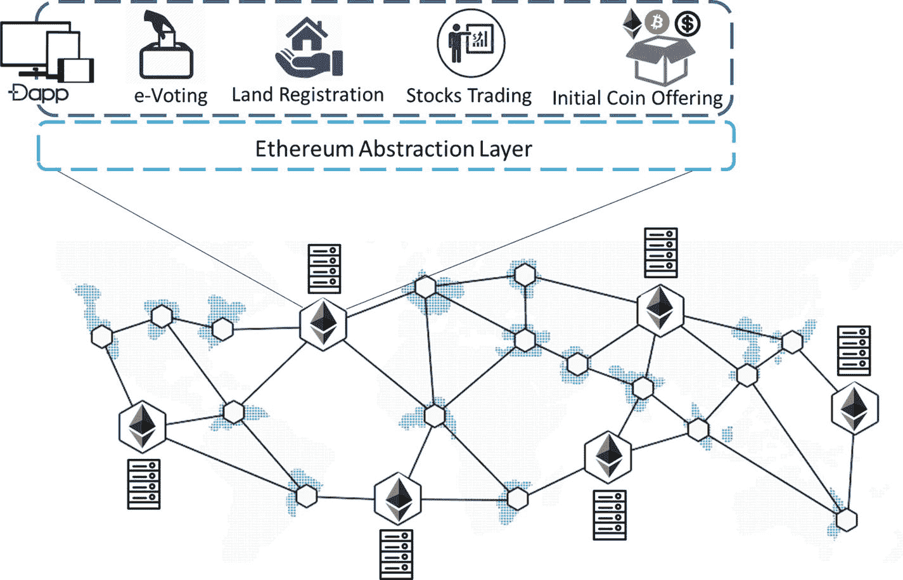

图 4-1

一个以太坊平台上的多个去中心化应用

与比特币一样，以太坊是一个具有不同设计理念的公共区块链平台。其最具创新性的方法是构建一个抽象层，使来自不同应用的交易被泛化为可以在所有以太坊节点上运行的程序代码。即使在以太坊中，矿工也会生成以太币，这是一种可交易的加密货币，公共区块链网络借此实现自我维持。任何在以太坊上运行的应用都必须支付交易费用，矿工最终通过运行节点和维持整个网络来获得这些费用。


  
### 以太坊：下一代区块链  

凭借比特币区块链，开发者社区曾试图通过构建全新的区块链来开发不同的去中心化应用，或尝试修改比特币核心以增加功能集。无论哪种方式，既复杂又耗时。当时或许正需要一种采用替代协议的不同设计方案，这正是以太坊区块链平台诞生的原因！其目标是促进在单一以太坊平台上开发多种区块链应用，而非为每个应用单独构建专用区块链。以太坊实现了去中心化应用的快速开发，这些应用可以相互交互，同时确保足够的安全性。如前一节所述，以太坊通过构建抽象基础层来实现这一点。与比特币不同，以太坊支持图灵完备语言，因此任何人都可以编写智能合约，从而在编程层面实现几乎任何功能。此外，以太坊在设计上具有状态性，并持续跟踪账户状态，这与比特币截然不同——比特币中所有内容都保持为交易形式，且脚本没有内部持久内存。借助抽象基础层，底层复杂性对开发者而言被隐藏起来，不仅如此，开发者还能灵活设计自己的状态转换函数，用于直接转移价值与信息，以及自定义交易格式。

为实现这一目标，以太坊的核心创新是以太坊虚拟机（`EVM`）。通过`EVM`支持图灵完备语言，使开发者能够轻松创建区块链应用。就像运行 Java 代码需要 Java 虚拟机（`JVM`）一样，运行智能合约需要`EVM`。目前只需记住：智能合约是用图灵完备语言编写的以太坊脚本，当预定义事件发生时，它会自动执行。比特币中的`ScriptSig`和`ScriptPubKey`可以说是智能合约的初级版本。我们在前一章了解到，比特币的指令集非常有限。然而在以太坊中，几乎可以编写任何程序，并在以太坊区块链网络中的每个节点上通过`EVM`运行。以太坊中的去中心化应用被称为 DApp。由于以太坊是一个没有中心化服务器的全球去中心化计算机系统，DApp 是能够无停机、无欺诈或任何形式监管运行的应用。像比特币这样的点对点电子现金系统，在以太坊上可以很容易地作为 DApp 构建。同样，任何具有内在价值的资产（如土地、汽车、房屋、选票等），都可以通过其在以太坊上的相应 DApp 以代币形式轻松交易。

与传统软件的开发和部署不同，DApp 无需托管在后端服务器上。可以说，“代码”作为交易的有效载荷嵌入其中，然后发送至以太坊网络中的挖矿节点。此类交易会被挖矿生态系统考虑，因为其支付了以 ETH（以太币）计价的“燃料价格”。与比特币类似，这些交易会被广播至网络中可访问的其他矿工。最终，交易被打包进区块，并在达成共识后成为区块链的永久组成部分。开发者可以自由编写任意解决方案并将其部署到以太坊网络中。网络会自动执行该方案，同时验证并产生输出。当然，如果没有成本，网络将无法持续。每笔区块链交易都关联着燃料价格，编写垃圾代码并部署到以太坊网络可能会代价高昂！

### 以太坊的设计理念  

以太坊借鉴了比特币核心中经得起时间考验的许多概念，但其设计遵循不同的理念。以太坊的开发遵循以下原则：

* **简约设计**：以太坊区块链设计得尽可能简单，以便易于理解和开发去中心化应用。在共识层面，实现中的复杂性被控制在最低限度，并在更上层进行管理。因此，高级语言编译、参数的序列化/反序列化等对开发者而言并非难题。
* **开发自由**：以太坊平台旨在鼓励其区块链平台上的任何形式的去中心化，并不歧视或偏袒任何特定用例。这种自由甚至允许开发者编写包含无限循环的智能合约并部署它。当然，只要他们支付交易费用（燃料价格），循环就会持续运行，当燃料耗尽时循环最终终止。
* **无内置特性概念**：为了提升系统的通用性，以太坊没有为开发者提供内置特性。相反，以太坊通过支持图灵完备语言，让用户按自己的意愿开发所需特性。从比特币中的`locktime`等基本功能，到完整的复杂用例，一切都可以在以太坊中编码实现。

## 进入以太坊区块链  

我们了解了以太坊区块链的目标及其设计理念。为了能够理解并欣赏这一下一代区块链，并在其上构建去中心化应用，我们将在本节中详细学习以太坊的核心组件。  


### 以太坊区块链

以太坊区块链的数据结构与比特币的非常相似，不同之处在于区块头包含了更多信息，使其更加健壮，并有助于正确维护状态。我们将在后续章节中学习更多关于以太坊状态的知识。本节我们将主要关注区块链数据结构和区块头。在比特币中，区块头只有一个默克尔树根，用于存储块内的所有交易。而在以太坊中，另外还有两个默克尔树根，因此总共有三个默克尔树根，如下所示：

*   `stateRoot`：有助于维护全局状态。
*   `transactionsRoot`：用于跟踪并确保区块内所有交易的完整性，类似于比特币的默克尔树根。
*   `receiptsRoot`：对应于区块内交易的收据树的根哈希。

我们将在各自对应的区块头信息部分来审视这些默克尔树根。为了更好地理解，请查看图 4-2。

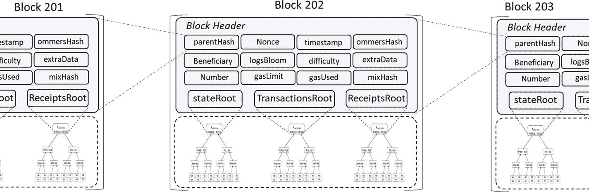

图 4-2

以太坊的区块链数据结构

每个区块通常包含区块头、交易列表、叔块列表和可选的`extraData`。现在，让我们看看区块头的各个字段，了解它们的含义及其在区块头中的作用。在此过程中，请记住，这些字段的名称在不同地方可能略有不同，或者它们的呈现顺序也可能有所不同。我们建议你深入理解这些字段，这样将来遇到任何不同的术语都不会给你带来太多困扰。

#### 第 1 节：区块元数据

*   `parentHash`：父区块头的 Keccak 256 位哈希，类似于比特币的风格。
*   `timestamp`：当前区块的 Unix 时间戳。
*   `number`：当前区块的区块编号。
*   `Beneficiary`：负责创建当前区块的“作者”账户的 160 位地址，成功挖掘该区块所获得的所有手续费都将汇集到此地址。

#### 第 2 节：数据引用

*   `transactionsRoot`：填充了此区块所有交易的交易树的 Keccak 256 位根哈希（默克尔根）。
*   `ommersHash`：也称为“`uncleHash`”。它是区块中叔块部分的哈希，即此区块的叔块列表部分的 Keccak 256 位哈希（这些叔块是已知其父区块等于当前区块的父区块的父区块的区块）。
*   `extraData`：包含与此区块相关数据的任意字节数组。该数据的大小限制为 32 字节（256 位）。截至撰写本文时，此字段有可能变为“`extraDataHash`”，它将指向区块内包含的 `extraData`。`extraData` 可以是原始数据，其计费方式与交易数据相同。

#### 第 3 节：交易执行信息

*   `stateRoot`：在验证并执行此区块所有交易后的最终状态的 Keccak 256 位根哈希（默克尔根）。
*   `receiptsRoot`：填充了此区块中每笔交易收据的收据树的 Keccak 256 位根哈希（默克尔根）。
*   `logBloom`：针对每笔交易收据的 Bloom 过滤器累积而成的 Bloom 过滤器，即区块中所有交易 Bloom 过滤器的“或”运算结果。
*   `gasUsed`：此区块中所有交易消耗的 gas 总量。
*   `gasLimit`：此区块可使用的最大 gas 量（动态值，取决于网络活动）。

#### 第 4 节：共识子系统信息

*   `difficulty`：根据前一区块的难度和时间戳计算得出的本区块难度限制。
*   `mixHash`：256 位的混合哈希，与“`nonce`”相结合用于本区块的工作量证明。
*   `nonce`：nonce 是一个 64 位哈希，与 `mixHash` 结合使用，可作为工作量证明验证。

### 以太坊账户

与比特币不同，以太坊账户并非以未花费交易输出（UTXO）的形式存在。在比特币章节中，我们了解到比特币实际上是以交易的形式存在的，每笔交易都有一个所有者（所有者的公钥，20 字节地址）和一个数值。如果所有者拥有他们想要花费的交易的有效私钥，就可以花费该交易。因此，比特币是一个状态转换系统，其中“状态”指的是所有 UTXO 的集合。每当一个区块被挖出，就会发生状态变化，因为每个区块都包含一组交易，而每笔交易都会消耗 UTXO 并创建 UTXO。请注意，状态并未编码在区块内部。因此，在比特币的设计中，本质上没有账户余额的概念。相比之下，以太坊是有状态的，其基本单元是账户。每个账户都有一个与之关联的状态，并有一个 20 字节（160 位）的地址，通过该地址进行识别和引用。以太坊中区块链的目的是跟踪状态变化。以太坊账户大致有两种类型：

*   **外部拥有账户（EOA）**：这些账户也称为“简单账户”，通常由用户或设备拥有，他们使用私钥控制这些账户。EOA 可以通过使用私钥签名来向其他 EOA 或合约账户发送交易。两个 EOA 之间的交易通常是转达任何形式的价值。另一方面，当 EOA 向合约账户发起交易时，其目的是激活合约账户内的“代码”。
*   **合约账户**：这些账户仅由其内部包含的代码控制。合约账户内的这种代码被称为“智能合约”。它们通常在 EOA 或其他合约账户向该合约账户发送交易时被激活。尽管合约账户能够通过其包含的代码执行复杂的业务逻辑，但它们不能自行发起新交易，始终依赖 EOA。它们所能做的只是根据其“代码”中编程的逻辑，响应其他交易（显然是通过发起交易）。

请查看以下三种场景（图 4-3 至 4-5），以更好地理解 EOA 和合约账户之间的通信。

**EOA 到 EOA 交易：**

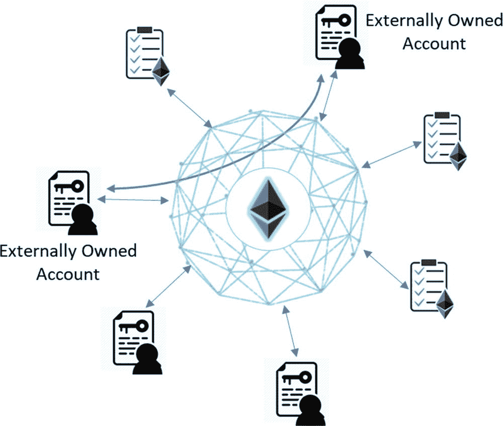

图 4-3

EOA 到 EOA 交易

**EOA 到合约账户交易：**

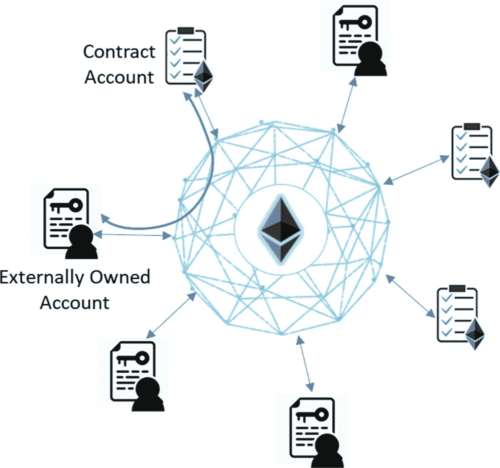

图 4-4

EOA 到合约账户交易

**EOA 到合约账户再到其他合约账户交易：**

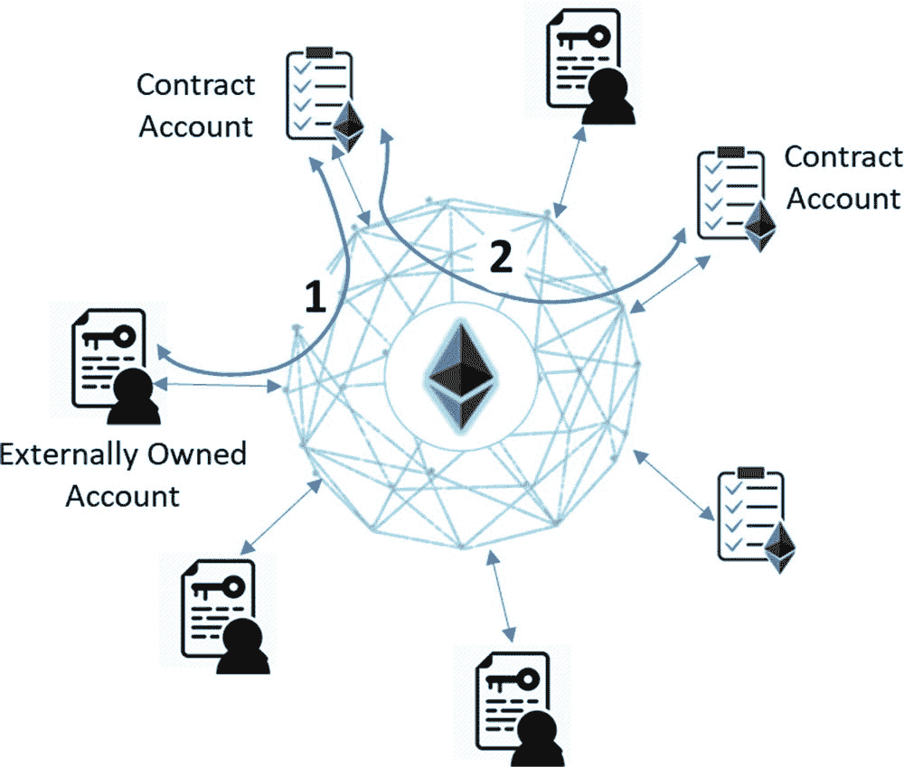

图 4-5

EOA 到合约账户再到合约账户交易

为了避免上述表示造成混淆，请注意，合约账户是内部的，它们之间的通信也是内部的。与 EOA 账户不同（EOA 发起交易并将其注入区块链），合约账户以及它们之间的交易是内部现象。


#### UTXOs 的优势

我们必须理解，比特币的设计理念是在尽可能的范围内保持匿名性。当与以太坊进行比较时，UTXO 的以下优势似乎具有重要意义：

- **更好的隐私性**：在比特币中，建议在接收交易时使用新地址，这有助于加强匿名性。即使运用复杂的统计或机器学习技术，也很难（尽管并非不可能）将账户关联起来。
- **潜在的更高可扩展性**：关于可扩展性的讨论通常非常主观，取决于具体情境、手头的用例以及许多其他因素。这里的意图仅仅是提及 UTXO 固有的扩展潜力。并行执行交易非常容易。此外，当所有者或其他维护某些代币的 Merkle 所有权证明数据的节点丢失这些数据时，仅所有者受到影响。相反，当某个账户的 Merkle 树数据丢失时，对该账户的任何操作都将不可行，甚至向其发送交易也不行。

#### 账户的优势

尽管以太坊在某种程度上是比特币的扩展，但它是以一种全新的设计理念构思的，并有其自身的一套利弊权衡。让我们来看看与比特币设计相比，以太坊账户的以下优势：

- **显著的空间节省**：在比特币中，当多笔交易被合并成一笔交易时（例如，如果你需要支付 5 BTC，但你从未收到过一笔至少 5 BTC 的交易可用于此情况，那么你必须捆绑多笔交易以使总额超过 5 BTC），就需要引用所有这些单独的交易。此外，所有这些交易都必须有不同的地址，因此交易数量与地址数量一样多！然而，在以太坊账户中，只需引用一个账户就足够了。尽管以太坊使用了 Merkle Patricia 树（MPT），它比 Merkle 树更占用空间，但对于复杂交易，你最终会节省大量空间。
- **编码简单**：由于 UTXO 和脚本不是图灵完备的，因此很难设计复杂的系统。UTXO 要么已花费，要么未花费；两者之间不存在其他状态。这使得编写复杂的业务逻辑变得困难。即使赋予脚本更多能力，与仅使用账户相比，它也会变得更加复杂。由于以太坊的目标是超越加密货币，并适应各种不同用例（通过 DApps），因此基于账户的系统几乎是不可避免的。
- **轻客户端引用**：与比特币客户端不同，以太坊客户端应用可以通过在状态树中沿特定方向扫描，轻松快速地访问与某个账户相关的所有数据。在 UTXO 模型中，对于所考虑的特定交易，通常存在多个对多笔交易的引用。

#### 账户状态

我们了解到每个账户都有一个与之关联的状态。我们还了解了以太坊中存在的两种账户：一种是合约账户，另一种是外部拥有账户（EOA）。无论账户类型如何，它们都由区块头中的 `stateRoot` Merkle 根跟踪，并可能如图 4-6 所示。

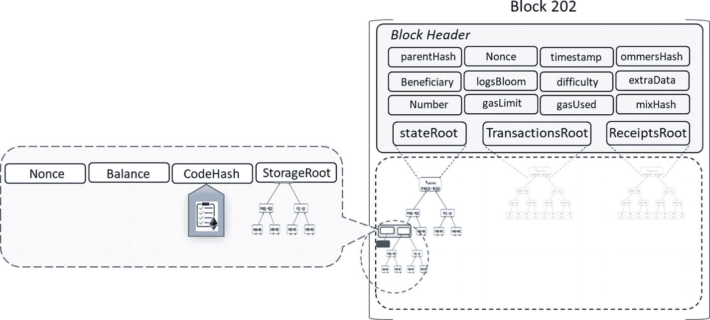

图 4-6：放大查看账户状态表示

如图所示，无论账户是 EOA 还是合约账户，它都有以下四个组成部分：

- **账户余额**：账户中的“以太”总余额。更准确地说，是该地址拥有的 `Wei` 数量（`1ETH = 10¹⁸ Wei`）。
- **CodeHash**：这是“代码”的哈希值。每个合约账户都有在 EVM 上执行的“代码”。该代码的哈希值存储在此 `CodeHash` 字段中。然而，对于 EOA 账户，没有“代码”，因此 `CodeHash` 字段包含空字符串的哈希值。
- **StorageRoot**：这是编码账户存储内容的 Merkle 树的 256 位根哈希。MPT 对存储内容的哈希值进行编码。将树的根哈希保存在 `StorageRoot` 字段中，有助于跟踪账户的内容并确保其完整性。
- **Nonce**：这是一个计数器，确保每笔交易只被处理一次。对于 EOA，此数字表示从该账户地址发出的交易数量。对于合约账户，它表示由该账户创建的合约数量。

因此，正是“状态”树负责跟踪以太坊区块链的状态变化。然而，有一点棘手的是，状态并非直接存储在每个区块中，而是以递归长度前缀（RLP）编码的状态数据形式存储在每个以太坊节点的 MPT 中。因此，为了维护全局状态，以太坊区块链在每个区块中都包含了“状态根”，该根存储了表示区块创建时系统状态的哈希树的 Merkle 根。

根据以太坊黄皮书，“世界状态”是地址（160 位标识符）与账户状态之间的映射。因此，世界状态包含了区块链上所有账户的信息，但并未存储在每个区块中。每个区块只修改状态的一部分。在某种程度上，世界状态是通过处理自创世区块以来的每个区块而生成的。某些以太坊节点可以选择通过保留所有历史交易（即状态转换及其输出）来维护所有历史状态。这允许客户端在任何时候查询区块链的状态，即使是历史状态，也无需从头重新计算所有内容。检索状态信息类似于 SQL 中的聚合查询，数据随时可用，仅需进行聚合。因此，旧的状态数据可以很容易地被丢弃（这称为“修剪”），因为在需要时可以重新计算出来。嗯，状态数据按设计是隐式数据，这意味着状态信息只应被计算出来。


  
#### Trie 的使用  

我们学习了三种以区块头为根节点的 Trie。这些根节点本质上是指向这三个 Trie 的指针。虽然在之前的章节中我们已经简要概述了这些 Trie，但让我们换个角度重新审视它们：  

- **状态 Trie**：表示访问区块后的整个状态（即全局状态）。  
- **交易 Trie**：表示区块中按索引编号的所有交易（例如，key:0 对应第一条执行的交易，key:1 对应第二条交易，以此类推）。请回想我们之前学过的 MPT 基础知识并尝试关联理解。  
- **收据 Trie**：表示与每笔交易对应的“收据”。交易的收据是一个经过 RLP 编码的数据结构，如下所示：  

```
[medstate, gas_used, logbloom, logs]
```

由于我们尚未深入探讨收据 Trie 的基础知识，现在让我们更详细地研究它。请查看收据 Trie 的 RLP 编码数据结构中的所有字段，并阅读以下针对这些字段的说明：  

- **`medstate`**：处理交易后的状态 Trie 根。成功的交易会更新以太坊状态。  
- **`gas_used`**：处理该交易消耗的 Gas 总量。  
- **`logs`**：一个包含以下格式项目的列表：  

```
[address, [topic1, topic2...], data]
```  

- 这些列表项由 `LOG0`、`LOG1`…… 等操作码在交易执行过程中生成。`address` 字段是生成日志的合约地址，`topic` 字段包含最多四个 32 字节的值，`data` 字段是任意大小的字节数组。  
- **`logbloom`**：由交易中所有日志的地址和主题构成的布隆过滤器。这与区块头中的布隆过滤器不同。  

#### 默克尔帕特里夏树  

在以太坊中，账户与其各自的状态一一映射。所有以太坊账户（包括外部拥有账户和合约账户）与其状态之间的映射统称为“世界状态”。以太坊用于存储这种映射关系的数据结构是 MPT。因此，MPT 是以太坊中使用的主要数据结构，也称为默克尔帕特里夏树。我们在比特币章节中学习了默克尔树，这已经帮助我们理解了 MPT 的一半内容。MPT 实际上融合了默克尔树和帕特里夏树的特点。  

回想比特币章节，默克尔树是一种二叉哈希树，其中叶节点包含数据块的哈希值，每个非叶节点包含其子节点的哈希值。实现这种数据结构后，可以轻松验证某笔交易是否属于某个区块。只需从整个区块中提取少量信息（即仅使用默克尔分支而非整个树），就能非常简便地提供成员证明。默克尔树在去中心化系统中实现了高效且安全的内容验证。轻客户端无需下载每笔交易和每个区块，只需下载区块头链——每个区块仅需 80 字节的数据块，其中仅包含五项内容：前一个区块头的哈希、时间戳、挖矿难度、满足工作量证明的随机数值，以及包含该区块所有交易的默克尔树根哈希。虽然这非常实用且有趣，但请注意，除了验证区块中某笔交易的成员证明外，其功能有限。一个明显的限制是，它无法证明关于当前状态的任何信息（例如数字资产总量、名称注册、金融合约状态）。即使要查询你持有多少比特币，也需要大量查询和验证工作。  

另一方面，帕特里夏树是基数树的一种形式。PATRICIA 代表“检索字母数字编码信息的实用算法”。帕特里夏树支持高效的插入/删除操作。其中键值查找效率极高，键始终编码在路径中。因此，`key` 是从根节点到存储 `value` 的叶节点所经过的路径。键通常是帮助向下遍历路径的字符串，每个字符指示应跟随哪个子节点才能到达叶节点并找到其中存储的值。  

因此，MPT 提供了一种加密认证的数据结构，用于存储以太坊中的所有（`key`，`value`）绑定。它具有完全确定性，这意味着具有相同（`key`，`value`）绑定的帕特里夏树将完全一致，直至最后一个字节。插入、查找和删除操作效率很高，复杂度为 `O(log(n))`。由于 MPT 中的默克尔树部分，节点的哈希值被用作指向该节点的指针，MPT 据此构建，其中：  

```
Key == SHA3(RLP(value))
```  

默克尔部分提供了防篡改且确定性的树形结构，而帕特里夏部分则提供了高效的信息检索功能。因此，如果你仔细观察，MPT 中的根节点会成为整个数据结构的加密指纹。在以太坊点对点网络中，当交易通过线缆广播时，每个接收到交易的挖矿节点会将其组装起来。这些节点随后形成一棵树（即 Trie），并计算根哈希以包含在区块头中。交易在本地以树结构存储，但在序列化为列表后会被发送到其他节点或客户端。接收方必须将其反序列化回交易树，以验证根哈希。另外请注意，在以太坊中，MPT 经过轻微修改以更好地适应以太坊实现。它不再使用二进制，而是使用十六进制——源自包含 16 个字符的“字母表”。因此，树或 Trie 中的节点有 16 个子节点（16 字符十六进制字母表）和最大深度 X。需要说明的是，十六进制字符在许多地方被称为“半字节”。  

以太坊中 MPT 的基本思想是：对于单次操作，它只会修改最少数量的节点来重新计算根哈希。这样可以将存储和复杂度保持在最低水平。  


#### RLP 编码

你一定已经注意到我们在前面的章节中提到了 RLP 编码。在本节中，我们将简要介绍它的概念。RLP 是递归长度前缀（Recursive Length Prefix）的缩写。这是一种在以太坊中用于区块、交易以及在线传输数据时的线协议消息的序列化方法，同时也用于在帕特里夏树中保存账户状态数据。通常，当复杂的数据结构需要存储或传输，并在接收端重新构建以进行处理时，对象序列化是一种良好的实践。从这个意义上说，RLP 类似于 JSON 和 XML，但 RLP 被认为更加精简、节省空间、易于实现，并且能保证绝对的字节级完美一致性。这就是为什么 RLP 被选为以太坊主要序列化技术的原因。它的唯一目的是存储原始字节的嵌套数组。它也不试图定义任何特定的数据类型，例如布尔值、浮点数、双精度浮点数、整数等，并且仅设计用于以嵌套数组的形式存储结构。RLP 并不显式支持键/值映射。因此，建议将此类映射表示为 `[[k1, v1], [k2, v2], …]`，其中 `k1`、`k2`……按字典序排列（使用标准的字符串排序方式）。或者，也可以使用更高级别的[帕特里夏树](https://github.com/ethereum/wiki/wiki/Patricia-Tree)编码，该编码具有固有的 RLP 编码方案。

请记住，RLP 仅用于编码数据的结构，并且完全不了解被编码对象的类型。虽然它有助于减小原始字节编码数组的大小，但解码端必须知道它试图解码的对象类型。

#### 以太坊交易与消息结构

在上一节中，我们了解了区块结构以及区块头中的不同字段。为了使交易能够被矿工或以太坊节点验证，它必须具有标准化的结构。一个典型的以太坊交易（例如，通过本书后面将介绍的 `sendRawTransaction()` 传入的交易）包含以下字段：

* `nonce`：一个整数，只是一个计数器，等于发送方账户发送的交易数量，即交易序列号。
* `gasPrice`：你愿意为每单位 gas 支付的 Wei 数量。
* `gasLimit`：执行此交易时应使用的最大 gas 量，这也限制了交易执行允许的最大计算步数。
* `To`：接收方的 160 位地址或合约地址。对于用于创建合约的交易（这意味着合约地址尚不存在），此字段保持为空。
* `Value`：交易发送方要转移到接收方的总以太币（Wei 数量）。
* `V`、`r`、`s`：与交易的 ECDSA 签名相对应的值；也表示此交易的发送方。
* `init`：这实际上不是可选字段，仅用于创建合约的交易。此字段可以包含一个不限大小的字节数组，指定用于账户初始化过程的 EVM 代码。`init` 操作码仅用于初始化新的合约账户，之后就会被丢弃。它在将账户代码与合约账户关联后返回账户代码的主体。请记住，这种关联是永久性的，并且永远不会改变。
* `Data`：一个可选字段，可以包含要发送给合约或简单账户的消息。默认情况下，它本身没有特殊功能，但 EVM 有一个操作码——合约可以使用该操作码访问此数据字段，执行必要的计算并将其存储在存储中。

请注意，上述字段按指定顺序提供，并且除了字段名称外，全部都是 RLP 编码的。因此，以太坊交易实际上是一个包含了这些字段的已签名数据包。`gasPrice` 和 `gasLimit` 字段对于防止拒绝服务攻击非常重要。为了防止代码中出现意外或故意的无限循环或其他计算浪费，每笔交易都需要设置一个限制，规定其可以使用的代码执行计算步数。

以太坊交易实际上是“状态转换函数”，因为一笔成功的交易会改变状态。此外，正如我们之前在“账户状态”部分中了解到的，这些交易的结果可以被存储。

另一方面，以太坊消息类似于交易，但仅由合约账户触发，而不是由外部拥有账户触发。此外，消息仅用于合约账户之间，因此它们也被称为“内部交易”。所以，合约能够向其他合约发送消息。

通常，当合约在执行其代码时遇到 `CALL` 或 `DELEGATECALL` 操作码时，就会产生一条消息。因此，消息更像是存在于以太坊执行环境中的函数调用。还需要注意的一点是，消息始终是原始的，永远不会被序列化或反序列化。一条消息包含以下字段：

* `Sender`：作为隐式选项的消息发送方。
* `Recipient`：要发送到的接收方合约地址。
* `Value`：随消息一起转移到合约地址的 Wei 数量。
* `Data`：可选字段，但可以包含发送方提供的、供接收方合约使用的输入数据。
* `gasLimit`：限制消息触发时，代码执行可以消耗的最大 gas 量的值。它也被称为“startGas”。


我们研究了交易和消息。以太坊交易可以是从外部拥有账户（EOA）到外部拥有账户（EOA），或者从外部拥有账户（EOA）到合约账户。还存在另一种情况，即从外部拥有账户（EOA）发起的交易是为了创建合约账户（回想一下我们刚刚介绍的“`init`”字段）。现在，思考一下交易到底是什么？它无疑是外部世界与以太坊区块链之间的桥梁，但除此之外呢？如果你放大一笔交易，你会看到它是一条由外部拥有账户（EOA）签名发起的指令，该指令被序列化并提交至区块链。请参见图 4-7。

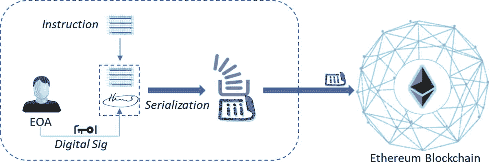

图 4-7

交易发起——放大视图

交易被注入区块链后会发生什么？如果它被验证有效，就会在每个以太坊节点上开始执行。在此交易执行过程中，以太坊被设计为跟踪“子状态”以追踪执行流程。这是因为，如果交易因“`gas`耗尽”而未能完成，则必须回滚到目前为止的整个执行过程。此外，执行过程中收集的信息在交易完成后也立即需要。因此，子状态包含以下内容：

- **自毁集合**：一组在交易完成后将被丢弃的账户（如果有的话）
- **日志系列**：归档且可索引的 EVM 代码执行“检查点”，用于追踪合约调用
- **退款余额**：交易执行后应退还给发送者账户的金额。以太坊中的存储相当昂贵，因此 EVM 中有一条`SSTORE`指令被用作退款计数器。退款计数器从零开始（无退款状态），每当交易或合约从存储中删除某些内容时，它就会递增。请注意，此退款金额与退还给发送者的未使用的`gas`不同，且是额外支付的。

在以太坊的早期版本中，无论交易或合约是成功执行还是中途失败，所有已使用的`gas`都会被消耗。这有时并不合理。如果执行因某些授权/权限问题或其他问题而停止，执行会停止，但剩余的`gas`仍然会被消耗。最近的拜占庭升级引入了类似异常处理的“`revert`”代码。如果合约需要停止，可以使用“`revert`”来回滚状态更改，返回失败原因，并将剩余`gas`记回发送者账户。交易或合约成功执行后，会发生状态转换，我们将在后续章节中深入探讨。

就像我们查看`blockchaininfo`来了解实时比特币交易一样，如果你查看以太坊的网站（`https://etherscan.io`），将会找到以下信息：

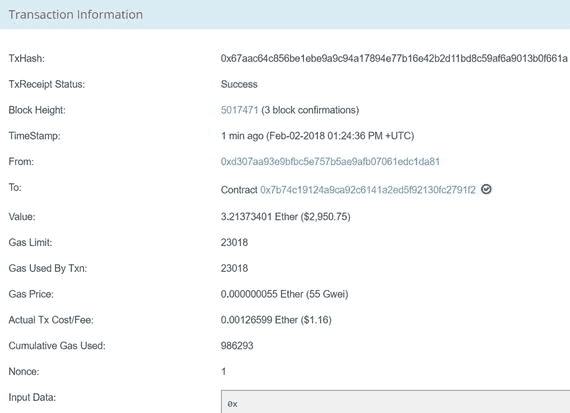

#### 以太坊状态转换函数

在上一节中，我们了解了以太坊交易和消息。我们现在知道，每当交易成功完成时，就会发生状态转换。因此，以太坊中的状态转换函数是：

```
APPLY(S,Tx) -> S'    \\where S is old state and S' is the new state
```

请参见图 4-8。

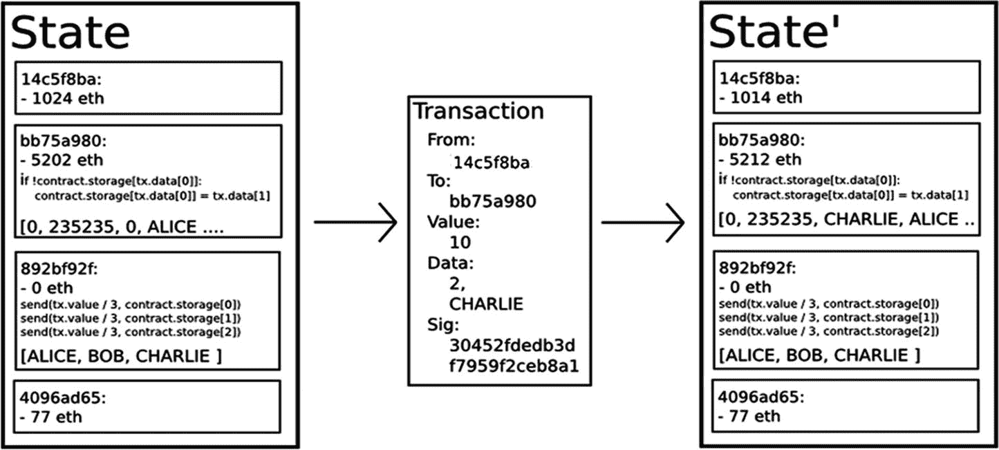

图 4-8

以太坊状态转换函数

因此，当`Tx`应用于状态`S`以产生改变的状态`S'`时，状态转换函数可以定义如下：

- 验证交易是否格式正确。
    - 具有正确数量的值。
    - 签名有效。
    - `nonce`与发送者账户中的`nonce`匹配。如果上述任何一点无效，则返回错误。
- 计算费用并结算账户。
    - 将交易费用计算为`gasLimit * gasPrice`。
    - 从签名中确定发送地址。
    - 从发送者账户余额中减去费用，并递增发送者的`nonce`。如果没有足够的余额支付，则返回错误。
- 初始化`GAS = gasLimit`，并扣除一定量的`gas`（按字节计算）作为交易费用。
- 将交易价值（可以是任何有价值的东西）从发送者账户转移到接收账户。请注意，交易可以用于任何具有内在价值的东西，如土地、车辆、ERC20 代币等，但`gas`价格必须以以太币计价，以便矿工接受交易。如果接收账户尚不存在，则创建它。如果接收账户是合约而非外部拥有账户（EOA），则运行合约代码，直至完成或执行耗尽`gas`。请注意，合约代码会在每个节点的 EVM 上作为区块验证过程的一部分执行，以便区块以及合约执行后的输出成为主区块链的一部分。
- 如果因为发送者没有足够的资金或代码执行耗尽`gas`而导致价值转移失败，则回滚除费用支付之外的所有状态更改（这要归功于 MPT 实现），并将费用添加到矿工账户。
- 否则，将所有剩余`gas`的费用退还给发送者，并将已为消耗的`gas`支付的费用发送给矿工。


#### Gas 与交易成本

以太坊上的交易基于“Gas”运行，这是以太坊中的基本计算单位。每笔交易，无论是发送到外部账户（EOA）还是合约，都必须指定 `gasLimit` 和 `gasPrice` 来计算费用。这笔费用支付给矿工，以补偿他们贡献的资源以及执行的工作。显然，矿工可以选择是否包含该交易并收取费用，这与比特币类似。

通常，一个计算步骤只需消耗 1 个 Gas，但某些计算密集型或存储密集型操作的成本更高。每字节的交易数据大约需要 5 个 Gas。看看下面这些示例：两个数相加（使用 EVM 操作码 `ADD`）大约需要 3 个 Gas；两个数相乘（使用 EVM 操作码 `MUL`）大约需要 5 个 Gas；计算哈希值（`SHA3`）大约需要 30 个 Gas（显然这是计算密集型操作）。存储成本也以类似方式计算，但出于充分理由，其成本相当高。根据设计，一笔交易可以包含无限量的数据。每字节非零交易数据需要花费 68 Gas。在“合约”中存储一个 256 位的字，大约需要 20,000 Gas。你可以在以太坊黄皮书中找到更多操作码及其对应的价格。那么总成本就是将所需 Gas 量乘以 `gasPrice`。与比特币不同，以太坊的成本计算更为复杂。它考虑了带宽、存储和计算成本。拥有这样的费用计算机制，可以防止攻击者试图注入无限循环进行计算（导致拒绝服务攻击）或通过存储无意义数据来消耗更多空间。

一笔交易的总以太币成本实际上取决于交易消耗的 Gas 量，乘以交易发起人在交易中指定的每单位 Gas 的价格。另一方面，矿工有一套策略来决定收取的 Gas 价格，这应该是交易发送方必须指定的最低金额，以确保交易不会被矿工拒绝。那么，如何计算一笔交易的总成本呢？不是近似值，而是实际成本？交易的总“以太币”成本基于两个因素：`gasUsed` 和 `gasPrice`。总成本 = `gasUsed * gasPrice`。`gasUsed` 部分是在执行 EVM 指令的操作码时消耗的总 Gas，而 `gasPrice` 是用户指定的价格。

如果计算步骤（包括交易、消息以及可能触发的任何子消息）所使用的 Gas 总量小于或等于 `gasLimit`，则该交易会被矿工处理。然而，如果总 Gas 超过了 `gasLimit`，则所有更改都会回滚（尽管这是一笔有效交易），但矿工仍然可以收取费用。那么，多余的 Gas 会怎样呢？交易执行后所有未使用的 Gas 会以以太币的形式退还给发送方。发送方无需担心超额支付，因为他们只需为实际消耗的 Gas 付费。这无疑意味着，设定一个远高于预估值的 Gas 上限来发送交易既重要又安全。同时，也建议不要支付过高的 `gasPrice`，而是使用来自 [`https://ethgasstation.info/`](https://ethgasstation.info/) 的平均 Gas 价格。

让我们逐一梳理在以太坊网络中发起一笔交易时的每个步骤，以便对流程建立具体的理解：

*   每笔交易必须定义其愿意花费的 `gasLimit`（`gasLimit` 也称为 `startGas`），以及每单位 Gas 愿意支付的费用（`gasPrice`）。在开始执行时，价值为 `gasLimit * gasPrice` 的以太币会从交易发送方的账户中扣除。请记住，这并非交易的实际总成本（在理想情况下应略高于此）。只有在交易完成后，其实际成本（`gasUsed * gasPrice`）才会确定，并据此对最初从发送方账户中扣除的金额（`gasLimit * gasPrice`）进行调整，余额会返还给发送方。在交易开始时就直接扣除金额（`gasLimit * gasPrice`），是因为存在一种可能性，即发送方在发起的交易执行中途可能破产。
*   交易执行期间的所有操作，包括数据库读写、消息传递以及 EVM 执行的每一个计算步骤（例如加法、减法、哈希等），都会消耗一定量的 Gas，这些消耗量是预定义的。
*   正常交易是指成功执行且未超过指定 `gasLimit` 的交易。对于此类交易，应会剩余一些 Gas，记为 `gas_rem`。交易成功执行后，交易发送方会收到 `gas_rem * gasPrice` 的退款，而该区块的矿工会获得 `(gasLimit - gas_rem) * gasPrice` 的奖励。
*   如果一笔交易在成功完成前 Gas 耗尽，则所有执行都会回滚，但该交易仍然有效。在这种情况下，交易的唯一结果是全部金额 `gasLimit * gasPrice` 都归矿工所有。
*   对于合约账户，当合约向另一个合约发送消息以进行子执行时，它也可以选择设置一个 `gasLimit`。此选项专门用于该消息引发的子执行，因为被调用的合约可能存在无限循环。如果子执行 Gas 耗尽，则子执行会回滚，这可以保护系统免受此类无限循环或蓄意的拒绝服务攻击企图。消耗的 Gas 仍然会被分配并归矿工所有。另外请注意，当消息由合约触发时，只有指令消耗 Gas，消息中的数据不消耗任何 Gas。这是因为来自父合约的数据无需再次复制，只需通过指针引用即可。

以太坊的第一个版本（Frontier）的默认 Gas 价格为 0.05e12 WEI（即以太币的最小面额）。在第二个版本（Homestead）中，默认 Gas 价格降到了 0.02e12 WEI。你可能会想，为什么 Gas 和以太币要相互解耦，而不是使用一个单一的计量单位，那样会更简单。其实，这是有意为之的设计，因为 Gas 单位与具有自然成本的计算单位（例如，每次计算的成本）很好地对应，而以太币的价格通常会因市场力量而波动。

我们已经知道，参与网络的每个以太坊节点都会运行 EVM，作为区块验证协议的一部分。这意味着所有节点都（冗余且并行地，但对于达成共识至关重要）执行同一组交易和合约。虽然这种冗余自然会使成本变得高昂，但也存在一种激励，促使人们不要将区块链用于那些可以在链下完成的计算（博弈论！）。


通常，每笔交易会收取 `21,000` gas 作为“基础费用”，以覆盖从签名计算发送方地址的椭圆曲线运算成本，以及存储交易的磁盘空间费用。有多种方法可以估算交易和合约的 gas 需求。例如：`estimateGas` 是一个估算某个函数 gas 需求的 Web3 函数。此外，要估算总成本，`gasPrice` 预言机是 `geth` 客户端中的一个辅助函数，而 `web3.eth.getGasPrice` 是一个用于查找近似 gas 价格的 Web3 原生函数。以下是可在 `Truffle` 中使用的示例代码：

```
var MyContract = artifacts.require("./MyTest.sol");
// getGasPrice 返回以 Wei 为单位的 gas 价格
MyContract.web3.eth.getGasPrice(function(error, result){
var gasPrice = Number(result);
console.log("当前 gas 价格为 " + gasPrice + " wei");
// 获取合约实例
MyContract.deployed().then(function(instance) {
// 检索函数 giveAwayDividend() 的 gas 估算
return instance.giveAwayDividend.estimateGas(1);
}).then(function(result) {
var gas = Number(result);
console.log("总 gas 估算 = " + gas + " units");
console.log("总交易成本估算（以 Wei 计）= " + (gas * gasPrice) + " wei");
console.log("总交易成本估算（以 Ether 计）= " + MyContract.web3.fromWei((gas * gasPrice), 'ether') + " Ether");
});
});
交易成本估算的示例代码
```

在 Solidity 中编写智能合约时，许多人更喜欢使用 `constant` 函数在链下执行某些计算，或只是向本地区块链发起 RPC 查询。由于这类 `constant` 函数不会改变区块链状态，因此在某种程度上它们无需成本，因为它们不消耗 gas。如果在任何交易中使用 `constant` 函数，则极有可能需要支付 gas 费用。

现在，我们来了解区块的 gas 限额。回想一下，比特币有 1MB 区块大小的预定义限制，而比特币现金有 2MB 的区块大小限制。矿工会尽可能多地积累能塞进这些区块的交易。然而，以太坊限制区块大小的方法截然不同。在以太坊中，区块大小由区块 gas 限额控制。不同交易有不同的 gas 限额；因此，根据区块 gas 限额，一定数量的交易会被组合在一起，使总交易 gas 限额小于区块 gas 限额。不同的矿工可以有不同的交易集合，他们愿意将其放入一个区块中。区块 gas 限额是动态计算的。以太坊协议允许区块的矿工将其区块 gas 限额向任一方向调整 `1/1024`（`0.0976%`）的因子。以太坊网络上的矿工使用诸如 `ethminer` 这样的挖矿程序。`ethminer` 是一个以太坊 GPU 挖矿工作端，它连接到 `geth` 或 Parity 以太坊客户端节点。`geth` 和 Parity 都有矿工可以更改的选项。

### 以太坊智能合约

与仅作为加密货币的比特币不同，以太坊的功能远不止于此——这要归功于智能合约。在前面的章节中学习合约账户时，我们已对智能合约有了初步了解。虽然我们将在后续章节深入探讨智能合约的开发方面，但本节我们将详细探究智能合约的真正本质。

首先，我们来谈谈它为什么叫这个名字？请注意，智能合约本身并没有什么“智能”可言。只有当你在其中编写了智能逻辑时，它才变得智能，而正是以太坊的优美之处让你能够做到这一点。让我们总结一下目前对以太坊智能合约的学习成果：

- 智能合约存在于以太坊区块链内部。
- 它们有自己的账户，因此拥有地址和余额。
- 它们能够发送消息和接收交易。
- 它们在收到交易时被激活，并且也可以被停用。
- 与其他交易一样，它们也需要支付执行费和存储费。

以太坊中的所有代码，包括智能合约，都会被编译成一种低级、基于堆栈的字节码语言，称为 EVM 代码，该代码在 EVM 上运行。用于编写智能合约的流行高级语言包括 Solidity、Serpent 和 LLL，它们各自的编译器会将高级代码转换为 EVM 字节码。我们了解了如何由任何外部代理（如 EOA）将合约添加到区块链中。由于以太坊中的计算和存储非常昂贵，因此建议尽可能以简单和优化的方式编写逻辑。当智能合约部署到以太坊区块链网络后，任何人都可以调用该智能合约的函数。这些函数通常内置了安全特性，以防止未经授权的访问；尽管如此，仍可能有人尝试调用，但不会成功。

如果你尝试想象一个以太坊区块链区块内的智能合约，它可能会如图 4-9 所示。

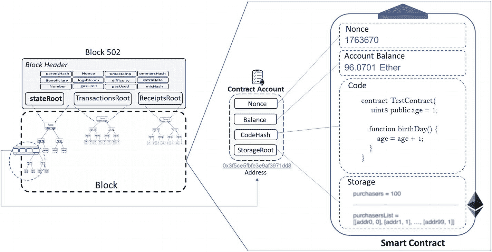

图 4-9

与区块相关的以太坊智能合约

现在，我们以投票应用程序为例。一个智能合约被编写出来，它具有一个地址（合约账户地址），并且根据其创建时间，成为区块链中某个区块的一部分。投票者可以向该地址发送交易（即投票）。合约代码的编写方式是：每收到一笔交易就增加一次投票计数，并在一定时间后自动终止，公布投票结果（以太坊状态变化）。请参见图 4-10，以获取高层次理解的图示。

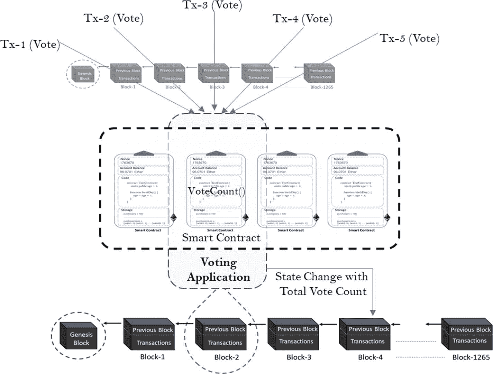

图 4-10

一个包含智能合约逻辑的应用程序

#### 合约创建

回想一下，我们学过合约创建交易，其唯一目的就是创建一个合约。与其他类型的交易相比，它稍有不同。因此，在触发合约创建交易来创建合约账户之前，必须先初始化所有类型账户都具备的四个属性：

- `nonce` 初始应设置为零。
- `账户余额` 应设置为发送方转移的价值（以 Ether 为单位），并且相同金额必须从发送方账户中扣除。
- `StorageRoot` 应为空。
- 合约的 `codeHash` 应设置为空字符串的 Keccak 256 位哈希值。

初始化账户后，就可以使用随交易发送的 `init` 代码（该代码执行实际工作）来创建账户。`init` 代码中可以定义一系列操作，其执行可能会影响执行状态之外的一些事件，例如：

- 可以更改账户的 `storage`。
- 可以创建更多账户。
- 可以触发进一步的消息调用。


### 以太坊虚拟机与代码执行

以太坊是一个可编程的区块链，允许用户通过图灵完备的语言创建任意复杂度的自定义操作。`EVM`是以太坊的执行引擎，作为智能合约的运行时环境。它是以太坊相较于其他区块链系统最核心的创新，正是基于`EVM`，智能合约技术有望迈向新的创新高度，而竞争已然开启。`EVM`在交易执行、改变以太坊状态以及达成共识方面也扮演着关键角色。`EVM`的设计目标如下：

- **简洁性**：其理念是使用底层结构让`EVM`尽可能简单。因此，底层操作码的数量被控制在最小范围，数据类型也同样精简，但仍可使用这些结构便捷地编写复杂逻辑。共有 160 条指令，其中 65 条在逻辑上互不相同。
- **绝对确定性**：确保使用相同输入集执行指令能产生相同输出集（确定性！），有助于维护`EVM`的完整性，避免任何歧义。确定性结合“计算步骤”的概念，有助于以极高精度估算燃料费用。
- **空间优化**：在去中心化系统中，节省空间是最大的考量。因此，`EVM`汇编被设计得尽可能紧凑。
- **针对原生操作调优**：`EVM`针对某些原生操作进行了调优，例如密码学中使用的特定算术类型（模运算）、读取区块或交易数据、与“状态”交互等。另一个例子是：为存储加密哈希值而采用 256 位（32 字节）字长，`EVM`在此字长上进行整数运算。
- **易于保障安全**：在某种程度上，燃料价格有助于确保`EVM`无法被利用。如果没有成本，攻击者就可以想方设法持续攻击系统。由于`EVM`上的几乎每一项操作都需要消耗燃料，因此在`EVM`上设计出良好的燃料成本模型应该是相对容易的。

我们了解到，以太坊网络中的每个参与节点都在本地运行`EVM`，执行所有交易和智能合约，并在本地保存最终状态。正是`EVM`将代码（智能合约）和数据写入区块链，并执行以图灵完备语言编写的交易代码和智能合约代码的指令（操作码）。也就是说，`EVM`充当以太坊智能合约的运行时环境，并确保代码的安全执行。显然，当代码或交易通过各自的数字签名验证后，它们会在`EVM`上执行。因此，只有通过`EVM`成功执行指令后，以太坊的状态才能发生改变。

除非将`EVM`与网络其余部分连接以参与 P2P 网络，否则它可以与主网络隔离。在隔离的沙盒环境中，`EVM`可用于测试智能合约，有助于构建更完善、更健壮且可投入生产的智能合约。

为了更深入地理解智能合约如何利用`EVM`工作，我们需要了解数据如何在任何`EVM`语言（例如`Solidity`、`Serpent`以及未来可能出现的语言）中进行组织、存储和操作。你可以将`EVM`视为一个数据库引擎。虽然我们不会深入探讨`Solidity`编程基础知识，但在本节中，我们将看到它如何与`EVM`交互。请看图 4-11。

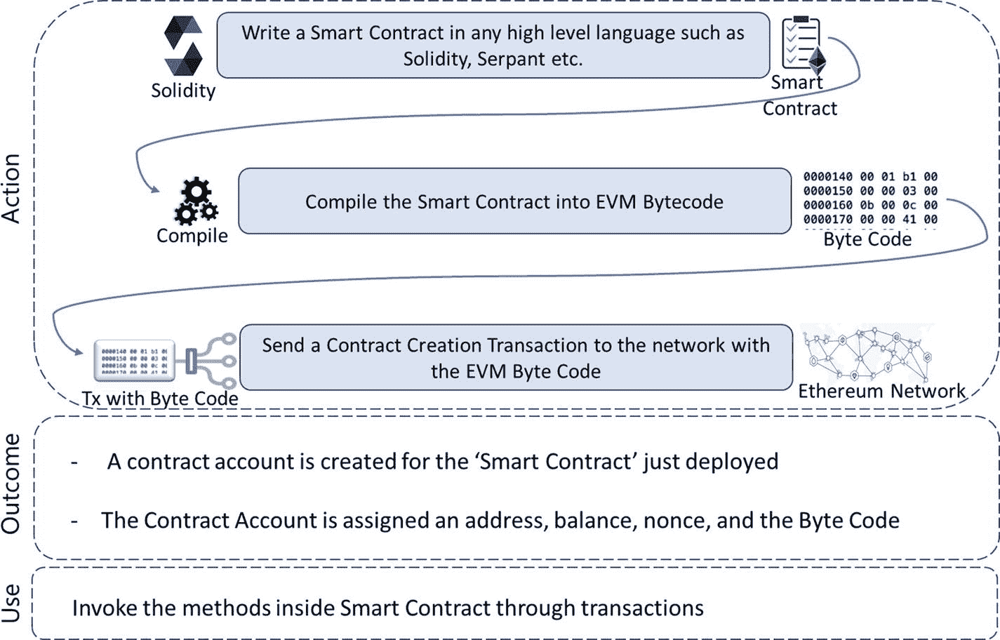

图 4-11

智能合约部署与使用

现在我们来理解`EVM`的内存管理。请看`EVM`遵循的以下三种策略：

- **存储（持久化）**：
  - 键值存储映射（即 256 位到 256 位的字映射）。这意味着键和值都是 256 位（即 32 字节）。
  - 在合约内部无法枚举存储内容。
  - 在任何时间点，合约的状态可由称为“状态变量”的合约级变量决定，这些变量始终位于“存储”中，并且在运行时无法更新。这意味着存储结构仅在合约创建时设置一次，之后无法更改。但可以通过`sendTransaction`调用改变其内容。
  - 读取/更新存储是一项昂贵的操作。
  - 合约不能读取、写入或更新任何不属于自己的存储空间。
  - `SSTORE`/`SLOAD`是常用的指令。例如：`SSTORE`指令从栈中弹出顶部两项，将第一项视为索引，并将第二项插入到合约存储中该索引位置。
- **内存（易失性）**：
  - 类似于通用计算机系统中任何代码或应用执行所需的 RAM，用于存储临时值。
  - 合约在执行期间可以通过付费使用任意数量的内存，执行完成后该内存空间会被清理。执行期间的输出可以推送到持久化存储中，供后续执行复用。
  - 与存储不同，内存实际上是一个连续的字节数组，按 256 位（32 字节）的块进行分配。
  - 初始时没有空间，并以 32 字节块为单位占用空间。
  - 如果没有`memory`关键字，像`Solidity`这样的智能合约语言会在存储中声明变量以实现持久化。
  - 内存不能在智能合约级别使用，只能在方法内部使用。
  - 函数参数几乎总是在内存中。
  - `MSTORE`/`MLOAD`是常用的指令。
- **栈**：
  - `EVM`基于栈，因此遵循后进先出原则，栈用于执行计算。
  - 栈条目也是 256 位字，用于模拟 256 位伪寄存器。它们用于保存“值”类型的局部变量，以及向指令或函数传递参数、进行内存操作和其他算法操作。
  - 最多允许 1024 个元素，且使用几乎免费。
  - 大部分栈操作限于栈顶区域。其执行方式与比特币脚本的执行方式非常相似。

当`EVM`运行且字节码随交易注入执行时，其完整计算状态可由以下元组定义：`[block_state, transaction, message, code, memory, stack, pc, gas]`。

你现在应该能理解所有这些字段了。它们包含我们讨论过的三种内存类型（`block_state`字段代表全局状态，用于存储）。`PC`字段类似于栈中待执行指令的指针。

在以太坊中，应用程序二进制接口（ABI）是一种抽象，它并非[以太坊核心协议](https://github.com/ethereum/yellowpaper)的一部分，但作为一种标准实践，用于访问智能合约中的字节码。虽然任何人都可以为其合约定义自己的 ABI 并遵守它以获得期望的输出，但使用`Solidity`会更简单。ABI 的目的如下：

- 如何以及调用智能合约中的哪些函数
- 信息作为输入传递给智能合约函数时应采用的二进制格式
- 调用函数后，预期函数执行结果输出的二进制格式

有了 ABI 规范，用两种不同语言编写的两个程序可以更容易地相互交互（尽管可能并非必需）。


## 以太坊生态

我们学习了核心组件，以理解以太坊实际上的运作方式。以太坊存在一些固有的局限性，例如：

- `EVM` 速度缓慢；不适用于大型计算。
- 区块链上的计算和存储成本高昂；建议使用链下计算，并采用 `IPFS`/`Swarm` 进行存储。
- 可扩展性是个问题；有多种技术方案应对，但这些方案取决于你处理的具体业务场景。
- 私有链更有可能蓬勃发展。

现在，让我们看一下以太坊技术栈，以从高层次了解以太坊生态。

### Swarm

它不仅是一个以 P2P 方式存储静态文件的分布式存储平台，还是一个分发服务。`Swarm` 确保了以太坊区块链数据、DApp 代码等内容的充分去中心化和冗余存储。与万维网不同，上传到 `Swarm` 的内容并非集中于单一网络服务器。它被设计为具有零停机时间，并且能够抵御 DDOS 攻击，具备容错能力。

### Whisper

它是一种通信协议，允许 DApp 之间相互通信。它提供了分布式且私密的消息传递功能，支持单播、多播和广播消息。

### DApp

一个 DApp 通常由前端和后端两部分组成。后端代码在由智能合约编码的实际区块链上运行。前端代码和用户界面可用任何语言编写，例如 HTML、CSS 和 JavaScript，只要它能调用其后端即可。此外，前端可以托管在像 `SWARM` 或 `IPFS` 这样的去中心化存储上，而不是中心化的网络服务器上。

用户界面组件将缓存在某种去中心化的、类似 BitTorrent 的云端，并在需要时由 ÐApp 浏览器拉取。就像任何应用商店一样，可以在浏览器中浏览分布式 DApp 的目录。最终用户可以在其浏览器中安装任何感兴趣的 DApp。

### 开发组件

用于在以太坊上开发去中心化应用并与之交互的组件有很多。以下是几个流行的组件，但还有更多组件等待你去探索。我们将简要了解它们是什么，并在后续章节中深入探讨这些主题。

#### Web3.js

这是开发 DApp 时一个非常重要的元素。

#### Truffle

`Truffle` 提供了创建、编译、部署和测试区块链应用所需的构建模块。

#### Mist 钱包

我们在前面的章节中了解到，与区块链应用交互需要钱包，以太坊也是如此。为了存储、接收和发送以太币，用户需要一个钱包。`Mist 钱包` 是一种基于 UI 的解决方案，可用于连接以太坊区块链。使用 `Mist` 钱包，可以创建账户、设计和部署合约、在账户间转移以太币以及查看交易详情。

在内部，`Mist` 依赖 `geth` 客户端（即 Go 以太坊客户端）来无缝执行所有操作。

## 总结

在本章中，我们涵盖了以太坊区块链的核心组件，并理解了其设计考量。我们能够区分以太坊与比特币区块链的设计，并理解了以太坊区块链如何在单一平台上促进不同用例的开发。我们深入探讨了智能合约以及以太坊虚拟机（EVM）如何以去中心化方式执行它。

我们将在第 5 章中进一步探索区块链的开发层面，然后在第 6 章中建立对以太坊开发的扎实理解。

