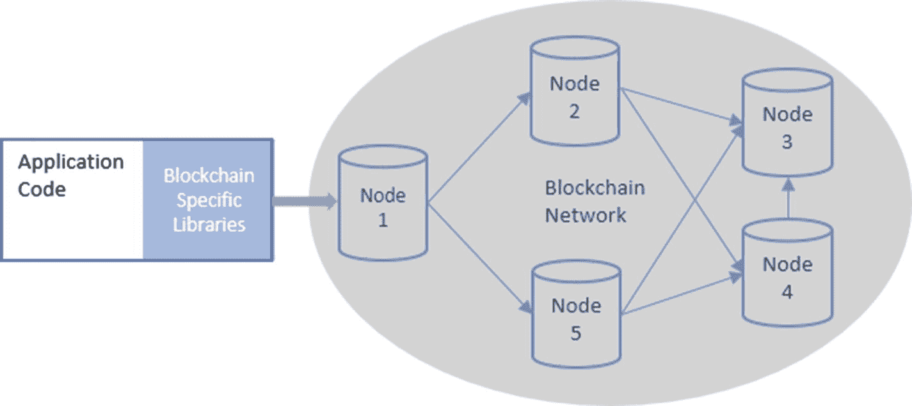
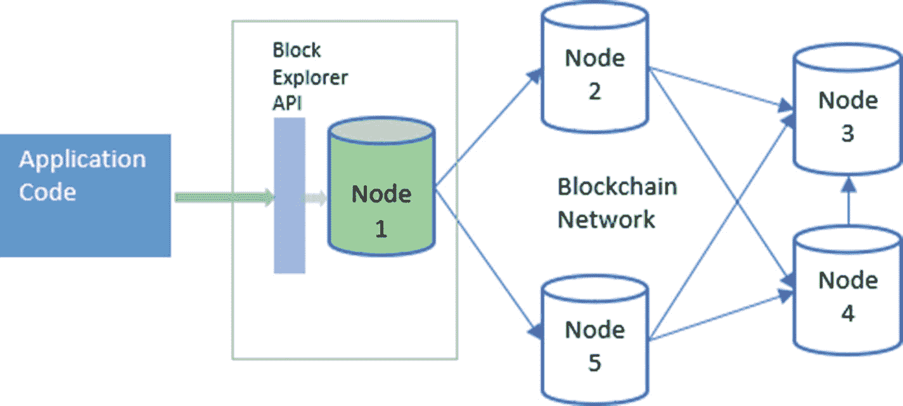
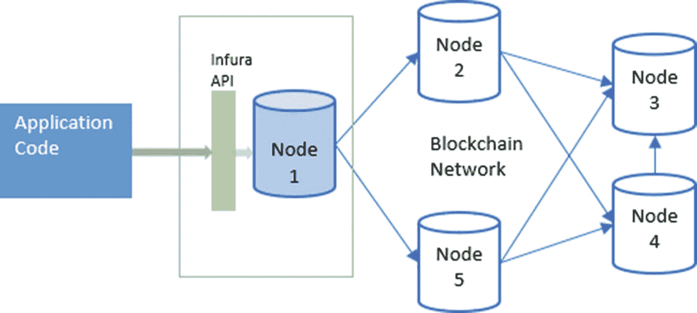
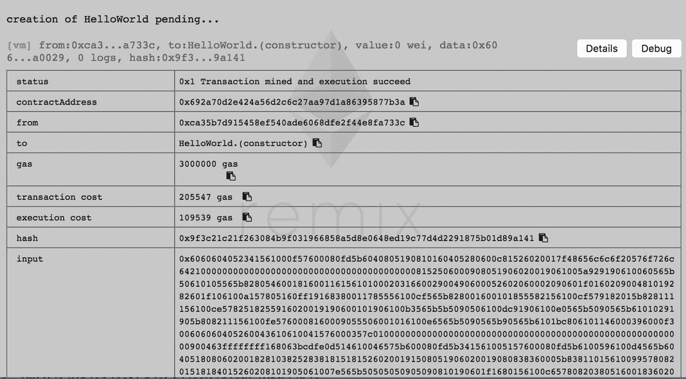
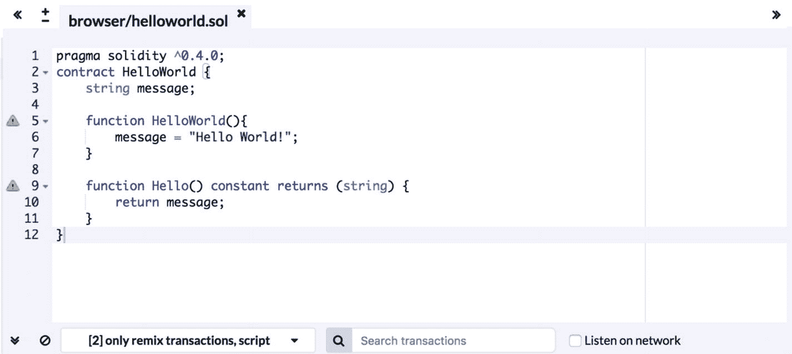
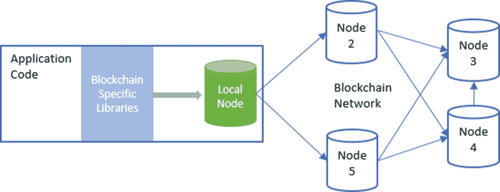
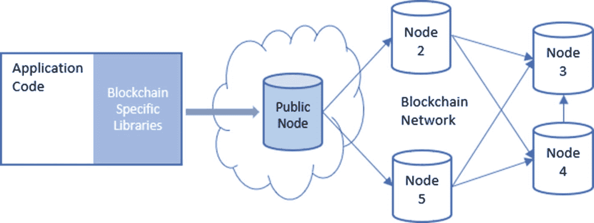

# 5. 区块链应用开发

在前面的章节中，我们深入探讨了区块链是什么以及比特币和以太坊区块链如何运作的理论细节。我们还研究了构成区块链技术的不同密码学和数学算法、定理及证明。

在本章中，我们将首先了解区块链应用与传统应用的不同之处，然后深入探讨如何在区块链上构建应用。我们还将探讨搭建开始开发去中心化应用所需的基础设施。

## 去中心化应用

区块链技术的流行主要源于它能够解决各种现实世界问题，因为它比传统技术提供了更高的透明度和安全性（防篡改）。许多初创公司和社区成员已经确定了大量旨在解决这些问题的区块链用例。为了实现这些用例，我们创建了在区块链之上运行的应用。通常，与区块链交互的应用被称为“去中心化应用”，或简称为 `DApps` 或 `dApps`。

为了更好地理解 `DApps`，让我们首先回顾一下什么是区块链。区块链或分布式账本本质上是一种特殊类型的数据库，其数据不存储在中心化服务器上，而是在网络中所有参与节点上复制。此外，区块链上的数据经过加密签名，证明了将该数据写入区块链的实体的身份。为了利用这个数据库来存储和检索数据，我们创建了被称为 `DApps` 的应用，因为这些应用不依赖中心化数据库，而是基于区块链的去中心化数据存储。这些应用不存在单点故障或单点控制。

让我们举一个 `DApp` 的例子。考虑一个供应链场景，其中涉及多个供应商和物流合作伙伴参与成品的供应链流程。为了将区块链技术用于这个供应链用例，我们需要这样做：

- 我们需要在每个供应商处设置区块链节点，以便他们能够参与共享数据的共识过程。
- 我们需要一个接口，使所有参与者和用户能够存储、检索、验证和评估区块链上的数据。制造商将使用此接口输入有关已生产商品的信息；物流合作伙伴用于输入有关商品转移的信息；仓储供应商用于验证已生产商品和已转移商品是否同步，等等。这个接口就是我们的供应链 `DApp`。

另一个 `DApp` 的例子是基于区块链的投票系统。利用区块链进行投票，我们能够使整个过程更加透明和安全，因为每一票都会经过加密签名。我们需要创建一个应用，该应用能够提供选民可以投票的候选人列表，并且此应用还会提供一个简单的界面来提交和记录选票。


## 区块链应用开发

在开始编写代码之前，我们先来了解一些关于区块链应用开发的基本概念。通常，我们在开发传统软件应用时，习惯使用对象、类、函数等概念。然而，当涉及到区块链应用时，我们需要理解更多概念，例如交易、账户和地址、通证和钱包、输入和输出以及余额。去中心化应用与区块链之间的握手和请求/响应机制正是由这些概念驱动的。

首先，在开发区块链应用时，我们需要确定应用数据如何映射到区块链数据模型。例如，在以太坊区块链上开发去中心化应用时，我们需要理解如何用 Solidity 数据结构来表示应用状态，以及如何用以太坊智能合约来表达应用行为。我们知道，区块链上的所有数据都由用户的私钥进行加密签名，因此我们需要确定应用中的哪些实体在区块链上拥有身份或地址。在传统应用中，通常并非如此，因为数据并不总是被签名的。对于区块链应用，我们需要定义谁是签名者，以及他们会签署哪些数据。例如，在一个投票去中心化应用中，每位选民都对其投票进行加密签名，这很容易识别。但是，假设一个场景，我们需要将一个现有的传统分布式系统应用（其数据存储在多个 SQL 表和数据库中）迁移到基于以太坊区块链的去中心化应用。在这种情况下，我们需要确定哪个表中的哪些实体将拥有其身份，以及哪些实体将附加到其他身份上。

在接下来的几个小节中，我们将通过简单的代码片段探索如何运用比特币和以太坊的应用程序接口发送交易。本练习的目的是熟悉区块链应用程序接口和常见的编程实践。为简单起见，我们将使用这些区块链的公共测试网络，并使用 JavaScript 编写代码。选择 JavaScript 的原因是，在撰写本文时，这两个区块链都有稳定的 JavaScript 库可用，并且在编写代码时更容易理解我们所采用方法的异同。代码片段在每个逻辑步骤后都有详细解释，即使读者不熟悉 JavaScript 编程也能理解。

### 库和工具

回顾一下第 2 章，区块链技术中使用了大量的加密算法和数学知识。在从应用向区块链发送交易之前，我们需要先准备好它们。交易的准备工作包括定义账户和地址、向交易对象添加所需参数和值、以及使用私钥进行签名等。在开发应用时，最好使用经过验证和测试的库来准备交易，而不是从头开始编写代码。比特币和以太坊的一些稳定库都是开源的，可用于准备和签署交易，并将它们发送到区块链节点/网络。为了进行我们的代码练习，我们将使用 `bitcoinjs` JavaScript 库与比特币区块链交互，并使用 `web3.js` JavaScript 库与以太坊区块链交互。这两个库都可以作为 node.js 包使用，可以通过 `npm` 命令下载和集成。

**重要说明**

本章中的代码练习基于 node.js 应用。这是为了确保我们作为练习的一部分编写的代码有一个容器，可以在其中运行并与提到的其他预打包库（node 模块）进行交互。对 node.js 应用开发有所了解会更好，建议读者学习一个关于 node.js 和 npm 的入门教程。

图 5-1 展示了去中心化应用如何与区块链交互。



图 5-1

区块链应用交互

### 与比特币区块链交互

在本节中，我们将从一个地址向另一个地址发送一笔交易到比特币公共测试网络。可以将其视为比特币区块链的“Hello World”应用。如前所述，我们将使用 `bitcoinjs` JavaScript 库来准备和签署交易。为简单起见，我们不会托管本地的比特币节点，而是使用由第三方提供商区块浏览器托管的公共比特币测试网络节点。请注意，您可以为您的应用使用任何提供商，也可以托管本地节点。您所需要做的就是将您的应用代码指向连接到您首选的节点。

回顾前几章，比特币区块链主要用于实现点对点支付。一笔比特币交易基本上只是将比特币从一个地址转移到另一个地址。以下是我们如何以编程方式实现这一点。

下图（图 5-2）展示了这段代码如何与比特币区块链交互。注意：该图仅为粗略示意图，未详细展示区块浏览器服务架构。



图 5-2

使用区块浏览器应用程序接口与比特币区块链交互的应用

本节以下的小标题是需要遵循的步骤（按顺序），以使用 JavaScript 向比特币测试网络发送交易。

#### 在 node.js 应用中设置并初始化 bitcoinjs 库

在调用比特币交易特定的库代码之前，我们将安装并初始化 `bitcoinjs` 库。

使用 `npm init` 命令初始化 node.js 应用后，让我们为我们的应用创建一个入口点 `index.js`，并创建一个自定义 JavaScript 模块 `btc.js` 来调用 `bitcoinjs` 库的函数。在 `index.js` 中导入 `btc.js`。现在，我们可以开始执行后续步骤了。

首先，让我们安装 `bitcoinjs` 的 node 模块：

```
npm install --save bitcoinjs-lib
```

然后，在我们的比特币模块 `btc.js` 中，我们将使用 `require` 关键字初始化 `bitcoinjs` 库：

```
var btc = require('bitcoinjs-lib');
```

现在我们就可以使用这个 `btc` 变量来调用 `bitcoinjs` 库的函数了。此外，作为初始化过程的一部分，我们还初始化了另外几个变量：

*   目标网络：我们使用的是比特币测试网络。

    ```
    var network = btc.networks.testnet;
    ```

*   用于获取和发送交易的公共节点应用程序接口端点：我们使用了比特币测试网络的区块浏览器应用程序接口。请注意，您可以将此应用程序接口端点替换为您偏好的端点。

    ```
    var blockExplorerTestnetApiEndpoint = 'https://testnet.blockexplorer.com/api/';
    ```

至此，我们已经准备好使用 node.js 应用创建比特币交易了。


#### 为发送方和接收方创建密钥对

首先需要为发送方和接收方创建密钥对。这些密钥对就像区块链上标识用户的账户。那么，我们先为 Alice 和 Bob 创建两个密钥对。

```
var getKeys = function () {
var aliceKeys = btc.ECPair.makeRandom({
network: network
});
var bobKeys = btc.ECPair.makeRandom({
network: network
});
var alicePublic = aliceKeys.getAddress();
var alicePrivate = aliceKeys.toWIF();
var bobPublic = bobKeys.getAddress();
var bobPrivate = bobKeys.toWIF();
console.log(alicePublic, alicePrivate, bobPublic, bobPrivate);
};
```

在上面的代码片段中，我们使用了 bitcoinjs 库中的`ECPair`类，并调用了它的`makeRandom`方法，为测试网络创建了随机的密钥对；请注意为网络类型传递的参数。

现在我们已经创建了两个密钥对，接下来就用它们来进行比特币的转账。在几乎所有的密码学示例中，Alice 和 Bob 都是最常用的角色，正如前面密钥对变量所展示的那样。然而，每当我们看到密码学示例时，通常都是 Alice 加密/签名某些内容并发送给 Bob。正因如此，我们觉得 Bob 欠了 Alice 不少人情，所以在这个例子中，我们将帮 Bob 偿还一部分债务。我们将进行一笔从 Bob 到 Alice 的比特币交易示例。

#### 在发送方的钱包中获取测试比特币

我们已经确定，在这个比特币交易示例中，Bob 将扮演发送方的角色。在他向 Alice 发送任何比特币之前，他需要先拥有这些比特币。我们知道这个示例交易针对的是比特币测试网络，不涉及真实货币，但我们仍然需要 Bob 的钱包里有一些测试比特币。获取测试网络比特币的一个简单方法是在网上索取。互联网上有很多网站提供了简单的网页表单，可以接收比特币测试网络地址，然后向这些地址发送测试比特币。这类服务被称为比特币测试网络水龙头，如果你在网上搜索这个词，搜索结果中会出现很多这样的服务。我们不会列出或推荐任何特定的测试网络水龙头，因为它们通常不是永久性的。一旦某个水龙头服务提供商用完了测试币，或者他们不想再提供服务了，就会关闭它。但与此同时，新的水龙头服务会不断出现。这些水龙头服务的一部分列表也可以在比特币维基的测试网络页面上找到。

另一种获取测试网络比特币的方法是搭建一个指向测试网络的本地比特币节点，然后进行挖矿。比特币测试网络的区块挖矿难度远低于主网络。当你正在构建一个生产级的比特币应用程序并需要频繁测试时，这种方法可能更适合进阶用户。与其每次想测试应用程序时都去索取测试币，不如自己挖矿获取。

对于这个简单的示例，我们只需从测试网络水龙头获取一些比特币即可。在上面的代码片段中，`bobPublic`变量的值就是 Bob 的比特币测试网络地址。当我们运行这段代码时，它生成了`"msDkUzzd69idLLGCkDFDjVRz44jHcV3pW2"`作为 Bob 的地址。这也是 Bob 经过 Base58 编码的公钥。我们将把这个值提交到某个测试网络水龙头的网页表单中，作为回报，我们会收到一个交易 ID。如果我们在任何一个比特币测试网络浏览器上查询该交易 ID，就会看到其他某个地址向我们提交的表单中的 Bob 地址发送了一些测试比特币。

#### 获取发送方的未花费输出

现在我们知道 Bob 的钱包里有一些测试比特币了，我们可以通过一笔比特币交易花掉它们并转给 Alice。让我们回顾一下第 3 章中关于比特币交易如何由输入和输出构成的内容。你可以通过将未花费的输出添加为你想要花费它们的交易的输入，来花掉这些未花费输出。要做到这一点，首先需要向网络查询发送方的未花费输出。以下是我们将如何使用区块浏览器 API 为 Bob 的比特币测试网络地址执行此操作。为了获取未花费输出，我们将向 UTXO 端点发送一个 HTTP 请求，请求中包含 Bob 的地址`"msDkUzzd69idLLGCkDFDjVRz44jHcV3pW2"`。

```
var getOutputs = function () {
var url = blockExplorerTestnetApiEndpoint + 'addr/' + msDkUzzd69idLLGCkDFDjVRz44jHcV3pW2 + '/utxo';
return new Promise(function (resolve, reject) {
request.get(url, function (err, res, body) {
if (err) {
reject(err);
}
resolve(body);
});
});
};
```

在上面的代码片段中，我们使用了 Node.js 的`request`模块，通过一个 Node.js 应用程序来发送 HTTP 请求。你可以随意使用自己喜爱的 HTTP 库/模块。这个代码片段是一个 JavaScript 函数，它返回一个 Promise，这个 Promise 会解析为 API 方法返回的响应体。响应内容如下所示：

```
[
{
address: 'msDkUzzd69idLLGCkDFDjVRz44jHcV3pW2',
txid: 'db2e5966c5139c6e937203d567403867643482bbd9a6624752bbc583ca259958',
vout: 0,
scriptPubKey: '76a914806094191cbd4fcd8b4169a70588adc51dc02d6888ac',
amount: 0.99992,
satoshis: 99992000,
height: 1258815,
confirmations: 1011
},
{
address: 'msDkUzzd69idLLGCkDFDjVRz44jHcV3pW2',
txid: '5b88d5fc4675bb86b0a3a7fc5a36df9c425c3880a7453e3afeb4934e6d1d928e',
vout: 1,
scriptPubKey: '76a914806094191cbd4fcd8b4169a70588adc51dc02d6888ac',
amount: 0.99998,
satoshis: 99998000,
height: 1258814,
confirmations: 1012
}
]
```

该调用返回的响应体是一个包含两个对象的 JSON 数组。每个对象代表 Bob 的一个未花费输出。每个输出都有`txid`，即该输出所属的交易 ID；有与输出相关联的金额`amount`；还有`vout`，即该输出在交易中的序号或索引。JSON 对象中还包含其他一些信息，但这些信息在交易准备过程中不会被用到。

以数组中的第一个对象为例，它表示比特币测试网络地址`"msDkUzzd69idLLGCkDFDjVRz44jHcV3pW2"`有来自交易`db2e5966c5139c6e937203d567403867643482bbd9a6624752bbc583ca259958`索引位置`0`的`99992000`个未花费聪。类似地，第二个对象表示有来自交易`5b88d5fc4675bb86b0a3a7fc5a36df9c425c3880a7453e3afeb4934e6d1d928e`索引位置`1`的`99998000`个未花费聪。

别忘了，`"msDkUzzd69idLLGCkDFDjVRz44jHcV3pW2"`是 Bob 的比特币测试网络地址，我们是在前面第 2 步中创建的这个地址。现在我们知道 Bob 拥有这么多聪，他可以在新的交易中花费它们了。


#### 准备比特币交易

下一步是准备一笔比特币交易，通过该交易，鲍勃可以将测试币发送给爱丽丝。准备交易主要是定义其输入、输出和金额。

根据上一步骤，我们知道鲍勃在其比特币测试网地址下有两个未花费的输出，现在让我们使用输出数组的第一个元素。将其添加为交易的输入。

```
var utxo = JSON.parse(body.toString());
var transaction = new btc.TransactionBuilder(network);
transaction.addInput(utxo[0].txid, utxo[0].vout);
```

在上述代码片段中，我们首先解析了来自上一个 API 调用的响应，以获取鲍勃的未花费输出。然后，我们使用`bitcoinjs`库为比特币测试网络创建了一个交易构建器对象。在最后一行，我们定义了一个交易输入。请注意，此输入引用了`utxo`数组中索引为 0 的元素，该元素来自上一步的 API 调用。我们将未花费输出中的交易 ID（`txid`）和`vout`作为输入参数传递给了`transaction.addInput`方法。

本质上，我们正在定义我们要花费什么以及从何处获得它。

接下来，我们添加交易输出。这是指定我们打算如何花费输入中添加内容的地方。在下面一行中，我们通过调用交易构建器对象上的`addOutput`方法，并传入目标地址和金额，添加了一个交易输出。鲍勃想向爱丽丝发送 99,990,000 聪。请注意，我们使用了爱丽丝的比特币测试网地址作为该函数的第一个参数。

```
transaction.addOutput(alicePublic, 99990000);
```

虽然在此示例交易中我们只使用了一个输入和一个输出，但一笔交易可以有多个输入和输出。需要特别注意的一点是，输入的总金额不应少于输出的总金额。大多数情况下，输入的金额会略高于输出的金额，差额即为支付给矿工的交易费用，以激励他们在挖掘下一个区块时将此交易包含在内。

在此交易中，我们有 2,000 聪作为交易费用，这是输入金额（99,992,000）与输出金额（99,999,000）之间的差额。请注意，我们无需为交易费用创建任何输出；输入与输出总金额之间的差额会自动被视为交易费用。

同时注意，我们无法部分花费未花费的输出。如果一个未花费输出关联了 x 数量的比特币，那么当将此未花费输出作为输入添加到交易中时，我们必须花费全部 x 个比特币。因此，如果鲍勃不想将他的未花费输出所关联的全部 99,990,000 聪都转给爱丽丝，那么我们需要通过向交易添加另一个输出，其金额等于未花费总金额与鲍勃想给爱丽丝的金额之间的差额，从而将剩余部分返还给鲍勃。

#### 签署交易输入

现在，我们已经在交易中定义了输入和输出，需要使用鲍勃的密钥来签署这些输入。下面这行代码调用交易构建器对象上的`sign`函数，使用鲍勃的私钥对交易进行加密签名，但它将整个密钥对对象作为输入参数。

```
transaction.sign(0, bobKeys);
```

请注意，`transaction.sign`函数将输入的索引和完整的密钥对作为输入参数。在此交易中，因为我们只有一个输入，所以传递的索引是 0。

至此，我们的交易已经准备就绪并已签署。

#### 创建交易十六进制字符串

现在，我们将从交易对象创建一个十六进制字符串。

```
var transactionHex = transaction.build().toHex();
```

这行代码的输出是以下字符串，它代表了我们准备好的交易；此步骤是必需的，因为发送交易 API 接受原始交易作为字符串。

#### 将交易广播到网络

最后，我们使用上一步生成的十六进制字符串值，通过 API 将其发送到区块浏览器的公共测试网节点。

```
var txPushUrl = blockExplorerTestnetApiEndpoint + 'tx/send';
request.post({
url: txPushUrl,
json: {
rawtx: transactionHex
}
}, function (err, res, body) {
if (err) console.log(err);
console.log(res);
console.log(body);
});
```

如果交易被区块浏览器公共节点接受，我们将收到一个交易 ID 作为此 API 调用的响应。

```
{
txid: "db2e5966c5139c6e937203d567403867643482bbd9a6624752bbc583ca259958"
}
```

现在我们有了自己交易的交易 ID，就可以在任何在线测试网浏览器上查询它，查看它是否（以及何时）被挖出，以及它有多少个确认数。

综合起来，以下是使用 JavaScript 发送比特币测试网交易的完整代码。输入参数是我们在步骤 1 中创建的比特币测试网密钥对。

```
var createTransaction = function (aliceKeys, bobKeys) {
getOutputs(bobKeys.getAddress()).then(function (res) {
var utxo = JSON.parse(res.toString());
var transaction = new btc.TransactionBuilder(network);
transaction.addInput(utxo[0].txid, utxo[0].vout);
transaction.addOutput(alicekeys.getAddress(), 99990000);
transaction.sign(0, bobKeys);
var transactionHex = transaction.build().toHex();
var txPushUrl = blockExplorerTestnetApiEndpoint + 'tx/send';
request.post({
url: txPushUrl,
json: {
rawtx: transactionHex
}
}, function (err, res, body) {
if (err) console.log(err);
console.log(res);
console.log(body);
});
});
};
```

在本节中，我们学习了如何以编程方式向比特币测试网络发送交易。类似地，我们可以通过在库函数和 API 端点中将主网络设为目标来向比特币主网络发送交易。我们还使用了查询 API 来获取比特币地址的未花费输出。这些功能可用于创建一个简单的比特币钱包应用程序，以查询和管理比特币地址和交易。


### 以编程方式与以太坊交互——发送交易

与比特币区块链相比，以太坊区块链在区块链应用开发方面提供了更多功能。使用智能合约在区块链上执行逻辑的能力是以太坊区块链的关键特性，它使开发者能够创建去中心化应用。在本节中，我们将学习如何使用 JavaScript 以编程方式与以太坊区块链交互。我们将探讨以太坊应用编程的主要方面，从简单的交易到创建和调用智能合约。

如同上一节中我们为与比特币区块链交互所做的那样，我们也将使用 JavaScript 库和测试网络来与以太坊交互。我们将使用 `web3` JavaScript 库来操作以太坊。该库封装了许多以太坊 JSON-RPC API，并提供了易于使用的函数来使用 JavaScript 创建以太坊 DApp。在撰写本文时，我们使用的 `web3` JavaScript 库版本大于且兼容 `1.0.0-beta.28` 版本。

对于测试网络，我们将使用以太坊区块链的 Ropsten 测试网络。

为简化操作，我们将再次使用一个公共托管的以太坊测试网络节点，这样我们在运行这些代码片段时就无需托管本地节点。不过，所有代码片段也应当能在本地托管节点上运行。我们将使用 Infura 服务提供的以太坊 API。Infura 是一个提供公共托管以太坊节点的服务，以便开发者能够轻松测试他们的以太坊应用。在使用 Infura API 之前，需要完成一个简单且免费的注册步骤，因此我们将访问 [`https://infura.io`](https://infura.io/) 进行注册。注册后我们会获得一个 API 密钥。使用此 API 密钥，我们就可以调用 Infura API 了。

下图（图 5-3）展示了这段代码如何与以太坊区块链交互。注意：该图仅为粗略示意图，并未详细展示 Infura 服务架构。



图 5-3

使用 Infura API 服务与以太坊区块链交互的应用

本节的以下小节是按顺序执行的步骤，用于使用 JavaScript 向以太坊 Ropsten 测试网络发送交易。

#### 设置库和连接

首先，我们在 Node.js 应用中安装 `web3` 库。请注意安装命令中提到的库的特定版本。这是因为该库的 `1.0.0` 版本提供了更多可用的 API 和函数，从而减少了对其他外部包的依赖。

```
npm install web3@1.0.0-beta.28
```

然后，我们使用 `require` 关键字在 Node.js 以太坊模块中初始化该库：

```
var Web3 = require('web3');
```

现在，我们有了 `web3` 库的引用，但我们需要先实例化它才能使用。以下代码行创建了一个新的 `Web3` 对象实例，并将 Infura 托管的以太坊 Ropsten 测试网络节点设置为该 `Web3` 实例的提供者。

```
var web3 = new Web3(new Web3.providers.HttpProvider('https://ropsten.infura.io/'));
```

#### 设置以太坊账户

现在一切就绪，我们来向以太坊区块链发送一笔交易。在这笔交易中，我们将从一个账户向另一个账户发送一些以太币。回顾第 4 章，以太坊不使用 UTXO 模型，而是使用账户和余额模型。

基本上，以太坊区块链像银行一样通过账户和余额来管理状态和资产。这里没有输入和输出。你可以简单地将以太币从一个账户发送到另一个账户，以太坊会确保这些账户的状态在所有节点上得到更新。

要向以太坊发送一笔将以太币从一个账户转移到其他账户的交易，我们首先需要几个以太坊账户。让我们先为 Alice 和 Bob 创建两个账户。

以下代码片段调用了 `web3` 库的账户创建函数，并创建了两个账户。

```
var createAccounts = function () {
var aliceKeys = web3.eth.accounts.create();
console.log(aliceKeys);
var bobKeys = web3.eth.accounts.create();
console.log(bobKeys);
};
```

以下是运行上述代码片段后在控制台窗口中得到的输出。

```
{
address: '0xAff9d328E8181aE831Bc426347949EB7946A88DA',
privateKey: '0x9fb71152b32cb90982f95e2b1bf2a5b6b2a53855eacf59d132a2b7f043cfddf5',
signTransaction: [Function: signTransaction],
sign: [Function: sign],
encrypt: [Function: encrypt]
}
{
address: '0x22013fff98c2909bbFCcdABb411D3715fDB341eA',
privateKey: '0xc6676b7262dab1a3a28a781c77110b63ab8cd5eae2a5a828ba3b1ad28e9f5a9b',
signTransaction: [Function: signTransaction],
sign: [Function: sign],
encrypt: [Function: encrypt]
}
```

正如你所看到的，除了地址和私钥之外，每个账户创建函数调用的输出还包含一些函数。目前，我们将重点关注返回对象的 `address` 和 `privateKey`。`address` 是所生成私钥的 ECDSA 公钥的 Keccak-256 哈希值。这个 `address` 和 `privateKey` 组合代表以太坊区块链上的一个账户。你可以向该 `address` 发送以太币，也可以使用对应地址的 `privateKey` 来花费这些以太币。

#### 在发送方账户中获取测试以太币

现在，为了创建一笔将以太币从一个账户转移到另一个账户的以太坊交易，我们首先需要在一个账户中拥有一些以太币。回想一下比特币编程部分，我们使用了测试网水龙头在我们生成的地址上获取一些测试比特币。对于以太坊，我们也将采用同样的方法。请记住，我们的目标是以太坊的 Ropsten 测试网络，因此我们需要在互联网上寻找一个 Ropsten 水龙头。在本例中，我们将前一个代码片段中生成的 Alice 地址提交给了以太坊 Ropsten 测试网络水龙头，并在该地址上收到了三个以太币。

在 Alice 的地址收到以太币后，让我们检查一下该地址的余额，以确认我们是否真的拥有这些以太币。虽然我们可以使用任何在线以太坊浏览器来检查该地址的余额，但这里我们使用代码来实现。以下代码片段调用了 `getBalance` 函数，并将 Alice 的地址作为输入参数传入。

```
var getBalance = function () {
web3.eth.getBalance('0xAff9d328E8181aE831Bc426347949EB7946A88DA').then(console.log);
};
```

然后我们得到以下输出作为 Alice 地址的余额。这是一个巨大的数字，但实际上这是以 `wei` 为单位的余额值。`Wei` 是以太币的最小单位。一个以太币等于 10¹⁸ `wei`。因此，下面的数值等于三个以太币，正是我们从测试网络水龙头收到的数量。

```
3000000000000000 000
```


#### 准备以太坊交易

现在我们已经让爱丽丝拥有了一些测试以太币，接下来我们将创建一笔以太坊交易，将其中一部分以太币发送给鲍勃。回想一下，以太坊由于采用账户和余额系统，因此不需要像比特币那样处理输入、输出以及 UTXO 查询。所以，我们只需要在交易中指定`from`地址（发送方地址）、`to`地址（接收方地址）、发送的以太币数量以及其他一些字段即可。

另外，请注意，在比特币交易中我们无需指定交易费用；然而在以太坊交易中，我们需要指定两个相关字段：一个是`gas`限制，另一个是`gasPrice`。回顾第 4 章的内容，gas 是我们需要支付给以太坊网络以确认交易并将其添加到区块中的交易费用单位。`gasPrice`则是我们愿意为每单位 gas 支付的以太币数量（以 gwei 为单位）。一笔交易允许使用的最大费用就是`gas`与`gasPrice`的乘积。

因此，对于这个示例交易，我们定义一个包含以下字段的 JSON 对象。其中，`from`字段是爱丽丝的地址，`to`字段是鲍勃的地址，`value`字段是以 wei 为单位的一个以太币。我们选择的`gasPrice`是 20 gwei，并且愿意为此交易支付的最大 gas 数量为 42,000。

另外，请注意我们将`data`字段留空了。我们将在后面的智能合约部分再回过头来讨论它。

```
{
from: "0xAff9d328E8181aE831Bc426347949EB7946A88DA",
gasPrice: "20000000000",
gas: "42000",
to: '0x22013fff98c2909bbFCcdABb411D3715fDB341eA',
value: "1000000000000000000",
data: ""
}
```

#### 签名交易

现在我们已经创建了一个包含必要字段和数值的交易对象，接下来需要使用发送以太币的账户的私钥对其进行签名。在本例中，发送方是爱丽丝，因此我们将使用爱丽丝的私钥对交易进行签名。这是为了在密码学上证明确实是爱丽丝本人在花费她账户中的以太币。

```javascript
var signTransaction = function () {
var tx = {
from: "0xAff9d328E8181aE831Bc426347949EB7946A88DA",
gasPrice: "20000000000",
gas: "42000",
to: '0x22013fff98c2909bbFCcdABb411D3715fDB341eA',
value: "1000000000000000000",
data: ""
};
web3.eth.accounts.signTransaction(tx, '0x9fb71152b32cb90982f95e2b1bf2a5b6b2a53855eacf59d132a2b7f043cfddf5')
.then(function(signedTx){
console.log(signedTx.rawTransaction);
});
};
```

以上代码片段调用了`signTransaction`函数，传入了我们在上一步创建的交易对象以及生成爱丽丝账户时获得的私钥。以下是运行上述代码片段后得到的输出结果。

```
{
messageHash: '0x91b345a38dc728dc06a43c49b92a6ac1e0e6d614c432a6dd37d809290a25aa6b',
v: '0x2a',
r: '0x14c20901a060834972a539d7b8ad1f23161c2144a2b66fbf567e37e963d64537',
s: '0x3d2a0a818633a11832a5c48708a198af909eaf4884a7856c9ac9ed216d9b029c',
rawTransaction: '0xf86c018504a817c80082a4109422013fff98c2909bbfccdabb411d3715fdb341ea880de0b6b3a7640000802aa014c20901a060834972a539d7b8ad1f23161c2144a2b66fbf567e37e963d64537a03d2a0a818633a11832a5c48708a198af909eaf4884a7856c9ac9ed216d9b029c'
}
```

在`signTransaction`函数的输出中，我们收到一个包含若干属性的 JSON 对象。对我们来说，重要的值是`rawTransaction`。这是已签名交易的十六进制字符串表示。这与我们在比特币章节中创建比特币交易的十六进制字符串的方式非常相似。

#### 将交易发送至以太坊网络

最后一步只需将这个已签名的原始交易发送到公共托管的以太坊测试网络节点即可，我们在创建`web3`对象时已将该节点设置为提供者。

以下代码调用`sendSignedTransaction`函数，将原始交易发送至以太坊测试网络。输入参数是我们在上一步签名交易时获得的`rawTransaction`字符串的值。

```javascript
web3.eth.sendSignedTransaction(signedTx.rawTransaction).then(console.log);
```

请注意上述代码片段中`then`的用法。这很有趣，因为`web3`库在处理以太坊交易时提供了不同层次的最终性，因为一笔以太坊交易在提交后会经历多个状态。在这个函数调用中，将交易发送到网络时，`then`会在交易收据生成且交易完成时被触发。

几秒钟后，当 JavaScript 的 Promise 解析时，我们将得到以下输出。

```
{
blockHash: '0x26f1e1374d11d4524f692cdf1ce3aa6e085dcc181084642293429eda3954d30e',
blockNumber: 2514764,
contractAddress: null,
cumulativeGasUsed: 125030,
from: '0xaff9d328e8181ae831bc426347949eb7946a88da',
gasUsed: 21000,
logs: [],
logsBloom: '0x00000000000000000000000000000000000000000000000000000000000000000000000000000000000000000000000000000000000000000000000000000000000000000000000000000000000000000000000000000000000000000000000000000000000000000000000000000000000000000000000000000000000000000000000000000000000000000000000000000000000000000000000000000000000000000000000000000000000000000000000000000000000000000000000000000000000000000000000000000000000000000000000000000000000000000000000000000000000000000000000000000000000000000000000000000000',
status: '0x1',
to: '0x22013fff98c2909bbfccdabb411d3715fdb341ea',
transactionHash: '0xd3f45394ac038c44c4fe6e0cdb7021fdbd672eb1abaa93eb6a1828df5edb6253',
transactionIndex: 3
}
```

我们可以看到，输出包含大量信息。其中最重要的是`transactionHash`，它是该交易在网络上的 ID。输出还提供了`blockHash`，即包含该交易的区块的 ID。除此之外，我们还获得了此交易消耗了多少 gas 等信息。如果实际消耗的 gas 少于我们在创建交易时指定的最大 gas 数量，剩余的 gas 将退还给发送方地址。

在本节中，我们使用 JavaScript 向以太坊区块链发送了一笔简单交易。但这仅仅是以太坊应用程序编程的开始。在下一节中，我们还将探讨如何以编程方式创建和调用智能合约。

### 以编程方式与以太坊交互——创建智能合约

在本节中，我们将继续以太坊编程练习，使用相同的`web3` JavaScript 库和 Infura 服务 API，在以太坊区块链上创建一个简单的智能合约。

因为没有"Hello World"程序的计算机编程初学者教程是不完整的，所以我们即将创建的智能合约将是一个在被调用时返回字符串"Hello World"的简单合约。

合约创建过程将是一种发送到以太坊区块链的特殊交易类型，这类交易被称为"合约创建交易"。这些交易不会提及`to`地址，而智能合约的所有者就是交易中提到的`from`地址。

#### 先决条件

在这个创建智能合约的代码练习中，我们继续假设`web3` JavaScript 库已安装并在一个 Node.js 应用中实例化，并且我们已经注册了 Infura 服务，就像我们在上一节中所做的那样。

以下是使用 JavaScript 在以太坊上创建智能合约的步骤。


#### 编写智能合约

回顾第 4 章的内容，以太坊智能合约是用 Solidity 编程语言编写的。虽然 `web3` JavaScript 库能够帮助我们通过编程将合约部署到以太坊区块链上，但我们仍需要使用 `web3` 将智能合约发送到以太坊网络之前，先用 Solidity 编写并编译好合约。因此，让我们先用 Solidity 创建一个示例合约。

有多种工具可用于编写 Solidity 代码。大多数主流 IDE 和代码编辑器都提供了 Solidity 插件，用于编辑和编译智能合约。此外，还有一个基于网页的 Solidity 编辑器，名为 `Remix`。你可以在 [`https://remix.ethereum.org/`](https://remix.ethereum.org/) 免费使用它。`Remix` 提供了一个非常简单的界面，让你能在浏览器中编码和编译智能合约。在本练习中，我们将使用 `Remix` 来编写和测试我们的智能合约，然后使用 `web3` JavaScript 库和 Infura API 服务将同一份合约发送到以太坊网络。

以下代码片段是用 Solidity 编程语言编写的，它是一个简单的智能合约，其 `Hello` 函数会返回字符串 "Hello World"。该合约还有一个构造函数，用于设置返回消息的值。

```solidity
pragma solidity ⁰.4.0;
contract HelloWorld {
string message;
function HelloWorld(){
message = "Hello World!";
}
function Hello() constant returns (string) {
return message;
}
}
```

让我们进入 `Remix`，将这段代码粘贴到编辑器窗口中。下面的图片（图 5-4 和图 5-5）展示了我们的示例智能合约在 `Remix` 编辑器中的样子，以及当我们点击右侧菜单 `Run` 选项卡下的 `Create` 按钮时，输出结果是什么样的。另外，请注意，默认情况下，`Remix` 编辑器会针对 JavaScript VM 环境进行智能合约编译，并会使用一个带有一些 ETH 余额的测试账户用于测试。当我们点击 `Create` 按钮时，该合约就会在 JavaScript VM 环境中使用所选账户被创建。



图 5-5：在 Remix IDE 中创建智能合约的输出



图 5-4：在 Remix IDE 中编辑智能合约

以下是 `create` 操作生成的输出，它告诉我们合约已经创建成功，因为它有了一个合约地址。`from` 值是用来创建合约的账户地址。同时，它还显示了合约创建交易的哈希值。

```text
status     0x1 Transaction mined and execution succeed
contractAddress    0x692a70d2e424a56d2c6c27aa97d1a86395877b3a
from   0xca35b7d915458ef540ade6068dfe2f44e8fa733c
to     HelloWorld.(constructor)
gas    3000000 gas
transaction cost   205547 gas
execution cost     109539 gas
hash   0x9f3c21c21f263084b9f031966858a5d8e0648ed19c77d4d2291875b01d89a141
input  0x6060604052341561000f57600080fd5b6040805190810160405280600c81526020017f48656c6c6f20576f726c642100000000000000000000000000000000000000008152506000908051906020019061005a929190610060565b50610105565b828054600181600116156101000203166002900490600052602060002090601f016020900481019282601f106100a157805160ff19168380011785556100cf565b828001600101855582156100cf579182015b828111156100ce5782518255916020019190600101906100b3565b5b5090506100dc91906100e0565b5090565b61010291905b808211156100fe5760008160009055506001016100e6565b5090565b90565b6101bc806101146000396000f300606060405260043610610041576000357c0100000000000000000000000000000000000000000000000000000000900463ffffffff168063bcdfe0d514610046575b600080fd5b341561005157600080fd5b6100596100d4565b6040518080602001828103825283818151815260200191508051906020019080838360005b8381101561009957808201518184015260208101905061007e565b50505050905090810190601f1680156100c65780820380516001836020036101000a031916815260200191505b509250505060405180910390f35b6100dc61017c565b60008054600181600116156101000203166002900480601f0160208091040260200160405190810160405280929190818152602001828054600181600116156101000203166002900480156101725780601f1061014757610100808354040283529160200191610172565b820191906000526020600020905b81548152906001019060200180831161015557829003601f168201915b5050505050905090565b6020604051908101604052806000815250905600a165627a7a72305820d6796e48540eced3646ea52c632364666e64094479451066317789a712aef4da0029
decoded input  {}
decoded output      -
logs   []
value  0 wei
```

至此，我们已经准备好了一个简单的“Hello World”智能合约。下一步是通过编程方式将其部署到以太坊区块链上。

#### 编译合约并获取详细信息

首先，让我们从 `Remix` 中获取一些关于智能合约的详细信息，这些信息在后续使用 `web3` 库将合约部署到以太坊网络时会用到。点击右侧菜单中的 `Compile` 选项卡，然后点击 `Details` 按钮。这会弹出一个新的子窗口，其中包含智能合约的详细信息。对我们来说，最重要的是详情弹窗中的 `ABI` 和 `BYTECODE` 部分。

让我们使用 `ABI` 标题旁边的“复制值到剪贴板”按钮，复制 `ABI` 部分中的内容。以下是我们的智能合约的 `ABI` 数据值。

```json
[
{
"constant": true,
"inputs": [],
"name": "Hello",
"outputs": [
{
"name": "",
"type": "string"
}
],
"payable": false,
"stateMutability": "view",
"type": "function"
},
{
"inputs": [],
"payable": false,
"stateMutability": "nonpayable",
"type": "constructor"
}
]
```

这是一个 JSON 数组。如果仔细查看，我们会发现它包含了合约中每个函数（包括其构造函数）的 JSON 对象。这些 JSON 对象描述了函数的详细信息及其输入和输出。该数组定义了智能合约的接口。

当我们在网络上部署并调用这个智能合约时，我们需要这些信息来了解合约暴露了哪些函数，以及需要向我们要调用的函数传入什么参数。

现在，让我们获取详情弹窗中 `BYTECODE` 部分的数据。以下是我们为合约复制的数据。


```
{
"linkReferences": {},
"object": "6060604052341561000f57600080fd5b6040805190810160405280600c81526017006f48656c6c6f20576f726c642100000000000000000000000000000000000000008152506000908051906020019061005a929190610060565b50610105565b828054600181600116156101000203166002900490600052602060002090601f016020900481019282601f106100a157805160ff19168380011785556100cf565b828001600101855582156100cf579182015b828111156100ce5782518255916020019190600101906100b3565b5b5090506100dc91906100e0565b5090565b61010291905b808211156100fe5760008160009055506001016100e6565b5090565b90565b6101bc806101146000396000f300606060405260043610610041576000357c0100000000000000000000000000000000000000000000000000000000900463ffffffff168063bcdfe0d514610046575b600080fd5b341561005157600080fd5b6100596100d4565b6040518080602001828103825283818151815260200191508051906020019080838360005b8381101561009957808201518184015260208101905061007e565b50505050905090810190601f1680156100c65780820380516001836020036101000a031916815260200191505b509250505060405180910390f35b6100dc61017c565b60008054600181600116156101000203166002900480601f0160208091040260200160405190810160405280929190818152602001828054600181600116156101000203166002900480156101725780601f1061014757610100808354040283529160200191610172565b820191906000526020600020905b81548152906001019060200180831161015557829003601f168201915b5050505050905090565b6020604051908101604052806000815250905600a165627a7a72305820877a5da4f7e05c4ad9b45dd10fb6c133a523541ed06db6dd31d59b35d51768a30029",
"opcodes": "PUSH1 0x60 PUSH1 0x40 MSTORE CALLVALUE ISZERO PUSH2 0xF JUMPI PUSH1 0x0 DUP1 REVERT JUMPDEST PUSH1 0x40 DUP1 MLOAD SWAP1 DUP2 ADD PUSH1 0x40 MSTORE DUP1 PUSH1 0xC DUP2 MSTORE PUSH1 0x20 ADD PUSH32 0x48656C6C6F20576F726C64210000000000000000000000000000000000000000 DUP2 MSTORE POP PUSH1 0x0 SWAP1 DUP1 MLOAD SWAP1 PUSH1 0x20 ADD SWAP1 PUSH2 0x5A SWAP3 SWAP2 SWAP1 PUSH2 0x60 JUMP JUMPDEST POP PUSH2 0x105 JUMP JUMPDEST DUP3 DUP1 SLOAD PUSH1 0x1 DUP2 PUSH1 0x1 AND ISZERO PUSH2 0x100 MUL SUB AND PUSH1 0x2 SWAP1 DIV SWAP1 PUSH1 0x0 MSTORE PUSH1 0x20 PUSH1 0x0 KECCAK256 SWAP1 PUSH1 0x1F ADD PUSH1 0x20 SWAP1 DIV DUP2 ADD SWAP3 DUP3 PUSH1 0x1F LT PUSH2 0xA1 JUMPI DUP1 MLOAD PUSH1 0xFF NOT AND DUP4 DUP1 ADD OR DUP6 SSTORE PUSH2 0xCF JUMP JUMPDEST DUP3 DUP1 ADD PUSH1 0x1 ADD DUP6 SSTORE DUP3 ISZERO PUSH2 0xCF JUMPI SWAP2 DUP3 ADD JUMPDEST DUP3 DUP2 GT ISZERO PUSH2 0xCE JUMPI DUP3 MLOAD DUP3 SSTORE SWAP2 PUSH1 0x20 ADD SWAP2 SWAP1 PUSH1 0x1 ADD SWAP1 PUSH2 0xB3 JUMP JUMPDEST JUMPDEST POP SWAP1 POP PUSH2 0xDC SWAP2 SWAP1 PUSH2 0xE0 JUMP JUMPDEST POP SWAP1 JUMP JUMPDEST PUSH2 0x102 SWAP2 SWAP1 JUMPDEST DUP1 DUP3 GT ISZERO PUSH2 0xFE JUMPI PUSH1 0x0 DUP2 PUSH1 0x0 SWAP1 SSTORE POP PUSH1 0x1 ADD PUSH2 0xE6 JUMP JUMPDEST POP SWAP1 JUMP JUMPDEST SWAP1 JUMP JUMPDEST PUSH2 0x1BC DUP1 PUSH2 0x114 PUSH1 0x0 CODECOPY PUSH1 0x0 RETURN STOP PUSH1 0x60 PUSH1 0x40 MSTORE PUSH1 0x4 CALLDATASIZE LT PUSH2 0x41 JUMPI PUSH1 0x0 CALLDATALOAD PUSH29 0x100000000000000000000000000000000000000000000000000000000 SWAP1 DIV PUSH4 0xFFFFFFFF AND DUP1 PUSH4 0xBCDFE0D5 EQ PUSH2 0x46 JUMPI JUMPDEST PUSH1 0x0 DUP1 REVERT JUMPDEST CALLVALUE ISZERO PUSH2 0x51 JUMPI PUSH1 0x0 DUP1 REVERT JUMPDEST PUSH2 0x59 PUSH2 0xD4 JUMP JUMPDEST PUSH1 0x40 MLOAD DUP1 DUP1 PUSH1 0x20 ADD DUP3 DUP2 SUB DUP3 MSTORE DUP4 DUP2 DUP2 MLOAD DUP2 MSTORE PUSH1 0x20 ADD SWAP2 POP DUP1 MLOAD SWAP1 PUSH1 0x20 ADD SWAP1 DUP1 DUP4 DUP4 PUSH1 0x0 JUMPDEST DUP4 DUP2 LT ISZERO PUSH2 0x99 JUMPI DUP1 DUP3 ADD MLOAD DUP2 DUP5 ADD MSTORE PUSH1 0x20 DUP2 ADD SWAP1 POP PUSH2 0x7E JUMP JUMPDEST POP POP POP POP SWAP1 POP SWAP1 DUP2 ADD SWAP1 PUSH1 0x1F AND DUP1 ISZERO PUSH2 0xC6 JUMPI DUP1 DUP3 SUB DUP1 MLOAD PUSH1 0x1 DUP4 PUSH1 0x20 SUB PUSH2 0x100 EXP SUB NOT AND DUP2 MSTORE PUSH1 0x20 ADD SWAP2 POP JUMPDEST POP SWAP3 POP POP POP PUSH1 0x40 MLOAD DUP1 SWAP2 SUB SWAP1 RETURN JUMPDEST PUSH2 0xDC PUSH2 0x17C JUMP JUMPDEST PUSH1 0x0 DUP1 SLOAD PUSH1 0x1 DUP2 PUSH1 0x1 AND ISZERO PUSH2 0x100 MUL SUB AND PUSH1 0x2 SWAP1 DIV DUP1 PUSH1 0x1F ADD PUSH1 0x20 DUP1 SWAP2 DIV MUL PUSH1 0x20 ADD PUSH1 0x40 MLOAD SWAP1 DUP2 ADD PUSH1 0x40 MSTORE DUP1 SWAP3 SWAP2 SWAP1 DUP2 DUP2 MSTORE PUSH1 0x20 ADD DUP3 DUP1 SLOAD PUSH1 0x1 DUP2 PUSH1 0x1 AND ISZERO PUSH2 0x100 MUL SUB AND PUSH1 0x2 SWAP1 DIV DUP1 ISZERO PUSH2 0x172 JUMPI DUP1 PUSH1 0x1F LT PUSH2 0x147 JUMPI PUSH2 0x100 DUP1 DUP4 SLOAD DIV MUL DUP4 MSTORE SWAP2 PUSH1 0x20 ADD SWAP2 PUSH2 0x172 JUMP JUMPDEST DUP3 ADD SWAP2 SWAP1 PUSH1 0x0 MSTORE PUSH1 0x20 PUSH1 0x0 KECCAK256 SWAP1 JUMPDEST DUP2 SLOAD DUP2 MSTORE SWAP1 PUSH1 0x1 ADD SWAP1 PUSH1 0x20 ADD DUP1 DUP4 GT PUSH2 0x155 JUMPI DUP3 SWAP1 SUB PUSH1 0x1F AND DUP3 ADD SWAP2 JUMPDEST POP POP POP POP POP SWAP1 POP SWAP1 JUMP JUMPDEST PUSH1 0x20 PUSH1 0x40 MLOAD SWAP1 DUP2 ADD PUSH1 0x40 MSTORE DUP1 PUSH1 0x0 DUP2 MSTORE POP SWAP1 JUMP STOP LOG1 PUSH6 0x627A7A723058 KECCAK256 DUP8 PUSH27 0x5DA4F7E05C4AD9B45DD10FB6C133A523541ED06DB6DD31D59B35D5 OR PUSH9 0xA30029000000000000 ",
"sourceMap": "24:199:0:-;;;75:62;;;;;;;;106:24;;;;;;;;;;;;;;;;;;:7;:24;;;;;;;;;;;;:::i;:::-;;24:199;;;;;;;;;;;;;;;;;;;;;;;;;;;;;;;;;;;;;;;;;;;;;;;;;;;;;;;;;;;;;;;;;;;;;;;;;;;;;;;;;;;;;;;;;;;;;;;;:::i;:::-;;;:::o;:::-;;;;;;;;;;;;;;;;;;;;;;;;;;;:::o;:::-;;;;;;;"
}
```

正如我们所见，`BYTECODE` 部分中的数据是一个 JSON 对象。这基本上就是智能合约编译后的输出结果。`Remix` 使用 Solidity 编译器编译了我们的智能合约，最终得到了 Solidity 字节码。现在，仔细检查这个 JSON，找到 `object` 属性及其值。这是一个十六进制字符串，包含了我们智能合约的字节码，我们将在创建合约的交易中，将其放入数据字段（data field）——也就是在之前 Alice 和 Bob 之间以太坊交易示例中，我们留空的那个数据字段。

现在，我们已经掌握了智能合约的所有详细信息，可以准备将其发送到以太坊网络了。


#### 在以太坊网络上部署合约

现在我们有了智能合约及其详细信息，需要准备一笔交易，将合约部署到以太坊区块链上。这笔交易的准备过程与上一节准备交易的过程非常相似，但会多出一些创建合约所需的属性。

首先，我们需要创建一个`web3.eth.Contract`类的对象，它可以代表我们的合约。以下代码片段以 JSON 数组作为输入参数，创建了该类的实例。这个 JSON 数组与我们之前从 Remix 弹窗的 ABI 部分复制的一致，展示了智能合约的详细信息。

```
var helloworldContract = new web3.eth.Contract([{
"constant": true,
"inputs": [],
"name": "Hello",
"outputs": [{
"name": "",
"type": "string"
}],
"payable": false,
"stateMutability": "view",
"type": "function"
}, {
"inputs": [],
"payable": false,
"stateMutability": "nonpayable",
"type": "constructor"
}]);
```

现在需要使用 web3 库的`Contract.deploy`方法将此合约发送到以太坊网络。以下代码片段展示了具体操作。

```
helloworldContract
.deploy({
data: '0x6060604052341561000f57600080fd5b6040805190810160405280600c81526020017f48656c6c6f20576f726c642100000000000000000000000000000000000000008152506000908051906020019061005a929190610060565b50610105565b828054600181600116156101000203166002900490600052602060002090601f016020900481019282601f106100a157805160ff19168380011785556100cf565b828001600101855582156100cf579182015b828111156100ce5782518255916020019190600101906100b3565b5b5090506100dc91906100e0565b5090565b61010291905b808211156100fe5760008160009055506001016100e6565b5090565b90565b6101bc806101146000396000f300606060405260043610610041576000357c0100000000000000000000000000000000000000000000000000000000900463ffffffff168063bcdfe0d514610046575b600080fd5b341561005157600080fd5b6100596100d4565b6040518080602001828103825283818151815260200191508051906020019080838360005b8381101561009957808201518184015260208101905061007e565b50505050905090810190601f1680156100c65780820380516001836020036101000a031916815260200191505b509250505060405180910390f35b6100dc61017c565b60008054600181600116156101000203166002900480601f0160208091040260200160405190810160405280929190818152602001828054600181600116156101000203166002900480156101725780601f1061014757610100808354040283529160200191610172565b820191906000526020600020905b81548152906001019060200180831161015557829003601f168201915b5050505050905090565b6020604051908101604052806000815250905600a165627a7a72305820877a5da4f7e05c4ad9b45dd10fb6c133a523541ed06db6dd31d59b35d51768a30029'
})
.send({
from: '0xAff9d328E8181aE831Bc426347949EB7946A88DA',
gas: 4700000,
gasPrice: '20000000000000'
},
function(error, transactionHash){
console.log(error);
console.log(transactionHash);
})
.then(function(contract){
console.log(contract);
});
```

请注意，`deploy`函数参数对象中的`data`字段值与上一步 BYTECODE 详情中的对象字段值相同。同时，该值前面添加了字符串`“0x”`。因此，在`deploy`函数中传递的数据是`'0x'` + 合约的字节码。

在`deploy`之后的`send`函数中，我们添加了`from`地址（即合约的拥有者）以及交易费用详情（gas 限额和 gas 价格）。最后，当调用完成时，会返回合约对象。该合约对象将包含合约详细信息以及合约地址，可用于调用合约上的函数。

另一种将合约发送到网络的方法是，将合约封装在交易中并直接发送。以下代码片段创建了一个交易对象，其中`data`为合约字节码，使用`from`字段地址的私钥进行签名，然后发送到以太坊区块链。

请注意，该交易对象中没有指定`to`地址，因为在合约部署之前其地址是未知的。

```
var tx = {
from: "0x22013fff98c2909bbFCcdABb411D3715fDB341eA",
gasPrice: "20000000000",
gas: "4900000",
data: "0x6060604052341561000f57600080fd5b6040805190810160405280600c81526020017f48656c6c6f20576f726c642100000000000000000000000000000000000000008152506000908051906020019061005a929190610060565b50610105565b828054600181600116156101000203166002900490600052602060002090601f016020900481019282601f106100a157805160ff19168380011785556100cf565b828001600101855582156100cf579182015b828111156100ce5782518255916020019190600101906100b3565b5b5090506100dc91906100e0565b5090565b61010291905b808211156100fe5760008160009055506001016100e6565b5090565b90565b6101bc806101146000396000f300606060405260043610610041576000357c0100000000000000000000000000000000000000000000000000000000900463ffffffff168063bcdfe0d514610046575b600080fd5b341561005157600080fd5b6100596100d4565b6040518080602001828103825283818151815260200191508051906020019080838360005b8381101561009957808201518184015260208101905061007e565b50505050905090810190601f1680156100c65780820380516001836020036101000a031916815260200191505b509250505060405180910390f35b6100dc61017c565b60008054600181600116156101000203166002900480601f0160208091040260200160405190810160405280929190818152602001828054600181600116156101000203166002900480156101725780601f1061014757610100808354040283529160200191610172565b820191906000526020600020905b81548152906001019060200180831161015557829003601f168201915b5050505050905090565b6020604051908101604052806000815250905600a165627a7a72305820877a5da4f7e05c4ad9b45dd10fb6c133a523541ed06db6dd31d59b35d51768a30029"
};
web3.eth.accounts.signTransaction(tx, '0xc6676b7262dab1a3a28a781c77110b63ab8cd5eae2a5a828ba3b1ad28e9f5a9b')
.then(function (signedTx) {
web3.eth.sendSignedTransaction(signedTx.rawTransaction)
.then(console.log);
});
```

执行此代码片段后，我们会得到以下输出结果，即该交易的收据。

```
{
blockHash: '0xaba93b4561fc35e062a1ad72460e0b677603331bbee3379ce6c74fa5cf505d82',
blockNumber: 2539889,
contractAddress: '0xd5a2d13723A34522EF79bE0f1E7806E86a4578E9',
cumulativeGasUsed: 205547,
from: '0x22013fff98c2909bbfccdabb411d3715fdb341ea',
gasUsed: 205547,
logs: [],
logsBloom: '0x00000000000000000000000000000000000000000000000000000000000000000000000000000000000000000000000000000000000000000000000000000000000000000000000000000000000000000000000000000000000000000000000000000000000000000000000000000000000000000000000000000000000000000000000000000000000000000000000000000000000000000000000000000000000000000000000000000000000000000000000000000000000000000000000000000000000000000000000000000000000000000000000000000000000000000000000000000000000000000000000000000000000000000000000000000000',
status: '0x1',
to: null,
transactionHash: '0xc333cbc5fc93b52871689aab22c48b910cb192b4875bea69212363030d36565a',
transactionIndex: 0
}
```

请留意交易收据对象的属性。它的`contractAddress`属性有值，而`to`属性的值为 null。这表明这是一笔合约创建交易，已在网络上成功挖矿，并且该交易创建的合约已部署到地址`0xd5a2d13723A34522EF79bE0f1E7806E86a4578E9`上。

我们已经成功通过编程方式创建了一个以太坊智能合约。

### 以编程方式与以太坊交互——执行智能合约函数

现在我们已经将智能合约部署到以太坊网络，可以调用其成员函数了。以下是以编程方式调用以太坊智能合约的步骤。


#### 获取智能合约的引用

要执行智能合约的函数，首先需要利用已部署合约的 ABI 和地址，创建一个 `web3.eth.Contract` 类的实例。以下代码片段展示了如何实现。

```
var helloworldContract = new web3.eth.Contract([{
"constant": true,
"inputs": [],
"name": "Hello",
"outputs": [{
"name": "",
"type": "string"
}],
"payable": false,
"stateMutability": "view",
"type": "function"
}, {
"inputs": [],
"payable": false,
"stateMutability": "nonpayable",
"type": "constructor"
}], '0xd5a2d13723A34522EF79bE0f1E7806E86a4578E9');
```

在上述代码片段中，我们通过传入上一节创建的合约的 ABI 以及部署合约后收到的合约地址，创建了一个 `web3.eth.Contract` 类的实例。

现在，可以使用该对象来调用合约上的函数。

#### 执行智能合约函数

回顾一下，我们的合约中只有一个公共函数。该方法名为 `Hello`，执行时会返回字符串 `"Hello World!"`。

要执行此方法，我们将使用 web3 库中的 `contract.methods` 类来调用它。以下代码片段展示了这一过程。

```
helloworldContract.methods.Hello().send({
from: '0xF68b93AE6120aF1e2311b30055976d62D7dBf531'
}).then(console.log);
```

在上述代码片段中，我们在 `send` 函数中为“from”地址添加了一个值，该地址将用于发送交易，进而执行我们智能合约上的 `Hello` 函数。

调用智能合约的完整代码如下所示。

```
var callContract = function () {
var helloworldContract = new web3.eth.Contract([{
"constant": true,
"inputs": [],
"name": "Hello",
"outputs": [{
"name": "",
"type": "string"
}],
"payable": false,
"stateMutability": "view",
"type": "function"
}, {
"inputs": [],
"payable": false,
"stateMutability": "nonpayable",
"type": "constructor"
}], '0xd5a2d13723A34522EF79bE0f1E7806E86a4578E9');
helloworldContract.methods.Hello().send({
from: '0xF68b93AE6120aF1e2311b30055976d62D7dBf531'
}).then(console.log);
};
```

执行此合约函数的另一种方式是通过签名发送原始交易。这类似于我们在前面章节中发送原始以太坊交易来发送以太币和创建合约的方式。在本例中，我们只需在交易对象的“to”字段中提供合约地址，并在数据(data)字段中提供函数调用的编码后的 ABI 值。

以下代码片段首先创建一个合约对象，然后获取待调用的智能合约函数的编码后的 ABI 值。接着，它基于这些值创建一个交易对象，然后对其进行签名并发送到网络。请注意，我们在合约函数上使用了 `encodeABI` 函数来获取交易的数据负载值。这就是智能合约的输入。

```
var callContract = function () {
var helloworldContract = new web3.eth.Contract([{
"constant": true,
"inputs": [],
"name": "Hello",
"outputs": [{
"name": "",
"type": "string"
}],
"payable": false,
"stateMutability": "view",
"type": "function"
}, {
"inputs": [],
"payable": false,
"stateMutability": "nonpayable",
"type": "constructor"
}], '0xd5a2d13723A34522EF79bE0f1E7806E86a4578E9');
var payload = helloworldContract.methods.Hello().encodeABI();
var tx = {
from: "0xF68b93AE6120aF1e2311b30055976d62D7dBf531",
gasPrice: "20000000000",
gas: "4700000",
data: payload
};
web3.eth.accounts.signTransaction(tx, '0xc6676b7262dab1a3a28a781c77110b63ab8cd5eae2a5a828ba3b1ad28e9f5a9b')
.then(function (signedTx) {
web3.eth.sendSignedTransaction(signedTx.rawTransaction)
.then(console.log);
});
};
```

#### 重要提示

当使用以太坊的公共托管节点时，应使用原始交易方法来创建和执行智能合约，因为该库的 `web3.eth.Contract` 子模块会使用与提供者以太坊节点相关联的已解锁账户或默认账户，但公共节点（在撰写本文时）不支持此功能。

## 重新审视区块链概念

在前面的章节中，我们使用 JavaScript 以编程方式向比特币和以太坊区块链发送了交易。以下是一些现在可以重新审视的通用概念，我们从使用代码手动构建交易的角度来看。

- **交易**：审视我们编写的代码以及向以太坊和比特币发送交易时获得的输出，我们现在可以说，区块链交易是由账户所有者发起的操作，如果成功完成，则会更新区块链的状态。例如，在爱丽丝和鲍勃之间的交易中，我们看到一定数量的比特币和以太币的所有权从爱丽丝转移到鲍勃，反之亦然，并且这种所有权变更被记录在区块链中，从而使其进入新状态。在以太坊的情况下，交易进一步涉及合约创建和执行，这些交易也会更新区块链的状态。我们创建了一个交易，该交易进而将智能合约部署到以太坊区块链上。区块链的状态得到了更新，因为现在我们在区块链中创建了一个新的合约账户。
- **输入、输出、账户和余额**：我们还了解到比特币和以太坊在状态管理方面有何不同。比特币使用 UTXO 模型，而以太坊使用账户和余额模型。然而，其根本思想是，两个区块链都记录资产的所有权，并且交易用于更改这些资产的所有权。
- **交易费用**：对于我们在公共区块链网络上进行的每笔交易，我们必须支付交易费用，以便矿工确认我们的交易。在比特币中，这是自动计算的，而在以太坊中，我们应该根据 Gas 价格和 Gas 上限来注明我们愿意支付的最高费用。
- **签名**：在这两种情况下，我们还看到，在用所需的值创建交易对象后，我们使用发送者的公钥对其进行了签名。密码学签名是证明资产所有权的一种方式。如果签名不正确，那么交易将变为无效。
- **交易广播**：创建并签署交易后，我们将它们发送到区块链节点。虽然我们将示例交易发送到了公开托管的比特币和以太坊测试网络节点，但如果我们不信任所有节点都能处理我们的交易，我们可以自由地将交易发送到多个节点。这被称为交易广播。

总而言之，在与区块链交互时，如果我们打算更新区块链的状态，就需要提交已签名的交易；而为了让这些交易得到确认，我们需要向网络支付一些费用。


## 公有链与私有链

根据访问控制方式，区块链可分为公有链和私有链。公有链也称为无许可区块链，私有链也称为有许可区块链。两者之间的主要区别在于访问控制机制。公有链或无许可区块链不限制新节点加入网络，任何人均可接入网络。私有链的网络节点数量有限，并非所有人都能加入网络。公有链的典型例子为比特币和以太坊主网。私有链的示例则可以是几个相互连接但未接入主网的以太坊节点组成的网络，这些节点统称为私有链。

企业通常使用私有链与合作伙伴和/或下属组织间进行数据交换。

在开发区块链应用时，区块链类型（公有或私有）会产生关键影响，因为与区块链交互的规则可能相同也可能不同。这被称为区块链治理。公有链具备一套预定义的规则，而私有链可针对每条链制定不同的规则。例如，供应链场景的私有链可能采用不同的治理规则，协议治理场景的私有链也可能设置不同规则。举例来说，上述私有以太坊账本与以太坊主网在代币、燃料价格、交易手续费、端点等参数上可能相同也可能不同。这些差异也会影响我们的应用程序。

在代码示例中，我们主要聚焦于比特币和以太坊的公开测试网络。虽然与这些区块链的私有部署进行交互的基本概念仍然相同，但配置代码指向私有网络的方式会存在差异。

## 去中心化应用架构

通常情况下，去中心化应用旨在直接与区块链节点交互，无需引入任何中心化组件。然而在实际场景中，由于需要兼容传统系统以及现有区块链网络的功能限制和扩展性问题，我们在设计 DApp 时有时不得不在完全去中心化与可扩展性之间做出权衡。

### 公共节点 vs. 自托管节点

区块链是由节点组成的去中心化网络。所有节点持有相同的数据副本，并能始终保持数据状态一致。当为区块链开发应用时，我们可以让应用与目标网络的任意节点通信。主要存在两种配置方案：

*   应用与节点均在本地运行：应用和节点都在本地机器上运行。这意味着我们需要应用用户运行一个本地区块链节点，并将应用配置为与该节点连接。这种模式属于纯去中心化应用运行模式。以太坊 Mist 浏览器就是这种模式的示例，它使用本地 `geth` 节点。图 5-6 展示了这种配置。

    

    图 5-6

    DApp 连接至本地节点
*   公共节点：应用与第三方托管的公共节点进行通信。这样用户无需托管本地节点。此方法既有优势也存在不足。虽然用户无需为运行本地节点支付电费和存储费用，但他们需要信任第三方来向区块链广播交易。以太坊浏览器插件 `metamask` 就采用这种模式，连接到公共托管的以太坊节点。图 5-7 展示了这种配置。

    

    图 5-7

    DApp 连接至公共节点

### 去中心化应用与服务器

除了上述场景，根据特定的用例和需求，还可能存在其他配置方案。在许多场景下，应用与区块链之间需要设置服务器。例如：当需要维护区块链状态缓存以加速查询时；当应用需要根据区块链上的状态更新向用户发送通知（邮件、推送、短信等）时；以及当涉及多个账本，需要运行后端逻辑在账本之间转换数据时。不妨想象一下某些大型加密货币交易所所使用的底层基础设施——我们获得的所有服务，如双因素认证、通知、支付网关等，这些服务在任何一个区块链中都无法直接提供。从更广泛的意义上讲，区块链只是确保了数据层的防篡改性和可审计性。

## 本章小结

本章我们学习了去中心化应用的开发，并通过代码练习了解了如何以编程方式与比特币和以太坊区块链交互。我们还探讨了一些 DApp 架构模型，以及它们如何根据不同的用例而有所区别。

下一章我们将搭建一个私有以太坊网络，然后开发一个功能完善的 DApp 与该私有网络交互，该 DApp 还将使用智能合约来实现业务逻辑。

