# 6. 构建一个以太坊 DApp

在上一章中，我们学习了如何使用 JavaScript 以编程方式与比特币和以太坊区块链交互，还初步了解了如何创建和部署以太坊智能合约。在本章中，我们将通过学习和开发一个基于以太坊区块链的 DApp，把区块链应用程序开发提升到新的水平。作为创建这个 DApp 的一部分，我们将搭建一个私有以太坊网络，然后将这个网络作为 DApp 的底层区块链。这个 DApp 的业务逻辑将封装在以太坊智能合约中，并通过连接到私有以太坊网络的 Web 应用来执行这些逻辑。通过这种方式，我们旨在全面覆盖以太坊应用开发的各个方面——从搭建节点和网络，到创建和部署智能合约，再到使用客户端应用执行智能合约函数。

## DApp 去中心化应用

在开始开发 DApp 之前，我们需要定义其用例，同时明确构成该 DApp 的各个组件。那么，我们首先来完成这项工作。

我们 DApp 的用例是一个投票应用，允许选民对发布在公共领域的投票进行表决。使用中心化系统的投票方式可靠性不足，因为它存在单一的数据篡改点和故障点。因此，我们 DApp 的目标是实现去中心化投票。这样一来，每位选民都能掌控自己的选票，每张选票都会在区块链的每个节点上处理，从而杜绝投票数据被篡改的可能。虽然使用公共以太坊网络可以轻松实现这一点，但为了让我们的实践更有趣，我们将把投票 DApp 部署在一个私有以太坊网络上，为此我们还需要搭建这个私有网络。听起来很有趣吧？我们这就开始。

第一步是搭建一个私有以太坊网络。然后，为了托管业务逻辑和投票结果，我们将创建一个部署在该私有以太坊网络上的智能合约。为了与此智能合约进行交互，我们将使用 `web3` 库创建一个前端 web 应用。仅此而已。

按照刚才描述的计划，我们的 DApp 开发实践将包含以下步骤：

1.  搭建一个私有以太坊网络
2.  为投票功能创建一个智能合约
3.  将智能合约部署到私有网络
4.  创建用于与智能合约交互的前端 web 应用

在接下来的章节中，我们将详细探讨上述每个步骤。

**注意**

如前所述，我们也可以为此 DApp 开发使用公共以太坊网络。除此之外，我们还可以使用诸如 `Metamask` 和 `Truffle` 框架等多种工具来加速以太坊 DApp 的开发。这些工具与其他各类工具一起，能让我们更好地管理代码和部署。鼓励读者探索这些工具以及其他工具，以找到最佳组合，为他们的 DApp 开发创建一个舒适且高效的环境。本文主要旨在让读者理解创建以太坊 DApp 时的底层机制，因此，所有在 DApp 开发流程之上提供抽象层的工具均不在讨论范围之内。

## 搭建私有以太坊网络

为了搭建一个私有以太坊网络，我们需要使用现有的多种以太坊客户端之一。简单来说，以太坊客户端是一种实现了以太坊区块链协议的应用程序。如今互联网上有很多以太坊客户端；其中流行的一种是 `go-ethereum`，也被称为 `geth`。我们将使用 `geth` 来搭建我们的私有网络。本次实践，我们使用的是一台运行 Ubuntu Linux 16.04 版本的虚拟机。

### 安装 go-ethereum（geth）

第一步是在我们的本地机器上安装 `geth`。为了安装 `geth`，我们将从官方来源 [`https://geth.ethereum.org/downloads/`](https://geth.ethereum.org/downloads/) 获取 `geth` 的可执行安装程序。`geth` 官方网站的这个下载页面列出了所有主要平台（Windows、macOS、Linux）的安装包。

下载适用于你平台的安装包，然后在本地机器上安装 `geth`。如果你不想在本地机器上安装，也可以选择将 `geth` 安装到远程（云托管）服务器或虚拟机上。

当 `geth` 成功安装在本地机器上后，你可以通过在终端或命令提示符中运行以下命令来检查安装情况。

```
geth version
```

根据你的平台操作系统和安装的 `geth` 版本，该命令的输出应类似于以下内容：

```
Geth
版本: 1.7.3-stable
Git 提交: 4bb3c89d44e372e6a9ab85a8be0c9345265c763a
架构: amd64
协议版本: [63 62]
网络 ID: 1
Go 版本: go1.9
操作系统: linux
GOPATH=
GOROOT=/usr/lib/go-1.9
```

### 创建 geth 数据目录

默认情况下，`geth` 有自己的工作目录，但我们将创建一个自定义目录，以便于跟踪。只需创建一个目录并记住该路径。

```
mkdir mygeth
```

### 创建一个 geth 账户

我们首先需要一个能够持有以太币的以太坊账户。在后续的 DApp 开发中，我们需要这个账户来创建智能合约和交易。我们可以使用以下命令创建一个新账户。

```
sudo geth account new --datadir
sudo geth account new --datadir /mygeth
```

**注意**

我们使用 `sudo` 是为了避免权限问题。

运行此命令时，提示符会要求输入密码来锁定该账户。输入并确认密码后，你的 `geth` 账户就创建成功了。请务必记住你输入的密码；稍后解锁账户以签署交易时会用到它。该账户的地址会显示在屏幕上。对我们来说，生成的账户地址是 `baf735f889d603f0ec6b1030c91d9033e60525c3`。以下截图（图 6-1）展示了这一过程。

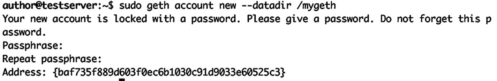

**图 6-1** 使用 `geth` 设置以太坊账户

请注意，我们将数据目录作为参数传递给了创建账户的命令。这是为了确保包含账户详细信息的文件创建在我们的数据目录内，从而便于在此目录上下文中访问该账户。如果我们没有向 `geth` 命令传递数据目录参数，它将自动使用数据目录的默认位置（该位置可能因平台而异）。

### 创建 genesis.json 配置文件

安装 `geth` 并创建一个新账户后，下一步是为我们的私有网络定义创世配置。正如我们在前几章中所见，区块链都有一个创世块，作为区块链的起点，所有交易和区块都会根据创世块进行验证。对于我们的私有网络，我们将有一个自定义的创世块，从而也就有了一个自定义的创世配置。此配置定义了区块链的一些关键值，如难度级别、区块的 gas 上限等。

以太坊的创世配置采用以下 JSON 对象格式。该对象的每个键都是一个驱动网络的配置值。

```
{
"config": {
"chainId": 3792,
"homesteadBlock": 0,
"eip155Block": 0,
"eip158Block": 0
},
"difficulty": "2000",
"gasLimit": "2100000",
"alloc": {
"baf735f889d603f0ec6b1030c91d9033e60525c3": { "balance": "9000000000000000000" }
}
}
```

这个 JSON 对象主要由一个 `config` 部分组成，其值特定于 `chainId` 以及一些已发生分叉的区块号。这里需要注意的重要参数是 `chainId`，它代表区块链的标识符，有助于防止重放攻击。对于我们的私有链，我们选择了一个随机的 `chainId` 3792。你可以选择任何与此处主网（1）和测试网（2、3、4）所使用的数字不同的数字。

下一个重要参数是 `difficulty`。该值定义了挖掘新区块的难度。这个值在以太坊主网络中要高得多，但对于私有网络，我们可以选择一个相对较小的值。

然后是 `gasLimit`。这是针对一个区块（而非单笔交易）的总 gas 限制。通常，该值越高，每个区块能容纳的交易就越多。

最后是 `alloc` 部分。使用此配置，我们可以用以 wei 为单位的价值预先为以太坊账户充值。正如我们所见，我们用 9 个以太币为上一小节创建的同一个以太坊账户注入了资金。

#### 运行私有网络的第一个节点

要运行私有区块链的第一个节点，我们首先复制上一步中的 JSON 内容，并将其保存为名为 `genesis.json` 的文件。为简单起见，我们将该文件保存在与 `geth` 数据目录相同的目录中。

首先，我们需要使用 `genesis.json` 初始化 `geth`。这一初始化步骤是为我们的私有网络设置自定义创世配置所必需的。

切换到保存 `genesis.json` 文件的目录：

```
cd mygeth
```

以下命令将使用我们定义的自定义配置初始化 `geth`：

```
sudo geth --datadir "/mygeth" init genesis.json
```

`geth` 将确认自定义创世配置设置完成，并输出如下截图所示的内容（图 6-2）。

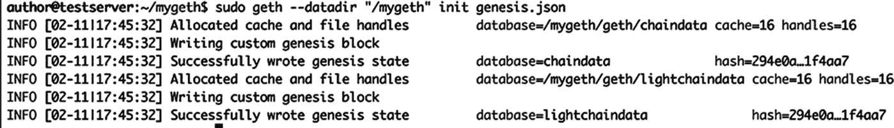

图 6-2

使用 `genesis.json` 中的配置初始化 `geth`

接下来，我们需要使用以下命令和参数运行 `geth`。我们将逐一详细解释这些参数。

```
sudo geth --datadir "/mygeth" --networkid 8956 --ipcdisable --port 30307 --rpc --rpcapi "eth,web3,personal,net,miner,admin,debug" --rpcport 8507 --mine --minerthreads=1 --etherbase=0xbaf735f889d603f0ec6b1030c91d9033e60525c3
```

让我们看看传递给 `geth` 命令的每个参数。

-   `datadir`：用于指定数据目录，与之前的步骤相同。
-   `networkid`：这是网络的标识符，用于将我们的私有网络与其他以太坊网络区分开来。它与我们在 `genesis.json` 文件中定义的 `chainId` 类似，但为网络之间提供了另一层区分。可以看到，我们为此值使用了另一个自定义编号。
-   `ipcdisable`：使用此参数，我们禁用了 `geth` 的进程间通信端口，这样在同一台本地机器上运行多个 `geth` 实例（节点）时，就不会遇到冲突问题。
-   `port`：我们为与 `geth` 交互的端口选择了一个自定义值。
-   `rpc`、`--rpcapi`、`--rpcport`：这三个参数定义了 `geth` 公开的 RPC API 的配置。我们希望启用它；我们希望通过 RPC 公开 `eth`、`web3`、`personal`、`net`、`miner`、`admin`、`debug` 这些 geth API；并且我们希望它在自定义端口 `8507` 上运行。
-   `mine`、`minerthreads`、`etherbase`：通过这三个参数，我们指示 `geth` 将该节点作为矿工节点启动，将矿工进程线程数限制为一个（以避免消耗大量 CPU 资源），并将挖矿奖励发送到我们在第一步中创建的以太坊账户。

这就是目前运行第一个私有网络 `geth` 节点所需的全部配置。

当我们使用所有参数运行此命令时，`geth` 将给出如下输出（如图 6-3 所示）。

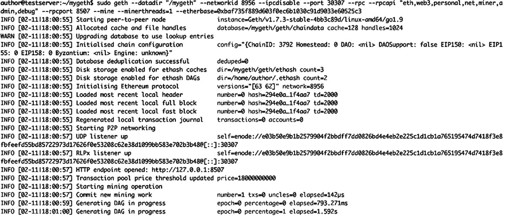

图 6-3

`geth` 运行第一个节点

注意输出中的 UDP 监听器启动日志语句。

```
INFO [02-11|18:00:57] UDP listener upself=enode://e03b50e9b1b2579904f2bbdff7dd0826bd4e4eb2e225c1d1cb1a765195474d7418f3e8fbfeefd55bd85722973d17626f0e53208c62e38d1099bb583e702b3b48@[::]:30307
```

这包含我们刚启动的节点的地址。要将其他节点连接到此节点，我们需要此地址。请将其记在某个地方。以下行是从上一条日志语句中提取的地址。

```
enode://e03b50e9b1b2579904f2bbdff7dd0826bd4e4eb2e225c1d1cb1a765195474d7418f3e8fbfeefd55bd85722973d17626f0e53208c62e38d1099bb583e702b3b48@[::]:30307
```

注意我们在命令中定义的端口号前的 `[::]`。如果我们在同一台机器上运行另一个节点，请将其替换为本地主机 IP 地址，否则替换为机器的外部 IP 地址。由于我们将在同一台机器上（出于开发目的）运行另一个网络节点，我们将用本地主机 IP 地址替换它。因此，第一个节点的最终地址将是

```
enode://e03b50e9b1b2579904f2bbdff7dd0826bd4e4eb2e225c1d1cb1a765195474d7418f3e8fbfeefd55bd85722973d17626f0e53208c62e38d1099bb583e702b3b48@127.0.0.1:30307
```

#### 运行网络中的第二个节点

只有一个节点的网络是不存在的；它至少应该有两个节点。因此，让我们在同一台机器上运行另一个`geth`实例，它将与我们刚刚启动的节点进行交互，这两个节点一起组成我们的以太坊私有网络。

为了运行另一个节点，首先我们需要另一个目录，作为第二个节点的数据目录。我们来创建一个。

```
mkdir mygeth2
```

现在，我们将使用为第一个节点创建的同一个`genesis.json`配置来初始化这个节点。我们复制一份这个`genesis.json`文件，并将其保存在我们刚才创建的新目录中。让我们也切换到这个目录。现在，我们来初始化第二个节点的创世配置。

```
sudo geth --datadir "/mygeth2" init genesis.json
```

然后，我们会得到与第一个节点类似的输出。请参见下面的截图（图 6-4）。

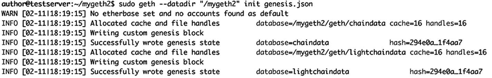
**图 6-4** 第二个节点的 Geth 初始化配置

现在，我们的第二个节点也使用创世配置初始化完成了。让我们运行它。

为了运行第二个节点，我们将向`geth`命令传递一些不同的参数。这个第二个节点不会作为矿工运行，因此我们将跳过第一个节点命令中的最后三个参数。同时，我们希望在运行此节点时暴露`geth`控制台，因此我们将添加一个相应参数。运行第二个节点的命令将是：

```
sudo geth --datadir "/mygeth2" --networkid 8956 --ipcdisable --port 30308 --rpc --rpcapi "eth,web3,personal,net,miner,admin,debug" --rpcport 8508 console
```

正如我们所看到的，第二个节点的数据目录和端口已经更改。我们还在命令中添加了`console`标志，以便可以获取此节点的`geth`控制台。

当我们运行此命令时，第二个节点也将开始运行，我们将在终端中看到以下输出（图 6-5）。

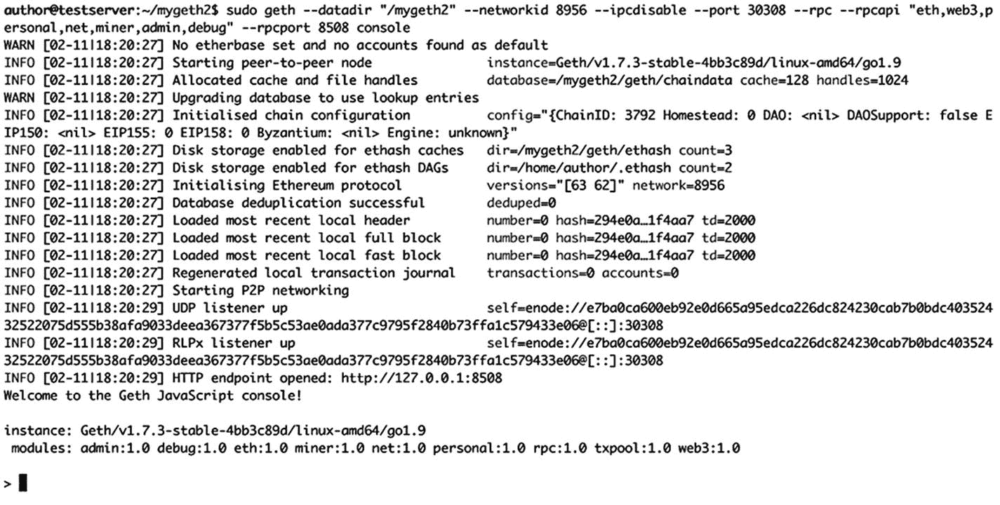
**图 6-5** 运行第二个节点的 Geth

此时，我们的两个`geth`节点都在运行，但它们彼此都不知道对方的存在。如果我们在第二个节点的`geth`控制台上运行`admin.peers`命令，结果将得到一个空数组（图 6-6）。

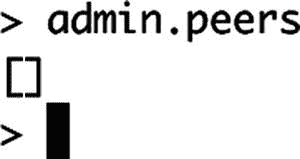
**图 6-6** Geth 控制台——检查对等节点

这意味着节点之间没有相互连接。让我们来连接这些节点。为此，我们将在第二个节点的`geth`控制台上发送`admin.addPeer()`命令，并将第一个节点的节点地址作为参数传入。还记得我们在运行第一个节点后记下了它的地址。让我们在第二个节点的`geth`控制台中运行此命令。

```
admin.addPeer("enode://e03b50e9b1b2579904f2bbdff7dd0826bd4e4eb2e225c1d1cb1a765195474d7418f3e8fbfeefd55bd85722973d17626f0e53208c62e38d1099bb583e702b3b48@127.0.0.1:30307")
```

当我们在第二个节点上运行此命令后，它立即返回了`true`。此外，几秒钟后，它开始与第一个节点同步。以下截图（图 6-7）显示了来自第二个节点控制台的此输出。

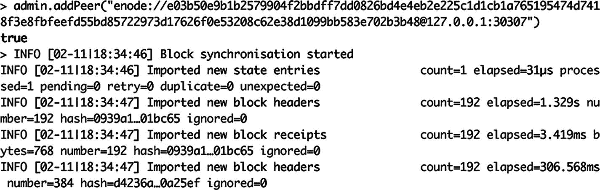
**图 6-7** Geth 控制台——添加对等节点

现在，我们的两个节点已连接，我们的私有以太坊网络已启动。为了进一步验证这一点，我们将在第二个节点上再次运行`admin.peers`命令。这次，我们将看到一个 JSON 数组，其中包含一个对象，显示第一个节点为对等节点（图 6-8）。

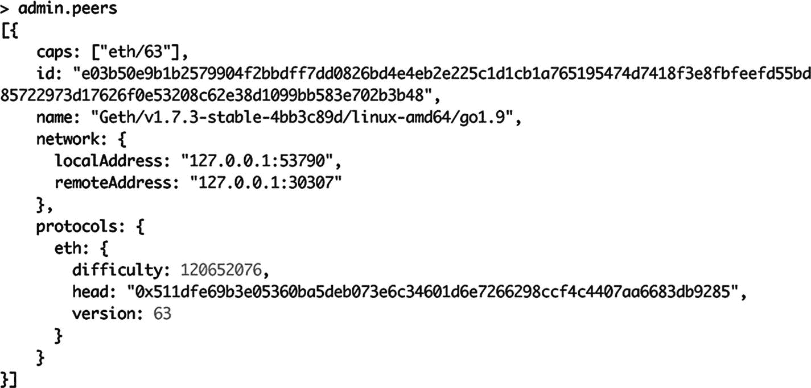
**图 6-8** Geth 控制台——（再次）检查对等节点

以下截图显示了我们已设置的两个节点的终端窗口。左侧是第一个节点，它也是一个矿工节点，正如我们所见，它正在持续挖掘新区块。第二个节点在右侧，我们可以看到它正在与第一个节点同步。由于包含的信息太多，该截图（图 6-9）太小而无法阅读，但它只是捕获并并排显示了来自两个以太坊节点的日志。

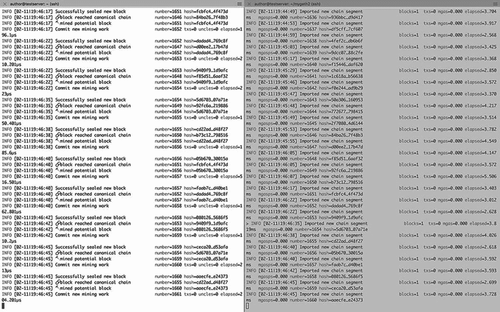
**图 6-9** 来自两个以太坊节点的 Geth 日志

既然两个节点在网络上互为对等节点，我们就拥有了一个包含两个节点的、可运行的私有以太坊区块链。我们还有一个被设置为矿工并预充了部分以太币的以太坊账户。现在，我们可以在这个私有区块链上创建更多账户并在它们之间转移以太币。

在本节中，我们学习了如何搭建一个包含两个节点的私有以太坊网络。节点数量可以是任意多个；我们只需要为每个新节点遵循相同的过程。对于远程节点，我们需要注意指定远程机器的正确 IP 地址，并且如果存在阻止流量到达这些机器的防火墙，我们还应确保所需的端口已开放。

## 创建智能合约

现在我们已经搭建并运行了私有以太坊网络，接下来可以进入下一步，为我们的去中心化应用（DApp）创建投票功能的智能合约。然后将此合约部署到我们的私有网络上。我们将遵循上一章中创建和部署智能合约的相同步骤。

让我们启动 `Remix` 在线集成开发环境（IDE），用 `Solidity` 语言编写智能合约。

以下 `Solidity` 代码片段展示了我们为投票功能编写的智能合约。

```
pragma solidity ⁰.4.19;
contract Poll {
event Voted(
address _voter,
uint _value
);
mapping(address => uint) public votes;
string pollSubject = "Should coffee be made tax free? Pass 1 for yes OR 2 for no in the vote function.";
function getPoll() constant public returns (string) {
return pollSubject;
}
function vote(uint selection) public {
Voted(msg.sender, selection);
require (votes[msg.sender] == 0);
require (selection > 0 && selection < 3);
votes[msg.sender] = selection;
}
}
```

现在，让我们分析这份合约源代码，理解我们在这里做了什么。如我们所见，合约的名称是 `Poll`。

下一行代码是

```
event Voted(
address _voter,
uint _value
);
```

上面的代码片段基本上声明了一个智能合约事件，它接受两个参数：一个是以太坊地址类型，另一个是无符号整数类型。我们创建这个事件是为了能够记录谁在投票中投了什么。我们稍后会回到这一点。

接下来，我们有

```
mapping(address => uint) public votes;
```

上面这行代码声明了一个以太坊地址与无符号整数的映射。这是一个数据存储区，我们将在此存储投票者的地址以及他们选择的投票值。

然后我们有：

```
string pollSubject = "Should coffee be made tax free? Pass 1 for yes OR 2 for no in the vote function.";
function getPoll() constant public returns (string) {
return pollSubject;
}
```

上面的代码片段首先声明了一个用于投票主题的字符串。在这里，我们向投票者提出了一个问题。然后我们有一个函数可以返回这个字符串的值，以便投票者查询投票内容。

最后，我们实现了投票功能的函数。

```
function vote(uint selection) public {
Voted(msg.sender, selection);
require (votes[msg.sender] == 0);
require (selection > 0 && selection < 3);
votes[msg.sender] = selection;
}
```

仔细检查上述代码片段的每一行。

首先，一旦进入这个函数，我们就触发之前创建的 `Voted` 事件，传入发送者地址（投票者）和他所选择的值。

接下来，我们通过检查映射中对应地址的投票值是否为零，来限制每个投票者只能投一次票。`require` 语句用于根据用户输入检查条件。

然后，我们还通过使用 `require` 语句，将选择的值限制为 1 或 2。1 表示赞成，2 表示反对。并且我们已经在 `pollSubject` 字符串中传递了这些指令，以便投票者知道该如何操作。

图 6-10 的屏幕截图显示了 `Remix` 中的智能合约。

我们使用 `Remix` 编译了这份合约代码，并获取了合约的 `ABI` 和字节码，以便将其部署到我们的私有网络中。我们从 `Remix` 编译选项卡详情弹出窗口的相应部分复制了字节码和 `ABI` —— 这与我们在上一章中的操作完全一致。

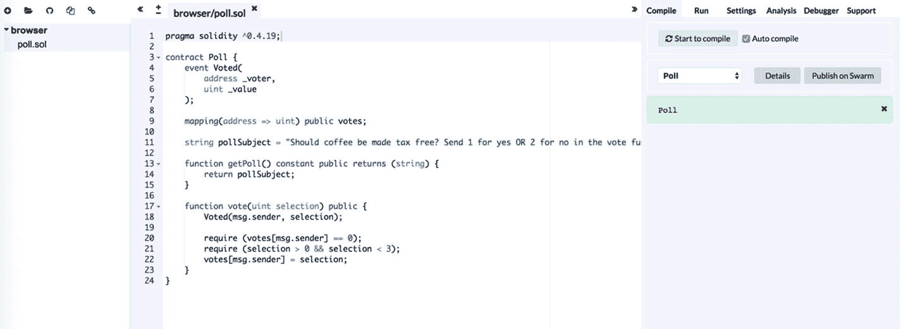

图 6-10 在 `Remix` 在线 `Solidity` 编辑器中编辑智能合约

合约的 `ABI` 如下

```
[
{
"constant": true,
"inputs": [
{
"name": "",
"type": "address"
}
],
"name": "votes",
"outputs": [
{
"name": "",
"type": "uint256"
}
],
"payable": false,
"stateMutability": "view",
"type": "function"
},
{
"constant": true,
"inputs": [],
"name": "getPoll",
"outputs": [
{
"name": "",
"type": "string"
}
],
"payable": false,
"stateMutability": "view",
"type": "function"
},
{
"anonymous": false,
"inputs": [
{
"indexed": false,
"name": "_voter",
"type": "address"
},
{
"indexed": false,
"name": "_value",
"type": "uint256"
}
],
"name": "Voted",
"type": "event"
},
{
"constant": false,
"inputs": [
{
"name": "selection",
"type": "uint256"
}
],
"name": "vote",
"outputs": [],
"payable": false,
"stateMutability": "nonpayable",
"type": "function"
}
]
```

而合约的字节码如下

```
{
  "linkReferences": {},
  "object": "6060604052608060405190810160405280605081526020017f53686f756c6420636f66666565206265206d6164652074617820667265653f2081526020017f53656e64203120666f7220796573204f52203220666f72206e6f20696e20746881526020017f6520766f74652066756e6374696f6e2e000000000000000000000000000000008152506001908051906020019061009c9291906100ad565b5034156100a857600080fd5b610152565b828054600181600116156101000203166002900490600052602060002090601f016020900481019282601f106100ee57805160ff191683800117855561011c565b8280016001018555821561011c579182015b8281111561011b578251825591602001919060010190610100565b5b509050610129919061012d565b5090565b61014f91905b8082111561014b576000816000905550600101610133565b5090565b90565b610373806101616000396000f300606060405260043610610057576000357c0100000000000000000000000000000000000000000000000000000000900463ffffffff1680630121b93f1461005c57806303c322781461007f578063d8bff5a51461010d575b600080fd5b341561006757600080fd5b61007d600480803590602001909190505061015a565b005b341561008a57600080fd5b610092610273565b6040518080602001828103825283818151815260200191508051906020019080838360005b838110156100d25780820151818401526020810190506100b7565b50505050905090810190601f1680156100ff5780820380516001836020036101000a031916815260200191505b509250505060405180910390f35b341561011857600080fd5b610144600480803573ffffffffffffffffffffffffffffffffffffffff1690602001909190505061031b565b6040518082815260200191505060405180910390f35b7f4d99b957a2bc29a30ebd96a7be8e68fe50a3c701db28a91436490b7d53870ca43382604051808373ffffffffffffffffffffffffffffffffffffffff1673ffffffffffffffffffffffffffffffffffffffff1681526020018281526020019250505060405180910390a160008060003373ffffffffffffffffffffffffffffffffffffffff1673ffffffffffffffffffffffffffffffffffffffff1681526020019081526020016000205414151561021257600080fd5b6000811180156102225750600381105b151561022d57600080fd5b806000803373ffffffffffffffffffffffffffffffffffffffff1673ffffffffffffffffffffffffffffffffffffffff1681526020019081526020016000208190555050565b61027b610333565b60018054600181600116156101000203166002900480601f0160208091040260200160405190810160405280929190818152602001828054600181600116156101000203166002900480156103115780601f106102e657610100808354040283529160200191610311565b820191906000526020600020905b8154815290600101906020018083116102f457829003601f168201915b5050505050905090565b60006020528060005260406000206000915090505481565b6020604051908101604052806000815250905600a165627a7a72305820ec7d3e1dae8412ec85045a8eafc248e37ae506802cc008ead300df1ac81aab490029",
  "opcodes": "PUSH1 0x60 PUSH1 0x40 MSTORE PUSH1 0x80 PUSH1 0x40 MLOAD SWAP1 DUP2 ADD PUSH1 0x40 MSTORE DUP1 PUSH1 0x50 DUP2 MSTORE PUSH1 0x20 ADD PUSH32 0x53686F756C6420636F66666565206265206D6164652074617820667265653F20 DUP2 MSTORE PUSH1 0x20 ADD PUSH32 0x53656E64203120666F7220796573204F52203220666F72206E6F20696E207468 DUP2 MSTORE PUSH1 0x20 ADD PUSH32 0x6520766F74652066756E6374696F6E2E00000000000000000000000000000000 DUP2 MSTORE POP PUSH1 0x1 SWAP1 DUP1 MLOAD SWAP1 PUSH1 0x20 ADD SWAP1 PUSH2 0x9C SWAP3 SWAP2 SWAP1 PUSH2 0xAD JUMP JUMPDEST POP CALLVALUE ISZERO PUSH2 0xA8 JUMPI PUSH1 0x0 DUP1 REVERT JUMPDEST PUSH2 0x152 JUMP JUMPDEST DUP3 DUP1 SLOAD PUSH1 0x1 DUP2 PUSH1 0x1 AND ISZERO PUSH2 0x100 MUL SUB AND PUSH1 0x2 SWAP1 DIV SWAP1 PUSH1 0x0 MSTORE PUSH1 0x20 PUSH1 0x0 KECCAK256 SWAP1 PUSH1 0x1F ADD PUSH1 0x20 SWAP1 DIV DUP2 ADD SWAP3 DUP3 PUSH1 0x1F LT PUSH2 0xEE JUMPI DUP1 MLOAD PUSH1 0xFF NOT AND DUP4 DUP1 ADD OR DUP6 SSTORE PUSH2 0x11C JUMP JUMPDEST DUP3 DUP1 ADD PUSH1 0x1 ADD DUP6 SSTORE DUP3 ISZERO PUSH2 0x11C JUMPI SWAP2 DUP3 ADD JUMPDEST DUP3 DUP2 GT ISZERO PUSH2 0x11B JUMPI DUP3 MLOAD DUP3 SSTORE SWAP2 PUSH1 0x20 ADD SWAP2 SWAP1 PUSH1 0x1 ADD SWAP1 PUSH2 0x100 JUMP JUMPDEST JUMPDEST POP SWAP1 POP PUSH2 0x129 SWAP2 SWAP1 PUSH2 0x12D JUMP JUMPDEST POP SWAP1 JUMP JUMPDEST PUSH2 0x14F SWAP2 SWAP1 JUMPDEST DUP1 DUP3 GT ISZERO PUSH2 0x14B JUMPI PUSH1 0x0 DUP2 PUSH1 0x0 SWAP1 SSTORE POP PUSH1 0x1 ADD PUSH2 0x133 JUMP JUMPDEST POP SWAP1 JUMP JUMPDEST SWAP1 JUMP JUMPDEST PUSH2 0x373 DUP1 PUSH2 0x161 PUSH1 0x0 CODECOPY PUSH1 0x0 RETURN STOP PUSH1 0x60 PUSH1 0x40 MSTORE PUSH1 0x4 CALLDATASIZE LT PUSH2 0x57 JUMPI PUSH1 0x0 CALLDATALOAD PUSH29 0x100000000000000000000000000000000000000000000000000000000 SWAP1 DIV PUSH4 0xFFFFFFFF AND DUP1 PUSH4 0x121B93F EQ PUSH2 0x5C JUMPI DUP1 PUSH4 0x3C32278 EQ PUSH2 0x7F JUMPI DUP1 PUSH4 0xD8BFF5A5 EQ PUSH2 0x10D JUMPI JUMPDEST PUSH1 0x0 DUP1 REVERT JUMPDEST CALLVALUE ISZERO PUSH2 0x67 JUMPI PUSH1 0x0 DUP1 REVERT JUMPDEST PUSH2 0x7D PUSH1 0x4 DUP1 DUP1 CALLDATALOAD SWAP1 PUSH1 0x20 ADD SWAP1 SWAP2 SWAP1 POP POP PUSH2 0x15A JUMP JUMPDEST STOP JUMPDEST CALLVALUE ISZERO PUSH2 0x8A JUMPI PUSH1 0x0 DUP1 REVERT JUMPDEST PUSH2 0x92 PUSH2 0x273 JUMP JUMPDEST PUSH1 0x40 MLOAD DUP1 DUP1 PUSH1 0x20 ADD DUP3 DUP2 SUB DUP3 MSTORE DUP4 DUP2 DUP2 MLOAD DUP2 MSTORE PUSH1 0x20 ADD SWAP2 POP DUP1 MLOAD SWAP1 PUSH1 0x20 ADD SWAP1 DUP1 DUP4 DUP4 PUSH1 0x0 JUMPDEST DUP4 DUP2 LT ISZERO PUSH2 0xD2 JUMPI DUP1 DUP3 ADD MLOAD DUP2 DUP5 ADD MSTORE PUSH1 0x20 DUP2 ADD SWAP1 POP PUSH2 0xB7 JUMP JUMPDEST POP POP POP POP SWAP1 POP SWAP1 DUP2 ADD SWAP1 PUSH1 0x1F AND DUP1 ISZERO PUSH2 0xFF JUMPI DUP1 DUP3 SUB DUP1 MLOAD PUSH1 0x1 DUP4 PUSH1 0x20 SUB PUSH2 0x100 EXP SUB NOT AND DUP2 MSTORE PUSH1 0x20 ADD SWAP2 POP JUMPDEST POP SWAP3 POP POP POP PUSH1 0x40 MLOAD DUP1 SWAP2 SUB SWAP1 RETURN JUMPDEST CALLVALUE ISZERO PUSH2 0x118 JUMPI PUSH1 0x0 DUP1 REVERT JUMPDEST PUSH2 0x144 PUSH1 0x4 DUP1 DUP1 CALLDATALOAD PUSH20 0xFFFFFFFFFFFFFFFFFFFFFFFFFFFFFFFFFFFFFFFF AND SWAP1 PUSH1 0x20 ADD SWAP1 SWAP2 SWAP1 POP POP PUSH2 0x31B JUMP JUMPDEST PUSH1 0x40 MLOAD DUP1 DUP3 DUP2 MSTORE PUSH1 0x20 ADD SWAP2 POP POP PUSH1 0x40 MLOAD DUP1 SWAP2 SUB SWAP1 RETURN JUMPDEST PUSH32 0x4D99B957A2BC29A30EBD96A7BE8E68FE50A3C701DB28A91436490B7D53870CA4 CALLER DUP3 PUSH1 0x40 MLOAD DUP1 DUP4 PUSH20 0xFFFFFFFFFFFFFFFFFFFFFFFFFFFFFFFFFFFFFFFF AND PUSH20 0xFFFFFFFFFFFFFFFFFFFFFFFFFFFFFFFFFFFFFFFF AND DUP2 MSTORE PUSH1 0x20 ADD DUP3 DUP2 MSTORE PUSH1 0x20 ADD SWAP3 POP POP POP PUSH1 0x40 MLOAD DUP1 SWAP2 SUB SWAP1 LOG1 PUSH1 0x0 DUP1 PUSH1 0x0 CALLER PUSH20 0xFFFFFFFFFFFFFFFFFFFFFFFFFFFFFFFFFFFFFFFF AND PUSH20 0xFFFFFFFFFFFFFFFFFFFFFFFFFFFFFFFFFFFFFFFF AND DUP2 MSTORE PUSH1 0x20 ADD SWAP1 DUP2 MSTORE PUSH1 0x20 ADD PUSH1 0x0 KECCAK256 SLOAD EQ ISZERO ISZERO PUSH2 0x212 JUMPI PUSH1 0x0 DUP1 REVERT JUMPDEST PUSH1 0x0 DUP2 GT DUP1 ISZERO PUSH2 0x222 JUMPI POP PUSH1 0x3 DUP2 LT JUMPDEST ISZERO ISZERO PUSH2 0x22D JUMPI PUSH1 0x0 DUP1 REVERT JUMPDEST DUP1 PUSH1 0x0 DUP1 CALLER PUSH20 0xFFFFFFFFFFFFFFFFFFFFFFFFFFFFFFFFFFFFFFFF AND PUSH20 0xFFFFFFFFFFFFFFFFFFFFFFFFFFFFFFFFFFFFFFFF AND DUP2 MSTORE PUSH1 0x20 ADD SWAP1 DUP2 MSTORE PUSH1 0x20 ADD PUSH1 0x0 KECCAK256 DUP2 SWAP1 SSTORE POP POP JUMP JUMPDEST PUSH2 0x27B PUSH2 0x333 JUMP JUMPDEST PUSH1 0x1 DUP1 SLOAD PUSH1 0x1 DUP2 PUSH1 0x1 AND ISZERO PUSH2 0x100 MUL SUB AND PUSH1 0x2 SWAP1 DIV DUP1 PUSH1 0x1F ADD PUSH1 0x20 DUP1 SWAP2 DIV MUL PUSH1 0x20 ADD PUSH1 0x40 MLOAD SWAP1 DUP2 ADD PUSH1 0x40 MSTORE DUP1 SWAP3 SWAP2 SWAP1 DUP2 DUP2 MSTORE PUSH1 0x20 ADD DUP3 DUP1 SLOAD PUSH1 0x1 DUP2 PUSH1 0x1 AND ISZERO PUSH2 0x100 MUL SUB AND PUSH1 0x2 SWAP1 DIV DUP1 ISZERO PUSH2 0x311 JUMPI DUP1 PUSH1 0x1F LT PUSH2 0x2E6 JUMPI PUSH2 0x100 DUP1 DUP4 SLOAD DIV MUL DUP4 MSTORE SWAP2 PUSH1 0x20 ADD SWAP2 PUSH2 0x311 JUMP JUMPDEST DUP3 ADD SWAP2 SWAP1 PUSH1 0x0 MSTORE PUSH1 0x20 PUSH1 0x0 KECCAK256 SWAP1 JUMPDEST DUP2 SLOAD DUP2 MSTORE SWAP1 PUSH1 0x1 ADD SWAP1 PUSH1 0x20 ADD DUP1 DUP4 GT PUSH2 0x2F4 JUMPI DUP3 SWAP1 SUB PUSH1 0x1F AND DUP3 ADD SWAP2 JUMPDEST POP POP POP POP POP SWAP1 POP SWAP1 JUMP JUMPDEST PUSH1 0x0 PUSH1 0x20 MSTORE DUP1 PUSH1 0x0 MSTORE PUSH1 0x40 PUSH1 0x0 KECCAK256 PUSH1 0x0 SWAP2 POP SWAP1 POP SLOAD DUP2 JUMP JUMPDEST PUSH1 0x20 PUSH1 0x40 MLOAD SWAP1 DUP2 ADD PUSH1 0x40 MSTORE DUP1 PUSH1 0x0 DUP2 MSTORE POP SWAP1 JUMP STOP LOG1 PUSH6 0x627A7A723058 KECCAK256 0xec PUSH30 0x3E1DAE8412EC85045A8EAFC248E37AE506802CC008EAD300DF1AC81AAB49 STOP 0x29 ",
  "sourceMap": "26:576:0:-;;;167:103;;;;;;;;;;;;;;;;;;;;;;;;;;;;;;;;;;;;;;;;;:::i;:::-;;26:576;;;;;;;;;;;;;;;;;;;;;;;;;;;;;;;;;;;;;;;;;;;;;;;;;;;;;;;;;;;;;;;;;;;;;;;;;;;;;;;;;;;;;;;;;;;;;;;;;;;;;;;;:::i;:::-;;;:::o;:::-;;;;;;;;;;;;;;;;;;;;;;;;;;;:::o;:::-;;;;;;;"
}
```

有了这些值，我们的智能合约就可以准备部署了。

**重要提示**

为了使合约更加安全和高效（gas 友好），可能还有一些可以改进之处。不应将这份 `Solidity` 代码作为参考。关于 `Solidity` 最佳实践的详细讨论超出了本文的范畴。对于 `Solidity` 的最佳实践，我们建议遵循官方的 `Solidity` 文档以及 `Solidity` 相关的专门文章。

### 部署智能合约

在本节中，我们将把上一节开发的智能合约部署到我们创建的私有以太坊网络中。部署智能合约的过程与我们前一章所做的相同。唯一的不同是，这次我们是把合约部署到私有网络，而非公共网络。在本章中，我们同样使用相同的`web3.js`库，通过JavaScript进行以太坊编程。建议尚未阅读前一章的读者先去阅读一下。

#### 设置 web3 库和连接

首先，我们将在`node.js`应用中安装`web3`库。这与上一章的做法完全相同。这个`node.js`应用将用于部署智能合约。

```
npm install web3@1.0.0-beta.28
```

安装完成后，我们先初始化并实例化`web3`实例。

```
var Web3 = require('web3');
var web3 = new Web3(new Web3.providers.HttpProvider('http://127.0.0.1:8507'));
```

请注意，这次`web3`实例的HTTP提供者已更改为本地端点，而不是上一章使用的公共INFURA端点。这是因为我们现在要连接的是本地私有网络。同时请注意，我们使用的端口是`8507`，这正是我们在设置私有网络第一个节点时，在`--rpcport`参数中指定的端口。这意味着我们从`web3`实例连接的是网络的第一个节点。

#### 将合约部署到私有网络

现在我们有了智能合约及其详细信息，我们将准备一个包含该合约详细信息的`web3`合约对象，然后通过调用合约对象的`deploy`方法，将该合约部署到以太坊区块链上。

我们需要创建一个`web3.eth.Contract`类的对象，它可以代表我们的合约。以下代码片段创建了一个合约实例，并将我们合约的ABI作为构造函数的输入。

```
var pollingContract = new web3.eth.Contract([
{
"constant": true,
"inputs": [
{
"name": "",
"type": "address"
}
],
"name": "votes",
"outputs": [
{
"name": "",
"type": "uint256"
}
],
"payable": false,
"stateMutability": "view",
"type": "function"
},
{
"constant": true,
"inputs": [],
"name": "getPoll",
"outputs": [
{
"name": "",
"type": "string"
}
],
"payable": false,
"stateMutability": "view",
"type": "function"
},
{
"anonymous": false,
"inputs": [
{
"indexed": false,
"name": "_voter",
"type": "address"
},
{
"indexed": false,
"name": "_value",
"type": "uint256"
}
],
"name": "Voted",
"type": "event"
},
{
"constant": false,
"inputs": [
{
"name": "selection",
"type": "uint256"
}
],
"name": "vote",
"outputs": [],
"payable": false,
"stateMutability": "nonpayable",
"type": "function"
}
]);
```

现在我们需要使用`web3`库的`deploy`方法将此合约部署到以太坊网络。以下代码片段展示了如何操作。在此片段中，我们将字节码添加到了传递给`deploy`方法的对象的`data`字段中。

```
pollingContract
.deploy({
data: '0x6060604052608060405190810160405280605081526020017f53686f756c6420636f66666565206265206d6164652074617820667265653f2081526020017f53656e64203120666f7220796573204f52203220666f72206e6f20696e20746881526020017f6520766f74652066756e6374696f6e2e000000000000000000000000000000008152506001908051906020019061009c9291906100ad565b5034156100a857600080fd5b610152565b828054600181600116156101000203166002900490600052602060002090601f016020900481019282601f106100ee57805160ff191683800117855561011c565b8280016001018555821561011c579182015b8281111561011b578251825591602001919060010190610100565b5b509050610129919061012d565b5090565b61014f91905b8082111561014b576000816000905550600101610133565b5090565b90565b610373806101616000396000f300606060405260043610610057576000357c0100000000000000000000000000000000000000000000000000000000900463ffffffff1680630121b93f1461005c57806303c322781461007f578063d8bff5a51461010d575b600080fd5b341561006757600080fd5b61007d600480803590602001909190505061015a565b005b341561008a57600080fd5b610092610273565b6040518080602001828103825283818151815260200191508051906020019080838360005b838110156100d25780820151818401526020810190506100b7565b50505050905090810190601f1680156100ff5780820380516001836020036101000a031916815260200191505b509250505060405180910390f35b341561011857600080fd5b610144600480803573ffffffffffffffffffffffffffffffffffffffff1690602001909190505061031b565b6040518082815260200191505060405180910390f35b7f4d99b957a2bc29a30ebd96a7be8e68fe50a3c701db28a91436490b7d53870ca43382604051808373ffffffffffffffffffffffffffffffffffffffff1673ffffffffffffffffffffffffffffffffffffffff1681526020018281526020019250505060405180910390a160008060003373ffffffffffffffffffffffffffffffffffffffff1673ffffffffffffffffffffffffffffffffffffffff1681526020019081526020016000205414151561021257600080fd5b6000811180156102225750600381105b151561022d57600080fd5b806000803373ffffffffffffffffffffffffffffffffffffffff1673ffffffffffffffffffffffffffffffffffffffff1681526020019081526020016000208190555050565b61027b610333565b60018054600181600116156101000203166002900480601f0160208091040260200160405190810160405280929190818152602001828054600181600116156101000203166002900480156103115780601f106102e657610100808354040283529160200191610311565b820191906000526020600020905b8154815290600101906020018083116102f457829003601f168201915b5050505050905090565b60006020528060005260406000206000915090505481565b6020604051908101604052806000815250905600a165627a7a72305820ec7d3e1dae8412ec85045a8eafc248e37ae506802cc008ead300df1ac81aab490029'
})
.send({
from: '0xbaf735f889d603f0ec6b1030c91d9033e60525c3',
gas: 4700000,
gasPrice: '20000000000000'
},
function(error, transactionHash){
console.log(error);
console.log(transactionHash);
})
.then(function(contract){
console.log(contract);
});
```

请注意，我们在`send`函数的`from`字段中使用了在设置网络期间创建的账户。由于该账户预先获得了9个以太币，并且也被添加为挖矿奖励的`etherbase`账户，因此它拥有足够的以太币来部署合约。

部署合约的完整函数如下：

```javascript
var deployContract = function () {
var pollingContract = new web3.eth.Contract([{
"constant": true,
"inputs": [{
"name": "",
"type": "address"
}],
"name": "votes",
"outputs": [{
"name": "",
"type": "uint256"
}],
"payable": false,
"stateMutability": "view",
"type": "function"
},
{
"constant": true,
"inputs": [],
"name": "getPoll",
"outputs": [{
"name": "",
"type": "string"
}],
"payable": false,
"stateMutability": "view",
"type": "function"
},
{
"anonymous": false,
"inputs": [{
"indexed": false,
"name": "_voter",
"type": "address"
},
{
"indexed": false,
"name": "_value",
"type": "uint256"
}
],
"name": "Voted",
"type": "event"
},
{
"constant": false,
"inputs": [{
"name": "selection",
"type": "uint256"
}],
"name": "vote",
"outputs": [],
"payable": false,
"stateMutability": "nonpayable",
"type": "function"
}
]);
pollingContract
.deploy({
data: '0x6060604052608060405190810160405280605081526020017f53686f756c6420636f66666565206265206d6164652074617820667265653f2081526020017f53656e64203120666f7220796573204f52203220666f72206e6f20696e20746881526020017f6520766f74652066756e6374696f6e2e000000000000000000000000000000008152506001908051906020019061009c9291906100ad565b5034156100a857600080fd5b610152565b828054600181600116156101000203166002900490600052602060002090601f016020900481019282601f106100ee57805160ff191683800117855561011c565b8280016001018555821561011c579182015b8281111561011b578251825591602001919060010190610100565b5b509050610129919061012d565b5090565b61014f91905b8082111561014b576000816000905550600101610133565b5090565b90565b610373806101616000396000f300606060405260043610610057576000357c0100000000000000000000000000000000000000000000000000000000900463ffffffff1680630121b93f1461005c57806303c322781461007f578063d8bff5a51461010d575b600080fd5b341561006757600080fd5b61007d600480803590602001909190505061015a565b005b341561008a57600080fd5b610092610273565b6040518080602001828103825283818151815260200191508051906020019080838360005b838110156100d25780820151818401526020810190506100b7565b50505050905090810190601f1680156100ff5780820380516001836020036101000a031916815260200191505b509250505060405180910390f35b341561011857600080fd5b610144600480803573ffffffffffffffffffffffffffffffffffffffff1690602001909190505061031b565b6040518082815260200191505060405180910390f35b7f4d99b957a2bc29a30ebd96a7be8e68fe50a3c701db28a91436490b7d53870ca43382604051808373ffffffffffffffffffffffffffffffffffffffff1673ffffffffffffffffffffffffffffffffffffffff1681526020018281526020019250505060405180910390a160008060003373ffffffffffffffffffffffffffffffffffffffff1673ffffffffffffffffffffffffffffffffffffffff1681526020019081526020016000205414151561021257600080fd5b6000811180156102225750600381105b151561022d57600080fd5b806000803373ffffffffffffffffffffffffffffffffffffffff1673ffffffffffffffffffffffffffffffffffffffff1681526020019081526020016000208190555050565b61027b610333565b60018054600181600116156101000203166002900480601f0160208091040260200160405190810160405280929190818152602001828054600181600116156101000203166002900480156103115780601f106102e657610100808354040283529160200191610311565b820191906000526020600020905b8154815290600101906020018083116102f457829003601f168201915b5050505050905090565b60006020528060005260406000206000915090505481565b6020604051908101604052806000815250905600a165627a7a72305820ec7d3e1dae8412ec85045a8eafc248e37ae506802cc008ead300df1ac81aab490029'
})
.send({
from: '0xbaf735f889d603f0ec6b1030c91d9033e60525c3',
gas: 4700000,
gasPrice: '20000000000000'
},
function (error, transactionHash) {
console.log(error);
console.log(transactionHash);
})
.then(function (contract) {
console.log(contract);
});
};
```

从我们的`node.js`应用程序执行此函数后，我们收到了以下输出：

```markdown
```javascript
Contract {
  currentProvider: [Getter/Setter],
  _requestManager:
  RequestManager {
    provider: null,
    providers:
    { WebsocketProvider: [Function: WebsocketProvider],
      HttpProvider: [Function: HttpProvider],
      IpcProvider: [Function: IpcProvider] },
    subscriptions: {} },
  givenProvider: null,
  providers:
  { WebsocketProvider: [Function: WebsocketProvider],
    HttpProvider: [Function: HttpProvider],
    IpcProvider: [Function: IpcProvider] },
  _provider: null,
  setProvider: [Function],
  BatchRequest: [Function: bound Batch],
  extend:
  { [Function: ex]
    formatters:
    { inputDefaultBlockNumberFormatter: [Function: inputDefaultBlockNumberFormatter],
      inputBlockNumberFormatter: [Function: inputBlockNumberFormatter],
      inputCallFormatter: [Function: inputCallFormatter],
      inputTransactionFormatter: [Function: inputTransactionFormatter],
      inputAddressFormatter: [Function: inputAddressFormatter],
      inputPostFormatter: [Function: inputPostFormatter],
      inputLogFormatter: [Function: inputLogFormatter],
      inputSignFormatter: [Function: inputSignFormatter],
      outputBigNumberFormatter: [Function: outputBigNumberFormatter],
      outputTransactionFormatter: [Function: outputTransactionFormatter],
      outputTransactionReceiptFormatter: [Function: outputTransactionReceiptFormatter],
      outputBlockFormatter: [Function: outputBlockFormatter],
      outputLogFormatter: [Function: outputLogFormatter],
      outputPostFormatter: [Function: outputPostFormatter],
      outputSyncingFormatter: [Function: outputSyncingFormatter] },
    utils:
    { _fireError: [Function: _fireError],
      _jsonInterfaceMethodToString: [Function: _jsonInterfaceMethodToString],
      randomHex: [Function: randomHex],
      _: [Function],
      BN: [Function],
      isBN: [Function: isBN],
      isBigNumber: [Function: isBigNumber],
      isHex: [Function: isHex],
      isHexStrict: [Function: isHexStrict],
      sha3: [Function],
      keccak256: [Function],
      soliditySha3: [Function: soliditySha3],
      isAddress: [Function: isAddress],
      checkAddressChecksum: [Function: checkAddressChecksum],
      toChecksumAddress: [Function: toChecksumAddress],
      toHex: [Function: toHex],
      toBN: [Function: toBN],
      bytesToHex: [Function: bytesToHex],
      hexToBytes: [Function: hexToBytes],
      hexToNumberString: [Function: hexToNumberString],
      hexToNumber: [Function: hexToNumber],
      toDecimal: [Function: hexToNumber],
      numberToHex: [Function: numberToHex],
      fromDecimal: [Function: numberToHex],
      hexToUtf8: [Function: hexToUtf8],
      hexToString: [Function: hexToUtf8],
      toUtf8: [Function: hexToUtf8],
      utf8ToHex: [Function: utf8ToHex],
      stringToHex: [Function: utf8ToHex],
      fromUtf8: [Function: utf8ToHex],
      hexToAscii: [Function: hexToAscii],
      toAscii: [Function: hexToAscii],
      asciiToHex: [Function: asciiToHex],
      fromAscii: [Function: asciiToHex],
      unitMap: [Object],
      toWei: [Function: toWei],
      fromWei: [Function: fromWei],
      padLeft: [Function: leftPad],
      leftPad: [Function: leftPad],
      padRight: [Function: rightPad],
      rightPad: [Function: rightPad],
      toTwosComplement: [Function: toTwosComplement] },
    Method: [Function: Method] },
  clearSubscriptions: [Function],
  options:
  { address: [Getter/Setter],
    jsonInterface: [Getter/Setter],
    data: undefined,
    from: undefined,
    gasPrice: undefined,
    gas: undefined },
  defaultAccount: [Getter/Setter],
  defaultBlock: [Getter/Setter],
  methods:
  { votes: [Function: bound _createTxObject],
    '0xd8bff5a5': [Function: bound _createTxObject],
    'votes(address)': [Function: bound _createTxObject],
    getPoll: [Function: bound _createTxObject],
    '0x03c32278': [Function: bound _createTxObject],
    'getPoll()': [Function: bound _createTxObject],
    vote: [Function: bound _createTxObject],
    '0x0121b93f': [Function: bound _createTxObject],
    'vote(uint256)': [Function: bound _createTxObject] },
  events:
  { Voted: [Function: bound ],
    '0x4d99b957a2bc29a30ebd96a7be8e68fe50a3c701db28a91436490b7d53870ca4': [Function: bound ],
    'Voted(address,uint256)': [Function: bound ],
    allEvents: [Function: bound ] },
  _address: '0x59E7161646C3436DFdF5eBE617B4A172974B481e',
  _jsonInterface:
  [ { constant: true,
      inputs: [Array],
      name: 'votes',
      outputs: [Array],
      payable: false,
      stateMutability: 'view',
      type: 'function',
      signature: '0xd8bff5a5' },
    { constant: true,
      inputs: [],
      name: 'getPoll',
      outputs: [Array],
      payable: false,
      stateMutability: 'view',
      type: 'function',
      signature: '0x03c32278' },
    { anonymous: false,
      inputs: [Array],
      name: 'Voted',
      type: 'event',
      signature: '0x4d99b957a2bc29a30ebd96a7be8e68fe50a3c701db28a91436490b7d53870ca4' },
    { constant: false,
      inputs: [Array],
      name: 'vote',
      outputs: [],
      payable: false,
      stateMutability: 'nonpayable',
      type: 'function',
      signature: '0x0121b93f' } ] }
```

上述输出显示了部署到我们私有网络中的合约的各项属性。其中最重要的属性是合约的部署地址，即 `0x59E7161646C3436DFdF5eBE617B4A172974B481e`。
合约的 ABI 和地址可用于调用合约中的函数。在下一节中，我们将构建一个简单的 Web 应用，用于调用该合约的 `vote` 函数，以此展示如何从前端进行投票操作。
```

## 客户端应用

与上一章类似，我们可以使用`web3`库来调用智能合约的函数。不过上一章是通过 node.js 应用程序而非浏览器应用实现的。在本节中，我们将通过浏览器应用使用`web3`来调用已部署智能合约的`vote`函数。

我们能为这个 DApp 创建的最简单的 Web 应用就是一个包含若干文本和按钮控件的单一网页。对于这个网页，我们可以在一个 html 文件中使用以下代码，然后通过本地服务器运行它。请注意，必须通过本地服务器运行，而不是直接在浏览器中打开文件，这样才能正确加载脚本，避免出现浏览器安全问题。

```
【HTML 内容示例】
Beginning Blockchain - DApp demo
">

Beginning Blockchain

Hi, Welcome to the Polling DApp!
&nbsp;
Get latest poll:&nbsp;
Get Poll

Vote: Yes:
 No:

Submit:&nbsp;
Submit Vote

if (typeof web3 !== 'undefined') {
web3 = new Web3(web3.currentProvider);
} else {
web3 = new Web3(new Web3.providers.HttpProvider('http://127.0.0.1:8507'));
}
function getPoll() {
var pollingContract = new web3.eth.Contract([{
"constant": true,
"inputs": [{
"name": "",
"type": "address"
}],
"name": "votes",
"outputs": [{
"name": "",
"type": "uint256"
}],
"payable": false,
"stateMutability": "view",
"type": "function"
},
{
"constant": true,
"inputs": [],
"name": "getPoll",
"outputs": [{
"name": "",
"type": "string"
}],
"payable": false,
"stateMutability": "view",
"type": "function"
},
{
"anonymous": false,
"inputs": [{
"indexed": false,
"name": "_voter",
"type": "address"
},
{
"indexed": false,
"name": "_value",
"type": "uint256"
}
],
"name": "Voted",
"type": "event"
},
{
"constant": false,
"inputs": [{
"name": "selection",
"type": "uint256"
}],
"name": "vote",
"outputs": [],
"payable": false,
"stateMutability": "nonpayable",
"type": "function"
}
], '0x59E7161646C3436DFdF5eBE617B4A172974B481e');
pollingContract.methods.getPoll().call().then(function (value) {
document.getElementById('pollSubject').textContent = value;
});
};
function submitVote() {
var value = 0
var yes = document.getElementById('yes').checked;
var no = document.getElementById('no').checked;
if (yes) {
value = 1
} else if (no) {
value = 2
} else {
return;
}
var pollingContract = new web3.eth.Contract([{
"constant": true,
"inputs": [{
"name": "",
"type": "address"
}],
"name": "votes",
"outputs": [{
"name": "",
"type": "uint256"
}],
"payable": false,
"stateMutability": "view",
"type": "function"
},
{
"constant": true,
"inputs": [],
"name": "getPoll",
"outputs": [{
"name": "",
"type": "string"
}],
"payable": false,
"stateMutability": "view",
"type": "function"
},
{
"anonymous": false,
"inputs": [{
"indexed": false,
"name": "_voter",
"type": "address"
},
{
"indexed": false,
"name": "_value",
"type": "uint256"
}
],
"name": "Voted",
"type": "event"
},
{
"constant": false,
"inputs": [{
"name": "selection",
"type": "uint256"
}],
"name": "vote",
"outputs": [],
"payable": false,
"stateMutability": "nonpayable",
"type": "function"
}
], '0x59E7161646C3436DFdF5eBE617B4A172974B481e');
pollingContract.methods.vote(value).send({
from: '0xbaf735f889d603f0ec6b1030c91d9033e60525c3'
}).then(function (result) {
console.log(result);
});
};
```

现在我们来分析这个 HTML 文件的各个部分。

在 HTML 文档的 `head` 部分，我们从 CDN 源或本地源加载了`web3`脚本。这就像我们在网页中引用其他第三方 JavaScript 库（如 JQuery 等）一样。

接着，在 HTML 的 `body` 部分，我们放置了用于显示投票主题的控件，以及用于捕获用户输入的单选按钮和提交按钮。整个网页看起来像这样（图 6-11）。

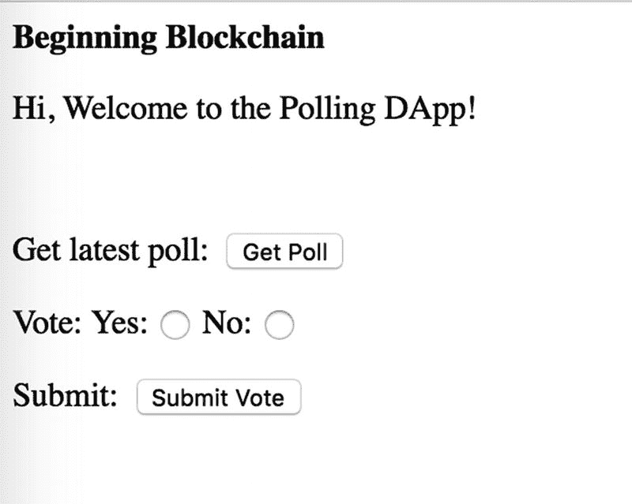

图 6-11

投票 Web 应用视图

重要的是 `body` 中的脚本部分。正是在这里，我们调用了智能合约交互代码。让我们详细看看它。

```
【重复的脚本内容，此处省略】
```

在前面的脚本部分，首先我们使用本地以太坊节点的 HTTP 提供者初始化了`web3`对象（如果尚未初始化）。

然后，我们有两个 JavaScript 函数。一个用于从智能合约获取`pollSubject`字符串的值，另一个用于调用合约的`vote`函数。

调用智能合约函数的方式与上一章中使用`web3`库的`web3.eth.Contract`子模块的方式完全相同。

请注意，在第一个函数`getPoll`中，我们调用了智能合约实例的`call`函数；而在第二个函数`submitVote`中，我们调用了智能合约实例的`send`函数。这是这两个函数调用的主要区别。

通过对智能合约的`getPoll`函数使用`call`，我们无需向网络发送任何交易即可获取`getPoll`函数的返回值。然后，我们通过将其赋值给某个 UI 元素的文本来在界面上显示这个值。

接下来，通过对`vote`函数使用`send`，我们发送一笔交易来在网络上执行此函数，因此我们还必须定义一个用于执行智能合约函数的账户。以下是前面`submitVote`函数输出的结果，本质上是一笔交易收据。

```
{
blockHash: '0x04a02dd56c037569eb6abe25e003a65d3366407134c90a056f64b62c2d23eb84',
blockNumber: 4257,
contractAddress: null,
cumulativeGasUsed: 43463,
from: '0xbaf735f889d603f0ec6b1030c91d9033e60525c3',
gasUsed: 43463,
logsBloom: '0x00000000000000000000000000000080000000000000040000000000000000000200000000000000000000000000000000000000000000000000000000000000000000000000000000000000000020000000000200000000000000000000000000000000000000000000000000000000000000000000000000000000000000000000000000000000000000000000000000000000000000000000000000000000000000000000000000000200000000000000000000000000000000000000000000000000000000000000000000000000000000000000000000000000000000000000000000000000000000000000000000000000000000000000000000000000',
root: '0x58bc4ee0a3025ca3f303df9bb243d052a12302651963730c52c88aafe92ebeee',
to: '0x59e7161646c3436dfdf5ebe617b4a172974b481e',
transactionHash: '0x434aa9c0037af3367a0d3d92985781c50774241ace1d382a8723985efcea73b3',
transactionIndex: 0,
events: {
Voted: {
address: '0x59E7161646C3436DFdF5eBE617B4A172974B481e',
blockNumber: 4257,
transactionHash: '0x434aa9c0037af3367a0d3d92985781c50774241ace1d382a8723985efcea73b3',
transactionIndex: 0,
blockHash: '0x04a02dd56c037569eb6abe25e003a65d3366407134c90a056f64b62c2d23eb84',
logIndex: 0,
removed: false,
id: 'log_980a1744',
returnValues: [Result],
event: 'Voted',
signature: '0x4d99b957a2bc29a30ebd96a7be8e68fe50a3c701db28a91436490b7d53870ca4',
raw: [Object]
}
}
}
```

仔细观察这个输出，我们发现其中也包含一个`events`部分，它显示了我们之前在智能合约中创建的`Voted`事件被触发。

```
events: {
Voted: {
address: '0x59E7161646C3436DFdF5eBE617B4A172974B481e',
blockNumber: 4257,
transactionHash: '0x434aa9c0037af3367a0d3d92985781c50774241ace1d382a8723985efcea73b3',
transactionIndex: 0,
blockHash: '0x04a02dd56c037569eb6abe25e003a65d3366407134c90a056f64b62c2d23eb84',
logIndex: 0,
removed: false,
id: 'log_980a1744',
returnValues: [Result],
event: 'Voted',
signature: '0x4d99b957a2bc29a30ebd96a7be8e68fe50a3c701db28a91436490b7d53870ca4',
raw: [Object]
}
}
```

在上面的代码片段中，我们从交易收据中提取出了`events`部分，该交易收据是我们向智能合约的`vote`函数发送`send`交易后，在响应中收到的。可以看到，`events`部分也显示了函数调用返回的`returnValues`和`raw`值。

至此，我们的 DApp 编程练习就接近尾声了。在本章的前面几个小节中，我们在以太坊区块链上开发了一个端到端的去中心化应用，并为我们的 DApp 部署了一条私有区块链。

该 DApp 同样可以用于公共以太坊网络——投票者只需运行一个节点，即可使用其在公共（主）网络上的现有以太坊账户进行投票。

通过使用不同的检查条件和规则，有多种方式可以增强智能合约中的业务逻辑。

本次编程练习使我们初步了解了如何着手开发去中心化应用，以及在开发过程中会涉及哪些组件。本次练习可作为以太坊应用开发的起点，我们鼓励读者进一步探索该主题的相关最佳实践和更复杂的场景。

## 总结

在本章中，我们完成了一个基于以太坊区块链开发去中心化应用的编程练习。同时，我们还学习了如何搭建私有以太坊网络，以及如何通过 DApp 与之交互。