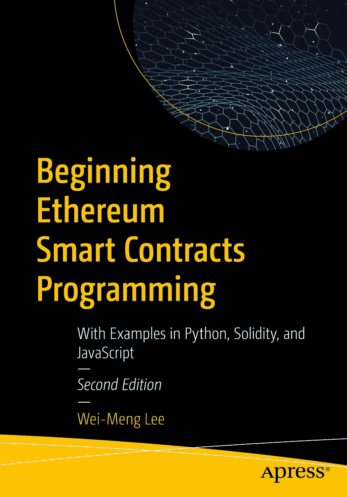

# 以太坊智能合约编程入门：第二版

ISBN 978-1-4842-9270-9  
e-ISBN 978-1-4842-9271-6  
[`doi.org/10.1007/978-1-4842-9271-6`](https://doi.org/10.1007/978-1-4842-9271-6)  
© 李伟蒙 2019, 2023

本作品受版权保护。所有权利均由出版商独家授权，涵盖材料的全部或部分内容，具体包括翻译、重印、重新使用插图、朗诵、广播、微缩胶片复制或以任何其他物理方式复制，以及信息传输或存储检索、电子改编、计算机软件，或使用目前已知或未来开发的类似或不同方法。本出版物中使用通用描述性名称、注册商标、商标、服务标志等，即使未明确声明，也不意味着这些名称免于相关保护法律和法规的约束，因此可自由用于一般用途。出版商、作者和编辑可合理假定，本书中的建议和信息在出版之日是真实准确的。出版商、作者或编辑均不对本书所载材料或可能存在的任何错误或遗漏提供明示或暗示的担保。对于已出版地图和机构隶属关系中的管辖权主张，出版商保持中立。

本 Apress 印记由隶属于施普林格自然的注册公司 APress Media, LLC 出版。

注册公司地址为：美国纽约州纽约市纽约广场 1 号，邮编 10004。

## 引言

欢迎阅读《以太坊智能合约编程入门：第二版》！

本书是快速上手以太坊智能合约编程的指南。首先讨论区块链及其背后的动机。您将了解什么是区块链、区块链中的区块如何链接在一起，以及区块如何添加到区块链中。您还将理解挖矿的工作原理，并了解区块链网络中的各种节点类型。自本书第一版出版以来，许多事情发生了变化。特别是，以太坊已更新为使用权益证明（PoS）（取代工作量证明）作为其共识算法。本书已更新，加入了关于 PoS 工作原理的讨论。

在此基础上，您将深入以太坊区块链。您将学习如何使用以太坊客户端（`Geth`）创建私有以太坊区块链，并执行简单交易，例如向另一个账户发送以太币。

本书的下一部分讨论智能合约编程，这是以太坊区块链的一个独特功能。您将快速上手智能合约编程，无需翻阅大量文档。本书的“边做边学”方法可让您在最短时间内掌握技能。到本书结尾，您应能编写、测试和部署智能合约，并创建与之交互的 Web 应用程序。在第二版中，我添加了更多示例，以便您轻松探索更复杂的智能合约。

本书的最后部分涉及代币和 DeFi（去中心化金融），这两者已席卷加密货币市场。您将能够创建自己的代币、启动自己的首次代币发行（ICO），并编写允许买家使用以太币购买代币的代币合约。作为额外内容，我将向您展示如何编写一个去中心化交易所（DEX）智能合约来交换两种不同的代币！

本书专为希望快速上手以太坊智能合约编程的人士设计。建议具备基本的编程知识，并了解 Python 或 JavaScript。

希望您像我创作这些示例项目一样享受它们的乐趣！

## 关于作者

关于技术审校者