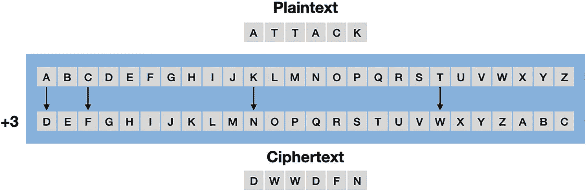
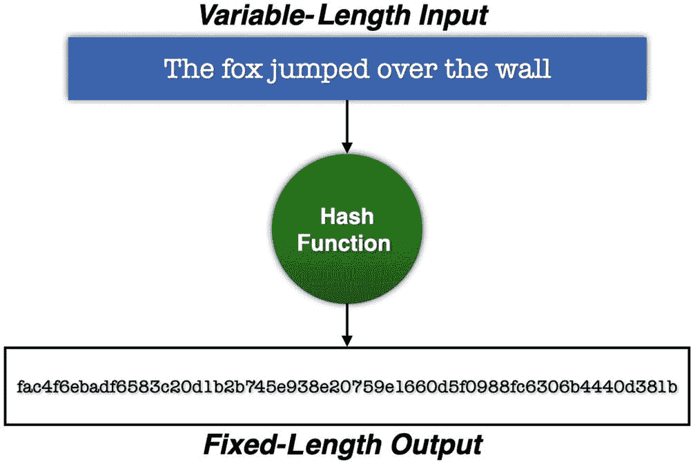
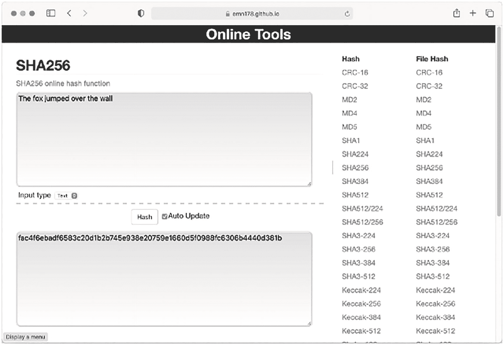
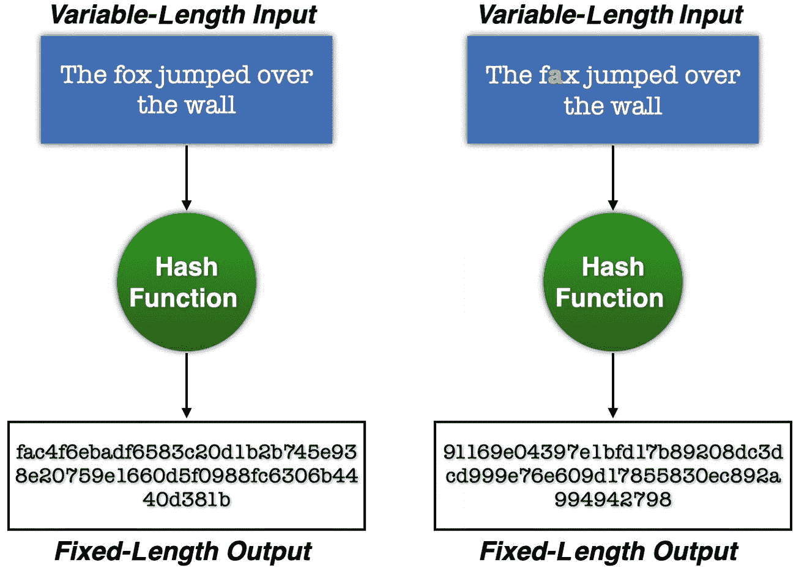
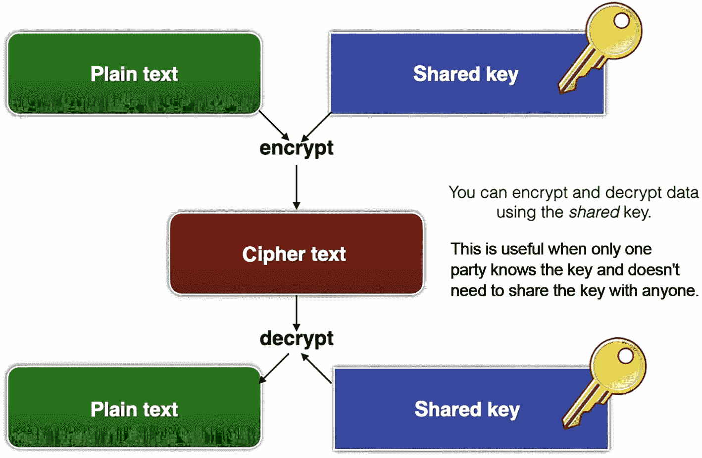
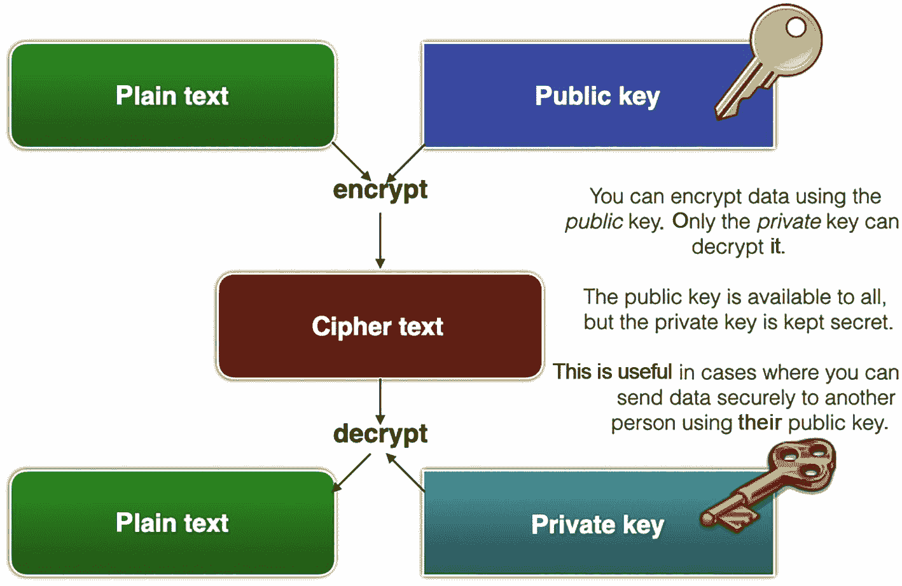
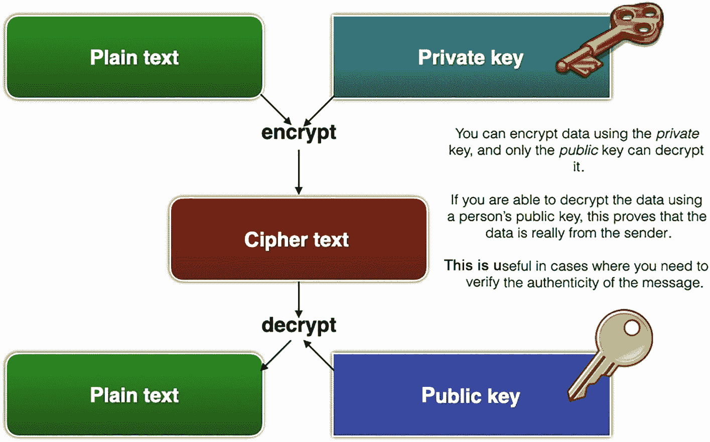

# 1. 理解区块链背后的科学：密码学

您阅读本书的原因是想了解什么是区块链、它如何工作，以及如何在其上编写智能合约来完成酷炫的事情。虽然我完全理解您渴望在第一章就开始动手，但我们需要退一步，审视一项使区块链成为可能的基础技术：`密码学`。

在本章中，我将解释什么是密码学、不同类型的密码学算法、它们如何工作，以及它们在区块链世界中扮演的关键角色。我还将向您展示如何使用 Python 编程语言来试验各种密码学算法。即使您熟悉密码学，我也建议您通读本章，以便为后续章节打下坚实基础。

## 什么是密码学？

无论你是要构建一个用于存储用户凭据的 Web 应用程序，还是编写一个用于安全传输加密消息的网络应用程序，甚至只是想了解区块链的工作原理，你都需要理解一个重要主题：密码学。

那么，密码学到底是什么？简单来说，密码学（或隐密术）是研究如何隐藏信息的实践与学科。它是保障信息安全与机密性的科学。

最简单且广为人知的密码算法之一是凯撒密码。这是一种非常简单的算法，将明文中的每个字母替换为字母表中固定偏移位置后的字母。请参考图 1-1 所示的示例。



一张字母表按两种不同顺序排列在中央的示意图。每个字母位于独立方块中。上方明文显示为 `attack`。下方密文显示为 `D W W D F N`。

图 1-1 理解凯撒密码的工作原理

如图所示，字母表中的每个字母都向下移动了三个位置。`A` 变成 `D`，`B` 变成 `E`，以此类推。如果你想发送一个句子（称为明文），比如 `ATTACK`，给接收方，你需要使用上述算法将句子中的每个字符进行映射，从而得到加密后的句子（称为密文）：`DWWDFN`。当接收方收到密文后，他们会逆向这个过程以恢复明文。虽然这个算法看似令人印象深刻（尤其在密码学早期），但一旦有人知道消息的加密方式，它就不再有效。尽管如此，这很好地说明了早期密码学发明者试图隐藏信息的尝试。如今，我们使用的密码算法要复杂和安全得多。

在接下来的小节中，我将解释主要的密码学函数类型及其用途。

## 密码学的类型

密码学主要有三种类型：

*   哈希函数
*   对称密码学
*   非对称密码学

在下面的小节中，我将详细阐述上述每种类型。

## 哈希函数

哈希是将任意大小的数据块转换为固定大小值的过程。执行此过程的函数称为哈希函数。图 1-2 展示了哈希过程。



一张包含两个矩形和一个位于中央的圆形的示意图。它描述了使用哈希函数将可变长度输入转换为固定长度输出的过程。

图 1-2 哈希函数将可变长度的数据块转换为固定长度的输出

提示：一个常用的哈希函数是 `SHA256`。`SHA` 是安全哈希算法的缩写。

例如，`SHA256` 哈希函数将一段文本转换为 256 位的哈希输出。生成的哈希通常用十六进制表示，由于每个十六进制数占用 4 位，因此 256 位哈希将有 64 个字符。要体验哈希的工作方式，请访问 `https://emn178.github.io/online-tools/sha256.html`，输入一个句子并观察结果（参见图 1-3）。



一张标题为“在线工具”的截图。它描述了使用 `SHA256` 在线哈希函数将可变长度输入转换为固定长度输出的过程。

图 1-3 尝试 `SHA256` 哈希函数

哈希具有以下重要特性：

*   **抗原像性**：根据生成的哈希，无法获取原始文本块。
*   **确定性**：相同的文本块始终产生相同的哈希输出。
*   **抗碰撞性**：很难找到两个不同的文本块却能产生相同的哈希。

哈希的另一个重要特性是，原始文本中的单个更改会导致生成完全不同的哈希。这被称为雪崩效应。例如，图 1-4 所示输入中单个字符的变化将产生完全不同的输出。



两张包含两个矩形和一个位于中央的圆形的示意图。它们描述了使用哈希函数将具有单个更改的可变长度输入转换为具有不同输出的固定长度输出的过程。

图 1-4 输入中的单个变化会导致输出哈希完全不同

### 哈希的用途

哈希在计算中扮演着非常重要的角色。例如，网站使用哈希来存储你的密码，而不是以明文形式存储。将密码存储为哈希可以防止黑客逆向哈希获取你的原始密码（该密码很可能也用于其他网站）。

哈希在区块链中也起着至关重要的角色，其中每个区块都通过前一个区块的哈希与上一个区块“链接”起来。对某个区块的任何修改都会使存储在下一个区块中的哈希失效，从而后续所有区块都将无效。

提示：一些常用的哈希算法包括 `MD5`、`SHA256`、`SHA512` 和 `Keccak-256`。

### 在 Python 中实现哈希

注意：要在你的计算机上安装 Python，最简单的方法是下载 Anaconda 包（`www.anaconda.com/products/distribution`）。如果你不想在计算机上安装 Python，可以使用 Google Colab（`https://colab.research.google.com`）。

在 Python 中，你可以使用 `hashlib` 模块来执行哈希操作。以下代码片段使用 `sha256()` 函数对字符串进行哈希：

```python
import hashlib
result = hashlib.sha256(
bytes("The quick brown fox jumps over the lazy dog",'utf-8'))
```

请注意，要被哈希的字符串必须作为字节数组传递给 `sha256()` 函数。因此，你使用 `bytes()` 函数将字符串转换为字节数组。或者，在 Python 中，你可以在字符串前加上 `b` 来表示字节字符串字面量：

```python
result = hashlib.sha256(
b'The quick brown fox jumps over the lazy dog')
```

`sha256()` 函数返回一个 `sha256` 哈希对象。要获取十六进制形式的哈希结果，你可以调用 `sha256` 哈希对象的 `hexdigest()` 函数：

```python
print(result.hexdigest())
```

上述字符串的哈希值如下：

```
d7a8fbb307d7809469ca9abcb0082e4f8d5651e46d3cdb762d02d0bf37c9e592
```

如果你对原始字符串做一个小改动，输出结果将与之前的哈希截然不同：

```python
result = hashlib.sha256(
b'The quick brown fox jumps over the lazy dag')
print(result.hexdigest())
# 输出：
# 559cc2cb0e1998182b4b6343e38611b3757e8a6279d43e9914d74dfb7e7089e6
```

## 对称密码学

在对称密码学中，加密明文和解密密文使用的是同一个密码密钥（通常称为 `共享密钥`）。图 1-5 展示了使用共享密钥进行加密和解密的过程。



这张框图展示了使用共享密钥将明文加密成密文，以及将密文解密成明文的过程。

**图 1-5** – 使用共享密钥进行加密和解密

对称密码学快速且简单，但主要问题在于如何确保密钥的保密性。例如，如果汤姆想给苏珊发送一条秘密消息，汤姆可以使用共享密钥对消息进行加密，而苏珊则可以使用相同的共享密钥对加密后的消息进行解密。这里的问题是，汤姆如何安全地将共享密钥发送给苏珊？汤姆可以通过电子邮件发送吗？通过短信或 WhatsApp 发送？或者通过传统的邮局？所有这些方法都不是绝对安全的，都存在被窃听的风险。此外，有句流行的话说：“三人若想守密，除非两人已死。”这意味着，如果知道秘密的人不止一个，那它就不再是秘密了。

话虽如此，对称密码学自有其用途和应用。当你想保护自己的私人数据时，它会非常有用。例如，假设你的电脑上有一些机密数据，你想防止他人看到。使用对称密码学，你可以使用同一个密钥加密和解密这些数据，而这个密钥只有你知道，没有其他人知道。

> **提示**
> 对称密钥算法的一些例子包括 `AES`（高级加密标准，原名 Rijndael）、`DES`（数据加密标准）和 `IDEA`（国际数据加密算法）。

### 在 Python 中生成共享密钥

在 Python 中，你可以使用 `cryptography` 模块来进行对称和非对称密码学操作。要使用 `cryptography` 模块，请使用 `pip` 安装它：

```bash
$ pip install cryptography
```

让我们在 Python 中生成一个共享密钥。为此，需要使用 `Fernet` 类：

```python
from cryptography.fernet import Fernet
# 生成共享密钥
shared_key = Fernet.generate_key()
print(shared_key)
# 返回 base64 编码的二进制格式
# 每次运行这段代码都会生成一个新的密钥
# 例如：b'ixXEfrz2NTJlxy1OhxXlsCiFf0Ycg_GL0Cy0MlgTv4U='
```

> **提示**
> `Fernet` 类是对称（也称为“密钥”）认证密码学的一种实现。Fernet 在 CBC 模式下使用 `AES` 算法，并采用 128 位密钥进行加密。更多详情，请参阅 [`https://github.com/fernet/spec/blob/master/Spec.md`](https://github.com/fernet/spec/blob/master/Spec.md)。

`generate_key()` 函数返回一个共享密钥，其格式为二进制，并且是 base64 编码的。

### 执行对称加密

要使用共享密钥加密数据，你首先需要使用该共享密钥创建一个 `Fernet` 类的实例：

```python
# 创建 Fernet 类的实例
fernet = Fernet(shared_key)
```

然后，你可以使用 `encrypt()` 函数来加密数据：

```python
# 使用共享密钥加密消息
ciphertext = fernet.encrypt(
bytes("秘密消息！",'utf-8'))
# 记得传入一个字节数组
```

你可以将加密后的数据保存到文件中：

```python
# 将加密消息写入文件
with open('message.encrypted', 'wb') as f:
    f.write(ciphertext)
```

你也可以将共享密钥保存到文件中：

```python
# 将共享密钥写入文件
with open('symmetric_key.crypt', 'wb') as f:
    f.write(shared_key)
```

### 执行对称解密

解密过程与加密类似。首先，从文件中（即你之前保存的位置）加载共享密钥：

```python
with open('symmetric_key.crypt', 'rb') as f:
    shared_key = f.read()
    print(shared_key)
```

然后，使用该共享密钥创建一个 `Fernet` 类的实例，并调用 `decrypt()` 函数来解码密文：

```python
# 创建 Fernet 类的实例
fernet = Fernet(shared_key)
# 从文件中读取并解密已加密的消息
with open('message.encrypted', 'rb') as f:
    print(fernet.decrypt(f.read()).decode("utf-8"))
```

## 非对称密码学

与使用单个共享密钥的对称密码学不同，非对称密码学使用一对密钥：一个公钥和一个私钥。

> **提示**
> 非对称密码学也称为公钥密码学。

公钥算法会生成两个在数学上相关联的密钥：

- **一个公钥和一个私钥**：顾名思义，公钥应该公开。而私钥则必须绝对保密。
- 你可以使用公钥加密数据，并使用私钥解密。例如，如果汤姆想给苏珊发送一条秘密消息，汤姆可以使用苏珊的公钥加密消息，只有苏珊能用她的私钥解密该秘密消息。
- 你可以使用私钥加密数据，并使用公钥解密。起初，这听起来有点违反直觉。如果有人可以用公钥（它应该是公开的）来解密，那么这样做的意义何在？实际上，这非常有用。假设汤姆用自己的私钥加密了一条消息并发送给苏珊。当苏珊收到消息后，她可以尝试使用汤姆的公钥进行解密。如果消息能够被解密，则意味着该消息未被篡改，并且确实来自汤姆。反之，如果消息被篡改过，苏珊将无法使用汤姆的公钥解密该消息。这种技术被用于创建 `数字签名`。

> **提示**
> 公钥算法的一些例子包括 `RSA`（Rivest–Shamir–Adleman）、椭圆曲线密码学（`ECC`）和 `TLS/SSL` 协议。

图 1-6 展示了第一种方法，即使用公钥加密数据，然后使用私钥解密。



这张框图分别展示了使用公钥和私钥将明文加密成密文，以及将密文解密成明文的过程。

**图 1-6** – 使用公钥加密数据，然后使用私钥解密密文

图 1-7 展示了第二种方法，即使用私钥加密数据，然后使用公钥解密。



这张框图分别展示了使用私钥和公钥将明文加密成密文，以及将密文解密成明文的过程。

**图 1-7** – 使用私钥加密数据，然后使用公钥解密密文

### 生成并保存公钥/私钥对

让我们使用 `cryptography` 模块，采用一些常用参数来生成公钥/私钥对：

```python
from cryptography.hazmat.backends import default_backend
from cryptography.hazmat.primitives.asymmetric import rsa
# 生成私钥
private_key = rsa.generate_private_key(
    public_exponent=65537,
    key_size=2048,
    backend=default_backend()
)
# 从私钥派生公钥
public_key = private_key.public_key()
```

在这段代码中，你使用 `RSA` 算法首先生成了一个私钥。利用私钥，你可以推导出对应的公钥。密钥生成后，将它们序列化（扁平化）保存到文件中会很有用：

```python
from cryptography.hazmat.primitives import serialization
#---将私钥序列化为字节数据---
pem = private_key.private_bytes(
    encoding = serialization.Encoding.PEM,
    format = serialization.PrivateFormat.PKCS8,
    encryption_algorithm = serialization.NoEncryption()
)
with open('private_key.pem', 'wb') as f:
    f.write(pem)
#---将公钥序列化为字节数据---
pem = public_key.public_bytes(
    encoding = serialization.Encoding.PEM,
    format = serialization.PublicFormat.SubjectPublicKeyInfo
)
with open('public_key.pem', 'wb') as f:
    f.write(pem)
```

你还需要能够从文件中重新加载它们：

```python
with open('private_key.pem', 'rb') as f:
    private_key = serialization.load_pem_private_key(
        f.read(),
        password = None,
        backend = default_backend()
    )
with open('public_key.pem', 'rb') as f:
    public_key = serialization.load_pem_public_key(
        f.read(),
        backend = default_backend()
    )
```

### 使用公钥加密

现在你可以使用公钥进行加密了：

```python
from cryptography.hazmat.primitives import hashes
from cryptography.hazmat.primitives.asymmetric import padding
plaintext = bytes("This message is secret.",'utf-8')
# 使用公钥加密消息
ciphertext = public_key.encrypt(
    plaintext,
    padding.OAEP(
        mgf = padding.MGF1(algorithm = hashes.SHA256()),
        algorithm = hashes.SHA256(),
        label = None
    )
)
```

注意：加密后的密文是一个字节数组。