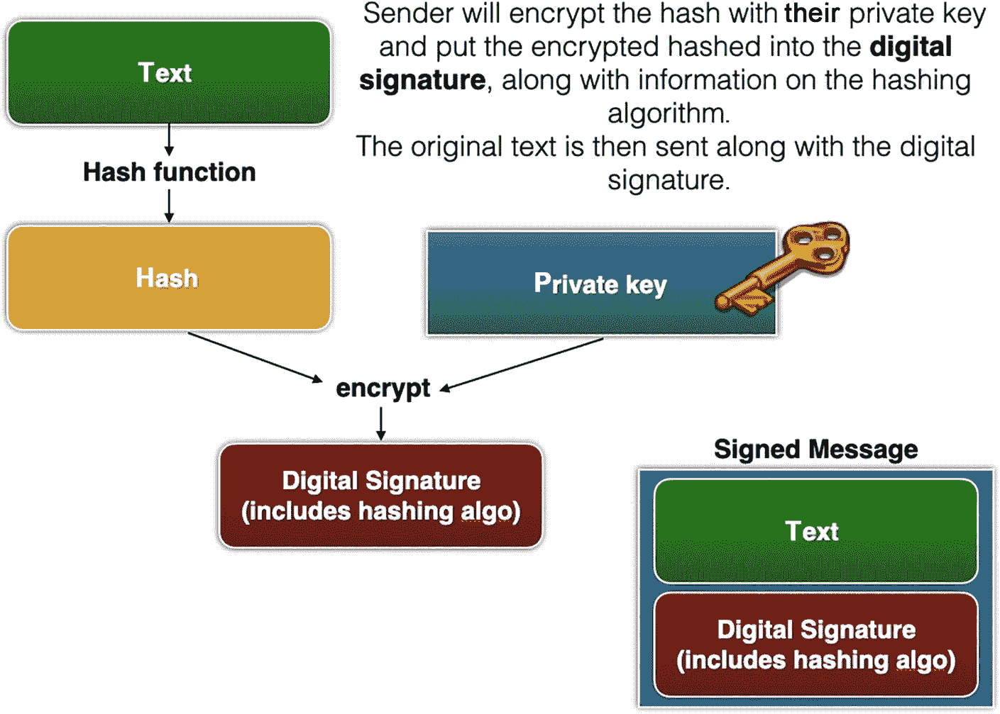
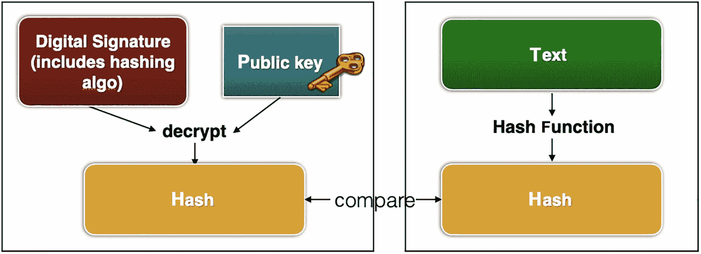
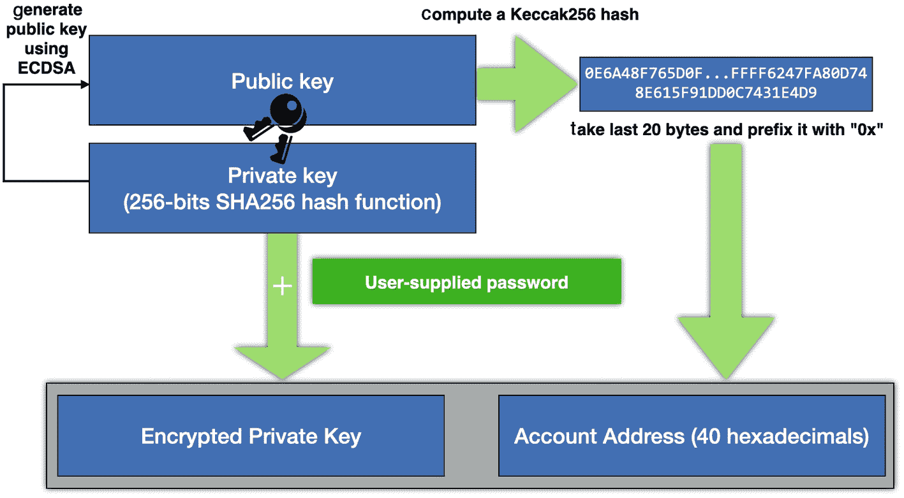
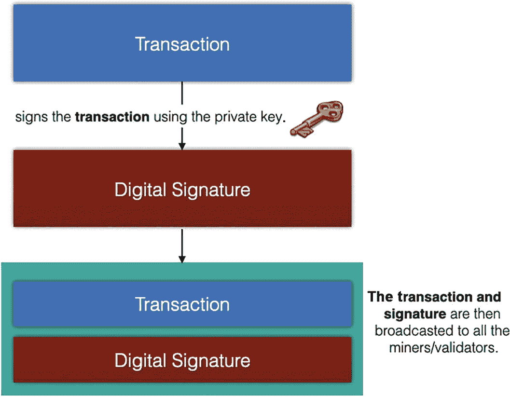

# 使用私钥解密

创建密文后，你可以使用私钥对其进行解密：

```python
# 使用私钥解密
plaintext = private_key.decrypt(
    ciphertext,
    padding.OAEP(
        mgf=padding.MGF1(algorithm=hashes.SHA256()),
        algorithm=hashes.SHA256(),
        label=None
    )
)
# 解码明文，因为它是字节数组
print(plaintext.decode('utf-8'))
# This message is secret.
```

**注意**

解密后的明文是一个字节数组。

# 数字签名：使用私钥签名

前面我提到，在数字签名中，你先使用私钥进行加密，然后使用公钥进行解密。这究竟是如何运作的，又有何用途？让我们来看看图 1-8 所示的事件流程。



数字签名生成的框图。文本通过哈希函数生成哈希值，该哈希值使用私钥加密，然后生成数字签名。签名的消息包括文本和数字签名。

**图 1-8** 使用私钥生成数字签名

*   首先，使用哈希函数对要发送的文本进行哈希运算。
*   然后使用私钥对哈希值进行加密，并将其转换为数字签名（这也包含了所使用的哈希算法信息）。
*   原始文本和数字签名一起发送给接收方。这被称为签名的消息。

图 1-9 显示了接收方收到签名的消息后发生的情况。



框图说明了如何使用公钥验证数字签名。左侧包括三个模块，如数字签名、公钥和哈希值，中央模块为解密。右侧，文本链接到哈希值。两者比较签名的消息。

**图 1-9** 使用公钥验证数字签名

*   收到签名的消息后，接收方使用发送方的公钥从数字签名中解密出哈希值。
*   接收方还对收到的文本进行哈希运算，并将其与上一步解密出的哈希值进行比较。
*   如果两个哈希值匹配，则意味着文本未被篡改。

**注意**

数字签名是一种用于验证消息、软件或数字文档的真实性和完整性的数学技术。

让我们使用私钥创建一个数字签名。

从技术上讲，你不能在私钥上调用 `encrypt()` 函数：

```python
private_key.encrypt(...)    # 错误
# AttributeError: '_RSAPrivateKey' object has no attribute 'encrypt'
```

相反，你应该调用 `sign()` 函数：

```python
import base64
plaintext = bytes("This message is public.", 'utf-8')
# 使用私钥对消息进行签名
signed = private_key.sign(
    plaintext,
    padding.PSS(
        mgf=padding.MGF1(algorithm=hashes.SHA256()),
        salt_length=padding.PSS.MAX_LENGTH
    ),
    hashes.SHA256()
)
# 使用 base64 编码打印数字签名
signed_base64 = base64.b64encode(signed).decode('utf-8')
print(signed_base64)
```

这里你使用私钥对消息进行签名。`sign()` 函数返回字符串的数字签名。它返回一个字节数组形式的数字签名，在上面的代码片段中，你使用 base64 编码并将其转换为字符串。输出看起来像这样：

```
aNUZixxLUiRRpDjm+nqkcaZo5URklvIA/hiSECR+DoLmS+oVb650Ic5/vg6ADmCvi91CSwiXRYkknDBEr2qTWaK+Fe9UPqukDFx8WwyW7K2NacjS8TiKqAfPPSH4t2l9ohexwTqfih9oZXli57zfZ4LKaY63iQxXlWKE9S5OZ0hWyGUfygEInY8OZerGKWFnmxuXHjWNCpDmzSngP04MYBBnfoPVpsDg7vgKL0gpaz1dn2Qg+Ra2GFLmznqjYKq2qP43zLrdYSmzH3MmPAkO0AIh8XaRnHc+q0XYyUGhTBm9iIa7rS8eYaB7MD9G18j0HA7lWWVQjqujnFCQNm8Npg==
```

当你传输消息（`plaintext`）时，你也需要同时发送数字签名。

## 使用公钥验证数字签名

当接收方收到消息和数字签名时，他们可以通过在公钥上调用 `verify()` 函数来简单地验证消息是否未被篡改：

```python
from cryptography.exceptions import InvalidSignature
# 从 base64 解码数字签名
signed = base64.b64decode(signed_base64)
try:
    public_key.verify(
        signed,
        plaintext,    # 来自上一节
        padding.PSS(
            mgf=padding.MGF1(hashes.SHA256()),
            salt_length=padding.PSS.MAX_LENGTH
        ),
        hashes.SHA256()
    )
    print('签名有效！')
except InvalidSignature:
    print('签名无效！')
```

请注意，你必须捕获 `verify()` 函数引发的异常。如果没有异常，则认为签名正确；否则，签名无效。

# 密码学在区块链中的应用

如果你一直跟进到此处，现在应该对密码学的工作原理有了很好的了解。你可能现在想知道密码学在区块链中是如何扮演重要角色的。

以下各节将讨论各种密码算法在区块链中的应用。如果你是区块链新手，可以随意跳过以下章节，直接阅读下一章。在阅读完以下章节后，再回过头来阅读接下来的几节：

*   第 2 章：哈希算法用于在区块链中“链接”区块。
*   第 4 章和第 5 章：非对称密码学用于生成账户，对称密码学用于保护你在加密钱包中创建的账户。
*   第 4 章及之后：非对称密码学用于为你所有在区块链上的交易创建数字签名。

### 哈希

如前所述，哈希用于在区块链中“链接”区块。区块链中的每个区块都包含上一个区块的哈希值。这样做可以确保记录在区块链上的数据不可篡改，从而防止被修改。

哈希的另一个良好用途是在区块链上存储数据时。由于公共区块链上的所有数据都公开可查，你不应将私有数据存储在公共区块链上。如果需要将私有数据存储在公共区块链上以作证明，则应存储数据的哈希值，因为哈希值不可逆。第 7 章对此提供了很好的示例。

### 对称加密与非对称加密

对称加密和非对称加密用于生成和保护区块链中的账户。

如图 1-10 所示，当你在以太坊中创建账户时，首先会使用非对称加密生成一个私钥。



一个流程图包含公钥和私钥，取最后 20 个字节，在其前面加上 `0x` 账户地址，并用用户提供的密码对私钥进行加密。

**图 1-10** 了解账户是如何生成和保护的

使用此私钥，通过 `ECDSA`（椭圆曲线数字签名算法）生成一个公钥。然后，使用 `Keccak256` 哈希算法，利用此公钥生成账户地址。该输出的最后 20 个字节用作账户的地址。

同时，请记住，当你创建账户时，必须提供一个密码。此密码用于使用对称加密对你的私钥进行加密。

### 数字签名

在区块链中，创建交易时会使用数字签名。在第 4 章中，你将学习如何通过从一个账户向另一个账户发送一些以太币来创建一个简单交易。

当你创建一笔交易时，会使用你账户的私钥对交易进行签名，从而生成数字签名。然后，数字签名连同交易详情会被广播到区块链网络中的各个矿工/验证者（见图 1-11）。



一个框图说明了数字签名如何创建交易。它从交易开始，通过使用私钥签署交易生成数字签名，最后以广播交易和签名结束。

**图 1-11** 为交易创建数字签名以证明创建者的身份

矿工/验证者在收到你的交易后，会使用交易的数字签名来验证交易的真实性。一旦交易被验证为真实，矿工/验证者就会继续验证交易的内容。

# 总结

在本章中，你了解了区块链背后的主要科学：密码学。你学习了哈希、对称加密和非对称加密。如果你熟悉 Python，我强烈建议你尝试运行代码示例，以便亲身体验各种加密算法。至此，你已经准备好深入区块链的世界了。我们第 2 章见！