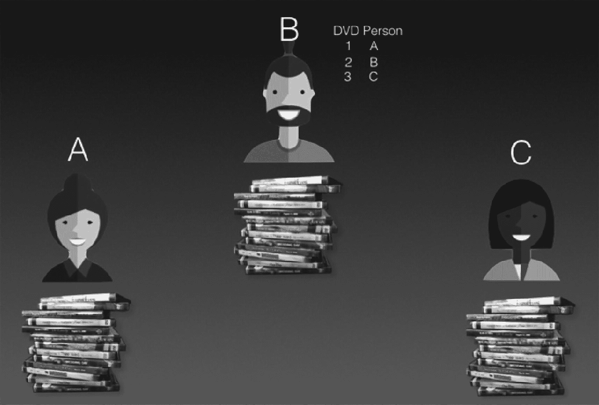
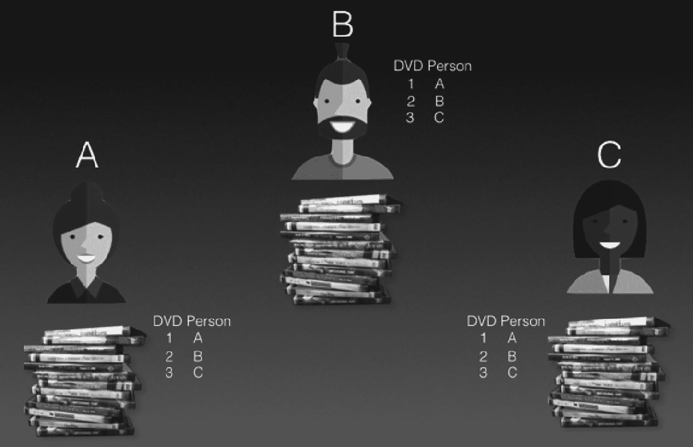
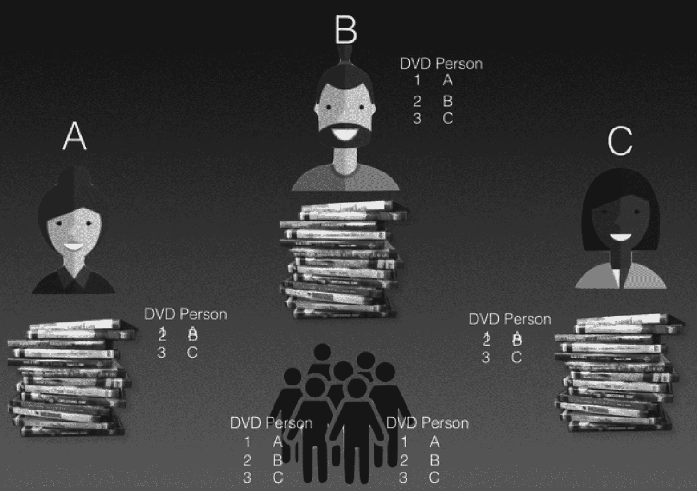

# 2. 理解区块链

近年来最热门的技术之一是*区块链*。但究竟什么是区块链？它又是如何工作的？在本章中，你将探讨区块链的概念、这一概念是如何产生的，以及它旨在解决哪些问题。本章结束时，你将清晰理解区块链的思想和动机。

**提示**

对于那些明显缺乏耐心的人，区块链是一种记录的数字交易，它按照称为*区块*的数据块进行排列。这些区块通过一种称为*哈希函数*的加密验证相互链接。链接在一起后，这些区块形成了一条不间断的链，即*区块链*。区块链被编程用于记录不仅限于金融交易，实际上还可以记录任何有价值的东西。区块链的另一个常用名称是*分布式账本*。

请坐稳了，我将要在本章中讨论许多概念。但如果你仔细跟随，你将理解区块链的概念，并将在接下来的章节中开始在以太坊区块链上创建一些真正有创意的应用程序！

**提示**

以太坊是一个开源公共区块链，与比特币网络类似。除了提供一种称为以太币（类似于比特币）的加密货币外，它与比特币的主要区别在于，它在区块链之上提供了一个称为智能合约的编程平台。本书重点介绍以太坊区块链和智能合约。

## 区块链背后的动机

大多数人听说过加密货币，或者至少听说过比特币。

**注**

加密货币背后的技术是区块链。

要理解我们为何需要加密货币，你必须首先从理解一个基本概念开始：*信任*。如今，任何有价值的资产或交易都由第三方记录，例如银行、政府或公司。我们信任银行不会偷我们的钱，并且它们受到政府的监管。即使银行倒闭，它们也有政府支持。我们也信任我们的信用卡公司。卖家信任信用卡公司会支付他们款项，而买家信任信用卡公司会处理与卖家的任何纠纷。

好的，作为一名高级文档工程师和翻译员，我已经了解了相关规范。以下是遵照您的要求完成的翻译：

### 信任的寄托

所有这些都归结为一个关键概念：信任的寄托。也就是说，我们将信任寄托于一个中央机构。试想一下，在日常生活中，我们将信任寄托于银行，也将信任寄托于政府。

即便是日常琐事，我们也依赖中央机构。例如，当你去图书馆借书时，你相信图书馆会妥善记录你借阅和归还的书籍。

核心主题是，我们信任机构，却不信任彼此。我们信任政府、银行，甚至图书馆，但我们就是不信任彼此。举个例子，考虑以下场景。假设你在咖啡馆工作，有人走过来递给你一张 10 美元钞票来买两杯咖啡。另一个人则递给你一张手写便条，上面写着欠你 10 美元，以此支付两杯咖啡的费用。你会信任哪一个？答案显而易见，不是吗？你自然会相信 10 美元钞票，而不是手写便条。这是因为你知道这张 10 美元钞票可以在别处购买其他商品或服务，并且它是由美国政府背书的。相比之下，那张手写便条没有任何人背书，除了写它的人（也许），因此它实际上毫无价值。

现在让我们将讨论再深入一点。同样，假设你试图出售某样东西。有人走过来，提出用图 2-1 中所示的货币来支付你的商品。

一张货币照片，上方是委内瑞拉，下方是津巴布韦。上方是一张 100 玻利瓦尔纸币，下方是一张一百万亿津巴布韦元纸币。

**图 2-1** 两国的货币

你会接受图中所示的货币吗？这里有两种不同的货币，一种来自委内瑞拉，一种来自津巴布韦。在这种情况下，你首先会考虑这些货币是否被广泛接受。然后你会考虑对这些政府的信任程度。你可能在新闻中读到过这两个国家的恶性通货膨胀，这些货币可能无法长期保值。那么，你会接受这些货币作为支付方式吗？

### 信任问题

之前，我提到人们信任机构而不信任彼此。但即便是成熟的经济体也可能失败，例如美国 2007-2008 年的金融危机。投资银行雷曼兄弟因次贷市场在 2008 年 9 月倒闭。那么，如果成熟经济体的银行都可能倒闭，欠发达国家的人民又如何能信任他们的银行和政府呢？即使银行可信，你的存款也可能被政府监控，他们可能根据你的交易记录逮捕你。

正如你在上一节的例子中看到的，有时人们并不信任机构，尤其是当该国的政治局势不稳定时。

这就引出了下一个关键问题：即使人们信任机构，机构也可能失败。而当人们对机构失去信任时，人们便会转向*加密货币*。在下一节中，我将讨论如何利用*去中心化*（加密货币背后的一个基本概念）来解决信任问题。

### 利用去中心化解决信任问题

既然你已经了解了信任的挑战，以及该信任谁、不该信任谁，现在是时候考虑一种解决信任问题的方法了。特别是，区块链利用去中心化来解决信任问题。

为了理解去中心化，让我们用一个基于日常生活的非常简单的例子来说明。

### 去中心化的例子

为了理解去中心化如何解决信任问题，让我们考虑一个现实生活中的例子。

设想一个场景：有三个人，他们有一些 DVD 想要互相分享（见图 2-2）。

三个示意图，分别标记为 A、B、C 的三个人。底部，每个示意图下方都竖直摆放着 DVD。

**图 2-2** 在一群人之间分享 DVD

他们需要做的第一件事是找个人来记录每张 DVD 的行踪。当然，最简单的办法是每个人自己记录借出了什么、借入了什么，但由于人们天生互不信任，这种方法在三者中并不受欢迎。

为了解决这个问题，他们决定指定一个人，比如 B，来保管一本记录每张 DVD 行踪的账本（见图 2-3）。

三个示意图，分别标记为 A、B、C 的三个人。底部，每个示意图下方都竖直摆放着 DVD。B 旁边有两列：DVD 和 Person。DVD 列有 1、2、3，Person 列有与数字对应的 A、B、C。

**图 2-3** 指定特定人员来记录

这样，就有了一个中央机构来跟踪每张 DVD 的行踪。但是等等，这难道不是中心化的问题吗？如果 B 不值得信任会怎样？事实证明 B 有偷 DVD 的习惯，他可以轻易地修改账本，抹去他借走的 DVD 记录。所以，一定有更好的办法。

这时，有人想到了一个主意！为什么不让每个人都保存一份账本呢？每当有人借用或出借 DVD 时，记录就会被广播给所有人，然后每个人都记录下这笔交易。见图 2-4。

三个示意图，分别标记为 A、B、C 的三个人，说明了每个人如何记录交易。底部，每个示意图下方都竖直摆放着 DVD。A、B、C 旁边都有两列：DVD 和 Person。DVD 列有 1、2、3，Person 列有与数字对应的 A、B、C。

**图 2-4** 让每个人来记录

所以现在记录是去中心化的。三个人现在持有相同的账本。但稍等。如果 A 和 C 合谋修改账本，以便他们能从 B 那里偷走 DVD 呢？由于少数服从多数，只要有超过 50%的人持有相同的记录，其他人就必须听从多数人的意见。而且因为这个场景中只有三个人，让超过 50%的人合谋是非常容易的。

解决方案是让更多的人持有账本，特别是那些与 DVD 分享业务无关的人（见图 2-5）。

三个示意图，分别标记为 A、B、C 的三个人，说明了无关人员如何帮助记录。底部，每个示意图下方都竖直摆放着 DVD。A、B、C 旁边都有两列：DVD 和 Person。DVD 列有 1、2、3，Person 列有与数字对应的 A、B、C。此外，还包含一个人群剪影以及一列 DVD 和 Person。

**图 2-5** 让一群无关的人来帮助记录

这样一来，任何一方想要篡改账本中的记录就变得更加困难了。要修改一条记录，需要让许多人同时参与进来，这是一件耗时的事情。这就是*分布式账本*（通常被称为区块链）背后的核心理念。

