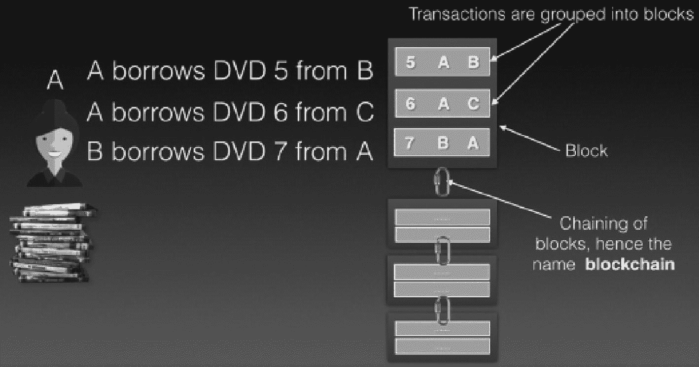
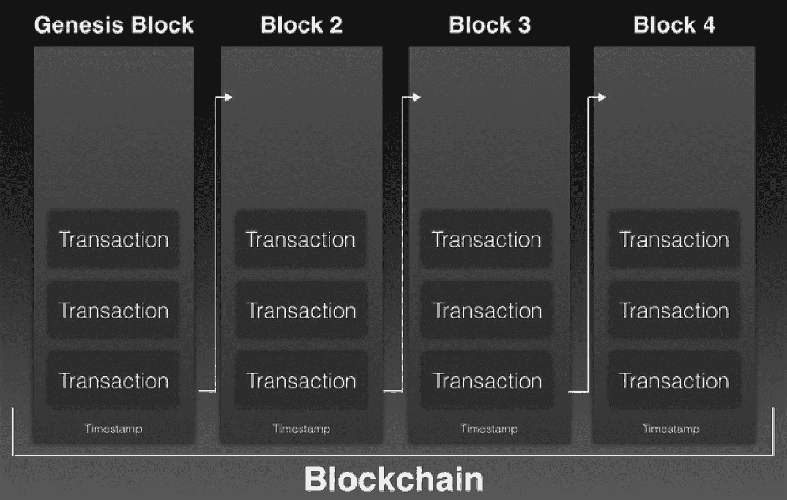
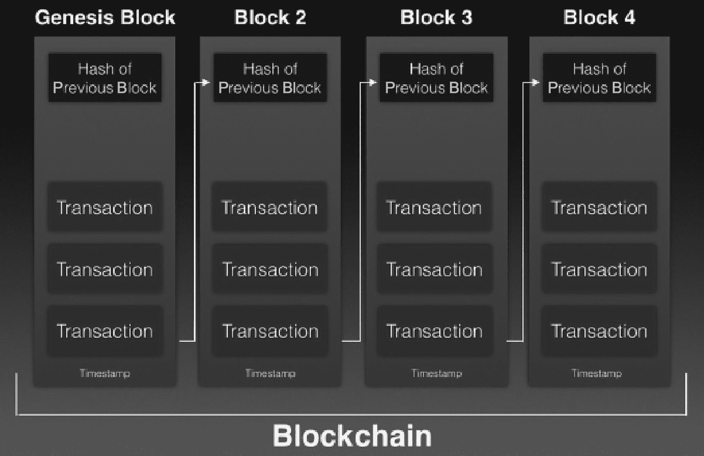
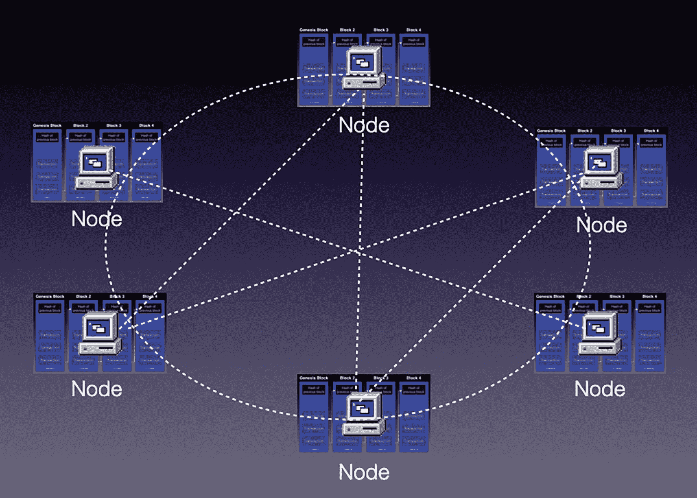
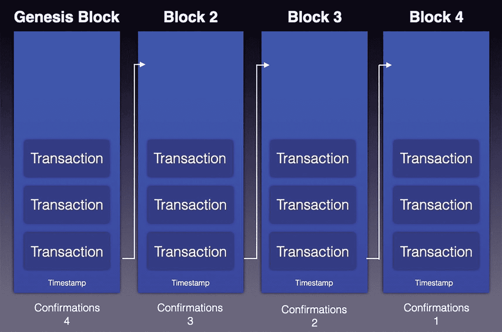
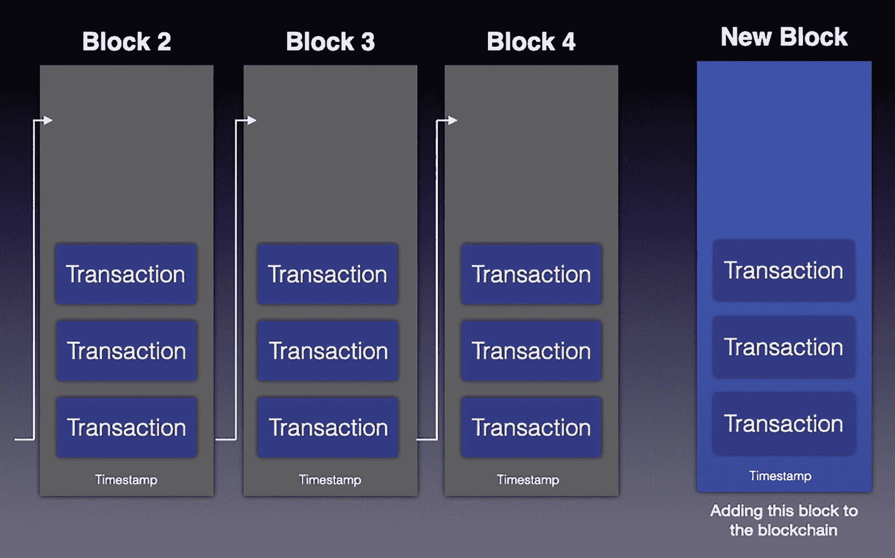
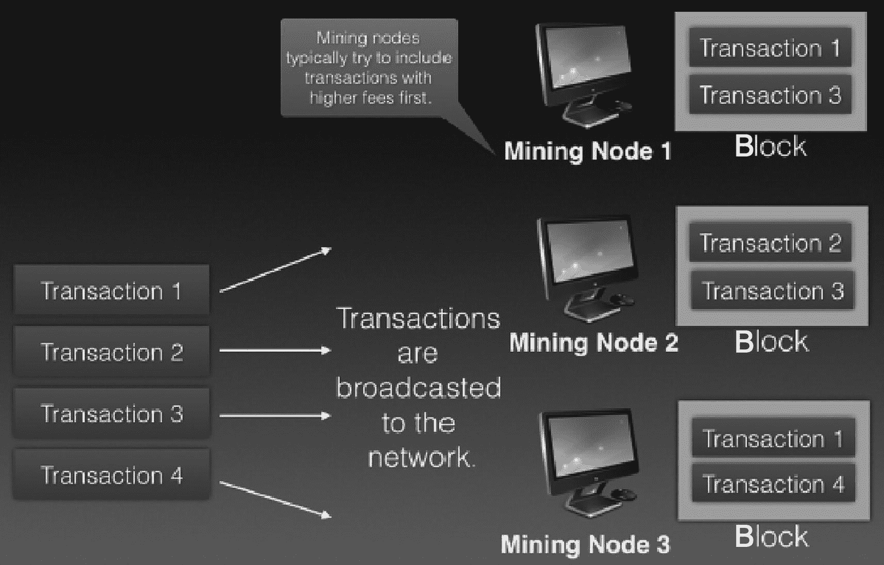
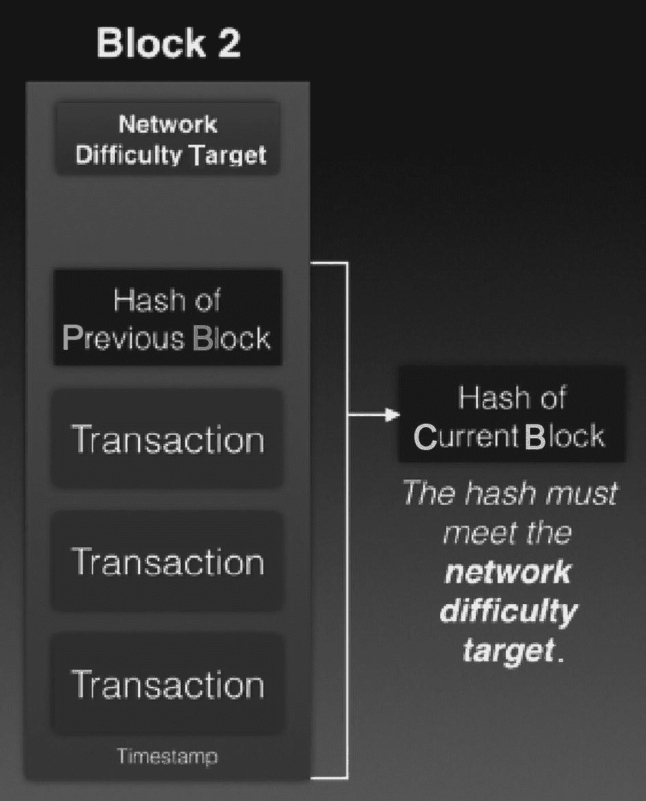
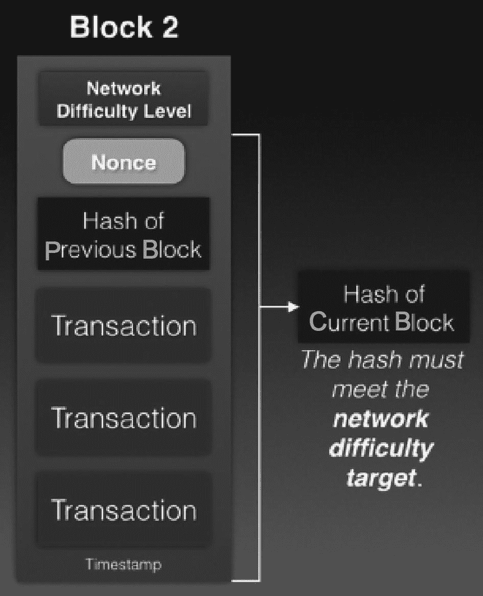

# 区块链作为分布式账本

既然你对分布式账本有了更深入的了解，就可以将其与*区块链*这一术语联系起来。以 DVD 交换为例，每次借出或归还 DVD 时，都会创建一笔交易。多笔交易被分组到一个区块中。随着更多交易的进行，这些区块通过密码学方式链接在一起，形成了我们现在所说的区块链（见图 2-6）。

一张示意图解释了交易及其链接是如何形成区块链的。图中标记为 A 的人与发生交易的区块相连，随着交易增加，这些区块串联成链，从而形成区块链。交易内容包括 A 从 B 处借入 DVD、A 从 C 处借入 DVD，以及 B 从 A 处借入 DVD。

**图 2-6** 交易形成区块，区块再串联成链

以下是一些要点的总结：

- 当法律体系、政府、监管机构和人们之间存在信任时，中心化数据库和机构就能发挥作用。
- 建立在区块链上的去中心化数据库消除了对中心化主体信任的需求。
- 区块链可用于任何有价值的事物，而不仅仅是货币。

## 区块链的工作原理

从宏观层面来看，区块链由多个区块组成。每个区块包含一组交易列表和一个时间戳（见图 2-7）。

一张示意图解释了区块链如何连接各个区块。它包括创世区块，并链接到区块 2、区块 3 和区块 4。每个区块都包含交易列表和时间戳记录。

**图 2-7** 每个区块链都有一个被称为创世区块的起始区块

区块之间通过密码学方式相互连接，我将在后续章节中详细讨论其细节。区块链中的第一个区块被称为*创世*区块。

> **注意**
> 每个区块链都有一个创世区块。

那么，下一个重要的问题是：如何将这些区块链接在一起呢？

### 链接区块

要理解区块链中的区块是如何链接在一起的，你必须理解一个关键概念：*哈希*。

> **提示**
> 第 1 章更详细地讨论了哈希。在继续本节之前，请务必先阅读该章节。

回忆一下，哈希函数是一种将任意大小的数据映射为固定大小数据的函数。通过改变原始字符串中的单个字符，得到的哈希值会与之前完全不同。最重要的是，请注意原始信息中的单一改变会导致完全不同的哈希值，这使得很难知道这两条原始信息是相似的。

哈希函数具有以下特征：

- **确定性**：相同的消息总是产生相同的哈希值。
- **单向过程**：当你对字符串进行哈希运算时，在计算上很难将哈希值逆向还原为原始消息。
- **抗碰撞性**：很难找到两个不同的输入消息，其哈希值相同。

现在，你已准备好学习区块链中的区块是如何链接在一起的。为了将区块链接起来，每个区块的内容会被哈希，然后存储在下一个区块中（见图 2-8）。这样，如果某个区块中的任何交易被篡改，就会使当前区块的哈希值失效，该哈希值存储在下一个区块中，进而使下一个区块的哈希值失效，以此类推。

一张示意图解释了区块链如何连接各个区块。它包括创世区块，并链接到区块 2、区块 3 和区块 4。每个区块都包含交易列表、前一个区块的哈希值以及时间戳记录。

**图 2-8** 使用哈希值链接区块

请注意，在对区块内容进行哈希运算时，前一个区块的哈希值会与交易一起被哈希。但请注意，这是对区块内容的简化说明。稍后，你将深入了解区块的细节，并确切了解交易在区块中是如何表示的。

将前一个区块的哈希值存储在当前区块中，确保了前一个区块中交易的完整性。对区块内交易的任何修改都会导致下一个区块中的哈希值失效，并影响区块链中的后续区块。如果黑客想要修改一笔交易，他们不仅需要修改某个区块中的交易，还需要修改区块链中所有其他后续的区块。此外，他们还需要将这些更改同步到网络上的所有其他计算机，这是一项计算成本极高的任务。因此，存储在区块链中的数据是*不可篡改的*，因为一旦交易所在的区块被添加到区块链中，就极难更改。

此刻，你已经对区块链的样子有了相当清晰的认识。在现实世界中，区块链存储在多台计算机（称为节点）上，这些节点通常分布在全球各地（见图 2-9）。

一张示意图解释了全球范围内相互连接的节点如何存储数据。6 个节点通过虚线相互连接。

**图 2-9** 区块链中区块的确认

每个节点都以点对点的方式相互连接。存储整个区块链的节点被称为*全节点*。

### 区块链的不可篡改性

在区块链中，每个区块通过使用密码学哈希值与其前一个区块链接。如果父区块的身份发生变化，当前区块的身份也会随之改变。这进而导致当前区块的子区块发生变化，并影响孙子区块，以此类推。对一个区块的更改会强制重新计算所有后续区块，这需要巨大的计算能力。这使得区块链具有不可篡改性，这是比特币和以太坊等加密货币的关键特征。

随着新区块被添加到区块链中，该交易区块被称为已被区块链*确认*。当一个区块被新添加时，它被认为有一个确认。随着另一个区块被添加到它之上，其确认数量会增加。图 2-10 显示了区块链中各区块的确认数量。一个区块的确认次数越多，将其从区块链中移除就越困难。

> **提示**
> 通常，一旦一个区块有六个或更多确认，它就被认为不可逆转。因此，存储在区块链中的数据是不可篡改的。

一张示意图解释了区块链如何连接各个区块以及确认数量如何增加。它包括创世区块，并链接到区块 2、区块 3 和区块 4。每个区块都包含交易列表、前一个区块的哈希值以及时间戳记录。

**图 2-10** 区块链中区块的确认

### 共识协议

当一笔交易发生时，该交易会被广播到网络中，以便整理成一个区块，随后该区块可以添加到现有的区块链上（见图 2-11）。

一张示意图解释了如何在区块链中添加新区块。图中包含区块 2、区块 3 和区块 4。右侧是新区块。每个区块都包含一个交易列表、前一个区块的哈希值以及时间戳报告。

*图 2-11 向区块链中添加新区块*

那么，究竟由谁来整理这些交易呢？而且，由于可能同时发生多笔交易，又由谁来负责将区块添加到区块链上呢？这就涉及了*共识协议*（也称为*共识算法*）。

顾名思义，共识协议是一种让区块链中所有节点达成一致的方法。由于交易被广播到网络中，所有节点之间必须达成某种共识，以决定哪些交易应该被包含进每个区块。否则，区块链将毫无意义。

在区块链世界中，存在着多种共识协议。以下列出其中几种：

- 工作量证明
- 权益证明
- 委托权益证明
- 实用拜占庭容错
- 经过时间证明

在本章中，我将只重点介绍上述前两种共识协议。

比特币的区块链实现使用了工作量证明。以太坊最初也使用工作量证明，但在 2022 年 9 月转换到了一种能效高得多的共识协议——权益证明。

### 工作量证明

在 `PoW` 中，负责整理所有交易的节点被称为*挖矿节点*（或*矿工节点*）。当一笔交易发生时，该交易会被广播到所有挖矿节点。图 2-12 展示了网络中不同用户创建的四笔交易被广播到各个挖矿节点的过程。

一张示意图描述了交易如何广播到不同的挖矿节点。交易 1、2、3 和 4 连接到挖矿节点 1、2 和 3，然后被组装成区块。每个区块都包含交易 1 作为公共交易。

*图 2-12 交易被广播到挖矿节点，这些节点将它们组装成待挖矿的区块*

由于网络延迟，每个挖矿节点可能在不同的时间接收到这些交易。当一个节点接收到交易时，它会尝试将它们包含在一个区块中。请注意，每个节点可以自由选择将任何交易包含进区块。在实践中，哪些交易被包含进区块取决于几个因素，例如交易费用、交易大小、到达顺序等等。矿工的目标是尝试用交易填满区块，以便进入下一步，即将区块添加到区块链上。

此时，那些被包含在区块中但尚未添加到区块链上的交易被称为*未确认交易*。一旦区块被交易填满，挖矿节点就会尝试将该区块添加到区块链。

现在问题来了：面对如此多的矿工，谁才能率先将区块添加到区块链上呢？

#### 挖矿过程

为了减缓向区块链添加区块的速度，`PoW` 共识协议规定了一个*网络难度目标*（见图 2-13）。

一个区块图解释了区块 2 中的网络难度目标。区块 2 包含网络难度目标、前一个区块的哈希值、交易和时间戳。它链接到当前区块的哈希值。

*图 2-13 对区块进行哈希运算以满足网络难度目标*

为了成功地将一个区块添加到区块链，矿工需要对区块内容进行哈希运算，并检查该哈希值是否满足*难度目标*设定的标准。例如，得到的哈希值必须以五个零开头，等等。

随着更多矿工加入网络，难度级别会提高。例如，哈希值现在必须以六个零开头，等等。这使得区块能够以一致的速度被添加到区块链。

> **注意**
> 对于比特币，难度每 2,016 个区块（大约每两周）调整一次，以便每个区块之间的平均时间保持在 10 分钟。

但是等等！区块的内容是固定的，因此无论你如何对其进行哈希运算，得到的哈希值总是相同的。那么，如何确保得到的哈希值能够满足难度目标呢？为此，矿工向区块中添加一个 `nonce`，它代表*只使用一次的数字*（见图 2-14）。

一个区块图解释了在区块 2 中添加 `nonce` 后的网络难度目标。区块 2 包含网络难度目标、`nonce`、前一个区块的哈希值、交易和时间戳。它链接到当前区块的哈希值。

*图 2-14 添加 nonce 以改变区块内容，从而满足网络难度目标*

第一个达成目标的矿工将获得奖励，并将该区块添加到区块链。他们通过将区块广播给其他节点来实现这一点，以便这些节点能够验证该声明并停止当前挖矿工作。这些矿工会放弃当前的工作，然后重新开始挖掘新区块的过程。那些未被成功挖掘的区块包含的交易将被添加到下一个待挖掘的区块中。

> **矿工奖励**
> 以比特币为例，区块奖励最初为 50 BTC，并且每 210,000 个区块减半。在撰写本文时，区块奖励为 6.25 BTC，并将在经历 64 次减半事件后最终降至 0。对于以太坊，在合并之前，挖掘一个区块的奖励是 2 ETH（以太币）。合并之后，奖励机制稍微复杂一些。你可以访问 [`https://ethereum.org/en/developers/docs/consensus-mechanisms/pos/rewards-and-penalties/`](https://ethereum.org/en/developers/docs/consensus-mechanisms/pos/rewards-and-penalties/) 了解更多详情。

> **区块添加速率**
> 对于比特币，网络会调整谜题的难度，使得大约每 10 分钟挖掘出一个新区块。对于使用 `PoW` 的以太坊，大约每 14 秒挖掘出一个区块。

为什么这个过程被称为工作量证明呢？原因在于，要找到这个证明需要耗费大量的工作！找到证明很困难，但验证证明却很容易。`PoW` 的一个典型例子是破解密码锁。找到正确的密码组合需要花费大量时间，但一旦找到组合，验证起来就非常简单了。

> **双重支付**