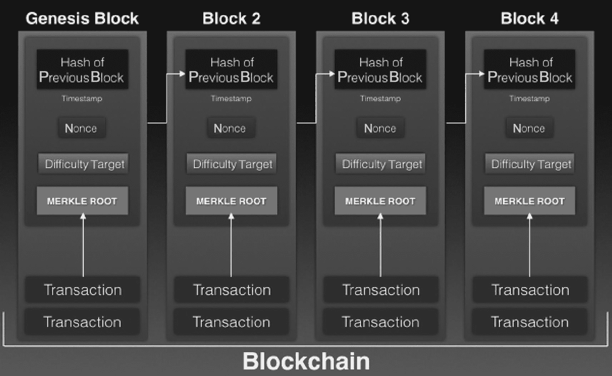
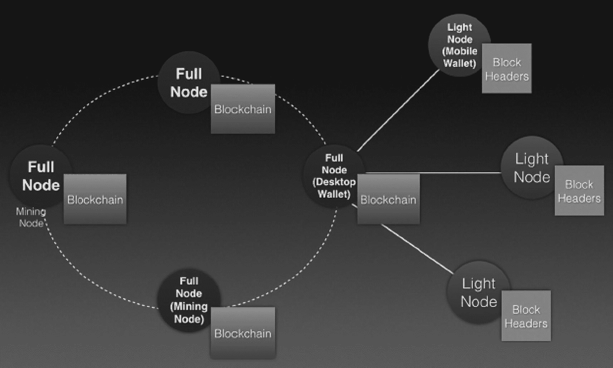
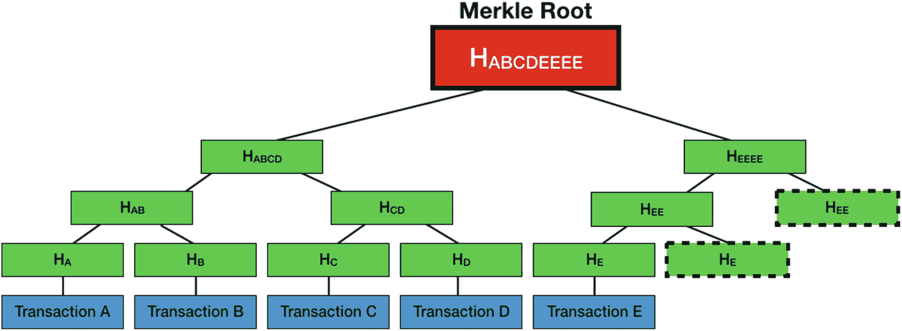
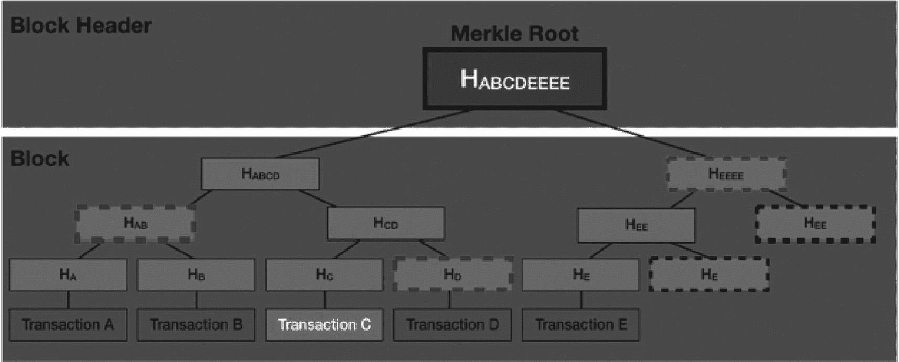

# 更详细的区块链

在前一节中，您了解到一个区块包含`nonce`、时间戳以及交易列表。那是一个简化版本。在实际实现中，一个区块由以下部分组成：

- 区块头
- 交易列表

区块头又由以下部分组成：

- 前一个区块的哈希
- 时间戳
- `默克尔`根
- `nonce`
- 网络难度目标

注意，区块头包含的是*`默克尔`根*，而不是交易（参见图`[2-15]`）。交易被整体表示为`默克尔`根，其细节将在接下来的几节中讨论。

```

```

一个区块图包含以下区块：创世区块，链接到区块`2`、区块`3`和区块`4`。每个区块都有一个交易列表、前一个区块的哈希、时间戳报告、`nonce`、`默克尔`根和难度目标。

**图 2-15**

一个区块包含区块头，区块头中又包含交易的`默克尔`根


### 节点类型

在讨论将默克尔根存储在区块头中的原理之前，我需要先介绍区块链网络中的节点类型。图 2-16 展示了区块链网络中不同类型的节点。



该图展示了区块链网络中的不同类型节点，包括全节点、矿工节点和桌面钱包节点。桌面钱包节点连接至移动钱包和轻节点。

图 2-16

区块链网络中不同类型的节点

如前所述，连接到区块链网络的计算机被称为节点。我已讨论了矿工/验证者节点的作用，其主要职责是将交易收集到区块中，然后尝试将该区块添加到区块链上。矿工/验证者节点也被称为*全节点*。

> **提示：** 全节点不一定是矿工/验证者节点。然而，矿工/验证者节点必须是全节点。

全节点的目的是确保区块链的完整性，运行全节点的人不会获得奖励。另一方面，矿工/验证者节点在成功将区块添加到区块链后可以获得奖励。

全节点的一个例子是桌面钱包，它允许用户使用加密货币进行交易。

每个全节点都拥有整个区块链的副本。全节点还会验证提交给它的每一个区块和交易。

除了全节点，还有*轻节点*。轻节点通过一种称为*简单支付验证*（SPV）的方法来帮助验证交易。SPV 允许节点在不下载整个区块链的情况下，验证某笔交易是否已被包含在某个区块中。通过使用 SPV，轻节点连接到全节点，并将交易发送给全节点进行验证。

轻节点只需要存储区块链中所有区块的区块头。轻节点的一个例子是移动钱包，例如适用于 iOS 和 Android 的 Coinbase 移动应用。通过移动钱包，用户可以在移动设备上进行交易。

> **注意：** 桌面钱包可以是全节点，也可以是轻节点。

以下是到目前为止所讨论的节点类型的总结。

*   **全节点：**
    *   维护区块链的完整副本
    *   能够验证自创世以来的所有交易
    *   验证新创建的区块并将其添加到区块链中
    *   访问以下站点即可查看当前以下区块链的全节点数量：
        *   比特币：[`https://bitnodes.earn.com`](https://bitnodes.earn.com)
        *   以太坊：[`www.ethernodes.org/network/1`](http://www.ethernodes.org/network/1)
*   **矿工节点**（必须是全节点）：
    *   解决一个难题（寻找随机数 nonce）
*   **轻节点**（例如钱包）：
    *   维护区块链的区块头
    *   使用 SPV 验证某一区块中的交易是否存在且有效

最后，你将在下一节看到将交易表示为区块头中的默克尔根的实际应用。

### 默克尔树与默克尔根

区块中的交易列表以*默克尔树*的形式存储。默克尔树是一种树形数据结构，其中每个叶节点是一笔交易的哈希值，而每个非叶节点是其子节点的加密哈希值。图 2-17 展示了默克尔根是如何从交易中推导出来的。



该树状图解释了默克尔根是如何推导的。默克尔根推导为 `H` 下标 `A B C D E E E E`，然后分为 `H` 下标 `A B C D` 和 `H` 下标 `E E E E`。进一步地，最终节点为交易 A、交易 B、交易 C、交易 D 和交易 E。

图 2-17

默克尔根是如何从默克尔树中推导出来的

如您所见，每笔交易都被哈希处理。每笔交易的哈希值会与另一个节点的哈希值进行配对并哈希。例如，交易 A 的哈希值 (`H[A]`) 与交易 B 的哈希值 (`H[B]`) 组合，并经过哈希计算得到 `H[AB]`。这个过程不断重复，直到只剩下一个最终的哈希值。这个最终的哈希值被称为默克尔根。在本例中，因为 `H[E]` 没有其他节点与之配对，所以它与自身进行哈希计算。`H[EE]` 也是如此。

默克尔根存储在区块头中，而其余的交易则以默克尔树的形式存储在区块中。在之前的讨论中，我提到了全节点。全节点会下载整个区块链。还有另一种节点（称为*轻节点*）只下载区块链的区块头。由于轻节点不下载整个区块链，因此它们更容易维护和运行。通过一种称为*简单支付验证*（SPV）的方法，轻节点可以向全节点查询以验证一笔交易。轻节点的例子包括加密钱包。

### 默克尔树与默克尔根的用途

通过将默克尔根存储在区块头中，并将交易以默克尔树的形式存储在区块中，轻节点可以轻松地验证一笔交易是否属于某个特定区块。其工作原理如下。假设一个轻节点想要验证交易 C 是否存在于某个特定区块中。

*   轻节点向全节点查询以下哈希值：`H[D]`、`H[AB]` 和 `H[EEEE]`（见图 2-18）。
*   由于轻节点可以计算出 `H[C]`，然后它可以使用提供的 `H[D]` 计算出 `H[CD]`。
*   有了提供的 `H[AB]`，它现在可以计算出 `H[ABCD]`。
*   有了提供的 `H[EEEE]`，它现在可以计算出 `H[ABCDEEEE]`（即默克尔根）。
*   由于轻节点拥有该区块的默克尔根，现在它可以检查两个默克尔根是否匹配。如果匹配，则该交易验证通过。

从这个简单的例子可以看出，要验证五个交易中的单个交易，只需要从全节点获取三个哈希值。从数学上讲，对于一个包含 `n` 笔交易的区块，需要 `log2[n]` 个哈希值来验证一笔交易是否在该区块中。例如，如果一个区块中有 1,024 笔交易，轻节点只需请求 10 个哈希值即可验证该区块中是否存在某笔交易。



该树状图解释了从默克尔根出发的交易验证过程。区块头是 `H` 下标 `A B C D E E E E`，诸如 `H` 下标 `A B C D`，`H` 下标 `E E E E`，`H` 下标 `A`，`H` 下标 `B`，`H` 下标 `C`，`H` 下标 `D`，`H` 下标 `E` 这些块属于区块部分。

图 2-18

默克尔树和默克尔根如何用于验证交易

## 本章小结

在本章中，您学习了区块链背后的动机及其旨在解决的问题。您探索了如何通过称为“挖矿”的过程将区块添加到区块链中。在下一章中，您将学习如何使用 Python 构建自己的区块链，以便您能够理解并看到区块链的内部运作机制。

