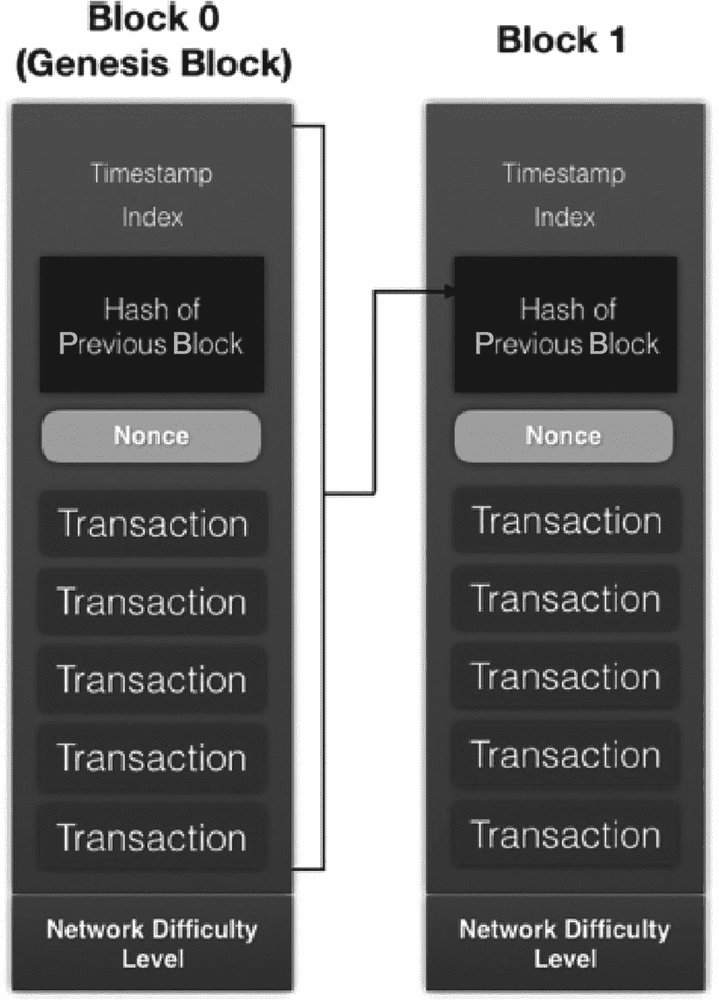
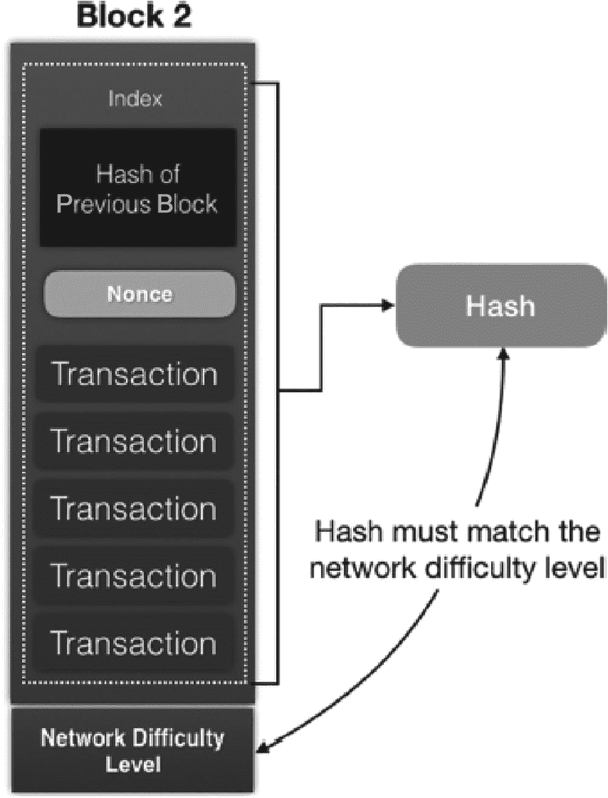
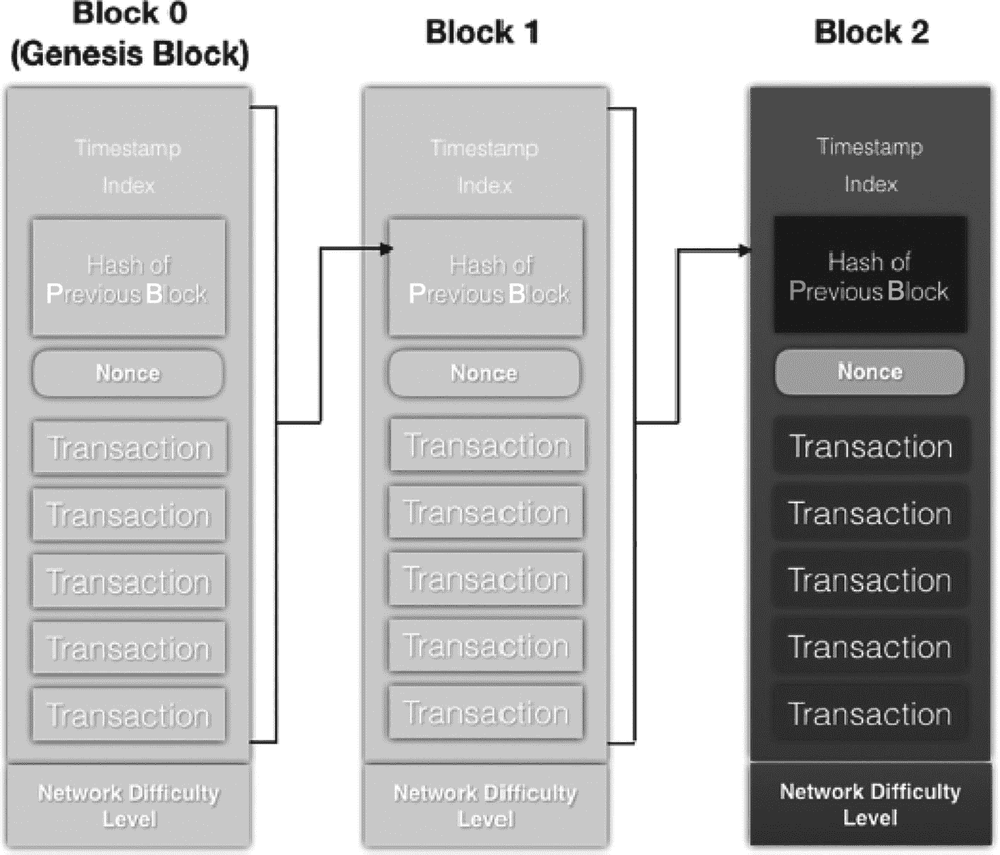
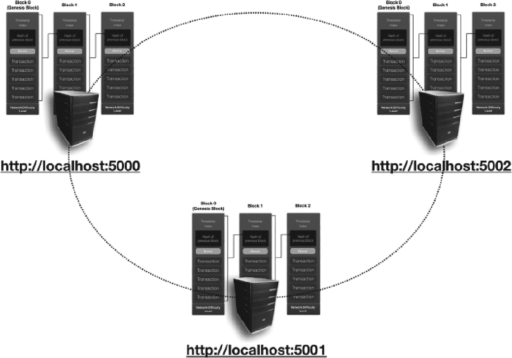
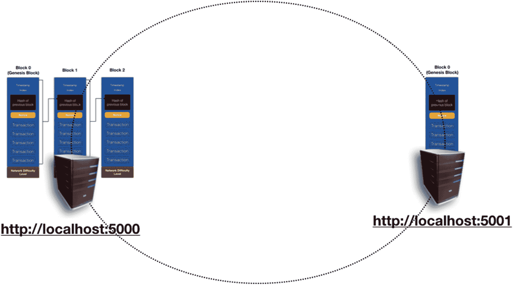

# 你的概念性区块链实现

在本章中，你将构建如图 3-1 所示的极简区块链。



区块图包含两个部分，例如区块 0（即创世区块）链接到区块 1。每个区块包含以下过程：前一个区块的哈希值、随机数、交易和网络难度级别。

**图 3-1** – 你的概念性区块链

为简化起见，你的区块链中的每个区块将包含以下组成部分：

- **时间戳**：该区块被添加到区块链的时间
- **索引**：从 0 开始的递增数字，表示区块编号
- **前一个区块的哈希值**：前一个区块的哈希结果。如图 3-1 所示，该哈希值是对区块内容（包括时间戳、索引、前一个区块的哈希值、随机数和所有交易）进行哈希运算的结果。
- **随机数**：*一次性使用的数值*
- **交易**：每个区块将包含数量不等的交易。

> **注意**：为简化起见，你无需考虑用默克尔树表示交易，也无需将区块分为区块头和区块内容。

*网络难度级别*固定为四个零；也就是说，为了推导出随机数，区块哈希的结果必须以四个零开头。

> **提示**：关于随机数的概念及其与网络难度级别的关系，请参考第 2 章。

## 获取随机数

对于你的示例区块链实现，随机数的求解方法是：将随机数与区块索引、前一个区块的哈希值以及所有交易组合，然后检查生成的哈希值是否匹配网络难度级别（见图 3-2）。



区块图由区块 2 组成，该区块包含索引、前一个区块的哈希值、随机数、交易、网络难度级别，并链接到右侧的哈希值。

**图 3-2** – 在你的概念性区块链中如何推导随机数

一旦找到随机数，该区块就会被附加到区块链的最后一个区块上，并添加时间戳（见图 3-3）。



示意图包含区块 0、区块 1 和区块 2，其中区块 2 包含以下过程：时间戳、索引、前一个区块的哈希值、随机数、交易和网络难度级别。

**图 3-3** – 一旦某个区块被挖出，它将被附加到区块链上，并为其添加时间戳

## 安装 Flask

对于你的概念性区块链，你将把它运行为一个 REST API，以便通过 REST 调用与其交互。为此，你将使用 **Flask** 微框架。要安装 Flask，请在终端中输入以下命令：

```
$ pip install flask
$ pip install requests
```

这些命令将安装 Flask 微框架。

> **提示**：Flask 是一个 Web 框架，能够让构建 Web 应用程序变得简单快捷。

## 导入各种模块和库

首先，创建一个名为 `blockchain.py` 的文本文件。在该文件顶部，导入所有必要的库和模块：

```
import sys
import hashlib
import json
from time import time
from uuid import uuid4
from flask import Flask, jsonify, request
import requests
from urllib.parse import urlparse
```

## 在 Python 中声明类

为了表示区块链，声明一个名为 `Blockchain` 的类，并包含以下两个初始方法：

```
class Blockchain(object):
    difficulty_target = "0000"

    def hash_block(self, block):
        block_encoded = json.dumps(block, sort_keys=True).encode()
        return hashlib.sha256(block_encoded).hexdigest()

    def __init__(self):
        # 存储整个区块链中的所有区块
        self.chain = []
        # 临时存储当前区块的交易
        self.current_transactions = []
        # 使用特定的固定哈希值创建创世区块
        # 创世区块从前一个区块开始，索引为 0
        genesis_hash = self.hash_block("genesis_block")
        self.append_block(
            hash_of_previous_block=genesis_hash,
            nonce=self.proof_of_work(0, genesis_hash, [])
        )
```

这将创建一个名为 `Blockchain` 的类，其中包含两个方法：

- `hash_block()` 方法将一个区块编码为字节数组，然后对其进行哈希运算；你需要确保字典已排序，否则后续会出现哈希值不一致的问题。
- `__init__()` 函数是类的构造函数。在这里，你将整个区块链存储为一个列表。由于每个区块链都有一个创世区块，你需要使用前一个区块的哈希值来初始化创世区块。在本示例中，你只需使用一个固定的字符串 `genesis_block` 来获取其哈希值。一旦找到前一个区块的哈希值，你需要使用名为 `proof_of_work()` 的方法（将在下一节中定义）来求解该区块的随机数。

`proof_of_work()` 方法（下文详述）将返回一个随机数，该随机数在对当前区块内容进行哈希运算时，会生成一个符合难度目标的哈希值。

为简化起见，你将 `difficulty_target` 固定为以四个零（"`0000`"）开头的哈希结果。

> **提示**：你的区块链的源代码将在本章末尾展示。对于心急的读者，你可以边阅读本章的各种概念边查看代码。

## 寻找随机数

现在定义 `proof_of_work()` 方法来求解区块的随机数：

```
# 使用工作量证明来寻找当前区块的随机数
def proof_of_work(self, index, hash_of_previous_block, transactions):
    # 从随机数 = 0 开始尝试
    nonce = 0
    # 不断尝试将随机数与前一个区块的哈希值进行哈希运算，直到有效为止
    while self.valid_proof(index, hash_of_previous_block, transactions, nonce) is False:
        nonce += 1
    return nonce
```

`proof_of_work()` 函数从随机数为零开始，检查随机数与区块内容一起是否能生成符合难度目标的哈希值。如果不能，则将随机数递增 1，然后继续尝试，直到找到正确的随机数。

下一个方法 `valid_proof()` 对区块内容进行哈希运算，并检查区块的哈希值是否满足难度目标：

```
def valid_proof(self, index, hash_of_previous_block, transactions, nonce):
    # 创建一个包含前一个区块哈希值和区块内容（包括随机数）的字符串
    content = f'{index}{hash_of_previous_block}{transactions}{nonce}'.encode()
    # 使用 sha256 进行哈希运算
    content_hash = hashlib.sha256(content).hexdigest()
    # 检查哈希值是否满足难度目标
    return content_hash[:len(self.difficulty_target)] == self.difficulty_target
```

## 将区块附加到区块链

一旦找到区块的随机数，你就可以编写将区块附加到现有区块链的方法。这是 `append_block()` 方法的功能：

```
# 创建一个新区块并将其添加到区块链中
def append_block(self, nonce, hash_of_previous_block):
    block = {
        'index': len(self.chain),
        'timestamp': time(),
        'transactions': self.current_transactions,
        'nonce': nonce,
        'hash_of_previous_block': hash_of_previous_block
    }
    # 重置当前的交易列表
    self.current_transactions = []
    # 将新区块添加到区块链
    self.chain.append(block)
    return block
```

当区块被添加到区块链时，当前的时间戳也会被添加到该区块中。


### 添加交易

接下来要添加到 `Blockchain` 类的方法是 `add_transaction()` 方法：

```
def add_transaction(self, sender, recipient, amount):
self.current_transactions.append({
'amount': amount,
'recipient': recipient,
'sender': sender,
})
return self.last_block['index'] + 1
```

该方法会将一笔新交易添加到当前交易列表中。接着，它会获取区块链中最后一个区块的索引并加一。这个新索引就是当前交易将要添加到的区块编号。

为了获取区块链中的最后一个区块，需要在 `Blockchain` 类中定义一个名为 `last_block` 的属性：

```
@property
def last_block(self):
# returns the last block in the blockchain
return self.chain[-1]
```

### 将区块链类公开为 REST API

现在 `Blockchain` 类已经完成了，接下来我们使用 Flask 将其公开为 REST API。将以下语句追加到 `blockchain.py` 文件的末尾：

```
app = Flask(__name__)
# generate a globally unique address for this node
node_identifier = str(uuid4()).replace('-', '')
# instantiate the Blockchain
blockchain = Blockchain()
```

### 获取完整区块链

对于 REST API，我们需要创建一个路由供用户获取当前区块链。因此，将以下语句追加到 `blockchain.py` 的末尾：

```
# return the entire blockchain
@app.route('/blockchain', methods=['GET'])
def full_chain():
response = {
'chain': blockchain.chain,
'length': len(blockchain.chain),
}
return jsonify(response), 200
```

## 执行挖矿

还需要创建一个路由，允许矿工挖掘新区块并将其添加到区块链中：

```
@app.route('/mine', methods=['GET'])
def mine_block():
blockchain.add_transaction(
sender="0",
recipient=node_identifier,
amount=1,
)
# obtain the hash of last block in the blockchain
last_block_hash = \
blockchain.hash_block(blockchain.last_block)
# using PoW, get the nonce for the new block to be added
# to the blockchain
index = len(blockchain.chain)
nonce = blockchain.proof_of_work(index, last_block_hash,
blockchain.current_transactions)
# add the new block to the blockchain using the last block
# hash and the current nonce
block = blockchain.append_block(nonce, last_block_hash)
response = {
'message': "New Block Mined",
'index': block['index'],
'hash_of_previous_block':
block['hash_of_previous_block'],
'nonce': block['nonce'],
'transactions': block['transactions'],
}
return jsonify(response), 200
```

当矿工成功挖到一个新区块时，他们必须获得因找到工作量证明而得到的奖励。这里，你添加了一笔交易，向矿工发送一个单位的奖励，以示对其成功挖矿的奖励。

在挖矿时，你需要找到上一个区块的哈希值，并将其与当前区块的内容一起使用，以找到该区块的 nonce 值。一旦找到 nonce 值，就将其追加到区块链中。

### 添加交易

你要添加到 API 中的另一个路由是向当前区块添加交易的功能：

```
@app.route('/transactions/new', methods=['POST'])
def new_transaction():
# get the value passed in from the client
values = request.get_json()
# check that the required fields are in the POST'ed data
required_fields = ['sender', 'recipient', 'amount']
if not all(k in values for k in required_fields):
return ('Missing fields', 400)
# create a new transaction
index = blockchain.add_transaction(
values['sender'],
values['recipient'],
values['amount']
)
response = {'message':
f'Transaction will be added to Block {index}'}
return (jsonify(response), 201)
```

交易的一个示例是用户从一个账户向另一个账户发送加密货币。

## 测试你的区块链

现在你可以测试这个区块链了。在最后一步，将以下语句追加到 `blockchain.py` 的末尾：

```
if __name__ == '__main__':
app.run(host='0.0.0.0', port=int(sys.argv[1]))
```

在这个实现中，你可以让用户根据指定的端口号运行 API。

要启动第一个节点，请在终端中输入以下命令：

```
$ python blockchain.py 5000
```

你将看到以下输出：

```
* Serving Flask app "blockchain" (lazy loading)
* Environment: production
WARNING: Do not use the development server in a production environment.
Use a production WSGI server instead.
* Debug mode: off
* Running on http://0.0.0.0:5000/ (Press CTRL+C to quit)
```

你的第一个节点上的第一个区块链现在正在运行。它也在 5000 端口监听，你可以在该端口添加交易并挖掘区块。

在另一个终端窗口中，输入以下命令来查看该节点上运行的区块链内容：

```
$ curl http://localhost:5000/blockchain
```

你将看到以下输出（为清晰起见已格式化）：

```
{
"chain": [{
"hash_of_previous_block": "181cfa3e85f3c2a7aa9fb74f992d0d061d3e4a6d7461792413aab3f97bd3da95",
"index": 0,
"nonce": 61093,
"timestamp": 1560757569.810427,
"transactions": []
}],
"length": 1
}
```

**注意**

第一个区块（索引为 0）是创世区块。

让我们尝试挖掘一个区块，看看它如何影响区块链。在终端中输入以下命令：

```
$ curl http://localhost:5000/mine
```

被挖出的区块会返回：

```
{
"hash_of_previous_block": "0e8431c4a7fe132503233bc226b1f68c9d2bd4d30af24c115bcdad461dda48a0",
"index": 1,
"message": "New Block Mined",
"nonce": 24894,
"transactions": [{
"amount": 1,
"recipient": "084f17b6e5364cde86a231d1cc0c9991",
"sender": "0"
}]
}
```

**注意**

观察可以发现，该区块包含一笔交易，即给矿工的奖励。

现在你可以发出命令从节点获取区块链：

```
$ curl http://localhost:5000/blockchain
```

你将看到新挖出的区块已存在于区块链中：

```
{
"chain": [{
"hash_of_previous_block": "181cfa3e85f3c2a7aa9fb74f992d0d061d3e4a6d7461792413aab3f97bd3da95",
"index": 0,
"nonce": 61093,
"timestamp": 1560757569.810427,
"transactions": []
}, {
"hash_of_previous_block": "0e8431c4a7fe132503233bc226b1f68c9d2bd4d30af24c115bcdad461dda48a0",
"index": 1,
"nonce": 24894,
"timestamp": 1560759370.988651,
"transactions": [{
"amount": 1,
"recipient": "084f17b6e5364cde86a231d1cc0c9991",
"sender": "0"
}]
}],
"length": 2
}
```

**提示**

请记住，默认的难度目标是设置为四个零（`difficulty_target = "0000"`）。你可以将其改为五个零，然后重新测试区块链。现在挖出一个区块所需的时间会更长，因为要找到一个哈希值以五个零开头的 nonce 难度更大。

接下来，通过在终端中发出以下命令，向区块添加一笔交易：

```
$ curl -X POST -H "Content-Type: application/json" -d '{ "sender": "04d0988bfa799f7d7ef9ab3de97ef481", "recipient": "cd0f75d2367ad456607647edde665d6f", "amount": 5}' "http://localhost:5000/transactions/new"
```

**注意**

Windows 在命令行中使用 curl 时不支持单引号（`'`）。因此，你需要使用双引号，并使用反斜杠字符（`\`）来取消双引号字符串中双引号（`"`）的含义。前面的命令在 Windows 下应为：

`curl -X POST -H "Content-Type: application/json" -d "{ \"sender\": \"04d0988bfa799f7d7ef9ab3de97ef481\", \"recipient\": \"cd0f75d2367ad456607647edde665d6f\", \"amount\": 5}" "http://localhost:5000/transactions/new"`

你应该会看到以下结果：

```
{"message":"Transaction will be added to Block 2"}
```

现在你可以挖掘这个区块：

```
$ curl http://localhost:5000/mine
```

你应该会看到以下结果。


```json
{
  "hash_of_previous_block": "282991fe48ec07378da72823e6337e13be8524ced5100d55c591ae087631146d",
  "index": 2,
  "message": "新区块已挖出",
  "nonce": 61520,
  "transactions": [
    {
      "amount": 5,
      "recipient": "cd0f75d2367ad456607647edde665d6f",
      "sender": "04d0988bfa799f7d7ef9ab3de97ef481"
    },
    {
      "amount": 1,
      "recipient": "084f17b6e5364cde86a231d1cc0c9991",
      "sender": "0"
    }
  ]
}
```

该结果显示区块 2 已被挖出，其中包含两笔交易：一笔是你手动添加的，另一笔是给矿工的奖励。

你可以通过执行以下命令来查看区块链的内容：

```
$ curl http://localhost:5000/blockchain
```

你会看到新添加的区块中包含这两笔交易：

```json
{
  "chain": [
    {
      "hash_of_previous_block": "181cfa3e85f3c2a7aa9fb74f992d0d061d3e4a6d7461792413aab3f97bd3da95",
      "index": 0,
      "nonce": 61093,
      "timestamp": 1560757569.810427,
      "transactions": []
    },
    {
      "hash_of_previous_block": "0e8431c4a7fe132503233bc226b1f68c9d2bd4d30af24c115bcdad461dda48a0",
      "index": 1,
      "nonce": 24894,
      "timestamp": 1560759370.988651,
      "transactions": [
        {
          "amount": 1,
          "recipient": "084f17b6e5364cde86a231d1cc0c9991",
          "sender": "0"
        }
      ]
    },
    {
      "hash_of_previous_block": "282991fe48ec07378da72823e6337e13be8524ced5100d55c591ae087631146d",
      "index": 2,
      "nonce": 61520,
      "timestamp": 1560760629.10675,
      "transactions": [
        {
          "amount": 5,
          "recipient": "cd0f75d2367ad456607647edde665d6f",
          "sender": "04d0988bfa799f7d7ef9ab3de97ef481"
        },
        {
          "amount": 1,
          "recipient": "084f17b6e5364cde86a231d1cc0c9991",
          "sender": "0"
        }
      ]
    }
  ],
  "length": 3
}
```

## 同步区块链

在现实世界中，区块链网络由多个节点组成，这些节点维护着同一区块链的副本。因此，必须有一种方法让节点之间进行同步，以确保每个节点都指向同一个相同的区块链。

当你使用 Python 运行`blockchain.py`应用程序时，实际上只运行了一个节点。区块链的核心理念是去中心化。应该由多个节点共同维护区块链，而不是仅仅一个节点。

在示例中，你将对其进行修改，以便每个节点都能感知网络中的相邻节点（参见图 3-4）。



一张循环图展示了由许多节点组成的区块链。链接分别是 `http://localhost:5000`、`http://localhost:5001` 和 `http://localhost:5002`。

图 3-4 区块链网络应由多个节点组成

为了在你的示例中实现这一点，需要向`Blockchain`类中添加一些方法。首先，在`Blockchain`类的构造函数中添加一个`nodes`成员，并将其初始化为一个空`set`：

```python
def __init__(self):
    self.nodes = set()
    # 存储整个区块链中的全部区块
    self.chain = []
    ...
```

这个`nodes`成员用于存储其他节点的地址。接下来，向`Blockchain`类添加一个名为`add_node()`的方法：

```python
def add_node(self, address):
    parsed_url = urlparse(address)
    self.nodes.add(parsed_url.netloc)
    print(parsed_url.netloc)
```

该方法允许将一个新区块添加到节点成员中。例如，如果将`http://192.168.0.5:5000`传递给该方法，那么 IP 地址和端口号`192.168.0.5:5000`就会被添加到`nodes`成员中。

接下来要向`Blockchain`类添加的方法是`valid_chain()`：

```python
# 判断给定的区块链是否有效
def valid_chain(self, chain):
    last_block = chain[0]   # 创世区块
    current_index = 1       # 从第二个区块开始

    while current_index < len(chain):
        block = chain[current_index]
        if block['hash_of_previous_block'] != \
                self.hash_block(last_block):
            return False

        # 检查随机数是否有效
        if not self.valid_proof(
                current_index,
                block['hash_of_previous_block'],
                block['transactions'],
                block['nonce']):
            return False

        # 继续检查链上的下一个区块
        last_block = block
        current_index += 1

    # 链有效
    return True
```

`valid_chain()`方法通过执行以下检查来验证给定的区块链是否有效：

- 遍历区块链中的每个区块，对每个区块进行哈希计算，并验证每个区块的哈希是否正确记录在下一个区块中。
- 验证每个区块中的随机数是否有效。

最后，向`Blockchain`类添加`update_blockchain()`方法：

```python
def update_blockchain(self):
    # 获取已注册的周围节点
    neighbours = self.nodes
    new_chain = None

    # 为简化起见，寻找比我们更长的链
    max_length = len(self.chain)

    # 从网络中所有节点获取并验证链
    for node in neighbours:
        # 从其他节点获取区块链
        response = \
            requests.get(f'http://{node}/blockchain')

        if response.status_code == 200:
            length = response.json()['length']
            chain = response.json()['chain']

            # 检查链是否更长且有效
            if length > max_length and \
                    self.valid_chain(chain):
                max_length = length
                new_chain = chain

    # 如果发现了一条新的有效且更长的链，则替换当前链
    if new_chain:
        self.chain = new_chain
        return True

    return False
```

`update_blockchain()`方法通过检查相邻节点的区块链是否有效，并确定拥有最长有效链的节点具有权威性；如果另一个节点的有效区块链比当前节点更长，它将替换当前的区块链。

在定义了`Blockchain`类中的方法之后，现在可以为 REST API 定义路由了：

```python
@app.route('/nodes/add_nodes', methods=['POST'])
def add_nodes():
    # 从客户端获取传入的节点
    values = request.get_json()
    nodes = values.get('nodes')

    if nodes is None:
        return "Error: Missing node(s) info", 400

    for node in nodes:
        blockchain.add_node(node)

    response = {
        'message': 'New nodes added',
        'nodes': list(blockchain.nodes),
    }
    return jsonify(response), 201
```

`/nodes/add_nodes`路由允许一个节点注册一个或多个相邻节点。

`/nodes/sync`路由允许一个节点与其相邻节点同步区块链：

```python
@app.route('/nodes/sync', methods=['GET'])
def sync():
    updated = blockchain.update_blockchain()

    if updated:
        response = {
            'message':
            'The blockchain has been updated to the latest',
            'blockchain': blockchain.chain
        }
    else:
        response = {
            'message': 'Our blockchain is the latest',
            'blockchain': blockchain.chain
        }

    return jsonify(response), 200
```


### 使用多节点测试区块链

在运行`blockchain.py`应用的终端中，按`Ctrl+C`停止服务器。输入以下命令重启服务器：

```
$ python blockchain.py 5000
```

打开另一个终端窗口。输入以下命令：

```
$ python blockchain.py 5001
```

**提示**  
现在你已运行两个节点：一个监听端口`5000`，另一个监听端口`5001`。

让我们在第一个节点（`5000`）上挖两个区块，在*另一个*终端窗口中输入以下命令：

```
$ curl http://localhost:5000/mine
{
"hash_of_previous_block": "ac46b1f492997e27612a8b5750e0fe340a217aae89e5c0efd56959d87127b4d3",
"index": 1,
"message": "New Block Mined",
"nonce": 92305,
"transactions": [{
"amount": 1,
"recipient": "db9ef69db7764331a6f4f23dbb8acd68",
"sender": "0"
}]
}
$ curl http://localhost:5000/mine
{
"hash_of_previous_block": "790ed48f5d52b3eacd2f419e6fdfb2f6b3142bcfc31943e4857b7ba4df48bd98",
"index": 2,
"message": "New Block Mined",
"nonce": 224075,
"transactions": [{
"amount": 1,
"recipient": "db9ef69db7764331a6f4f23dbb8acd68",
"sender": "0"
}]
}
```

第一个节点现在应该有三个区块：

```
$ curl http://localhost:5000/blockchain
{
"chain": [{
"hash_of_previous_block": "181cfa3e85f3c2a7aa9fb74f992d0d061d3e4a6d7461792413aab3f97bd3da95",
"index": 0,
"nonce": 61093,
"timestamp": 1560823108.2946198,
"transactions": []
}, {
"hash_of_previous_block": "ac46b1f492997e27612a8b5750e0fe340a217aae89e5c0efd56959d87127b4d3",
"index": 1,
"nonce": 92305,
"timestamp": 1560823210.26095,
"transactions": [{
"amount": 1,
"recipient": "db9ef69db7764331a6f4f23dbb8acd68",
"sender": "0"
}]
}, {
"hash_of_previous_block": "790ed48f5d52b3eacd2f419e6fdfb2f6b3142bcfc31943e4857b7ba4df48bd98",
"index": 2,
"nonce": 224075,
"timestamp": 1560823212.887074,
"transactions": [{
"amount": 1,
"recipient": "db9ef69db7764331a6f4f23dbb8acd68",
"sender": "0"
}]
}],
"length": 3
}
```

由于第二个节点（`5001`）上尚未进行任何挖矿操作，因此该节点只有一个区块：

```
$ curl http://localhost:5001/blockchain
{
"chain": [{
"hash_of_previous_block": "181cfa3e85f3c2a7aa9fb74f992d0d061d3e4a6d7461792413aab3f97bd3da95",
"index": 0,
"nonce": 61093,
"timestamp": 1560823126.898498,
"transactions": []
}],
"length": 1
}
```

要告知第二个节点存在一个邻居节点，请使用以下命令：

```
$ curl -H "Content-type: application/json" -d '{"nodes" : ["http://127.0.0.1:5000"]}' -X POST  http://localhost:5001/nodes/add_nodes
{
"message": "New nodes added",
"nodes": ["127.0.0.1:5000"]
}
```

**提示**  
此命令向端口`5001`的节点注册一个新节点，告知它有一个邻居节点在监听端口`5000`。

要告知第一个节点存在一个邻居节点，请使用以下命令：

```
$ curl -H "Content-type: application/json" -d '{"nodes" : ["http://127.0.0.1:5001"]}' -X POST  http://localhost:5000/nodes/add_nodes
{
"message": "New nodes added",
"nodes": ["127.0.0.1:5001"]
}
```

**提示**  
此命令向端口`5000`的节点注册一个新节点，告知它有一个邻居节点在监听端口`5001`。

图 3-5 展示了两个节点互相知晓彼此的存在。



此示意图展示了区块链网络中两个节点的连接情况。左侧的 3 个区块连接到右侧的一个区块。

**图 3-5**  
区块链网络中两个节点的当前状态

现在第一个节点已感知到第二个节点的存在（反之亦然），从第一个节点开始同步区块链：

```
$ curl http://localhost:5000/nodes/sync
{
"blockchain": [{
"hash_of_previous_block": "181cfa3e85f3c2a7aa9fb74f992d0d061d3e4a6d7461792413aab3f97bd3da95",
"index": 0,
"nonce": 61093,
"timestamp": 1560823108.2946198,
"transactions": []
}, {
"hash_of_previous_block": "ac46b1f492997e27612a8b5750e0fe340a217aae89e5c0efd56959d87127b4d3",
"index": 1,
"nonce": 92305,
"timestamp": 1560823210.26095,
"transactions": [{
"amount": 1,
"recipient": "db9ef69db7764331a6f4f23dbb8acd68",
"sender": "0"
}]
}, {
"hash_of_previous_block": "790ed48f5d52b3eacd2f419e6fdfb2f6b3142bcfc31943e4857b7ba4df48bd98",
"index": 2,
"nonce": 224075,
"timestamp": 1560823212.887074,
"transactions": [{
"amount": 1,
"recipient": "db9ef69db7764331a6f4f23dbb8acd68",
"sender": "0"
}]
}],
"message": "Our blockchain is the latest"
}
```

结果显示，第一个节点拥有最长的链（三个区块），因此区块链是最新的且保持不变。你也可以从第二个节点进行同步：

```
$ curl http://localhost:5001/nodes/sync
{
"blockchain": [{
"hash_of_previous_block": "181cfa3e85f3c2a7aa9fb74f992d0d061d3e4a6d7461792413aab3f97bd3da95",
"index": 0,
"nonce": 61093,
"timestamp": 1560823108.2946198,
"transactions": []
}, {
"hash_of_previous_block": "ac46b1f492997e27612a8b5750e0fe340a217aae89e5c0efd56959d87127b4d3",
"index": 1,
"nonce": 92305,
"timestamp": 1560823210.26095,
"transactions": [{
"amount": 1,
"recipient": "db9ef69db7764331a6f4f23dbb8acd68",
"sender": "0"
}]
}, {
"hash_of_previous_block": "790ed48f5d52b3eacd2f419e6fdfb2f6b3142bcfc31943e4857b7ba4df48bd98",
"index": 2,
"nonce": 224075,
"timestamp": 1560823212.887074,
"transactions": [{
"amount": 1,
"recipient": "db9ef69db7764331a6f4f23dbb8acd68",
"sender": "0"
}]
}],
"message": "The blockchain has been updated to the latest"
}
```

由于第二个节点的区块链只有一个区块，因此它被视为过时的。现在，它用自己的区块链替换为第一个节点的区块链。

## Python 区块链实现的完整代码清单


### 区块链核心代码

```
import sys
import hashlib
import json
from time import time
from uuid import uuid4
from flask import Flask, jsonify, request
import requests
from urllib.parse import urlparse

class Blockchain(object):
    difficulty_target = "0000"

    def hash_block(self, block):
        block_encoded = json.dumps(block, sort_keys=True).encode()
        return hashlib.sha256(block_encoded).hexdigest()

    def __init__(self):
        self.nodes = set()
        # stores all the blocks in the entire blockchain
        self.chain = []
        # temporarily stores the transactions for the current block
        self.current_transactions = []
        # create the genesis block with a specific fixed hash of previous block
        # genesis block starts with index 0
        genesis_hash = self.hash_block("genesis_block")
        self.append_block(
            hash_of_previous_block = genesis_hash,
            nonce = self.proof_of_work(0, genesis_hash, [])
        )

    # use PoW to find the nonce for the current block
    def proof_of_work(self, index, hash_of_previous_block, transactions):
        # try with nonce = 0
        nonce = 0
        # try hashing the nonce together with the hash of the previous block until it is valid
        while self.valid_proof(index, hash_of_previous_block, transactions, nonce) is False:
            nonce += 1
        return nonce

    def valid_proof(self, index, hash_of_previous_block, transactions, nonce):
        # create a string containing the hash of the previous block and the block content, including the nonce
        content = f'{index}{hash_of_previous_block}{transactions}{nonce}'.encode()
        # hash using sha256
        content_hash = hashlib.sha256(content).hexdigest()
        # check if the hash meets the difficulty target
        return content_hash[:len(self.difficulty_target)] == self.difficulty_target

    # creates a new block and adds it to the blockchain
    def append_block(self, nonce, hash_of_previous_block):
        block = {
            'index': len(self.chain),
            'timestamp': time(),
            'transactions': self.current_transactions,
            'nonce': nonce,
            'hash_of_previous_block': hash_of_previous_block
        }
        # reset the current list of transactions
        self.current_transactions = []
        # add the new block to the blockchain
        self.chain.append(block)
        return block

    def add_transaction(self, sender, recipient, amount):
        self.current_transactions.append({
            'amount': amount,
            'recipient': recipient,
            'sender': sender,
        })
        return self.last_block['index'] + 1

    def add_node(self, address):
        parsed_url = urlparse(address)
        self.nodes.add(parsed_url.netloc)
        print(parsed_url.netloc)

    def update_blockchain(self):
        # get the nodes around us that has been registered
        neighbours = self.nodes
        new_chain = None
        # for simplicity, look for chains longer than ours
        max_length = len(self.chain)
        # grab and verify the chains from all the nodes in our network
        for node in neighbours:
            # get the blockchain from the other nodes
            response = requests.get(f'http://{node}/blockchain')
            if response.status_code == 200:
                length = response.json()['length']
                chain = response.json()['chain']
                # check if the length is longer and the chain is valid
                if length > max_length and self.valid_chain(chain):
                    max_length = length
                    new_chain = chain
        # replace our chain if we discovered a new, valid chain longer than ours
        if new_chain:
            self.chain = new_chain
            return True
        return False

    # determine if a given blockchain is valid
    def valid_chain(self, chain):
        last_block = chain[0]   # the genesis block
        current_index = 1       # starts with the second block
        while current_index < len(chain):
            block = chain[current_index]
            if block['hash_of_previous_block'] != self.hash_block(last_block):
                return False
            # check for valid nonce
            if not self.valid_proof(
                current_index,
                block['hash_of_previous_block'],
                block['transactions'],
                block['nonce']):
                return False
            # move on to the next block on the chain
            last_block = block
            current_index += 1
        # the chain is valid
        return True

    @property
    def last_block(self):
        # returns the last block in the blockchain
        return self.chain[-1]

app = Flask(__name__)
# generate a globally unique address for this node
node_identifier = str(uuid4()).replace('-', '')
# instantiate the Blockchain
blockchain = Blockchain()

# return the entire blockchain
@app.route('/blockchain', methods=['GET'])
def full_chain():
    response = {
        'chain': blockchain.chain,
        'length': len(blockchain.chain),
    }
    return jsonify(response), 200

@app.route('/mine', methods=['GET'])
def mine_block():
    blockchain.add_transaction(
        sender="0",
        recipient=node_identifier,
        amount=1,
    )
    # obtain the hash of last block in the blockchain
    last_block_hash = blockchain.hash_block(blockchain.last_block)
    # using PoW, get the nonce for the new block to be added to the blockchain
    index = len(blockchain.chain)
    nonce = blockchain.proof_of_work(index, last_block_hash, blockchain.current_transactions)
    # add the new block to the blockchain using the last block hash and the current nonce
    block = blockchain.append_block(nonce, last_block_hash)
    response = {
        'message': "New Block Mined",
        'index': block['index'],
        'hash_of_previous_block': block['hash_of_previous_block'],
        'nonce': block['nonce'],
        'transactions': block['transactions'],
    }
    return jsonify(response), 200

@app.route('/transactions/new', methods=['POST'])
def new_transaction():
    # get the value passed in from the client
    values = request.get_json()
    # check that the required fields are in the POST'ed data
    required_fields = ['sender', 'recipient', 'amount']
    if not all(k in values for k in required_fields):
        return ('Missing fields', 400)
    # create a new transaction
    index = blockchain.add_transaction(
        values['sender'],
        values['recipient'],
        values['amount']
    )
    response = {'message': f'Transaction will be added to Block {index}'}
    return (jsonify(response), 201)

@app.route('/nodes/add_nodes', methods=['POST'])
def add_nodes():
    # get the nodes passed in from the client
    values = request.get_json()
    nodes = values.get('nodes')
    if nodes is None:
        return "Error: Missing node(s) info", 400
    for node in nodes:
        blockchain.add_node(node)
    response = {
        'message': 'New nodes added',
        'nodes': list(blockchain.nodes),
    }
    return jsonify(response), 201

@app.route('/nodes/sync', methods=['GET'])
def sync():
    updated = blockchain.update_blockchain()
    if updated:
        response = {
            'message': 'The blockchain has been updated to the latest',
            'blockchain': blockchain.chain
        }
    else:
        response = {
            'message': 'Our blockchain is the latest',
            'blockchain': blockchain.chain
        }
    return jsonify(response), 200

if __name__ == '__main__':
    app.run(host='0.0.0.0', port=int(sys.argv[1]))
```

## 总结

在本章中，您学习了如何使用 Python 构建自己的`blockchain`。通过本次练习，您掌握了以下内容：

- 区块是如何被添加到`blockchain`中的
- 如何找到区块中的`nonce`值
- 如何在节点之间同步`blockchain`

在下一章中，您将学习如何连接到真实的`blockchain`——以太坊`blockchain`。

