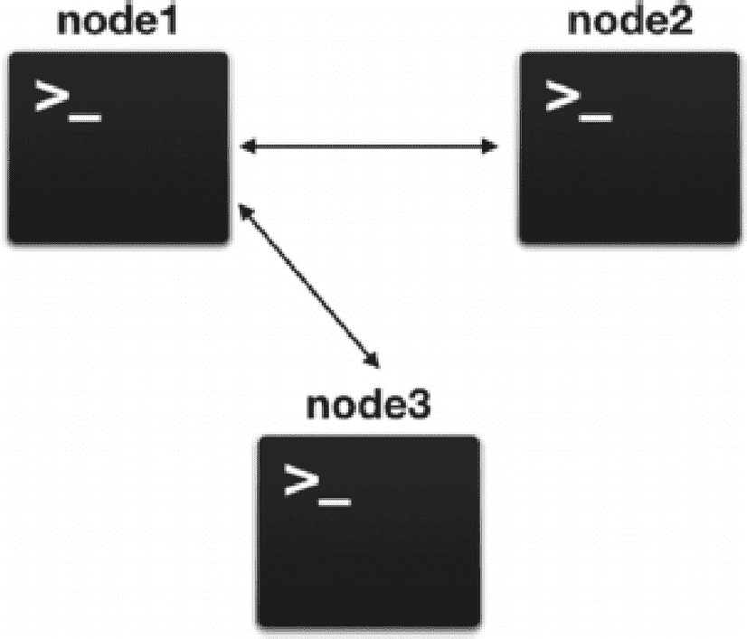
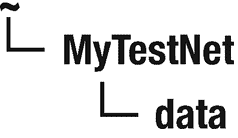
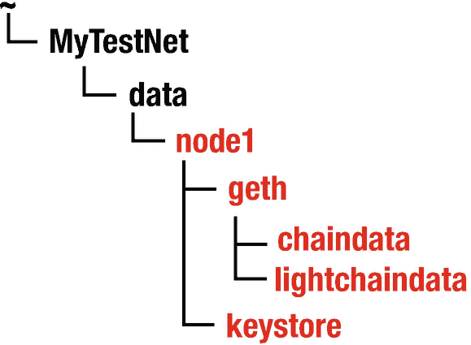
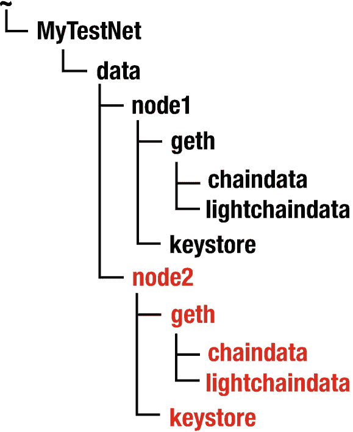
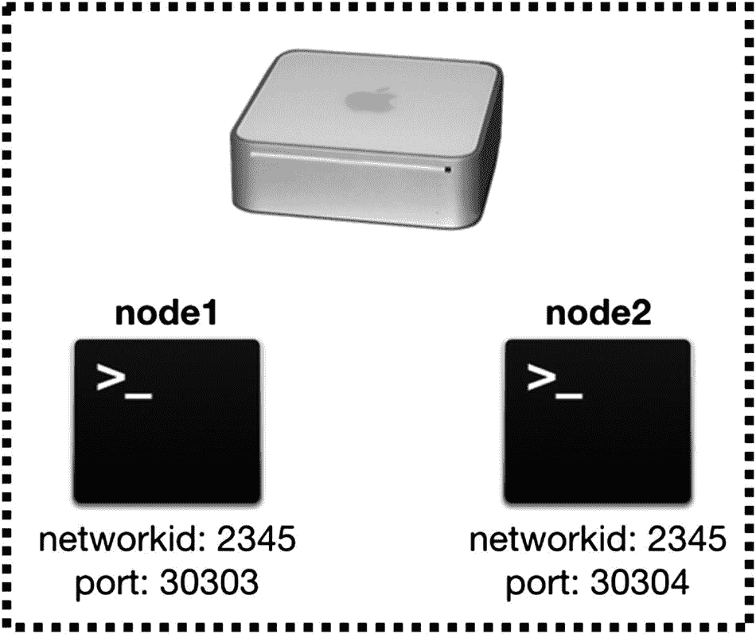
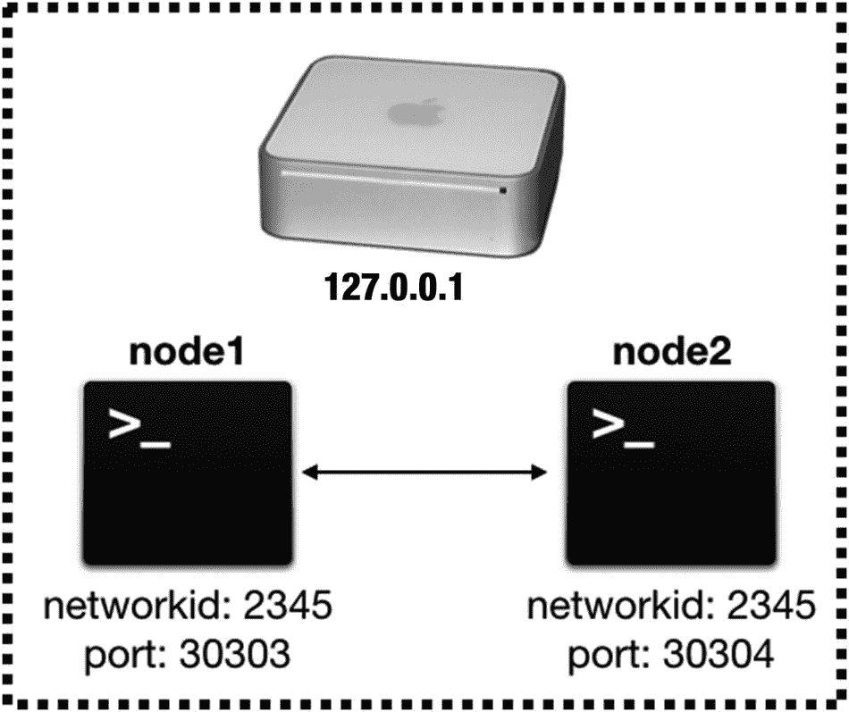
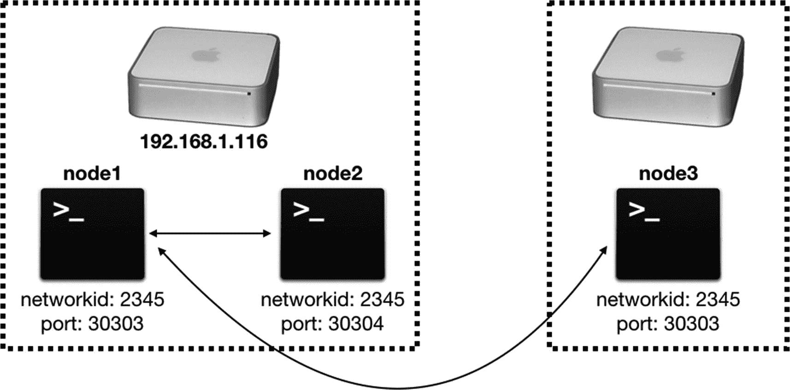
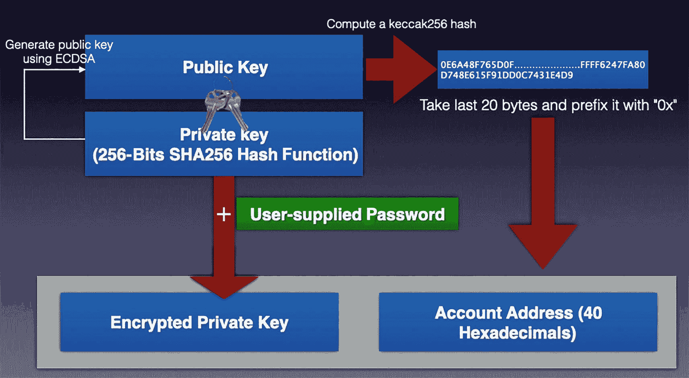

# 下载并安装以太坊客户端 Geth

要连接到以太坊区块链，你需要一个以太坊客户端，它是一个作为以太坊节点在区块链上运行的应用程序。借助以太坊客户端，你可以执行以下任务：

- 挖取以太币
- 将以太币从一个账户转移到另一个账户
- 查看区块信息
- 创建并部署智能合约
- 使用并与智能合约交互

主要有两个以太坊客户端可供你与以太坊区块链交互：

- **Geth**：使用 Go 编程语言实现的官方以太坊客户端
- **Parity**：使用 Rust 编程语言编写的以太坊客户端

注意：上述客户端均为 CLI（命令行界面）客户端。

在本章中，你将使用 Geth 客户端。Geth 适用于三个主要平台：

- Linux
- macOS
- Windows

此外，如果你希望了解 Geth 的实现方式，可以在 `https://github.com/ethereum/go-ethereum` 下载其源代码。在接下来的小节中，我将向你展示如何为这三个主要平台下载并安装 Geth。

### 为 macOS 安装 Geth

有两种方法可以在 macOS 上安装 Geth。第一种是通过命令行，这需要使用 **Brew**。

提示：Homebrew（通常称为 Brew）是一个免费的开源软件包管理系统，可简化 Apple 的 macOS 操作系统和 Linux 上的软件安装。

如果你没有安装 Brew，需要先进行安装。为此，在终端中键入以下命令来安装 Brew：

```
$ /usr/bin/ruby -e "$(curl -fsSL https://raw.githubusercontent.com/Homebrew/install/master/install)"
```

然后键入以下命令来更新和升级 Brew：

```
$ brew update
$ brew upgrade
```

要在终端中安装 Geth，请在终端中键入以下命令：

```
$ brew tap ethereum/Ethereum
$ brew install ethereum
```

提示：要升级 Geth 到最新版本，请使用命令 `brew upgrade Ethereum`。要查看当前计算机上安装的 Geth 版本，请使用命令 `geth help`。

如果你不想通过终端安装 Geth，第二种安装方法是访问 `https://geth.ethereum.org/downloads/` 并下载适用于 macOS 的 Geth。下载完成后，解压缩文件并将 `Geth` 文件移动到你的主目录中。

### 为 Windows 安装 Geth

对于 Windows 用户，最简单的安装方法是访问 `https://geth.ethereum.org/downloads/`，然后点击适用于 Windows 版本的 Geth 按钮。下载完成后，双击 `.exe` 文件以在你的 Windows 机器上安装 Geth。

提示：对于 Windows 用户，如果在运行本书中的任何命令时遇到问题，应使用 PowerShell 而不是命令提示符。

### 为 Linux 安装 Geth

对于 Linux 用户，你可以从 `https://geth.ethereum.org/downloads/` 下载适用于 Linux 的 Geth 版本，解压缩文件并将 `geth` 文件移动到你的主目录中来进行安装。

或者，你也可以通过终端安装 Geth。在终端中，键入以下命令：

```
$ sudo apt-get install software-properties-common
$ sudo add-apt-repository -y ppa:ethereum/ethereum
$ sudo apt-get update
$ sudo apt-get install ethereum
```

至此，Geth 已安装完成。

## 创建私有以太坊测试网络

在上一节中，你了解了如何下载和安装 Geth 客户端。Geth 的一个有用功能是，你可以使用它在本地环境中创建自己的私有测试网络，而无需连接到真实的区块链。这使得开发工作变得更加容易，并允许你在无需支付真实以太币的情况下探索以太坊区块链。因此，在本节中，你将了解如何创建自己的私有以太坊测试网络，以及如何连接到对等节点并执行诸如在账户之间发送以太币之类的交易。

在这个示例中，你将在单台计算机上创建一个包含两个节点（**node1** 和 **node2**）的私有测试网络，并在另一台计算机上创建第三个节点 **node3**（参见图 4-1）。



一个包含三个标记为节点 1 到节点 3 的方块的示意图，带有大于号和下划线符号。节点 1 连接到节点 2 和节点 3。

图 4-1：你的私有以太坊测试网络

这三个节点将构成你自己的测试网络，你可以在其中进行挖矿、将以太币转移到另一个账户以及（在下一章中）部署智能合约等操作。

### 创世区块

在创建你自己的私有以太坊测试网络之前，你需要先创建*创世区块*。创世区块是区块链的起始点：它是第一个区块（区块 0），也是唯一一个不指向前一个区块的区块。以太坊协议确保其他节点只有在拥有相同的创世区块时才会认同你的区块链版本，因此你可以创建任意数量的私有测试网络区块链。

在本章中，请在你的计算机上创建一个名为 `MyTestNet` 的文件夹。为简单起见，请在你的主目录中创建此文件夹：

```
$ cd ~
$ mkdir MyTestNet
$ cd MyTestNet
```

提示：对于 Windows 用户，主目录通常是 `C:\users\<用户名>\`。

要创建创世区块，请创建一个名为 `genesisblock.json` 的文件，并填入以下内容：

```
{
"config": {
"chainId": 10,
"homesteadBlock": 0,
"eip155Block": 0,
"eip158Block": 0,
"eip150Block": 0,
"eip150Hash": "0x0000000000000000000000000000000000000000000000000000000000000000"
},
"alloc"      : {},
"coinbase"   : "0x0000000000000000000000000000000000000000",
"difficulty" : "0x20000",
"extraData"  : "",
"gasLimit"   : "0x2fefd8",
"nonce"      : "0x0000000000000042",
"mixhash"    : "0x0000000000000000000000000000000000000000000000000000000000000000",
"parentHash" : "0x0000000000000000000000000000000000000000000000000000000000000000",
"timestamp"  : "0x00"
}
```

提示：`difficulty` 键的值决定了新区块被挖出的速率。如果你希望降低挖矿速率，请将此值设置为更高的数字。

### 创建用于存储节点数据的文件夹

接下来，你需要创建一个目录来存储私有测试网络中所有节点的数据。为此，请在 `MyTestNet` 文件夹中创建一个名为 `data` 的目录：

```
$ cd ~/MyTestNet
$ mkdir data
```

图 4-2 展示了此时的目录结构。



一个包含 3 个步骤的示意图。波浪号指向我的测试网络，再指向数据。

图 4-2：MyTestNet 目录的内容


### 启动区块链节点

要在测试网络上创建一个节点，你需要使用之前创建的创世区块来初始化它。你可以通过以下命令完成：

```
$ geth --datadir ~/MyTestNet/data/node1 init ~/MyTestNet/genesisblock.json
```

这段代码创建了一个名为 `node1` 的节点，并将其所有数据保存在 `node1` 目录中。

你应该会看到如下响应：

```
INFO [06-21|15:41:51.899] Maximum peer count                       ETH=50 LES=0 total=50
INFO [06-21|15:41:51.899] Set global gas cap                       cap=50,000,000
INFO [06-21|15:41:51.900] Allocated cache and file handles         database=/Users/weimenglee/MyTestNet/data/node1/geth/chaindata cache=16.00MiB handles=16
INFO [06-21|15:41:52.009] Opened ancient database                  database=/Users/weimenglee/MyTestNet/data/node1/geth/chaindata/ancient readonly=false
INFO [06-21|15:41:52.010] Persisted trie from memory database      nodes=0 size=0.00B time="94.569μs" gcnodes=0 gcsize=0.00B gctime=0s livenodes=1 livesize=0.00B
INFO [06-21|15:41:52.010] Successfully wrote genesis state         database=chaindata hash=5e1fc7..d790e0
INFO [06-21|15:41:52.010] Allocated cache and file handles         database=/Users/weimenglee/MyTestNet/data/node1/geth/lightchaindata cache=16.00MiB handles=16
INFO [06-21|15:41:52.121] Opened ancient database                  database=/Users/weimenglee/MyTestNet/data/node1/geth/lightchaindata/ancient readonly=false
INFO [06-21|15:41:52.121] Persisted trie from memory database      nodes=0 size=0.00B time="1.66μs"   gcnodes=0 gcsize=0.00B gctime=0s livenodes=1 livesize=0.00B
INFO [06-21|15:41:52.122] Successfully wrote genesis state         database=lightchaindata hash=5e1fc7..d790e0
```

图 4-3 展示了运行此命令后 `node1` 的内容。



一个包含 3 个步骤的图示。波浪号符号指向 `~`/MyTestNet，其后依次是 `data`、`node1`、`geth`、`chaindata`、`lightchaindata` 和 `keystore`。

图 4-3：`node1` 目录的内容

`geth` 目录包含两个用于存储区块链的文件夹：`chaindata` 和 `lightchaindata`，而 `keystore` 目录则包含账户信息（稍后将详细介绍）。

让我们再创建另一个名为 `node2` 的节点：

```
$ geth --datadir ~/MyTestNet/data/node2 init ~/MyTestNet/genesisblock.json
```

图 4-4 展示了 `MyTestNet` 目录的当前状态。



一个包含 3 个步骤的图示。波浪号符号指向 `~`/MyTestNet，其后依次是 `data`、`node1` 和 `node2`、`geth`、`chaindata`、`lightchaindata` 和 `keystore`。

图 4-4：`node2` 目录现在已添加到 `data` 目录中

### 启动节点

现在节点已初始化，让我们启动它们。我们先启动 `node1`：

```
$ geth --datadir ~/MyTestNet/data/node1 console 2>console1.log
```

一旦 `node1` 启动，你将看到 Geth JavaScript 控制台：

```
Welcome to the Geth JavaScript console!
instance: Geth/v1.10.26-stable/darwin-arm64/go1.19.3
at block: 0 (Thu Jan 01 1970 07:30:00 GMT+0730 (+0730))
datadir: /Users/weimenglee/MyTestNet/data/node1
modules: admin:1.0 debug:1.0 engine:1.0 eth:1.0 ethash:1.0 miner:1.0 net:1.0 personal:1.0 rpc:1.0 txpool:1.0 web3:1.0
To exit, press ctrl-d or type exit
>
```

提示

Geth JavaScript 控制台提供了一个交互式控制台，让你可以使用 JavaScript 语言与以太坊区块链进行交互。

`console 2` 选项基本上是将输出重定向到一个文件（在此示例中名为 `console1.log`）。如果没有此重定向，Geth 会持续生成大量输出，Geth JavaScript 控制台将无法使用。

#### 创建账户

现在 `node1` 已经启动，你可以使用 `personal.newAccount()` 函数在节点中创建一个新账户：

```
> personal.newAccount()
Passphrase: 
Repeat passphrase: 
"0x6e05a61f9414d2ecbe79ae9c70fd4a7f234be7cb"
```

提示

`web3` 对象（来自 web3.js 库）允许你以编程方式与以太坊区块链交互。它还暴露了 `eth` 对象，而 `eth` 对象本身也暴露了 `personal` 对象。因此，`personal.newAccount()` 函数的完整名称实际上是 `web3.eth.personal.newAccount()`。`personal` 对象允许你与以太坊节点的账户进行交互。

系统会要求你为新账户输入密码。完成后，将显示该账户的公开地址。

要显示节点中的账户列表，请使用 `eth.accounts` 属性：

```
> eth.accounts
["0x6e05a61f9414d2ecbe79ae9c70fd4a7f234be7cb"]
```

账户列表将以数组形式显示。在此示例中，只有一个账户。

账户创建后，账户详情将存储在一个文件中（文件名以 `UTC` 开头），位于 `~/MyTestNet/data/node1/keystore` 目录中。我将在本章后面部分详细介绍这一点。

#### 检查账户余额

要检查账户余额，请使用 `eth.getBalance()` 函数：

```
> eth.getBalance(eth.accounts[0])
0

```

提示

如前所述，`eth` 对象源自 `web3` 对象，因此上述函数等同于 `web3.eth.getBalance(web3.eth.accounts[0])`。

显然，此时你没有任何以太币，所以你会看到 0。但是请注意，余额显示的单位是 *Wei*，1 Ether 等于 1000000000000000000 Wei（1 后面跟 18 个零）。你可能更希望看到以 *Ether* 为单位的显示。为了方便起见，你可以使用 `web3.fromWei()` 函数，如下命令所示，将余额从 Wei 转换为 Ether：

```
> web3.fromWei(eth.getBalance(eth.accounts[0]), "ether")
0

```

表 4-1 显示了以太坊中的不同单位。

表 4-1：以太坊中的单位

| 单位 | Wei 值 | Wei |
| --- | --- | --- |
| Wei | 1 Wei | 1 |
| Kwei (babbage) | 10³ Wei | 1,000 |
| Mwei (lovelace) | 10⁶ Wei | 1,000,000 |
| Gwei (shannon) | 10⁹ Wei | 1,000,000,000 |
| Microether (szabo) | 10¹² Wei | 1,000,000,000,000 |
| Milliether (finney) | 10¹⁵ Wei | 1,000,000,000,000,000 |
| Ether | 10¹⁸ Wei | 1,000,000,000,000,000,000 |

#### 停止节点

要停止节点，只需使用 exit 命令：

```
> exit
```

现在，让我们先停止 `node1`。


### 启动另一个节点

现在你已经启动并停止了`node1`，我们来启动`node2`。在一个新的终端窗口中，输入以下命令：

```
$ geth --datadir ~/MyTestNet/data/node2 --port 30304 --nodiscover --networkid 2345 --authrpc.port 8547 console 2>console2.log
```

在这个命令中，你指定了`--port`选项并将端口设置为`30304`。这是因为`Geth`默认使用端口`30303`，如果你在同一台计算机上运行多个节点，每个节点必须使用唯一的端口号。通过将其设置为`30304`，可以避免与使用默认端口的其他节点发生冲突。`--nodiscover`选项意味着节点不会自动发现彼此，它们需要手动添加。`--networkid`选项指定了网络 ID，以便其他节点能够连接到具有相同网络 ID 的网络。同时请注意`--authrpc.port`选项。对于每个节点，必须将其设置为一个不同于默认端口`8551`的唯一编号。

一旦`node2`启动，使用以下命令重启`node1`：

```
$ geth --datadir ~/MyTestNet/data/node1 --networkid 2345 console 2>console1.log
```

请注意，`node1`启动时使用了值为`2345`的`--networkid`选项。这是必需的，以便稍后它可以作为对等节点添加到`node2`中。图 4-5 显示了此时两个节点的状态。



### 获取节点信息

现在两个节点都已启动并运行，我们来获取每个节点的一些详细信息。在`node1`中输入以下命令：

```
> admin.nodeInfo
{
enode: "enode://970900b3e4c76e9ce2d0a9d592f2f85d89fdd341cf513a352822d49f62240a33c9f61423a2793e186b4abb54f6640c07cb90e366df49223888c8de56ec6938f7@116.87.74.126:30303",
enr: "enr:-KO4QG1bMANDGX-m3Ncxs7exhot0WiFMImfymqs27saQ3hZsF7MVWByWplenrpwYQmL7ix-xOla0eJ5OE1n1sGy78t-GAYGFN_fag2V0aMfGhHEB0w2AgmlkgnY0gmlwhHRXSn6Jc2VjcDI1NmsxoQOXCQCz5MdunOLQqdWS8vhdif3TQc9ROjUoItSfYiQKM4RzbmFwwIN0Y3CCdl-DdWRwgnZf",
id: "d5b2504c731b3899c7f92941c0d703477b84c79fd9c0b68d9ebad4e145799079",
ip: "116.87.74.126",
listenAddr: "[::]:30303",
name: "Geth/v1.10.19-stable/darwin-amd64/go1.18.3",
ports: {
discovery: 30303,
listener: 30303
},
protocols: {
eth: {
config: {
chainId: 10,
eip150Block: 0,
eip150Hash: "0x0000000000000000000000000000000000000000000000000000000000000000",
eip155Block: 0,
eip158Block: 0,
homesteadBlock: 0
},
difficulty: 131072,
genesis: "0x5e1fc79cb4ffa4739177b5408045cd5d51c6cf766133f23f7cd72ee1f8d790e0",
head: "0x5e1fc79cb4ffa4739177b5408045cd5d51c6cf766133f23f7cd72ee1f8d790e0",
network: 2345
},
snap: {}
}
}
```

**提示**
`admin`对象派生自`web3`对象。因此，`admin.addPeer()`的全名是`web3.admin.addPeer()`。`admin`对象允许你与底层区块链进行交互。

你会看到一大堆信息。特别要注意`enode`键（已加粗强调）。在`enode`值的末尾，请注意端口号`30303`（节点 1 使用的端口）。

**提示**
`enode`以 URI 的形式描述了以太坊网络中的一个节点。

### 配对节点

复制`node1`中`enode`键的值，然后在`node2`中输入以下命令：

```
> admin.addPeer("enode://970900b3e4c76e9ce2d0a9d592f2f85d89fdd341cf513a352822d49f62240a33c9f61423a2793e186b4abb54f6640c07cb90e366df49223888c8de56ec6938f7@127.0.0.1:30303")
```

**注意**
在此示例中，`127.0.0.1`指的是我电脑的 IP 地址。在与其他位于同一台计算机/网络上的节点进行配对时，务必用您自己电脑的 IP 地址替换此 IP 地址。如果不这样做，两个节点将无法正确配对。

在此命令中，加粗部分是`node1`的`enode`键的值。`admin.addPeer()`函数使用对等节点的`enode`值将其添加到当前节点。

要验证对等节点是否添加成功，请使用`admin.peers`属性：

```
> admin.peers
[{
caps: ["eth/66", "eth/67", "snap/1"],
enode: "enode://970900b3e4c76e9ce2d0a9d592f2f85d89fdd341cf513a352822d49f62240a33c9f61423a2793e186b4abb54f6640c07cb90e366df49223888c8de56ec6938f7@127.0.0.1:30303",
id: "d5b2504c731b3899c7f92941c0d703477b84c79fd9c0b68d9ebad4e145799079",
name: "Geth/v1.10.19-stable/darwin-amd64/go1.18.3",
network: {
inbound: false,
localAddress: "127.0.0.1:58369",
remoteAddress: "127.0.0.1:30303",
static: true,
trusted: false
},
protocols: {
eth: {
difficulty: 131072,
head: "0x5e1fc79cb4ffa4739177b5408045cd5d51c6cf766133f23f7cd72ee1f8d790e0",
version: 67
},
snap: {
version: 1
}
}
}]
```

如果对等节点添加成功，您应该会看到上述输出。从输出中，您可以看到`node1`的 IP 地址是`127.0.0.1`，这是我电脑的本地 IP 地址。图 4-6 显示了私有测试网络的当前状态。



**提示**
`admin.peers`属性如果当前没有对等节点连接到该节点，则返回`[]`。

到目前为止，您一直在同一台计算机内配对节点。如何从另一台计算机配对节点？

**说明**
我将把创建第三个节点留作读者的练习。

假设您有另一个名为`node3`的节点在另一台计算机上运行。在该节点的 Geth JavaScript 控制台上，您可以使用以下命令将`node1`添加为对等节点：

```
>admin.addPeer("enode://970900b3e4c76e9ce2d0a9d592f2f85d89fdd341cf513a352822d49f62240a33c9f61423a2793e186b4abb54f6640c07cb90e366df49223888c8de56ec6938f7@192.168.1.116:30303")
```

您只需将节点的 IP 地址和端口号替换为您要添加的节点的 IP 地址和端口号。在此示例中，`node1`运行在端口`30303`上，其 IP 地址为`192.168.1.116`。图 4-7 总结了此时节点的状态。




## 执行挖矿

所有节点连接后，就可以开始执行一些挖矿操作了！在此之前，先验证当前区块链的区块编号。在任意节点中，都可以使用`eth.blockNumber`属性来显示区块链中的最新区块编号：

```
> eth.blockNumber
```

如预期一样，应该看到`0`。这是因为此时区块链只有一个区块：创世区块。要在`node1`上开始挖矿，使用`miner.start()`函数：

```
> miner.start(1)
null
```

传递给`start()`函数的数字是希望用于挖矿操作的线程数。不要因为返回`null`而感到惊慌。`null`仅表示该函数没有返回任何内容；并不表示挖矿操作失败。

注意

`miner`对象派生自`web3`对象。

`node1`现在将开始挖矿操作。在某些计算机上，挖出第一个区块需要几分钟时间，而在一些较慢的机器上，则需要更长时间。所以请耐心等待。

可以通过检查`eth.blockNumber`属性的结果来验证是否已挖出区块。如果区块编号大于`0`，说明已经挖到了第一个区块！恭喜！

由于`node2`已连接到`node1`，因此也可以在`node2`中验证区块编号。应该看到相同的区块编号。

注意

如果`node2`与`node1`看到的区块编号不一致，意味着两个节点没有正确配对。

如果需要停止挖矿，可以使用`miner.stop()`函数。目前，请保持挖矿运行。

提示

这是检查账户余额的好时机。如果成功挖到一个区块，账户中现在应该有一些以太币了。

## 检查区块

可以使用`eth.getBlock()`函数（例如`eth.getBlock(22)`）来检查区块的内容：

```
{
difficulty: 132352,
extraData: "0xd983010a13846765746888676f312e31382e338664617277696e",
gasLimit: 3209750,
gasUsed: 0,
hash: "0xa7a89c8552d7ab22064468fd8ded5ba4759734d9f877a45351e1b00048564e4c",
logsBloom: "0x00000000000000000000000000000000000000000000000000000000000000000000000000000000000000000000000000000000000000000000000000000000000000000000000000000000000000000000000000000000000000000000000000000000000000000000000000000000000000000000000000000000000000000000000000000000000000000000000000000000000000000000000000000000000000000000000000000000000000000000000000000000000000000000000000000000000000000000000000000000000000000000000000000000000000000000000000000000000000000000000000000000000000000000000000000000",
miner: "0x6e05a61f9414d2ecbe79ae9c70fd4a7f234be7cb",
mixHash: "0x938bb57f4f1c68a1760c689028ef02d0ee464ea45ddd7be777205a90a91a9bd9",
nonce: "0x43b3f9c38f75c685",
number: 22,
parentHash: "0xa31e844e09b21b9e2e00c9337b0c127d64b848c71fac5165cfd9b73030bf460c",
receiptsRoot: "0x56e81f171bcc55a6ff8345e692c0f86e5b48e01b996cadc001622fb5e363b421",
sha3Uncles: "0x1dcc4de8dec75d7aab85b567b6ccd41ad312451b948a7413f0a142fd40d49347",
size: 537,
stateRoot: "0xa911ecd43f895f2e01538910d71734cdc149b1b9e0f88815c88438bb138e81cc",
timestamp: 1655798565,
totalDifficulty: 3028096,
transactions: [],
transactionsRoot: "0x56e81f171bcc55a6ff8345e692c0f86e5b48e01b996cadc001622fb5e363b421",
uncles: []
}
```

`eth.getBlock()`函数接受一个表示要检查的区块编号的数字。一个特别值得注意的点：`miner`键表示成功挖出该区块的账户。

## 在两个节点上挖矿

到目前为止，只有`node1`在进行挖矿并享受所有乐趣（并获得所有奖励）。为什么不也让`node2`进行挖矿呢？如果现在尝试在`node2`上挖矿，将看到以下错误：

```
> miner.start(1)
Error: etherbase missing: etherbase must be explicitly specified
at web3.js:6365:9(45)
at send (web3.js:5099:62(34))
at :1:12(4)
```

为什么？为了执行挖矿，节点中至少需要有一个账户来存放挖矿奖励。要解决这个问题，使用`personal.newAccount()`函数创建一个新账户。一旦账户创建成功，就可以再次使用`miner.start()`函数。

现在有两个矿工同时挖矿并竞争奖励。要了解最新区块的矿工是谁，可以使用`eth.getBlock()`函数并检查其`miner`属性，如下所示：`eth.getBlock(eth.blockNumber).miner`。结果是成功挖出最新区块的账户地址。

## 在节点之间转账以太币

在`node1`中，使用`personal.newAccount()`函数再创建一个账户。现在应该有两个账户：

```
> eth.accounts
["0x6e05a61f9414d2ecbe79ae9c70fd4a7f234be7cb", "0xbb6f2406a8a49746f25e5b2230af7ee9d3196e9c"]
```

验证每个账户中有多少余额：

```
> eth.getBalance(eth.accounts[0])
3.376328125e+22
> eth.getBalance(eth.accounts[1])
```

要将一些以太币从一个账户转移到另一个账户，可以使用`eth.sendTransaction()`函数。但在使用它转账之前，需要先使用`personal.unlockAccount()`函数解锁源账户：

```
> personal.unlockAccount(eth.accounts[0])
Unlock account 0x530e822163471b0e65725cbd85dc141ff6b24d59
Passphrase: 
true
```

账户解锁后，现在可以转账了：

```
> eth.sendTransaction({from: eth.accounts[0], to: eth.accounts[1], value: web3.toWei(5,"ether")})
"0xbac74dffae71c5532d83ed8ae37ff97d68dd2ab8b7f62fa2b1032f88df8d543c"
```

提示

如果想要将以太币转账到另一台计算机上的另一个节点，只需指定要发送到的账户地址，并用一对双引号括起来，如下所示：

```
eth.sendTransaction({from: eth.accounts[0], to: "0x9ba6f3c9cce2b172d0a85a50101ae05f3b4c8731", value: web3.toWei(5,"ether")})
```

在这个例子中，从第一个账户向同一节点内的第二个账户转账五个以太币。函数的输出是交易 ID。如果现在检查两个账户的余额，发现它们仍然相同，则可能是以下原因之一：

*   当前没有在挖矿。记住，挖矿确认交易，以便交易可以记录在区块链上。要解决这个问题，请在节点上启动挖矿。
*   如果当前正在挖矿，很可能交易尚未被确认。稍等片刻，然后再次检查余额。

一段时间后，应该在第二个账户中看到五个以太币：

```
> eth.getBalance(eth.accounts[1])
```

提示

如果检查第一个账户的余额，可能会发现其扣除额少于五个以太币。这是因为尽管扣除了五个以太币，它也在通过挖矿赚取奖励。因此，验证第二个账户的余额更容易。


## 管理账户

在本章前面的部分，你已经学习了如何在节点中创建账户。我还提到过，账户详情存储在一个文件名以“UTC”开头的文件中，并保存在`~/MyTestNet/data/node1/keystore`目录下。让我们来剖析一下这个 UTC 文件的内容：

```
{
"address": "6e05a61f9414d2ecbe79ae9c70fd4a7f234be7cb",
"crypto": {
"cipher": "aes-128-ctr",
"ciphertext": "1f35569e89100cd6d03c7de8780a913f54129cdbce0290a3b39a798391bd2674",
"cipherparams": {
"iv": "0ffbe973059db7a0226cd6fced92e50d"
},
"kdf": "scrypt",
"kdfparams": {
"dklen": 32,
"n": 262144,
"p": 1,
"r": 8,
"salt": "d2c73712f61b236beb22c783502a50166049a46b0aa29503a90d2f8a4227741c"
},
"mac": "432ab5429c423c3c9e545397f53c64ddc6a900a6ab7dc255a58cf5da9f629242"
},
"id": "b9e36890-b2ff-4fdd-af90-f157f352e6bc",
"version": 3
}
```

这显示了`node1`中第一个账户的内容，其文件名为`UTC--2022-06-21T07-44-59.385557000Z--6e05a61f9414d2ecbe79ae9c70fd4a7f234be7cb`。

它包含以下内容：

*   你的加密私钥（使用你提供的密码进行加密）
*   公钥不存储在 JSON 文件中，因为它可以从私钥派生而来。私钥对应的公钥是通过 ECDSA（椭圆曲线数字签名算法）从私钥派生出来的。
*   从派生的公钥计算出一个`keccak256`哈希值。
*   从`keccak256`哈希值中取最后 20 个字节（即 40 位十六进制数），在其前面加上`"0x"`，这就是你的以太坊账户地址。

图 4-8 概括了你的账户地址是如何派生的。



一个流程图展示了公钥和私钥、取最后 20 个字节并加上`0x`前缀、账户地址以及一个使用用户提供的密码加密的私钥。

**图 4-8** 理解账户信息是如何派生的

**提示** 好奇你的私钥是什么？将 JSON 文件导入 MetaMask，你的账户就会被导入到 MetaMask 中。然后你就可以在 MetaMask 中导出这个已导入账户的私钥了。

### 删除账户

一旦你使用了`personal.newAccount()`函数，账户就被创建了。并没有对应的函数用于删除账户。删除账户最简单的方法是转到`~/MyTestNet/data/node1/keystore`目录，并删除与你想要删除的账户对应的 UTC 文件。

### 设置 Coinbase

`eth.coinbase`属性返回节点内所有挖矿奖励发放到的那个账户。在`node1`中，你的 coinbase 就是你的第一个账户：

```
> eth.coinbase
"0x6e05a61f9414d2ecbe79ae9c70fd4a7f234be7cb"
```

要更改 coinbase，你可以使用`miner.setEtherbase()`函数。现在让我们试一下。

首先，打印出你在`node1`中拥有的账户：

```
> eth.accounts
["0x6e05a61f9414d2ecbe79ae9c70fd4a7f234be7cb", "0xbb6f2406a8a49746f25e5b2230af7ee9d3196e9c"]
```

让我们将 coinbase 更改为第二个账户：

```
> miner.setEtherbase(eth.accounts[1])
true
```

完成此操作后，你可以验证 coinbase 是否确实已更改为第二个账户：

```
> eth.coinbase
"0xbb6f2406a8a49746f25e5b2230af7ee9d3196e9c"
```

## 总结

在本章中，你学习了如何使用 Geth 创建自己的私有以太坊测试网络。你学习了如何在节点中创建账户、连接到其他节点、在节点之间转移以太币等。部署自己的测试网络比使用以太坊的某个测试网络效率要高得多。更重要的是，它让你能够进行实验，并对以太坊有更深入的理解。

