# 5. 使用 MetaMask 加密货币钱包

在上一章中，你学习了如何使用 `Geth` 创建自己的私有以太坊测试网络，以便你可以尝试各种以太坊交易，例如向不同账户转账以及执行挖矿。你还学习了如何创建账户，以便持有自己的以太币。在本章中，你将学习如何使用一个名为 `MetaMask` 的 Chrome 扩展程序。`MetaMask` Chrome 扩展程序是一个以太坊加密货币钱包，它允许你持有你的以太坊账户；并且在接下来的几章中，它是帮助你开发和测试智能合约的重要工具。

## 什么是 MetaMask？

`MetaMask` 是一个非常有用的工具，在你进军区块链世界的过程中扮演着关键角色。与其试图用一段话来定义 `MetaMask` 究竟是什么，不如让我们在后续内容中讨论 `MetaMask` 所扮演的角色。

首先，`MetaMask` 是一个以太坊加密货币钱包。它允许你执行以下操作：

*   创建用于各种以太坊网络的账户
*   维护你账户的私钥，以便你可以导出私钥或导入新账户
*   在各种以太坊网络之间切换，以便你的账户能为每个网络显示正确的余额
*   在账户之间执行交易
*   从一个账户向另一个账户转移以太币
*   在你的 `MetaMask` 账户中持有代币
*   在区块链浏览器 Etherscan 上查看详细的交易信息
*   在去中心化交易所（DEX）上进行以太币和代币之间的兑换

**注意** 除了是以太坊钱包之外，`MetaMask` 还允许你通过注入一个由以太坊核心团队开发的名为 `web3.js` 的 JavaScript 库来与以太坊区块链进行交互。我将在下一章讨论智能合约时对此进行更详细的说明。

### MetaMask 的工作机制

在幕后，`MetaMask` 连接到一个名为 INFURA (`https://infura.io/`) 的服务器。INFURA 维护着连接到各自以太坊网络的以太坊节点。INFURA 并没有持有你的私钥（将私钥存放在由第三方持有的云端总是一种安全风险），而是允许 `MetaMask` 将你账户的私钥保存在你的本地计算机上，并且仅将交易中继到网络。图 5-1 展示了 `MetaMask`、INFURA 和以太坊网络之间的关系。

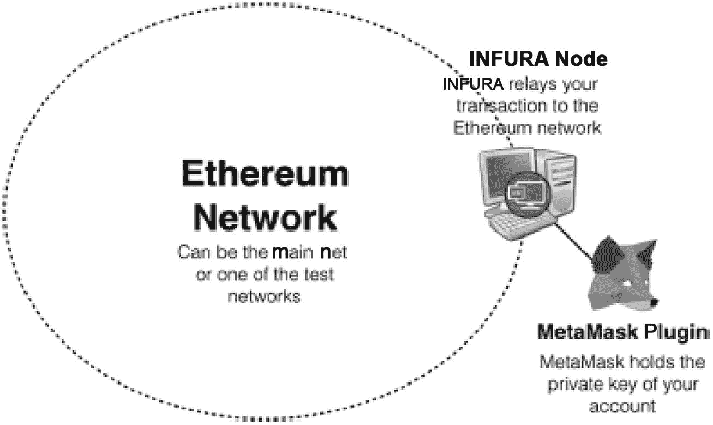

一个以太坊网络的圆形示意图，其轨道上有一个 Infura 节点。它有一个 `MetaMask` 插件，该插件持有账户的私钥。

**图 5-1** `MetaMask` 的后台工作原理

当 `MetaMask` 连接到其中一个以太坊网络时，它会通过其 RPC URL 连接到相应的 INFURA 节点之一：

*   **主以太坊网络：** `https://mainnet.infura.io/v3/`
*   **Goerli 测试网络：** `https://goerli.infura.io/v3/`
*   **Sepolia 测试网络：** `https://sepolia.infura.io/v3/`

**警告** 在合并（以太坊从 PoW 切换到 PoS）之前，大多数开发者都使用 Ropsten 测试网络。然而，Ropsten 测试网络在合并后已被弃用。你应该改用 Goerli 测试网络。

### 安装 MetaMask

安装 `MetaMask` 最简单的方法是使用 Chrome 浏览器，并将其作为 Chrome 扩展程序进行安装。要安装 `MetaMask` 扩展程序：

> **注意**：您可以在 Chrome、Mozilla Firefox、Brave 和 Microsoft Edge 浏览器上使用 `MetaMask` 扩展程序。

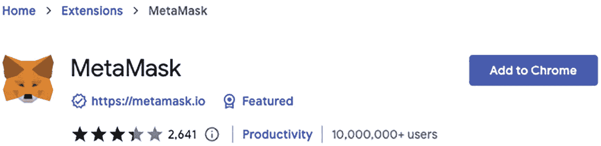
*截图展示了主页标签下的 `MetaMask` 扩展程序图标。右侧有一个"添加至 Chrome"按钮。*

**图 5-2** — 在 Chrome 网上应用店中搜索 MetaMask

*   启动 Chrome 浏览器，并导航至 Chrome 网上应用店： `https://chrome.google.com/webstore/category/extensions`。
*   搜索 `MetaMask`。
*   您应该在搜索结果中看到 `MetaMask` 扩展程序。点击 **添加至 Chrome**（参见图 5-2）。

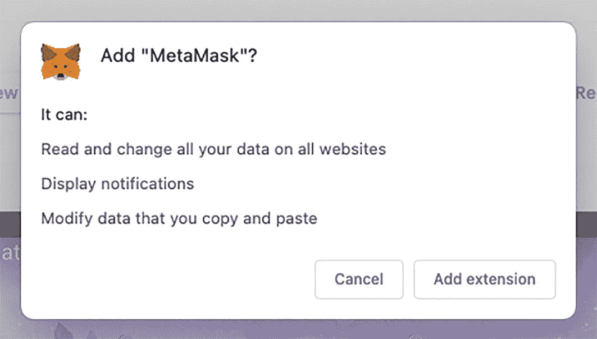
*截图展示了 `MetaMask` 扩展程序的图标，并询问是否添加 `MetaMask`。底部有"取消"和"添加扩展程序"按钮。*

**图 5-3** — 向 Chrome 浏览器添加 MetaMask 扩展程序

*   系统将提示您将 `MetaMask` 添加到 Chrome。点击 **添加扩展程序**（参见图 5-3）。

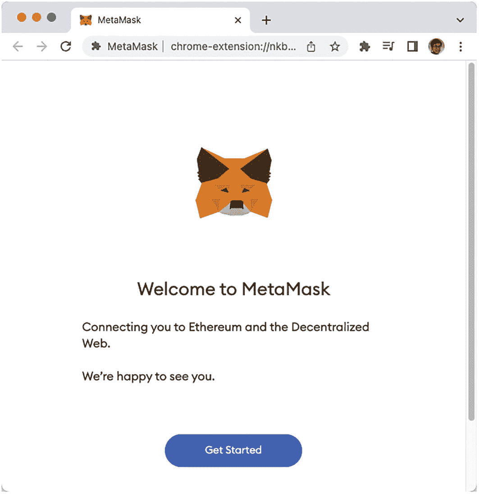
*`MetaMask` 欢迎页面的截图。页面显示了一个狐狸剪影图和一个"开始使用"按钮。*

**图 5-4** — MetaMask 扩展程序已添加到 Chrome 浏览器

*   将 `MetaMask` 添加到 Chrome 后，您将看到如图 5-4 所示的屏幕。点击 **开始使用**。

### 设置账户

如果您是首次使用 `MetaMask`，请点击 **创建钱包**（参见图 5-5）。

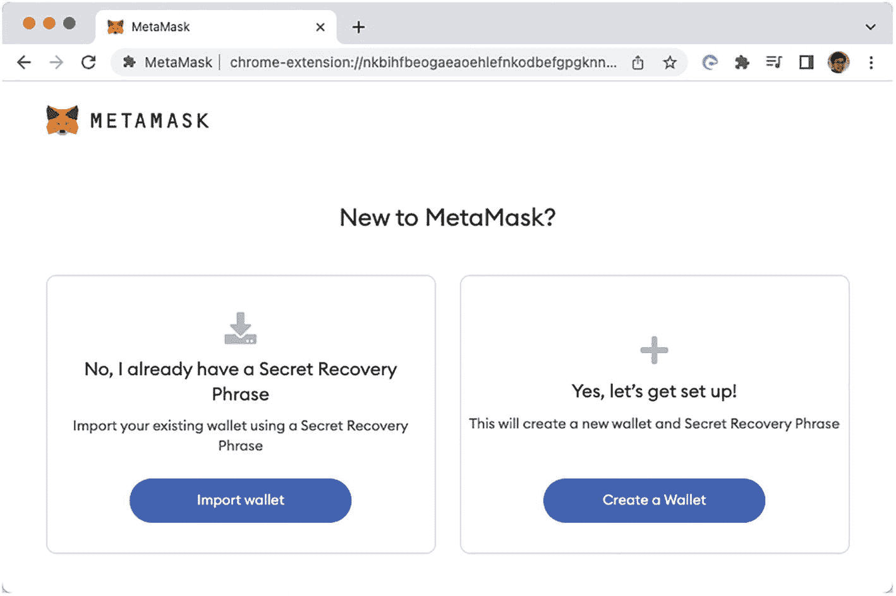
*`MetaMask` 欢迎页面的截图。页面显示了一条消息"新用户？MetaMask"，以及两个选项：导入钱包和创建钱包。*

**图 5-5** — 创建一个新钱包

请阅读条款和条件，如果同意，请点击 **我同意**。接着，创建一个密码以确保您的账户安全。完成此步骤后，点击 **创建**（参见图 5-6）。

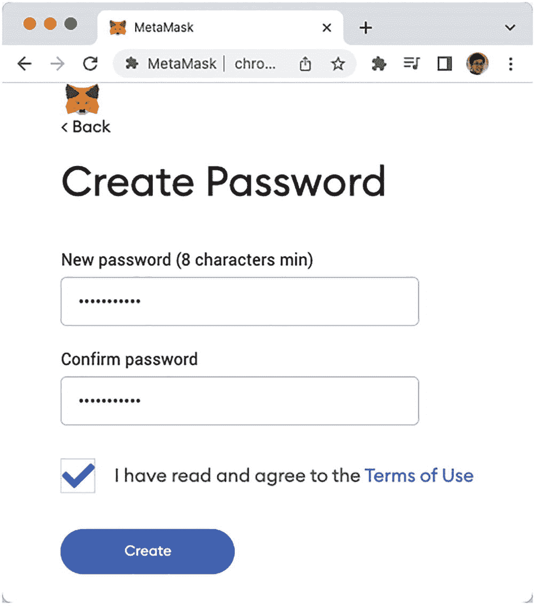
*`MetaMask` 创建密码页面的截图。页面有两个输入框，用于创建和确认密码，以及条款和"创建"按钮。*

**图 5-6** — 输入密码以保护您的钱包

您可以观看一段简短视频，了解如果您忘记密码，如何恢复您的账户。完成后，点击 **下一步**。

系统将向您展示您的秘密恢复短语。秘密恢复短语是一组单词，允许您恢复和还原您的所有账户。这组单词需要您妥善保管。我个人建议您将其打印出来，并锁在安全的地方。

要显示您的秘密恢复短语，请点击锁图标（参见图 5-7）。

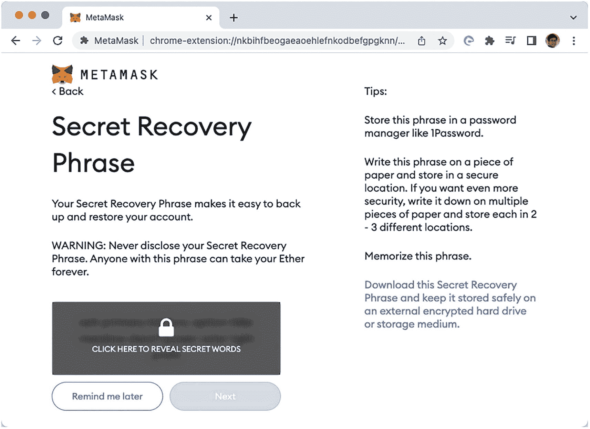
*`MetaMask` 页面的截图。页面在"秘密恢复短语"下方显示了一条消息和提示。一个带有锁的方块被模糊处理，并伴有"稍后提醒我"和"下一步"按钮。*

**图 5-7** — 显示 12 个单词的秘密短语

您可以看到您的秘密恢复短语。请确保除了您自己之外，没人知道这 12 个单词。

> **提示**：这 12 个单词的秘密短语允许您在忘记密码时恢复您的账户。这个 12 个单词的秘密短语被称为 `BIP39`（比特币改进提案）*种子短语*。`MetaMask` 使用 `BIP39` 协议来计算如何使用 12 个单词的秘密短语来获得一个*种子*。这个种子用于为每种加密货币生成一个根密钥（就以太坊而言，是 ETH）。
>
> 然后，根密钥会被哈希处理以生成一个*私钥*，该私钥用于生成一个*公钥*，公钥又用于生成账户的*公共地址*。要生成第二个账户（以及第三个账户，以此类推），第一个私钥会被用来派生一组子密钥，然后这些子密钥被用来生成它们各自的公钥，依此类推。
>
> 使用这种方法，种子通过一个确定性算法为您的钱包生成无限数量的地址。
>
> 秘密短语中使用的单词列表可以在这里找到：`https://github.com/bitcoin/bips/blob/master/bip-0039/english.txt`。它基于一个包含 2048 个单词的列表，并按特定顺序选择了其中的 12 个单词。

系统将要求您确认您的秘密恢复短语（参见图 5-8）。按单词呈现的顺序点击页面底部的单词。所选单词的顺序很重要。如果顺序不正确，请拖拽单词重新排列。

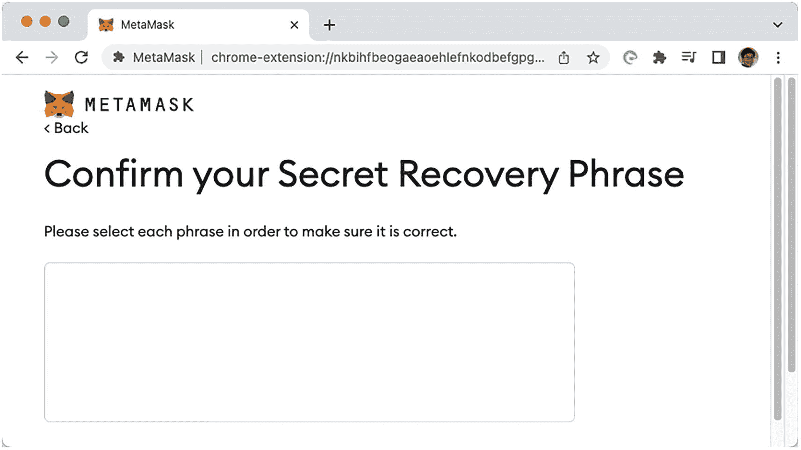
*`MetaMask` 页面的截图。页面在"确认秘密恢复短语"下方显示了一个空白框，用于选择每个短语。*

**图 5-8** — 确认秘密恢复短语

完成单词排列后，点击 **确认**。这样就完成了！您的账户现已设置完毕！

### 使用 MetaMask 扩展程序

在 Chrome 浏览器的右上角，您应该能看到扩展程序图标。点击它（参见图 5-9）。

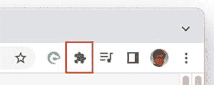
*截图展示了地址栏的一角。其中有扩展程序、控制媒体播放、显示侧面板和用户图标。"扩展程序"选项被一个深色方框轮廓高亮显示。*

**图 5-9** — 在 Chrome 浏览器中找到扩展程序图标

点击 `MetaMask` 图标旁边的图钉图标（参见图 5-10）。

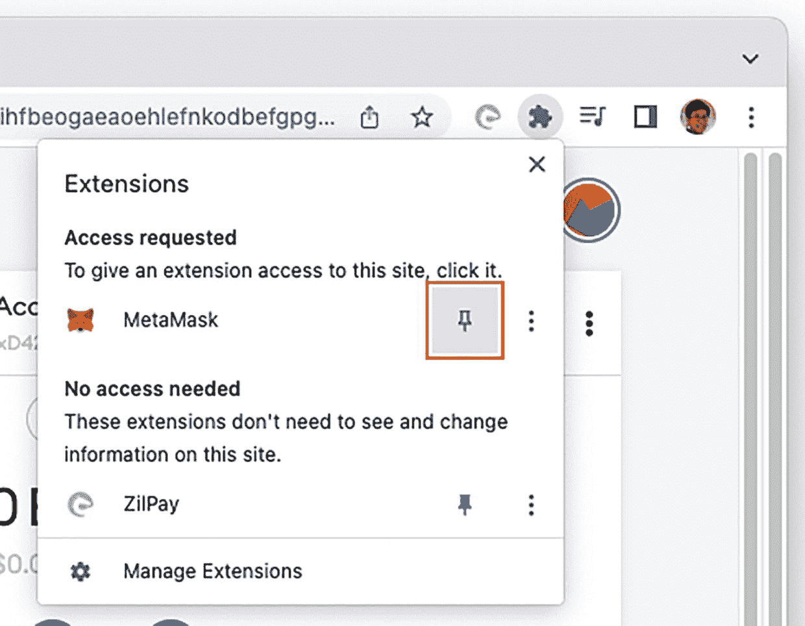
*截图展示了地址栏的一角。其中显示了扩展程序列表，`MetaMask` 扩展程序的图钉选项被一个深色方框轮廓高亮显示。*

**图 5-10** — 将 MetaMask 固定在 Chrome 浏览器中

`MetaMask` 图标（带有狐狸的图标）将被固定在浏览器上。点击它，您将看到默认的账户 1（参见图 5-11）。

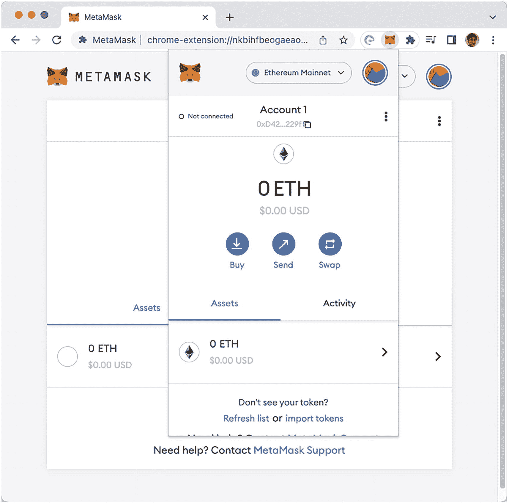
*`MetaMask` 页面覆盖在以太坊主网窗口上的截图。它显示账户 1 下的资产。*

**图 5-11** — 查看 MetaMask 钱包

### 选择以太坊网络

默认情况下，`MetaMask` 连接到以太坊主网。这是一个真正的网络，使用真实的以太币进行交易、运行智能合约等。出于开发目的，您不希望连接到真实网络。相反，您应该连接到可用的测试网络之一：

*   Goerli 测试网络
*   Sepolia 测试网络

`MetaMask` 允许您连接到这些测试网络中的任意一个（参见图 5-12）。

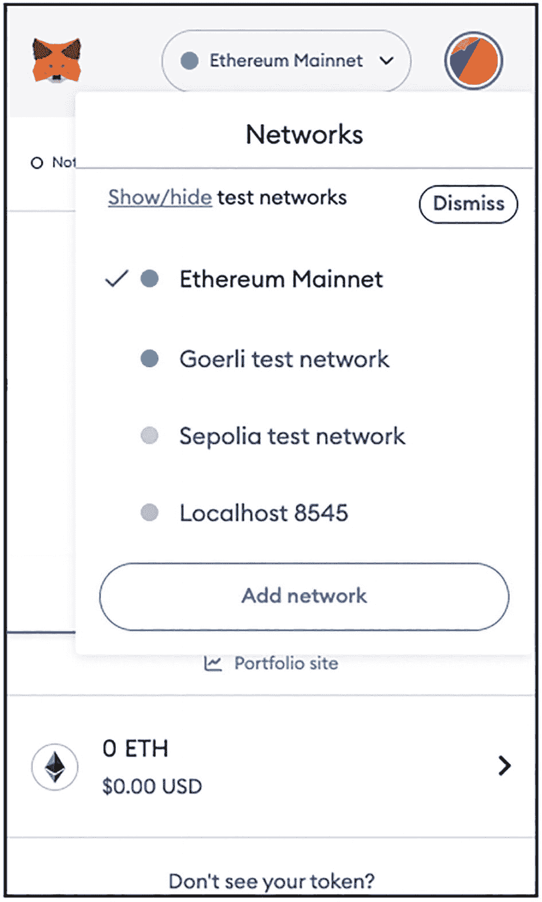
*以太坊主网页面覆盖在网络列表上的截图。以太坊主网已被选中。底部有一个"添加网络"按钮。*

**图 5-12** — 选择要连接的以太坊网络

> **提示**：默认情况下，`MetaMask` 会隐藏测试网络。要查看测试网络，请点击以太坊主网下拉列表旁边的图标，选择**设置 > 高级**，然后打开**显示测试网络**选项。

此外，`MetaMask` 还允许您连接到正在监听 `8545` 端口的本地以太坊节点。它还允许您连接到自定义的 RPC 主机。

在本章中，您将使用 Goerli 测试网络，因此在 `MetaMask` 中选择它。

### 获取测试以太币

连接到 Goerli 测试网络后，首先要做的是获取一些免费的测试以太币，以便用于支付网络上的交易费用。

要获取免费以太币：

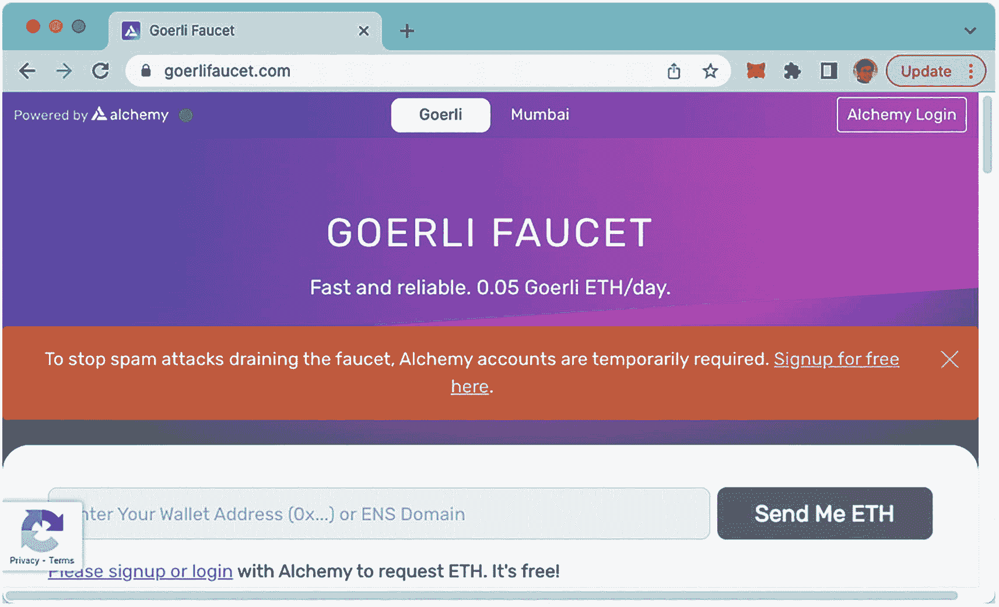

**图 5-13** 使用 Goerli 水龙头页面为你的账户获取免费以太币

- 访问位于 `https://goerlifaucet.com/` 的 Goerli 水龙头页面（见图 5-13）。

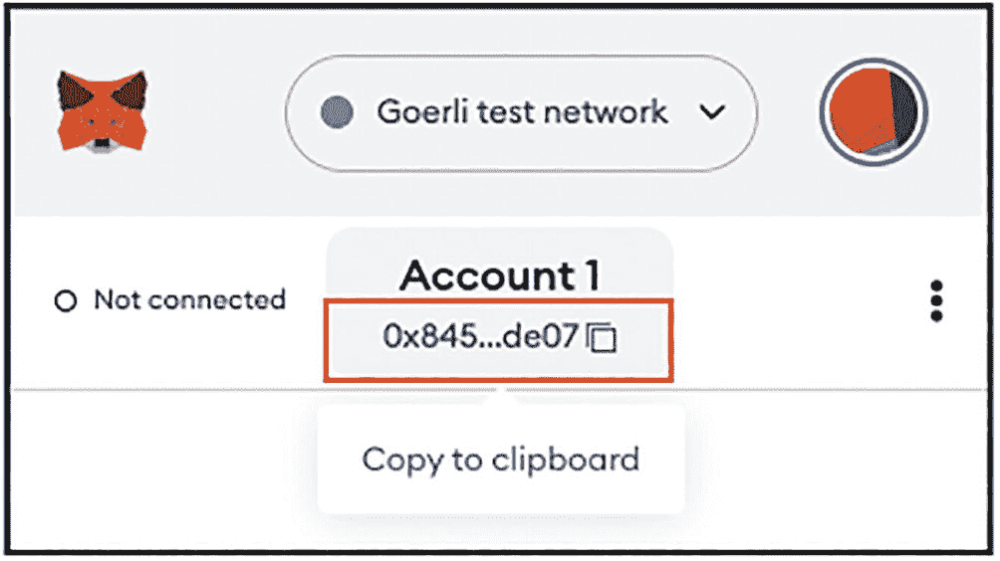

**图 5-14** 在 MetaMask 中复制你的账户地址

- 在 `https://auth.alchemy.com/signup` 注册一个免费的 Alchemy 账户。完成 Alchemy 注册后，返回 Goerli 水龙头页面并登录。
- 复制你在 `MetaMask` 中的账户地址（见图 5-14）。

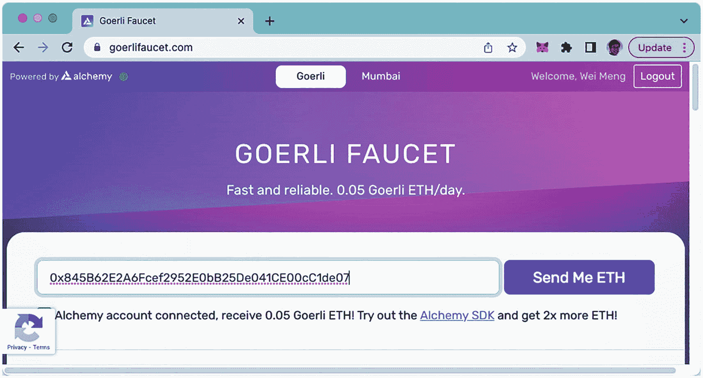

**图 5-15** 从 Goerli 水龙头获取免费以太币

- 将账户地址粘贴到 Goerli 水龙头页面（见图 5-15）。点击 **发送我 ETH** 按钮。

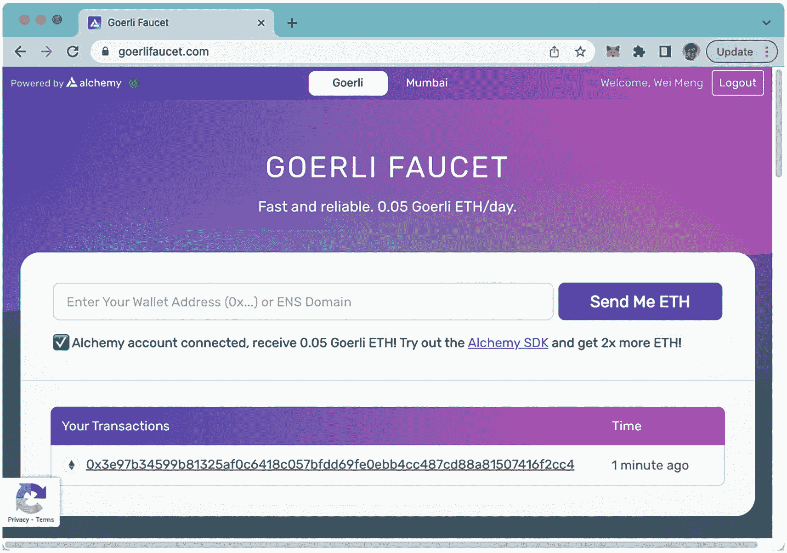

**图 5-16** Etherscan 上的交易链接

- 在 Goerli 水龙头页面底部，你会看到一个交易超链接（见图 5-16）。点击它即可在 Etherscan 上查看交易状态。

> **提示**
> Etherscan 是一个以太坊区块链浏览器。它允许你在区块链上搜索交易、地址、代币、价格以及链上发生的各种活动。

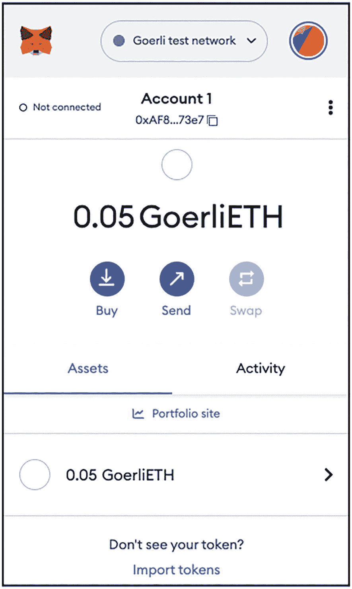

**图 5-17** 免费以太币已存入你的账户

- 稍等片刻，你应该会看到 0.05 以太币存入你的账户（见图 5-17）。

> **提示**
> 每 24 小时只能申请 0.05 免费以太币（这是撰写本文时的政策）。如果你想要更多，可以尝试在多台计算机上设置 `MetaMask` 并创建额外的 Alchemy 账户。

请务必记住，你账户中的以太币数量仅在你获取它的特定以太坊网络内有效。例如，如果你切换到另一个测试网络，比如 Sepolia 测试网络，你的账户余额将显示为 0。

### 创建额外账户

`MetaMask` 允许你创建多个账户。当你想要学习如何从一个账户向另一个账户转账时，这非常有用。同样，在测试和调试智能合约时，这也很有帮助。

要在 `MetaMask` 中创建额外账户：

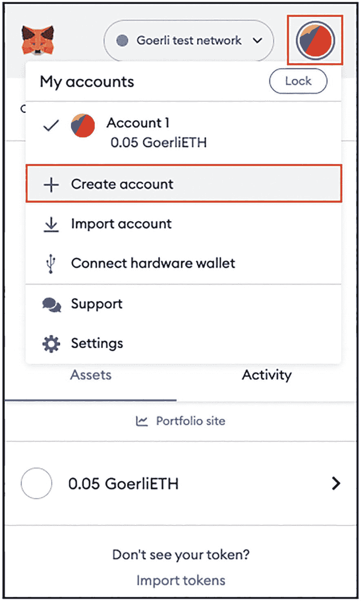

**图 5-18** 在 MetaMask 中创建新账户

- 点击 `MetaMask` 右上角的彩色图标（见图 5-18）。

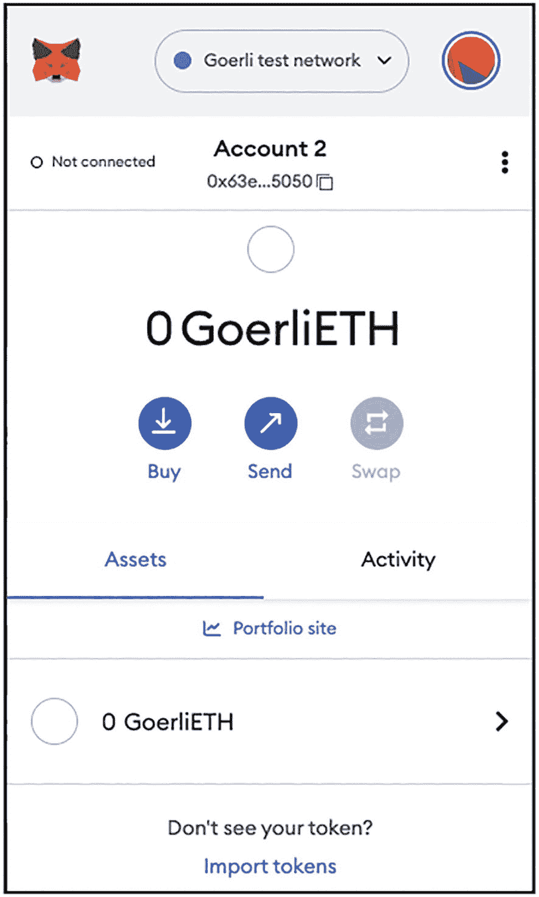

**图 5-19** 第二个新创建的账户

- 点击 **创建账户** 选项。
- 在 **新账户** 界面中，点击 **创建**。
- 你会看到新账户已创建（账户 2，见图 5-19）。

> **提示**
> 你可以根据需要创建任意数量的账户。实际上，为了测试你的智能合约，出于测试目的，你至少应该创建三个账户。

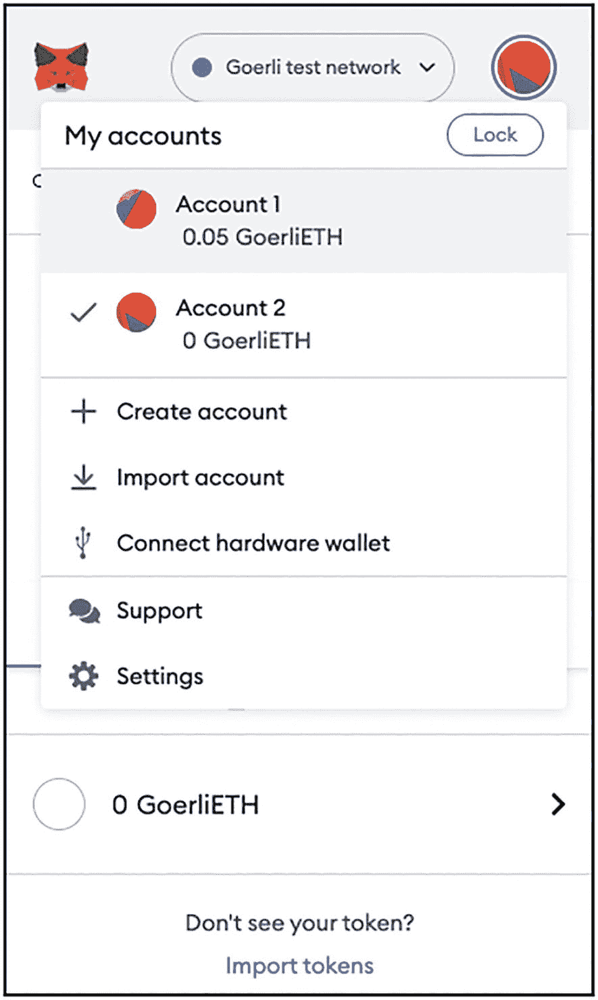

**图 5-20** 在 MetaMask 中切换账户

- 要切换账户，请点击彩色图标（见图 5-20）并选择你想要切换到的账户。