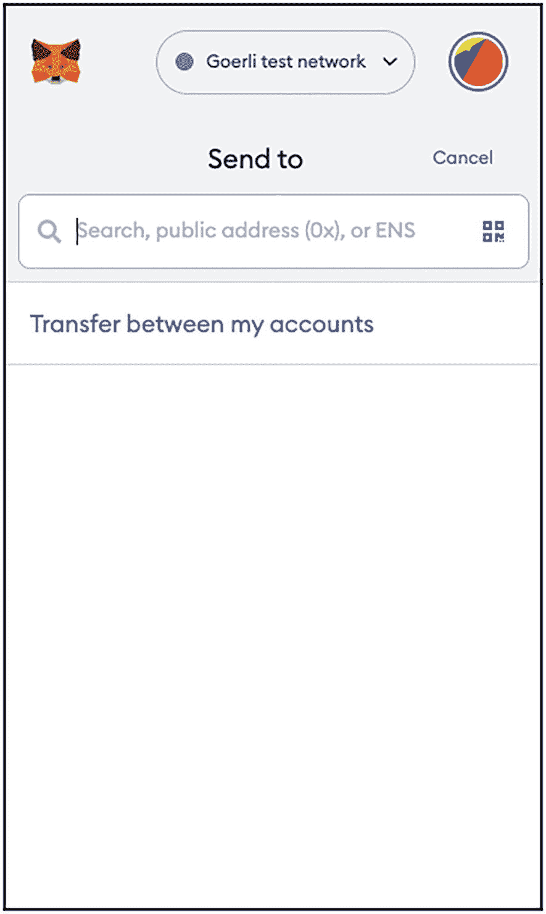
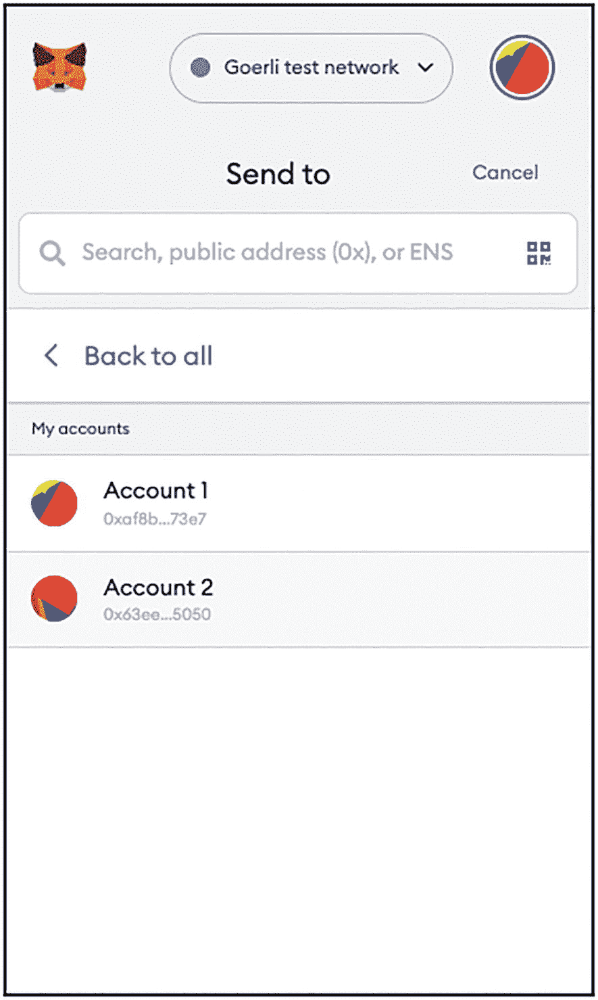
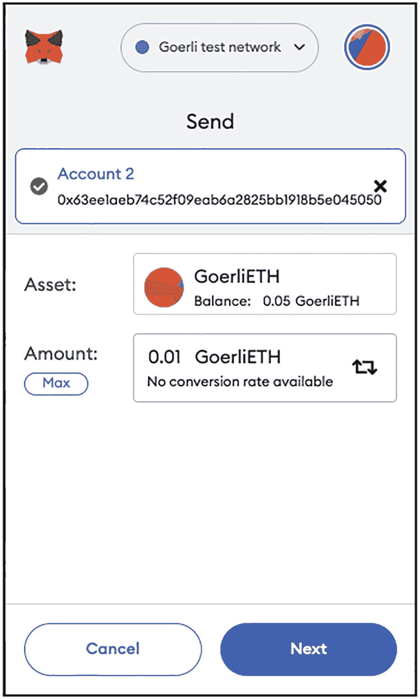
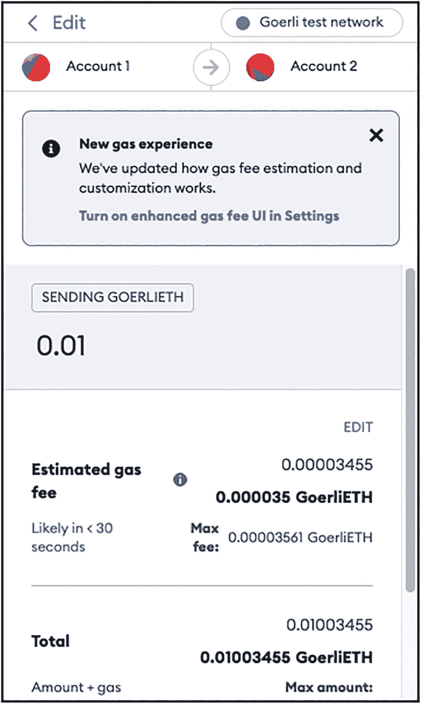
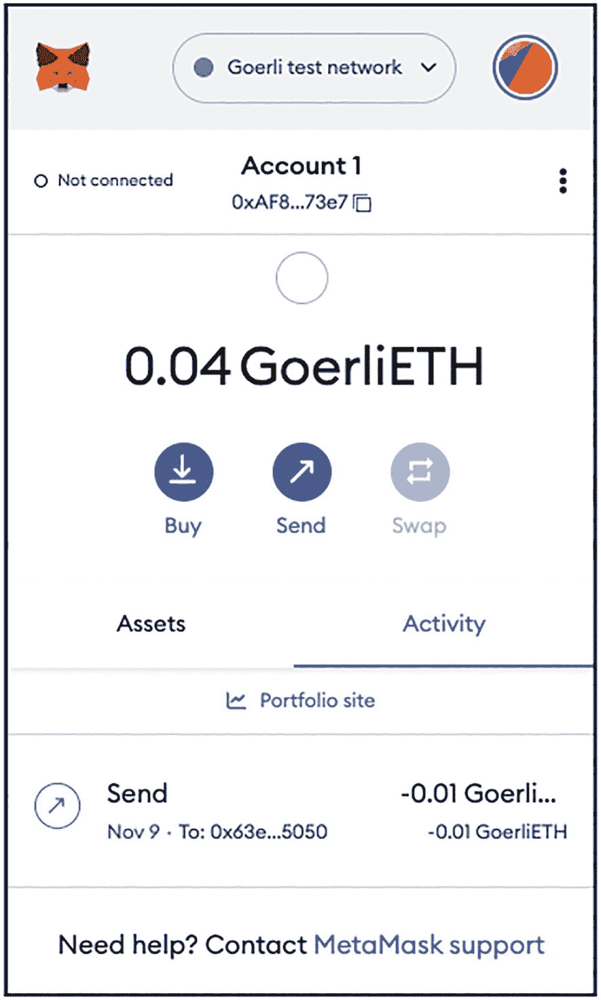

# 转移以太币

使用 MetaMask，您可以非常轻松地将以太币从一个账户转移到另一个账户。您可以转账给 MetaMask 中的另一个账户，也可以使用其公钥地址转账给外部账户。

要将以太币从一个账户转移到另一个账户，

Goerli 测试网络界面的截图。它显示了一个空的搜索栏和一条信息，内容为“在我账户间转账”，位于发送至屏幕下方。

图 5-21

将以太币发送到另一个账户

- 切换到 `Account 1`。
- 点击 **发送** 按钮。
- 您将看到如图 5-21 所示的屏幕。

Goerli 测试网络界面的截图。它显示了一个空的搜索栏、一个“返回全部”选项，以及一个“我的账户”下的账户列表。

图 5-22

选择要将以太币发送到的账户

- 要将以太币发送到另一个本地账户，请点击 **在我账户间转账** 选项。在此示例中选择 `Account 2`（见图 5-22）。

**提示：** 要将以太币发送到外部账户，请输入收款人的账户地址，或点击二维码图标，然后您就可以使用网络摄像头扫描外部账户公钥地址的二维码。

Goerli 测试网络界面的截图。它在发送屏幕下显示了 Account 2 及其资产和数量。“下一步”按钮以深色阴影高亮显示。

图 5-23

指定要发送的以太币数量

- 指定您要发送的以太币数量（本例中为 0.01；见图 5-23）。点击 **下一步**。

Goerli 测试网络界面“编辑”窗口的截图。它显示了将从 Account 1 交易到 Account 2 的 0.01 Goerlieth，以及预估的 Gas 费。

图 5-24

确认交易

- 您将看到本次交易产生的总交易金额（见图 5-24）。点击 **确认**（您需要向下滚动页面）。

**注意：** 总交易金额是您转移的以太币数量加上交易费。交易费也称为 *gas 费*。

## Gas 费

*Gas* 是在以太坊中运行交易或合约的内部定价单位。以太坊故意使用 Gas 作为交易定价的单位，而不是直接用以太币来计价交易费用。这是因为 Gas 能更准确地传达计算的复杂性，而以太币的价格会因市场力量而波动。Gas 的价格由进行交易的市场需求决定。矿工/验证者通常会根据人们支付的 Gas 价格来处理交易；您支付的 Gas 价格越高，您的交易确认速度就越快。

当您执行交易时，MetaMask 会自动指定您想要花费的最大 Gas 限额，所有未使用的 Gas 将退还到您的账户。此外，MetaMask 还会计算交易所需的 Gas 量，并为您的交易建议一个 Gas 价格。

Goerli 测试网络界面的截图。它在 Account 1 的活动选项卡下显示了已发送的 Goerlieth。剩余的 Goerli ETH 为 0.04。

图 5-25

转账后的账户余额

- 当交易完成时，您的账户应扣除总交易金额（见图 5-25）。
- 您可以通过切换到 `Account 2` 来验证以太币是否已转移到 `Account 2`。

