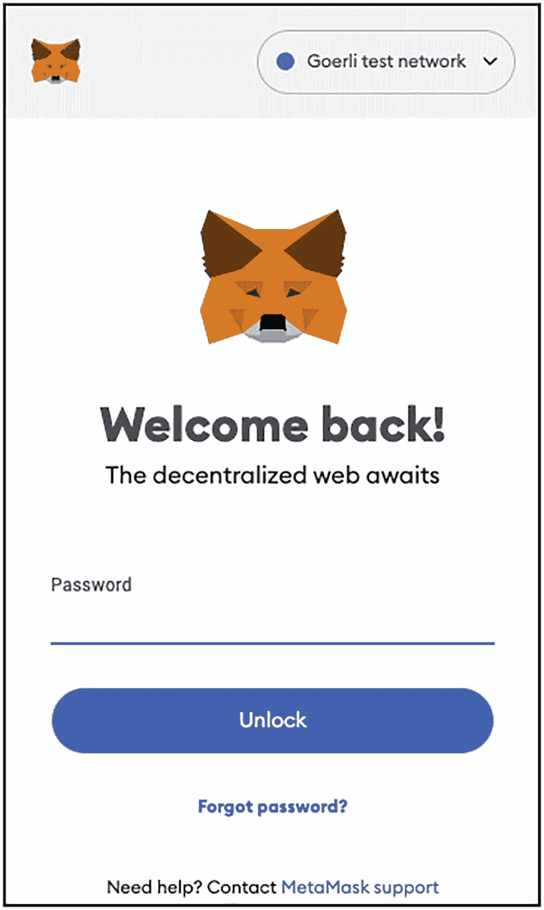
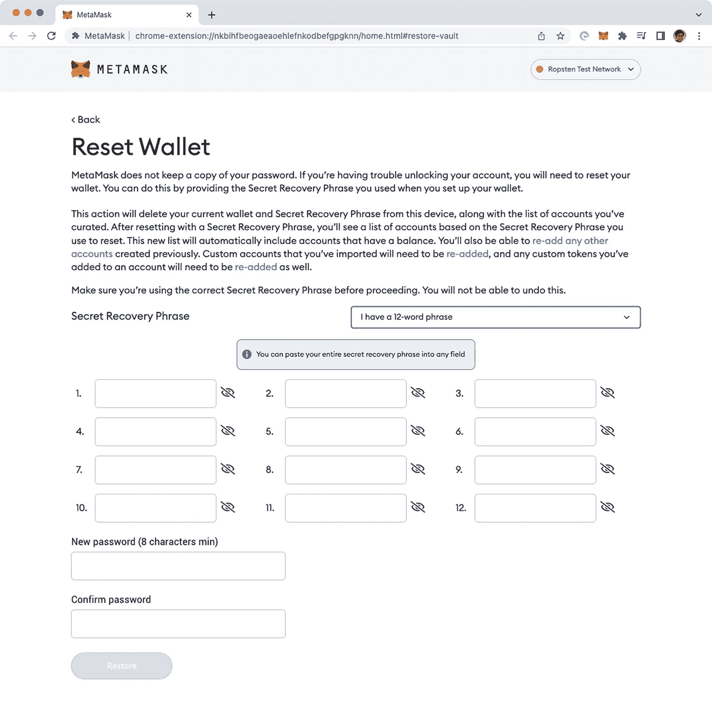

# 恢复账户

MetaMask 有一个内置系统，允许您安全可靠地恢复您的账户。在以下几种可能的情况下，您需要恢复您的账户：

- 您忘记了登录 MetaMask 的密码。
- 您需要将账户从一台计算机转移到另一台计算机（例如您有了新电脑或丢失了旧电脑）。

无论是哪种情况，只要您备份了 12 个单词的助记词，MetaMask 都允许您非常轻松地恢复现有账户。使用 12 个单词的助记词的好处是，您的所有账户都可以被恢复。假设您在 MetaMask 中创建了三个账户。只要您拥有 12 个单词的助记词，所有账户都可以恢复。

要恢复您的账户：

图 5-26 Goerli 测试网络界面的截图。它显示了一个 MetaMask 徽标、一条带有密码栏的“欢迎回来”消息以及一个解锁按钮。

- 点击 MetaMask 登录屏幕中的 `忘记密码？` 链接（见图 5-26）。

图 5-27 MetaMask 页面的截图。它在“重置钱包”选项下显示了相关消息以及秘密恢复短语、创建新密码和确认密码的选项卡。

- 您将被重定向到一个允许您重置钱包的网页。
- 按照提供给您的确切顺序输入 12 词种子短语（见图 5-27）。您还需要设置一个新密码来保护您的账户。点击 `恢复`。
- 现在您将找到您原来的 `Account 1` 和 `Account 2`。实际上，您之前创建的所有余额非零的账户都会被自动恢复。

**注意：** 您应该会看到 `Account 1` 和 `Account 2` 拥有与之前相同数量的以太币。