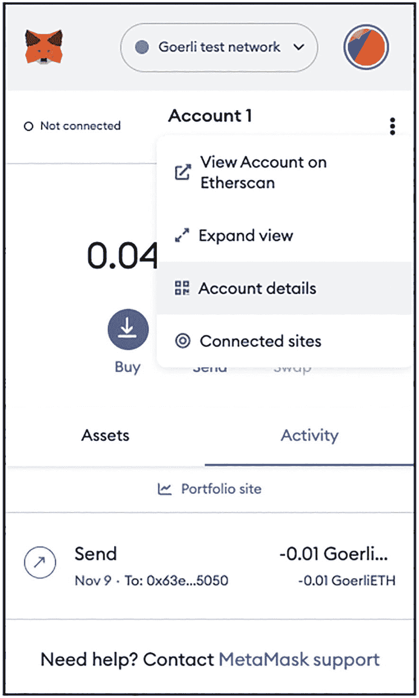
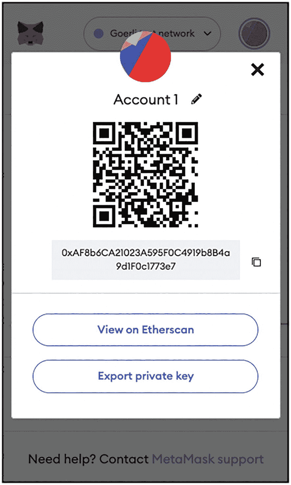
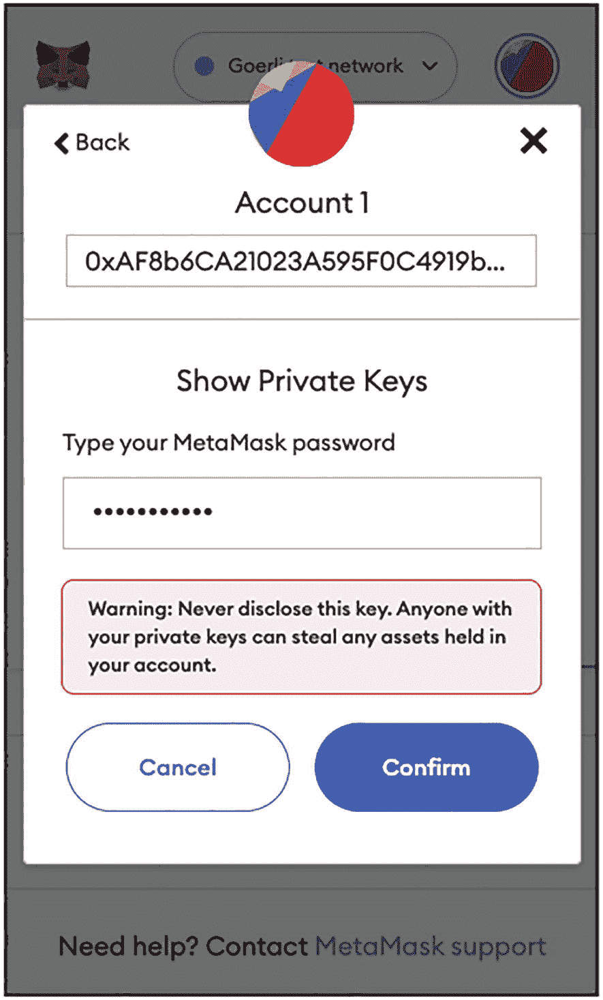
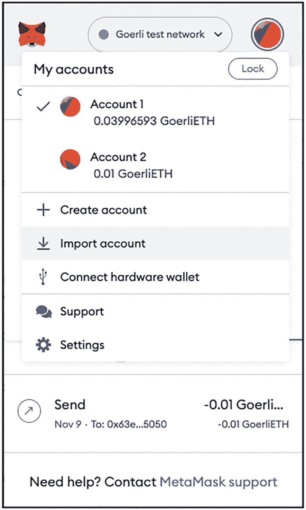
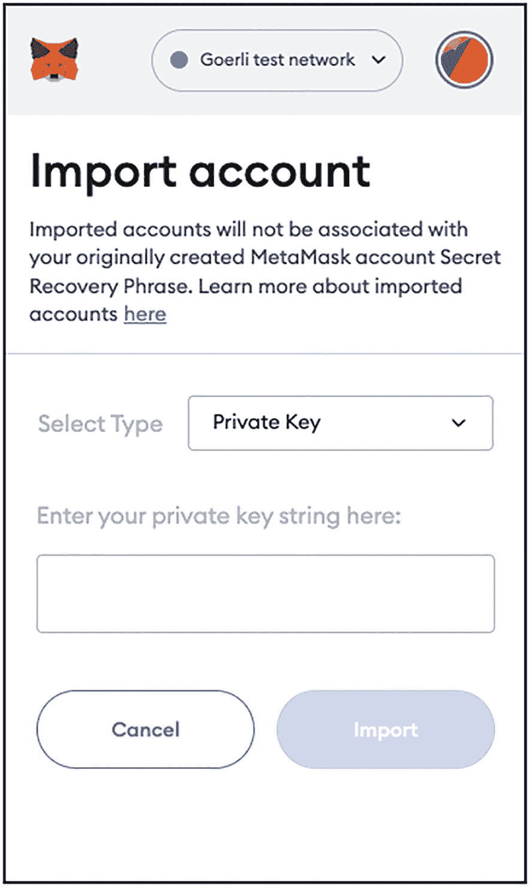

# 导入和导出账户

您可以导出 MetaMask 中的账户，以便它们可以被导入到另一台计算机上。您需要做的就是导出您账户的私钥，然后在另一台计算机上使用相同的私钥导入它。

## 导出账户

要导出一个账户，

Goerli 测试网络界面的截图。它在 Account 1 下显示了一个列表，其中选择了“账户详情”选项。

图 5-28

查看您的账户详情

- 选择您想要导出的账户。
- 选择账户名称右侧显示的 … 并选择 **账户详情**（见图 5-28）。

Goerli 测试网络界面的截图，其上覆盖着 Account 1 信息弹出框。它显示了二维码、一个代码，以及两个按钮：在以太坊上查看和导出私钥。

图 5-29

导出您账户的私钥

- 点击 **导出私钥** 按钮（见图 5-29）。

Goerli 测试网络界面的截图，其上覆盖着 Account 1 信息弹出框。它显示了一条警告信息，内容为切勿泄露密钥。“确认”按钮以深色阴影高亮显示。

图 5-30

查看您账户的私钥

- 输入您的 MetaMask 密码并点击 **确认**（见图 5-30）。
- 现在您应该可以看到您的私钥。点击它以将其复制到剪贴板，并安全地保存到一个文本文件中。

**警告：** 在以太坊主网中处理账户时，导出私钥时务必非常谨慎，并确保将其保存在安全的位置。一旦私钥泄露，您账户中的资产很容易被盗。当然，在处理测试网络时，就没那么重要了，因为测试网络中的资产没有货币价值。

### 导入账户

要将账户导入 MetaMask，

Goerli 测试网络界面截图。在“`我的账户`”选项下显示一个列表，其中账户 1 处于选中状态。

**图 5-31** 导入现有账户

- 点击 MetaMask 右上角的彩色图标（见图 5-31）。点击**导入账户**。

Goerli 测试网络界面截图。导入账户下方显示一条消息，以及一个`私钥`选项卡以及取消和导入按钮。

**图 5-32** 粘贴私钥以导入账户

- 如图 5-32 所示，将私钥粘贴到文本框中。点击**导入**。该账户现已导入 MetaMask。

> **提示**  
> 你只能基于当前不在 MetaMask 中的私钥导入新账户。否则，导入将不会成功。此外，对于使用私钥导入的账户，它们无法通过 12 个词的助记词恢复。要恢复这些账户，你必须使用它们的私钥或 JSON 文件。

> **提示**  
> 将账户导入 MetaMask 有两种方式：使用私钥或 JSON 文件。在第 4 章中，你了解了存储在 JSON 文件中的账户。你可以用它来将 Geth 中的账户导入 MetaMask。

## 本章小结

在本章中，你了解了如何使用 MetaMask Chrome 扩展程序管理你的以太坊账户。你学习了基础知识：如何创建账户、在账户间转账，以及如何将账户导出和导入 MetaMask。在接下来的章节中，你将有机会更多地看到 MetaMask 的实际应用，以及它如何帮助你通过网络浏览器运行去中心化应用。

