# 6. 智能合约入门

在上一章中，你学习了如何使用 MetaMask Chrome 扩展程序管理你的以太币，以及如何从 Goerli 测试网获取测试以太币。在本章中，你将学习以太坊最有趣、最激动人心的特性之一：智能合约。你将快速了解智能合约的外观以及如何对其进行测试。在接下来的几章中，你将深入了解智能合约的细节。

## 什么是智能合约？

智能合约本质上是一个驻留在区块链上的应用程序，它可以将值写入区块链本身。由于记录在区块链上的所有数据都是不可篡改且可追溯的，因此智能合约允许你利用区块链作为后端存储来存储永久性数据（例如学生的考试成绩），以便你日后将其用作一种证明形式。

图 6-1 展示了智能合约背后的概念构想。

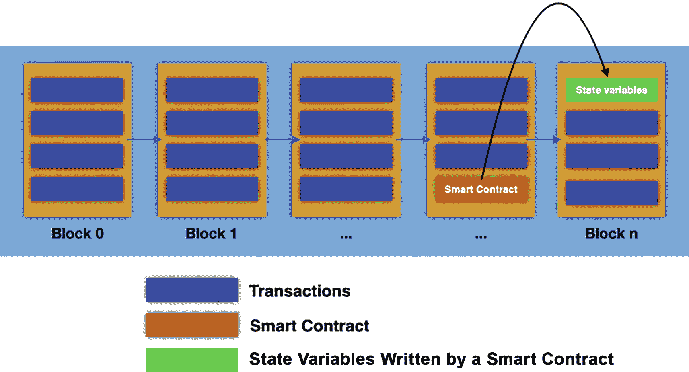

一张图表展示了包含 n 个区块的区块链，其中包括交易、智能合约以及由智能合约写入的状态变量。

**图 6-1** 除了存储交易，区块链还包含智能合约，智能合约可以将值写入区块链本身

除了存储交易，一个可编程的区块链（如以太坊）还可以存储智能合约。当智能合约被调用时（每个部署到区块链上的智能合约都有一个地址），智能合约可以像应用程序一样执行代码（尽管智能合约能做什么、不能做什么有一些限制）。通常，智能合约可以将值（通常称为`状态变量`）写入区块链。

除了向区块链写入值，智能合约还可以在账户之间转移资金（例如代币和加密货币）。这为开发者编写运行在区块链上的有趣应用程序开辟了多种可能性。比如去中心化的彩票应用？

### 智能合约如何执行

智能合约基本上有两种主要类型的函数：

- 将值写入区块链并因此改变区块链状态的函数
- 从区块链读取数据的函数

> **注意**
> 当你调用一个向区块链写入数据的智能合约函数时，你实际上是在执行一笔改变区块链上存储状态的交易。

当你调用一个改变区块链状态的函数时（例如将学生的考试成绩保存到区块链上），所有矿工/验证者都会执行该智能合约函数（使用 EVM；更多信息见侧边栏），并将状态变更添加到区块中，以便为挖矿/验证做准备，并最终添加到区块链上。

> **注意**
> 本质上，当你调用一个改变区块链状态的函数时，多个节点会运行相同的函数，并尝试将状态变更添加到区块中。最终，只有获胜的矿工/验证者才会将区块添加到区块链上。

对于从区块链读取数据且不对区块链做任何状态变更的函数，连接到函数调用者的节点会执行该函数，直接从其本地区块链副本中读取值，然后将该值返回给调用者。这种方式更为直接，只涉及一个节点。

**以太坊虚拟机（EVM）**

EVM 是节点上运行智能合约的沙盒执行环境。EVM 是*图灵完备*的，这意味着它能够执行任何程序（在大多数情况下）来解决任何合理的计算问题。

如今，你经常会听到*EVM 兼容*这个短语。它意味着某个特定的区块链支持与以太坊虚拟机兼容的智能合约。这使得你用 Solidity（或以太坊支持的任何其他语言）编写的智能合约无需修改即可在其他区块链上运行。

## 你的第一个智能合约

现在你已经准备好编写你的第一个智能合约了。为此，你可以使用你喜欢的任何代码编辑器，例如 Visual Studio Code，甚至是 `vi`。

> **提示**
> Visual Studio Code 有几个 Solidity 扩展，你可以安装这些扩展来简化智能合约的编写。

我个人最喜欢的是`Remix IDE`。`Remix IDE`是一套用于与以太坊区块链交互的工具。它可以将你的智能合约编译成字节码，生成 ABI（应用程序二进制接口），并将你的合约部署到各种以太坊测试网络（以及真实的以太坊区块链）。在线编译合约的能力使其成为学习智能合约编程的便捷工具。因此，我强烈建议你使用它来编写合约。

本书将使用`Remix IDE`来编写智能合约。

> **注意**
> 要编译 Solidity 智能合约，你需要使用`solc`编译器。但如果你使用`Remix IDE`，则无需显式使用它来编译你的合约。

### 使用 Remix IDE

要使用`Remix IDE`，请启动 Chrome 浏览器并加载以下 URL：[`https://remix.ethereum.org/`](https://remix.ethereum.org/)。您将看到如图 6-2 所示的`Remix IDE`。

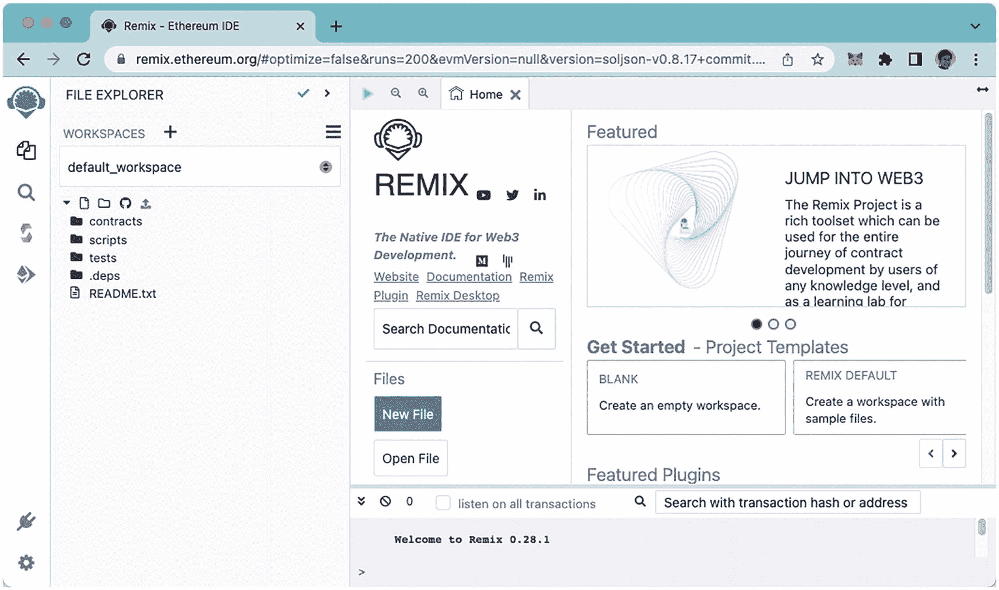

截图显示了 Remix 以太坊 IDE 窗口，其中列出了工作区下的选项，并包含搜索文档对话框、项目模板和特色插件。

**图 6-2** 使用`Remix IDE`创建您的智能合约

> **提示**
> 所有使用`Remix IDE`创建的合约都会存储在浏览器的本地缓存中。

要创建一个新合约，右键点击`contracts`项并选择`New File`（参见图 6-3）。系统将提示您为新建的合约命名。将其命名为`calculator.sol`并按回车键。

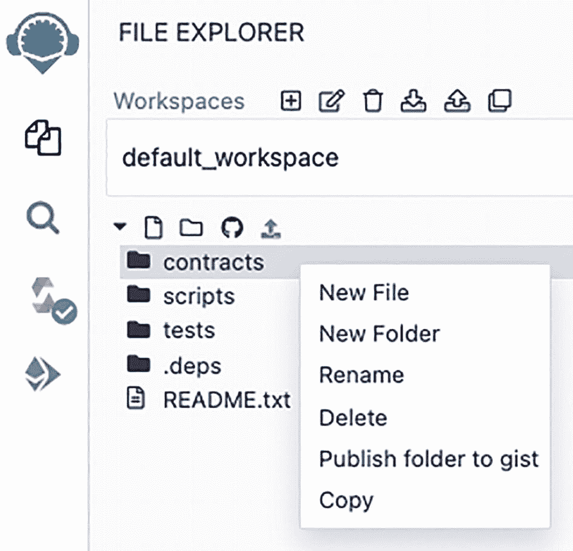

截图展示了文件资源管理器窗口，其中列出了`contracts`下的选项，包括新建文件、新建文件夹、重命名、删除、将文件夹发布到 gist 以及复制。

**图 6-3** 在`Remix IDE`中创建新合约

现在，让我们创建一个名为`Calculator`的简单合约。在`Remix IDE`中输入以下代码：

```solidity
// SPDX-License-Identifier: MIT
pragma solidity ⁰.8;
contract Calculator {
    function arithmetics(uint num1, uint num2) public
        pure returns (uint sum, uint product) {
        sum = num1 + num2;
        product = num1 * num2;
    }
    function multiply(uint num1, uint num2) public
        pure returns (uint) {
        return num1 * num2;
    }
}
```

让我们剖析这段代码，了解其工作原理，然后您就可以运行它并查看结果。

合约的第一行指定了合约所使用的许可证类型。这是在 Solidity 0.6.8 中引入的。MIT 许可证是一种宽松的自由软件许可证，起源于 20 世纪 80 年代末的麻省理工学院。作为一种宽松许可证，它对重用的限制非常有限，因此具有很高的许可证兼容性。

接下来，`pragma solidity`语句是一个指令，告诉编译器该源代码是为特定版本的 Solidity 编写的。在本例中，它兼容 0.8.x 版本（例如，版本 0.8.1、0.8.17 等）。但是，它与 0.7 或 0.9 等版本不兼容。

接下来，`contract`关键字（可以将其视为 C# 和 Java 等语言中的`class`关键字）定义了名为`Calculator`的合约。它包含两个函数：

- `arithmetics`：此函数接受两个参数`num1`和`num2`，类型为`uint`（无符号整数）。它具有`public`访问修饰符，并返回一个包含两个成员`sum`和`product`的元组，每个成员的类型都是`uint`。函数中的两条语句计算两个参数的和与乘积，它们的值会从函数中自动返回。

- `multiply`：此函数与上一个函数类似，只是返回语句略有不同。在这里，您指定要返回一个`uint`类型的值，但并未指定要返回的变量名称。而是使用`return`关键字返回特定变量。

请注意，这两个函数在其声明中都使用了`pure`关键字。`pure`关键字表示该函数不会访问也不会更改`状态变量`的值。这个关键字的使用很重要；由于未对区块链进行任何修改，因此可以在无需网络验证的情况下返回值。因此，调用此函数也是免费的，无需消耗任何 gas。

> **注意**
> 状态变量是区块链上用于存储值的存储空间，例如您在合约中声明的变量。我将在下一章中更详细地讨论状态变量。

### 编译合约

`Remix IDE`允许您在键入时自动编译代码。要启用此功能，请选择屏幕左侧的**Compile**选项卡，并勾选**Auto compile**选项，如图 6-4 所示。如果有任何警告，您会在此处看到它们。

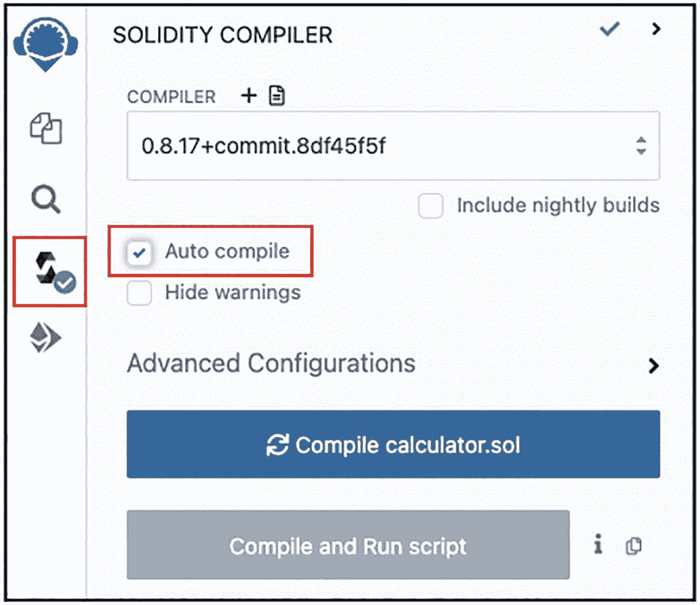

截图展示了 Solidity 编译器窗口，其中包含编译器文件、高亮显示的自动编译选项和高级配置，以及编译计算器按钮。

**图 6-4** `Remix IDE`在您键入时自动编译您的代码

如果存在语法错误，错误会出现在**Compile**选项卡下（参见图 6-5）。点击错误可跳转到相应的代码行。在此示例中，有一条语句在行尾缺少分号 (`;`)，这很容易修复。

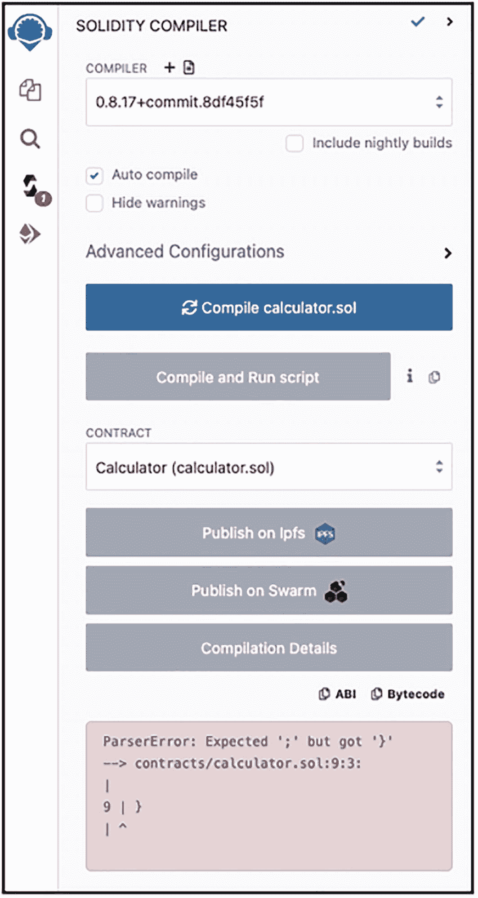

截图展示了 Solidity 编译器窗口，其中包含编译器文件、高亮显示的自动编译选项和高级配置，以及编译计算器和运行脚本。

**图 6-5** 查看语法错误

### 使用 JavaScript 虚拟机测试智能合约

代码编译完成且无错误后，你便可以直接在`Remix IDE`中对其进行测试。点击**运行**选项卡。接着点击**环境**选项旁的下拉列表，你会看到几个选项（参见图 6-6）。以下是一些常用的选项：

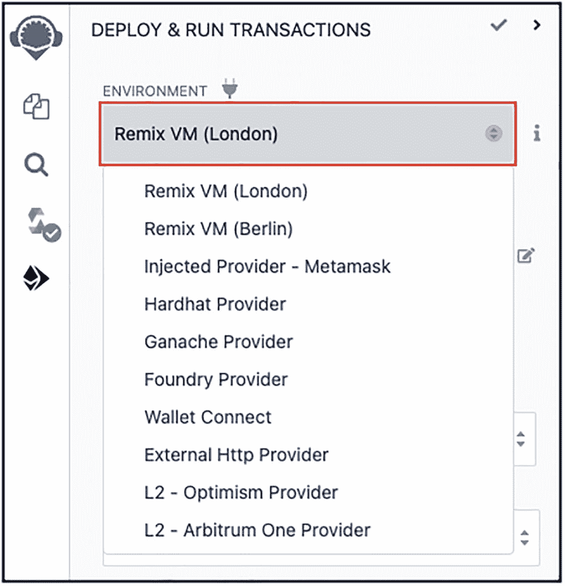

截图展示了部署和运行交易界面，其中列出了环境下的选项，并高亮显示了 Remix VM（伦敦版）。

图 6-6

Remix VM 允许你直接测试代码

- **Remix VM（伦敦版）**：模拟在本地运行你的智能合约，而无需实际将其部署到区块链上。
- **注入提供者 - MetaMask**：使用你网页浏览器中的 MetaMask 等插件来注入一个`web3`对象（更多信息请参见第 8 章），以便将你的智能合约与一个账户关联起来。
- **Ganache 提供者**：直接连接到一个以太坊节点，以便将你的智能合约与一个账户关联起来。它要求你运行一个像`geth`这样的以太坊节点（在第 4 章中讨论过）。

**提示**：注意这里有 Remix VM（伦敦版）和 Remix VM（柏林版）。它们都是`Remix IDE`中内置的 JavaScript 虚拟机的变体。柏林版发布得比伦敦版早，因此 Remix VM（伦敦版）获得的支持更好。

选择**Remix VM（伦敦版）**，这样你就可以在不将合约部署到区块链的情况下进行测试。

接下来，点击**部署**按钮（参见图 6-7）。你应该会在**已部署合约**部分看到你的合约。

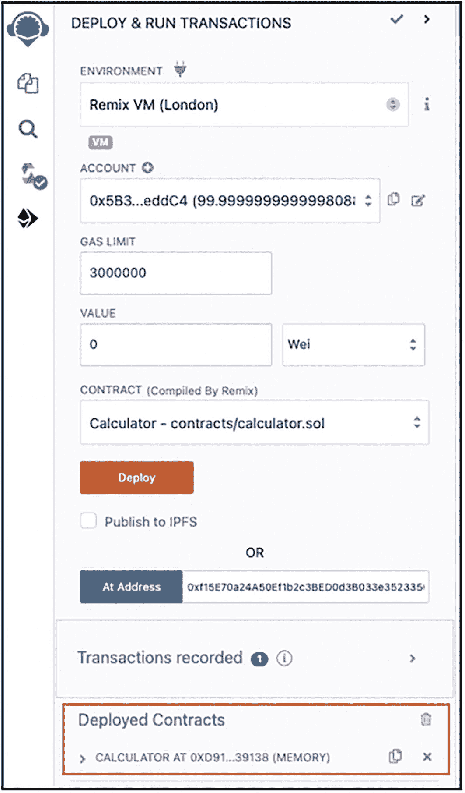

截图展示了部署和运行交易界面，其中环境为 Remix VM（伦敦版），并包含账户、Gas 限额、金额、合约和地址，以及已部署的合约。

图 6-7

在`Remix IDE`中部署和测试你的智能合约

点击计算器合约左侧显示的箭头图标，即可查看合约中的两个函数，每个函数都显示在一个蓝色框中。

输入如图 6-8 所示的文本，然后点击**arithmetics**按钮。结果将显示在其下方。

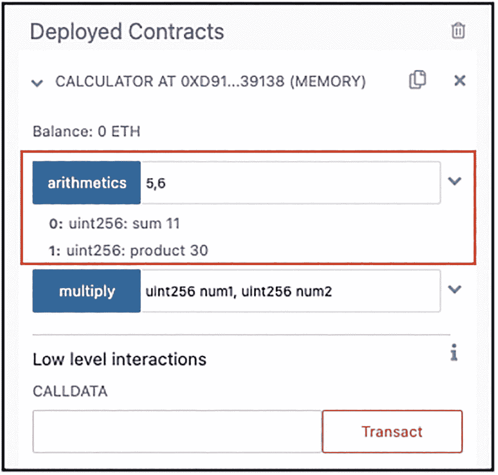

截图展示了已部署合约窗口，其中列出了计算器下的选项（包含余额），并高亮显示了算术运算值和底层交互。

图 6-8

测试智能合约中的第一个函数

**提示**：按钮的颜色是有意义的。蓝色按钮表示可以免费调用该函数。而红色按钮则表示你需要消耗 Gas 才能调用它。你将在下一章中看到红色按钮。

为下一个按钮输入数字并点击它（图 6-9）。你将看到它的输出。

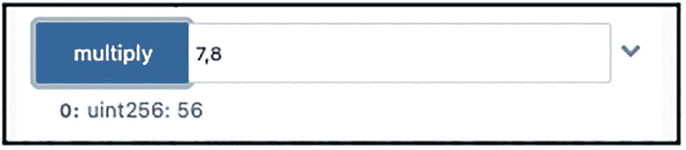

截图展示了一个对话框，其中高亮显示了 7 和 8 的乘法运算及其结果。

图 6-9

测试智能合约中的第二个函数

### 获取合约的 ABI 和字节码

现在合约已经过测试并能正常工作，是时候在真正的区块链上测试它了。但在你这么做之前，还需要了解一些其他内容。当合约被编译时，会生成两个项目：

-   `ABI`（应用程序二进制接口）：`ABI` 是一个 JSON 字符串，描述了合约的构成：函数以及每个函数的参数类型。
-   `字节码`：当合约被编译时，它被编译成操作码（可以将操作码视作计算机的汇编语言）。然后每个操作码被编译成其对应的十六进制形式，即字节码。字节码基本上就是每个操作码十六进制表示的集合。

在 `编译` 选项卡中，你会看到两个代表 `ABI` 和 `字节码` 的图标（参见图 6-10）。如果你点击 `ABI` 图标，`ABI` 将被复制到剪贴板。

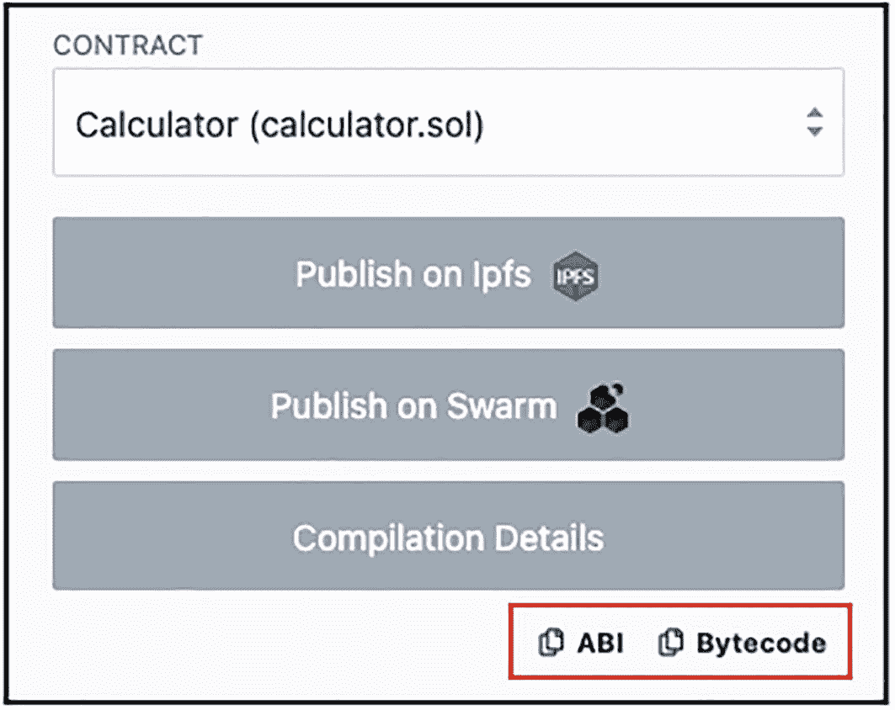

截图展示了合约窗口。它显示了计算器、发布到 IPFS、发布到 Swarm、编译详情，以及被选中的 `ABI` 和 `字节码`。

图 6-10

`ABI` 和 `字节码` 按钮提供了访问合约 `ABI` 和 `字节码` 的便捷途径

`ABI` 看起来如下所示：

```
[
{
"inputs": [
{
"internalType": "uint256",
"name": "num1",
"type": "uint256"
},
{
"internalType": "uint256",
"name": "num2",
"type": "uint256"
}
],
"name": "arithmetics",
"outputs": [
{
"internalType": "uint256",
"name": "sum",
"type": "uint256"
},
{
"internalType": "uint256",
"name": "product",
"type": "uint256"
}
],
"stateMutability": "pure",
"type": "function"
},
{
"inputs": [
{
"internalType": "uint256",
"name": "num1",
"type": "uint256"
},
{
"internalType": "uint256",
"name": "num2",
"type": "uint256"
}
],
"name": "multiply",
"outputs": [
{
"internalType": "uint256",
"name": "",
"type": "uint256"
}
],
"stateMutability": "pure",
"type": "function"
}
]
```

同样地，点击 `字节码` 按钮，然后将其粘贴到文本编辑器中。它看起来会像图 6-11 所示。

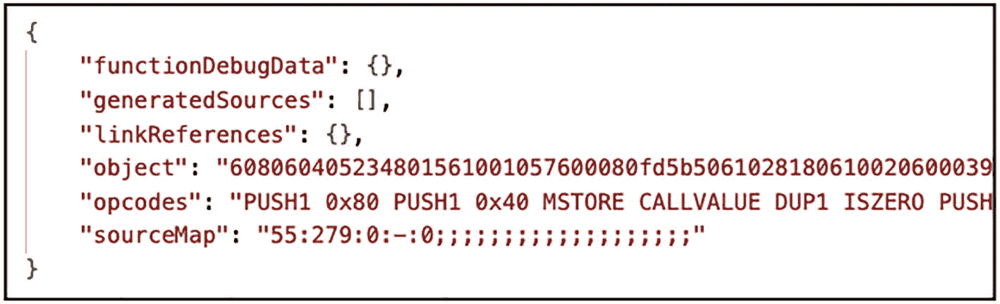

一个包含 7 行程序代码的文本片段，展示了调试数据中的对象、操作码和源码映射，以及生成的源码和链接引用。

图 6-11

`字节码`

具体来说，`object` 键的值包含了将被部署到区块链上的合约的实际字节码（可以将其视为机器语言）。图 6-12 展示了 `Remix IDE` 在编译你的智能合约时所执行的步骤。

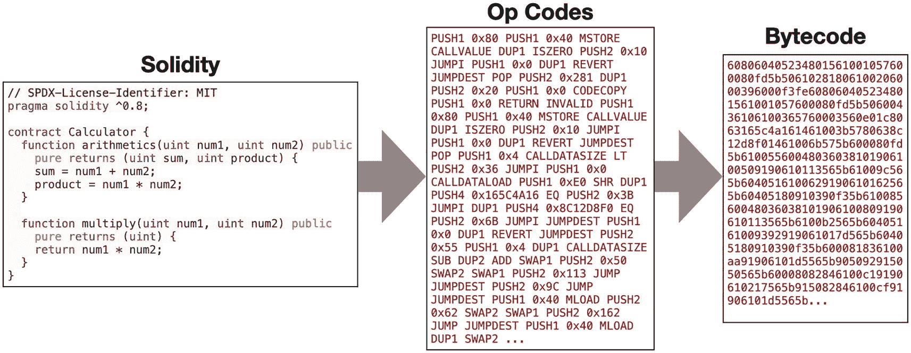

一组 3 个代码框。`Solidity` 代码生成操作码，然后生成字节码。`Solidity` 包含一个 10 行程序代码。

图 6-12

`Remix IDE` 如何编译你的智能合约

供你参考，你智能合约的字节码如下所示：

```
608060405234801561001057600080fd5b50610281806100206000396000f3fe608060405234801561001057600080fd5b50600436106100365760003560e01c8063165c4a161461003b5780638c12d8f01461006b575b600080fd5b61005560048036038101906100509190610113565b61009c565b6040516100629190610162565b60405180910390f35b61008560048036038101906100809190610113565b6100b2565b60405161009392919061017d565b60405180910390f35b600081836100aa91906101d5565b905092915050565b60008082846100c19190610217565b915082846100cf91906101d5565b90509250929050565b600080fd5b6000819050919050565b6100f0816100dd565b81146100fb57600080fd5b50565b60008135905061010d816100e7565b92915050565b6000806040838503121561012a576101296100d8565b5b6000610138858286016100fe565b9250506020610149858286016100fe565b9150509250929050565b61015c816100dd565b82525050565b60006020820190506101776000830184610153565b92915050565b60006040820190506101926000830185610153565b61019f6020830184610153565b9392505050565b7f4e487b7100000000000000000000000000000000000000000000000000000000600052601160045260246000fd5b60006101e0826100dd565b91506101eb836100dd565b92508282026101f9816100dd565b915082820484148315176102105761020f6101a5565b5b5092915050565b6000610222826100dd565b915061022d836100dd565b9250828201905080821115610245576102446101a6565b5b9291505056fea264697066735822122004d196373364650f382fd98a5ee0b1fecb87b1868f923159b9aa09076d53beb164736f6c63430008110033
```

### 使用 Goerli 测试网络测试智能合约

`Remix VM` 提供了一种快速测试智能合约的方法。然而，最贴近实际的方式还是将其部署到真正的区块链上。与其花费真实的 `Ethers` 将智能合约部署到 `主网`，最接近的做法是将其部署到 `Goerli` 测试网络。

现在，我们将 `Remix IDE` 中的环境更改为 `Injected Provider – MetaMask`（参见图 6-13）。

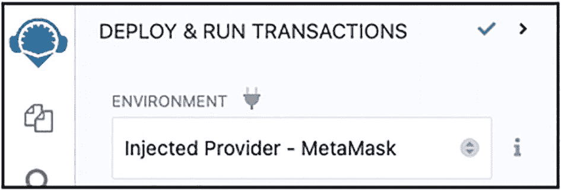

一张截图显示了 `部署并运行交易` 界面，其中环境选项卡下显示为 `injected provider - meta mask`。

图 6-13

在 `Remix IDE` 中更改环境

当您在 `Remix IDE` 中更改环境时，`MetaMask` 会提示您连接到您的账户（参见图 6-14）。这样做是为了确保当您将智能合约部署到 `Goerli` 测试网络时，该账户将用于支付交易手续费。在 `MetaMask` 中点击 `连接`，将账户连接到 `Remix IDE`。

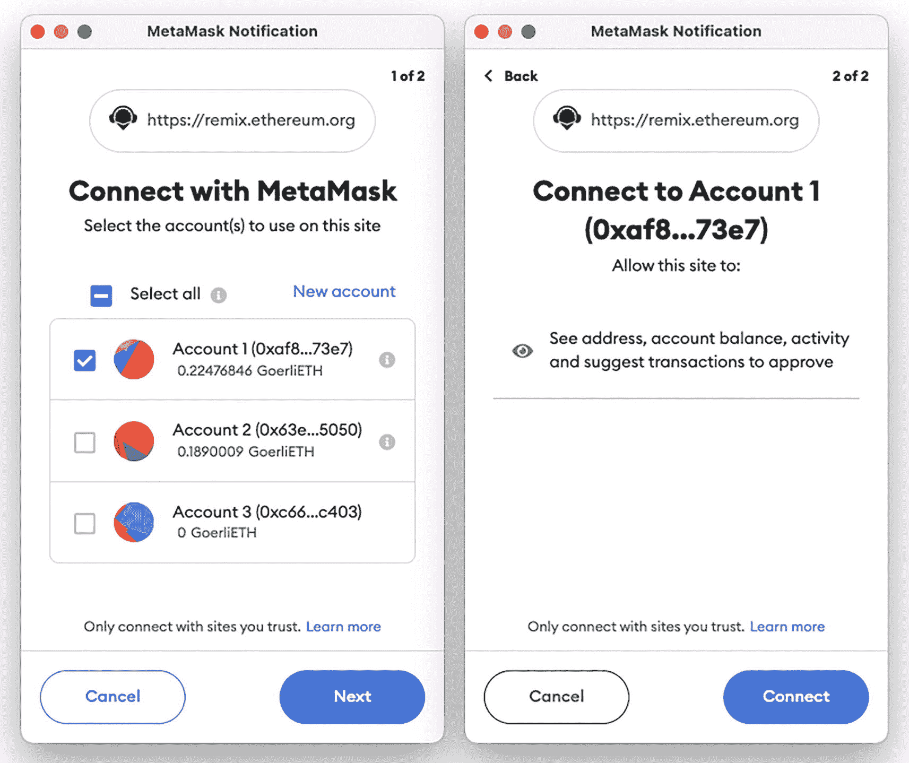

两张截图展示了 `MetaMask` 通知页面。左侧页面包含三个账户，其中 `账户 1` 被选中；右侧页面包含 `账户 1` 的连接按钮。

图 6-14

在 `Remix IDE` 中连接 `MetaMask` 的一个或多个账户

如果 `MetaMask` 成功连接到 `Remix IDE`，您将看到 `账户` 部分下方显示该账户的地址（参见图 6-15）。

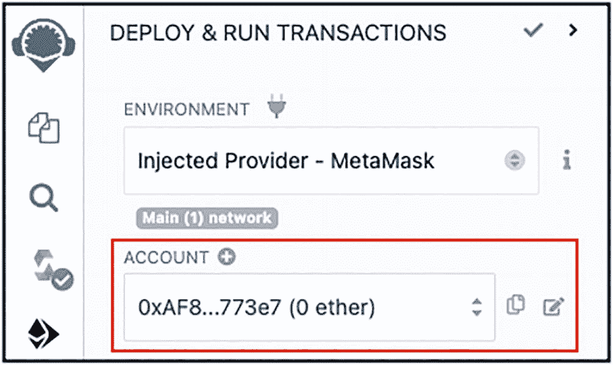

一张截图显示了 `部署并运行交易` 界面，其中环境显示为 `injected provider - Metamask`，并且账户被高亮显示。

图 6-15

`Remix IDE` 将显示已连接到它的账户

> **提示：** 如果您没有看到账户地址显示，请刷新 `Remix IDE` 页面。

在 `MetaMask` 上，请确保以下内容：

- 它已连接到 `Goerli` 测试网络。
- 您的账户有一些测试用的 `Ethers`（至少 0.02 `Ethers`）。

在 `Remix IDE` 中点击 `部署` 按钮，将合约部署到 `Goerli` 测试网络。`MetaMask` 将自动计算您需要支付的 Gas 费用并提示您（参见图 6-16）。点击 `确认`。

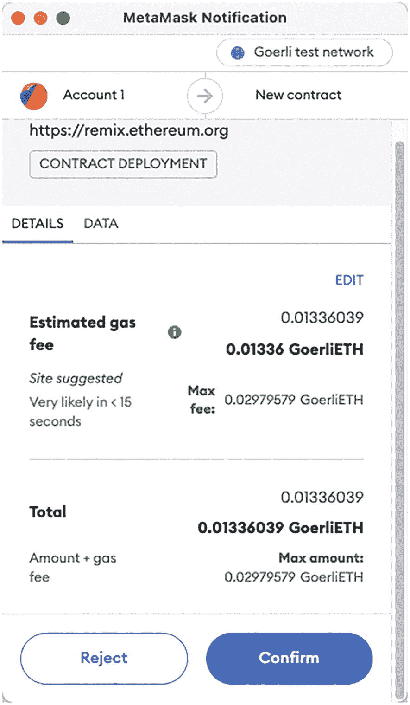

一张截图展示了 `MetaMask` 通知页面，该页面列出了 `账户 1` 的详细信息，包括预估的 Gas 费用和总计，以及选中的 `确认` 按钮。

图 6-16

支付合约部署的 Gas 费用

> **注意：** 部署您的智能合约所需支付的 Gas 费用取决于合约的大小和复杂程度。

当合约部署完成后，您就可以像之前一样与您的合约进行交互了。

## 本章小结

在本章中，您探索了智能合约的样子及其工作原理。您学习了如何使用 `Remix VM` 在本地测试合约，而无需部署到区块链上。您还学习了如何利用 `MetaMask` 将合约部署到 `Goerli` 测试网络。总而言之，请使用 `Remix VM` 选项快速测试智能合约的功能，然后将其部署到 `Goerli` 测试网络，以获得更贴近真实场景的体验，了解它在实际环境中是如何工作的。我强烈建议您使用 `Remix IDE` 来开发和测试您的智能合约，因为它能极大地简化您的工作流程。

在接下来的几章中，您将深入了解智能合约的细节以及与其交互的各种方式。