# 7. 使用智能合约存储凭证

在上一章中，您了解了什么是智能合约、它的工作原理以及如何创建一个智能合约。在本章中，您将学习智能合约的一个优秀使用案例，同时学习 `Solidity` 中的一些高级技巧。

## 智能合约作为凭证存储库

回想一下第 2 章，存储在区块链上的数据是不可篡改的。因此，区块链是*凭证存储*的绝佳场所。一个很好的使用案例是将学生的教育凭证存储在区块链上。

最近，出现了许多求职者向雇主提交虚假学历证明的案例。雇主没有简单的方法来核实求职者的学历是否真实，必须花费宝贵的时间去验证资质的真实性。如果某个机构能够将学生获得的教育凭证记录到区块链上，那么雇主（或任何人）验证潜在雇员资质真实性的过程将会变得更加容易。

考虑以下一个简化的学生考试成绩示例，以 JSON 字符串表示：

```
{
"id": "1234567",
"result": {
"math": "A",
"science": "B",
"english": "A"
}
}
```

其核心思想是将考试成绩存储在区块链上。但是，不建议直接将 JSON 字符串存储在区块链上，主要有两个关键原因：

- 将明文存储在区块链上成本高昂。区块链上每多存储一个字符都会产生额外的 Gas 费用。目标是只存储绝对必要的数据。
- 永远不应在公共区块链（如 `以太坊`）上存储个人可识别数据。在公共区块链上，所有数据都处于公众监督之下，因此以明文形式存储结果会违反隐私法规和法律。

考虑到隐私问题，您应该将凭证的哈希值存储在区块链上。

> **警告：** 切勿将加密数据存储在区块链上，因为这容易遭受黑客攻击。存储数据的哈希值要安全得多。

为了验证教育凭证的真实性，传入表示结果的 JSON 字符串，并检查该哈希值是否存在于区块链上。如果存在，则该结果是真实的。


### 创建智能合约

出于你将在本章后面看到的操作原因，你首先使用 base64 编码对 JSON 字符串进行编码，然后再对其进行哈希处理，并将哈希值存储在区块链上。要尝试 base64 编码，可以使用以下网站：[`https://codebeautify.org/json-to-base64-converter`](https://codebeautify.org/json-to-base64-converter)。上述 JSON 字符串经编码后，会得到以下 base64 编码输出：

```
ewogICJpZCI6ICIxMjM0NTY3IiwKICAicmVzdWx0IjogewogICAgIm1hdGgiOiAiQSIsCiAgICAic2NpZW5jZSI6ICJCIiwKICAgICJlbmdsaXNoIjogIkEiCiAgfQp9Cg==
```

照常使用 Goerli 测试网。

**注意**  
回想一下，Goerli 测试网是合并（即以太坊从工作量证明过渡到权益证明之后）你应该使用的测试网。其他测试网，如 Ropsten，此后已被弃用。

使用 Remix IDE，右键单击 `contracts` 项并选择**新建文件**（见图 7-1）。

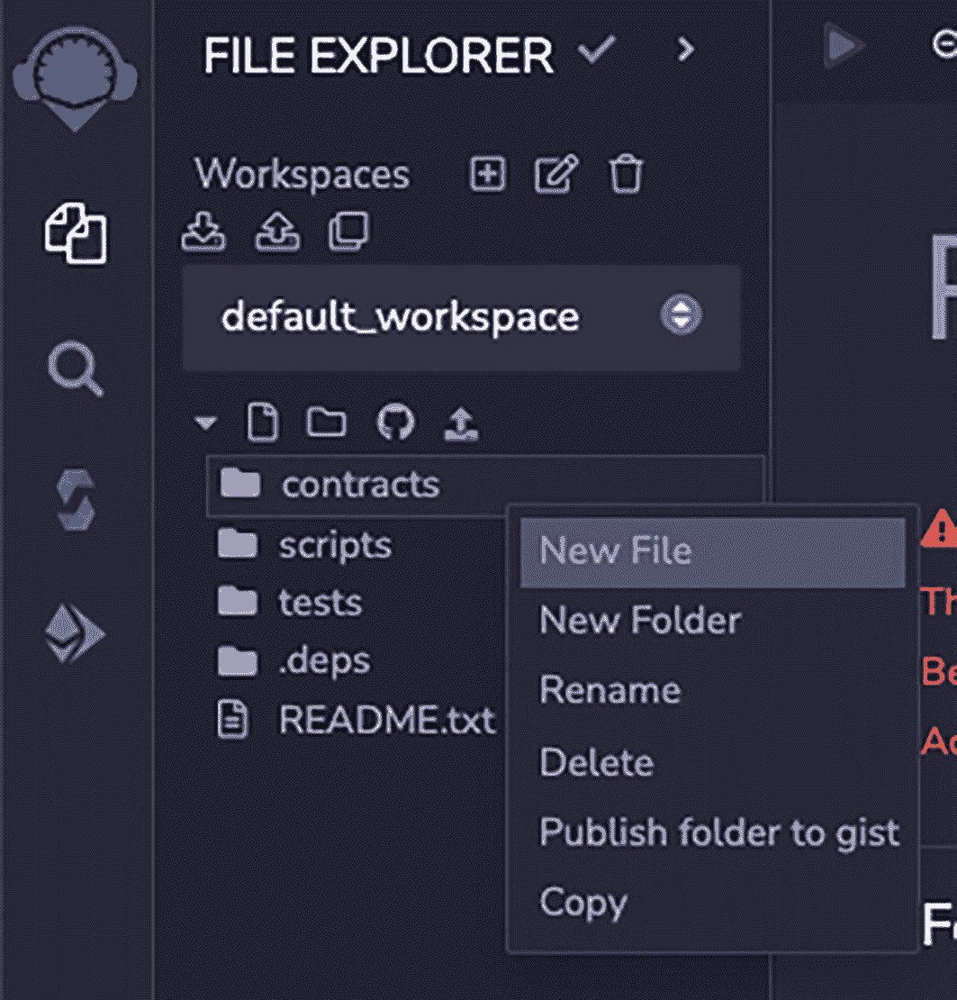

这是一个文件资源管理器的截图，显示从默认工作区下的 contracts 目录中选择的新建文件。

**图 7-1**  
在 Remix IDE 中创建新的合约文件

将合约命名为 `EduCredentialsStore.sol`。并用以下语句填充它：

```
// SPDX-License-Identifier: MIT
pragma solidity ⁰.8;
contract EduCredentialsStore {
//---存储字符串的哈希值及其
// 对应的区块编号---
// 键为 bytes32 类型，值为 uint 类型
mapping (bytes32 => uint) private proofs;
//--------------------------------------------------
// 在合约状态中存储一个存在性证明
//--------------------------------------------------
function storeProof(bytes32 proof) private {
// 使用哈希值作为键
proofs[proof] = block.number;
}
//----------------------------------------------
// 计算并存储一个文档的证明
//----------------------------------------------
function storeEduCredentials(string calldata
document) external {
// 使用字符串的哈希值调用 storeProof()
storeProof(proofFor(document));
}
//--------------------------------------------
// 辅助函数，用于获取文档的 sha256 哈希值
//--------------------------------------------
// 接收一个字符串并返回该字符串的哈希值
function proofFor(string calldata document) private
pure returns (bytes32) {
// 将字符串转换为字节数组，然后对其求哈希
return sha256(bytes(document));
}
//-----------------------------------------------
// 检查一个文档之前是否已保存
//-----------------------------------------------
function checkEduCredentials(string calldata
document) public view returns (uint){
// 使用字符串的哈希值并检查 proofs 映射对象
return proofs[proofFor(document)];
}
}
```

这个合约现在比你在上一章中看到的要复杂得多。以下是该合约的总结：

- 该合约有两个私有函数，名为 `storeProof()` 和 `proofFor()`。私有函数使用 `private` 关键字标识。私有函数只能在合约内部调用，用户不能调用。

- 该合约有一个外部函数，名为 `storeEduCredentials()`，以及一个公共函数，名为 `checkEduCredentials()`。公共函数和外部函数都在合约外部可见，并且可以由用户直接调用。公共函数和外部函数的主要区别在于，公共函数对合约的子类也可见，而外部函数对合约的子类不可见。

- 请注意函数参数声明中 `calldata` 关键字的使用。除了 `calldata` 关键字，你还可以使用 `memory` 关键字。`memory` 和 `calldata` 关键字表示该参数持有一个临时值，并且不会持久化到区块链上。这两个关键字的主要区别在于，以 `calldata` 关键字为前缀的参数是不可变的（即不能更改），而以 `memory` 为前缀的参数是可变的。

- 你还会注意到，一个函数使用了 `pure` 关键字，而另一个函数使用了 `view` 关键字。`pure` 关键字（如前一章所述）表示该函数不会向区块链读取或写入值。`view` 关键字表示该函数将从区块链读取值。

- 该合约有一个名为 `proofs` 的 `mapping` 对象。Solidity 中的 `mapping` 对象类似于字典对象：它保存键/值对。`proofs` 的值持久化在区块链上，被称为*状态变量*。

对于函数访问修饰符和参数声明有这么多不同的关键字，你应该使用哪一个？以下是一个经验法则：

- 如果传递给函数的数据不需要修改，则在参数声明中使用 `calldata`。使用 `calldata` 参数声明函数可以节省 gas 费用。

- 如果不需要合约的子类调用你的函数，则使用 `external` 而不是 `public`。由于公共函数中参数的访问方式，将函数声明为 `external` 会产生较少的 gas 费用。

图 7-2 展示了你的智能合约可能的运行概念流程。

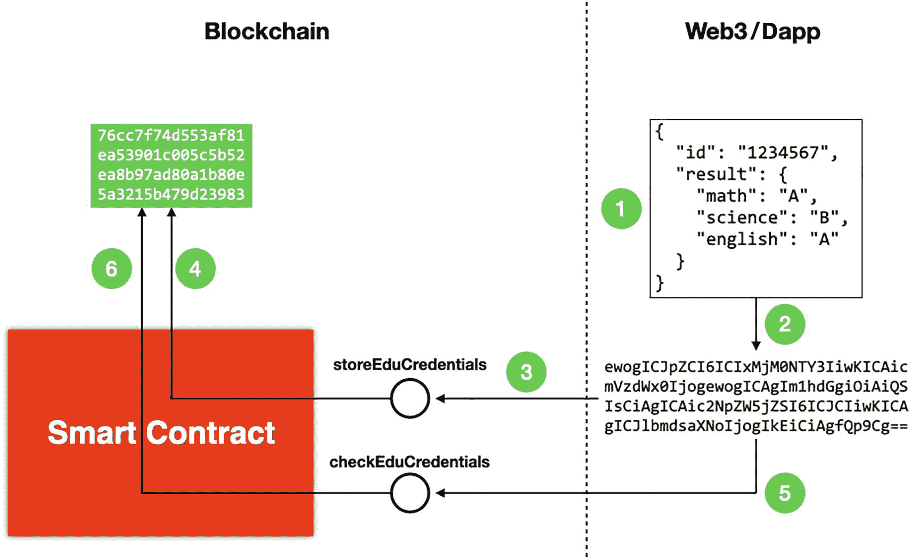

一个流程显示了来自 Web 3 去中心化应用的输入数据。它发送代码来存储和检查教育证书，并通过智能合约显示区块链代码。

**图 7-2**  
智能合约如何与用户交互

1.  学生的考试成绩表示为 JSON 字符串。
2.  该 JSON 字符串使用 base64 编码进行编码。
3.  base64 编码的字符串被传入智能合约的 `storeEduCredentials()` 函数。
4.  `storeEduCredentials()` 函数对 base64 编码的字符串进行哈希，然后将哈希值与（包含该交易的）区块编号一起存储到区块链上。
5.  为了检查教育证书的真实性，将学生成绩的 base64 编码字符串传入 `checkEduCredentials()` 函数。
6.  `checkEduCredentials()` 函数对 base64 编码的字符串进行哈希，然后检查该哈希值是否已存在于区块链上。返回包含该哈希值的区块编号。如果未找到该哈希值，则返回值 0。

**提示**  
dapp（去中心化应用）是一种与后端智能合约通信的应用（例如网页应用或移动应用）。下一章将更详细地讨论 dapp。

图 7-3 展示了智能合约如何将考试成绩的哈希值存储到区块链上。状态变量是一个包含键/值对的 *mapping* 对象。键是哈希值，值是这些哈希值写入区块链时的区块编号。

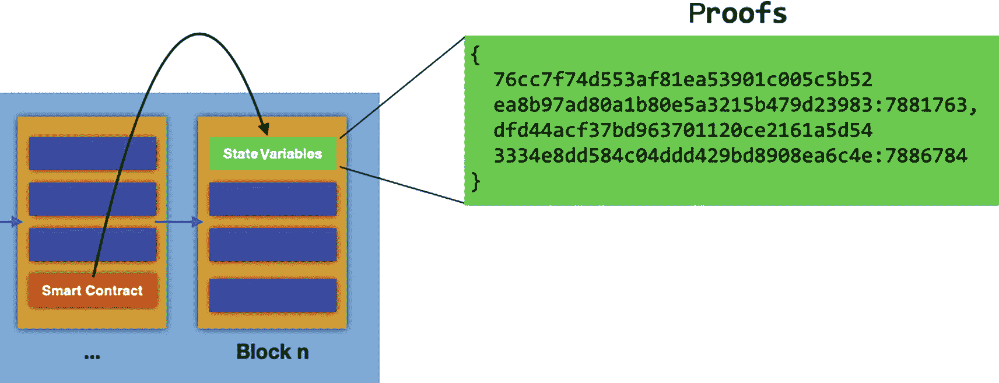

两堆标记为“区块 n”的条状图。第一堆上的智能合约层映射到第二堆中的状态变量。它进一步显示了一组代码，标题为“proofs”。

**图 7-3**  
mapping 对象如何记录哈希值和区块编号


### 编译合约

智能合约编写完成后，接下来需要对其进行编译。在 Remix IDE 中，点击**编译器**选项卡（见图 7-4，步骤 1），然后勾选**自动编译**。这样设置后，每次修改代码时，Remix IDE 都会自动编译你的代码。

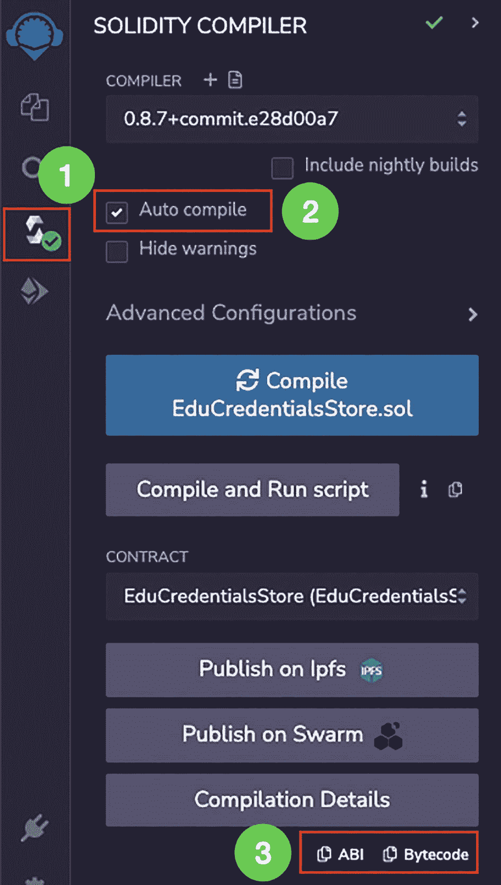

一张 solidity 编译器界面的截图，显示了编译图标、自动编译、ABI 和字节码等选项。

**图 7-4** 在 Remix IDE 中启用自动编译

在底部，你会看到两个选项：**ABI** 和 **字节码**。点击 **ABI** 会将应用程序二进制接口（ABI）复制到剪贴板。将其粘贴到文本编辑器中，内容如下：

```
[
{
"inputs": [
{
"internalType": "string",
"name": "document",
"type": "string"
}
],
"name": "checkEduCredentials",
"outputs": [
{
"internalType": "uint256",
"name": "",
"type": "uint256"
}
],
"stateMutability": "view",
"type": "function"
},
{
"inputs": [
{
"internalType": "string",
"name": "document",
"type": "string"
}
],
"name": "storeEduCredentials",
"outputs": [],
"stateMutability": "nonpayable",
"type": "function"
}
]
```

如果你去掉 ABI 的格式并将其存储为单行，你将看到以下内容：

```
[    {      "inputs": [        {          "internalType": "string",          "name": "document",          "type": "string"        }      ],      "name": "checkEduCredentials",      "outputs": [        {          "internalType": "uint256",          "name": "",          "type": "uint256"        }      ],      "stateMutability": "view",      "type": "function"    },    {      "inputs": [        {          "internalType": "string",          "name": "document",          "type": "string"        }      ],      "name": "storeEduCredentials",      "outputs": [],      "stateMutability": "nonpayable",      "type": "function"    }  ]
```

### 部署合约

现在准备将智能合约部署到 Goerli 测试网。在 Remix IDE 中，点击**部署**图标（见图 7-5，步骤 1）。确保环境选择为 **注入提供者 – Metamask**（步骤 2）。选择 MetaMask 意味着合约将部署到 MetaMask 当前连接的网络（请确保 MetaMask 已连接到 Goerli 测试网）。最后，点击**部署**按钮（步骤 3）。

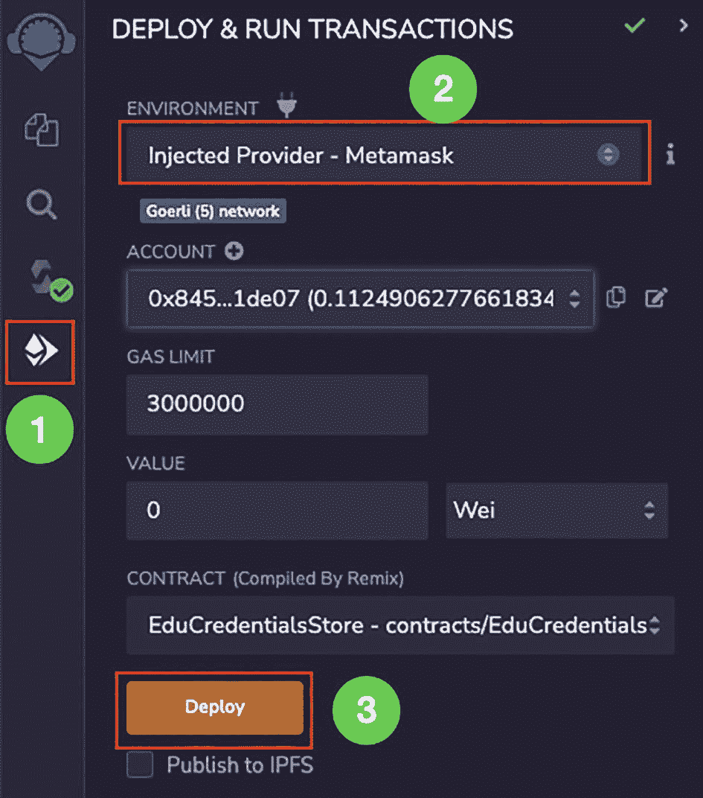

一张“部署和运行交易”界面的截图，显示了部署图标、注入提供者-MetaMask 和部署等选项。

**图 7-5** 在 Remix IDE 中部署合约

MetaMask 会提示你支付交易费用。点击**确认**，稍等片刻等待交易确认。

## 测试合约

智能合约部署完成后，你会在 Remix IDE 的**已部署合约**部分看到该合约。你还会看到合约地址显示在合约名称旁边。

> **注意**  
> 要在区块链上调用智能合约，你的去中心化应用（dapp）需要合约地址及其 ABI。

现在，我们尝试将一个代表学生成绩的 base64 编码 JSON 字符串的哈希值存储到区块链上。将 base64 编码的字符串粘贴到文本框中后，点击 `storeEduCredentials` 按钮（见图 7-6）。

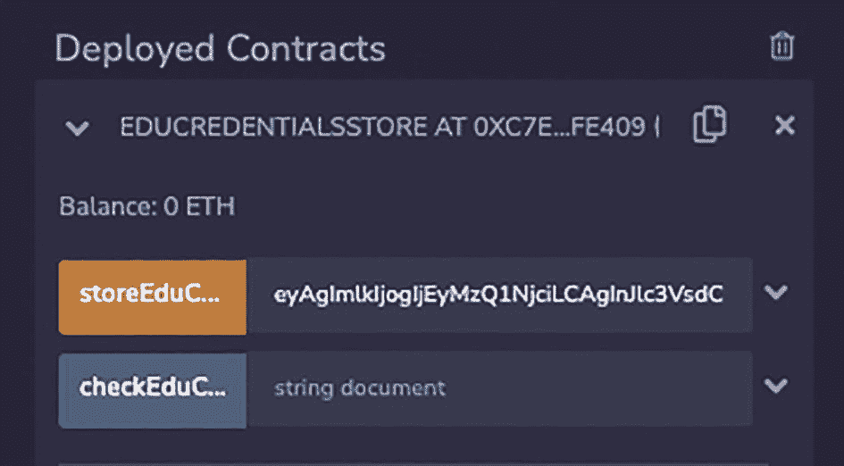

一张已部署合约的截图，列出了 store Edu credentials 和 check Edu credentials 选项。

**图 7-6** 在 Remix IDE 中查看已部署的合约

> **提示**  
> 还记得我之前提到过，在计算 JSON 字符串哈希值之前需要对其进行 base64 编码吗？如果直接将 JSON 字符串复制粘贴到 `storeEduCredentials` 按钮旁边的文本框中，会出现问题，因为 JSON 中的键和字符串值使用双引号，而整个 JSON 字符串在传递给智能合约函数之前也需要用双引号括起来。为了解决这个问题，一个更简单的方法是对你的 JSON 字符串进行 base64 编码，然后将 base64 编码后的结果传递给函数。

MetaMask 会提示你支付交易费用。点击**确认**（见图 7-7）。

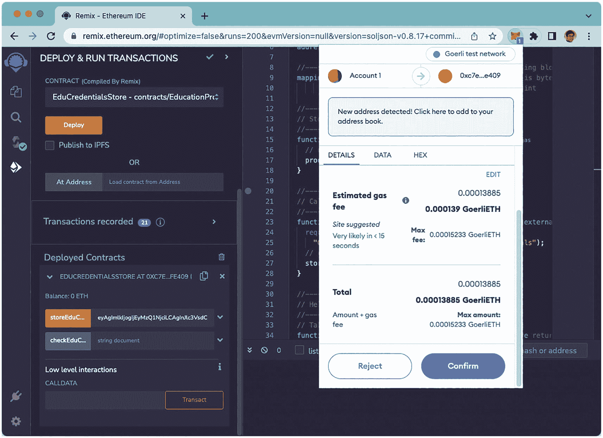

一张 Remix-Ethereum 页面的截图，其上叠加了 Goerli 测试网络界面。界面显示了预估 gas 费用以及从账户 1 交易的详细信息。

**图 7-7** 使用 MetaMask 支付交易费用

稍等片刻，交易将被确认。现在，你可以将相同的 base64 编码字符串粘贴到 `checkEduCredentials` 按钮旁边的文本框中（见图 7-8）。点击 `checkEduCredentials` 按钮将显示该 base64 编码字符串的哈希值存储在区块链上的区块编号（本例中为 7881763）。如果看到结果为 0，则表示区块链上未找到该哈希值。

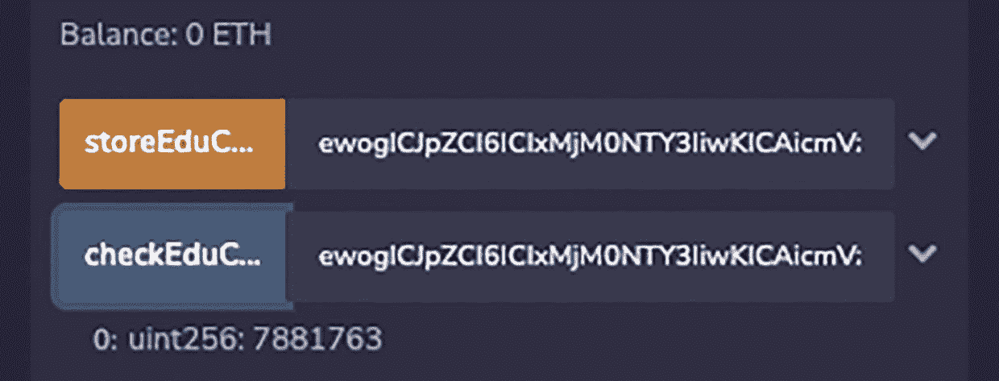

一张余额为 0 ETH 的截图，列出了 store Edu credentials 和 check Edu credentials 选项。

**图 7-8** 验证教育凭证先前已存储在区块链上

> **提示**  
> 按钮颜色有什么区别？橙色按钮表示你需要支付交易费用（因为你在修改区块链状态），而蓝色按钮则表示无需付费（你只是在从区块链读取数据）。

## 对智能合约进行进一步修改

你的基础教育凭证智能合约现已上线运行。用户现在能够将教育凭证存储到区块链上，并用于验证学历资格。然而，合约仍有若干可以改进之处。在接下来的章节中，你将学习以下内容：

- 如何限制对智能合约中特定函数的访问权限
- 如何在智能合约中接收付款
- 如何在智能合约中触发事件
- 如何将智能合约中的资金转移到另一个账户
- 如何销毁一个智能合约，使其不再可用


### 限制函数访问权限

显然，并非所有人都应被允许将学生的教育凭证存储在区块链上。实际上，只有教育机构（通常是部署智能合约的机构）才应被允许这样做。你可以对智能合约进行一些修改，以确保只有合约所有者（即部署合约的人）才能调用 `storeEduCredentials()` 函数。

首先，在合约中添加以下加粗的语句：

```
contract EduCredentialsStore {
// 存储合约所有者
address owner = msg.sender;
```

`owner` 变量会自动存储部署合约的账户地址（`msg.sender`）。然后，在 `storeEduCredentials()` 函数中添加 `require()` 函数，如下所示：

```
function storeEduCredentials(string calldata document) external {
require(msg.sender == owner,
"只有合约所有者才能存储凭证");
// 使用字符串的哈希值调用 storeProof()
storeProof(proofFor(document));
}
```

`require()` 函数首先会检查调用该函数的任何地址（`msg.sender`）是否为 `owner`，如果不是，则返回错误信息（`"只有合约所有者才能存储凭证"`）。如果条件满足，将继续执行；否则，执行将停止。

在 Remix IDE 中，你可以通过首先使用账户 1 部署合约来尝试上述修改。合约部署后，在 MetaMask 中切换到另一个账户，并尝试调用 `storeEduCredentials()` 函数。你将会看到一个错误，如图 7-9 所示。

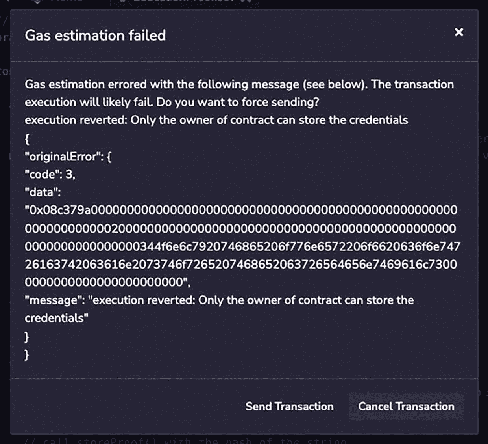

一张显示 Gas 估算失败消息的屏幕截图，其中包含一组代码。

**图 7-9** Remix IDE 拒绝函数调用

**注意**

请注意，智能合约不可更改。一旦部署，你将无法对其进行任何修改。因此，当你重新部署合约时，区块链上存储的是一个新合约；你将无法在新合约中访问旧合约的任何状态变量。

### 在智能合约中接受付款

既然你已经编写了一个允许将教育凭证写入区块链的智能合约，你可能想了解如何从这样的合约中获得经济收益。每当有人需要验证潜在雇员的教育凭证时，收取一些以太币怎么样？嗯，这很简单。

在 `checkEduCredentials()` 函数中添加 `payable` 关键字，并删除 `view` 关键字：

```
function checkEduCredentials(string calldata document) public payable returns (uint) {
require(msg.value == 1000 wei,
"此调用需要 1000 wei");
// 使用字符串的哈希值并检查 proofs 映射对象
return proofs[proofFor(document)];
}
```

同时，添加 `require()` 函数以指明调用者必须发送 1000 Wei（通过 `msg.value` 表示）。

**提示**

1 以太币等于 1,000,000,000,000,000,000 Wei（18 个零）。Wei 是以太币的最小面额。

表 7-1 展示了以太坊中的各种面额。例如，1 以太币等于 1,000,000,000,000,000,000 Wei（18 个零），1 以太币等于 0.001 Kether。

**表 7-1** 以太币的各种面额

| 单位 | 价值（以太币） |
| --- | --- |
| Wei | 1,000,000,000,000,000,000（18 个零） |
| Kwei | 1,000,000,000,000,000（15 个零） |
| Mwei | 1,000,000,000,000（12 个零） |
| Gwei | 1,000,000,000（9 个零） |
| Szabo | 1,000,000（6 个零） |
| Finney | 1,000（3 个零） |
| Ether | 1 |
| Kether | 0.001（3 位小数） |
| Mether | 0.000001（6 位小数） |
| Gether | 0.000000001（9 位小数） |
| Tether | 0.000000000001（12 位小数） |

**提示**

以太币的一些面额是以加密世界中的知名人物命名的。例如，`Finney` 以*哈尔·芬尼*命名，他是比特币的早期贡献者，并收到了比特币创造者中本聪的第一笔比特币交易。`Szabo` 以*尼克·萨博*命名，他首次提出了智能合约的概念。`Wei` 以*戴伟*命名，他是一位密码学家，提出了“b-money”，这是比特币论文第 2 节中引用的一个概念。

#### 在 Solidity 中指定以太币单位

在 Solidity 中，变量 `msg.value` 始终以 Wei 表示。在上述语句中，你也可以将比较重写为：

```
msg.value == 1000
```

然而，Solidity 允许你使用上面使用的特殊语法来比较以太币单位：

```
msg.value == 1000 wei
```

当你比较大额以太币时，这种语法很有用。例如，如果你想检查传入的金额是否为 1 以太币，你可以这样做：

```
msg.value == 1000000000000000000
// 或者
msg.value == 1e18
```

但使用更简单的语法，你只需这样做：

```
msg.value == 1 ether
```

从 Solidity 0.7 版本开始，你可以对以下单位执行此操作：`Gwei`、`Ether` 和 `Wei`。

当你部署此合约时，观察 `checkEduCredentials` 按钮现在变为红色（见图 7-10）。这是由于 `checkEduCredentials()` 函数中的 `payable` 关键字所致。

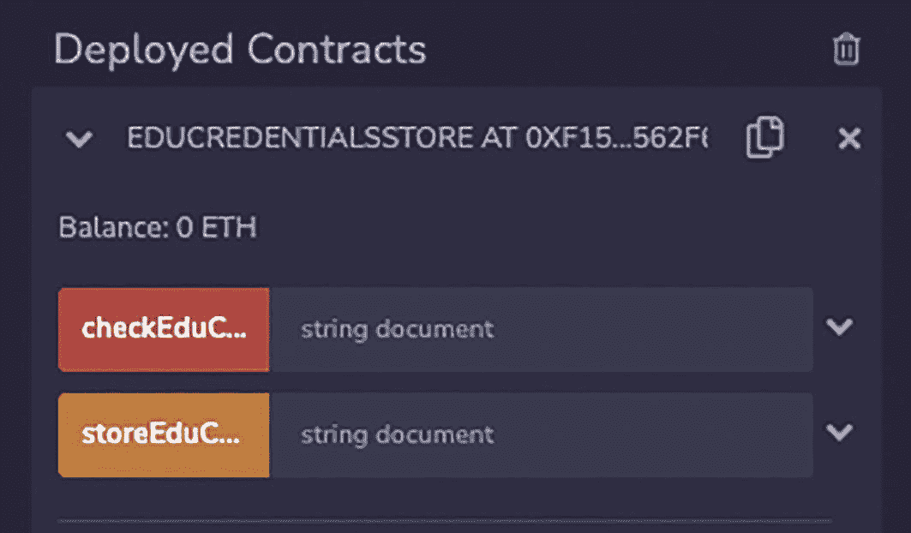

一张已部署合约的屏幕截图，列出了检查和存储教育凭证的功能。

**图 7-10** `checkEduCredentials` 按钮现在变为红色

**提示**

如果函数按钮是红色的，表示除了支付交易费用外，它可能还要求你向其发送以太币。

与之前一样，继续将 base64 编码的字符串粘贴到 `checkEduCredentials` 按钮旁边的文本框中，然后点击 `storeEduCredentials` 按钮。当你点击 `checkEduCredential` 按钮时，你将看到如图 7-11 所示的错误信息。

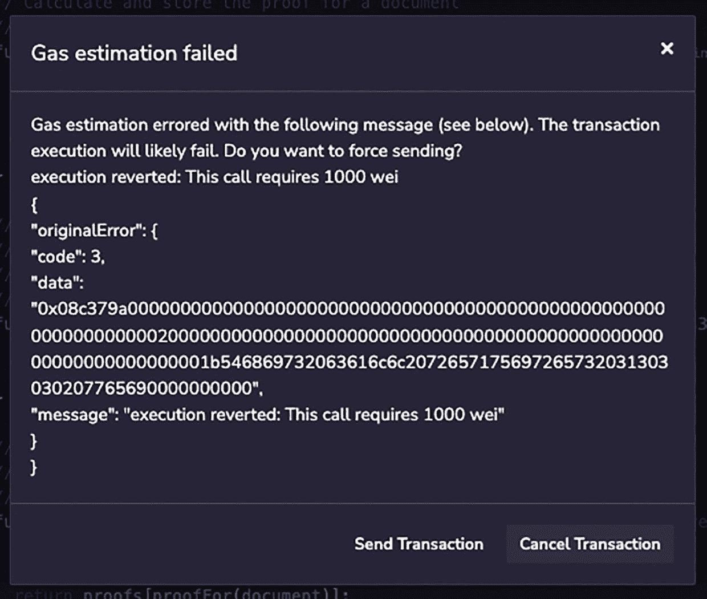

一张显示 Gas 估算失败消息的屏幕截图，其中包含一组代码。底部有发送和取消交易按钮。

**图 7-11** Remix 拒绝交易，因为该函数期望向其发送以太币

显然，这是因为你没有向合约发送 1000 Wei。要在 Remix IDE 中解决这个问题，请在点击 `checkEduCredential` 按钮之前指定 1000 Wei，如图 7-12 所示。

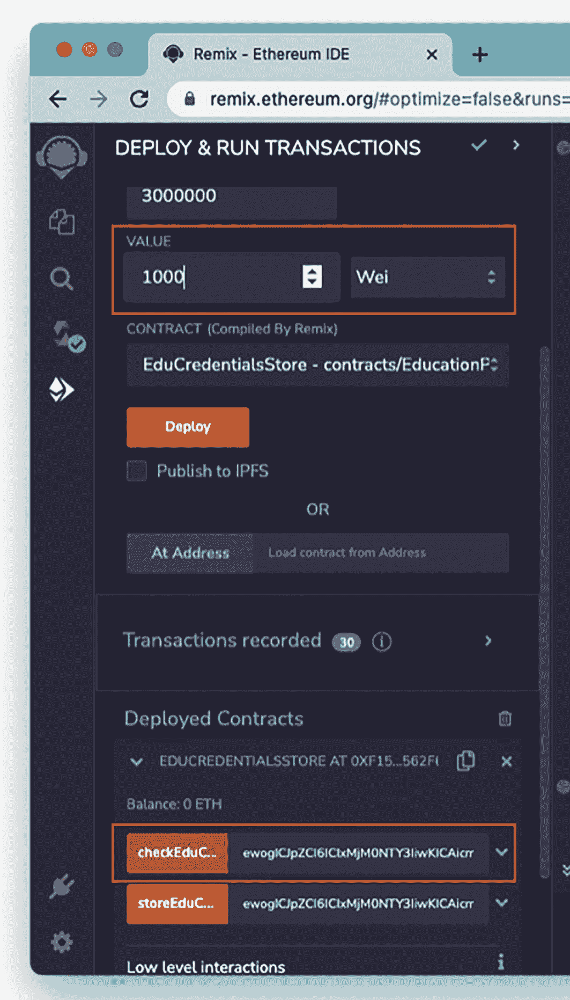

一张 Remix-Ethereum IDE 页面的屏幕截图。其中显示了部署和运行交易列表，并高亮显示了数值和检查教育凭证的选项卡。

**图 7-12** 向合约发送 1000 Wei

当交易被确认后，你可以前往 Etherscan 查看合约的余额。例如，我的合约地址是 `0xf15e70a24a50ef1b2c3bed0d3b033e35233562f6`。因此，我的合约在 Etherscan（针对 Goerli 测试网）上的详情页面是：[`https://goerli.etherscan.io/address/0xf15e70a24a50ef1b2c3bed0d3b033e35233562f6`](https://goerli.etherscan.io/address/0xf15e70a24a50ef1b2c3bed0d3b033e35233562f6)。

**注意**

Etherscan 是一个区块链浏览器，允许你查看以太坊区块链（包括各种测试网）上发生的所有详细交易信息。

图 7-13 显示该合约的余额为 0.000000000000001 以太币（即 1000 Wei）。这证明了智能合约可以持有以太币。

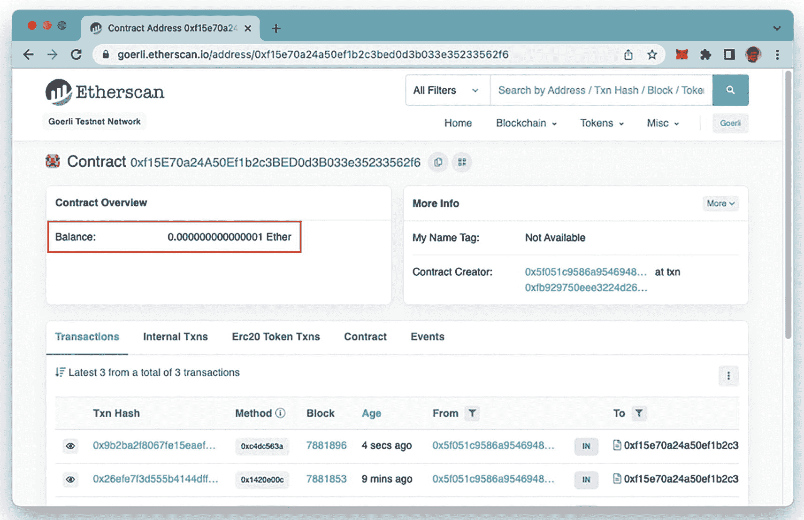

一张 Goerli Etherscan 页面的屏幕截图。合约概览下的余额被高亮显示。

**图 7-13** 智能合约也可以持有以太币


### 智能合约中的事件

回顾一下，`checkEduCredential()` 函数会返回 base64 编码字符串的哈希值存储在区块链上的区块编号。在上一节中，你修改了该函数使其能够接收付款。如果你尝试了该智能合约，你会注意到，在向合约发送 1000 Wei 后，`checkEduCredential()` 函数不再返回任何值。这是因为该函数现在正在执行一笔交易，因此无法立即向你返回结果（它需要等待区块被添加到区块链中）。那么如何解决这个问题呢？你可以使用*事件*来解决。

在 Solidity 中，函数可以直接返回结果给调用者，也可以通过事件来返回。智能合约通常使用事件来让前端应用程序了解合约的当前状态。

让我们使用以下语句为你的合约定义一个事件：

```
// SPDX-License-Identifier: MIT
pragma solidity ⁰.8;
contract EduCredentialsStore {
// 存储合约的所有者
address owner = msg.sender;
//---存储字符串的哈希值及其对应的区块编号---
// 键为 bytes32，值为 uint
mapping (bytes32 => uint) private proofs;
//---定义一个事件---
event Result(
address from,
string document,
uint blockNumber
);
```

这些语句定义了一个名为 `Result` 的事件，它包含三个参数：`from`、`hash` 和 `blockNumber`。使用 `emit` 关键字来触发此事件。你将在 `checkEduCredentials()` 函数中触发此事件：

```
//-----------------------------------------------
// 检查一个文档是否之前已保存
//-----------------------------------------------
function checkEduCredentials(string calldata document) public payable {
require(msg.value == 1000 wei ,
"此调用需要 1000 wei");
// 使用字符串的哈希值检查 proofs 映射对象，然后触发事件
emit Result(msg.sender,
document,
proofs[proofFor(document)]);
// return proofs[proofFor(document)];
}
```

**注意：** 现在无需从此函数返回值，因此请修改 `checkEduCredentials()` 函数的签名，并注释掉 `return` 语句。

要尝试更新后的智能合约，请部署它，然后调用其 `checkEduCredentials()` 函数（记得向它发送 1000 Wei）。Remix IDE 将监听该事件，你可以在交易确认后看到它（见图 7-14）。

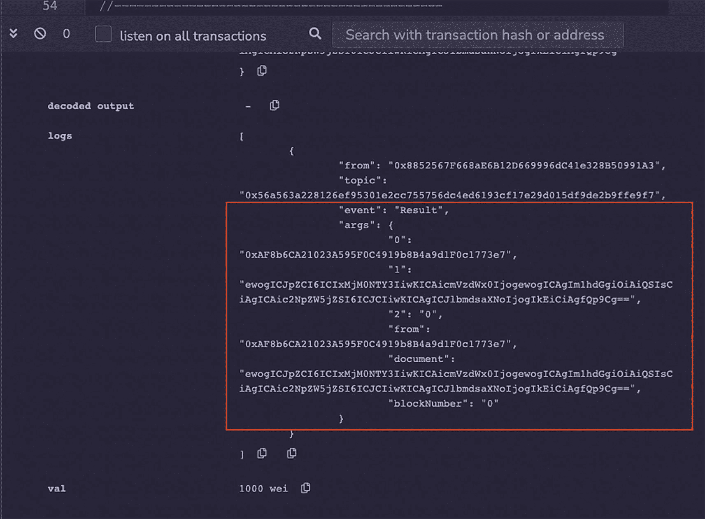

已解码输出和日志的截图。事件结果下面的一组代码被标出。

**图 7-14** 你可以使用 Remix IDE 检查智能合约触发的事件。

### 提取资金

现在你的智能合约持有以太币，但出现了一个问题。这些以太币永远被困在合约中，因为你没有做出任何将其转出的规定。要将以太币从合约中取出，主要有两种方式：

- 在 `checkEduCredentials()` 函数收到以太币的瞬间，立即将其转移到另一个账户。
- 添加另一个函数，将以太币转移到另一个账户（例如所有者）。

对于本例，你将使用第二种方法，向合约中添加一个 `cashOut()` 函数：

```
function cashOut() public {
require(msg.sender == owner,
"只有合约所有者才能提取资金！");
payable(owner).transfer(address(this).balance);
}
```

在 `cashOut()` 函数中，你首先需要确保只有所有者才能调用此函数。验证通过后，你使用 `transfer()` 函数将合约的全部余额转移给所有者。

再次部署合约，然后调用 `checkEduCredentials()` 函数，以便向合约发送 1000 Wei。然后，点击 Remix IDE 中的 **cashOut** 按钮，将以太币转回给所有者。在 Etherscan 上，你可以看到余额被转移给了合约的所有者（见图 7-15）。

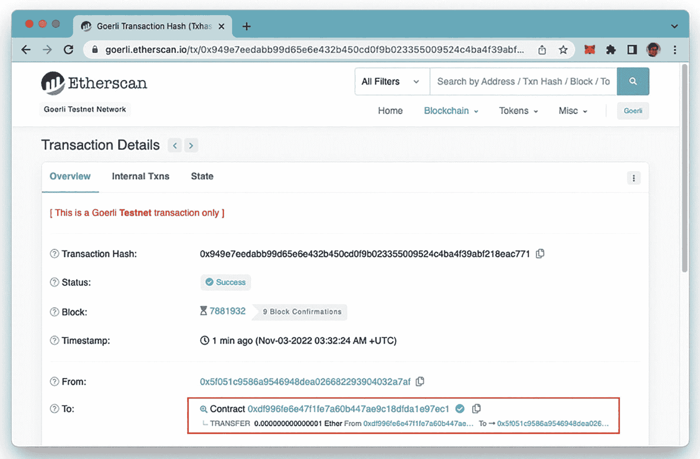

Goerli Etherscan 页面的截图。它显示了交易详情下的概览，其中“To”地址被高亮显示。

**图 7-15** Etherscan 记录将以太币内部转移到另一个账户的过程。

### 销毁合约

总会有那么一刻，你的智能合约的生命周期结束，需要被关闭。要禁用你的智能合约，使其不再可被调用，你可以使用 `selfdestruct()` 函数。

现在让我们向合约中添加一个 `kill()` 函数：

```
/* 自毁函数 */
function kill() public {
require(msg.sender == owner, "只有所有者才能销毁此合约");
selfdestruct(payable(owner));
}
```

像往常一样，你需要确保只有特定用户（通常是合约所有者）才能销毁合约。`selfdestruct()` 函数会将合约中存储的所有剩余以太币发送到一个指定的地址，在本例中即 `owner`。

> **提示：** `selfdestruct()` 函数是在 Solidity 0.5.0 中引入的，旨在为智能合约面临安全威胁时提供一个退出通道。

最后，部署合约并观察新的销毁按钮（见图 7-16）。

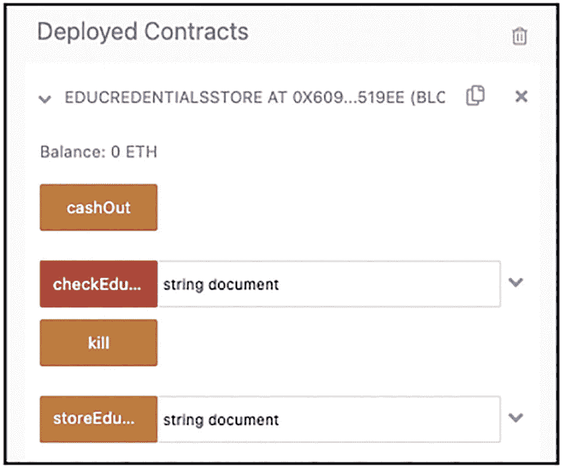

已部署合约界面的截图。它显示余额为 0 ETH，并包含以下按钮：cashout、check Edu credentials、kill 和 store Edu credentials。

**图 7-16** `kill()` 函数将合约从区块链中删除。

#### 调用 `selfdestruct()` 后会发生什么？

在智能合约上调用 `selfdestruct()` 函数后，它仍然可以接受交易，但不会执行任何处理，且交易状态始终为成功。例如，如果你现在调用 `storeEduCredentials()` 函数，它仍然可以被调用，并且你仍然需要支付 gas 费。但是，不会有任何数据被存储在区块链上。此外，你仍然可以向合约发送以太币，并且合约会持有这些发送来的以太币。然而，你将无法再从合约中取出这些以太币。

部署此合约后，请记录其部署的合约地址和 ABI。在下一章构建 Web3 dapp（智能合约的前端）时，你将用到这两条信息。

## 本章小结

在本章中，你学习了如何创建一个用于存储教育凭证证明的智能合约。你还学习了可以在 Solidity 智能合约中实现的一些技巧，例如接收付款以及销毁智能合约的能力。在下一章中，你将学习如何构建一个前端 Web3 dapp 来与智能合约进行交互。

---

