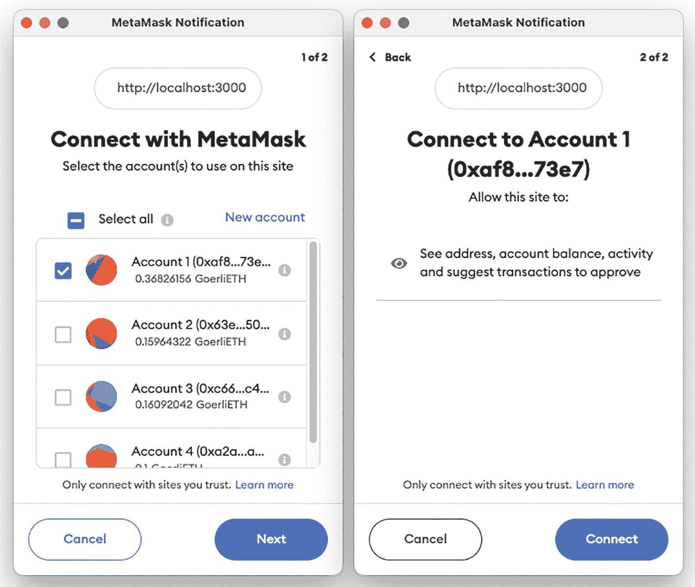
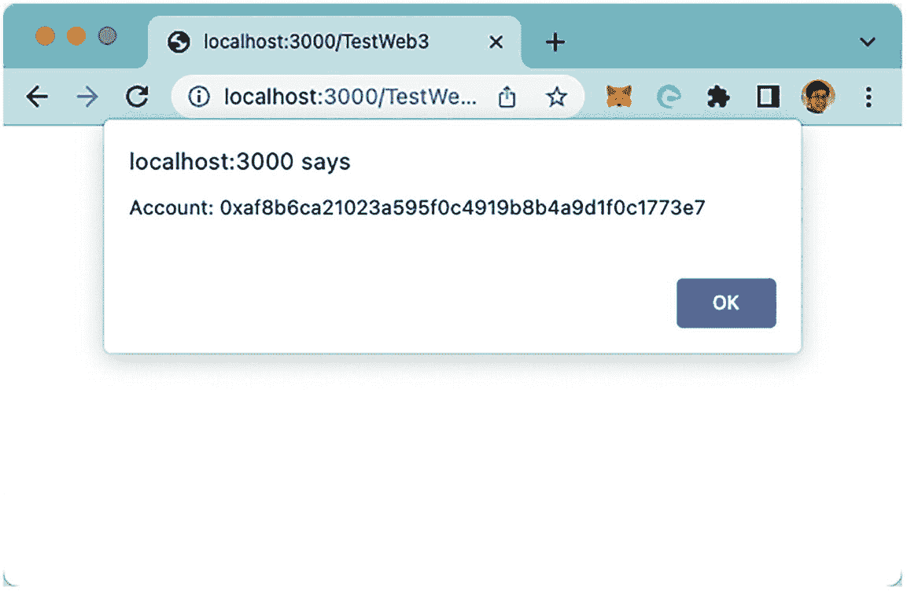
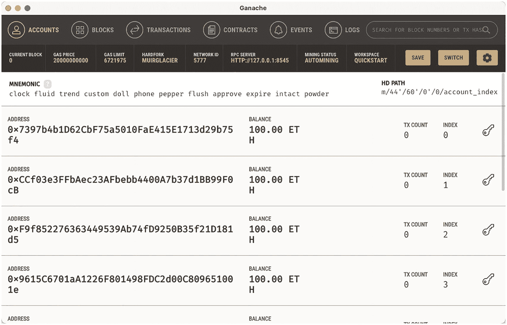
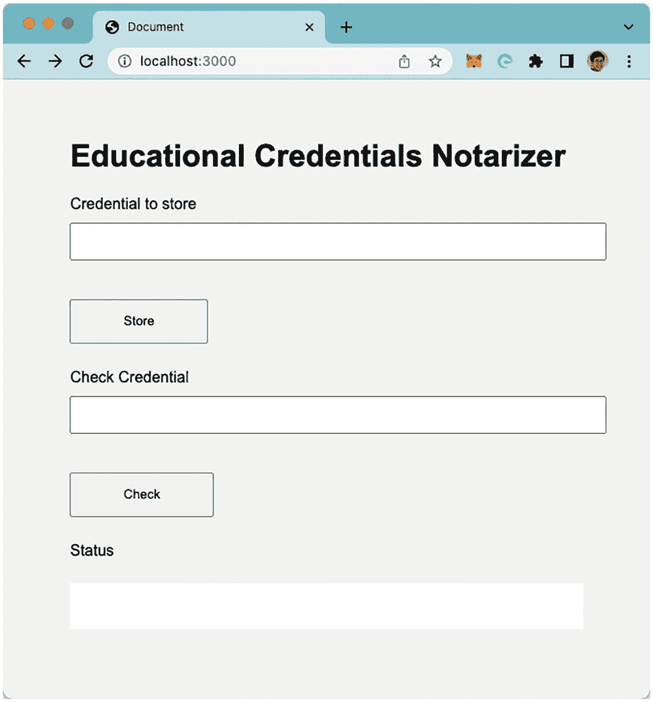
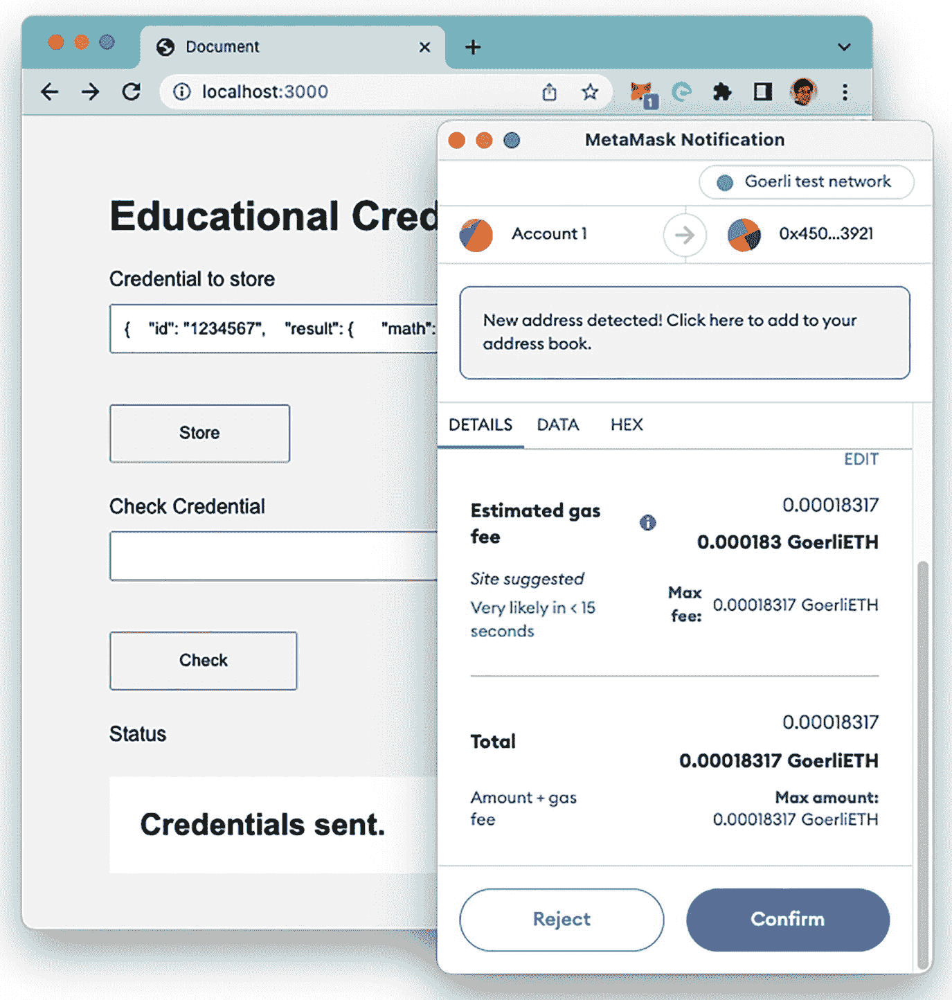
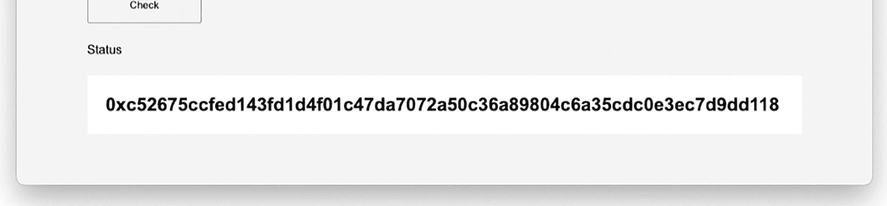
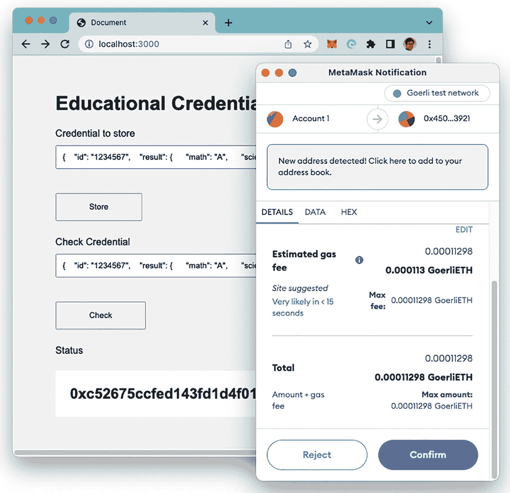
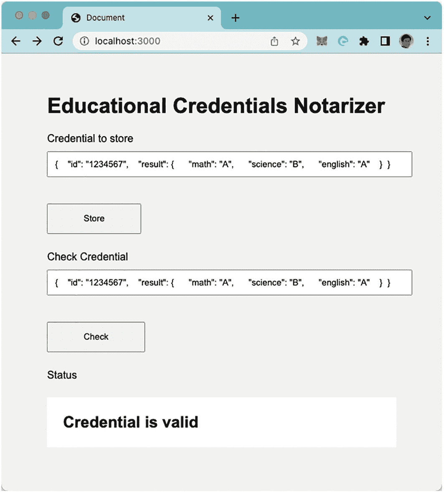

# 什么是 web3.js？

`web3.js` 是一个库的集合，它允许你通过 HTTP、WebSocket 或 IPC 与本地或远程的以太坊节点进行交互。通过 `web3.js` 的 API，你的前端就可以与智能合约进行交互。`web3.js` 的 API 包含以下模块：

- `web3-eth`：用于与以太坊区块链和智能合约交互
- `web3-shh`：用于 whisper 协议，实现 p2p 通信和广播
- `web3-bzz`：用于 swarm 协议，即去中心化文件存储
- `web3-utils`：包含对 dapp 开发者有用的辅助函数

在本书中，你只需要关注第一个模块 `web3-eth`。

## 安装 web3.js

安装 `web3.js` 需要 Node.js。具体来说，你将使用 `npm` 将 `web3.js` 的 API 下载到你的本地计算机。

> **提示**
> 安装 Node.js 最简单的方法是使用 `nvm`（Node 版本管理器）。要了解如何使用 `nvm` 安装 Node.js，请查阅我的文章 [https://bit.ly/3QqyEBR](https://bit.ly/3QqyEBR)。

在本章中，请创建一个名为 `web3projects` 的文件夹来存放 `web3.js` 的 API。在终端中，输入以下命令：

```
$ cd ~
$ mkdir web3projects
$ cd web3projects
```

在你下载 `web3.js` 的 API 之前，需要先创建一个空的 Node.js 项目：

```
$ npm init --yes
```

此命令会创建一个名为 `package.json` 的文件。该文件包含了 Node.js 应用程序所需的依赖项。要下载 `web3.js` 的 API，请输入以下命令：

```
$ npm install web3 --save
```

> **提示**
> 创建 `package.json` 文件可以防止 `npm`（Node 包管理器）在安装 `web3.js` 时显示整页的警告和错误信息。

`--save` 选项指示 `npm` 修改 `package.json` 文件，并将 `web3.js` 添加为应用程序的一个依赖项。

现在，`web3projects` 文件夹中应该有一个名为 `node_modules` 的文件夹。在这个 `node_modules` 文件夹中，你会看到几个子文件夹，它们共同构成了 `web3.js` 这套 API 库。

## 使用 MetaMask 测试 web3.js

下载好 `web3.js` 后，现在让我们测试它并了解其工作原理。创建一个名为 `TestWeb3.html` 的文本文件，并将其保存在 `web3projects` 文件夹中。文件内容如下：

```
async function loadWeb3() {
  //---如果您的网络浏览器上安装了 MetaMask---
  if (window.ethereum) {
    web3 = new Web3(window.ethereum);
    //---连接到账户---
    const account = await window.ethereum.request(
      {method: 'eth_requestAccounts'});
    console.log(account);
  } else {
    //---设置您想使用的 Web3.providers 提供者---
    web3 = new Web3(
      new Web3.providers.HttpProvider(
        "http://localhost:8545"));
  }
}
//---获取 MetaMask 中的当前账户---
async function getCurrentAccount() {
  const accounts = await web3.eth.getAccounts();
  console.log(accounts)
  return accounts[0];
}
async function load() {
  await loadWeb3();
  alert(await getCurrentAccount());
}
load();
```

在终端中，输入以下命令：

```
$ npm install -g serve
```

> **提示**
> 使用 `-g` 选项全局安装 `serve` 应用程序可能需要 `sudo` 权限。或者，你也可以在当前目录下本地安装，不使用 `-g` 选项。

此命令会在本地计算机上安装一个 Web 服务器。在任何目录下输入 `serve` 命令，都会使该目录通过这个 Web 服务器提供内容服务。

在 `web3projects` 文件夹中，输入以下命令：

```
$ cd ~/web3projects
$ serve
```

使用 Chrome 浏览器（需安装 MetaMask），加载以下 URL：`http://localhost:3000/TestWeb3.html`。

你会看到如图 8-1 所示的警告框。选择你想要在 MetaMask 中连接的账户，点击**下一步**，然后点击**连接**。



*图 8-1：你需要向页面授权，允许其访问你的 MetaMask 账户*

现在，你应该会看到警告框显示已连接到你的网页的账户地址，如图 8-2 所示。



*图 8-2：连接到 MetaMask 的网页*

让我们了解这是如何工作的。在你的 JavaScript 代码中，首先定义了一个名为 `loadWeb3` 的函数：

```
async function loadWeb3() {
  //---如果您的网络浏览器上安装了 MetaMask---
  if (window.ethereum) {
    web3 = new Web3(window.ethereum);
    //---连接到账户---
    const account = await window.ethereum.request(
      {method: 'eth_requestAccounts'});
    console.log(account);
  } else {
    //---设置您想使用的 Web3.providers 提供者---
    web3 = new Web3(
      new Web3.providers.HttpProvider(
        "http://localhost:8545"));
  }
}
```

如果你通过 HTTP 在安装了 MetaMask 的浏览器上加载此页面，MetaMask 会自动通过 `window.ethereum` 注入一个 API。这个 `window.ethereum` 允许你与以太坊节点交互。在这种情况下，它会连接到 Chrome 浏览器上的 MetaMask 扩展程序。你使用 `window.ethereum` 创建一个 `Web3` 对象的实例，这允许你连接到 MetaMask 中的用户账户、连接区块链上的智能合约等等。

如果浏览器中没有检测到 MetaMask（由于缺少 `window.ethereum`），你可以连接到自己的节点。在这个例子中，你连接到一个监听 8545 端口的本地节点（`http://localhost:8545`）。你可以运行自己的本地节点，例如 Ganache（见图 8-3）。



*图 8-3：Ganache 允许你在本地计算机上模拟一个以太坊区块链*

> **注意**
> Ganache 是一个模拟的以太坊区块链，你可以用它来部署合约、开发应用程序和运行测试。它是用于以太坊开发的 Truffle Suite 工具集的一部分。你可以从 [https://trufflesuite.com/ganache/](https://trufflesuite.com/ganache/) 下载 Ganache。

接下来定义的函数是 `getCurrentAccount()` 函数：

```
//---获取 MetaMask 中的当前账户---
async function getCurrentAccount() {
  const accounts = await web3.eth.getAccounts();
  console.log(accounts)
  return accounts[0];
}
```

在这个函数中，你从连接的节点（无论是 MetaMask 还是像 Ganache 这样的节点）获取所有账户，并返回第一个账户。

最后，定义 `load()` 函数，以便你异步地调用 `loadWeb3()` 和 `getCurrentAccount()` 函数：

```
async function load() {
  await loadWeb3();
  alert(await getCurrentAccount());
}
//---调用 load 函数连接到节点并显示第一个账户---
load();
```

### 使用 `web3.js` 与合约交互

`web3.js` API 最常见的用途是构建前端，让用户能够直接与你的智能合约交互。在本节中，你将学习如何使用 `web3.js` 与刚部署的合约交互。你将构建一个 Web 前端。

新建一个文本文件，命名为 `main.css`。在文件中填入以下内容：

```
body {
  background-color:#F0F0F0;
  padding: 2em;
  font-family: 'Raleway','Source Sans Pro', 'Arial';
}
.container {
  width: 90%;
  margin: 0 auto;
}
label {
  display:block;
  margin-bottom:10px;
}
input {
  padding:10px;
  width: 100%;
  margin-bottom: 1em;
}
button {
  margin: 2em 0;
  padding: 1em 4em;
  display:block;
}
#result {
  padding:1em;
  background-color:#fff;
  margin: 1em 0;
}
```

该文件将作为你即将构建的 Web 前端的 CSS（层叠样式表）。

新建一个文本文件，命名为 `index.html`（将其保存到 `web3projects` 文件夹中）。在文件中填入以下语句：

```
<!DOCTYPE html>
<html lang="en">
  <head>
    <meta charset="UTF-8">
    <meta name="viewport" content="width=device-width, initial-scale=1.0">
    <title>学历证书公证器</title>
    <link rel="stylesheet" href="main.css">
  </head>
  <body>
    <div class="container">
      <h1>学历证书公证器</h1>
      <div>
        <label for="document">要存储的凭证</label>
        <input type="text" id="document" placeholder="输入凭证">
        <button id="btnStore">存储</button>
      </div>
      <div>
        <label for="document2">检查凭证</label>
        <input type="text" id="document2" placeholder="输入凭证">
        <button id="btnCheck">检查</button>
      </div>
      <div id="result">状态</div>
    </div>
    <script src="https://cdn.jsdelivr.net/npm/web3@1.5.2/dist/web3.min.js"></script>
    <script src="https://code.jquery.com/jquery-3.6.0.min.js"></script>
    <script>
      async function loadWeb3() {
        //---如果您的网络浏览器中安装了 MetaMask---
        if (window.ethereum) {
          web3 = new Web3(window.ethereum);
          //---连接到账户---
          const account = await window.ethereum.request(
            {method: 'eth_requestAccounts'});
          console.log(account)
        } else {
          //---设置您想从 Web3.providers 使用的提供商---
          web3 = new Web3(
            new Web3.providers.HttpProvider(
              "http://localhost:8545"));
        }
      }
      //---加载智能合约---
      async function loadContract() {
        abi = [ { "anonymous": false, "inputs": [ { "indexed": false, "internalType": "address", "name": "from", "type": "address" }, { "indexed": false, "internalType": "string", "name": "document", "type": "string" }, { "indexed": false, "internalType": "uint256", "name": "blockNumber", "type": "uint256" } ], "name": "Result", "type": "event" }, { "inputs": [], "name": "cashOut", "outputs": [], "stateMutability": "nonpayable", "type": "function" }, { "inputs": [ { "internalType": "string", "name": "document", "type": "string" } ], "name": "checkEduCredentials", "outputs": [], "stateMutability": "payable", "type": "function" }, { "inputs": [], "name": "kill", "outputs": [], "stateMutability": "nonpayable", "type": "function" }, { "inputs": [ { "internalType": "string", "name": "document", "type": "string" } ], "name": "storeEduCredentials", "outputs": [], "stateMutability": "nonpayable", "type": "function" } ];
        address = '0x450FdF943afec4036787f4deDA11A34526c53921'
        return await new web3.eth.Contract(abi,address);
      }
      //---获取 MetaMask 中的当前账户---
      async function getCurrentAccount() {
        const accounts = await web3.eth.getAccounts();
        console.log(accounts)
        return accounts[0];
      }
      async function load() {
        await loadWeb3();
        //---加载合约---
        notarizer = await loadContract();
        //---获取账户---
        const account = await getCurrentAccount();
        //---处理智能合约触发的 Result 事件---
        notarizer.events.Result()
        .on('data', function(event){
          if (event.returnValues[0] == account) {
            console.log(event.returnValues[0]);  // 来源
            console.log(event.returnValues[1]);  // 文本
            console.log(event.returnValues[2]);  // 区块编号
            //---如果区块编号为 0，表示未找到凭证---
            if (event.returnValues[2] > 0) {
              $("#result").html("凭证有效");
            } else {
              $("#result").html("凭证无效");
            }
          }
        });
        //---将凭证存储到区块链上---
        $("#btnStore").click(async function() {
          notarizer.methods.storeEduCredentials($("#document").val())
          .send({from:account})
          .then(function (tx) {
            $("#result").html(tx.transactionHash);
          });
        });
        //---在区块链上检查凭证---
        $("#btnCheck").click(async function() {
          notarizer.methods.checkEduCredentials($("#document2").val())
          .send({from:account, value:1000});
        });
      }
      load();
    </script>
  </body>
</html>
```

在终端中，确保 `serve` 命令仍在运行（如果没有，请在 `web3projects` 文件夹中输入 `serve`）。在 Chrome 浏览器中加载以下 URL：`http://localhost:3000/index.html`。您应该会看到如图 8-4 所示的页面。



*图 8-4：与智能合约交互的 Web 前端*

在第一个文本框中输入一个字符串，例如 `{ "id": "1234567", "result": { "math": "A", "science": "B", "english": "A" } }`，然后点击`存储`按钮。您应该会看到 MetaMask 弹出的窗口（见图 8-5）。



*图 8-5：确认交易，将凭证发送给智能合约进行公证*

点击`确认`以确认交易。交易发送后，您会立即看到交易哈希显示在页面底部（见图 8-6）。



*图 8-6：交易哈希显示在页面底部*

一旦包含该交易的区块被挖出，您就可以在第二个文本框中输入相同的凭证，然后点击`检查`按钮，以验证该凭证之前是否已存储在区块链上（见图 8-7）。



*图 8-7：验证凭证之前是否已存储在区块链上*

如果该凭证之前已存储，您应该会在屏幕底部看到`凭证有效`（见图 8-8）。



*图 8-8：凭证验证结果显示在页面底部*

现在来看一下代码是如何工作的。

首先，定义 `loadContract()` 函数，以便加载上一章部署的智能合约。该函数使用合约的 ABI 和地址返回一个智能合约实例。

```javascript
//---加载智能合约---
async function loadContract() {
    abi = [ { "anonymous": false, "inputs": [ { "indexed": false, "internalType": "address", "name": "from", "type": "address" }, { "indexed": false, "internalType": "string", "name": "document", "type": "string" }, { "indexed": false, "internalType": "uint256", "name": "blockNumber", "type": "uint256" } ], "name": "Result", "type": "event" }, { "inputs": [], "name": "cashOut", "outputs": [], "stateMutability": "nonpayable", "type": "function" }, { "inputs": [ { "internalType": "string", "name": "document", "type": "string" } ], "name": "checkEduCredentials", "outputs": [], "stateMutability": "payable", "type": "function" }, { "inputs": [], "name": "kill", "outputs": [], "stateMutability": "nonpayable", "type": "function" }, { "inputs": [ { "internalType": "string", "name": "document", "type": "string" } ], "name": "storeEduCredentials", "outputs": [], "stateMutability": "nonpayable", "type": "function" } ];
    address = '0x450FdF943afec4036787f4deDA11A34526c53921'
    return await new web3.eth.Contract(abi,address);
}
```

**提示**

请将高亮的合约地址替换为你自己部署的合约地址。

在 `load()` 函数中，你调用了 `loadContract()` 函数，同时监听智能合约在返回凭证核验结果时将触发的事件：

```javascript
async function load() {
    await loadWeb3();
    //---加载合约---
    notarizer = await loadContract();
    //---获取账户---
    const account = await getCurrentAccount();
    //---处理智能合约触发的 Result 事件---
    notarizer.events.Result()
        .on('data', function(event){
            if (event.returnValues[0] == account) {
                console.log(event.returnValues[0]);  // from
                console.log(event.returnValues[1]);  // text
                console.log(event.returnValues[2]);  // blocknumber
                //---如果 blocknumber 为 0，表示
                // 未找到凭证---
                if (event.returnValues[2] > 0) {
                    $("#result").html("凭证有效");
                } else {
                    $("#result").html("凭证无效");
                }
            }
        });
...
```

加载智能合约后，现在你可以通过 `Store` 按钮调用合约的 `storeEduCredentials()` 函数：

```javascript
//---将凭证存储到区块链上---
$("#btnStore").click(async function() {
    notarizer.methods.storeEduCredentials($("#document").val())
        .send({from:account})
        .then(function (tx) {
            $("#result").html(tx.transactionHash);
        });
});
```

请注意，在 `storeEduCredentials()` 函数之后，你使用了 `send()` 函数。当你需要对智能合约执行交易时（例如，当智能合约改变状态变量时），会使用 `send()` 函数。交易执行后，你将交易哈希显示在网页上名为 `#result` 的标签中。

类似地，为了核验凭证，你调用 `checkEduCredentials()` 函数，传入要核验的凭证以及 1000 Wei 的价值：

```javascript
//---在区块链上核验凭证---
$("#btnCheck").click(async function() {
    notarizer.methods.checkEduCredentials($("#document2").val())
        .send({from:account, value:1000});
});
```

当事件将结果返回给你时，你将结果显示在标签中：

```javascript
//---处理智能合约触发的 Result 事件---
notarizer.events.Result()
    .on('data', function(event){
        if (event.returnValues[0] == account) {
            console.log(event.returnValues[0]);  // from
            console.log(event.returnValues[1]);  // text
            console.log(event.returnValues[2]);  // blocknumber
            //---如果 blocknumber 为 0，表示
            // 未找到凭证---
            if (event.returnValues[2] > 0) {
                $("#result").html("凭证有效");
            } else {
                $("#result").html("凭证无效");
            }
        }
    });
```

回想一下，所有需要对智能合约进行付费调用的函数（无论是合约要求的，还是由于合约修改状态变量所要求的）都是交易性的，因此在调用这些智能合约函数时你需要使用 `send()` 函数。如果你调用非交易性的函数会怎样？在这种情况下，你可以使用 `call()` 函数。

假设 `checkEduCredentials()` 函数不需要付费，并直接返回结果：

```javascript
// 在 EduCredentialsStore.sol 中
//-----------------------------------------------
// 检查文档之前是否已保存
//-----------------------------------------------
function checkEduCredentials(string calldata
    document) public view returns (uint){
    // 使用字符串的哈希值并检查
    // proofs 映射对象
    return proofs[proofFor(document)];
}
```

要使用 web3.js API 调用此函数，请使用 `call()` 函数，如下所示：

```javascript
notarizer.methods.checkEduCredentials($("#document2").val())
    .call(function(error, result) {
        if(!error) {
            console.log("结果是 " + result);
            if (result > 0) {
                $("#result").html("凭证有效");
            } else {
                $("#result").html("凭证无效");
            }
        } else
            console.error(error);
    });
```

## 总结

在本章中，你学习了如何使用`web3.js` `API`与智能合约进行交互。你学习了如何使用`web3.js` `API`构建Web前端，以及如何与不同类型的智能合约函数进行交互。在下一章中，你将学习如何使用`Python`与智能合约进行交互。