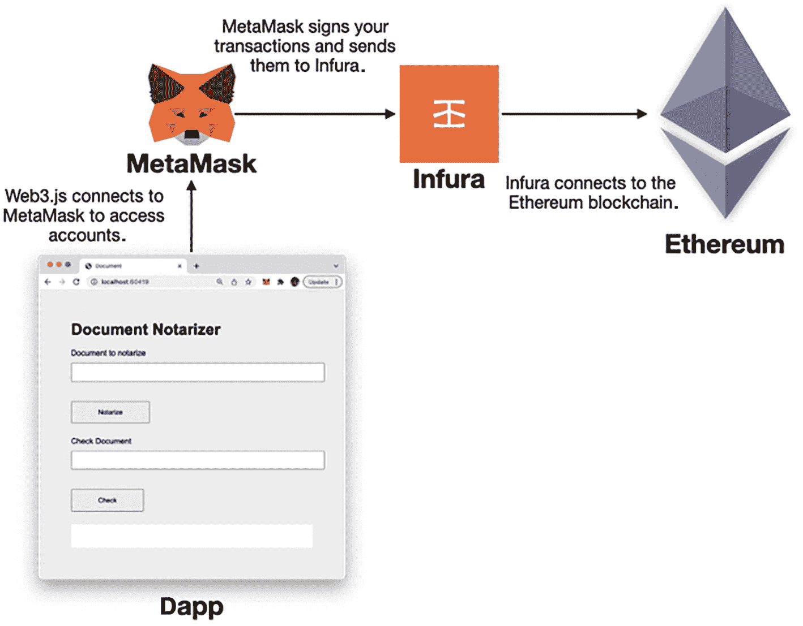
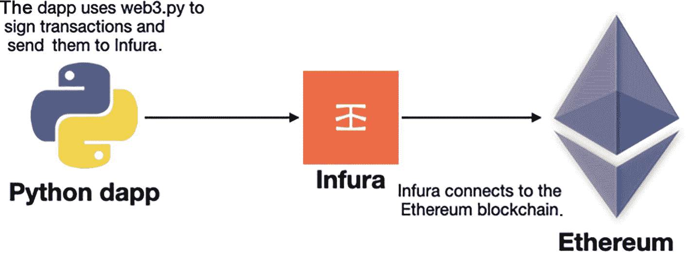

# 9. 使用 Python 开发 Web3 去中心化应用

在上一章中，你学习了如何使用 web3.js 库创建 Web3 去中心化应用（dapp）。当使用 Web 浏览器开发 dapp 时，你可以方便地将应用与 MetaMask 集成，后者持有你在以太坊区块链上的各种账户。当你需要执行交易时，你的 dapp 将依赖 MetaMask 来签署交易。在后台，MetaMask 连接到一个名为 **Infura** 的节点。

Infura 是一个连接到以太坊区块链的全节点。它为应用提供了一种便捷的方式连接到以太坊区块链，而无需开发者自己搭建节点，后者成本高昂且需要大量精力。图 9-1 展示了 dapp、MetaMask、Infura 和以太坊区块链之间的流程。



**图 9-1** – MetaMask 如何在后台连接到 Infura

但如果你正在创建的 dapp 不是基于 Web 的呢？那时你如何支付交易费用？这正是本章将要讨论的主题。

## 使用 Python 与以太坊交互

在本章中，我将讨论如何使用 Python 编写 Web3 dapp。对于 Python，你将使用 `web3.py` 库，该库允许你使用 Python 与以太坊区块链交互。

**提示**

`web3.py` 的灵感来源于 `web3.js`，因此你会发现许多函数与你在 `web3.js` 中看到的类似。

当你开发 Python dapp 时，你无法通过连接到 MetaMask 来访问你的账户并使用它来签署交易。相反，你需要导入自己的账户，签署自己的交易，然后自行将其连接到全节点（如 Infura），如图 9-2 所示。



**图 9-2** – 将你的基于 Python 的 dapp 连接到 Infura

在接下来的小节中，你将学习如何使用 `web.py` 库通过 Infura 连接到以太坊区块链。


### 注册 Infura

现在您已经了解了 Python 去中心化应用（dapp）的工作原理，请在 [`https://infura.io`](https://infura.io) 创建一个免费账户（参见图 9-3）。

一张 Infura 页面登录窗口的截图。它显示了邮箱和密码选项卡，以及一个注册按钮。

**图 9-3** – 在 Infura 注册免费账户

验证电子邮件后，您就可以登录 Infura。创建您的第一个项目（确保在“产品”下选择 **Ethereum**），并为您的项目命名（参见图 9-4）。

一张 Infura 页面创建第一个项目的截图。它显示了产品和项目名称选项卡，以及一个提交按钮。

**图 9-4** – 为项目命名

随后，您将获得项目 ID、项目密钥以及供应用程序连接的端点。就本文而言，请选择 Görli 作为端点（参见图 9-5）。

一张 Infura 页面的截图。它在端点选项卡下显示了网络端点的以太坊地址详情。GORLI 被突出显示。

**图 9-5** – 选择 Görli (Goerli) 作为端点

复制端点 URL：[`https://ropsten.infura.io/v3/<项目 ID>`](https://ropsten.infura.io/v3/%253cProject_ID%253e)

### 连接到 Infura

接下来的部分，您将使用 Jupyter Notebook。请创建一个新的 Jupyter Notebook。

**提示：** 如果您是 Jupyter Notebook 的新手，请查看这篇介绍文章：[`https://jupyter.org/try-jupyter/retro/notebooks/?path=notebooks/Intro.ipynb`](https://jupyter.org/try-jupyter/retro/notebooks/%253Fpath%253Dnotebooks/Intro.ipynb)

要安装 `web3.py`，请在 Jupyter Notebook 中输入以下命令：

```
!pip install web3
```

获取 Infura 端点 URL 后，尝试使用 `web3.py` 库进行连接：

```
from web3 import Web3
w3 = Web3(Web3.HTTPProvider(
'https:// goerli.infura.io/v3/'))
w3.isConnected()
```

**注意：** 请务必将 `<Project_ID>` 替换为您自己的 ID。

`Web3` 类返回一个 Web3 提供者（一个完整节点）的实例。`Web3.HTTPProvider` 类是一个便捷 API，用于访问 RPC HTTP 提供者（在本例中为 Infura）。

**提示：** RPC 代表远程过程调用。

如果输出显示为 `True`，则表示您已成功连接到 Infura。

### 获取区块

现在，使用 Web3 对象检查 Goerli 测试网中的最新区块编号：

```
w3.eth.get_block_number()
# 7978182
```

在撰写本文时，Goerli 测试网中的最新区块编号是 `7978182`。

您还可以从 Goerli 测试网络中获取最后一个区块：

```
w3.eth.get_block('latest')
```

您将看到类似如下的输出（一个交易哈希数组）：

```
AttributeDict({'baseFeePerGas': 86766563290,
'difficulty': 0,
'extraData': HexBytes('0x'),
'gasLimit': 30000000,
'gasUsed': 7186794,
'hash': HexBytes('0x6ab97e687ce253a6e4ada4c05166a47315e60447263e510bb1e5ad85b9eab8b4'),
'logsBloom': HexBytes('0x20040c00c000082402800018024000040000484020201012000000000002041004000040020112004009850000820000000001180000024000000289862400500051502004200c084800000808088000002000c0001682100110200040804040020410012200108020010381000108940c100050004112040000101180010080082400848020401000021000001009000020140028000081000800800020004002038000c00002100000287006100080240020000090000404400052108000200840d20a100228042e001c00180000002182000400408800408600000000602019102108024002000013002800000018000800084800c0120040000000000008'),
'miner': '0x4D496CcC28058B1D74B7a19541663E21154f9c84',
'mixHash': HexBytes('0x8710279fe41af813c450d778c81cff9401e429974249f98cd7fa02f9788f7c25'),
'nonce': HexBytes('0x0000000000000000'),
'number': 7969293,
'parentHash': HexBytes('0xe1de6d5fe21da88f730faef1c39c6fcf58d3899729218c6e8abf58b7163322ad'),
'receiptsRoot': HexBytes('0x4be7e89e6fe203768fa2899c7363944d913d7b915d75b382a5f871e7d4d39f0f'),
'sha3Uncles': HexBytes('0x1dcc4de8dec75d7aab85b567b6ccd41ad312451b948a7413f0a142fd40d49347'),
'size': 109385,
'stateRoot': HexBytes('0x78c30965c1020934b6a3cfe784b00a3fbf25106c79818a66fc21af676b608ca4'),
'timestamp': 1668684708,
'totalDifficulty': 10790000,
'transactions': [HexBytes('0x8fef9975fcc704e4a518370517d10563ea0a3d3edfa31b5c1bb71fa42fd0a91d'),
HexBytes('0x0a195f8876d642bbef524c4aa09df48c01471809df9614ea47a692e9f4832f7f'),
HexBytes('0x5fa6e3cb6230c97555391c85d449b6af60af1d4473cfb98a6cb194b97668110c'),
...  HexBytes('0xe60ae4a1b51cb89bd238499c471f1df6e34eaac64ab39b7c7a0258c3c5996bfa')],
'transactionsRoot': HexBytes('0x8e20604657f9bf48b2ed24ed38c27a6f507dda3e6d8b72e56e47754954398dcf'),
'uncles': []})
```

### 设置账户

现在，设置您的以太坊账户。您将使用在 MetaMask 中创建的两个账户。由于需要在 Python 程序中加载私钥，建议将私钥存储在环境文件中，以免在 Python 代码中暴露。为此，请安装 **`python-dotenv`** 模块：

```
!pip install python-dotenv
```

安装 `python-dotenv` 模块后，创建一个名为 `.env` 的文件，并将其保存在与 Jupyter notebook 相同的目录中。填入以下内容：

```
account1_private_key = '<账户 1_ 私钥>'
```

**注意：** 将 `<账户 1_ 私钥>` 替换为账户 1 的私钥。

要获取账户 1 的私钥，请转到 MetaMask 并按照图 9-6 中概述的步骤操作。

**图 9-6** – 获取账户 1 的私钥

**注意：** 在处理账户私钥时，请确保没有其他人能访问它们。

获取私钥后，您可以将其粘贴到 `.env` 文件中。

接下来，使用以下代码片段设置账户 1 和账户 2 的详细信息：

```
from dotenv import load_dotenv
import os
load_dotenv()
# 账户 1
account1_address = '0xa18A8E5c8242EF0DF08538C4870C638dD4667815'
account1_private_key = os.environ.get('account1_private_key')
# 账户 2
account2_address = '0x1cc025d9A1741b51FD5dE6003884dc264F149AdC'
```

稍后，您将仅使用账户 1 来签署交易，因此只需加载账户 1 的私钥。

**注意：** 请务必将 `0xa18A8E5c8242EF0DF08538C4870C638dD4667815` 和 `0x1cc025d9A1741b51FD5dE6003884dc264F149AdC` 分别替换为您自己的账户 1 和账户 2 的地址。

确保账户 1 和账户 2 在 Goerli 测试网络中已经拥有一些测试以太币。如果没有，请访问 [`https://goerlifaucet.com/`](https://goerlifaucet.com/) 获取一些测试以太币。

### 获取账户余额

设置账户后，您要做的第一件事就是检查账户 1 的余额：

```
w3.eth.get_balance(account1_address)
```

您将得到以 Wei 为单位的结果。假设您有 6.2468 ETH。您将得到以下输出（以 Wei 为单位）：

```
6246800000000000000
```


### 在账户之间转账以太币

现在，让我们从账户 1 向账户 2 转账 1 ETH。这是一个很好的机会，让您学习如何使用`web3.py`手动执行交易。具体步骤如下：

- 首先，使用`eth.get_transaction_count()`函数获取指定账户已发送的交易数量。该值将用作交易的*nonce*（交易序号）：

    ```
    nonce = w3.eth.get_transaction_count(account1_address)
    ```

- 然后，创建一个包含交易详情的数据字典：

    ```
    tx = {
    'nonce': nonce,                      # 交易序号
    'to': account2_address,              # 接收以太坊的地址
    'value': w3.toWei(1000, 'wei'),      # 转账金额
    'gasPrice': w3.eth.gas_price,        # 获取当前燃料价格
    }
    ```

在这段代码中，您正在从账户 1 向账户 2 转账 1000 Wei。您使用`eth.gas_price`属性来获取当前的燃料价格。

- 接下来，使用`eth.estimate_gas()`函数估算这笔交易所需的燃料量，然后将该数量插入到交易字典中：

    ```
    gas = w3.eth.estimate_gas(tx)
    tx['gas'] = gas
    print(tx)
    ```

    您应该会看到如下所示的交易详情：

    ```
    {
    'nonce': 4,
    'to': '0x1cc025d9A1741b51FD5dE6003884dc264F149AdC',
    'value': 1000,
    'gasPrice': 114287036513,
    'gas': 21000
    }
    ```

- 现在，您可以使用`eth.account.sign_transaction()`函数，用私钥对交易进行签名：

    ```
    signed_tx = w3.eth.account.sign_transaction(tx,account1_private_key)
    ```

- 要将交易发送至 Infura，请使用`eth.send_raw_transaction()`函数：

    ```
    tx_hash = w3.eth.send_raw_transaction(signed_tx.rawTransaction)
    print(w3.toHex(tx_hash))
    ```

    该函数将返回一个哈希值，如下所示：

    ```
    0xc23d15f14f20f51b083fe6dab8f953e76b80ce6a3b4c43bfe336d02576eba1da
    ```

- 交易需要一些时间才能确认。如果您想等待交易完成，请使用`eth.wait_for_transaction_receipt()`函数（这是一个阻塞调用）：

    ```
    receipt = w3.eth.wait_for_transaction_receipt(tx_hash)
    ```

- 最后，为了验证转账是否确实正确执行，检查账户 1 和账户 2 的余额：

    ```
    print(w3.eth.get_balance(account1_address))
    print(w3.eth.get_balance(account2_address))
    ```

从账户 1 向账户 2 转账 1 ETH 的完整代码片段如下所示：

```
nonce = w3.eth.get_transaction_count(account1_address)
tx = {
'nonce': nonce,
'to': account2_address,
'value': w3.toWei(1000, 'wei'),
'gasPrice': w3.eth.gas_price,
}
gas = w3.eth.estimate_gas(tx)
tx['gas'] = gas
signed_tx = w3.eth.account.sign_transaction(tx,account1_private_key)
tx_hash = w3.eth.send_raw_transaction(signed_tx.rawTransaction)
print(w3.toHex(tx_hash))
receipt = w3.eth.wait_for_transaction_receipt(tx_hash)
```

### 使用 Python 创建去中心化应用（Dapp）

使用 Python 对交易进行签名非常有用，但您使用`web3.py`库更重要的目标是与其智能合约进行交互。为此，您将使用 Python 与第 7 章中创建的智能合约进行交互。以下是完整的智能合约，供您参考：

```
// SPDX-License-Identifier: MIT
pragma solidity ⁰.8;
contract EduCredentialsStore {
// 存储合约所有者
address owner = msg.sender;
//---存储字符串的哈希值及其对应的区块号---
// 键是 bytes32 类型，值是 uint 类型
mapping (bytes32 => uint) private proofs;
//---定义一个事件---
event Result(
address from,
string document,
uint blockNumber
);
//--------------------------------------------------
// 在合约状态中存储存在性证明
//--------------------------------------------------
function storeProof(bytes32 proof) private {
// 使用哈希值作为键
proofs[proof] = block.number;
}
//----------------------------------------------
// 计算并存储文档的证明
//----------------------------------------------
function storeEduCredentials(string calldata
document) external {
require(msg.sender == owner,
"只有合约所有者才能存储凭证");
// 使用字符串的哈希值调用 storeProof()
storeProof(proofFor(document));
}
function cashOut() public {
require(msg.sender == owner,
"只有合约所有者才能提现！");
payable(owner).transfer(
address(this).balance);
}
//--------------------------------------------
// 获取文档 sha256 哈希值的辅助函数
//--------------------------------------------
// 输入一个字符串，返回该字符串的哈希值
function proofFor(string calldata document) private
pure returns (bytes32) {
// 将字符串转换为字节数组，然后对其哈希
return sha256(bytes(document));
}
//-----------------------------------------------
// 检查文档之前是否已被保存
//-----------------------------------------------
function checkEduCredentials(string calldata document) public payable {
require(msg.value == 1000 wei ,
"此调用需要 1000 wei");
// 使用字符串的哈希值，检查 proofs 映射对象，然后触发事件
emit Result(msg.sender,
document,
proofs[proofFor(document)]);
}
/* 自毁函数 */
function kill() public {
require(msg.sender == owner, "只有所有者才能销毁此合约");
selfdestruct(payable(owner));
}
}
```

> **提示：** 如果您不记得先前在 Goerli 测试网上部署的该合约地址，请再次部署一次，并记下其地址。

为了演示，我在 Goerli 测试网上的合约地址是`0xC1B4338a54bE22067260bbA1e0B6F3d5c1E2E330`。此外，您还需要获取合约的 ABI。为了方便您，现提供如下：

```
[  {   "inputs": [],   "name": "cashOut",   "outputs": [],   "stateMutability": "nonpayable",   "type": "function"  },  {   "inputs": [    {     "internalType": "string",     "name": "document",     "type": "string"    }   ],   "name": "checkEduCredentials",   "outputs": [],   "stateMutability": "payable",   "type": "function"  },  {   "inputs": [],   "name": "kill",   "outputs": [],   "stateMutability": "nonpayable",   "type": "function"  },  {   "anonymous": false,   "inputs": [    {     "indexed": false,     "internalType": "address",     "name": "from",     "type": "address"    },    {     "indexed": false,     "internalType": "string",     "name": "document",     "type": "string"    },    {     "indexed": false,     "internalType": "uint256",     "name": "blockNumber",     "type": "uint256"    }   ],   "name": "Result",   "type": "event"  },  {   "inputs": [    {     "internalType": "string",     "name": "document",     "type": "string"    }   ],   "name": "storeEduCredentials",   "outputs": [],   "stateMutability": "nonpayable",   "type": "function"  } ]
```


### 加载合约

合约部署完成后，我们通过向 `eth.contract()` 函数传入合约地址和 ABI，创建一个对它的引用：

```
address = '0xC1B4338a54bE22067260bbA1e0B6F3d5c1E2E330'
abi = '[  {   "inputs": [],   "name": "cashOut",   "outputs": [],   "stateMutability": "nonpayable",   "type": "function"  },  {   "inputs": [    {     "internalType": "string",     "name": "document",     "type": "string"    }   ],   "name": "checkEduCredentials",   "outputs": [],   "stateMutability": "payable",   "type": "function"  },  {   "inputs": [],   "name": "kill",   "outputs": [],   "stateMutability": "nonpayable",   "type": "function"  },  {   "anonymous": false,   "inputs": [    {     "indexed": false,     "internalType": "address",     "name": "from",     "type": "address"    },    {     "indexed": false,     "internalType": "string",     "name": "document",     "type": "string"    },    {     "indexed": false,     "internalType": "uint256",     "name": "blockNumber",     "type": "uint256"    }   ],   "name": "Result",   "type": "event"  },  {   "inputs": [    {     "internalType": "string",     "name": "document",     "type": "string"    }   ],   "name": "storeEduCredentials",   "outputs": [],   "stateMutability": "nonpayable",   "type": "function"  } ]'
eduCredentialsStore = w3.eth.contract(address = address, abi = abi)
```

`eduCredentialsStore` 变量现在包含了对该智能合约的引用。

### Base64 编码

记住，教育凭证在传递给智能合约之前必须进行 base64 编码。这里我们将定义一个名为 `base64encode()` 的辅助函数：

```
import base64
def base64encode(message):
message_bytes = message.encode('ascii')
base64_bytes = base64.b64encode(message_bytes)
return base64_bytes.decode('ascii')
```

该函数接收一个字符串，并返回其 base64 编码后的等价形式。

### 将凭证保存到区块链

以下是通过智能合约将学生教育凭证保存到区块链的代码片段：

```
# 包含考试成绩的 JSON 字符串
exam_result = '''
{
"id": "1234567",
"result": {
"math": "A",
"science": "B",
"english": "A"
}
}
'''
exam_result = base64encode(exam_result)
# 获取账户的 nonce
nonce = w3.eth.get_transaction_count(account1_address)
# 估算 gas 费用
estimated_gas = \
eduCredentialsStore.functions.storeEduCredentials(
exam_result).estimateGas(
{'from':account1_address})
# 构建交易
transaction = \
eduCredentialsStore.functions.storeEduCredentials(
exam_result).buildTransaction(
{
'gas': estimated_gas,
'gasPrice': w3.eth.gas_price,
'from': account1_address,
'nonce': nonce
})
# 签署交易
signed_txn = w3.eth.account.sign_transaction(
transaction, private_key = account1_private_key)
# 发送交易
tx_hash = w3.eth.send_raw_transaction(signed_txn.rawTransaction)
print(w3.toHex(tx_hash))
# 等待交易确认
receipt = w3.eth.wait_for_transaction_receipt(tx_hash)
```

我们来逐步分析这段代码中的执行过程：

*   首先，你对存储为字符串的考试成绩进行 base64 编码。
    
    要调用合约中的 `storeEduCredentials()` 函数，你可以使用 `eduCredentialsStore.functions.storeEduCredentials()` 函数，然后使用 `estimateGas()` 函数来估算调用它所需的 gas。由于该函数只有合约所有者（即 `account1_address`）才能调用，你需要将 `account1_address` 传入该函数，否则会遇到错误。

    ```
    # 估算 gas 费用
    estimated_gas = \
    eduCredentialsStore.functions.storeEduCredentials(
    exam_result).estimateGas(
    {'from':account1_address})
    ```

*   你使用 `buildTransaction()` 函数构建交易，向其传入估算所需的 gas、gas 价格、调用合约的账户以及 nonce：

    ```
    # 构建交易
    transaction = \
    eduCredentialsStore.functions.storeEduCredentials(
    exam_result).buildTransaction(
    {
    'gas': estimated_gas,
    'gasPrice': w3.eth.gas_price,
    'from': account1_address,
    'nonce': nonce
    })
    ```

*   你使用 `sign_transaction()` 函数，通过账户 1 的私钥签署交易：

    ```
    # 签署交易
    signed_txn = w3.eth.account.sign_transaction(
    transaction, private_key = account1_private_key)
    ```

*   你使用 `send_raw_transaction()` 函数发送交易：

    ```
    # 发送交易
    tx_hash = w3.eth.send_raw_transaction(signed_txn.rawTransaction)
    print(w3.toHex(tx_hash))
    ```

*   你使用 `eth.wait_for_transaction_receipt()` 函数等待交易确认。交易确认后，交易详情将存储在 `receipt` 变量中。

    ```
    # 等待交易确认
    receipt = w3.eth.wait_for_transaction_receipt(tx_hash)
    ```


### 验证结果

在考试成绩被牢固记录到区块链上后，现在我们来验证结果。以下是代码片段：

```
exam_result = '''
{
"id": "1234567",
"result": {
"math": "A",
"science": "B",
"english": "A"
}
}
'''
exam_result = base64encode(exam_result)
nonce = w3.eth.getTransactionCount(account1_address)
# 估算 gas 费用
estimated_gas = eduCredentialsStore.functions.checkEduCredentials(
exam_result).estimateGas(
{ 'value' : 1000 }
)  # 1000 是要发送的 wei
# 构建交易
transaction = eduCredentialsStore.functions.checkEduCredentials(
exam_result).buildTransaction(
{
'gas'      : estimated_gas,
'gasPrice' : w3.eth.gas_price,
'from'     : account1_address,
'nonce'    : nonce,
'value'    : w3.toWei(1000, 'wei'),   # 要发送给
})                                        # 函数的金额
# 签署交易
signed_txn = w3.eth.account.sign_transaction(transaction,
private_key = account1_private_key)
# 发送交易
tx_hash = w3.eth.send_raw_transaction(signed_txn.rawTransaction)
print(w3.toHex(tx_hash))
import time
# 创建事件实例
result_event = eduCredentialsStore.events.Result()
def handle_event(event):
receipt = \
w3.eth.wait_for_transaction_receipt(event['transactionHash'])
result = result_event.processReceipt(receipt)
# 打印 Result 事件的内容
print(result)
if result[0]['args']['blockNumber'] != 0:
print('结果已验证。')
else:
print('区块链上未找到结果。')
return True
def log_loop(event_filter, poll_interval):
while True:
for event in event_filter.get_new_entries():
result = handle_event(event)
if result == True:
return
time.sleep(poll_interval)
block_filter = w3.eth.filter(
{
'fromBlock' : 'latest',
'address'   : address       # 合约地址
})
log_loop(block_filter, 2)
```

这段代码的第一部分与之前的代码片段类似。但这段代码中实际发生的情况如下：

-   当你调用 `checkEduCredentials()` 函数并附带 1000 Wei 的值（该函数需要此金额）时，估算所需的 gas 费用：

```
# 估算 gas 费用
estimated_gas = eduCredentialsStore.functions.checkEduCredentials(
exam_result).estimateGas(
{ 'value' : 1000 }
)  # 1000 是要发送的 wei
```

-   你在交易中包含要发送给 `checkEduCredentials()` 函数的金额（1000 Wei）：

```
transaction = eduCredentialsStore.functions.checkEduCredentials(
exam_result).buildTransaction(
{
'gas'      : estimated_gas,
'gasPrice' : w3.eth.gas_price,
'from'     : account1_address,
'nonce'    : nonce,
'value'    : w3.toWei(1000, 'wei'),   # 要发送给
})                                        # 函数的金额
```

-   然后，你创建一个 `Result` 事件的实例，以便监听智能合约触发此事件：

```
# 创建事件实例
result_event = eduCredentialsStore.events.Result()
```

-   要监听 `Result` 事件，你需要实现自己的循环机制。在这里，你首先使用 `w3.eth.filter()` 函数监听话约中的特定事件。然后，你使用一个无限循环，通过事件过滤器的 `get_new_entries()` 函数持续监听事件。你使用 `wait_for_transaction_receipt()` 函数仅监听与此特定交易相关的事件。当接收到一个事件时，你调用事件的 `processReceipt()` 函数来获取事件的详细信息。在这种情况下，一旦获取到 `Result` 事件，你就停止监听未来的事件。

-   合约返回的事件将类似于以下内容：

```
(AttributeDict({'args': AttributeDict({'from': '0xAF8b6CA21023A595F0C4919b8B4a9d1F0c1773e7', 'document': 'CnsKICAiaWQiOiAiMTIzNDU2NyIsCiAgInJlc3VsdCI6IHsKICAgICJtYXRoIjogIkEiLAogICAgInNjaWVuY2UiOiAiQiIsCiAgICAiZW5nbGlzaCI6ICJBIgogIH0KfQo=', 'blockNumber': 7973034}), 'event': 'Result', 'logIndex': 301, 'transactionIndex': 177, 'transactionHash': HexBytes('0x85c4ceb53e1f4c3e7844eba51f8d33d291a325ac191fa99a0d554ccc1e9f5864'), 'address': '0xC1B4338a54bE22067260bbA1e0B6F3d5c1E2E330', 'blockHash': HexBytes('0x752f3634b1970ca613e51c468e28e86186dd3603f215751fbc727392c9581460'), 'blockNumber': 7973064}),)
```

-   返回的事件是一个元组。你获取元组中的第一个元素，然后查找 `args` 键，再从中查找 `blockNumber` 键，这将使你能够判断考试成绩是否真实：

```
if result[0]['args']['blockNumber'] != 0:
print('结果已验证。')
else:
print('区块链上未找到结果。')
```

当你运行此代码时，当 `Result` 事件被触发时，你将看到如下输出：

```
0x85c4ceb53e1f4c3e7844eba51f8d33d291a325ac191fa99a0d554ccc1e9f5864
(AttributeDict({'args': AttributeDict({'from': '0xAF8b6CA21023A595F0C4919b8B4a9d1F0c1773e7', 'document': 'CnsKICAiaWQiOiAiMTIzNDU2NyIsCiAgInJlc3VsdCI6IHsKICAgICJtYXRoIjogIkEiLAogICAgInNjaWVuY2UiOiAiQiIsCiAgICAiZW5nbGlzaCI6ICJBIgogIH0KfQo=', 'blockNumber': 7973034}), 'event': 'Result', 'logIndex': 301, 'transactionIndex': 177, 'transactionHash': HexBytes('0x85c4ceb53e1f4c3e7844eba51f8d33d291a325ac191fa99a0d554ccc1e9f5864'), 'address': '0xC1B4338a54bE22067260bbA1e0B6F3d5c1E2E330', 'blockHash': HexBytes('0x752f3634b1970ca613e51c468e28e86186dd3603f215751fbc727392c9581460'), 'blockNumber': 7973064}),)
结果已验证。
```

### 调用不需要交易的函数

请注意，对于不执行任何交易的智能合约函数，你可以简单地使用 `call()` 函数调用它们。例如，假设 `checkEduCredentials()` 函数不需要任何支付，因此它不执行任何交易。在这种情况下，你可以像这样调用它：

```
eduCredentialsStore.functions.checkEduCredentials(exam_result).call()
```

## 总结

总的来说，使用 Python 和 `web3.py` 构建 Web3 dapp 类似于使用 `web3.js` 构建。关键区别在于，对于 Python dapp，你需要亲自处理交易的细节：连接到全节点、签署交易、估算所需的 gas 费用、设置 gas 价格，最后等待交易确认并处理触发的事件。

