# 彩票游戏工作原理

本章将使用智能合约构建一个彩票游戏。在该合约中，玩家可以对某个数字下注。图 10-1 展示了游戏的工作原理。

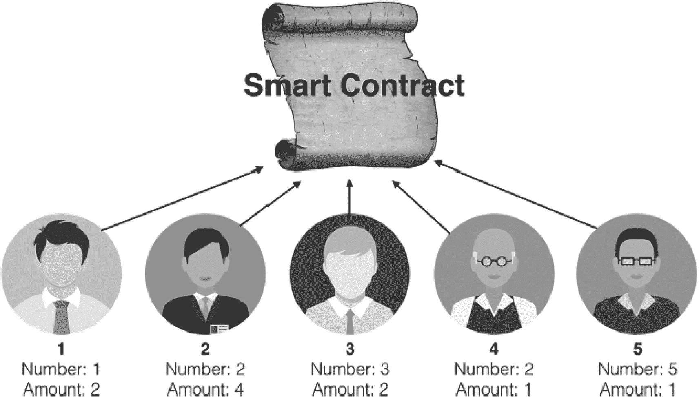

在线彩票游戏工作原理示意图。5 个带编号和金额的剪影人物图标，其上方箭头指向智能合约。编号和金额如下：1. 1 号和 2；2. 2 号和 4；3. 3 号和 2；4. 2 号和 1；5. 5 号和 1。

图 10-1

在线彩票游戏的工作原理

共有五名玩家。每位玩家对一个数字下注。例如，玩家 1 用 2 个以太币下注数字 1，玩家 2 用 4 个以太币下注数字 2，以此类推。当玩家人数达到上限时停止下注。下注停止后，合约所有者将设定中奖号码，并处理向中奖者的派奖。

假设中奖号码是 2。根据示例，玩家 2 和玩家 4 下注了该中奖号码。每位中奖者获得的金额与其下注金额成正比。计算方式如图 10-2 所示。

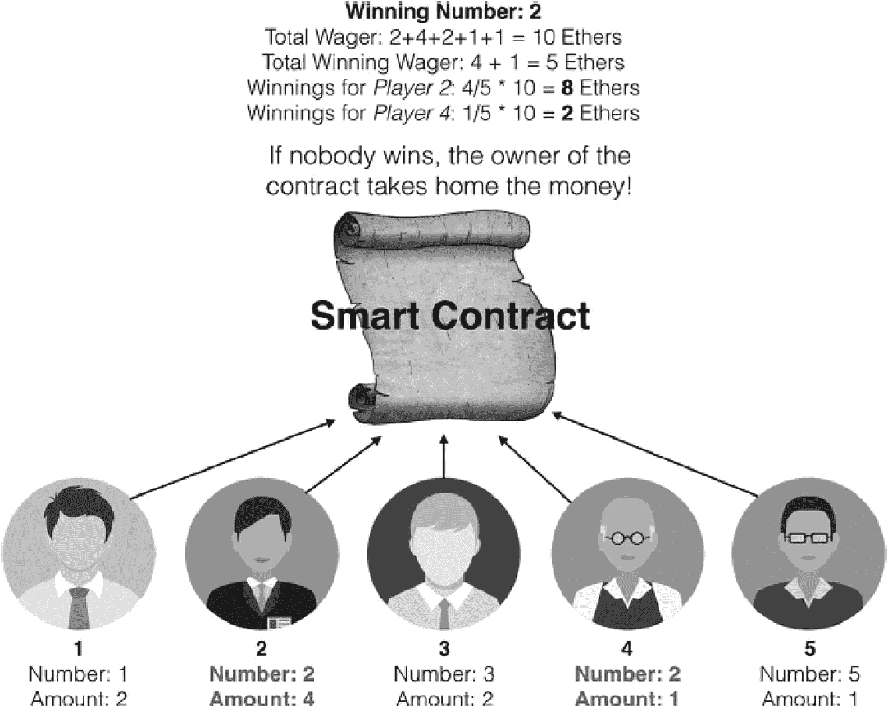

在线游戏中玩家中奖金额计算示意图。5 个带编号和金额的剪影人物图标，其上方箭头指向智能合约。顶部显示中奖号码为 2。总下注金额：10 个以太币。总中奖下注金额：5 个以太币。玩家 2 获得：8 个以太币。玩家 4 获得：2 个以太币。

图 10-2

计算每位玩家的中奖金额

你的合约将自动向中奖者转账。如果游戏中没有中奖者，所有以太币将由合约保留，并可转移给合约所有者。

## 定义智能合约

在接下来的几个小节中，你将逐步创建合约，了解其构建过程。你将使用 Remix IDE 来构建此合约。

首先定义一些数据结构，用于在智能合约中存储玩家的信息。

首先，定义一个名为`Player`的结构体，用于记录玩家下注的以太币金额和所下注的数字：

```
// 存储每位玩家的下注详情
struct Player {
uint amountWagered;   // 例如：2000 wei
uint numberWagered;   // 例如：数字 5
}
```

然后，定义`playerDetailsMapping`变量，这是一个`mapping`对象：

```
// 所有玩家的下注详情，存储在映射对象中
mapping(address => Player) playerDetailsMapping;
```

`playerDetailsMapping`是一个`mapping`对象，其键是所有玩家的账户地址。每个键对应的值是一个名为`Player`的结构体，包含两个成员：`amountWagered`（下注的 Wei 数量）和`numberWagered`（玩家下注的数字）。图 10-3 展示了你将用于存储游戏详情的数据结构。

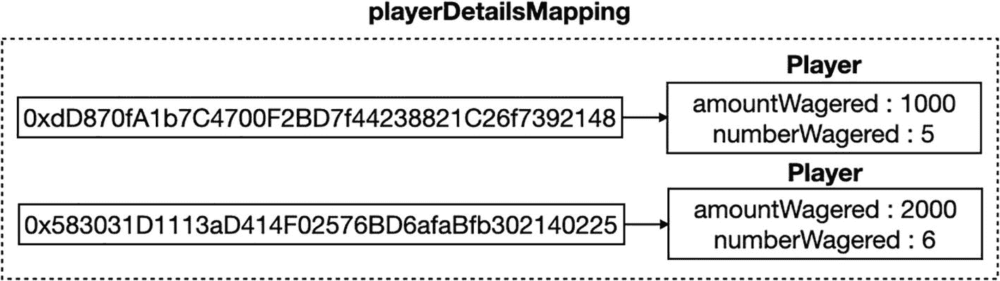

在线彩票游戏中，玩家详情映射在变量存储中的框图。每位玩家的下注金额为 1000、2000，下注数字为 5、6。

图 10-3

`playerDetailsMapping`变量存储每位玩家的下注详情

在其他编程语言中，典型的字典对象可以轻松遍历字典成员并获取所有键。然而，在 Solidity 的`mapping`对象中，无法获取键或遍历所有成员。因此，如果你想实现这些操作，必须自行设计解决方案。最简单的方法是使用数组来记录所有账户地址（见图 10-4）：

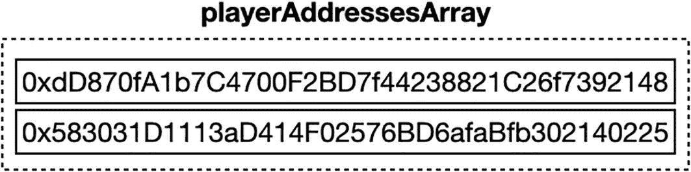

玩家地址数组的框图。包含 2 行玩家数据。地址由数字和字母组合而成。

图 10-4

`playerAddressesArray`变量存储所有玩家的地址

```
// 所有玩家地址的数组
address payable [MAX_NUMBER_OF_PLAYERS] playerAddressesArray;
```

Solidity 中的数组行为更接近 C 和 Java 等传统编程语言中的数组：你可以遍历数组、获取其长度等。通过这个数组，你可以访问映射对象中的每个成员，并用于确定游戏获胜者。

定义好数据结构后，定义一个名为`Betting`的合约：

```
// SPDX-License-Identifier: MIT
pragma solidity ⁰.8;
import "@openzeppelin/contracts/utils/Strings.sol";
contract Betting {
}
```

> **注意：** 我从 OpenZeppelin 导入了`Strings.sol`，以简化 Solidity 中的字符串处理。

在合约中声明一些变量、常量和事件：

```
contract Betting {
// 记录合约所有者
address owner = msg.sender;
// 最低下注金额（wei）
uint constant MIN_WAGER = 1000;
// 每轮允许的最大玩家人数
uint constant MAX_NUMBER_OF_PLAYERS = 3;
// 可下注的数字范围，从 1 到 MAX_NUMBER_TO_BET
uint constant MAX_NUMBER_TO_BET = 10;
// 玩家下注的总金额
uint totalWager = 0;
// 已下注的玩家数量
uint numberOfPlayers = 0;
// 中奖号码
uint winningBetNumber = 0;
// 所有玩家地址的数组
address payable [MAX_NUMBER_OF_PLAYERS] playerAddressesArray;
// 存储每位玩家的下注详情
struct Player {
uint amountWagered;
uint numberWagered;
}
// 所有玩家的下注详情，存储在映射对象中
mapping(address => Player) playerDetailsMapping;
//---定义事件---
event Winner(
address winner,
uint amount
);
// 用于显示游戏状态的事件
event Status (
uint players,
uint maxPlayers
);
}
```

以下是一些需要注意的重要点：

*   `owner`用于存储部署合约的账户地址。
*   `MAX_NUMBER_OF_PLAYERS`用于定义在抽取中奖号码之前，游戏中允许的最大玩家人数。为便于测试，设置为 3。实际应用中，可以设置为更大的数字。
*   `MAX_NUMBER_TO_BET`定义了彩票游戏的最大中奖号码。可下注的数字范围是从 1 到`MAX_NUMBER_TO_BET`。
*   `playerAddressesArray`是一个固定大小的数组，存储每位玩家的账户地址。你使用`payable`关键字前缀声明，表示每位玩家可以发送/接收以太币。
*   `Player`是一个结构体，包含两个成员：`amountWagered`和`numberWagered`。
*   `playerDetailsMapping`是一个映射对象，存储每位玩家的下注详情。
*   `Winner`和`Status`是用于通知客户端应用程序的事件。


### 下注数字

接下来，让我们在合约中定义 `bet()` 函数。`bet()` 函数允许玩家对一个数字进行下注：

```
function bet(uint number) public payable {
  // 检查 #1
  // 确保未达到最大玩家数量
  require(numberOfPlayers < MAX_NUMBER_OF_PLAYERS,
    "Maximum number of players reached");
  // 检查 #2
  // 确保调用者从未下注过
  require(playerDetailsMapping[msg.sender].numberWagered == 0,
    "You have already betted");
  // 检查 #3
  // 检查允许下注的数字范围
  require(number >=1 && number <= MAX_NUMBER_TO_BET,
    string.concat("You need to bet between 1 and ",
    Strings.toString(MAX_NUMBER_TO_BET)));
  // 检查 #4
  // 确保最低下注金额（注意 msg.value 单位是 wei）
  require( msg.value >= MIN_WAGER,
    string.concat("Minimum bet is ",
    Strings.toString(MIN_WAGER), " wei"));
  // 记录玩家下注的数字和金额
  playerDetailsMapping[msg.sender].amountWagered = msg.value;
  playerDetailsMapping[msg.sender].numberWagered = number;
  // 将玩家地址添加到地址数组中
  playerAddressesArray[numberOfPlayers] = payable(msg.sender);
  numberOfPlayers++;
  totalWager += msg.value;
  // 触发 Status 事件
  emit Status(numberOfPlayers, MAX_NUMBER_OF_PLAYERS);
}
```

**注意**

请注意 `bet()` 函数带有 `payable` 关键字。这意味着当玩家对某个数字下注时，他们必须同时发送以太币。

在这个函数中，你需要进行几项检查。首先，需要检查是否已超过最大玩家数量：

```
// 检查 #1
// 确保未达到最大玩家数量
require(numberOfPlayers < MAX_NUMBER_OF_PLAYERS,
  "Maximum number of players reached");
```

接着，通过检索 `playerDetailsMapping` 对象中的 `Player` 结构体并检查其 `numberWagered` 值，确保每个玩家只能下注一次。如果该值为零，则表示该玩家之前没有下过注：

```
// 检查 #2
// 确保调用者从未下注过
require(playerDetailsMapping[msg.sender].numberWagered == 0,
  "You have already betted");
```

**注意**

如果在 `playerDetailsMapping` 对象中找不到该玩家的账户地址，`Player` 结构体中两个成员的值将被设置为默认值，对于 `uint` 类型来说默认值为 0。

接下来，需要检查下注的数字是否在允许的范围内：

```
// 检查 #3
// 检查允许下注的数字范围
require(number >=1 && number <= MAX_NUMBER_TO_BET,
  string.concat("You need to bet between 1 and ",
  Strings.toString(MAX_NUMBER_TO_BET)));
```

你还需要检查下注金额是否至少达到最低金额：

```
// 检查 #4
// 确保最低下注金额（注意 msg.value 单位是 wei）
require( msg.value >= MIN_WAGER,
  string.concat("Minimum bet is ",
  Strings.toString(MIN_WAGER), " wei"));
```

一旦所有这些检查都通过，你需要记录玩家下注的数字和金额（`msg.sender` 是玩家的地址）：

```
// 记录玩家下注的数字和金额
playerDetailsMapping[msg.sender].amountWagered = msg.value;
playerDetailsMapping[msg.sender].numberWagered = number;
```

你还需要将玩家地址添加到地址数组中：

```
// 将玩家地址添加到地址数组中
playerAddressesArray[numberOfPlayers] = payable(msg.sender);
```

你还需要递增下注人数并累加迄今为止的所有下注金额：

```
numberOfPlayers++;
totalWager += msg.value;
```

最后，触发 `Status` 事件：

```
// 触发 Status 事件
emit Status(numberOfPlayers, MAX_NUMBER_OF_PLAYERS);
```

### 设置中奖号码并公布获胜者

接下来要定义的函数是 `announceWinners()`。`announceWinners()` 函数接收中奖号码，计算每位获胜者的奖金并将其转账给他们：

```
function announceWinners(uint winningNumber) public {
  require(msg.sender == owner,
    "Only the owner can announce the winner");
  winningBetNumber = winningNumber;
  // 用于存储获胜者
  address payable[MAX_NUMBER_OF_PLAYERS] memory winners;
  uint winnerCount = 0;
  uint totalWinningWager = 0;
  // 找出获胜者
  for (uint i=0; i < playerAddressesArray.length; i++) {
    // 获取每位玩家的地址
    address payable playerAddress = playerAddressesArray[i];
    // 如果玩家下注的数字是中奖号码
    if (playerDetailsMapping[playerAddress].numberWagered ==
      winningNumber) {
      // 将玩家地址保存到获胜者
      // 数组中
      winners[winnerCount] = playerAddress;
      // 汇总中奖号码的
      // 下注总金额
      totalWinningWager +=
        playerDetailsMapping[playerAddress].amountWagered;
      winnerCount++;
    }
  }
  // 向每位获胜玩家付款
  for (uint j=0; j<winnerCount; j++) {
    // 计算每位玩家的奖金
    uint amount = (playerDetailsMapping[winners[j]].amountWagered *
      totalWager ) / totalWinningWager;
    // 向玩家付款
    winners[j].transfer(amount);
    emit Winner(winners[j], amount);
  }
  // 重置变量
  numberOfPlayers = 0;
  totalWager = 0;
  // 清空所有数组和映射
  for (uint i=0; i < playerAddressesArray.length; i++) {
    // 获取每位玩家的地址
    address payable playerAddress = playerAddressesArray[i];
    delete playerDetailsMapping[playerAddress];
    delete playerAddressesArray[i];
  }
  // 触发 Status 事件
  emit Status(numberOfPlayers, MAX_NUMBER_OF_PLAYERS);
}
```

**提示**

在这个实现中，你向函数传入了一个中奖号码。在实际应用中，你或许希望连接到一个真实的彩票数据源来获取中奖号码。你可以通过*预言机*来实现这一点。更多细节请参考我的文章“*智能合约——使用预言机从外部源获取数据*”（`https://blog.cryptostars.is/smart-contracts-fetching-data-from-external-sources-using-oracles-bfd73f362375`）。

你首先进行检查，确保只有该合约的所有者才能调用此函数：

```
require(msg.sender == owner,
  "Only the owner can announce the winner");
```

接下来，你在内存中创建一个数组来存储所有获胜玩家，以及两个变量，分别用于存储获胜者数量和获胜下注总金额：

```
// 用于存储获胜者
address payable[MAX_NUMBER_OF_PLAYERS] memory winners;
uint winnerCount = 0;
uint totalWinningWager = 0;
```

你使用 `playerAddressesArray` 数组遍历所有玩家，检查他们下注的数字是否为中奖号码。获胜的玩家会被添加到 `winners` 数组中。

```
// 找出获胜者
for (uint i=0; i < playerAddressesArray.length; i++) {
  // 获取每位玩家的地址
  address payable playerAddress = playerAddressesArray[i];
  // 如果玩家下注的数字是中奖号码
  if (playerDetailsMapping[playerAddress].numberWagered ==
    winningNumber) {
    // 将玩家地址保存到获胜者
    // 数组中
    winners[winnerCount] = playerAddress;
    // 汇总中奖号码的
    // 下注总金额
    totalWinningWager +=
      playerDetailsMapping[playerAddress].amountWagered;
    winnerCount++;
  }
}
```

然后，你计算每位获胜者的奖金，并使用 `transfer()` 函数将奖金转账给他们：

```
// 向每位获胜玩家付款
for (uint j=0; j<winnerCount; j++) {
  // 计算每位玩家的奖金
  uint amount = (playerDetailsMapping[winners[j]].amountWagered *
    totalWager ) / totalWinningWager;
  // 向玩家付款
  winners[j].transfer(amount);
  // 触发 Winner 事件
  emit Winner(winners[j], amount);
}
```

最后，重置所有变量，以便开始新一轮游戏：

```
// 重置变量
numberOfPlayers = 0;
totalWager = 0;
// 清空所有数组和映射
for (uint i=0; i < playerAddressesArray.length; i++) {
  // 获取每位玩家的地址
  address payable playerAddress = playerAddressesArray[i];
  delete playerDetailsMapping[playerAddress];
  delete playerAddressesArray[i];
}
```

### 获取游戏状态和中奖号码

为了让外部世界了解中奖号码以及获取游戏状态，请向合约中添加以下函数：

```
function getGameStatus() view public returns (uint, uint) {
  // 返回游戏状态
  return (numberOfPlayers, MAX_NUMBER_OF_PLAYERS);
}
function getWinningNumber() view public returns (uint) {
  // 返回中奖号码
  return winningBetNumber;
}
```


### 从合约中提现

当游戏没有赢家时，智能合约会持有发送给它的以太币。要将以太币返还给部署合约的账户，你需要添加一个提现函数：

```
function cashOut() public {
require(msg.sender == owner,
"Only the owner of contract can cash out!");
payable(owner).transfer(address(this).balance);
}
```

显然，你需要确保只有合约的**所有者**（即部署合约的人）才能提现。

## 测试合约

合约编写完成后，就该测试它是否按预期运行了。最快的测试方式是在本地进行。

在 Remix IDE 中，确保选择了 Remix VM (London) 环境（见图 10-5）。请注意，这里创建了 10 个账户，每个账户有 100 个以太币供你测试。

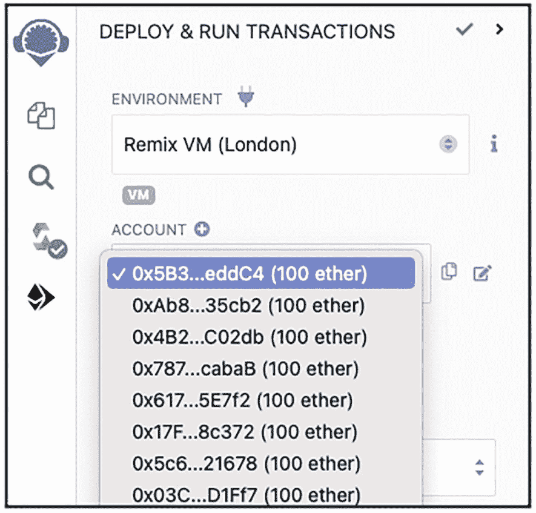

**图 10-5** - 创建了 10 个账户，每个账户有 100 个以太币供你测试使用

使用第一个账户部署合约。

> **注意：** 第一个账户是智能合约的所有者。

当合约成功部署后，你将看到如图 10-6 所示的各项功能。

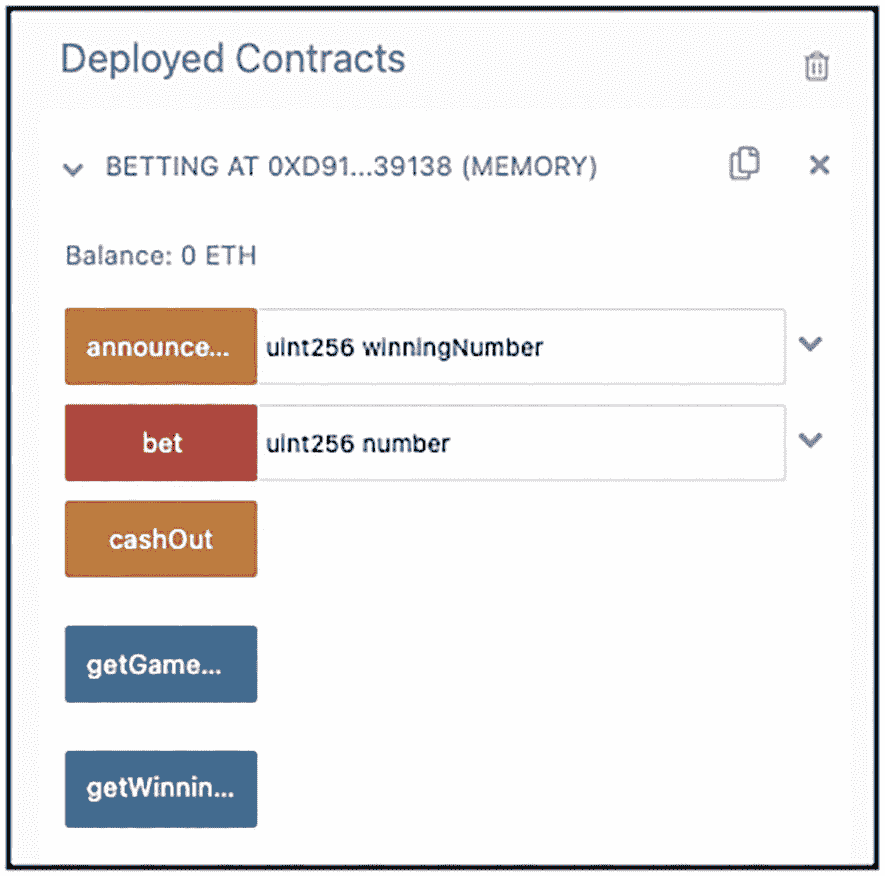

**图 10-6** - 合约中的各项功能

使用同一个第一个账户：

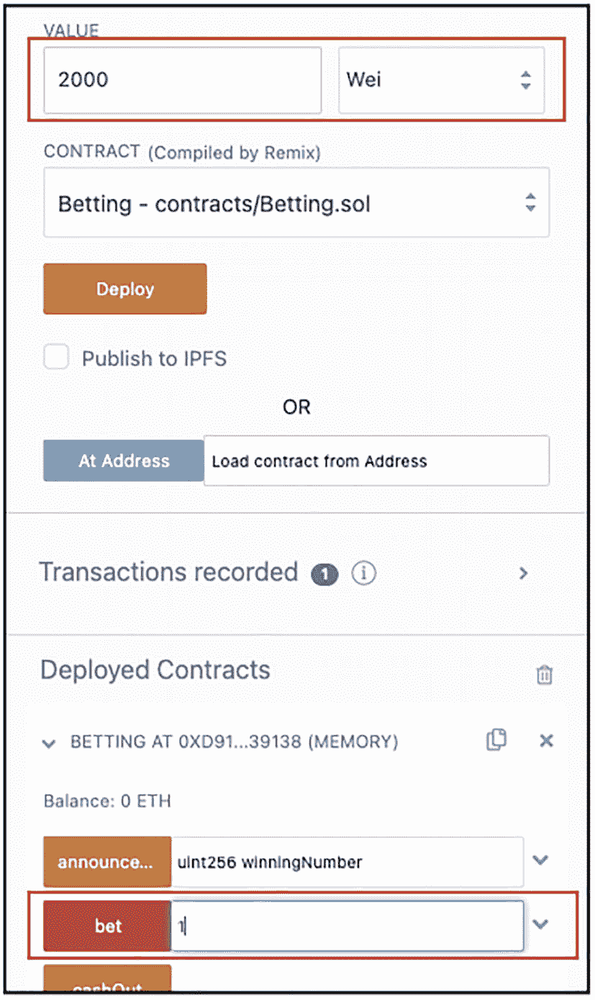

**图 10-7** - 下注数字 1，金额 2000 Wei

*   使用 2000 Wei 下注数字 1（见图 10-7）。
*   点击 `bet` 按钮。

然后，点击 `getGameStatus` 按钮，你应该会看到结果为 1 和 3（见图 10-8）。1 表示有一名玩家已下注，3 表示最大玩家数量。

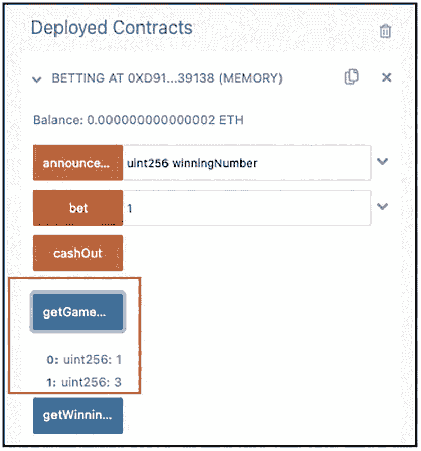

**图 10-8** - 获取游戏状态

使用第二个账户：

*   使用 1000 Wei 下注数字 5。
*   点击 `bet` 按钮。

使用第三个账户：

*   使用 2000 Wei 下注数字 5。
*   点击 `bet` 按钮。

表 10-1 总结了投注状态。

**表 10-1** - 下注的数字

| 账户 | `numberWagered` | `amountWagered` (Wei) |
| --- | --- | --- |
| 1 (所有者) | 1 | 2000 |
| 2 | 5 | 1000 |
| 3 | 5 | 2000 |

> **注意：** 下注时，请记得在 Remix IDE 的“账户”部分切换账户。

### 公布赢家

现在三位玩家都已下注，是时候公布赢家了。

> **提示：** 你不必等到所有三位玩家都下注后再公布赢家。如果你想随时结束游戏，可以调用 `announceWinners` 按钮。即使只有两位玩家下注，你也可以结束游戏。

使用第一个账户：

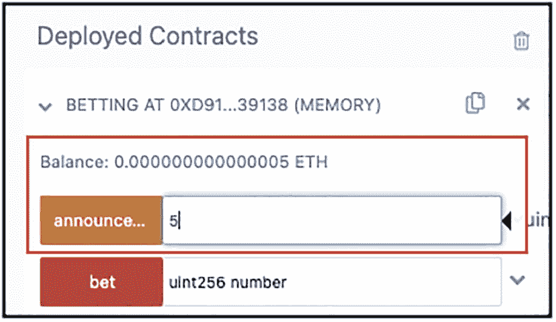

**图 10-9** - 公布中奖数字

*   输入数字 5（见图 10-9）。
*   点击 `announceWinners` 按钮。

在 Remix IDE 的底部，你应该会看到智能合约触发的事件（见图 10-10）。

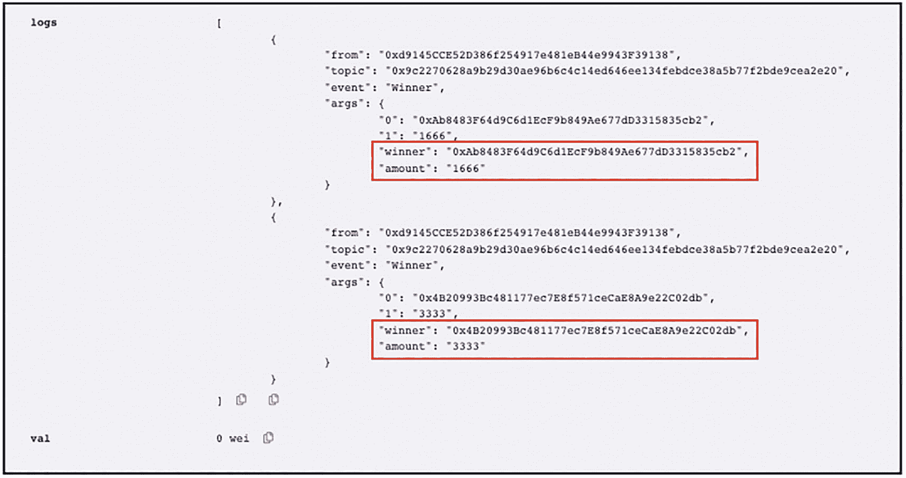

**图 10-10** - 智能合约触发的事件，包含赢家地址及中奖金额

由于有两位玩家下注了数字 5，因此有两位赢家。第二位和第三位玩家的中奖金额分别为 1666 和 3333。中奖金额的计算方式如下：

*   总下注金额 = 5000 Wei
*   总中奖下注金额 = 1000 + 2000 = 3000 Wei
*   第二位账户的中奖金额 = (1000/3000) * 5000 = 1666 Wei
*   第三位账户的中奖金额 = (2000/3000) * 5000 = 2333 Wei

请注意，由于四舍五入，合约中会剩余 1 Wei 的余额（见图 10-11）。

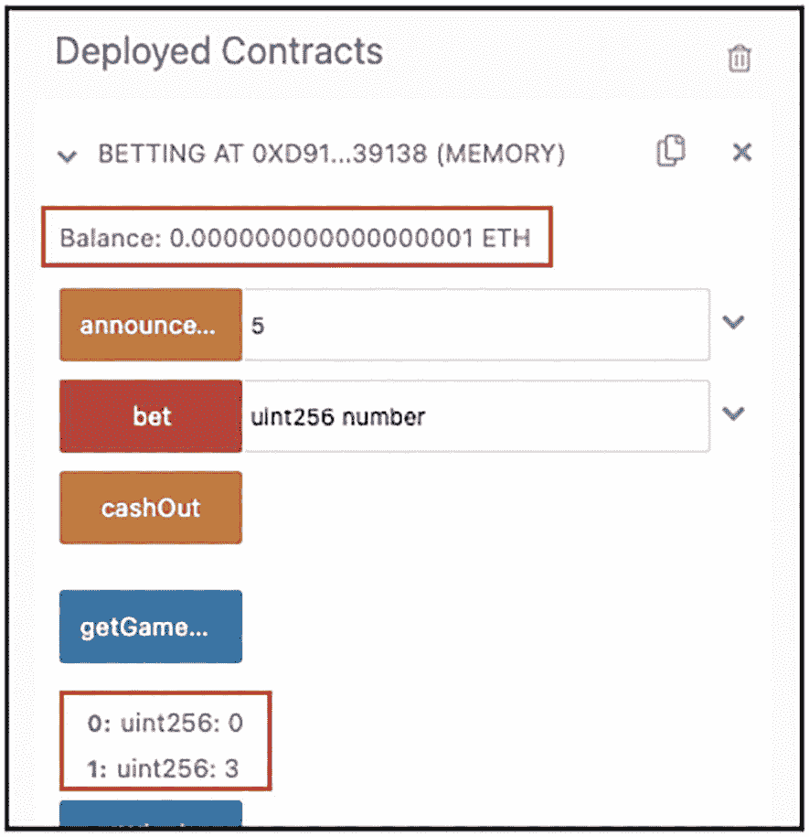

**图 10-11** - 合约中的余额

点击 `getGameStatus` 按钮，你会看到玩家数量已重置为 0。

### 保存合约的 ABI

为了准备创建投注合约的前端，请点击 **SOLIDITY COMPILER** 选项卡底部的 `ABI` 按钮（见图 10-12）。

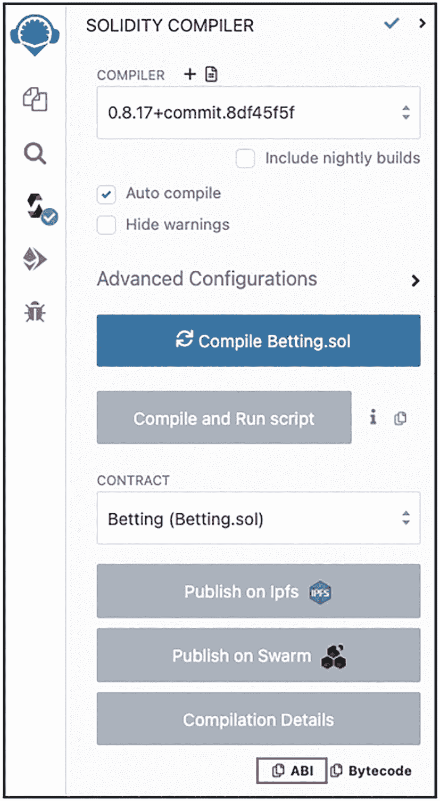

**图 10-12** - 点击 ABI 按钮获取合约的 ABI

将 ABI 粘贴到文本文件中，以便日后参考。以下是 ABI，供你方便使用：

```
[ { "anonymous": false, "inputs": [ { "indexed": false, "internalType": "uint256", "name": "players", "type": "uint256" }, { "indexed": false, "internalType": "uint256", "name": "maxPlayers", "type": "uint256" } ], "name": "Status", "type": "event" }, { "anonymous": false, "inputs": [ { "indexed": false, "internalType": "address", "name": "winner", "type": "address" }, { "indexed": false, "internalType": "uint256", "name": "amount", "type": "uint256" } ], "name": "Winner", "type": "event" }, { "inputs": [ { "internalType": "uint256", "name": "winningNumber", "type": "uint256" } ], "name": "announceWinners", "outputs": [], "stateMutability": "nonpayable", "type": "function" }, { "inputs": [ { "internalType": "uint256", "name": "number", "type": "uint256" } ], "name": "bet", "outputs": [], "stateMutability": "payable", "type": "function" }, { "inputs": [], "name": "cashOut", "outputs": [], "stateMutability": "nonpayable", "type": "function" }, { "inputs": [], "name": "getGameStatus", "outputs": [ { "internalType": "uint256", "name": "", "type": "uint256" }, { "internalType": "uint256", "name": "", "type": "uint256" } ], "stateMutability": "view", "type": "function" }, { "inputs": [], "name": "getWinningNumber", "outputs": [ { "internalType": "uint256", "name": "", "type": "uint256" } ], "stateMutability": "view", "type": "function" } ]
```


### 将合约部署到测试网

合约经过测试并确认运行正常后，就可以将其部署到 Goerli 测试网，这样就可以构建一个与之交互的前端界面了。

在 MetaMask 中，请确保已连接到 Goerli 测试网。然后，回到 Remix IDE 中，将环境切换为 `Injected Provider – MetaMask`（见图 10-13）。

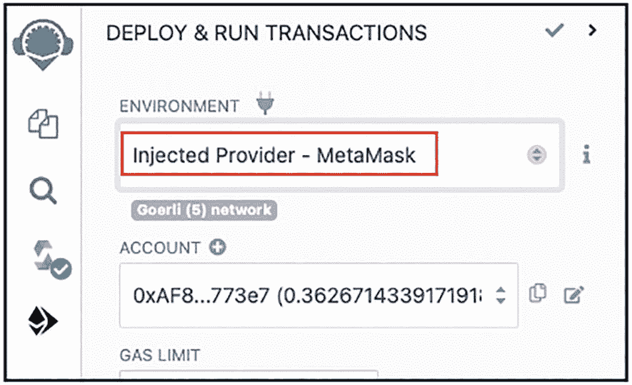

**图 10-13** – 将环境切换为 `Injected Provider – MetaMask`

点击 `Deploy` 按钮来部署合约。作为参考，我部署的合约地址是 `0xA0a4a98562587211CAbdC910721e0020A52AcE11`。

## 创建 Web 前端

现在，让我们为这个彩票游戏创建 Web 前端。新建一个文本文件，命名为 `OnlineBetting.html`，并将其保存在 `web3projects` 文件夹中（该文件夹首次在第 8 章中创建）。

在 `OnlineBetting.html` 文件中填入以下内容：

```html
<!DOCTYPE html>
<html lang="en">
<head>
    <meta charset="UTF-8">
    <meta name="viewport" content="width=device-width, initial-scale=1.0">
    <title>Document</title>
    <script src="https://cdn.jsdelivr.net/npm/web3@1.3.0/dist/web3.min.js"></script>
    <script src="https://code.jquery.com/jquery-3.5.1.min.js"></script>
</head>
<body>
    <h1>以太坊彩票</h1>
    <p>下注号码: <input type="text" id="numberToWager"></p>
    <p>下注金额（单位 Wei）: <input type="text" id="weiToWager"></p>
    <button id="btnBet">下注</button>
    <div id="result"></div>
    <script>
        //-----JavaScript 函数开始-----
        async function loadWeb3() {
            //---如果你的网页浏览器中安装了 MetaMask---
            if (window.ethereum) {
                web3 = new Web3(window.ethereum);
                //---连接账户---
                const account = await window.ethereum.request(
                    { method: 'eth_requestAccounts' });
                console.log(account)
            } else {
                //---从 Web3.providers 设置你想要的提供者---
                web3 = new Web3(
                    new Web3.providers.HttpProvider(
                        "http://localhost:8545"));
                var version = web3.version;
                console.log("web3 版本: ", version);
            }
        }
        async function loadContract() {
            abi = [ { "anonymous": false, "inputs": [ { "indexed": false, "internalType": "uint256", "name": "players", "type": "uint256" }, { "indexed": false, "internalType": "uint256", "name": "maxPlayers", "type": "uint256" } ], "name": "Status", "type": "event" }, { "anonymous": false, "inputs": [ { "indexed": false, "internalType": "address", "name": "winner", "type": "address" }, { "indexed": false, "internalType": "uint256", "name": "amount", "type": "uint256" } ], "name": "Winner", "type": "event" }, { "inputs": [ { "internalType": "uint256", "name": "winningNumber", "type": "uint256" } ], "name": "announceWinners", "outputs": [], "stateMutability": "nonpayable", "type": "function" }, { "inputs": [ { "internalType": "uint256", "name": "number", "type": "uint256" } ], "name": "bet", "outputs": [], "stateMutability": "payable", "type": "function" }, { "inputs": [], "name": "cashOut", "outputs": [], "stateMutability": "nonpayable", "type": "function" }, { "inputs": [], "name": "getGameStatus", "outputs": [ { "internalType": "uint256", "name": "", "type": "uint256" }, { "internalType": "uint256", "name": "", "type": "uint256" } ], "stateMutability": "view", "type": "function" }, { "inputs": [], "name": "getWinningNumber", "outputs": [ { "internalType": "uint256", "name": "", "type": "uint256" } ], "stateMutability": "view", "type": "function" } ]
            //---将下面的地址替换为你自己的合约地址---
            address = '0x2043C325084A74A3a5105ddC5F999ed24b56D77a'
            return await new web3.eth.Contract(abi, address);
        }
        async function getCurrentAccount() {
            const accounts = await web3.eth.getAccounts();
            console.log(accounts)
            return accounts[0];
        }
        async function load() {
            await loadWeb3();
            lottery = await loadContract();
            // 处理智能合约触发的 Winner 事件
            lottery.events.Winner()
                .on('data', function(event) {
                    console.log(event.returnValues[0]);  // 获胜者地址
                    console.log(event.returnValues[1]);  // 金额
                    $("#result").append("获胜者: " + event.returnValues[0] +
                        ", 金额: " + event.returnValues[1] +
                        " wei");
                })
            // 处理智能合约触发的 Status 事件
            lottery.events.Status()
                .on('data', function(event) {
                    console.log(event.returnValues[0]);  // 玩家数
                    console.log(event.returnValues[1]);  // 最大玩家数
                    $("#result").append("游戏状态: " + event.returnValues[0] +
                        " / " + event.returnValues[1] + "");
                })
            // 检查游戏的当前状态
            lottery.methods.getGameStatus()
                .call(function(error, result) {
                    if (!error) {
                        $("#result").append("游戏状态: " +
                            result[0].toString() + " / " +
                            result[1].toString() + "");
                        console.log("游戏状态: " + result[0] +
                            " / " + result[1]);
                    } else
                        console.error(error);
                });
            // 下注
            $("#btnBet").click(async function() {
                console.log($("#weiToWager").val());
                //---获取账户---
                const account = await getCurrentAccount();
                // 调用 bet() 函数
                lottery.methods.bet($("#numberToWager").val())
                    .send(
                        {
                            from: account,
                            value: $("#weiToWager").val()
                        }
                    )
                    .on('transactionHash', function(hash) {
                        $("#result").append("下注已提交");
                        console.log("交易哈希: " + hash);
                    })
                    .on('receipt', function(receipt) {
                        $("#result").append("下注已被接受");
                        console.log("收据: " + receipt.toString());
                    })
                    .on('error', function(error, receipt) {
                        $("#result").append("发生错误，下注未成功");
                        console.log("错误: " + error + "," + receipt.toString());
                    });
            });
        }
        load();
        //-----JavaScript 函数结束-----
    </script>
</body>
</html>
```

> **注意：** 请记得将合约地址替换为你自己的地址。

要在终端中测试 Web 前端，请键入以下命令：

```bash
$ cd ~/webprojects
$ serve
```

使用三个 Chrome 浏览器实例，每个浏览器都加载以下 URL：`http://localhost:3000/OnlineBetting.html`。您应该会看到它们都显示相同的状态（见图 10-14）。

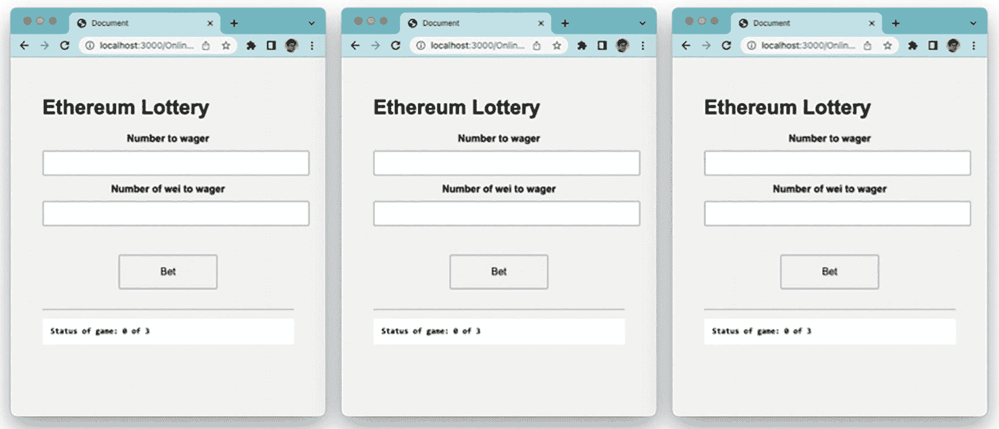

**图 10-14** – 三个 Chrome 浏览器实例显示相同的页面和游戏状态

使用账户 1（左侧浏览器），对数字 1 下注 2 个 Ether，然后点击 `Bet` 按钮。请注意，MetaMask 会弹出一个窗口，显示将要发送到合约的金额。点击 `CONFIRM`。一旦点击 `CONFIRM` 按钮，第一个浏览器会显示消息“下注已提交”。过一会儿（当交易被确认后），该应用还会显示另外两条消息（可能不按特定顺序显示；见图 10-15）：

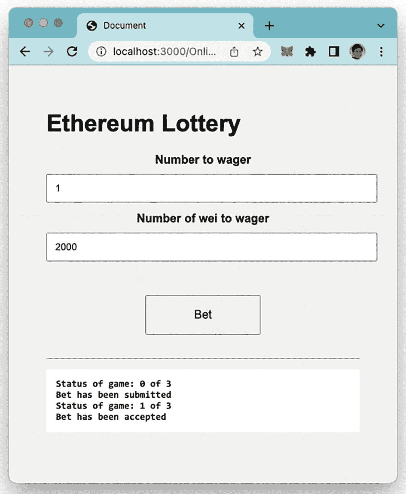

**图 10-15** – 提交下注以及交易被确认后你会看到的消息

*   游戏状态: 1 / 3
*   下注已被接受

在第二个浏览器上：

*   使用账户 2，对数字 5 下注 1000 Wei。
*   点击 `Bet` 按钮。

在第三个浏览器上：

*   使用账户 3，对数字 5 下注 2000 Wei。
*   点击 `Bet` 按钮。


### 公布中奖号码

与之前在 Remix IDE 中测试合约时一样，您可以通过 `announceWinners` 按钮公布中奖号码。

使用账户 1（合约拥有者），

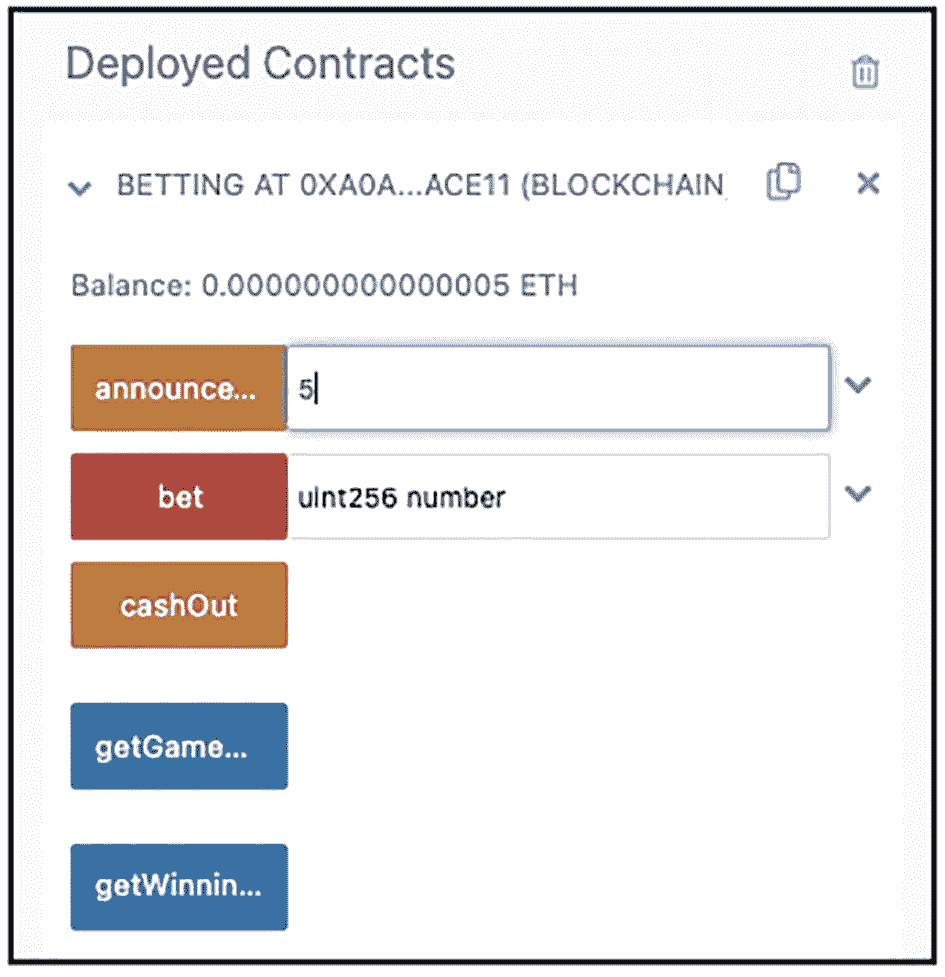

已部署合约的截图。包含下拉选项以及余额 0.0000000000000000005 ETH。底部有 5 个区块标签：发布、投注、提现、获取游戏状态和获取中奖选项。

图 10-16 — 通过 Remix IDE 公布中奖者

- 输入数字 5（见图 10-16）。
- 点击 `announceWinners` 按钮。

当交易被确认后，中奖者将被公布（见图 10-17）。

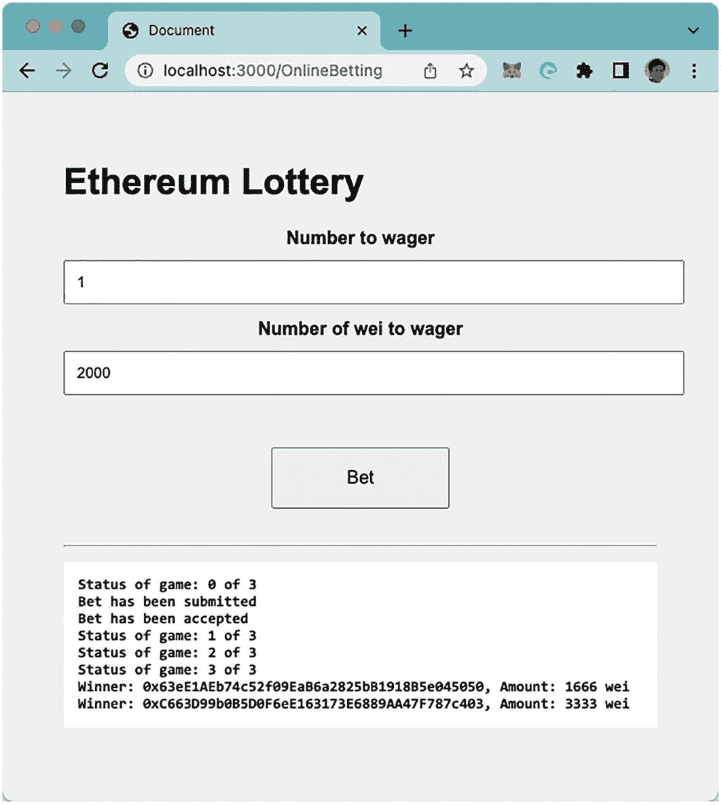

Chrome 浏览器的截图，页面包含以太坊彩票的标题。投注数字为 1，投注的 wei 数量为 2000。界面上显示“投注”按钮。游戏状态显示为 0/3、1/3、2/3、3/3，并展示了中奖者公告和金额。

图 10-17 — 显示中奖者及其奖金的应用程序

### 提现

如果合约中有余额，您可以通过点击 Remix IDE 中的 `cashOut` 按钮进行提现（提现给合约拥有者），如图 10-18 所示。

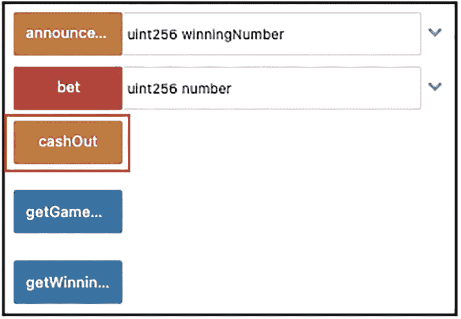

已部署合约的截图。包含 5 个区块选项：发布、投注、提现、获取游戏状态和获取中奖选项。其中“发布”和“投注”选项有下拉菜单。

图 10-18 — 从合约中提现

**提示：** 在点击 `cashOut` 按钮前，请确保将账户设置为账户 1。

## 完整合约

为了方便您查阅，此处列出了完整合约：

```
// SPDX-License-Identifier: MIT
pragma solidity ⁰.8;
import "@openzeppelin/contracts/utils/Strings.sol";
contract Betting {
// 记录合约的拥有者
address owner = msg.sender;
// 最小投注额（以 wei 为单位）
uint constant MIN_WAGER = 1000;
// 每轮允许的最大玩家数量
uint constant MAX_NUMBER_OF_PLAYERS = 3;
// 投注数字范围，从 1 到 MAX_NUMBER_TO_BET
uint constant MAX_NUMBER_TO_BET = 10;
// 当前所有玩家的总投注额
uint totalWager = 0;
// 当前已投注的玩家数量
uint numberOfPlayers = 0;
// 中奖号码
uint winningBetNumber = 0;
// 所有玩家地址的数组
address payable [MAX_NUMBER_OF_PLAYERS] playerAddressesArray;
// 存储每个玩家的投注详情
struct Player {
uint amountWagered;
uint numberWagered;
}
// 使用映射对象存储所有玩家的投注详情
mapping(address => Player) playerDetailsMapping;
//---定义事件---
event Winner(
address winner,
uint amount
);
// 用于显示游戏状态的事件
event Status (
uint players,
uint maxPlayers
);
function getGameStatus() view public returns (uint, uint) {
// 返回游戏状态
return (numberOfPlayers, MAX_NUMBER_OF_PLAYERS);
}
function getWinningNumber() view public returns (uint) {
// 返回中奖号码
return winningBetNumber;
}
function cashOut() public {
require(msg.sender == owner,
"只有合约拥有者才能提现！");
payable(owner).transfer(address(this).balance);
}
function bet(uint number) public payable {
// 检查 #1
// 确保未达到最大玩家数量
require(numberOfPlayers =1 && number = MIN_WAGER,
string.concat("最低投注额为 ",
Strings.toString(MIN_WAGER), " wei"));
// 记录该玩家投注的数字和金额
playerDetailsMapping[msg.sender].amountWagered = msg.value;
playerDetailsMapping[msg.sender].numberWagered = number;
// 将玩家地址添加到地址数组中
playerAddressesArray[numberOfPlayers] = payable(msg.sender);
numberOfPlayers++;
totalWager += msg.value;
// 触发 Status 事件
emit Status(numberOfPlayers, MAX_NUMBER_OF_PLAYERS);
}
function announceWinners(uint winningNumber) public {
require(msg.sender == owner,
"只有合约拥有者才能公布中奖者");
winningBetNumber = winningNumber;
// 用于存储中奖者
address payable[MAX_NUMBER_OF_PLAYERS] memory winners;
uint winnerCount = 0;
uint totalWinningWager = 0;
// 找出中奖者
for (uint i=0; i < playerAddressesArray.length; i++) {
// 获取每位玩家的地址
address payable playerAddress = playerAddressesArray[i];
// 如果该玩家投注的数字是中奖号码
if (playerDetailsMapping[playerAddress].numberWagered ==
winningNumber) {
// 将该玩家地址保存到中奖者数组中
winners[winnerCount] = playerAddress;
// 汇总中奖号码对应的总投注额
totalWinningWager +=
playerDetailsMapping[playerAddress].amountWagered;
winnerCount++;
}
}
// 向每位中奖玩家付款
for (uint j=0; j<winnerCount; j++) {
// 计算每位玩家的奖金
uint amount = (playerDetailsMapping[winners[j]].amountWagered *
totalWager ) / totalWinningWager;
// 向玩家付款
winners[j].transfer(amount);
// 触发 Winner 事件
emit Winner(winners[j], amount);
}
// 重置变量
numberOfPlayers = 0;
totalWager = 0;
// 清除所有数组和映射
for (uint i=0; i < playerAddressesArray.length; i++) {
// 获取每位玩家的地址
address payable playerAddress = playerAddressesArray[i];
delete playerDetailsMapping[playerAddress];
delete playerAddressesArray[i];
}
// 触发 Status 事件
emit Status(numberOfPlayers, MAX_NUMBER_OF_PLAYERS);
}
}
```

## 本章小结

在本章中，您学习了如何构建一个在线彩票游戏。除了运用前几章学到的知识外，您还学到了一些新内容：
- 如何以编程方式将以太币转账到另一个账户
- 如何在 Solidity 中使用各种数据结构来存储数据

下一章，您将学习代币以及如何在智能合约中使用它们。

