# 什么是代币？

要理解代币的概念，我们先从一个现实生活中的类比说起。大多数人对游乐场（或狂欢节）都很熟悉。在游乐场玩游戏时，摊位通常不接受现金支付。相反，他们需要你兑换现金（或使用信用卡）来购买硬币（或代币），以便在游戏摊位上使用（见图 11-1）。


一张插图，展示法币兑换成用于游乐场游戏的代币的过程。

图 11-1
现实世界中在游乐场游戏里使用的代币

游乐场老板这样做有多种原因：

-   摊位无需处理现金；这样可以防止摊位工作人员（通常是游乐场老板的雇员）私自截留现金。
-   在你开始玩游戏之前，游乐场老板就已预先收到现金，而未使用的代币无法退款。
-   游乐场老板想通过给予你预先购买更多代币的激励，向你销售超过你实际需要的代币。

在加密货币世界中，相同的概念也适用于代币。你并非直接用法定货币购买代币，而是先购买以太币，然后用以太币来购买代币（见图 11-2）。

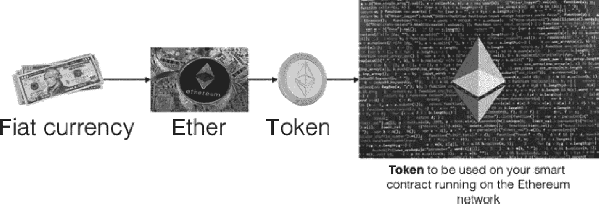

一张插图，展示法定货币兑换成以太币，然后以太币用于购买代币，该代币用于在以太坊网络上运行的智能合约中。

图 11-2
以太坊区块链上的代币

## 币（Coin）与代币（Token）

在加密货币世界中，有两个术语经常被混用：*币*和*代币*。那么它们是一样的吗？首先，*币*的定义是，它是一种原生存在于其自身区块链上的资产。比特币、莱特币和以太币都是币的例子。这些币各自存在于它们自己的区块链上。而*代币*则是在现有的区块链上创建的。最常见的代币平台是以太坊，它允许开发者使用 ERC-20 标准创建自己的代币（本章后续部分将详细介绍）。用户可以使用以太币（以太坊区块链的原生币）在以太坊区块链上兑换特定的代币。因此，严格来说，币和代币并不相同。事实上，代币是基于币的。

## 代币是如何实现的？

现在你已经清楚了代币及其工作原理，让我们来看看代币在以太坊中是如何实现的。

代币是通过智能合约（没错，就是你在前几章读到的智能合约）来实现的，这种合约被称为*代币合约*。代币合约是一种包含账户地址及其余额映射关系的智能合约。图 11-3 展示了这种映射的一个例子。

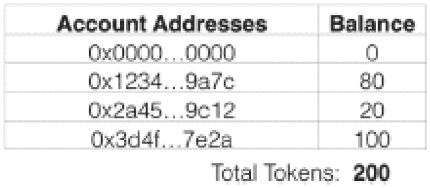

一个四行两列的表格。列标题是“账户地址”和“余额”。总代币数为 200。

图 11-3
代币合约包含账户地址及其余额的映射

从概念上讲，代币合约是一种维护映射对象的智能合约，该映射对象在区块链上记录了账户的余额（见图 11-4）。

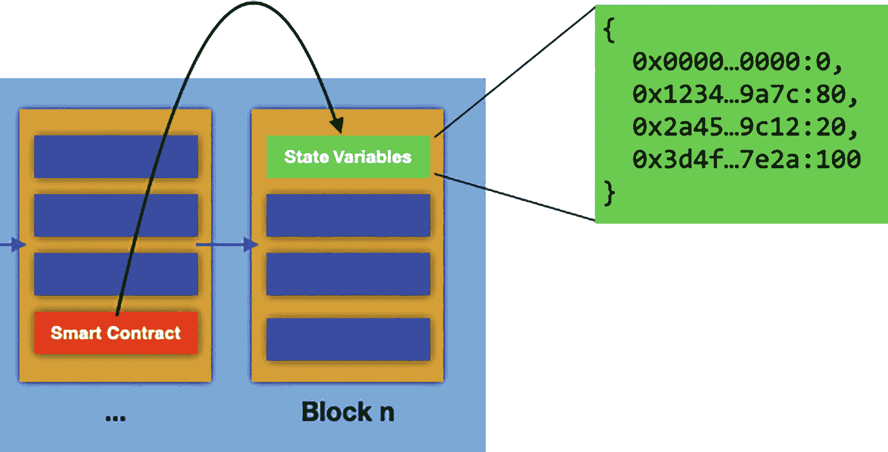

一张示意图，展示包含 `n` 个区块的区块链。其中一个区块中的智能合约信息被传递到包含多个账户地址的状态变量中。

图 11-4
代币合约维护一个包含账户地址及其余额的映射对象

## 铸造新代币

代币的总供应量可以通过*铸造*新代币来增加。也就是说，你（代币合约的所有者）只需增加一个账户的余额，如图 11-5 所示。

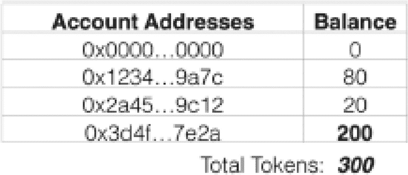

一个四行两列的表格。列标题是“账户地址”和“余额”。总代币数为 300。

图 11-5
通过增加一个或多个账户的余额来铸造新代币

## 销毁代币

代币的总供应量可以通过销毁代币来减少。也就是说，你减少一个账户的余额，如图 11-6 所示。

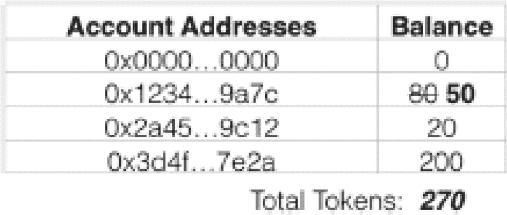

一个四行两列的表格。列标题是“账户地址”和“余额”。总代币数为 270。

图 11-6
通过减少一个账户的余额来销毁代币

代币也可以通过发送到死地址的方式销毁，如图 11-7 所示。请注意，在这种情况下，代币的总供应量不会改变。

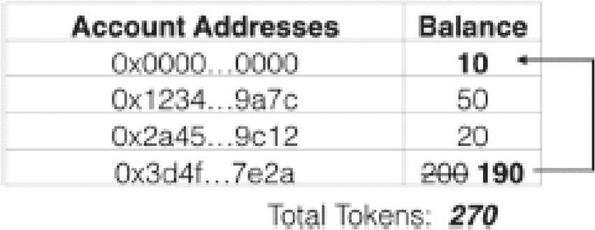

一个四行两列的表格。列标题是“账户地址”和“余额”。总代币数为 270。

图 11-7
通过将代币发送到死地址来销毁。在这种情况下，总供应量不变

## 代币合约内部使用的单位

在代币合约中，*精度小数位*表示一个代币的可分割程度。考虑一个虚构代币 `MusicToken` 的例子，每个代币代表拥有一首歌的权利。在这种情况下，*精度小数位* 设为 0。这意味着代币不能有小数部分；你不能拥有 1.1 或 1.5 个代币。换句话说，一个人可以拥有的 `MusicToken` 数量必须是离散的数字（只能是整数值）。图 11-8 展示了 `MusicToken` 在代币合约内部的表示方式。

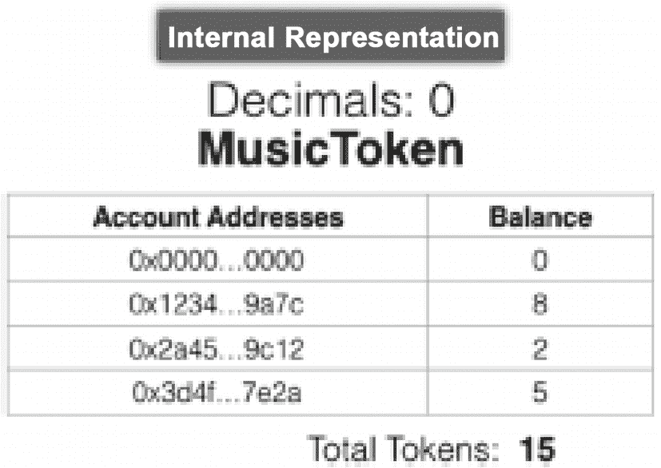

一个关于内部表示精度的表格，精度为 0 music token。它有 4 行 2 列。列标题是“账户地址”和“余额”。总代币数为 15。

图 11-8
精度小数位为 0 的代币没有小数部分

再考虑另一个例子，虚构的 `GoldToken`，它代表一个人拥有的黄金数量。在这种情况下，精度小数位可以设为 3，这意味着一个人拥有的 `GoldToken` 数量可以精确到小数点后 3 位，例如 2.003。图 11-9 展示了 `GoldToken` 的余额在内部是如何表示的，以及用户看到的视图是什么样的。

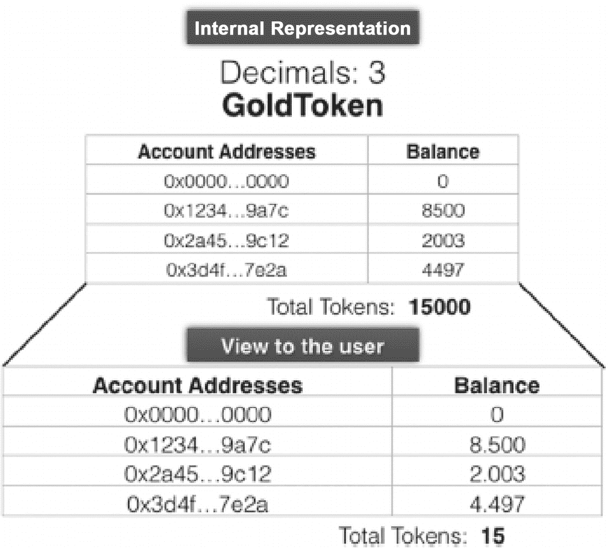

两个表格。表格 1 是 GoldToken 的内部表示，表格 2 是给用户看的视图。有 4 行 2 列。列标题是“账户地址”和“余额”。表格 1 中总代币数为 15000，表格 2 中总代币数为 15。

图 11-9
精度为三位小数的代币：内部存储方式与外部查看方式

在内部，对于一个具有 `n` 位精度小数的代币，余额使用以下公式表示：`token_internal = token_external * 10^n`。例如，一个用户可能拥有 4.497 个 `GoldToken`，但在内部，代币合约将其余额存储为 4497。


### ERC-20 代币标准

为了让基于以太坊区块链创建的代币能够被智能合约接受，这些代币必须遵循特定的标准。对于以太坊代币而言，该标准即为 ERC-20。`ERC` 代表*以太坊征求意见提案（Ethereum Request for Comments）*。在 `ERC-20` 中，数字 20 指的是提案 ID 号。`ERC-20` 提案定义了一组规则，代币必须满足这些规则才能与其他代币进行交互。

> **提示：** `ERC-20` 标准是一组特定的函数，开发者必须在其同质化代币中使用。同质化代币意味着该代币是可分割的，可以分解成更小的面额（例如，1 个代币等同于 0.5 个代币、0.3 个代币和 0.2 个代币的总和）。

`ERC20` 代币必须能够执行以下操作：

-   获取代币总供应量。
-   获取账户余额。
-   将代币从一个账户转移到另一个账户。
-   批准将代币用作货币资产。

具体来说，`ERC20` 代币必须实现以下接口：

```
contract ERC20Interface {
function totalSupply() public constant returns (uint);
function balanceOf(address tokenOwner) public constant
returns (uint balance);
function allowance(address tokenOwner, address
spender) public constant returns (uint remaining);
function transfer(address to, uint tokens) public
returns (bool success);
function approve(address spender, uint tokens) public
returns (bool success);
function transferFrom(address from, address to, uint
tokens) public returns (bool success);
event Transfer(address indexed from, address indexed
to, uint tokens);
event Approval(address indexed tokenOwner, address
indexed spender, uint tokens);
}
```

以下是 `ERC20Interface` 中各个函数和事件的用途：

-   `totalSupply`: 返回代币总供应量。
-   `balanceOf(address _owner)`: 返回 `_owner` 的账户余额。
-   `transfer(address _to, uint256 _value)`: 将 `_value` 数量的代币转移到 `_to` 地址，并触发 `Transfer` 事件。如果 `_from` 账户没有足够的代币可花费，该函数应回退。
-   `approve(address _spender, uint256 _value)`: 允许 `_spender` 从该账户中多次提取代币，总提取额不超过 `_value`。
-   `transferFrom(address _from, address _to, uint256 _value)`: 将 `_value` 数量的代币从 `_from` 转移到 `_to`，并触发 `Transfer` 事件。除非 `_from` 账户已通过某种机制故意授权了消息发送者，否则该函数应回退。
-   `allowance(address _owner, address _spender)`: 返回 `_spender` 仍被允许从 `_owner` 账户中提取的代币数量。
-   `Transfer(address indexed _from, address indexed _to, uint256 _value)`: 在代币转移时必须触发，包括零值转移。
-   `Approval(address indexed _owner, address indexed _spender, uint256 _value)`: 在成功调用 `approve(address _spender, uint256 _value)` 时必须触发。

## 创建代币合约

与其自行实现所有这些函数和事件，不如使用 OpenZeppelin 提供的 ERC-20 基础实现。你可以在以下位置找到此实现：[`https://github.com/OpenZeppelin/openzeppelin-contracts/blob/v4.0.0/contracts/token/ERC20/ERC20.sol/`](https://github.com/OpenZeppelin/openzeppelin-contracts/blob/v4.0.0/contracts/token/ERC20/ERC20.sol/) 。

> **注意：** OpenZeppelin 是一个用于构建安全智能合约的开源框架。OpenZeppelin 提供了一套完整的安全产品和审计服务，用于构建、管理和检查去中心化应用的软件开发和运营的各个方面。

因此，如果你正在编写一个 ERC-20 代币合约，只需从 OpenZeppelin 导入基础实现并继承它即可。

对于你的示例，在 Remix IDE 中创建一个新合约，并将其命名为 `token.sol`。用以下语句填充它：

```
// SPDX-License-Identifier: MIT
pragma solidity ⁰.8;
import "https://github.com/OpenZeppelin/openzeppelin-contracts/blob/v4.0.0/contracts/token/ERC20/ERC20.sol";
contract MyToken is ERC20 {
constructor(string memory name, string memory symbol)
ERC20(name, symbol) {
// ERC20 tokens by default have 18 decimals
// number of tokens minted = n * 10¹⁸
uint256 n = 1000;
_mint(msg.sender, n * 10**uint(decimals()));
}
}
```

在此合约中，你正在创建 1000 个代币（`n` 的值），并且每个代币最多可以有 18 位小数精度（因为 `decimals()` 函数默认返回 18）。在合约内部，铸造的代币数量取决于 `n` 和精度。在此示例中，虽然总供应量是 1000 个代币，但铸造的基础代币总单位等于 **1000 x 10¹⁸**，即 **1,000,000,000,000,000,000,000**。

> **提示：** 所有涉及代币的操作都基于基础代币单位。例如，如果我想向另一个账户发送 1 个代币，我必须向收款账户转移 1,000,000,000,000,000,000 个基础代币单位的代币。

### 覆盖小数位数精度

代币合约中的 `decimals()` 函数默认返回 18。这意味着你创建的代币的最小面额可小至 0.000000000000000001（18 位小数）。但是，有时你可能并不需要代币拥有这种精度。例如，如果你不希望代币被分割，可以像这样覆盖代币合约中的 `decimals()` 函数：

```
// SPDX-License-Identifier: MIT
pragma solidity ⁰.8;
import "https://github.com/OpenZeppelin/openzeppelin-contracts/blob/v4.0.0/contracts/token/ERC20/ERC20.sol";
contract MyToken is ERC20 {
constructor(string memory name, string memory symbol)
ERC20(name, symbol) {
// ERC20 tokens have 18 decimals
// number of tokens minted = n * 10¹⁸
uint256 n = 1000;
_mint(msg.sender, n * 10**uint(decimals()));
}
function decimals() override public pure returns (uint8) {
return 0;
}
}
```

在此示例中，`decimals()` 函数返回 0，这意味着你的代币没有任何小数位。如果返回 1，你的代币的最小面额则为 0.1。

为简化起见，你的代币合约将使用默认的 18 位小数精度。

### 部署代币合约

要部署代币合约，你必须指定两个参数：

-   代币的名称（描述）
-   代币的符号

> **提示：** 代币的符号并非唯一，但你应尽量将其控制在三到四个字符以内。

图 11-10 展示了一个代币的名称和符号示例。点击**部署**按钮来部署代币合约。


**图 11-10** — 使用名称和符号部署代币合约

合约部署完成后，你可以展开合约名称查看各种函数（参见图 11-11）。这些是你的 ERC-20 代币合约（由 OpenZeppelin 基础合约实现）需要实现的函数。

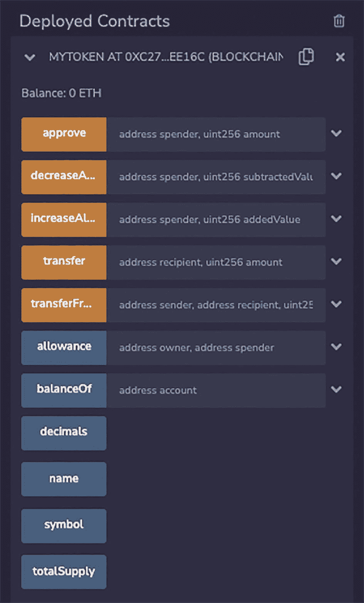

**图 11-11** — ERC-20 代币合约中定义的各种函数

复制已部署的代币合约地址（参见图 11-12）。

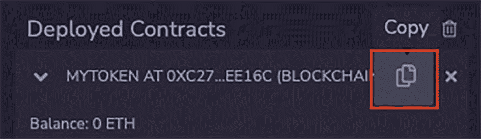

**图 11-12** — 已部署的代币合约（将其地址复制到剪贴板）


### 将代币添加到 MetaMask

在 MetaMask 中，点击**资产**选项卡，然后点击屏幕底部的**导入代币**链接（见图 11-13）。在下一个页面中，粘贴你从 Remix IDE 复制的代币合约地址。代币符号将自动显示。点击**添加自定义代币**按钮。你将看到你的账户拥有 1000 个 WML 代币。请确保你添加代币的账户与部署代币合约的账户是同一个。

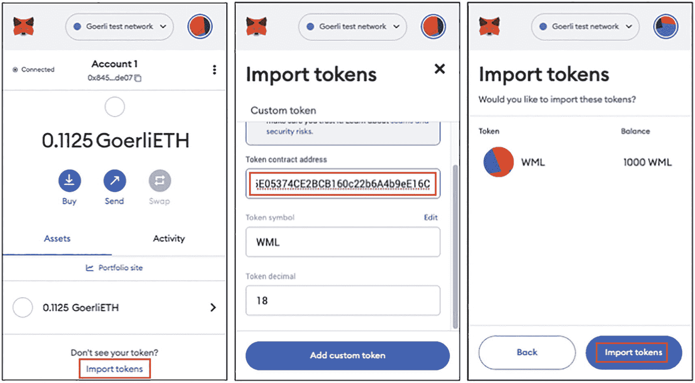

账户 1 的 MetaMask 通知页面的三张截图，显示资产和导入 WML 代币，以及返回和突出显示的导入代币按钮。

**图 11-13** 将代币添加到 MetaMask

### 你能用代币做什么？

既然你已经创建了代币，你能用它做什么呢？由你来为代币创造一种实用功能。你可以将代币推广为一种投资形式，或者是你正在出售的资产（例如房产或证券）的代表。

要出售代币，你可以要求接收方以法定货币向你付款，然后你将代币转移给他们。或者，你也可以编写你的代币合约来接收以太币，然后通过编程方式将代币转移给以太币的发送方。

### 使用代币进行智能合约支付

在本书的第 7 章和第 10 章中，你编写了一个接受以太币作为服务费用的合约（`checkEduCredentials()` 函数）。如果不用以太币，而是接受代币作为支付方式呢？嗯，这很容易实现。让我们修改第 10 章的 `EduCredentialsStore.sol` 合约，添加以下粗体显示的额外语句：

```
// SPDX-License-Identifier: MIT
pragma solidity ⁰.8;
import "./token.sol";
contract EduCredentialsStore {
// 存储合约的所有者
address owner = msg.sender;
MyToken token = MyToken(address(
0xc276658A795E05374CE2BCB160c22b6A4b9eE16C));
//---存储字符串的哈希值及其对应的区块号---
// 键是 bytes32，值是 uint
mapping (bytes32 => uint) private proofs;
//---定义一个事件---
event Document(
address from,
bytes32 hash,
uint blockNumber
);
//==========================================
// 返回合约中的代币余额
//==========================================
function getBalance() public view returns (uint256) {
return token.balanceOf(address(this));
}
//--------------------------------------------------
// 在合约状态中存储存在性证明
//--------------------------------------------------
function storeProof(bytes32 proof) private {
// 使用哈希作为键
proofs[proof] = block.number;
// 触发事件
emit Document(msg.sender, proof, block.number);
}
//----------------------------------------------
// 计算并存储文档的证明
//----------------------------------------------
function storeEduCredentials(string calldata
document) external {
require(msg.sender == owner,
"只有合约所有者才能存储凭据");
// 使用字符串的哈希调用 storeProof()
storeProof(proofFor(document));
}
//--------------------------------------------
// 辅助函数，获取文档的 sha256 哈希值
//--------------------------------------------
// 接收字符串并返回该字符串的哈希值
function proofFor(string calldata document) private
pure returns (bytes32) {
// 将字符串转换为字节数组然后进行哈希
return sha256(bytes(document));
}
//-----------------------------------------------
// 检查文档之前是否已被保存
//-----------------------------------------------
function checkEduCredentials(string calldata
document) public payable returns (uint){
// require(msg.value == 1000 wei,
//   "此调用需要 1000 wei");
// msg.sender 是调用代币合约的账户
// 检查调用者设置的授权额度
uint256 approvedAmt =
token.allowance(msg.sender, address(this));
// 金额基于代币的基本单位
uint requiredAmt = 1000;
// 确保调用者已批准足够的代币支付给合约
require(approvedAmt >= requiredAmt,
"批准的代币额度少于你需要支付的金额");
// 将代币从发送者转移到代币合约
token.transferFrom(msg.sender,
payable(address(this)), requiredAmt);
// 使用字符串的哈希值并检查 proofs 映射对象
return proofs[proofFor(document)];
}
function cashOut() public {
require(msg.sender == owner,
"只有合约所有者才能提现！");
payable(owner).transfer(address(this).balance);
}
}
```

通过添加这些粗体显示的语句，你对 `EduCredentialsStore` 合约做了以下修改：

- 导入 `token.sol` 代币合约。这是你在本章前面部署的代币合约。
- 创建一个 `MyToken` 合约的实例。你需要指定已部署代币合约的地址。
- 添加一个名为 `getBalance()` 的函数。这使你能够了解智能合约持有的代币余额。


修改`checkEduCredentials()`函数，使其不再接受 Ether 支付，而只接受代币支付。为此，首先检查合约调用者已授权给本合约使用的代币数量。然后，确认授权使用的代币数量至少为 1000 base units（这是调用此服务的费用）。如果授权数量足够，则将代币转入本合约。

重新部署`EduCredentialsStore`合约，并记下其地址（见图 11-14）。在示例中，部署的合约地址为`0x913286326233118493F2D5eA62dCA2E90133452B`。

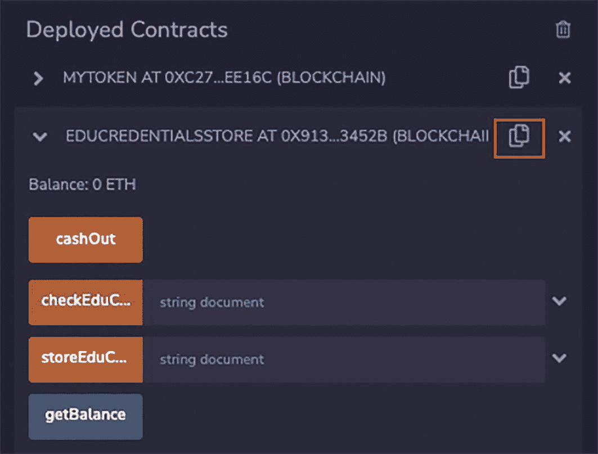

**图 11-14** 重新部署修改后的智能合约以接受代币支付

在调用`checkEduCredentials()`函数（现在要求支付 1000 base units 的代币而非 1000 Wei）之前，代币所有者（即你）需要授权向智能合约支付 1000 base units 的代币。为此，需要使用以下值调用代币合约的`approve()`函数（另见图 11-15）：

```
0x913286326233118493F2D5eA62dCA2E90133452B,1000
```

此值表示你希望授权支出 1000 base units 的代币给指定的智能合约地址（`0x913286326233118493F2D5eA62dCA2E90133452B`）。

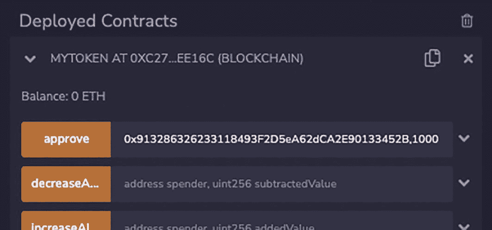

**图 11-15** 授权在智能合约上使用代币

点击**approve**按钮，MetaMask 将显示如图 11-16 所示的提示。点击**Confirm**以批准你的代币在智能合约上使用。

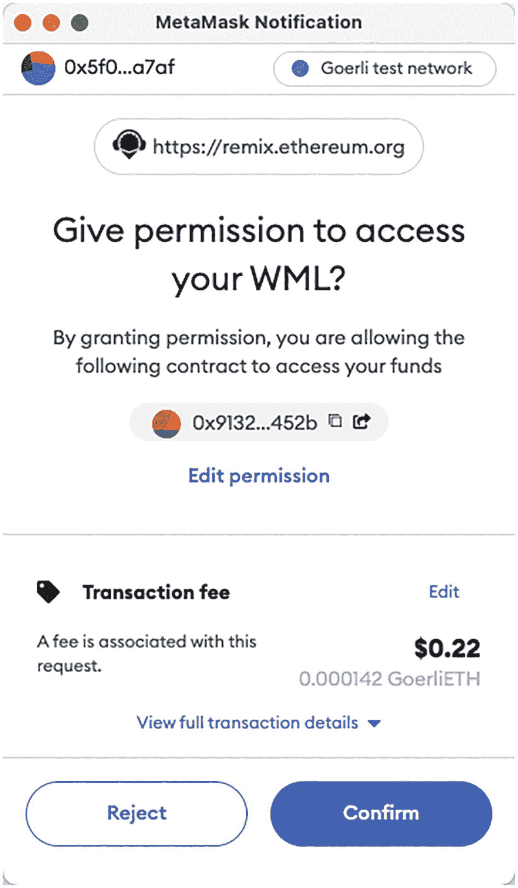

**图 11-16** 授予在智能合约上支出代币的权限

现在可以调用`checkEduCredentials()`函数（见图 11-17）。

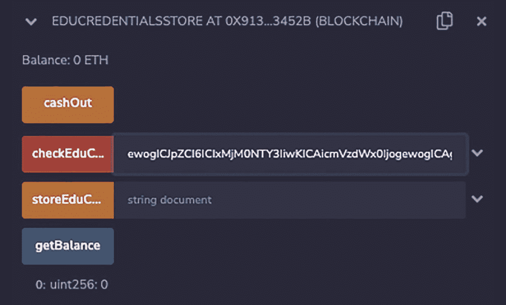

**图 11-17** 调用`checkEduCredentials()`函数

交易确认后，1000 base units 的代币将被转入智能合约。如果在 Etherscan 上查看交易，你会观察到 ERC-20 代币的转账记录（见图 11-18）。

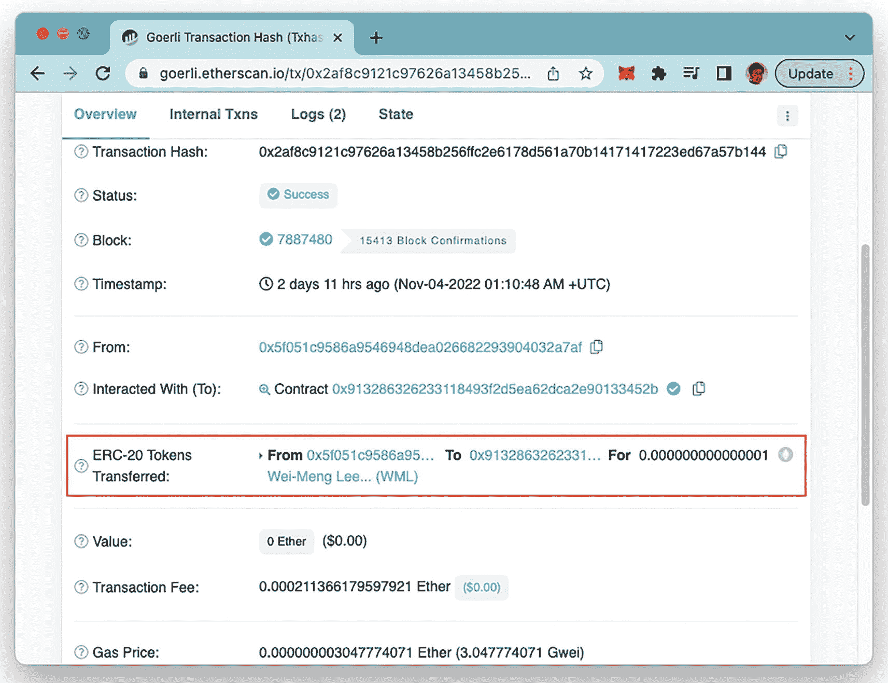

**图 11-18** Etherscan 记录了代币从账户到智能合约的转账

要验证合约确实收到了代币，请点击**getBalance**按钮（见图 11-19）。你应该会看到值为`1000`。

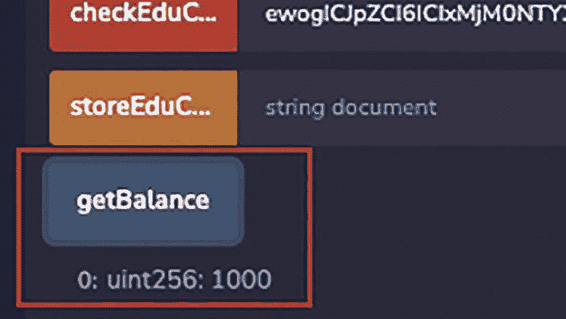

**图 11-19** 查询智能合约中的代币余额

在 MetaMask 中，你还会看到持有代币的账户余额减少了（见图 11-20）。这是因为 1000 base units 的代币已作为支付费用转入了智能合约。

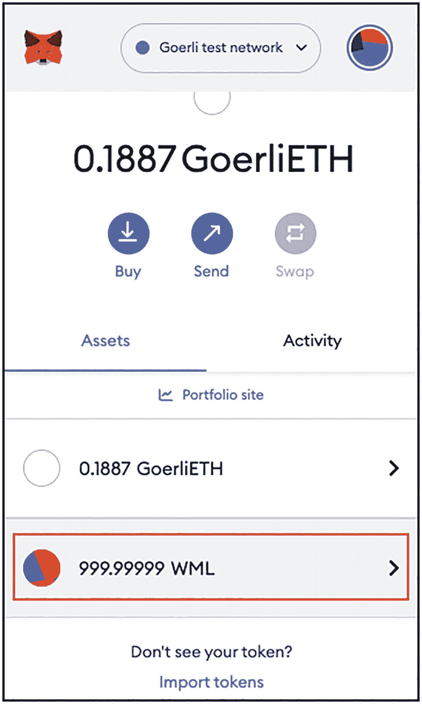

**图 11-20** 账户的代币余额也相应减少

## 以编程方式出售代币

在之前的代币合约中，你了解了代币如何在部署合约时被铸造，以及如何从一个账户转移到另一个账户。一旦账户持有代币，它就可以将代币转移给任意账户。

但是，如何通过代币赚钱呢？在现实世界中，你可能希望出售代币以换取 Ether。事实上，你可以通过直接在代币合约中编写代码来实现这一点。

以下是改进后的代币合约版本，允许使用 Ether 购买代币：

```
// SPDX-License-Identifier: MIT
pragma solidity ⁰.8;
import "https://github.com/OpenZeppelin/openzeppelin-contracts/blob/v4.0.0/contracts/token/ERC20/ERC20.sol";
contract MyToken is ERC20 {
// price expressed as how much an ether can buy
uint256 public unitsOneEthCanBuy  = 10;
// the owner of the token
address public tokenOwner;
constructor(string memory name, string memory symbol)
ERC20(name, symbol) {
// address of the token owner
tokenOwner = msg.sender;
// ERC20 tokens have 18 decimals
// number of tokens minted = n * 10¹⁸
uint256 n = 1000;
_mint(msg.sender, n * 10**uint(decimals()));
}
// this function is called when someone sends ether to the token contract
receive() external payable {
// msg.value (in Wei) is the ether sent to the token contract
// msg.sender is the account that sends the ether to the
// token contract
// amount is the tokens bought by the sender
uint256 amount = msg.value * unitsOneEthCanBuy;
// ensure you have enough tokens to sell
require(balanceOf(tokenOwner) >= amount, "Not enough tokens");
// transfer the token to the buyer
_transfer(tokenOwner, msg.sender, amount);
// emit an event to inform of the transfer
emit Transfer(tokenOwner, msg.sender, amount);
// send the ether earned to the token owner
payable(tokenOwner).transfer(msg.value);
}
}
```

让我们剖析一下上面修改后的合约。

*   首先，使用`unitsOneEthCanBuy`变量定义代币的价格（下一节将更详细地讨论）。
*   需要保存此代币合约所有者的地址，因此声明一个名为`tokenOwner`的变量，并在代币合约的构造函数中初始化它。
*   添加一个名为`receive()`的新函数，并带有`payable`关键字。当 Ether 被发送到合约时，会自动调用`receive()`函数。在此函数内部，会为你自动创建两个变量：
    *   `msg.value`：这是发送到合约的 Wei 数量。
    *   `msg.sender`：这是调用合约的发送者地址。


### 计算购买的代币数量

要出售代币，你需要为其定价。如前所述，你可以定义 `unitsOneEthCanBuy` 变量来间接表示代币的价格，该价格表达为用 1 个以太币可以购买到的代币数量。图 11-21 展示了如何推导出最终公式，即 1 Wei 可以购买 10 个代币（基于 18 位小数的精度单位）。

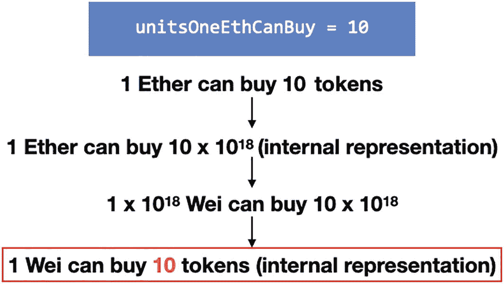

流程图说明，1 Wei 可购买 10 个代币，这是基于 1 个以太币可购买的代币数量得出的。

图 11-21：用以太币表示代币价格

基于这个公式，你现在可以轻松计算出用户向你的代币合约发送以太币时能购买多少代币。图 11-22 展示了当用户向你的代币合约发送 2 个以太币时，会获得多少代币。

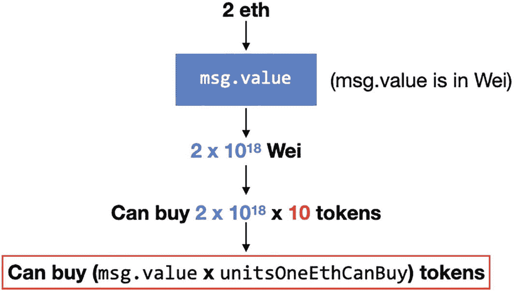

流程图展示，用户使用 2 个以太币的消息价值（以 Wei 为单位）可以购买 2 倍于 10 的 18 次方乘以 10 个代币的数量。

图 11-22：计算买方能购买多少代币

通过以上解释，您现在知道用户可购买的代币数量为：

```
// amount 是发送者购买的代币数量
uint256 amount = msg.value * unitsOneEthCanBuy;
```

为了将代币出售给用户，你需要确保合约拥有足够的代币，因此使用 `require()` 函数进行检查。`require()` 函数的第一个参数是待评估的条件。如果该条件评估为 `false`，则会引发异常，并将第二个参数作为原因：

```
// 确保你有足够的代币出售
require(balanceOf(tokenOwner) >= amount, "Not enough tokens");
```

如果代币合约有足够的代币，则使用 `_transfer()` 函数将代币转移给用户：

```
// 将代币转移给买方
_transfer(tokenOwner, msg.sender, amount);
```

转移完成后，触发 `Transfer()` 事件：

```
// 触发事件以通知转移
emit Transfer(tokenOwner, msg.sender, amount);
```

最后，对于收到的以太币，你需要将其转移给代币所有者：

```
// 将赚取的以太币发送给代币所有者
payable(tokenOwner).transfer(msg.value);
```

> **注意**：这部分很重要！如果不这样做，以太币将永远被困在代币合约中，无法取回！它们将永久丢失！和你的以太币说再见吧！

### 部署合约

让我们再次部署代币合约，使用相同的构造函数参数：

`"Wei-Meng Lee Token"`, `"WML"`

> **注意**：对于我的代币，部署的合约地址是 `0xbf9e3851D5080457a03FCA00F2f9b92C1dDf7190`。

像往常一样，将新创建的代币添加到 MetaMask 中（见图 11-23）。

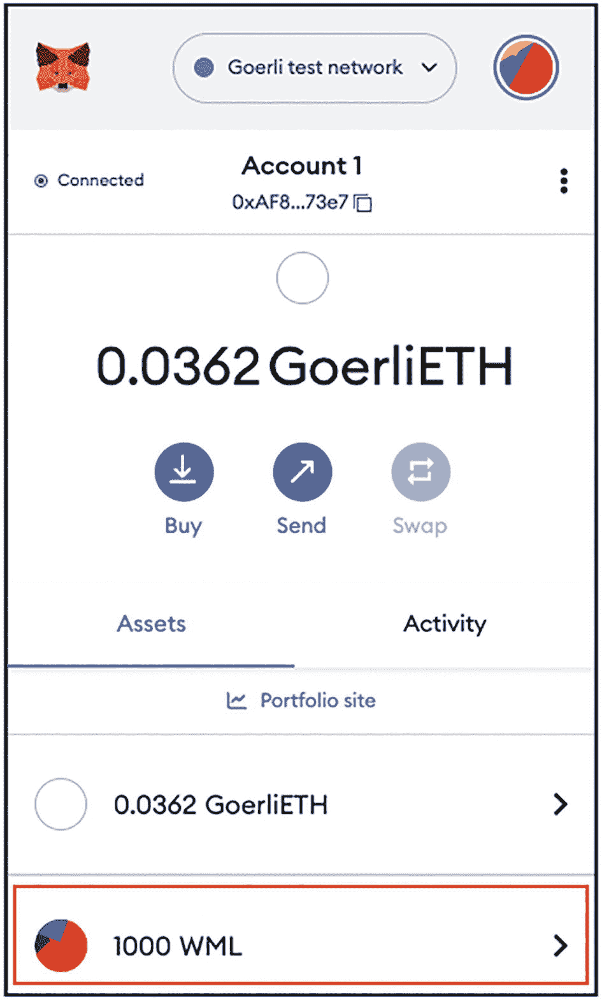

MetaMask 通知页面的截图。它包含 0.0362 Goerli ETH 和资产，其中高亮显示了 1000 WML 代币，以及买入、发送和兑换按钮。

图 11-23：将新添加的代币添加到 MetaMask

> **提示**：您可以通过选择代币、点击三个垂直点，然后点击**隐藏 WML** 来隐藏 MetaMask 中之前添加的代币（见图 11-24）。

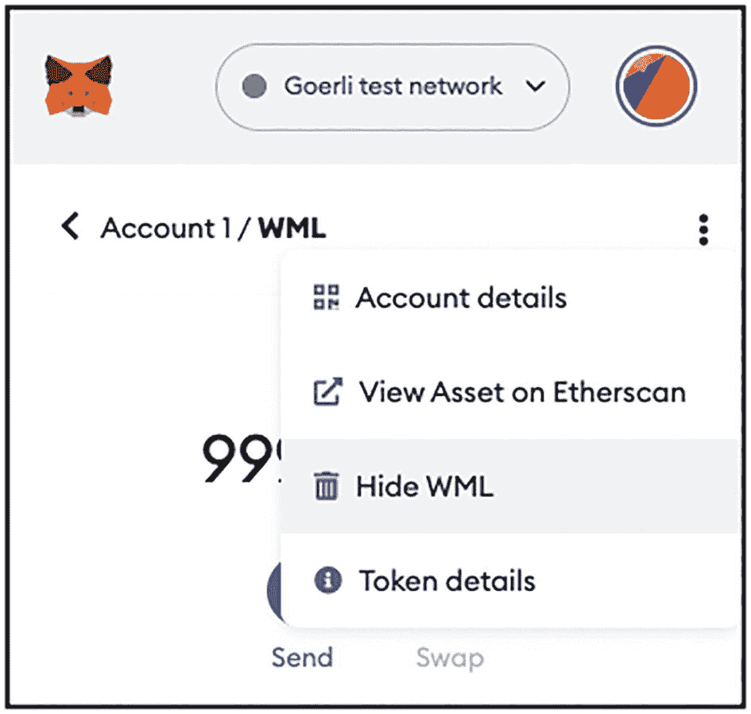

账户 1 的 MetaMask 通知页面截图，列出了账户详情，以及查看 Etherscan 上的资产、隐藏 WML 和代币详情的选项。

图 11-24：隐藏之前添加的代币

切换到另一个账户，并向代币合约发送（使用上一步获取的地址）0.001 以太币（见图 11-25）。您将看到一条关于向代币合约发送以太币的警告。点击**我明白**，然后点击**下一步**，在下一个界面点击**确认**以支付交易费用。

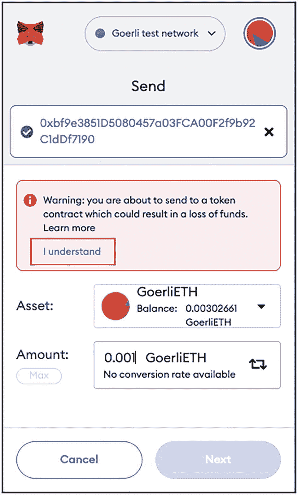

MetaMask 通知页面的截图。它包含代币合约的资产和金额，以及取消按钮。

图 11-25：向代币合约发送以太币

在等待交易确认期间，将新创建的代币添加到当前 MetaMask 账户中。交易确认后，您将在 MetaMask 中看到 0.01 WML 代币（见图 11-26）。

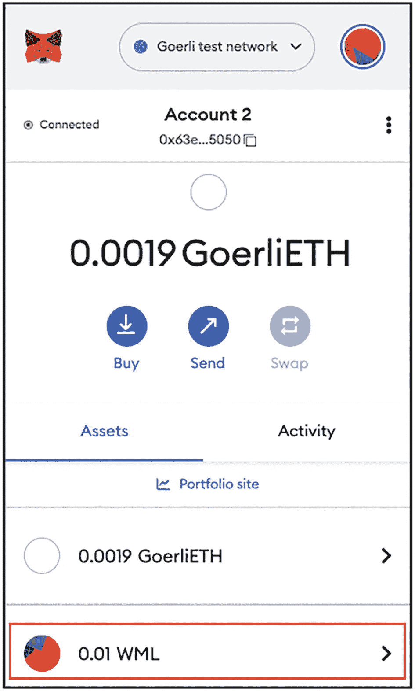

MetaMask 通知页面的截图。它包含 0.0019 Goerli ETH 和资产，其中高亮显示了 0.01 WML 代币，以及买入、发送和兑换按钮。

图 11-26：买方账户中创建的代币

点击 MetaMask 中的交易，在 Etherscan 区块链浏览器上查看交易详情（见图 11-27）。

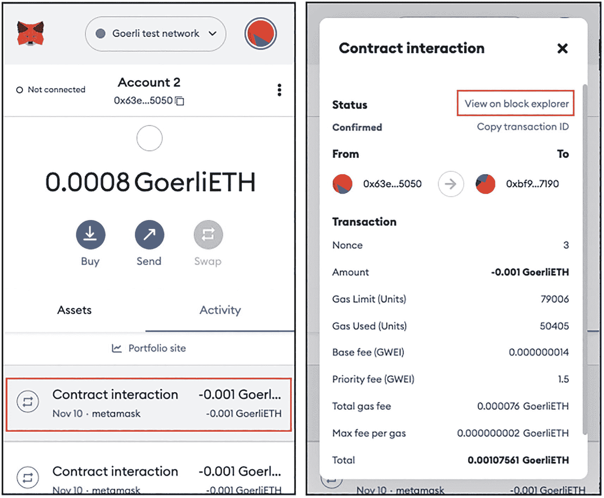

账户 2 的 MetaMask 通知页面截图。它包含 0.0008 Goerli ETH 和活动记录，其中高亮显示了合约交互详情。

图 11-27：选择交易以在 Etherscan 上查看

您将看到合约将收到的 0.001 以太币转移给了合约所有者（见图 11-28）。

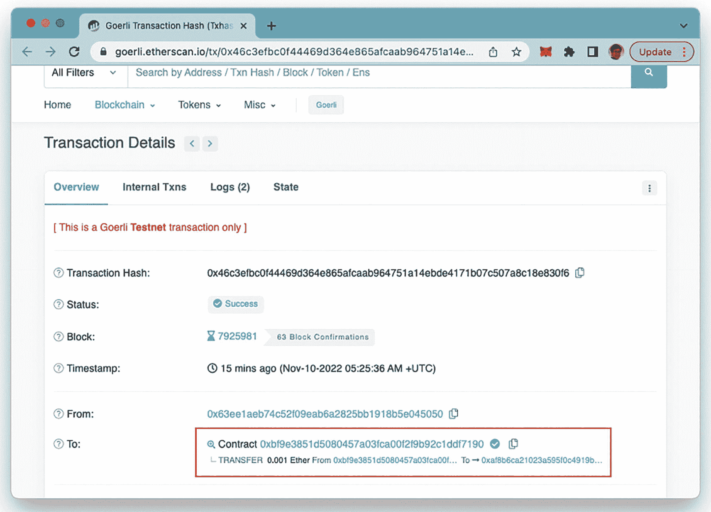

Goerli 交易哈希页面截图，列出了交易详情下的选项，包括交易哈希、状态、区块、时间戳和高亮显示的合约详情。

图 11-28：在 Etherscan 上查看交易

## 本章小结

在本章中，您学习了代币的工作原理，并使用代币合约自己创建了一个代币。您还学习了如何将代币添加到您的 MetaMask 账户，并使用它们支付智能合约服务。最后，您学习了如何修改代币合约，以便人们可以通过向它发送以太币来购买代币。

