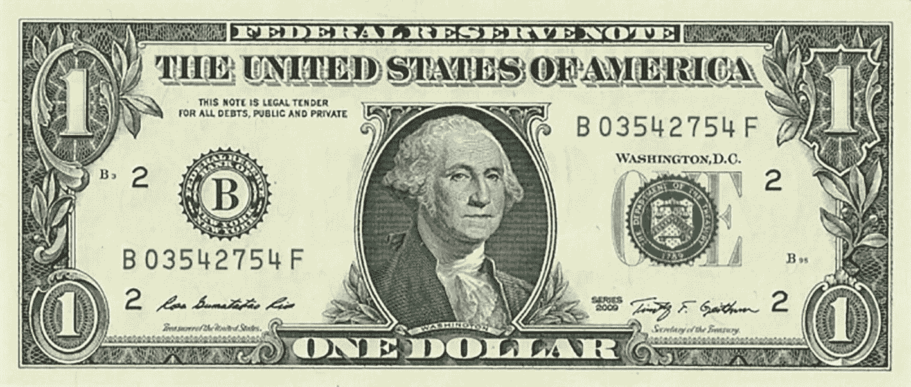
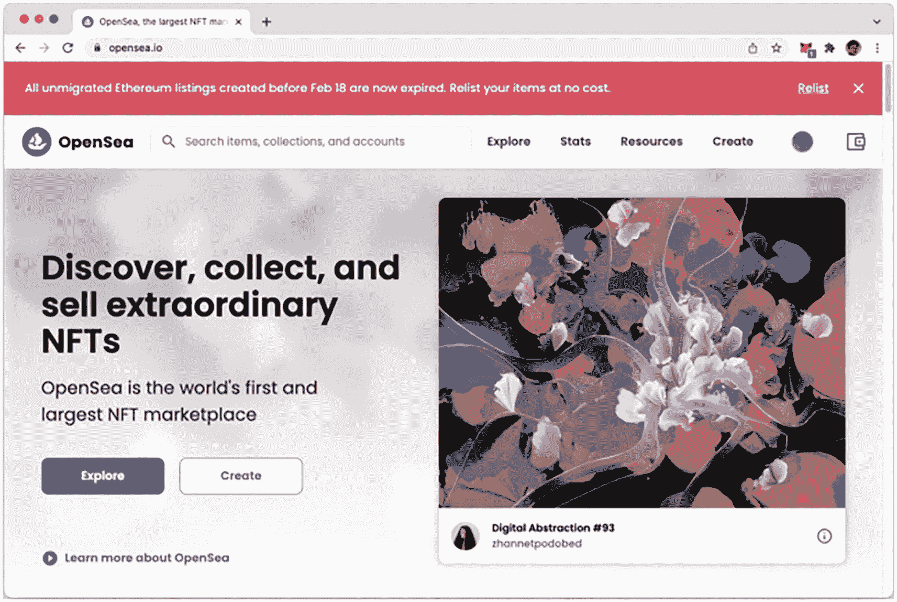

# 什么是 NFT？

在学习什么是 NFT 以及如何铸造 NFT 之前，首先必须理解同质化的含义。*同质化*一词的意思是“其部分或数量可以在偿还债务或结清账目时，由另一等量部分或数量所替代的事物”（来源：[www.merriam-webster.com/dictionary/fungible](http://www.merriam-webster.com/dictionary/fungible)）。

一个典型的同质化物品例子是美元纸币（图 12-1）。

一张 1 美元美国货币的照片。其上印有“联邦储备券”、“美利坚合众国”、“一美元”字样。

**图 12-1** 一张 1 美元纸币（来源：[en.wikipedia.org](https://en.wikipedia.org/wiki/United_States_one-dollar_bill%2523/media/File:US_one_dollar_bill,_obverse,_series_2009.jpg)）

以美元纸币为例，它是同质化的，因为你可以用它来支付任何等值一美元的商品或服务。此外，你也可以用它来兑换 10 个 10 美分硬币。两个人，每人持有一张 1 美元纸币，会很乐意互相交换这笔钱，因为交换后他们仍拥有相同的购买力。

而与之相反，一张棒球卡（见图 12-2）则是*非同质化*的，因为每张卡都有独特属性，对不同的人具有不同的价值。一位棒球卡收藏家可能认为该卡价值 100 万美元，而一位店主可能认为其价值不大，只值 1 美元。

一张弗恩·比克福德戴着帽子的照片。

**图 12-2** 一张棒球卡（来源：[en.wikipedia.org](https://en.wikipedia.org/wiki/Baseball_card%2523/media/File:VernBickford1954Bowman.jpg)）

现在你已经理解同质化的含义，我们来讨论什么是 NFT。NFT 代表*非同质化代币*。NFT 本质上是一条区块链记录（主要在以太坊上，但也存在支持 NFT 的其他区块链），用于记录一件数字艺术品（或任何有价值的物品，但现今大多数 NFT 是如图像、音乐或视频等数字资产）的所有权。NFT 的买家通常获得有限的展示其所代表的数字艺术作品的权利，但在很多方面，他们购买的仅仅是炫耀资本，以及以后可能转售的资产。

> **提示**
> 简言之，NFT 只不过是区块链上的一条独特记录，包含交易记录和指向该数字资产的超链接。

## 所有权 vs. 版权

很多人容易将 NFT 的所有权属性与版权混淆。拥有 NFT 的所有权并不意味着你拥有该物品的版权。当然，数字资产的创建者可以将该资产的知识产权转让给买家，但这种转让必须以书面形式进行。仅仅购买 NFT 并不会自动授予你该物品的版权。一个很好的类比是：购买一张电影 DVD 能让你拥有这部电影，但这并不赋予你复制该 DVD 并卖给朋友的权利。

## 在哪里购买或出售 NFT？

要购买 NFT 或出售你自己的 NFT，你需要前往 NFT 市场。NFT 市场是一个允许你购买/出售 NFT 的在线平台。一些流行的 NFT 市场包括：

OpenSea 网页的截图。文字显示“发现、收藏和出售非凡的 NFT”，下方有两个按钮“探索”和“创建”，旁边是一张抽象图片。

**图 12-3** OpenSea 是流行的 NFT 市场之一

- OpenSea（[`opensea.io`](https://opensea.io)；见图 12-3）
- Rarible（[`rarible.com`](https://rarible.com)）
- Mintable（[`mintable.app`](https://mintable.app)）