# 使用代币合约创建 NFT

顾名思义，NFT 是一种代币，因此它使用称为 `NFT 代币合约`的代币合约。

对于 NFT，你可以使用两种代币合约：

- `ERC-721`：类似于可以创建（同质化）代币的 `ERC-20`，`ERC-721`是另一种允许铸造 NFT 的代币标准。
- `ERC-1155`：一种比 `ERC-20` 更新的 NFT 标准。在 `ERC-1155`中，可以在单次交易中转移多个 NFT，与 `ERC-721`相比，这降低了交易费用。

在本章中，你将重点使用 `ERC-721`标准来创建 NFT。

## 谁部署 NFT 代币合约？

如果你通过像 OpenSea 这样的市场出售 NFT，OpenSea 将使用 `ERC-721`（或 `ERC-1155`）NFT 代币合约自动铸造你的 NFT。但是，你也可以通过编写自己的 NFT 代币合约来铸造，然后通过 OpenSea 列出你铸造的 NFT 进行销售。

## 使用 ERC-721 创建 NFT

现在让我们看看如何使用 `ERC-721` NFT 代币合约铸造 NFT。为此，你将使用 Remix IDE（[`remix.ethereum.org/`](https://remix.ethereum.org/)）。

在 Remix IDE 中，创建一个新合约，并将其命名为 `MyNFT.sol`。然后填充以下代码：

```solidity
// SPDX-License-Identifier: MIT
pragma solidity ⁰.8.0;
import "https://github.com/OpenZeppelin/openzeppelin-contracts/blob/master/contracts/access/Ownable.sol";
import "https://github.com/OpenZeppelin/openzeppelin-contracts/blob/master/contracts/token/ERC721/extensions/ERC721URIStorage.sol";
contract MyNFT is Ownable, ERC721URIStorage {
    // name and symbol
    constructor() ERC721("Learn2develop.net NFT", "DLS") {
    }
    function mint(address recipient, uint256 tokenId,
        string memory tokenURI) public onlyOwner {
        _mint(recipient, tokenId);
        _setTokenURI(tokenId, tokenURI);
    }
}
```

请注意 NFT 代币合约的以下几点：

- 你正在使用来自 OpenZeppelin 的基础 `ERC-721` NFT 代币合约。
- 传递给合约构造函数的参数是 NFT 代币的名称及其符号。你可以将其更改为自己想要的名称和符号。
- `mint()`函数接受三个参数：NFT 所有者地址、代币 ID，以及指向 NFT 详细信息的 `TokenURI`。

## 部署 NFT 代币合约

在 Remix IDE 中编译合约后，转到**DEPLOY & RUN TRANSACTIONS**部分并点击**Deploy**（见图 12-4）。

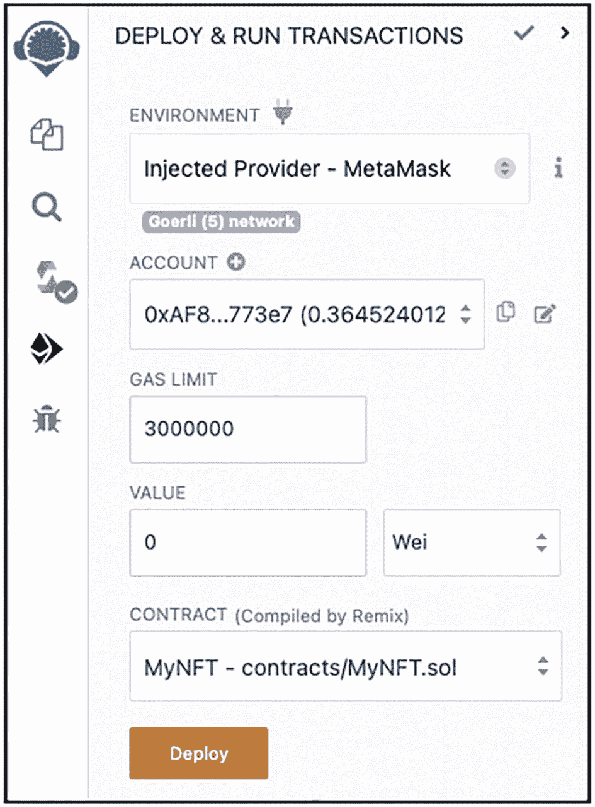

“部署与运行交易”窗口的截图，包含环境、账户的下拉框，Gas 上限为 3000000，值为 0，合约选择为 `MyNFT - contracts`。底部有一个“部署”按钮。

图 12-4
部署 NFT 合约

> **注**
> 在本例中，你将通过 MetaMask 将 NFT 合约部署到 Goerli 测试网。

一旦 NFT 代币合约部署完成，你应该能够展开合约地址并看到函数列表，如图 12-5 所示。

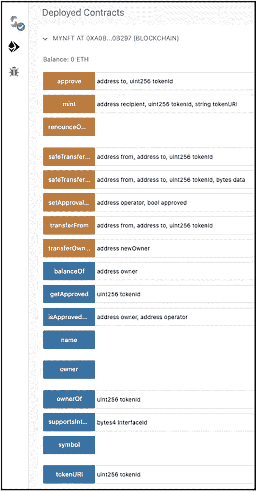

“已部署合约”窗口的截图，包含 `approve`、`mint`、`transferFrom`、`balanceOf`、`owner`、`symbol`、`tokenURI` 等区块。

图 12-5
探索已部署 NFT 合约中的各种函数

### 测试 NFT 合约

在将 NFT 代币合约部署到 Goerli 测试网之后，你现在可以测试该合约了。后续小节假设你拥有以下账户及其关联地址：

- **账户 1**（部署 NFT 代币合约的账户）的地址：`0xAF8b6CA21023A595F0C4919b8B4a9d1F0c1773e7`
- **账户 2**的地址：`0x63eE1AEb74c52f09EaB6a2825bB1918B5e045050`
- **账户 3**的地址：`0xC663D99b0B5D0F6eE163173E6889AA47F787c403`

#### 获取代币的拥有者

点击 **owner** 按钮，你应该会看到**账户 1**的地址，即部署该合约的账户（见图 12-6）。

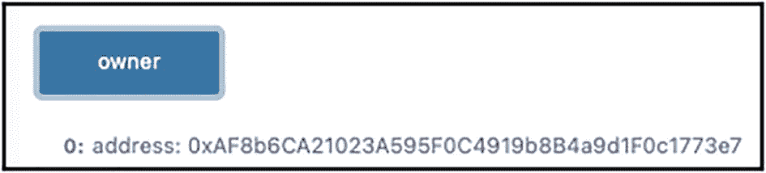

一个显示拥有者的文本框，底部文本显示为 `0: address: 0xAF8b6CA21023A595F0C4919b8B4a9d1F0c1773e7`。

图 12-6
`owner`函数返回部署 NFT 合约的账户地址

#### 准备要作为 NFT 出售的数字资产

假设图 12-7 中的图像是你想要作为 NFT 出售的内容。


蒙娜丽莎的肖像。

图 12-7
待出售为 NFT 的图像（来源：[`https://cdn.britannica.com/w:300,h:169,c:crop/24/189624-050-F3C5BAA9/Mona-Lisa-oil-wood-panel-Leonardo-da.jpg`](https://cdn.britannica.com/w:300,h:169,c:crop/24/189624-050-F3C5BAA9/Mona-Lisa-oil-wood-panel-Leonardo-da.jpg)）

首先，你需要将这份数字资产上传到某个地方。一种选择是使用 IPFS。你可以使用以下页面，通过 **IPFS 网关**上传你的图像：[`https://ipfs-gateway.cloud`](https://ipfs-gateway.cloud)（见图 12-8）。

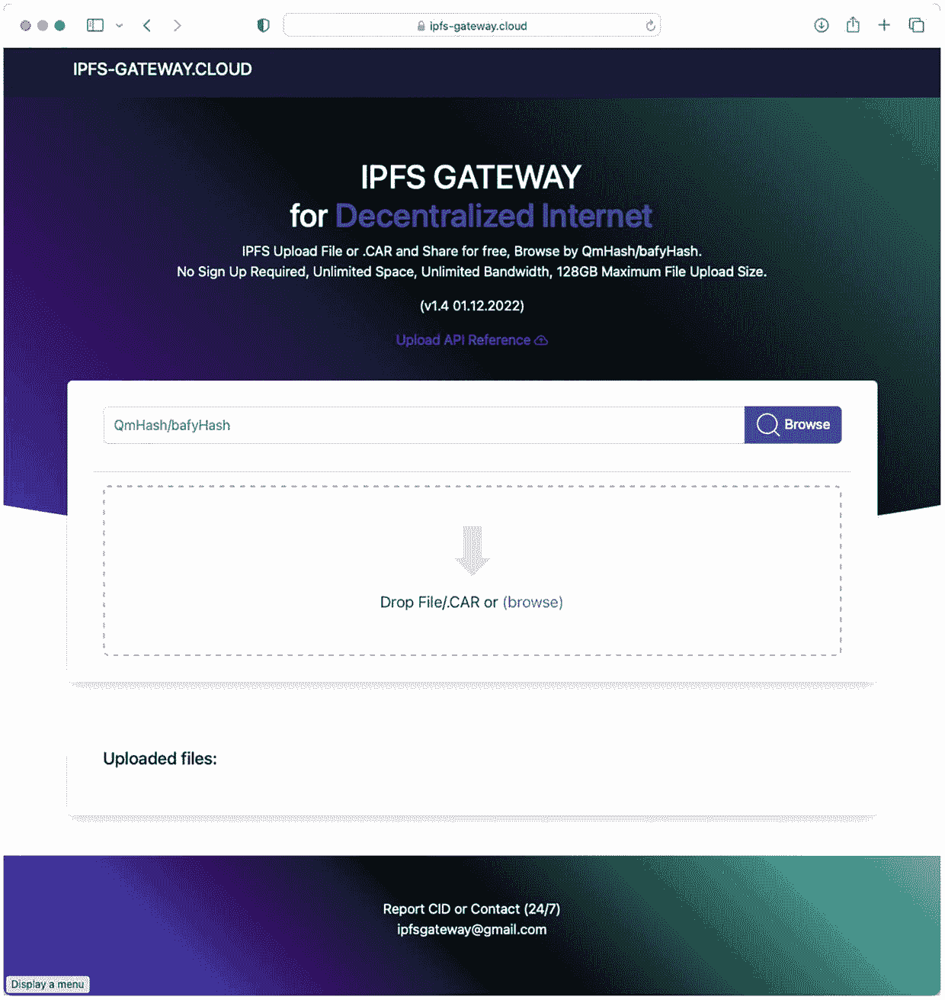

i p f s gateway cloud 网页的截图。在拖放文件框上方显示文字“i p f s gateway for decentralized internet”。

图 12-8
你可以使用 IPFS 网关将图像上传到 IPFS

> **提示**
> IPFS 是一个用于存储和共享文件的点对点网络。类似于区块链中分布式和去中心化节点存储账本（区块的链条），IPFS 中的节点则存储文件。关于 IPFS 的更多信息，请参考我在 [`https://bit.ly/3Gva1Q1`](https://bit.ly/3Gva1Q1) 上关于 IPFS 的文章。

一旦文件上传到 IPFS，你就会获得已上传到 IPFS 的图像的哈希值（称为`内容ID`，简称 `CID`）。你可以使用此哈希值在 IPFS 上获取该文件。

你可以使用 `ipfs.io` 等 IPFS 网关（另一个 IPFS 网关），通过以下格式指定文件位置：[`https://ipfs.io/ipfs/`*<图像哈希值>*](https://ipfs.io/ipfs/%253chash_of_image%253e)。对于你的示例，可以通过此 URL 找到该图像：[`https://ipfs.io/ipfs/QmbjYzobwnXvpHbSBjw8aHYuWYitdr33YyoZGeN7q5J4WC`](https://ipfs.io/ipfs/QmbjYzobwnXvpHbSBjw8aHYuWYitdr33YyoZGeN7q5J4WC)。

> **IPFS 网关**
> IPFS 网关允许网络用户在不运行自己 IPFS 节点的情况下检索 IPFS 网络上的内容。IPFS 网关使用文件的哈希值（称为内容 ID 或 `CID`）来获取 IPFS 网络中的内容。

下一步是为你的 NFT 创建元数据。一个 NFT 元数据文件包含了该 NFT 的详细信息。元数据中所需的最少属性包括：

- `name`：NFT 的名称
- `description`：NFT 的描述
- `image`：指向数字资产的链接

你可以创建一个包含以下内容的 JSON 文件：

```json
{
  "name": "我的 NFT 艺术品",
  "description": "蒙娜丽莎",
  "image": "https://ipfs.io/ipfs/QmbjYzobwnXvpHbSBjw8aHYuWYitdr33YyoZGeN7q5J4WC"
}
```

保存该文件并将 JSON 文件上传到 IPFS。然后，获取指向 IPFS 上元数据文件的 URL。本文示例中，元数据文件位于 [`https://ipfs.io/ipfs/QmfJahEinm6rYNfsDPynF3vm5x4xQiE9EnKW6TnadKhdky`](https://ipfs.io/ipfs/QmfJahEinm6rYNfsDPynF3vm5x4xQiE9EnKW6TnadKhdky)。

> **提示**
> 本质上，你的 NFT 代币合约中的 `TokenURI`将指向此 NFT 元数据文件。

#### 铸造 NFT

在 **mint** 按钮旁边显示的文本框中，输入以下字符串：

```
0xAF8b6CA21023A595F0C4919b8B4a9d1F0c1773e7,1,https://ipfs.io/ipfs/QmfJahEinm6rYNfsDPynF3vm5x4xQiE9EnKW6TnadKhdky
```


一个文本框，内容为 `mint 0xAF8b6CA21023A595F0C4919b8B4a9d1F0c1773e7,1,https://ipfs.io/ipfs/QmfJahEinm6rYNfsDPynF3vm5x4xQiE9EnKW6TnadKhdky`。

图 12-9
为账户 1 铸造 NFT

该字符串的格式为：`<NFT 的拥有者>,<代币 ID>,<TokenURI>`。在这个字符串中，账户 1 被铸造了一个代币 ID 为 1 的代币，NFT 元数据的链接位于 [`https://ipfs.io/ipfs/QmfJahEinm6rYNfsDPynF3vm5x4xQiE9EnKW6TnadKhdky`](https://ipfs.io/ipfs/QmfJahEinm6rYNfsDPynF3vm5x4xQiE9EnKW6TnadKhdky)。这意味着账户 1 现在是该 NFT 的拥有者。

> **注意**
> `TokenID`是一个可指定的数字，用于在 NFT 代币合约中唯一标识该 NFT。`TokenURI`通常是一个指向 NFT 元数据位置的 URL。NFT 的常见存储位置是 IPFS。或者，`TokenURI`也可指向像 Opensea 这样的 NFT 市场。

点击 **mint** 按钮，MetaMask 会提示你确认交易。

> **提示**
> 请注意，此铸造操作只能由 NFT 代币合约的拥有者执行，也就是部署它的账户（本例中为账户 1）来执行。

#### 获取 NFT 代币合约的名称和符号

要获取 NFT 代币合约的名称和符号，请点击 **name** 和 **symbol** 按钮（见图 12-10）。

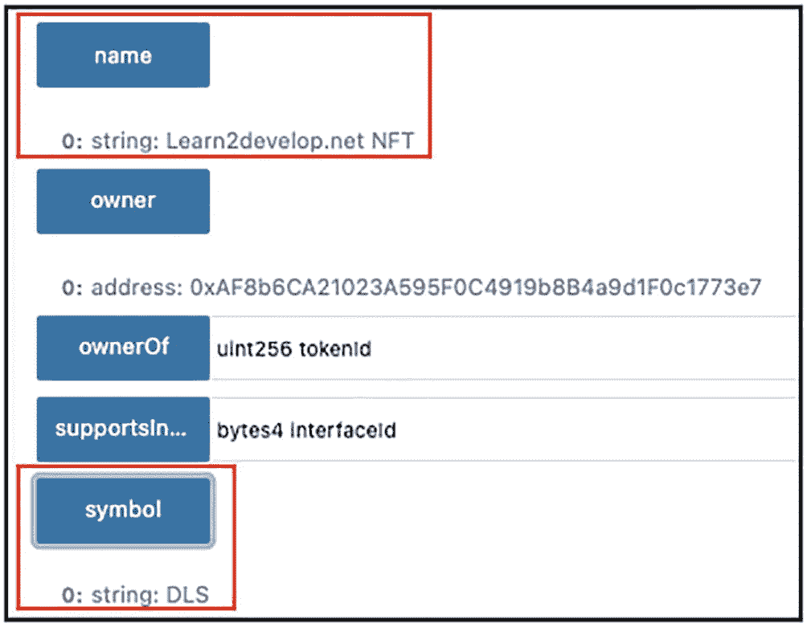

一个包含 `name`、`owner`、`ownerOf`、`supportsInterface`、`symbol` 等文本块的文本框。其中 `name` 和 `symbol` 文本块用方框高亮显示。

图 12-10
获取 NFT 合约的名称和符号

#### 查找某个地址的 NFT 余额

要知道某个特定地址在 NFT 代币合约中持有多少 NFT，请输入该账户地址并点击 **balanceOf** 按钮（见图 12-11）。

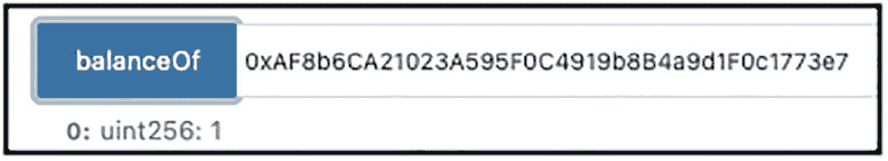

一个文本框，显示余额为 `0xAF8b6CA21023A595F0C4919b8B4a9d1F0c1773e7`，底部显示 `0: uint256: 1`。

图 12-11
查找某个账户拥有的 NFT 数量

在此示例中，你可以看到账户 1 当前在 NFT 代币合约中拥有一个 NFT。

#### 获取 NFT 的拥有者

要知道在 NFT 代币合约中，某个特定 NFT（基于代币 ID）属于谁，请输入代币 ID 并点击 **ownerOf** 按钮（见图 12-12）。

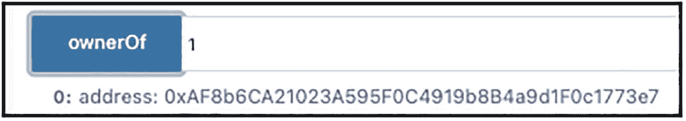

一个文本框，显示 `owner 1`，底部显示 `?0: address: 0xAF8b6CA21023A595F0C4919b8B4a9d1F0c1773e7`。

图 12-12
找出特定 NFT 的拥有者

此输出显示代币 ID 1 当前由账户 1 拥有。

#### 获取 NFT 的 TokenURI

要获取 NFT 的 `TokenURI`，请输入该 NFT 的令牌 ID，然后点击 `tokenURI`按钮（见图 12-13）。

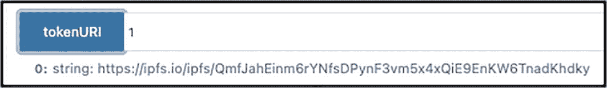

底部显示了一个包含令牌 URI 和 `https://ipfs.io/ipfs/QmfJahEinm6rYNfsDPynF3vm5x4xQiE9EnKW6TnadKhdky`的文本框。

**图 12-13** 获取 NFT 的 token URI

此输出表明，令牌 ID 1 的 `TokenURI`当前设置为 [`https://ipfs.io/ipfs/QmfJahEinm6rYNfsDPynF3vm5x4xQiE9EnKW6TnadKhdky`](https://ipfs.io/ipfs/QmfJahEinm6rYNfsDPynF3vm5x4xQiE9EnKW6TnadKhdky)，这是 NFT 元数据文件的路径。

#### 将 NFT 转移到另一个账户

要将 NFT 转移到另一个账户，请在 `transferFrom`按钮旁边的文本框中按以下格式输入字符串：`<要转出的账户>,<要转入的账户>,<令牌 ID>`。

以下字符串将 NFT 从账户 1 转移到账户 2（见图 12-14）：

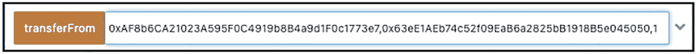

一个文本框，内容为从 `0xAF8b6CA21023A595F0C4919b8B4a9d1F0c1773e7,0x63eE1AEb74c52f09EaB6a2825bB1918B5e045050,1` 转移。

**图 12-14** 将 NFT 从账户 1 转移到账户 2

```
0xAF8b6CA21023A595F0C4919b8B4a9d1F0c1773e7,0x63eE1AEb74c52f09EaB6a2825bB1918B5e045050,1
```

> **提示：** 请注意，转移 NFT 代币只能由该 NFT 代币的所有者执行，在本例中为账户 1。

当你点击 `transferFrom`按钮时，MetaMask 会提示你确认交易（见图 12-15）。请注意，MetaMask 中会显示该 NFT 的图像。

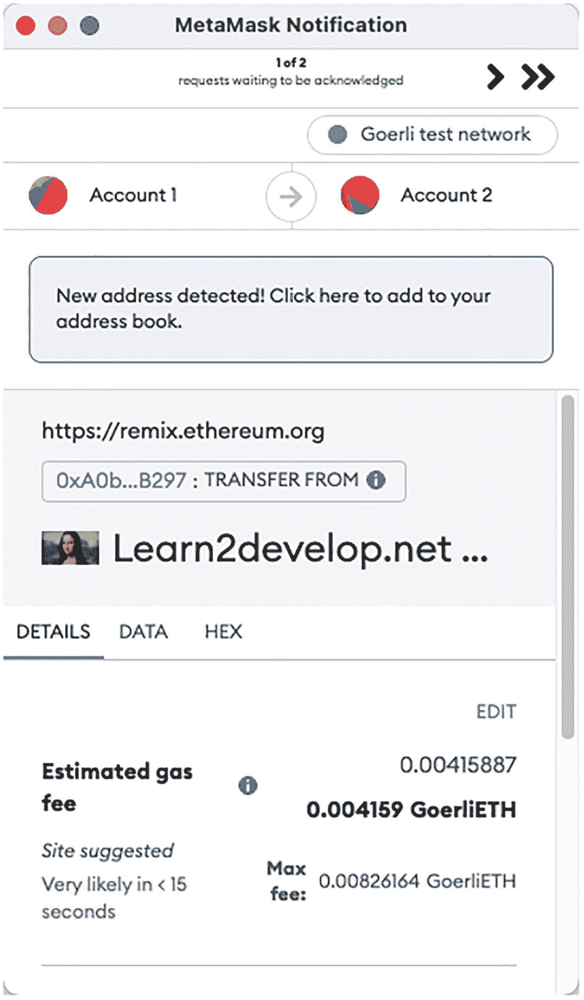

MetaMask 通知窗口的截图。顶部显示账户 1 和账户 2，底部有详情、数据和十六进制选项卡，下方显示预估 Gas 费文本。

**图 12-15** 当你执行 NFT 所有权转移时，MetaMask 会显示该 NFT 的图像

一旦交易确认，输入令牌 ID 1，然后点击 `ownerOf`按钮，将确认该 NFT 现在属于账户 2（见图 12-16）。

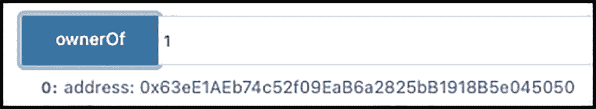

一个 `ownerOf`文本框，底部显示 `0x63eE1AEb74c52f09EaB6a2825bB1918B5e045050`。

**图 12-16** 确认 NFT 的所有权

如果你点击 `balanceOf`按钮并输入账户 1 的地址，你会看到账户 1 不再持有任何 NFT（见图 12-17）。

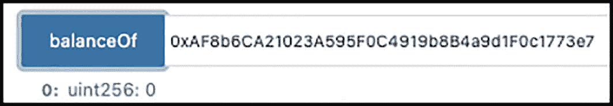

一个 `balanceOf`文本框，底部显示 `0xAF8b6CA21023A595F0C4919b8B4a9d1F0c1773e7`和`0`。

**图 12-17** 账户 1 不再持有任何 NFT

> **提示：** 既然账户 2 是 NFT 代币的新所有者，如果账户 2 希望将此 NFT 代币转移到另一个账户（例如账户 3），你需要在 MetaMask 中切换到账户 2，然后再点击 Remix IDE 中的 `transferFrom`按钮。

#### 转移合约的所有权

回想一下，我之前提到只有 NFT 代币合约的所有者才能铸造新的 NFT。如果你想将此 NFT 代币合约的所有权转移给账户 3，请在`transferOwnership`按钮旁边的文本框中输入账户 3 的地址，然后点击该按钮（见图 12-18）。

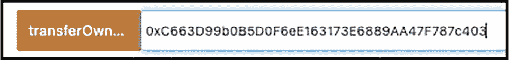

一个`transferOwnership`文本框，内容为`0xC663D99b0B5D0F6eE163173E6889AA47F787c403`。

**图 12-18** 将 NFT 合约的所有权转移给账户 3

> **提示：** 请注意，此操作只能由 NFT 代币合约的所有者执行，即部署该合约的账户（本例中为账户 1）。

你可以通过点击`owner`按钮来验证 NFT 代币合约现在属于账户 3（见图 12-19）。

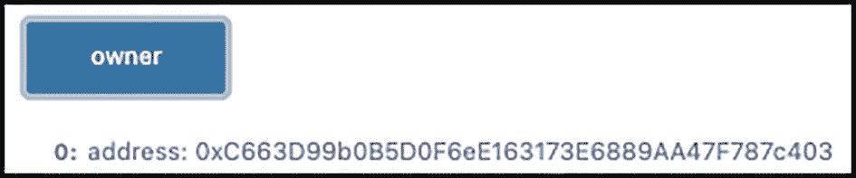

一个`owner`文本框，底部显示`0xC663D99b0B5D0F6eE163173E6889AA47F787c403`。

**图 12-19** 验证 NFT 合约的所有权

## 本章小结

在本章中，你学习了什么是 NFT 以及它是如何工作的。通过使用 ERC-721 合约，你学习了如何铸造 NFT、转移其所有权以及验证其所有权。希望本章能让你对什么是 NFT 以及如何自己创建一个 NFT 有更清晰的认识。