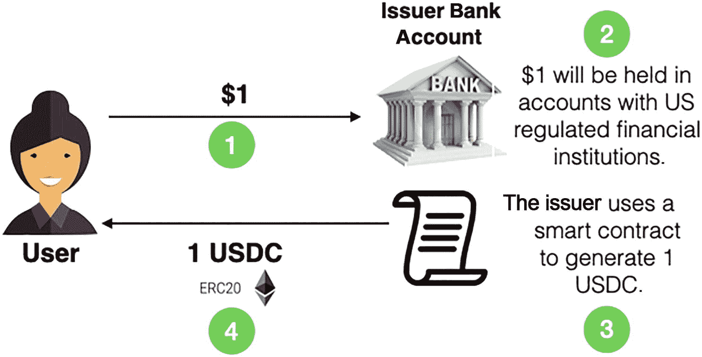
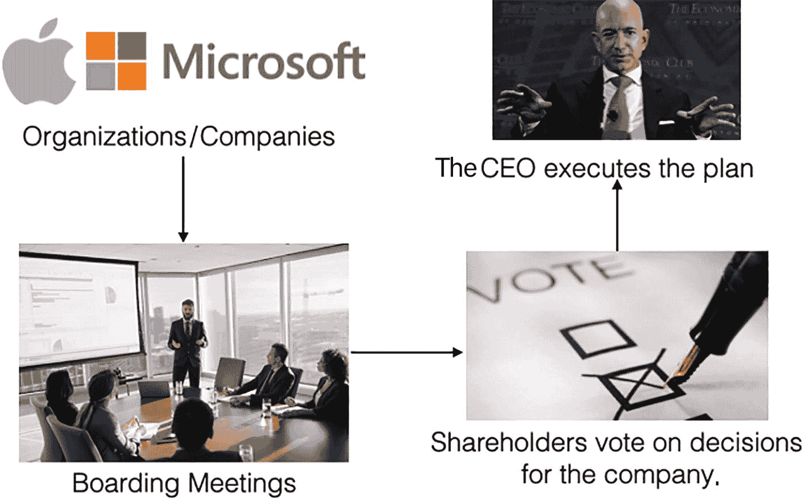
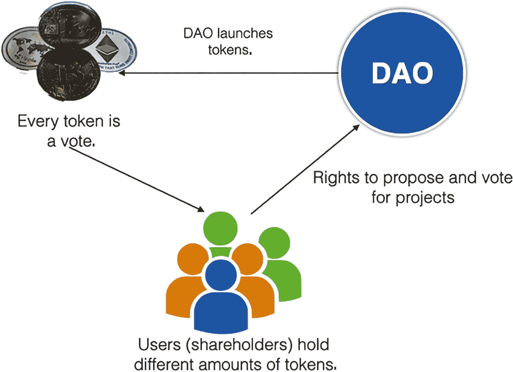
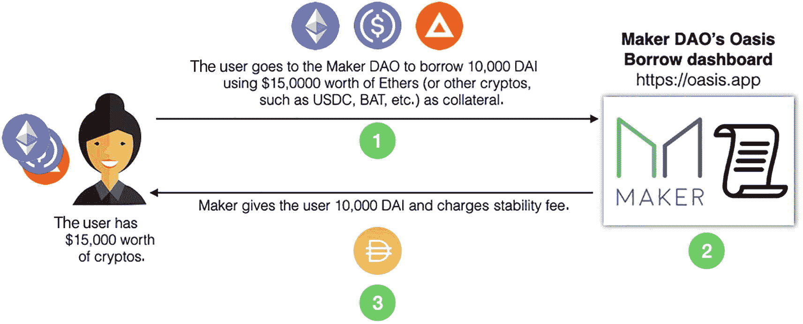
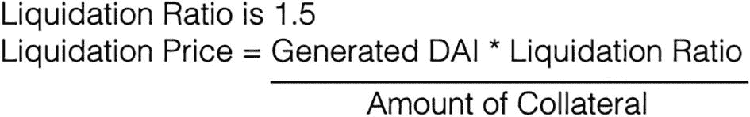

# 13. 去中心化金融入门

我们今天非常熟悉的金融体系被称为`传统金融`。它在很大程度上仍然是中心化的，因为其仍然依赖中央机构，主要是银行和政府。然而，传统金融存在若干缺陷，我将在本章中讨论这些问题。

在第 2 章中，你了解了区块链背后的动机，以及它如何解决人们对中央机构的信任问题。利用区块链，我们可以构建一个称为`去中心化金融`（DeFi）的新金融体系。

在本章中，我将首先比较传统金融和 DeFi 之间的差异，然后向你介绍 DeFi 的一个关键组成部分：`稳定币`。你还将学习如何构建一个去中心化交易所（DEX），以便将一种类型的代币兑换成另一种类型。

## 传统金融的局限性

如今，我们在传统金融中会进行一些常见的活动：
*   资金转账
*   贷款
*   储蓄计划
*   保险
*   股票市场

然而，传统金融存在一些问题/局限性：
*   有些人无法创建银行账户并获取金融服务。例如，由于制裁，某些政治人物可能无法获得金融服务。林郑月娥（香港前领导人）就是一个很好的例子。在美国因中国在香港实施严厉的国家安全法而对其实施制裁后，她无法获得银行服务。
*   金融服务的隐性收费是你的个人数据。你的财务信息并非秘密；银行里的人知道你有多少资产，并会持续监控你，以便向你推销金融产品。
*   政府和中心化机构可以随意关闭市场。一个很好的例子发生在 2022 年，当时加拿大政府警告说，将冻结与渥太华持续的反强制疫苗抗议活动有关联者的银行账户。
*   资金转账耗时且成本过高。从一个国家汇款到另一个国家通常需要几个工作日，而且银行通常会收取高额交易费。

### 去中心化金融

通过区块链，我们现在可以拥有一个为互联网时代构建的开放、全球性的金融体系，即去中心化金融（DeFi）。DeFi 是传统金融体系的一种替代方案，传统金融体系不透明、受到严格控制，并且是使用数十年前的技术和系统构建的。

有了 DeFi，我们现在可以：
*   消除（或减少）银行和其他金融公司因使用其服务而收取的费用
*   有更多选择向世界上任何人借款，而不仅仅是银行
*   将我们的资金存放在安全的数字钱包中，而不是存放在银行
*   无需获得任何人批准即可使用我们的资金
*   在数秒或数分钟内完成资金转账

### DeFi 的组成部分

要实现 DeFi，需要以下关键组成部分：
- **去中心化基础设施**：一个区块链实现，例如以太坊
- **支持智能合约的以太坊**：一个很好的例子是 `ERC-20` 代币标准，它允许您构建`同质化`代币。
- **稳定币**：稳定币是一种同质化代币，通常与某种资产（如美元、加密货币、黄金等）挂钩。稳定币也可以不锚定任何资产，其价格通过智能合约按算法进行调整。

稳定币在 DeFi 中扮演着非常重要的角色，因为它们不仅取代了法定货币；它们在 DeFi 借贷市场中也是日益重要的资产，用户可以将自己的稳定币锁定在诸如 `Compound` 和 `Aave` 这样的平台中，并赚取年化收益率 0.15% 至 12% 的贷款利息。

> **提示**
> `Compound` 和 `Aave` 都是去中心化的加密货币协议，允许用户借出和借入加密货币。

在下一节中，您将了解更多关于稳定币以及当今存在的不同类型的信息。

## 稳定币

在第 11 章中，您了解了 `ERC-20` 规范，它可以用来创建您自己的代币。您还了解到，代币可以作为一种投资形式，并用于支付智能合约服务。在本节中，您将了解代币在现实世界中的一种具体实现，通常被称为`稳定币`。

那么，到底什么是稳定币？稳定币是一种加密货币，其价格锚定于某种参考资产，例如法定货币、其他加密货币或黄金。顾名思义，稳定币旨在抵御其他加密货币无法承受的价格波动。

> **注意**
> 稳定币的全部目的在于通过保持稳定性来最小化价格波动。

### 稳定币背后的动机

要真正理解稳定币背后的动机，您只需看看比特币就知道了。在 2011 年，一 `BTC`（比特币）价值大约 1 美元。然而，在 2021 年的峰值时，一 `BTC` 价值超过 65,000 美元。想象一下，在 2011 年用四 `BTC` 支付两杯星巴克咖啡的费用。同样的四 `BTC` 在 2021 年可以为您买一辆法拉利！

显然，由于价格的剧烈波动，将比特币用作法定货币替代品的目标是不可行的！

稳定币主要有三种类型：
- **法币抵押稳定币**：由 `USD`、`EUR`、`GBP` 或其他法定货币支持的稳定币
- **加密货币抵押稳定币**：由其他加密货币如以太坊和比特币支持的稳定币
- **无抵押稳定币**：也称为算法稳定币，这类稳定币不持有任何形式的抵押品。为了保持价值稳定，它们依赖智能合约，根据市场需求改变稳定币的供应量。
- **商品抵押稳定币**：由黄金等商品支持的稳定币。一个代币等值于一单位所锚定的商品（例如一盎司黄金）。

以下各节将更详细地讨论前三种类型的稳定币。

### 法币抵押稳定币

法币抵押稳定币是一种由法定货币（如美元、欧元或英镑）支持的稳定币。法币抵押稳定币的一个很好的例子是 **USD Coin** (`USDC`)。

> **注意**
> USD Coin 由一个名为 Centre 的联盟管理，该联盟由 Circle 创立，成员包括加密货币交易所 Coinbase 和比特币挖矿公司 Bitmain（Circle 的投资方）。

图 13-1 显示了 USDC 的工作方式。

*示意图展示了用户将 1 美元存入发行人的银行账户，这 1 美元将被保存在美国监管金融机构的账户中，发行人使用智能合约生成 1 个 USDC 并将其发送给用户。*

**图 13-1** – 购买 USDC 时发生的情况

购买 USDC 的步骤：
1. 用户将 1 美元发送到发行人的银行账户。
2. 这 1 美元将被保存在美国监管的发行人银行账户中。
3. 发行人使用智能合约生成一个 `USDC` `ERC-20` 代币。
4. 然后 `USDC` 代币被转移到用户的钱包中。

那么，您为什么要购买 USDC？使用 USDC，您无需传统银行账户，即可廉价且近乎即时地向全球任何地方汇款（相对于可能费用高昂且耗时数日的电汇，这是一个巨大的进步）。您还可以通过在 Coinbase 账户中持有的 USDC 获得奖励。此外，您还可以通过在各种去中心化金融 (DeFi) 应用程序中借出您的 USDC 来获得更高的收益。

#### 法币抵押稳定币示例

除了 USDC，其他法币抵押稳定币的例子还包括 **BUSD** (`Binance USD`)、**TUSD** (`True USD`) 和 **USDT** (`USD Tether`)。

### 加密货币抵押稳定币

下一种类型的稳定币是加密货币抵押稳定币。加密货币抵押稳定币不是将稳定币与法定货币挂钩，而是与某些加密货币挂钩。

加密货币抵押稳定币的一个很好的例子是 **DAI**。`DAI` 是一种运行在以太坊上的加密货币抵押稳定币，旨在保持每个代币的价值为 1 美元。与法币抵押稳定币不同，`DAI` 不由银行账户中的美元支持。相反，它由 `Maker DAO` 平台上的加密货币抵押品支持。`Maker DAO` 是一个以太坊区块链上进行借贷、储蓄以及发行稳定加密货币的技术开发组织。

> **提示**
> `DAO` 代表去中心化自治组织。

#### 到底什么是 `DAO`？

`DAO` 的核心思想是，它是一个被设计为由代码（在以太坊世界中本质上就是智能合约）自动运行和管理的组织。乍一看，`DAO` 的想法似乎很奇怪。但让我们看看当今组织是如何运作的（图 13-2）。

*示意图以苹果和微软的组织或公司开始，引出董事会会议，股东对公司决策进行投票，CEO 执行计划。*

**图 13-2** – 当今组织的运作方式

一个典型的组织有董事会成员，他们召开董事会会议来讨论和规划公司的战略方向。董事会做出的重大决策必须得到股东批准，股东对公司的决策进行投票。投票统计完成后，公司的 CEO 执行该计划。

而一个 `DAO` 则没有董事会成员。相反，`DAO` 是使用智能合约创建的。`DAO` 的核心是 `DAO` 的代币，该代币用于管理组织内的成员资格以及 `DAO` 内部的结构（图 13-3）。

*示意图显示拥有不同数量代币的用户，他们有权提议 DAO 和投票选择项目，然后 DAO 启动代币。*

**图 13-3** – `DAO` 的运作方式

`DAO` 中的每个成员可以持有不同数量的代币，这赋予了他们提议和投票选择项目的投票权。

> **提示**
> 要了解更多关于 `DAO` 的信息，请查阅我在 [`https://bit.ly/3iviryS`](https://bit.ly/3iviryS) 上的文章。

#### DAI 的工作原理

图 13-4 展示了用户如何购买 DAI。

这张图表展示了用户与 Maker DAO 的 Oasis 借款面板之间的交互关系。用户持有价值 15,000 美元的加密货币，前往 Maker DAO，使用价值 15,000 美元的以太币作为抵押品，生成 10,000 DAI。Maker 将 10,000 DAI 提供给用户，并收取稳定费。

**图 13-4** 当你购买 DAI 时会发生什么

1. 用户前往 Maker DAO，使用价值 15,000 美元的加密货币（例如以太币、BAT 等）借入 10,000 DAI。这些加密货币将作为所借 10,000 DAI 的抵押品。
2. Maker DAO 为用户生成 10,000 DAI。
3. Maker DAO 将 10,000 DAI 发送给用户，并向用户收取稳定费。

> **提示**
> 据 Maker DAO 的创始人 Rune Christensen 称，DAI 基于汉字“貸”，意为“借出或贷款”。

在这个例子中，以太币的`抵押率`为 150%（其他加密货币的抵押率各不相同）。这种超额抵押机制是为了应对加密货币的波动性。

DAI 的价格通过一个自动执行的智能合约系统来维持稳定。如果 DAI 的价格偏离一美元过远，Maker DAO 将调整利率以稳定 DAI 的价格。

> **提示**
> 你还可以从所有主流交易所（如 Kraken 和 Coinbase）购买 DAI。你可以使用法定货币兑换 DAI，或者出售部分加密资产来换取 DAI。

#### DAI 如何保持稳定？

Maker DAO 控制着 DAI 的智能合约，包括可接受的抵押品类型、抵押率以及利率。当 DAI 的价格低于 1 美元时，Maker DAO 会提高贷款的利率。这会激励客户抛售其持有的 DAI 并结清贷款。被归还的 DAI 随后被销毁，从而减少供应量，推动 DAI 价格回升；反之，当 DAI 价格高于 1 美元时，则会采取相反的措施。

对智能合约的所有更改对所有区块链参与者都是透明的，因此这是完全去中心化的。

DAI 既可以用于支付智能合约的费用，也可以用于产生被动收入。你可以将你的 DAI 存入一个`DAI 储蓄率`（DSR）计划来赚取利息。

#### 加密货币抵押型稳定币示例

除了 DAI 之外，其他加密货币抵押型稳定币的例子还包括 `WBTC`（Wrapped Bitcoin）和 `MIM`（Magic Internet Money）。

#### DAI 的清算

由于 DAI 使用加密货币作为抵押品，而加密货币价格波动剧烈，如果以太币价格下跌会发生什么？在这种情况下，Maker DAO 会执行一个称为`清算`的过程。图 13-5 展示了清算的公式。

一个等式显示：`清算率 = 1.5`，`清算价格 = （生成的 DAI * 清算率） / 抵押品数量`。

**图 13-5** 计算清算价格的公式

以下是公式中各个变量的含义：
*   `清算率`是指用于抵押 DAI 的加密货币等价价值与 DAI 的比率。如果价值 1.5 美元的加密货币兑换 1 DAI，那么清算率就是 1.5。
*   `清算价格`是指抵押品将被拍卖，并将余额返还给 DAI 购买者的价格。
*   `生成的 DAI` 是为用户生成的 DAI 数量。
*   `抵押品数量`是指用作抵押品的加密货币单位（例如 1 个或 2 个以太币等）。

让我们通过一个例子来理解清算是如何运作的。在撰写本文时，`清算率`为 **1.5**，这意味着如果 1 个以太币目前价值 150 美元，它可以兑换 100 个 DAI。由此，`清算价格`将是 `(100 DAI * 1.5) / 1 以太币 = 150 美元`。

> **提示**
> 清算价格意味着，如果一个以太币跌破 150 美元，该金库将被关闭，抵押品将被拍卖。Maker 协议通过称为 Maker`金库`的智能合约生成新的 DAI。

如果 1 个以太币跌至，比如说，140 美元（<150 美元），金库就会被清算！因此，建议不要提取所有生成的 DAI。假设只提取了 90 DAI，那么`清算价格`变为 `(90 * 1.5) / 1 = 135 美元`。因此，即使以太币跌至 140 美元，也不会发生清算。

为了防止清算，你可以：
*   `增加更多抵押品`：假设你增加了更多抵押品（例如，额外增加 0.5 个以太币），那么清算价格将变为 `(100 * 1.5) / 1.5 = 100 美元`。这大大降低了清算价格。
*   `偿还 DAI`：假设你现在偿还 20 DAI（从一笔 100 DAI 的贷款中），那么清算价格将变为 `(80 * 1.5) / 1 = 120 美元`。同样，这也大大降低了清算价格。

如果金库被清算，将向金库所有者（DAI 的购买者）收取 13% 的清算罚金。这笔费用会加到金库未偿还的 DAI 贷款总额中，这将导致更多的抵押品在拍卖中被出售。拍卖后，所有者将获得剩余的抵押品。

#### 与当铺运作方式的相似性

整个清算过程与现实世界中当铺的运作方式非常相似。流程如下：
*   你拿一些有价值的东西（比如黄金）去当铺，并以此作为抵押品。
*   当铺根据抵押品借给你钱。如果黄金价值 15,000 美元，当铺会给你大约 10,000 美元。这种超额抵押是为了在黄金价格下跌时保护当铺的利益。
*   当你偿还贷款加上利息后，你会拿回你的抵押品。
*   如果你不偿还贷款，当铺就会保留抵押品。

### 无抵押型稳定币

无抵押型稳定币，也称为算法稳定币，不使用任何储备资产。相反，它们使用智能合约来调节其价格。例如，如果某个代币的交易价格远高于其目标价格，系统就会通过增发来增加供应量，然后在公开市场上出售。供应量会一直增加，直到价格回到 1 美元。同样，如果代币交易价格过低，智能合约会在市场上买入更多代币以减少供应量。

#### 无抵押型稳定币示例

一些算法稳定币的例子包括 `Ampleforth`、`Carbon` 和 `Basis`。