# 加密货币交易所

在讨论了这么多关于加密货币（代币）和通证的话题后，一个关键问题仍然存在：你该如何购买它们？答案是：通过交易所。加密货币交易所是一个可以买卖加密货币的平台。加密货币交易所分为两种类型：

-   **中心化交易所**（CEX）：CEX 通常允许你使用法定货币购买加密货币。CEX 的例子包括 Coinbase（`www.coinbase.com`）、Binance（`www.binance.com`）和 Kraken（`www.kraken.com`）。大多数 CEX 还允许你将一种通证兑换成另一种通证。

-   **去中心化交易所**（DEX）：DEX 是一个点对点的市场，交易直接在加密货币交易者之间进行。DEX 允许你在没有中介（如 CEX）的情况下兑换通证。DEX 是通过智能合约实现的。

对于大多数加密货币初学者来说，CEX 提供了一个用户友好的平台，便于进入加密货币世界。用户无需深入了解加密货币的运作原理，就可以使用信用卡按固定价格（通常如此）购买加密货币。然而，CEX 也存在一些你应该了解的风险。首先，始终存在信用违约的风险（想想 FTX、CoinBene 和 Celsius）。

**提示**：访问 `www.cryptowisser.com/exchange-graveyard/` 可以查看已关闭的交易所列表。

其次，CEX 需要遵守 KYC（了解你的客户）和 AML（反洗钱）法规，这首先就违背了使用加密货币的初衷（匿名性）。顾名思义，CEX 是中心化的，因为它们通常受其运营所在国家政府的监管。最后，CEX 容易受到网络攻击和安全漏洞的影响。如图 13-6 所示，当你从 CEX 购买加密货币时，你的加密货币存储在由 CEX 维护的钱包中。除非你将加密货币转移到你自己的钱包（如 MetaMask 或硬件钱包），否则 CEX 的安全漏洞将使你的加密货币面临风险，因为黑客可能非法地将你的加密货币转移到其他钱包。

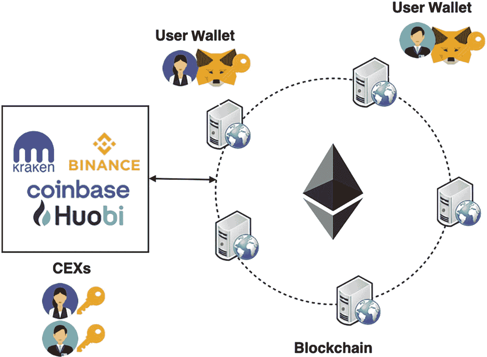

**图 13-6** — CEX 存储你的加密货币，这些加密货币容易受到网络攻击

另一方面，DEX 没有 CEX 的那些限制。通过使用智能合约，DEX 允许你轻松快捷地将一种类型的通证兑换成另一种。这使用户能够完全灵活地控制自己的资金。

**提示**：一些流行的 DEX 包括 Uniswap、Sushiswap 和 Pancakeswap。

### 创建去中心化交易所

由于 DEX 是通过智能合约实现的，因此通过应用你在本书前 12 章中学到的所有知识来理解它们的工作原理是非常有意义的。在本节中，你将创建一个 DEX 合约，允许用户兑换两种不同的 ERC-20 通证。

### 创建通证合约

让我们在 Remix IDE 中创建一个新的通证合约，并将其命名为 `token.sol`。用以下语句填充它：

```
// SPDX-License-Identifier: MIT
pragma solidity ⁰.8;
import "https://github.com/OpenZeppelin/openzeppelin-contracts/blob/v4.0.0/contracts/token/ERC20/ERC20.sol";
contract MyToken is ERC20 {
    // 价格表示为 1 个以太币可以购买多少
    uint256 public unitsOneEthCanBuy  = 10;
    // 通证的拥有者
    address public tokenOwner;
    constructor(string memory name, string memory symbol) ERC20(name, symbol) {
        // 通证拥有者的地址
        tokenOwner = msg.sender;
        // ERC20 通证有 18 位小数
        // 铸造的通证数量 = n * 10¹⁸
        uint256 n = 1000;
        _mint(msg.sender, n * 10**uint(decimals()));
    }
}
```

这个合约与你之前在第十一章中看到的基本 ERC-20 通证合约相同。

### 部署通证合约

在这个示例中，你需要两个拥有一些测试以太币的账户：账户 1 和账户 2。你将使用这两个账户来创建两个通证：WML 和 LWM 通证。

使用账户 1，通过以下构造函数参数部署 `MyToken` 合约（另见图 13-7）：

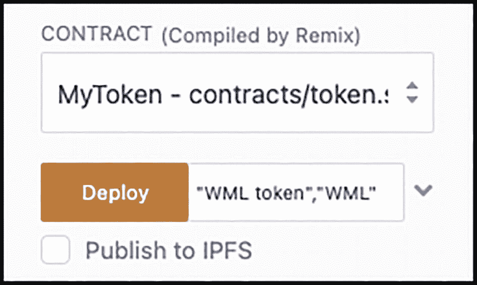

**图 13-7** — 部署第一个通证 WML

```
"WML token","WML"
```

这创建了 WML 通证。接下来，使用账户 2 部署相同的通证合约，这次使用以下构造函数参数：

```
"LWM token","LWM"
```

这创建了 LWM 通证。此时，Remix IDE 应该已经部署了这些通证合约，如图 13-8 所示。

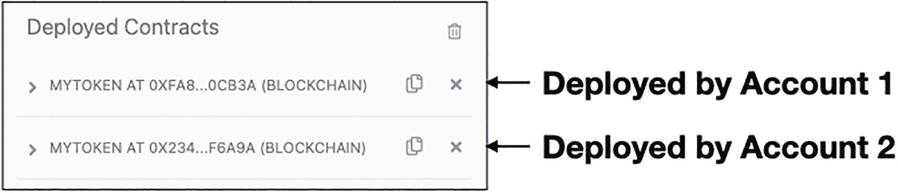

**图 13-8** — 创建的两个通证及其地址

记录通证的地址：

-   WML 通证：`0xfa8b8F0fd75ABf2aF088bf2D1115E6F97ED0cB3a`
-   LWM 通证：`0x234273bD4D1aa3D233135dD49A26675dA7eF6A9a`

**提示**：请将上述合约地址替换为你自己的地址。

在 MetaMask 中将两个通证添加到账户 1 和账户 2。此时，账户 1 和账户 2 应该拥有如图 13-9 所示的通证余额。

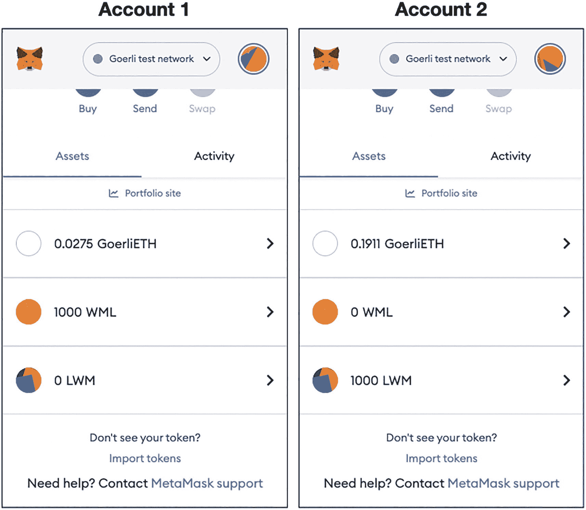

**图 13-9** — 两个账户中的通证余额


### 创建 DEX 合约

创建好两种代币后，现在我们来创建 DEX 合约。在创建合约之前，你需要先了解用户如何使用 DEX 合约来兑换代币。

图 13-10 总结了用户将 `WML` 代币兑换为 `LWM` 代币时的事件流程。

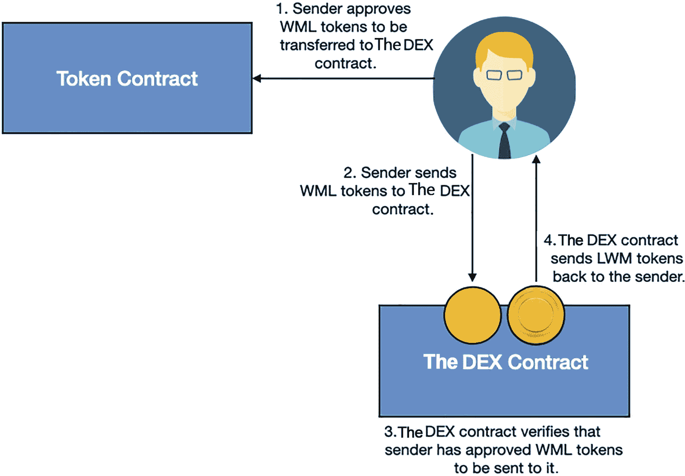

图示展示了发送者批准 WML 代币进行转移，并批准 WML 代币给 DEX 合约；DEX 合约验证发送者已批准将 WML 代币发送给它；然后 DEX 合约将 LWM 代币发回给发送者。

**图 13-10** DEX 合约的工作原理

1.  发送者调用代币合约的 `approve()` 函数，授权将 WML 代币转移到 DEX 合约。
2.  发送者将 WML 代币发送到 DEX 合约。
3.  DEX 合约需要验证发送者已授权将 WML 代币转移给它。如果验证通过，WML 代币将从发送者转移到 DEX 合约。
4.  DEX 合约计算要转移的 LWM 代币数量，并将其发送给发送者。

**提示** 所有代币转移都涉及代币合约更新用户和 DEX 合约持有的代币数量。

在 Remix IDE 中，创建一个名为 `DEX.sol` 的新合约，并用以下语句填充它：

```
// SPDX-License-Identifier: MIT
pragma solidity ⁰.8;
import "https://github.com/OpenZeppelin/openzeppelin-contracts/blob/v4.0.0/contracts/token/ERC20/ERC20.sol";
contract DEX {
    ERC20 WML_token;
    ERC20 LWM_token;
    //=======================
    // constructor of the DEX
    //=======================
    constructor() payable{
        //---be sure to replace the following addresses with your own---
        WML_token = ERC20(address(
            0xfa8b8F0fd75ABf2aF088bf2D1115E6F97ED0cB3a));
        LWM_token = ERC20(address(
            0x234273bD4D1aa3D233135dD49A26675dA7eF6A9a));
    }
    //===================================
    // find the tokens balance in the DEX
    //===================================
    function getBalance() public view returns (uint256,uint256) {
        return (WML_token.balanceOf(address(this)),
                LWM_token.balanceOf(address(this)));
    }
    function compareStrings(string memory a, string memory b)
        private pure returns (bool) {
        return (keccak256(abi.encodePacked((a))) ==
                keccak256(abi.encodePacked((b))));
    }
    //================
    // exchange tokens
    //================
    function exchange(string calldata from_token,
                      string calldata to_token,
                      uint256 amount) public {
        // Remember that all transactions are based on the smallest units in the token
        //=========
        // CHECK #1
        //=========
        // ensure the amount to convert is > 0
        require(amount > 0, "You need to convert at least some tokens");
        // record the token contracts to convert from and to
        ERC20 from;  // the tokens to convert from
        ERC20 to;    // the tokens to convert to
        if (compareStrings(from_token, "WML")) {
            from = WML_token;
        } else {
            from = LWM_token;
        }
        if (compareStrings(to_token, "WML")) {
            to = WML_token;
        } else {
            to = LWM_token;
        }
        // obtain the allowance set by the sender to send to this DEX
        uint256 approvedAmt;
        approvedAmt = from.allowance(msg.sender, address(this));
        //=========
        // CHECK #2
        //=========
        // ensure the sender has enough tokens approved to convert
        require(approvedAmt >= amount,
                "Token allowance is less than what you want to convert");
        //=========
        // CHECK #3
        //=========
        // get the balance of tokens (that the sender wants to convert to) in the pool
        uint256 dexBalance = to.balanceOf(address(this));
        // need to check that DEX has enough "to" token to send to sender
        require(amount <= dexBalance,
                "Sorry, not enough tokens in the DEX");
        // transfer the tokens from sender to DEX
        from.transferFrom(msg.sender, address(this), amount);
        // transfer the exchanged tokens to the sender
        to.transfer(msg.sender, amount);
    }
}
```

以下是 DEX 合约的详细信息：

- 你需要导入由 OpenZeppelin 编写的 ERC-20 代币合约的基础定义。
- 在构造函数中，你创建了要兑换的两个代币的实例（都是 `ERC20` 代币的实例）。如果你想尝试，请记得更改为你自己的 WML 和 LWM 代币的合约地址。
- 你有一个名为 `getBalance()` 的函数。它返回 DEX 合约持有的 WML 和 LWM 代币的余额。
- 在 Solidity 中，你不能使用 `==` 运算符来比较字符串。要比较字符串，你需要比较它们的哈希值。`compareStrings()` 辅助函数用于比较两个字符串以检查它们是否相同。
- `exchange()` 函数允许两种代币进行兑换。为简单起见，假设一个单位的 WML 代币等价于一个单位的 LWM 代币。
- 在兑换代币之前，你需要执行多项检查。首先，确保要兑换的数量大于 0。其次，确保执行兑换的账户已授权将其（要兑换出的）代币发送到 DEX。最后一项检查是确保 DEX 有足够的代币用于兑换。
- 一旦所有检查通过，DEX 可以将代币从调用者转移到 DEX，然后将调用者想要兑换成的代币转移给调用者。

现在你可以部署 DEX 合约（使用账户 1 或账户 2 都可以）。

**注意** 在我的示例中，我部署的 DEX 合约地址是 `0xF4d9A3b468FBc0b256Da59B5B40CB20e5eD137c6`。

此时，Remix IDE 应该已经部署了两个代币合约和一个 DEX 合约，如图 13-11 所示。

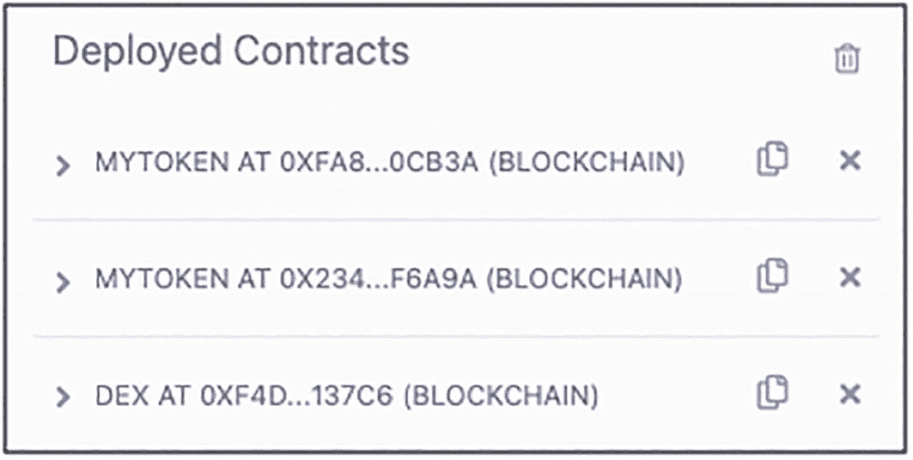

一张已部署合约的截图，区块链中有 3 个合约。

**图 13-11** Remix IDE 中的三个合约

展开 DEX 合约并点击 `getBalance` 按钮（见图 13-12）。你应该会看到返回了两个 0。这是因为此时 DEX 合约持有 0 个 WML 和 0 个 LWM 代币。

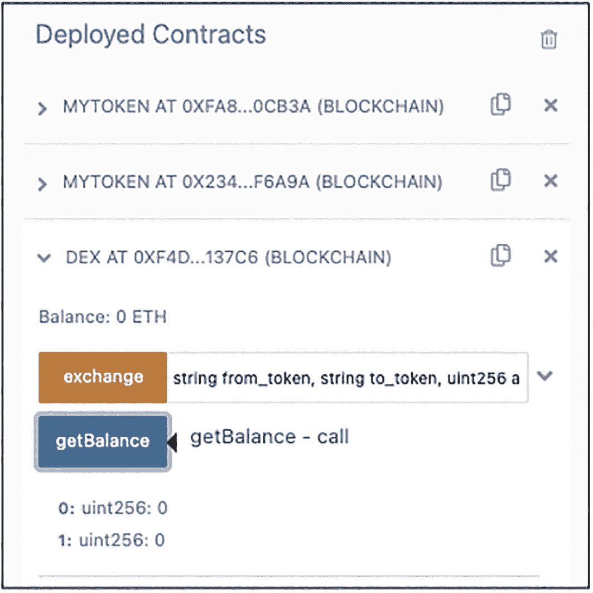

一张已部署合约的截图，区块链中有 3 个合约。exchange 和 get Balance 按钮被高亮显示。

**图 13-12** 查看 DEX 合约中的代币余额

### 为 DEX 注入资金

为了使 DEX 正常运行，它需要一些代币，以便用户可以用来兑换代币。因此，我们为 DEX 合约注入一些 WML 和 LWM 代币。

在 MetaMask 中，使用账户 1 并向 DEX 合约发送 500 个 `WML` 代币（见图 13-13）。

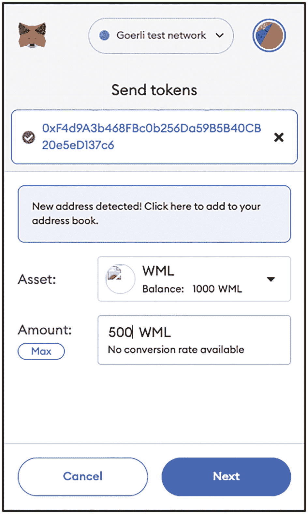

账户 1 页面的截图，显示了发送代币、资产和金额。底部有“取消”和“下一步”高亮按钮。

**图 13-13**  向 DEX 合约注入 500 个 WML 代币

接下来，使用账户 2 并向 DEX 合约发送 500 个 `LWM` 代币（见图 13-14）。

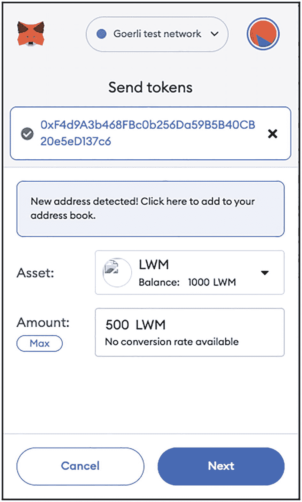

账户 2 页面的截图，显示了发送代币、资产和金额。底部有“取消”和“下一步”高亮按钮。

**图 13-14** 向 DEX 合约注入 500 个 LWM 代币

一旦交易被确认，DEX 合约将拥有 500 个 WML 代币和 500 个 LWM 代币。表 13-1 显示了账户 1、账户 2 和 DEX 合约当前的代币余额。

**表 13-1** 两个账户和 DEX 合约的余额

| 余额 | 账户 1 | 账户 2 | DEX |
| --- | --- | --- | --- |
| WML 代币 | 500 | 0 | 500 |
| LWM 代币 | 0 | 500 | 500 |


### 将 WML 代币兑换为 LWM 代币

现在你可以使用 DEX 合约来兑换代币了。假设账户 1 想用 100 个 WML 代币兑换 100 个 LWM 代币。

**提示**  
请在 MetaMask 中切换至账户 1。

账户 1 需要做的第一步是进入第一个已部署的代币合约（WML 代币），填写以下内容（见图 13-15），然后点击 **approve**（授权）按钮：

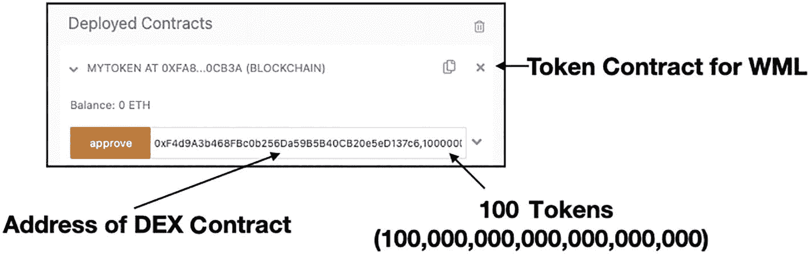

*已部署合约标签页的截图，包含三个标签：WML 代币合约、DEX 合约地址和 100 个代币。*  
图 13-15 — 授权将代币转移至 DEX 合约

```
0xF4d9A3b468FBc0b256Da59B5B40CB20e5eD137c6,100000000000000000000
```

该语句授予 DEX 合约权限，允许其从账户 1 转移最多 100 个 WML 代币至 DEX 合约。

MetaMask 将弹出一个窗口，要求你确认（见图 13-16）。点击 **Confirm**（确认）。

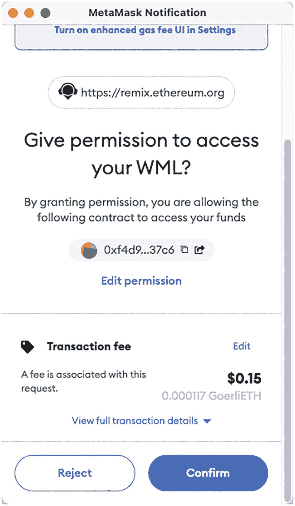

*MetaMask 通知页面截图，显示 DEX 合约访问权限和交易费用。底部有拒绝按钮和突出显示的确认按钮。*  
图 13-16 — 确认授权 DEX 合约访问 WML 代币

交易确认后，账户 1 即可向 DEX 合约发送 100 个 WML 代币。在 DEX 合约的 **exchange**（兑换）按钮旁填写以下语句（见图 13-17）：`"WML","LWM",100000000000000000000`。

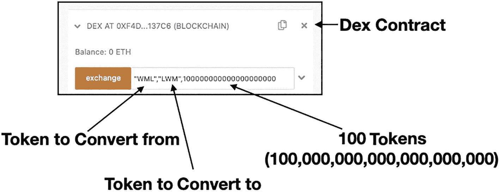

*对话框截图，包含四个标签：DEX 合约、要兑换的代币、目标代币和 100 个代币。*  
图 13-17 — 将 WML 代币兑换为 LWM 代币

点击 **exchange**（兑换）按钮。

该语句调用了 DEX 合约中的 `exchange()` 函数，表明你想将 100 个 WML 兑换为 LWM 代币。

在 MetaMask 中点击 **Confirm**（确认）以支付交易费用。交易确认后，你应该会看到账户 1 少了 100 个 WML 代币，并增加了 100 个 LWM 代币（见图 13-18）。

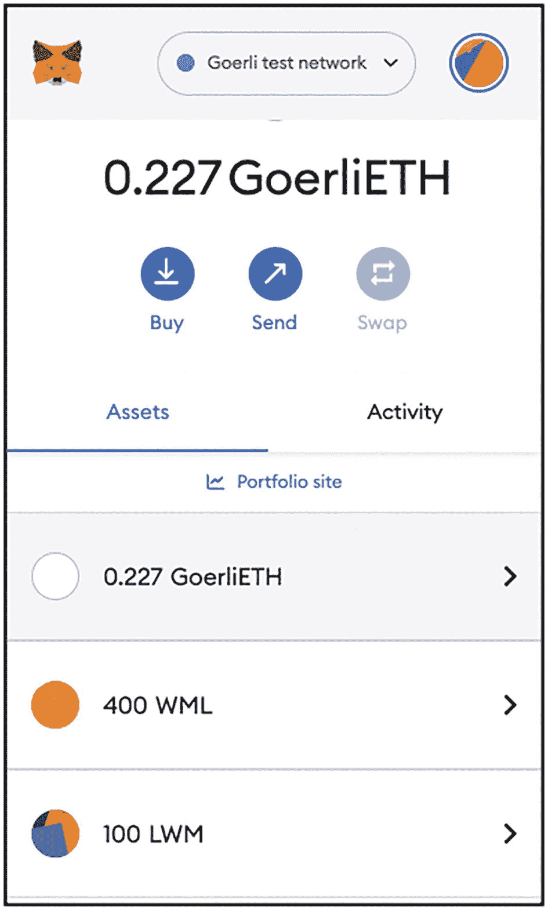

*账户 1 的页面，显示其拥有 Goerli ETH、WML 和 LWM 代币资产。页面包含买入、发送和兑换按钮。*  
图 13-18 — 账户 1 现在拥有 100 个 LWM 代币

如果你进入 DEX 合约并点击 **getBalance**（获取余额）按钮，你将看到其拥有 600 个 WML 代币和 400 个 LWM 代币。

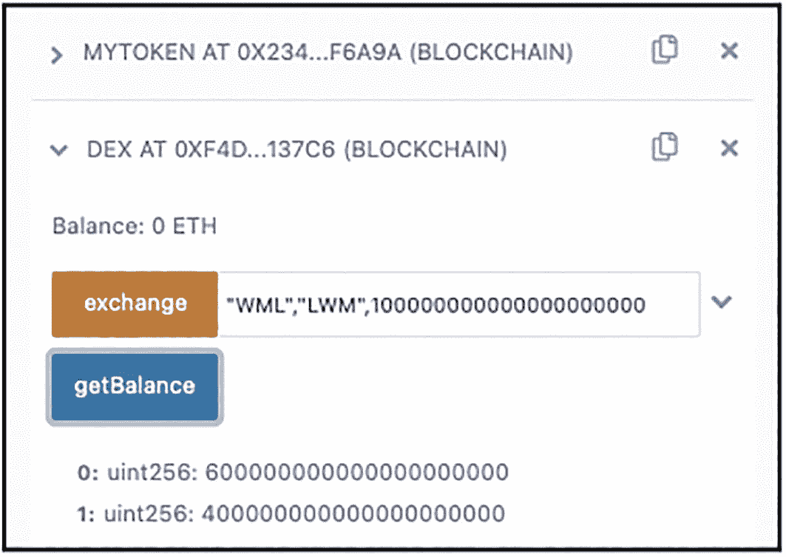

*对话框截图，列出了我的代币、DEX 合约，以及兑换和获取余额按钮。*  
图 13-19 — DEX 合约现在增加了 100 个 WML 代币，减少了 100 个 LWM 代币

表 13-2 显示了账户 1、账户 2 和 DEX 合约更新的当前代币余额。

**表 13-2 — 两个账户和 DEX 合约的余额**

| 余额 | 账户 1 | 账户 2 | DEX |
| --- | --- | --- | --- |
| WML 代币 | 400 | 0 | 600 |
| LWM 代币 | 100 | 500 | 400 |

同样地，如果账户 2 想用 100 个 LWM 代币兑换 100 个 WML 代币，需要执行以下操作：

- 进入 LWM 代币合约，授权将 100 个代币（`100000000000000000000`）转移至 DEX 合约。
- 进入 DEX 合约，将 100 个 LWM 代币兑换为 WML 代币：`"LWM","WML",100000000000000000000`。

## 总结

在本章中，你探讨了几个重要主题：

- 你了解了什么是 DeFi 及其用途。
- 你了解了什么是稳定币、不同类型的稳定币，以及它们如何维持价格稳定。
- 你了解了如何通过不同类型的加密货币交易所购买加密货币。
- 更重要的是，你学会了如何用智能合约实现一个 DEX。


