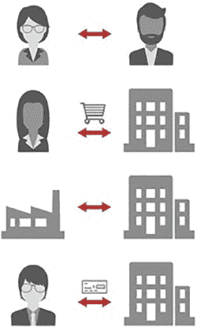
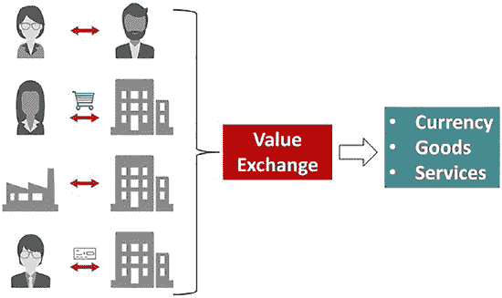
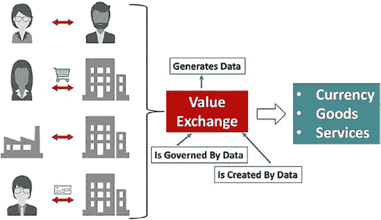
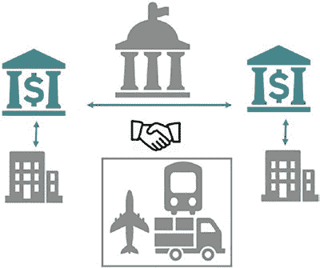
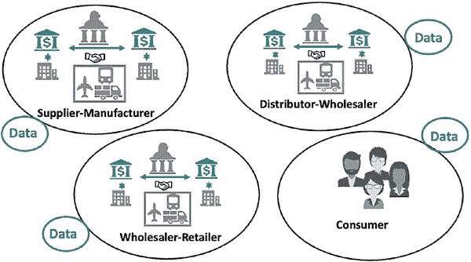
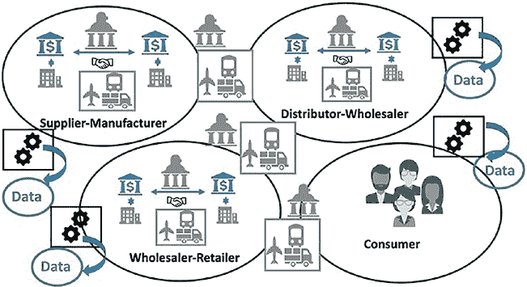

# 个体 #2 和 #3 彼此了解并信任对方。

各个社会都曾探寻过能够充当货币的商品。有些社会将黄金、白银及其他贵金属等商品用作货币，而另一些社会则使用谷物、农作物或贝壳作为货币形式。在美国的监狱里，香烟和方便面被当作货币使用。关于货币，一个有趣的故事来自南太平洋的雅浦岛，在那里一种名为 `rai` 的类石英晶体曾被用作货币（Bryan，2004）。`Rai` 是从邻近岛屿开采的，雅浦岛人根据他们认为开采和运输 `rai` 的难度及危险性来判断其价值。人们将 `rai` 称为“原始版”比特币（Dockrill，2019）。

以商品为基础的货币存在若干挑战或缺点。首先，商品可能笨重且不便运输，使得交易双方难以“发送”货币给对方。以商品为基础的货币也可能难以生产，因为其生产成本取决于天气、地理和劳动力成本等一系列因素。所有这些成本都会随时间变化，且不同社会间存在差异。不同社会对用作货币的商品（或称稀缺程度）的获取也并不均匀，4 这可能导致不同社会最终使用不同的商品作为其货币基础。商品还难以实时或现场进行测量或评估。随着时间的推移，许多国家将黄金作为货币的基础。黄金稀缺、备受追捧，且人们可以借助工具和专业知识通过其重量和纯度进行评估。然而，黄金存在商品货币的其他缺点，因此国家政治权力被用来创造以纸币和硬币形式存在的货币面额（通货）。流通中的货币总量价值由该国持有的黄金储备担保。随着时间的推移，这种黄金储备的支持被取消，5 货币 仅由创建该货币的国家的中央政治权力担保。我们将由国家政治权力支持的通货称为“法定”6 货币。那么，美国政府真的决定了美元的价值吗？请参阅边栏 7 “1 美元值多少？” 对此话题的讨论。国家是发行法定货币的唯一机构吗？请参阅边栏“替代货币”对此话题的讨论。

至此，我们已经能够更正式地定义货币的三个基本属性：

1. **交易媒介** – 货币是所有人都能接受的用于交换交易的中介。这通常意味着货币可以反复使用、寿命长（耐用），且易于携带和运输（便携）。

2. **价值储藏** – 人们可以假定其货币价值是稳定的；即它不会改变，或只会随时间可预测地变化。

实现这一目标是为了确保流通中的货币总量（货币供应量）随时间保持相对稳定。高通胀率往往会削弱人们对某种货币的信心。

3. **记账单位** – 这是指货币的名称以及该货币不同面值所对应的价值或“单位”。美元是一种单位，我们可借此准确衡量经济体中商品、服务、资产和负债的价值。要使记账单位赢得信任，它应当是一种良好的价值储藏手段。此外，相同面值的每一张货币在其购买力方面应当统一。例如，每张`$1`纸币都具有相同的购买力。它还应具有可互换性；也就是说，两张`$1`纸币之间没有区别，它们完全可以互换。最后，货币应当具有可分性；即一张`$10`钞票可以拆分为两张`$5`钞票、十张`$1`钞票或五张`$2`钞票。

基于我们目前对比特币的了解，根据这一定义，我们能判断它是否属于货币范畴吗？在其发展的现阶段，这个问题的答案是一个响亮的“不”。比特币不能被视为交换媒介，因为尽管它稀缺，但目前还没有足够多的人或企业愿意接受比特币作为交换媒介。比特币也不能被视为价值储藏手段，因为与法定货币相比，其价值每日波动巨大。在某些方面，比特币可以被视为一种记账单位，它具有可互换性和可分性。然而，由于其波动性，比特币无法准确衡量商品、服务、资产和负债的价值。

当今经济中的大多数货币兑换并非通过纸币（又称现金）的直接交换来结算。在下一节中，我们将看到这种情况如何催生了对第三方和政府监管的需求。不过，让我们在结束本节之前，先看看使用现金进行的交易与使用比特币进行的交易的相似之处。

- 现金交易和比特币交易都是匿名的，并能保护隐私。
- 现金和比特币一旦丢失均无法找回。
- 现金和比特币通常属于占有者，尽管占有的含义有所不同。
- 现金和比特币都难以伪造。

我们希望你对本节中关于货币的理解能够阐明：比特币虽然在实现方式上独一无二，但在概念上符合货币的演化进程，即使就其当前状态而言，我们尚不能将其归类为货币。

在下一节中，我们将拓宽视野，从整体上审视经济中的价值交换，了解为何以及如何需要第三方，政府和其他组织为何以及如何实施监管，以及这些因素如何共同导致经济体系中产生一系列低效问题。

## 经济即价值交换

为了理解价值交换如何构成一切经济活动的基础，让我们重温一个古老的货币谜题（Henderson, 2012）。

某个小镇上，生意冷清……烈日当空……街道空无一人。时世艰难，人人负债，所有人都靠赊账生活。

就在这一天，一位来自西部的富游客开车穿过小镇。他在汽车旅馆停下，将一张`$100`钞票放在柜台上，说他想要检查楼上的房间，以便挑选一间过夜。

就在男子上楼后，旅馆老板抓起钞票，跑到隔壁去还欠肉铺老板的债。肉铺老板拿着这`$100`钞票沿街跑去，还清了欠养猪户的债。养猪户拿着`$100`钞票去饲料店付清了他的账单。农民合作社的人拿着`$100`钞票跑去还他欠当地妓女的债，这位妓女也正面临困境，不得不提供赊账服务。

她瞬间冲到汽车旅馆，付清了房费给旅馆老板。

旅馆老板将那张`$100`钞票放回柜台上，以免那位富有的旅行者起疑。

就在这时，旅行者走下楼梯，拿起那张`$100`钞票，声称房间不满意，把钱揣进口袋，然后离开了。

现在……没有人生产任何东西……也没有人赚到任何东西……然而整个小镇却摆脱了债务，对未来充满乐观。

这很有趣，不是吗？

从会计角度看，每个人都有债务，但也有债权。例如，旅馆老板欠屠夫钱，妓女欠旅馆老板钱，等等。总体而言，即使没有那位富有的旅行者引发的连锁交易，他们中也没有人实际欠债。我们只是需要第一次交易来触发多米诺骨牌效应。价值交换让我们的经济运转不息，并允许我们承担额外的债务，也许是为了抵消我们可能拥有的债权。

一般而言，经济包含四种原子类型的交换（见图 1-1）。交换可以发生在两个个体之间。一个个体是生产者，另一个个体是消费者。这是我们之前所有例子中描述的交易类型。第二种经济交换可以发生在一家企业和一个个体之间。在这里，企业是生产者，个体是消费者。这是生产产品的制造商和购买产品的顾客之间的经典交换。这也被称为企业对消费者（B2C）交换。第三种经济交换可以发生在两家企业之间。在这里，一家企业是生产者，另一家企业是消费者。例如，一家企业生产一个零件，被另一家企业用于制造它们的产品。这也被称为企业对企业（B2B）交换。第四种经济交换可以发生在一个个体和一家企业之间。这是员工为其雇主提供服务，而雇主以工资、奖金、股权和福利等形式提供报酬的经典交换。

经济中的大多数交换交易都是这四种原子交易中一种或多种的组合。交易双方不必地理位置接近，交易也不会立即结算，正如我们在简化示例中所描述的那样。图 1-2 将交易各方之间的价值交换分为三种类型：货币、商品和服务。

货币（或金钱、现金）参与所有交易。双方可以相互交换货币，要么是为了找零，要么是为了改变货币单位（跨境交易）；或者双方可以用商品换取货币，或用服务换取货币。双方通常通过建立信贷或应收账款以及借记或应付账款来进行交易。交易的付款时间以及与延迟付款相关的罚金，均由双方约定的合同确定。双方通过银行或其他金融机构交换货币，因为无法进行物理上的现金交付。有时，企业需要现金来运营，因此它们通过抵押资产来借款。由于交易不会立即结算，涉及多方，并且需要跟踪借贷，所有交易都需要被记录。这通常由一方在分类账中完成。这使得数据在所有交换交易中变得至关重要。图 1-3 展示了数据扮演的三个关键角色。

### **图 1-3.** 数据在价值交换中的作用

- 首先，所有交换交易都会产生数据。这些数据作为交易记录，用于审计、监控、分析和规划。
- 其次，所有交换交易都受数据约束。这些数据设定了合同参数，规定了交易结算的条件。
- 数据所扮演的第三个角色，将价值的定义扩展至包括数据交换本身作为一种固有价值来源。数据在这一角色上仍处于萌芽阶段，其底层合同也仍在演变之中。

基于对第三方参与的这一理解，让我们进一步深入探讨两家企业之间的价值交换交易。

`图 1-4` 展示了前文讨论过的金融机构的参与情况。

## 第 1 章 区块链的商业与经济动机

### **图 1-4.** 第三方在价值交换中的作用

企业之间的现金通过各自的金融机构进行交换。每家金融机构都会收取费用。此外，政府也会介入，对金融机构之间的交换交易进行监管。如果企业位于不同国家，且交换交易是跨境交易，则可能涉及多个政府。政府还会介入那些据称为公平裁决交易双方潜在纠纷而制定的法规。诸如此类的法规很少是中立的，通常偏向于交易中更强大且具有政治关联的企业。我们认为政府和金融机构的参与，对交换交易几乎没有或根本没有增加价值。除了金融机构和政府之外，`图 1-4` 还展示了另一类企业的参与。这些企业被称为“第三方物流”供应商。这些公司通过协助运输、仓储、调度和配送，帮助企业之间进行货物交换。第三方物流供应商在货物交换中增加了价值，并执行了参与交换的主要企业委托给它们的任务。

## 第 1 章 区块链的商业与经济动机

我们已经知道数据在价值交换中扮演的关键角色。`图 1-5` 展示了这在交易企业之间是如何体现的。

### **图 1-5.** 交易企业之间的专有数据

每家企业都会创建数据来记录交易，并管理那些管控企业之间交易的数据。我们天真地期望：(1) 这两家企业捕获相同或相似的数据；(2) 两家企业的数据是等价的；(3) 两家企业能够查询并理解彼此的数据。然而，我们的期望很可能会落空。每家企业使用不同的流程和不同的系统，并有着不同的目标，导致创建出的数据只有该企业的人员才能理解。如果你推断这种对彼此数据缺乏理解会导致开展业务困难，那么你是对的。在下一节中，我们将看到这种专有数据是经济效率低下的根源。

在本节结束前，我们来看一下货物从制造商到达消费者手中所需的所有交换的复杂性。`图 1-6` 描绘了这一供应链。你可以看到，在企业和消费者之间进行交换之前，企业之间存在着多次企业对企业（B2B）的交换。

## 第 1 章 区块链的商业与经济动机

原材料或零部件供应商将其货物与制造商交换以获取现金付款。制造商生产出产品后，将其与分销商交换，分销商再与批发商交换，批发商再与

