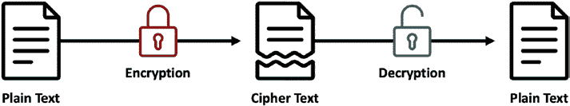
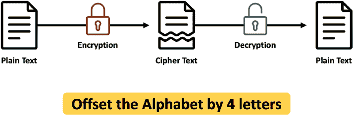
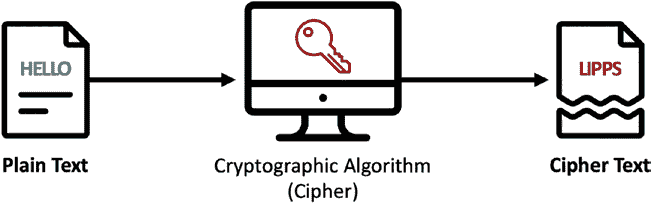
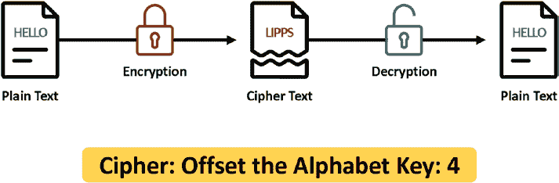
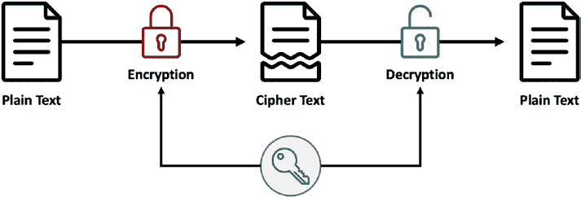
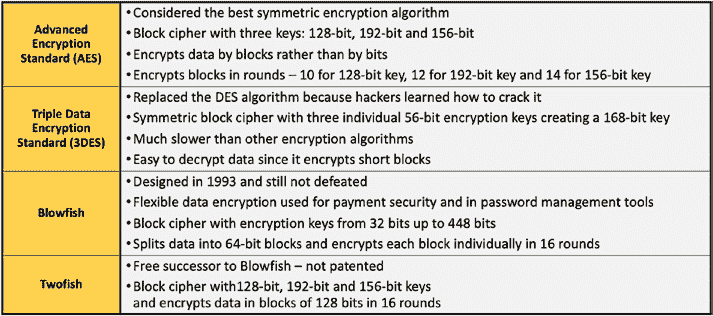

# 第 2 章：支撑区块链的核心技术概览

## 密码学与数字签名

在本节中，我们将介绍密码学与数字签名的基础知识。对于希望利用区块链的企业来说，理解这些基础知识非常重要。

`图 2-1` 展示了密码学加解密过程的高级示意图。我们从人人都能读懂的**明文**开始，随后将其加密为人人皆不可读的文本，我们把这种文本称为**密文**。当该密文被解密后，我们就能重新获得原始明文。

***图 2-1.** 高级别加解密过程*

`图 2-2` 是加解密过程的示意图。让我们从明文 `HELLO` 开始。我们可以使用一种称为**字母偏移**的算法对其进行加密。在此例中，我们将字母偏移四位，因此 `H` 变为 `L`，`E` 变为 `I`，`L` 变为 `P`，第二个 `L` 再次变为 `P`，`O` 变为 `S`。使用此算法加密 `HELLO` 后，得到密文 `LIPPS`。要理解密文 `LIPPS`，接收者需要知道其加密方式，也就是说，如果接收者不知道此知识，就无法从密文中解读出含义。当我们解密 `LIPPS` 时，我们会反向应用该算法，得到 `HELLO`。`L` 将变回 `H`，`I` 将变回 `E`，以此类推。这就是对加解密过程的简单描述。

***图 2-2.** 加解密示意图*

密码学包含两个领域。其一是**密码编码学**，其二是**密码分析学**。密码编码学是运用数学来加密和解密数据，以便在不安全网络中存储敏感信息并进行传输的科学。密码分析学则是分析和破解安全通信的科学。从某种意义上说，密码分析学是“破解密码”的科学。强密码学产生的密文极难被攻破。我们关注的正是强密码学。

在非常高的层面来看，密码编码的工作方式如下：我们将明文输入一个密码算法（即**密码**），该算法与**密钥**协同工作，将明文转换为密文（`图 2-3`）。在我们之前的例子中，我们的密码是“字母偏移”，而我们的密钥是 `4`。`图 2-4` 描绘了这一过程。

***图 2-3.** 密码编码的实际应用*

***图 2-4.** 密码编码的实际应用示意图*

现在，让我们来看一种特定类型的密码编码，称为**对称密钥密码学**。在对称密钥密码学中，用于加密的密钥与用于解密的密钥是相同的（`图 2-5`）。显然，算法是相同的，但这里，密钥也是相同的。这意味着密文的接收者需要知道用于加密的密钥。

***图 2-5.** 对称密钥密码学*

对称密钥密码学快速、简单且性能高。对称密钥算法既可以在硬件中实现，也可以在软件中实现。当数据不被传输而是保存在一个地方（也称为“静态数据”）时，这是首选的加密方法。

这种集成使得抽象化价值交换背后的条款和条件成为可能，并将其表现为可在多台计算机上执行的软件。

在本章中，我们首先回顾密码学和数字签名的技术概念，然后介绍分布式系统和点对点网络架构的概念。最后，我们将描述这些概念是如何集成起来以创建区块链的核心能力的。

