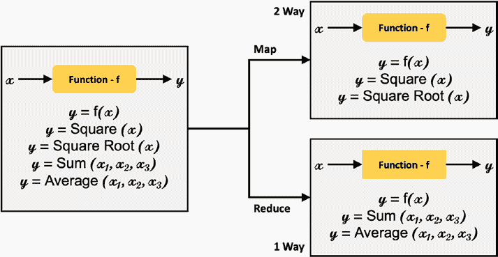
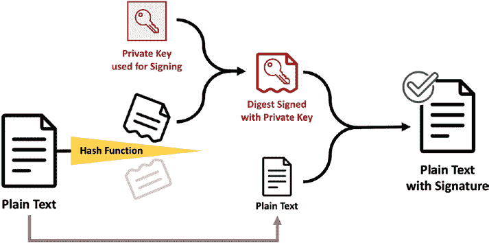

# 第 2 章 支撑区块链的核心技术概述

然而，对于传输中的数据而言，对称密钥加密存在一个局限性。它要求数据接收方拥有密钥，这意味着密钥需要从发送方安全地传输到接收方。这就意味着双方必须相互信任，并建立一个可信的通道来传输密钥。建立这样一个可信的安全通道成本可能很高。由于这一局限性，对称密钥加密仅限于互相认识并且有能力投资建立可信通道基础设施的双方。

表 2-1 总结了一些用于强对称密钥加密的流行算法。

**表 2-1.** 强对称密钥算法总结

接下来，我们回顾另一种密码学方法，称为非对称密钥加密，或称公钥/私钥加密。在这种方法中，存在两个密钥：一个是可以共享的公钥，另一个是不共享的私钥。数据的发送方和接收方都拥有一个公钥和一个私钥。让我们看一个例子。海伦想要安全地向马可发送一条消息。马可的公钥对海伦是公开的，因此海伦将使用马可的公钥对消息进行加密。当马可收到消息时，他们使用只有自己知道的私钥对消息进行解密。当马可成功解密消息时，他们就知道数据是发给自己的。请注意，在这种方法中，与对称密钥加密不同，只有加密后的消息被传输，没有任何密钥被传输。

**图 2-6.** 非对称或公钥/私钥加密

在非对称密钥加密中，无需建立可信的安全通道。这使得更多的人和实体能够使用密码学——各方不再需要相互认识，也无需投资建立用于安全共享密钥的基础设施。

尽管非对称密钥加密解决了对称密钥加密的局限性，但它自身也有局限性。该局限如下：马可知道自己收到了发给自己的消息，因为他们用私钥成功解密了该消息。然而，马可无法确信该消息是由海伦发送的。任何知道马可公钥的人都有可能发送这条消息。虽然海伦可以向马可表明是她发送的消息，但马可并没有确凿的保证。马可收到的消息可能来自任何人。我们将在后面讨论如何解决非对称密钥加密的这一局限性。

表 2-2 总结了一些用于强非对称或公钥/私钥加密的流行算法。这些都是非常高效的算法，能够产生强大的加密效果，并且很可能在多年内（甚至即使量子计算出现后）都难以被破解。

**表 2-2.** 强非对称密钥算法总结

解决非对称密钥加密中无法确保证发送方身份的局限性的一种方法是使用数字签名。

让我们看一个例子：海伦想向马可发送一条消息。这次，海伦实际上会发送两次相同的消息。第一条消息用马可的公钥加密，马可用自己的私钥解密该消息（如图 2-6 所示的非对称密钥加密）。第二条消息将用海伦的私钥加密，马可则用海伦的公钥解密该消息。第二条消息就是海伦的数字签名（私钥），如图 2-7 所示。

`Marco`现在收到两条消息：一条是用他自己的私钥解密的（如图 2-7 中的签名验证），另一条是用`Helen`的公钥解密的。当这两条解密后的消息一致时，`Marco`就能万无一失地确认自己就是消息的预期接收者，且`Helen`就是消息的发送者。

***图 2-7.** 数字签名过程*

## 第 2 章 支撑区块链的核心技术概览

在本节中，我们已经讨论了非对称密钥密码学如何解决对称密钥密码学对可信安全信道的依赖限制，以及数字签名如何解决非对称密钥密码学中发送者身份无法得到绝对保证的限制。

但还没完！

到目前为止，我们描述的数字签名也存在一个限制：速度慢，并且会产生大量的信息。我们发送了双倍的数据量，而网络和传输并非免费。如果按我们目前描述的方式实现数字签名，那将是昂贵、缓慢的，并且会因为网络延迟而造成延误。

`哈希`是一种能够帮助我们解决数字签名这一限制的技术。为了深入理解什么是`哈希`，我们先从数学函数入手。

通常，数学函数的运作方式如下：你向函数`f`输入一个`x`，就会得到一个输出`y`。我们说`y`等于`f(x)`。如果这个函数是平方根函数，那么我们会得到`x`的平方根。如果`x`等于 9，那么`f(x)`（其中`f`是平方根函数）的结果`y`就是 3（实际上是+3 或-3）。

图 2-8 将函数分为两类：双向映射函数和单向映射函数。在双向映射函数中，已知`x`可以求出`y`，已知`y`也可以求出`x`。对于单向函数，已知`x`可以求出`y`，但已知`y`却无法求出`x`。`求和`和`求平均值`这类函数就是单向函数的例子。

## 第 2 章 支撑区块链的核心技术概览

***图 2-8.** 函数类型*

单向函数也被称为约简函数，因为其输出是将多个输入约简为一个输出的结果。加密和解密是双向映射函数，我们可以将明文加密为密文，然后再将密文解密回明文。`哈希`则是一种单向约简函数。`哈希`的作用是减少输入的数据量和存储空间。无论输入的长度是多少，哈希函数都会产生一个固定长度的输出。例如，关系型数据库就有哈希索引，这些索引能加快数据库中的搜索、插入、更新和删除操作。

`哈希`最大的优点是它是一种极具可扩展性的高性能函数。我们说这些函数的复杂度为`O(1)`，读作大 O-1。大 O-1 意味着无论输入的大小如何，哈希算法的执行速度都是一样的。

我们举一个简单的哈希函数例子。假设我们有三个字符串——`ABC`、`DEFG`和`GHI`。你可以看到这些字符串的长度并不相等。对于我们的哈希函数，我们将`A`映射为 1，`B`映射为 2，`C`映射为 3，依此类推。我们将字符串中每个字母映射到的数字相加，然后应用`mod`函数。`mod`函数接收两个数字作为输入，返回第一个数字除以第二个数字后的余数。因此，`a mod (6,5)` 会返回 1——当 6 除以 5 时，余数为 1。对于我们的示例字符串，要计算`ABC`的哈希值，我们将`ABC`的映射值相加得到 6，然后计算`mod (6, 5)`得到 1。所以`ABC`的哈希值是 1。`DEFG`的哈希值是 2——`DEFG`的映射值总和为 22，`mod (22, 5)`得到 2。同样地，`GHI`的哈希值是 4。表 2-3 总结了这些哈希值。

***表 2-3.** 使用模函数的哈希值*

如表 2-3 所示，无论输入字符串的长度如何，输出都是一个固定长度的字符串。

我们相信，到现在你一定能看出哈希存在一个问题。这个问题被称为碰撞。`ABC` 和 `CBA` 会产生相同的哈希值，这显然是不好的。

计算机科学家已经开发出精密的哈希算法，可以将碰撞的概率降至最低。它们不能保证永远不会发生碰撞，但这些哈希算法已经证明，碰撞发生的概率无需我们担忧。

表 2-4 总结了两种哈希算法，它们确保将碰撞最小化到这样的程度：在所有的实际应用场景中，我们可以假定不存在碰撞。

***表 2-4.** 两种哈希算法概要*

## 第 2 章 支持区块链的核心技术概述

在了解哈希的背景知识后，我们将重新审视数字签名。这一次，海伦不再向马可发送两条消息（一条用马可的公钥加密，另一条用海伦的私钥加密），而是发送一条用马可公钥加密的消息。然后，海伦对原始消息进行哈希处理，得到一组精简的数据（也称为消息摘要）。接着，海伦用她的私钥对哈希后的消息进行签名，并将其发送给马可（见图 2-9）。通过对消息进行哈希处理，海伦大大减少了发送给马可的数据量。

***图 2-9.** 哈希数字签名*

马可现在会用他的私钥解密收到的、用其公钥加密的消息，从而得到原始消息。接着，他会获取加密的哈希数字签名，并用海伦的公钥解密，得到原始消息的哈希值。然后，马可将对原始消息（由他的私钥解密得到）进行哈希处理。当这个哈希值与解密得到的哈希值匹配时，马可就获得了确凿的保证：海伦是消息的发送者。

以上讨论表明，哈希可以解决数字签名数据传输量过大的问题。

总之，在本节中，我们回顾了对称密钥加密技术，并了解了它在安全数据传输方面的局限性（双方需要互相认识，并投入基础设施以安全地传输密钥）。这一局限性由非对称密钥加密技术解决，在该技术中，每一方都拥有一个公钥和一个私钥，消息用一方的公钥加密，用该方的私钥解密，从而消除了传输密钥的需求。非对称密钥加密技术本身也有一个局限性：无法确凿地保证发送方的身份。这一局限性由数字签名解决，即发送两条消息，一条用接收方的公钥加密，另一条用发送方的私钥加密。数字签名也有局限性：它使每条消息需要传输的数据量翻倍。这一局限性由哈希数字签名解决。

在结束本节关于密码学的讨论前，让我们回顾数据的三种状态——静态数据、传输中数据和使用中数据——以及在这三种状态下如何保护数据安全。

- **静态数据** 指存储在计算机上，或者更准确地说，存储在由计算机管理的非易失性存储设备上的数据。对称密钥加密技术是静态数据加密的理想选择。笔记本电脑、个人电脑以及用于数据库的服务器的存储，都使用对称密钥加密技术进行加密。这就是我们丢失笔记本电脑时无需担心数据被盗的原因。
- **传输中数据** 指通过计算机网络从计算机 A 传输到计算机 B 的数据。

