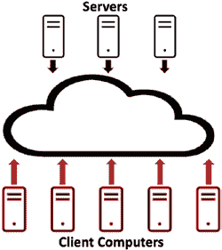
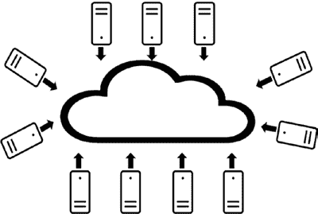

# 第 2 章 支撑区块链的核心技术概述

## 实现目标的方法

**图 2-10.** 分布式系统问题、目标与方法总结

第 2 章《支撑区块链的核心技术概述》侧边栏提供了一份分布式系统术语及其定义的列表，这些术语在设计区块链应用时是必不可少的参考依据。

关于与区块链相关的分布式系统，我们需要掌握的最后一个概念是 CAP 定理。CAP 定理由计算机科学家埃里克·布鲁尔提出。更多信息和讨论请参见布鲁尔（2012 年）的著作。CAP 定理指出，分布式系统在数据方面，只能同时实现强一致性、高可用性和网络分区容忍性这三个目标中的两个。请注意，该定理并未对系统的性能做出任何断言。该定理的含义如下：

-   如果我们希望始终保证所有数据更新的高可用性，并且也希望保证所有数据在所有副本和数据分区之间保持一致，那么我们就无法保证网络分区容忍性；也就是说，如果遇到网络故障，我们将无法保证系统及其数据的可用性。
-   如果我们希望始终保证所有数据更新的高可用性，并且也希望保证网络分区容忍性，那么我们就无法保证所有数据在所有副本和数据分区之间保持一致。

*网络分区意味着某些本应相互连接的计算机之间没有可用的网络路径——我们称这种情况为分区。请注意，这里“分区”一词的用法与我们之前将计算和数据划分以便在多台计算机上执行时的用法不同——后者我们称之为数据分区。*

-   如果我们希望保证网络分区容忍性，并且也希望保证所有数据在所有副本和数据分区之间保持一致，那么我们就无法保证所有数据时刻可用于更新。

没有系统设计师愿意完全放弃高可用性、强一致性和网络分区容忍性这三个特性中的任何一个。CAP 定理迫使系统设计师思考他们能够承受的权衡，同时满足全部或大部分业务需求。分布式系统的设计宗旨是在数据更新的高可用性、数据的强一致性和网络分区容忍性之间取得平衡。

在本节中，我们从非常高的业务层面回顾了分布式系统的概念，这些概念对于设计区块链应用至关重要。我们将在本章最后一节回顾区块链实现如何根据本章所讨论的分布式系统概念进行设计权衡。

在下一节中，我们将回顾与点对点网络相关的概念。

## 点对点网络

区块链系统由计算机组成，这些计算机也称为计算节点，或简称为节点，它们通过点对点网络相互连接。在本节中，我们的重点是识别并理解传统计算机网络架构与点对点网络架构之间的差异。

*从这个意义上说，不存在纯粹的分布式系统。大多数分布式系统都包含一些集中式组件。*

**图 2-11.** 传统计算机网络架构

图 2-11 展示了一个示意性的传统计算机网络架构。图 2-11 中的云代表计算机网络，它使得连接到网络的计算机能够通过某种网络路径相互通信。

在图 2-11 中，我们展示了两种类型的计算机。我们把红色的计算机称为客户端计算机。客户端计算机通常有所需求，它们需要被服务。我们把黑色的计算机称为服务器。它们响应客户端的服务请求，如果客户端被授权请求该服务，则服务器执行该请求。

根据提供的服务类型，我们可以想到多种类型的服务器。例如，数据库服务器响应创建、读取、更新和删除数据的请求。域名服务器提供类似电话簿的服务，根据网站名称提供托管该网站的服务器网络地址。网络服务器接收特定网页的请求，并“提供”这些页面。还有防火墙充当服务器，以及执行专门计算的服务器，等等。

在传统的计算机网络架构中，我们有两种类型的计算机：客户端和服务器。从某种意义上说，服务器对客户端拥有控制权。它们控制着谁有权访问其服务、提供哪些服务、服务的语义是什么、请求服务的语法是什么、何时提供服务，以及针对不同类型客户端的服务速度。如果服务器因任何原因不可用，客户端将无法获得任何服务，事实上，客户端甚至可能不知道服务器不可用。服务器也可以单方面改变其提供的服务的任何方面，尽管在实际中，服务器不太可能这样做，因为任何服务器的价值主张和效用直接取决于有多少客户端使用其服务。

在许多情况下，服务器也由单一实体集中拥有；也就是说，即使可能存在多台提供相同类型服务的计算机服务器，它们也可能由同一方所有。这种服务器的集中所有权及其专业化可能会给整个网络的性能、成本和功能带来限制。

现在让我们转向点对点网络。图 2-12 展示了一个示意性的点对点网络。在此图中，云再次代表网络，您可以看到所有计算机都通过云所代表的网络相互连接；也就是说，所有计算机都可以通过某种网络路径相互通信。

*也许我们应该明确一点，点对点网络是分布式系统的一个特定情况（或拓扑结构）。*

**图 2-12.** 点对点网络架构

在图 2-12 中，所有计算机颜色相同，我们可以说它们都是客户端，或者说它们都是服务器。从某种意义上说，所有计算机都是相同的。它们可以提供相同的功能。每台计算机可能没有直接路径连接到另一台计算机，但它们以某种方式连接，使得每台计算机无需利用其他计算机上的任何专门服务，就能与所有其他计算机通信。从这个意义上说，在点对点网络中，没有哪台计算机拥有超越其他计算机的权力。每台计算机都是独立的。每台计算机拥有同等的权力。每台计算机都可以与任何其他计算机通信，并且它们不加歧视地相互提供服务。如果点对点网络中的任何一台计算机决定离开网络（它们可以自由地这样做！），整个点对点网络的功能不会因此丧失。它可以在没有任何性能下降的情况下继续运行。

点对点网络是一种比传统计算机网络架构更加平等和民主的架构。虽然没有任何因素阻止一方拥有多个节点，但一方想要拥有点对点网络中的所有节点是极不可能（甚至是不可能的）。最平等的点对点网络由开源软件驱动，这些软件对所有人开放，并且对谁能加入该点对点网络没有任何限制。在过去，点对点网络曾被用于交换文件、音乐、数据、软件和游戏。所有节点（对等点）并非完全平等的专用点对点网络也曾被建立，用于通过互联网进行语音和视频通话。

总的来说，我们可以推测，当权者往往不喜欢点对点网络架构，也许是因为他们无法控制它或从中获利。区块链是一个用于交换价值的计算机节点点对点网络。也许当权者会因此感到威胁！

不过，我们也不要急于下结论。在下一节中，我们将讨论密码学、分布式系统和点对点网络架构如何结合在一起，以实现一个成功的区块链。

## 区块链技术集成

区块链是密码学、分布式系统和点对点网络的巧妙结合，用以创建一个去中心化的系统链。在本节中，我们将从高层级回顾这些技术是如何集成的，以及每项技术为区块链实现提供了哪些功能。我们将按照本节中讨论这些技术的相反顺序开始。

我们通常将集中式系统视为分布式系统的反义词，在集中式系统中，一台物理计算机能够提供满足业务需求所需的所有功能。我们也使用“集中式”一词来描述系统的所有权。如果分布式系统中的所有计算机都由单一方拥有，那么我们将这种分布式系统称为具有集中式所有权。当分布式系统中的计算机由多方拥有时，我们则称这种分布式系统具有去中心化所有权。从这个意义上说，区块链是一个分布式且去中心化的系统。对于去中心化所有权的系统，管理所有各方的机制成为一项重要特征。需要治理机制来维护和更新分布式系统。

所有区块链实现都由连接在点对点网络中的计算机（或节点）组成。这意味着区块链实现中的每台计算机都具有与任何其他计算机相同的功能。区块链软件是免费可用的，在其最稳健的去中心化实现中，节点可以随时加入网络，也可以随时离开网络，无需向任何授权机构请求许可。在其最纯粹的实现中，没有一台计算机在区块链中拥有凌驾于其他计算机之上的权力，也没有一台计算机有权决定另一台计算机能做什么。

由于区块链由连接在点对点网络中的计算机组成，因此它是一个分布式系统。它解决了与复杂性（可扩展性）、故障（容错性）和一致性相关的现实问题。