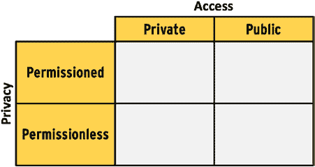
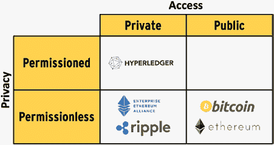
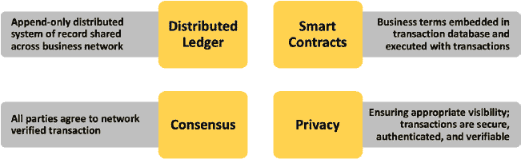

# 第三章：区块链组件与架构

当他们在彼此之间转移资金时，银行只是另一个对等节点，并不拥有任何特殊权力.6。

`Jimmy Song`（比特币的倡导者之一、权威专家及投资者）总结了数据库与区块链之间的区别如下：

> “区块链与普通数据库的主要区别在于，它规定了向数据库写入数据的具体规则。即，数据不能与数据库中已有的其他数据冲突（一致性），只能追加写入（不可篡改性），数据锁定至特定所有者（可拥有性），具有可复制性和可用性。最后，所有参与者无需中央机构即可就数据库中的状态达成共识（去中心化下的规范性）。”（Song, 2018）

网络中所有对等节点就区块链数据库中的数据状态达成一致。我们称之为规范状态，而对等节点在没有中央机构的情况下达成此共识，因此这是去中心化的，数据库本身是一个分布式账本。

虽然保护隐私的分布式账本缓解了我们之前指出的中心化账本问题，但其实现难度始终高于中心化账本。如我们所见，不同节点上的分布式账本无法同时达到规范状态，这使得在区块链上实现 ACID 语义几乎不可能。区块链中的节点还会进行冗余计算，表面上“浪费”了资源。我们将在本章后面更详细地讨论区块链的局限性。由于实现基于分布式账本（或区块链）的应用存在困难，只有在底层业务问题确有必要时，才应考虑采用此类方案。在[第四章](https://doi.org/10.1007/978-1-4842-8164-2_4)中，我们将讨论系统设计者如何判断业务问题是否必须使用区块链。

到目前为止，本章已介绍了区块链四个概念组件中的三个：分布式账本、共识机制和隐私。第四个组件是智能合约，我们将在本章后续总结所有区块链组件时对其进行讨论。接下来，我们将探讨不同类型区块链实现的分类方法。

## 区块链实现分类

在本书中，我们一直将区块链描述为尽可能实现分布化和去中心化的系统。本节将审视处于分布化与去中心化连续谱系中的区块链分类。这一连续谱系有助于我们评估哪种类型的区块链最适合我们所面临的业务问题。

我们按照两个维度对区块链进行分类：访问权限和隐私性。访问权限维度决定谁有权参与区块链网络。参与区块链意味着能够获取区块链软件、创建执行该软件的节点，并连接到一个或多个对等节点。隐私性维度则决定交易是否需要披露交易参与方的身份信息。

在我们的分类中，访问权限维度可取两个值：公有（public）或私有（private）。隐私性维度也可取两个值：有许可（permissioned）或无许可（permissionless）。由此，我们的分类得出四种可能的区块链类型：私有有许可、公有有许可、私有无许可和公有无许可，如图 3-1 所示。

**图 3-1.** *区块链实现分类*

公共区块链（Public blockchains）是指任何人可以加入区块链网络、选择进行交易、参与共识协议、维护分布式账本副本、并查看所有交易的区块链。没有任何一方有权授予或限制对区块链的访问权限。

私有区块链（Private blockchains）是指一个或多个方有权批准其他方加入区块链网络的区块链。因此，这些拥有批准权的方可以在有或没有合理理由的情况下，将节点从区块链网络中移除。拥有批准权的方还可以授予或限制区块链网络参与者有权执行的操作。例如，在私有区块链中，并非所有方都被授予参与共识协议或维护分布式账本副本的权利。在公共区块链中，所有节点拥有相同的权力；而在私有区块链中，代表拥有批准权的方的节点比其他节点拥有更多权力（或对其他节点拥有权力）。一个节点间权力分配不均的私有区块链，会导致脱离去中心化，趋向中心化。

许可区块链（Permissioned blockchains）是指一方在区块链上进行交易之前，其身份必须被建立、验证和知晓的区块链。那些扮演建立和验证其他方身份角色的方，对区块链的参与者施加权力。这些方也充当着中心化力量。请记住，许可区块链中的分布式账本仍然具有隐私保护功能。交易中不会暴露易于获取的身份信息。然而，存在一些方能够将每个交易中的所有方映射到其真实身份。

无许可区块链（Permissionless blockchains）是指可以在区块链上匿名进行交易的区块链。区块链中的任何节点都无法获取任何交易方的易于识别的身份。

在我们迄今为止的概念性和技术性描述中，我们所描述的区块链都是公共且无许可的。在公共无许可区块链中，区块链缺乏无增值中间商的优势最为显著。在所有类型的区块链中，所有方都能访问分布式账本且该账本为所有交易提供真实状态的这一优势均得以体现。可以说，在私有许可区块链中，存在降低延迟、加快所有节点间分布式账本同步速度的潜力。从某种意义上看，这是一种经典的权衡：通过牺牲部分可用性和分区容忍性来获得更强的一致性。第一个区块链实现——比特币（Bitcoin）——是一个公共无许可区块链。当区块链的唯一目的是创造货币和进行价值交换时，在几乎所有情况下，公共无许可区块链都是最合适的。在主要目的是在互不信任的各方之间共享一致数据的区块链中，私有许可区块链可能就足够了。超级账本（Hyperledger）及其 Fabric 区块链是最广泛使用的私有许可区块链平台。多个成功的企业级商业应用已使用`Hyperledger Fabric`开发。在[第 4 章](https://doi.org/10.1007/978-1-4842-8164-2_4)中，我们将系统性地回顾系统设计师如何确定哪种类型的区块链实现最适合其业务问题。

图 3-2 展示了不同类型的、已取得成功的区块链实现示例。

除了比特币，以太坊也是公有无许可区块链的一个例子。我们将在第[5](https://doi.org/10.1007/978-1-4842-8164-2_5)章中了解更多关于以太坊的内容，然后本书的第二部分将专门讨论以太坊。

如前所述，由多个工具和框架组成的超级账本生态系统是最著名且最成功的私有许可区块链实现。我们将在第[5](https://doi.org/10.1007/978-1-4842-8164-2_5)章中对超级账本进行一个非常高级别的概述。

企业以太坊和瑞波是私有无许可区块链的例子。在私有无许可区块链中，参与者在加入网络之前需要获得许可，并被授予访问特定功能的权限，例如创建和验证区块（参与共识）。以瑞波为例，为了创建和验证区块，形成了一个验证者网络.7。在私有无许可区块链中，各方可以匿名进行交易。企业以太坊是以太坊的一个版本，供企业开发基于区块链的应用程序。

> 7 瑞波背后的公司瑞波实验室正面临美国证券交易委员会的一项执法行动，该委员会声称瑞波的代币或货币 XRP 是一种证券（[www.sec.gov/news/press-release/2020-338](http://www.sec.gov/news/press-release/2020-338)）。

