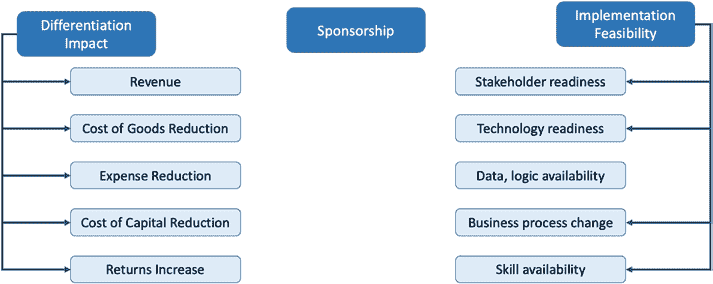
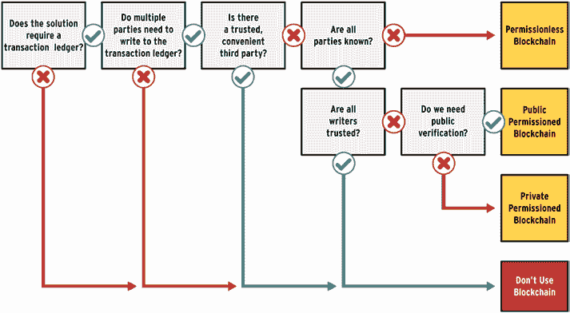

# 第 4 章 区块链商业应用

- [`doi.org/10.1007/978-1-4842-8164-2_4`](https://doi.org/10.1007/978-1-4842-8164-2_4#DOI)

部署工作需覆盖所有受影响的管理层级和个人。  
3. 对技术部署工作进行灵活管理，以控制预算、范围、时间线及质量。

这些因素依然是区块链应用的关键成功要素。如果非要说有什么变化，那就是它们如今更加重要，同时也更难以实现。对于区块链应用而言，分析单元从单个公司（或企业、组织）转移到了企业所处的整个价值链生态系统，包括其竞争对手、供应商、合作伙伴和客户。我们不再需要关注对单个企业至关重要的业务成果（如库存周转率、劳动生产率、客户留存率和客户份额），而是需要关注与整个价值链相关的业务成果，例如整体行业生产率和盈利能力。此外，那些易于实现（即相对容易衡量和达成）的财务成果，例如月末财务处理耗时、客户付款回收周期以及营运资本金额，对于区块链网络而言已不再适用。

为了管理这三个关键成功要素，以往在仔细分析差异化影响和可行性之后，选择合适的技术解决方案来解决业务问题也同样重要。对于区块链应用而言，这一点依然如此。图 4-1 展示了一个行业或整个价值链生态系统在衡量每个因素时，我们建议考虑的差异化影响和可行性评估因素。

**图 4-1.** 评估技术部署差异化影响和可行性的因素。

在初步分析中，我们建议对每个差异化影响因素进行高、中、低三个层级的描述。所有因素与差异化影响均呈直接关系；也就是说，高收入影响意味着高差异化影响。跨所有因素汇总后，技术方案的总体差异化影响将是各因素中的最高描述等级。对于实施可行性分析，我们同样建议对每个因素进行高、中、低三个层级的描述。除业务流程变更外，所有因素均与实施可行性呈直接关系。业务流程变更与实施可行性呈反向关系；也就是说，当评估认为业务流程变更程度较高时，实施可行性就会较低。跨所有因素汇总后，技术方案的总体实施可行性将是各因素中的最低描述等级。基于此分析，我们建议选择那些差异化影响高且实施可行性高的方案。如果没有任何方案符合此特征，那么我们的建议是调整方案的范围，直至达到此特征。

在本章中，我们将首先讨论仅适用于区块链应用选择和设计的标准，从评估区块链对于解决业务问题是否必要开始。最后，我们将通过描述区块链在金融、医疗、供应链和娱乐领域的应用实例来结束本章。

## 区块链是否必要？

在本节中，我们将描述可能需要区块链技术来解决的业务问题类型。

我们首先审视该业务问题是否与[第 1 章](https://doi.org/10.1007/978-1-4842-8164-2_1)中描述的经济低效问题相关，而区块链恰有潜力解决这些问题。该业务问题是否涉及以下七个机会中的一个或多个？

1. **交易结算时间**

2. **为非增值活动向第三方支付的费用**

3. **与数据相关的重复性工作、返工及对账工作**

4. **政府法规及其他非政府规则施加的限制**

5. **高发的欺诈行为**

6. **价值交换过程中的隐私泄露**

7. **数据安全风险**

系统设计人员可以分析一个业务问题，判断其是否涉及上述七种经济低效现象中的多种情况；若存在，则可进一步分析区块链的适用性。或者，系统设计人员可以研究特定行业，判断其中是否存在上述七种经济低效现象中的多种情况，并识别出适用于区块链的应用业务场景.1。

判断是否需要使用区块链的下一步，是将业务用例分析与七种经济低效现象相结合，并评估解决方案设计是否可归入与区块链网络能力相符的三大应用主题之一。这三大应用主题如下：

1. **支付** – 第一个应用主题涉及多方之间跨越地理边界的数字化支付。这些支付可能涉及可替代或不可替代的实物或数字资产转移。可替代资产是指所有资产价值等同，而不可替代资产则指每个资产都具有唯一性。

2. **透明度** – 第二个应用主题涉及在价值交换的多方之间建立透明度和可见性，此类交换可能跨越地理边界及不同的司法管辖区。透明度和可见性可体现在业务流程进度状态、产品与服务属性、财务预测或各方共享数据的溯源信息方面。

3. **数据主权** – 第三个应用主题涉及保护道德和法律上属于主权个体的数据所有权和控制权。控制权涵盖两个维度：准确性的确认与访问权限的授予。访问权限可授予只读、读写、有限期或永久托管权限，并可针对全部数据或仅部分数据组件。

正如一个业务案例可能同时解决七种经济低效现象中的多种问题一样，它的解决方案设计也可能需要整合一个或多个应用主题。只要能够将应用功能进行拆解，并应用与三大主题相关的设计模式，系统设计便可实现可控管理。

然而，我们不应仅凭所解决的经济低效现象和显现的应用主题来判断区块链的适用性。正如前一章所述，任何区块链应用都是分布式系统解决方案，都需要谨慎的设计权衡。这使得区块链应用的开发成为一项复杂的工作。与构建区块链应用相比，使用集中式数据库甚至分布式数据库构建应用会相对简单。我们推荐的最后一项分析，是对区块链应用所支持的底层交易进行分析。该分析以流程图形式呈现，如图 4-2 所示。此流程图改编自 Wust 和 Gervais (2018) 的研究。

***图 4-2.** 基于交易分析确定区块链解决业务问题的适用性*

流程图中的第一个测试提出了一个问题：该系统的解决方案是否……

我们正在考虑的业务问题是否需要交易账本；也就是说，系统是否会创建代表价值交换的交易记录，其价值定义方式与第[1](https://doi.org/10.1007/978-1-4842-8164-2_1)章（货币、商品、服务、数据）中定义的方式相同？如果这个问题的答案是否定的，那么我们可以确定该业务问题不需要基于区块链的系统解决方案。

如果需要交易账本，那么我们就进入流程图中的下一个测试。这个测试提出的问题是：是否有多方需要向交易账本写入数据？如果只有一方需要写入交易账本，那么该问题的答案就是“否”，此时我们可以确定，基于区块链的解决方案所带来的好处不会超过开发该方案所需的成本与复杂性。如果确实需要多方写入交易账本，那么答案就是“是”，我们就需要进入流程图中的第三个测试。

## 第 4 章 区块链业务应用

第三个测试提出的问题是：是否存在受信任且方便的第三方，且该第三方能被所有参与价值交换的各方所接受？"受信任"和"方便"这两个词可能具有主观性，因此我们稍作进一步的限定。要使此测试的答案为“是”，整个价值链生态系统中所有参与价值交换的各方都应给出肯定的回答。这有助于解决冲突，例如某个第三方被价值交换中较强势的一方信任，但未被其他方信任。方便性可以根据收取的费用和提供的服务来进一步明确。所有各方都应认为收取的费用可以接受，并且与第三方提供的服务相称。如果这个问题的答案是“是”，那么我们可以确定，基于区块链的解决方案所带来的好处不会超过开发该方案所需的成本与复杂性。如果第三个测试的答案为“否”，那么我们就进入流程图中的第四个测试。

第四个测试提出的问题是：我们的业务问题是否会导致一个系统设计，其中所有需要向交易账本写入数据的各方都是事先已知的？如果并非所有各方都事先已知，那么采用基于区块链的解决方案几乎肯定会带来好处。此外，我们需要一个无许可区块链来实现该系统解决方案。如果所有需要向交易账本写入数据的各方都是事先已知的，那么我们就进入流程图中的第五个测试。

第五个测试提出的问题是：所有预期要向交易账本写入数据的已知各方是否都可信？与第三个测试中的问题类似，这个问题也具有主观性。我们将参照限定第三个问题的方式来限定这个问题。要使此测试的答案为“是”，整个价值链生态系统中所有参与价值交换的各方都应给出肯定的回答。如果所有各方都信任其他需要写入交易账本的各方，那么该问题的答案就是“是”，此时我们可以确定，基于区块链的解决方案所带来的好处不会超过开发该方案所需的成本与复杂性。如果所有预期要写入交易账本的各方并非都可信，那么采用基于区块链的解决方案几乎肯定会带来好处。此外，我们需要一个许可区块链来实现该系统解决方案。接着我们进入流程图中的第六个测试，以确定最合适的许可区块链类型。

第六个测试提出的问题是：写入交易账本的交易是否需要公开验证。公开

