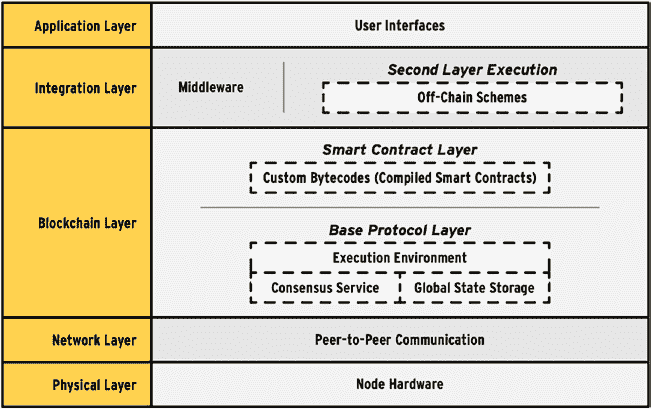
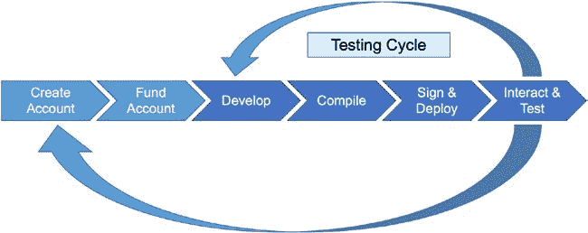

# 第 4 章 区块链商业应用

- **数据**——可以轻率地说，任何区块链都不过是受密码保护的数据比特和字节。这种说法是正确的，它意味着区块链的大部分价值源于对这些数据赋予的含义和做出的解释。因此，支持区块链的数据结构（或数据模型）的设计，是区块链系统设计者需要重点考虑的设计因素。

除了要设计与所解决的商业问题高度吻合的数据模型，并确保所有利益相关者都能清晰理解该模型之外（这是所有应用设计者都需要面对的设计问题），区块链系统设计者还必须应对区块链特有的三个设计挑战。

第一个设计挑战涉及确定哪些数据将存储在区块链上（链上），哪些数据将存储在链下。链上数据就是分布式账本，它会在区块链网络的每个节点上复制。链上数据的大小是驱动节点可扩展性（每秒交易数）和数据一致性的因素之一。它也会驱动每个节点将产生的计算成本。因此，我们应该只将绝对必要的数据存储在区块链上。请记住，这一设计决策仅适用于正在开发自有区块链实现、或使用诸如 `Hyperledger` 等私有许可区块链的系统设计者。对于使用 `Ethereum` 构建的应用，链上交易数据结构是预先确定的（且内置的）。对于基于 `Hyperledger` 的区块链应用，隐私相关的法规应成为判断数据是否存储在链上的考量因素之一。正如我们所看到的，数据一旦提交到链上，就极难（几乎不可能）将其移除。如果个人身份信息（PII）或个人健康信息（PHI）存储在区块链上，那么遵守赋予客户删除其数据权利的隐私法律将不可能实现。 6,7

第二个设计挑战涉及确定链下数据将如何存储和管理以及存储在何处。如果链下数据是中心化的，那么这可能会破坏应用与信任相关的目标——我们如何信任不在区块链上的数据？这就是所谓的“预言机”问题（Caldarelli，2020）。一种更受青睐的存储链下数据的方法是使用诸如 `IPFS` 这样的分布式文件系统（Huang，Lin，Zheng，Zheng，and Bian，2020）。8

第三个设计挑战是集成或链接链下数据与链上数据的机制。这种集成通常通过智能合约实现。“预言机”问题通过智能合约访问现实世界权威数据的需求体现出来。

---

6 对于公共无许可区块链而言，这并非问题，因为公钥（至少目前）不被视为个人身份信息。  
7 在区块链上加密的个人身份信息或个人健康信息对隐私法规的影响尚不明确。  
8 更多信息请访问 [www.ipfs.io](http://www.ipfs.io)。

数据（`data`）。例如，在我们之前描述的智能合约中，银行存款会产生利息，我们需要知道利率。如果这个利率是基于联邦基金利率[⁹]的浮动利率，那么我们需要与能够提供此信息的外部数据源进行集成。

- **共识（`Consensus`）** – 使用私有许可区块链的区块链应用的下一个设计挑战是确定最适合解决所涉业务问题的共识机制。

在诸如`Hyperledger`这样的私有许可区块链应用平台中，共识机制是可插拔的。系统设计者常用的一种共识机制是让拥有区块创建权限的多数节点明确验证一个区块——这不需要解决谜题。在此基础上可以有多种变体。

如果你使用的是公有（许可或无许可）区块链平台，那么共识机制已经为你确定。总体而言，与私有区块链的共识机制相比，公有区块链需要计算上更加稳健的共识机制（如果你的身份已知，那么共谋并破坏区块链网络的可能性较小）。

如果你计划为应用使用公有区块链，那么区块链平台提供的共识机制可能会成为你决策过程中的一个考量因素。在下一章我们详细讨论`Bitcoin`时，将描述`Bitcoin`使用的共识机制。我们还会介绍其他可用的共识机制。对于公有区块链，在计算稳健性的要求与能耗方面的可持续性担忧之间取得平衡至关重要。

**利益相关者组织（`Stakeholder organization`）：** 这仅是针对许可区块链应用的设计决策。我们需要确定最合适的区块链网络治理与结构，以促进区块链网络长期成功与存续。

图 4-3 显示了三种可能的区块链网络。

***图 4-3.** 区块链利益相关者组织模型*

基于联盟的网络有多个创始方，他们共同治理区块链网络，招募成员，并在他们之间以及为成员确定决策权。联盟通常提供成员可以使用的技术平台，并协助他们进行实施和培训。在银行、保险及其他行业中，已有多个基于联盟的网络正在运行或被提议。基于联盟的网络应注意避免违反反垄断法规或被指控共谋。

创始人主导的网络通常始于一个在特定行业或价值链中实力强大的公司。这家公司通常与一家技术公司合作，提出一个由其赞助的区块链解决方案，并招募其供应商，在少数情况下也会招募客户和竞争对手作为成员加入。创始人负责该区块链网络的治理以及为创始人确定决策权。我们可以将此类型的区块链视为围绕创始人中心化并将权力集中于创始人。从很多方面来看，它可以被视为类似于中心化的数据共享系统，而回顾过去，这些系统并未改善低效的“三个 R”（冗余工作、返工与对账工作）。通过赋予每个成员自己独立的分布式账本副本，这种方法有望减少不信任，并可能推动采用。

[⁹]: [`fred.stlouisfed.org/series/FEDFUNDS`](https://fred.stlouisfed.org/series/FEDFUNDS) 显示了自 1960 年以来联邦基金利率的变化情况。

在本节所述的三个利益相关方组织中，社区型网络是最为去中心化和民主的。在这里，个人或组织汇聚一堂，共同协作开发区块链应用。社区成员通过民主方式共同商定决策权分配与治理机制。他们可能会决定与科技公司合作，帮助社区成员采用、安装区块链技术并接受相关培训。社区型网络的例子包括艺术家们合作开发区块链网络，以保护和实现知识产权的货币化。社区型区块链网络需要深入思考，如何根据新成员（这些成员可能未参与区块链网络的初始创建）的反馈和意见来演进其治理机制。

在本节中，我们讨论了针对许可型区块链网络的管理和治理相关的设计决策。虽然治理也是公有区块链面临的问题，但使用公有区块链进行应用开发的系统设计师无法对此施加影响。

在本节中，我们没有讨论与发起方、角色以及负责创建基于区块链应用的项目的利益相关方责任相关的组织决策。虽然这些决策对于确保项目成功至关重要且关键，并且可能比非区块链技术项目的类似决策更为复杂，但我们并未将其视为与基于区块链解决方案的实施相关的设计决策。

**技术栈：** 区块链应用系统设计师需要应对的最后一个设计决策，是理解区块链应用的架构层次、为支持应用开发需要选择的开发工具，以及为确保区块链应用质量将采用的应用流程。

让我们首先了解 Lesavre、Varin 和 Yaga（2021）所述并如图 4-4 所示的五个架构层次。

***图 4-4.** 区块链应用架构层次*

物理层由区块链网络中任何节点计算机所使用的硬件组成。总体而言，我们希望我们的区块链是硬件无关的，并能支持多样化的硬件-操作系统配置。特别地，一个好的设计方法是不要求任何专用硬件——作为最佳实践，我们更倾向于物理层采用通用硬件。

网络层由管理区块链网络对等节点之间点对点通信的软件组成。

图 4-4 中描绘的区块链层有时被称为区块链实现的第 1 层。它包含了区块链内全局数据的存储结构和机制——分布式账本、执行共识协议的服务以及智能合约的执行环境。这些能力统称为基础协议层。智能合约层包含可由基础协议层执行的已编译智能合约软件。智能合约层中的软件有时被称为链码——因为这是将在区块链每个节点上执行的软件。区块链系统设计师无需关注与基础协议层相关的实现细节，只需了解其工作原理以评估效率和功耗需求即可。区块链系统设计师需要将重点放在开发上。

在开发区块链应用程序时，企业需要理解其业务流程所需的链代码或智能合约。在开发智能合约软件时，他们需要了解智能合约执行环境所支持的编程结构。在这一层中，需要开发工具来支持应用程序开发过程。这些工具至少包括一个开发区块链账本和一个交互式开发环境，以支持智能合约的创建和测试。

集成层（如图 4-4 所示，有时被称为区块链实现的第 2 层）需要为所有链下数据以及需要在“链下”执行的软件（称为链下代码）提供存储结构和机制。链下代码在高级层面有两个功能：满足区块链层中智能合约的数据需求，并将来自区块链层的数据转换为满足应用层需求的数据。在集成层中，所需开发工具将是用于访问区块链层的`API`（应用程序编程接口）。集成层还可以包括支持与其他区块链或其他数据和计算资源集成的中间件软件。

> 你可能会不时在媒体上读到关于区块链实现中创新的报道。这些创新有时会被称为第 1 层或第 2 层创新，具体取决于这些创新在区块链架构中所处的位置。进行第 1 层变更并使其被采用，通常比进行第 2 层变更要复杂得多。

**第 4 章 区块链商业应用**

应用层包含区块链应用的界面。该层可以是基于网页的应用或移动应用。此层承载着存储用户私钥的钱包。该层的开发工具可以包括钱包浏览器插件。

图 4-5 展示了区块链应用的高层级开发周期。

***图 4-5. 区块链应用开发流程***

该流程包括：在开发区块链实例上创建代表应用或应用用户的账户。如果所使用的区块链实现有原生（或协议）代币，则需为这些账户注入资金。其余工作涉及：开发相关的智能合约；将这些智能合约编译为字节码；签名并部署智能合约（首先部署到开发区块链实例，然后部署到测试区块链实例，有时称为测试网）；然后通过应用接口与应用程序交互并进行测试。一旦测试和验证完成，就可以按照类似的过程（创建账户、注资（如果需要）、签名并部署智能合约）将应用部署到生产区块链（有时称为主网）。

**第 4 章 区块链商业应用**

在本节中，我们详细回顾了区块链系统设计者需要应对的七个设计决策。接下来，我们将描述金融、医疗、供应链和娱乐领域的典型区块链应用。

**区块链应用**

区块链应用正被构想并实施于多种行业中。理解这些案例研究的三个绝佳来源是：Hyperledger 基金会（[www.hyperledger.org/learn/case-studies](http://www.hyperledger.org/learn/case-studies)），以及区块链研究所（[www.blockchainresearchinstitute.org](http://www.blockchainresearchinstitute.org/7914-2/)）。

