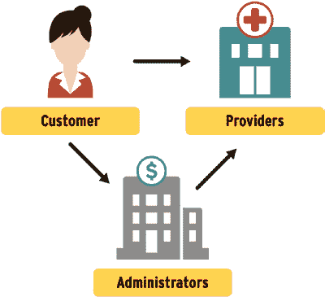

# 区块链商业应用

最后，金融服务公司持有的集中式数据库成为数据泄露的诱人目标。根据威瑞森数据泄露调查报告，金融和保险行业在 2020 年发生了 467 起已确认的数据泄露事件。这些数据泄露导致了个人数据、银行内部数据和凭证数据的未经授权披露。

金融服务行业在减少“三个 R”（冗余工作、返工和对账工作）方面取得了很大进展，但贷款发放和承保领域除外。除贷款外，金融服务行业几乎所有的数据传输都是电子的，业内公司已经标准化了数据交换的语法和语义。这种标准化（尽管并非全部）是由各个司法管辖区的合规要求推动的。由于这些努力，除了贷款业务外，减少与“三个 R”相关的低效率并非区块链应用程序在金融服务行业的主要关注点。

区块链应用程序在金融服务行业涉及的主题包括：以更快的结算时间和更低的费用进行支付、数字资产的创建和管理、运营流程的简化与自动化，以及由此带来的透明度提升。这些应用程序统称为去中心化金融或`DeFi`。

- `Ripple Labs`已成功与银行合作，开展基于区块链的跨境支付和转账。`Ripple`的成功促成了与`SWIFT`（环球银行金融电信协会）的合作，`SWIFT`是全球货币转账的现有骨干系统。
- `Quorum`是一个基于`Enterprise Ethereum`的开源区块链平台，由摩根大通创立。`Quorum`用于构建许可型区块链应用程序。据`Geroni`（2021 年）称，`Quorum`正被`ING`集团、`Ant`集团、`汇丰银行`和`摩根大通`等金融机构用于商业银行支付、制裁信息交换、贸易金融、机构交易、资本市场数据、大宗商品交易后处理、贷款市场及债务发行，以及与央行相关的银行间支付。
- `Corda`是一个许可型区块链平台，已被`纳斯达克`（用于资本市场解决方案）、`富国银行`（用于银行业务）和`暹罗商业银行`（用于贸易金融）等机构使用。
- 去中心化自治组织是基于区块链的解决方案，使全球各地的个人能够在没有集中式管理层次结构的情况下组织和管理自己。`DAO`已被用于筹集和分配私募股权基金、慈善捐款、社会影响力活动以及小额信贷借贷。
- `Figure`是一个区块链解决方案，旨在减少抵押贷款发放和承保过程中与“三个 R”相关的经济低效率。

这些区块链解决方案提供了金融服务，无需集中式平台或方控制交易或收取便利交易的费用。交易记录、审计追踪、报告和对账都是这些交易平台的自动化副产品。虽然`PayPal`、`Venmo`和`Square`的`Cash App`本身并非去中心化平台，但它们都支持加密货币交易。交易记录、支出记录和抵押贷款发放都是可以通过区块链进行的活动，而无需像今天这样涉及第三方。同样，`AT&T`、`亚马逊`、`家得宝`、`Overstock`和`全食超市`等几家领先公司也接受加密货币用于电子商务交易。

最后，我们来谈谈另外两个与区块链相关的金融应用：加密货币交易所和央行数字货币。

虽然`币安`、`Gemini`、`Coinbase`和`FTX`等加密货币交易所被用于人们交易加密货币，但它们的交易平台拥有集中式账本，并伴有我们之前讨论过的所有相关风险和陷阱。加密货币交易所还需要遵守与“了解你的客户”相关的法规。从这些加密货币交易所获得的钱包可能会被执法机构传唤，以获取个人身份与其公钥之间的映射关系。

`CBDC`是各国央行正在推出的货币，作为法定货币的数字等价物。中国于 2020 年 4 月启动了数字人民币`e-CNY`试点，并于 2022 年 1 月扩大了试点范围。`e-CNY`通过移动应用程序运行，据估计，`e-CNY`应用程序拥有超过 2.6 亿用户。印度披露了在 2023 年初推出数字卢比的计划。在美国，美联储于 2022 年 1 月发布了一份白皮书，以“就`CBDC`总体而言，以及就美国`CBDC`的潜在收益和风险，促进广泛且透明的公开对话”。虽然`CBDC`的经济潜力令人印象深刻，但尚不清楚主权国家政府是否正在或将会使用分布式账本或区块链来实施`CBDC`。他们可以选择将`CBDC`作为集中式账本来实施。这将极大地扩大政府权力，进一步集中国家内的货币和金融活动。`CBDC`还将进一步增强国家的监视能力，并消除现金的匿名性。在倡导或采用`CBDC`之前，我们需要审查其底层实施以及`CBDC`将运行的监管制度。

以上是对区块链金融应用的快速概述，我们实际上只是触及了皮毛。根据`CB Insights`的数据，2021 年针对`DeFi`的风险投资资金增长了`851%`。相比 2020 年达到 34 亿美元.18。加密货币领域的融资也十分强劲[15](https://techcrunch.com/2022/01/18/chinas-digital-yuan-wallet-now-has-260-million-individual-users/)[16](https://economictimes.indiatimes.com/news/economy/policy/indias-digital-currency-to-debut-by-early-2023/articleshow/89379626.cms)[17](https://www.federalreserve.gov/publications/files/money-and-payments-20220120.pdf)[18](https://www.cbinsights.com/reports/CB-Insights_Blockchain-Report-2021.pdf)

# 第四章 区块链商业应用

交易所和经纪商（请注意，这些可能并非去中心化）、托管和钱包提供商，以及 NFT。接下来，我们将探讨区块链在医疗健康领域的应用。

## 区块链医疗健康应用

在本节中，我们将重点讨论美国的医疗健康系统，尽管本节描述的许多内容同样适用于依赖政府和私人健康保险组合支付医疗费用的其他医疗系统。理论上，我们描述的部分应用也可能有益于政府运营的单支付方医疗系统，但由于我们对此类系统缺乏经验，我们无法自信地做出这一论断。

在美国的医疗健康系统中，消费者与临床服务提供者互动，例如初级保健医生、专科医生、护士、治疗师、药剂师、临床技师、家庭健康助理、医院健康系统、诊断实验室、药房、疗养院和家庭保健提供者。医疗健康中的价值交换发生在医疗消费者与临床服务提供者之间的互动过程中。然而，临床服务提供者在此过程中所提供价值的报酬，却要通过一个复杂的第三方管理机构网络来实现，如图 4-6 所示。这些第三方管理机构主要包括医疗保险公司和处方药福利管理公司。此外，还有受医疗保险公司委托的其他参与者，他们提供数据验证、数据聚合、临床必要性验证及其他表面上看是为了帮助消费者和优化医疗开支的服务，但实际上却阻碍了消费者与临床服务提供者之间的价值交换，并模糊了医疗服务的成本。

**图 4-6.** *美国医疗健康系统中的第三方管理机构*

根据美国医疗保险和医疗补助服务中心（CMS）的数据，2020 年，美国医疗健康支出的每一美元份额分配如下：19

- 联邦政府支出 36 美分。
- 消费者支出 26 美分。
- 私营企业支出 17 美分。
- 州和地方政府支出 14 美分。
- 其他私营实体支出约 7 美分。

由于联邦、州和地方政府的支出资金来自公民纳税人，消费者实际上通过直接和间接支出，承担了医疗健康总费用的 76%。这些支出中的一部分，流向了那些提供支付计算、收款和报销平台的营利性第三方管理机构。