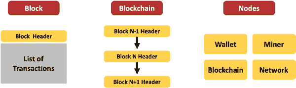

# 第 4 章 区块链业务应用

## **区块链供应链应用**

供应链涉及多个参与方，在这些多方之间，存在着产品流、信息流和资金流的多向流动。这种商品和支付的跨境转移受到严格监管，并且很难使产品、信息和资金流保持同步。供应链中的可见性通常只有一级深度。你只能看到与你直接交互的合作伙伴，而无法看到该合作伙伴的上下游伙伴。这导致了信息可用性方面的低效，以及信息的延迟和波动性。

供应链中的每一方往往都使用自己的语义维护自己的账本。由于所有参与方之间的相互依存关系，供应链中任何一环的漏洞都会影响整个供应链。由于供应链的复杂性，存在欺诈和行政浪费的可能性。

就供应链的低效而言，跨境支付需要异常长的结算时间。它们不仅涉及汇率的不确定性，还涉及法规和费用的不确定性。存在大量的对账和冗余工作，耗费了供应链中每个参与方的大量人力。

欺诈在供应链中十分猖獗，不仅体现在假冒伪劣商品和贴错标签的商品上，还因为不同司法管辖区之间支离破碎的法规被不法分子利用。任何安全漏洞的影响对涉及的所有相关方都是重大的。

区块链在提高供应链效率方面潜力巨大。让我们来看两个例子。

## • `Trade Lens`项目

第一个是一个名为`Trade Lens`的项目。`Trade Lens`由`IBM`和一家从`马士基`分拆出来的公司`GTD Solution, Inc.`共同开发。其目标是实现全球贸易数字化。`Trade Lens`是一个由供应链中所有参与货物运输的相关方组成的生态系统。因此，我们将拥有所有的第三方物流提供商，以及所有的内陆和多式联运提供商，例如卡车和铁路。我们还拥有港口和码头，以及海运承运商——包括`马士基`和地中海航运公司在内的最大海运承运商。所有这些竞争对手联合起来，以提高整个系统的效率。`Trade Lens`目前拥有超过 175 个参与者。他们每天在其基于`Hyperledger`的区块链上处理超过 200 万个事件。

• 我们考察的第二个示例是沃尔玛为保障食品安全而发起的区块链项目。该系统同样基于`Hyperledger`实现，参与方包括沃尔玛及其所有食品供应商。目标是追踪每件食品从农场到商店再到消费者的全过程。这不仅提高了供应链中商品的透明度与可视性，还能快速追溯任何健康问题的源头。过去，一旦爆发*大肠杆菌*疫情，沃尔玛需要数周时间才能锁定问题源头，这导致了食物浪费和消费者的不安。如今，借助这个基于区块链的系统，沃尔玛能在数小时内追踪到疫情并警告公众，从而仅召回受影响的商品，避免不必要地浪费更多产品。

## 区块链在娱乐行业的应用

在本节中，我们将探讨区块链技术在艺术与娱乐行业（或更广泛地说，在创意知识产权产业）的应用潜力。

与医疗行业类似，整个艺术娱乐产业也充满了复杂性。艺术家与欣赏者之间的关系，通常需要由多个第三方中介来协调，表面上是出于规模经济、营销和品牌塑造的目的。然而，这些第三方往往从艺术家与欣赏者之间的交易中抽取巨额价值，对双方都产生了负面影响。

我们来看其中复杂的环节：

• 每件艺术品——无论是音乐、音频还是任何形式的知识产权——都可能涉及多位创作者，而多位艺术家之间的报酬分配通常相当复杂。
• 艺术品可以通过多种媒介发行，且每种媒介伴随复杂的报酬安排。因此，某人可能拥有特定媒介在特定时间段、特定地理区域内的权利。艺术品的权利被切分得支离破碎，进一步加剧了报酬计算的复杂性。
• 艺术行业通常存在两种报酬形式：一是对原创艺术品或知识产权的收购费用，二是二次使用的报酬（亦称版税）。当艺术品被整体或部分二次使用时，就需要支付版税。
• 还存在一些情况，部分艺术品是按照“雇佣作品”方式委托创作的，这类艺术品的报酬计算可能更加复杂。
• 尤其涉及二次使用或版税的报酬，其分发可能需要数月时间。

虽然报酬的复杂性催生了需要平台和第三方来实现艺术品高效、规模化发行的需求，但这些平台的拥有者——第三方——对艺术家拥有过大的控制权。平台告诉艺术家他们应得的版税报酬，艺术家要么接受，要么要求审计。然而大多数审计耗时极其漫长，且审计过程中的数据完全由平台或第三方掌控，赋予了他们巨大的权力。

而欣赏者最终沦为被动的消费者，尽管艺术品的价值恰恰是通过欣赏者的消费直接创造的。欣赏者与艺术家之间几乎不存在互动，艺术家实际上也并未真正掌控这种关系——尽管表面上看起来似乎如此。

基于上述背景，我们来看艺术与娱乐行业存在的效率低下问题。

• 交易结算耗时漫长。版税相关交易耗时超过一年才结算的情况并不罕见。
• 虽然营销和规模化发行需要第三方，但权力天平过度倾斜于控制平台的第三方。
• 数据集中且不共享，审计权执行困难重重，而且在多数情况下，高效的账本系统

`simply do not exist.`

-   `欺诈`行为可能包括冒名顶替、未经授权的复制以及制造赝品。

除了上述种种低效问题，该行业的法规也偏向平台和第三方。这是一个亟需通过区块链技术进行革新的行业。尽管存在大量既得利益者以及遗留技术和运营模式，但这个行业此前已被颠覆过，未来也仍有可能再次被颠覆。以往行业的颠覆最终只是形成了新的权力中心，并未真正改变艺术家与欣赏者之间的关系。

区块链的潜力在于实现一种不会导致另一个中心化权力垄断的颠覆性变革。

## 章节总结/关键要点

本章的关键要点如下：

-   使用区块链开发的应用程序应铭记与大规模技术部署相关的所有经验教训和关键成功因素。
-   基于区块链的解决方案适用于以下业务问题：交易结算时间过长；为无增值活动向第三方支付的费用；与数据相关的冗余工作、返工和对账工作；政府法规及其他非政府规则带来的限制；欺诈事件高发；价值交换过程中的隐私泄露；以及数据安全风险。

## 第 4 章 区块链业务应用

-   区块链解决方案适用于与支付、透明度和数据主权相关的应用场景。
-   仅当多个参与方需要写入交易账本、这些参与方互不信任、且没有便捷且可信的第三方可用时，才应优先选择区块链解决方案而非传统方案。
-   实施基于区块链的解决方案要求系统设计者对交易、代币、智能合约、数据、共识机制、利益相关者组织以及开发栈做出设计决策。
-   金融服务行业中区块链应用所涵盖的主题包括：实现更快的结算时间和更低的费用、创建和管理数字资产、简化并自动化运营流程，以及由此带来的透明度提升。
-   目标区块链医疗应用侧重于减少与“三个 R”（冗余、返工、对账）相关的经济低效问题，提高运营透明度，并让消费者掌控自己的数据。
-   供应链领域的区块链应用侧重于提升透明度、减少行政浪费、加速跨境支付以及打击欺诈行为。

## 第 4 章 区块链业务应用

-   区块链在娱乐领域的应用旨在解决透明度问题、缩短结算时间、减少行政浪费，并平衡艺术家与中心化平台之间的权力。

下一章，你将了解比特币区块链实现的技术细节。我们还将简要介绍以太坊和超级账本；对比比特币、以太坊和超级账本 Fabric；并快速梳理新兴的区块链发展动态。

## 测验题

1.  以下哪个应用主题与区块链解决方案的能力不符？
    a. 支付
    b. 业务流程再造
    c. 数据主权
    d. 透明度
2.  判断题：如果多个参与方在存在可信且便捷的第三方的情况下写入交易账本，则不需要区块链解决方案。
3.  如果所有写入交易账本的参与方都是已知的，并且不需要公开验证交易，应使用哪种类型的区块链？
    a. 无许可链
    b. 私有许可链
    c. 公有许可链
    d. 以上皆非

## 第 4 章 区块链业务应用

4.  在以下列出的区块链应用层中，哪一层被认为是区块链实施的“第一层”？
    a. 物理层
    b. 网络层
    c. 区块链层
    d. 集成层
    e. 应用层

5. 在以下列出的区块链应用层中，哪一层被认为是区块链实现的`Layer 2`？
   a. 物理层
   b. 网络层
   c. 区块链层
   d. 集成层
   e. 应用层

6. 以太坊是一种 \_\_\_\_\_\_\_\_ 类型的代币。

7. 代币分类的两种类型是什么？它们的子分类是什么？

8. 描述三个与基于区块链解决方案实现相关的数据设计挑战。

9. 每执行一次智能合约都需要相同的计算能力，因此也需要支付相同的费用。正确还是错误。

## 第 4 章 区块链商业应用

10. 组织区块链网络的三种可能模式是什么？请详细说明它们的优缺点。

**参考文献**

Wust, K., Gervais, A. 2018\. 你需要区块链吗？2018 年加密货币谷区块链技术大会（CVCBT），2018 年，第 45–54 页，DOI: 10.1109/CVCBT.2018.00011。 <https://ieeexplore.ieee.org/document/8525392>

Tapscott, D. Tapscott, A. 2018\. 区块链革命：比特币及其他加密货币背后的技术如何改变世界。2018 年。Portfolio/Penguin 出版社。纽约州纽约市。

Freni, P., Ferro, E., Moncada, R. 2020\. 代币化与区块链代币分类：一个形态学框架。2020 年 IEEE 计算机与通信研讨会（ISCC），2020 年，第 1–6 页，doi: 10.1109/ISCC50000.2020.9219709

Ankenbrand, T., Bieri, D., Cortivo, R., Hoehener, J., Hardjono, T., 2020. 关于全面（加密）资产分类法的提案。 <https://arxiv.org/pdf/2007.11877.pdf>

Tapscott, D. 2020\. 代币分类法：围绕数字资产建立开源标准的需求。区块链研究所，2020 年 2 月 19 日，2020 年 6 月 16 日改编。 <https://interwork.org/wp-content/uploads/2020/07/Tapscott_Token-Taxonomy_Blockchain-Research-Institute_InterWorkAlliance.pdf>

Mehar, M. I., Shier, C. L., Giambattista, A., Gong, E., Fletcher, G., Sanayhie, R., Kim, H. M., & Laskowski, M. (2019). 理解区块链中一项革命性且有缺陷的伟大实验：The DAO 攻击。信息技术案例研究杂志（JCIT），21(1)，19–32。 <https://doi.org/10.4018/JCIT.2019010102>

## 第 4 章 区块链商业应用

Caldarelli, G. 2020\. 理解区块链预言机问题：行动呼吁。Information 2020, 11, 509; doi:10.3390/info11110509 <http://www.mdpi.com/journal/information>

Huang, H., Lin, J., Zheng, B., Zheng, Z., Bian, J. 2020\. 当区块链遇到分布式文件系统：概述、挑战与开放问题。IEEE Access。第 8 卷，2020 年。DOI: 10.1109/ACCESS.2020.2979881 <https://ieeexplore.ieee.org/stamp/stamp.jsp?arnumber=9031420>

Lesavre, L., Varin, P., Yaga, D. 2021\. 区块链网络：代币设计与管理概述。美国国家标准与技术研究院。 <https://doi.org/10.6028/NIST.IR.8301>

Geroni, D. 2021\. Quorum 区块链及其用例：一份全面指南。2021 年 6 月。 <https://101blockchains.com/quorum-blockchain-use-cases/>

Shrank WH, Rogstad TL, Parekh N. 2019\. 美国医疗体系中的浪费：估计成本与节约潜力。

*JAMA.* 2019;322(15):1501–1509. doi:10.1001/jama.2019.13978

Papanicolas, I., Woskie, L., Jha, A. 2018. 美国及其他高收入国家的医疗保健支出. *JAMA.* 2018;319(10):1024–1039. doi:10.1001/jama.2018.1150

Zhuang, Y., Sheets, L. R., Shae, Z., Chen, Y. W., Tsai, J., & Shyu, C. R. (2020). 应用区块链技术提升临床试验招募效率. *AMIA ... 年度研讨会论文集. AMIA 研讨会,* 2019, 1276–1285

## **第五章**

## **区块链实现概述：比特币、以太坊与超级账本**

2008 年问世的比特币被认为是区块链的首个实现。后续的区块链实现在比特币基础上进行了改进，旨在简化应用开发、提升可扩展性，并增强可创建应用类型的多功能性。

## **引言**

本书开篇从基础出发，探讨了当前技术未能解决的七大经济低效问题——交易结算时间、向第三方支付的无效增值活动费用、与数据相关的冗余工作（三大 R：重复工作、返工与对账）、政府与非政府组织的规章制度、欺诈、隐私权衡以及数据安全。我们将此归因于现有系统无法在本质上互不信任的交易方之间建立信任。

在回顾了密码学、分布式系统及点对点网络相关技术的能力与设计问题后，我们讨论了如何整合这些技术以构建包含四大核心组件的区块链系统：分布式账本、隐私保护、共识机制与智能合约。

在概念层面探讨了区块链的四大组件如何协同解决七大经济低效问题后，我们深入研究了区块链何时适合用于解决商业问题；提供了构建基于区块链应用的设计指南，并举例说明了区块链在金融、医疗、供应链及娱乐领域的应用案例。

掌握这些知识后，我们认为有必要且适宜从足够的技术深度去理解最初的加密货币及区块链实现——比特币。

比特币通过一篇化名为中本聪（Nakamoto，2008）发表的论文面世，其时正逢次贷金融危机动摇了人们对银行体系的信心。尽管比特币并非首个实现的电子现金系统，但它首次纳入了缓解双重支付问题的可信解决方案（Lee, Choi & Rhee, 2003）。中本聪于 2009 年 1 月 3 日创建了比特币区块链中的第一个区块（即创世区块），为自己挖出 50 枚比特币；随后于 2009 年 1 月 12 日，向密码学家哈尔·芬尼发送了 10 枚比特币，[这是区块链上的第一笔交易。]（1 a cr）*哈尔·芬尼于 2014 年去世时的讣告 – [www.nytimes.com/2014/08/31/business/hal-finney-cryptographer-and-bitcoin-pioneer-dies-at-58.html](http://www.nytimes.com/2014/08/31/business/hal-finney-cryptographer-and-bitcoin-pioneer-dies-at-58.html)*

在中本聪将原始论文分享至某电子邮件列表后，

**版权声明：** © 2022 张伟嘉与 Tej Anand  
W. Zhang 与 T. Anand, *区块链与以太坊智能合约解决方案开发*, [`doi.org/10.1007/978-1-4842-8164-2_5`](https://doi.org/10.1007/978-1-4842-8164-2_5#DOI)

列表中涌现出其他研究者的大量评论，指出了中本聪所回应的问题。该邮件主题存档于 [`satoshi.nakamotoinstitute.org/emails/cryptography/threads/1/#014810`](https://satoshi.nakamotoinstitute.org/emails/cryptography/threads/1/#014810)。

在本章中，我们将从技术层面描述比特币。我们还提供以太坊和超级账本的简要概述，并对这三种区块链实现进行对比。我们还将简要概述几种正在被考虑和用于替代比特币共识协议的共识协议。最后，我们将以近期新兴发展的简短总结来结束本章。

## 比特币交易、区块与挖矿

首先，我们通过回顾比特币区块链如何实例化一笔从亚历克斯到索尼娅的支付，来审视比特币交易的生命周期，如图 5-1 所示。

**图 5-1.** 比特币交易生命周期

亚历克斯首先打开他的数字比特币钱包。在这个钱包里，亚历克斯拥有他理论上可以花费的所有资金。现在亚历克斯想花掉部分资金，将其发送给索尼娅。为此，他扫描或复制索尼娅的地址。这就是索尼娅的公钥。接着，他填写想要发送的金额，并决定为这笔交易支付多少手续费。然后他按下传说中的发送按钮。由此可见，亚历克斯掌握控制权，并决定他愿意支付的交易手续费。

一旦亚历克斯输入索尼娅的地址、发送金额以及愿意支付的交易手续费，他的钱包软件便会使用亚历克斯的私钥对该交易进行签名，格式化交易内容——其中包含接收者（索尼娅）需要满足的条件（持有其私钥）才能花费这笔资金——并将这笔交易广播给其他运行比特币软件的节点。

当某个比特币节点收到亚历克斯的交易时，它会验证交易格式是否正确、交易中的地址是否有效，以及亚历克斯是否满足了此前他被施加的条件，才能花费现在正发送给索尼娅的资金。该节点随后将此交易添加到其维护的已验证交易列表中。

一些比特币节点充当“矿工”——这些挖矿节点将有效交易打包成一个区块。为了创建区块，挖矿节点相当于在解一道谜题。它们执行计算过程，以找到具有特定模式的哈希值。我们将在本章后面详细描述这一过程。一旦找到该哈希值，挖矿过程就完成了，一个新的区块便已创建。挖矿节点将这个新区块添加到其节点上的区块链中，并将新区块传播给其他比特币节点。收到区块的每个节点通过确保该区块产生有效哈希值且区块中所有交易均有效来验证区块。随后，每个节点将该验证通过的区块添加到区块链中。

> 每当我们说某个节点采取了某种行动，实际上是指该节点上运行的比特币软件被编程为执行该行动。

一旦包含亚历克斯这笔交易的区块被添加到区块链中，亚历克斯就成功将资金发送给了索尼娅。索尼娅现在可以将这笔资金存入她的钱包，并且只要她使用自己的私钥（假设这是索尼娅花费资金必须满足的条件），她就能花费这笔资金。

现在让我们退一步，观察比特币的组成部分，如图

5-2 所示。

***图 5-2.** 比特币的组成部分*

-   首先，我们来审视一笔交易。

交易，正如我们刚才看到的例子，是从 Alex 到 Sonia 的；它包含了 Alex 的公钥和 Sonia 的公钥；该交易由 Alex 的私钥签名，而 Sonia 花费这笔资金的条件是她必须能够访问自己的私钥，如果她可以，那么她就能花费这笔资金。

-   接下来，我们来看一个区块。

一个区块是一个包含区块头的交易列表，该区块头包含了该区块中所有交易的信息。

-   区块链是由多个互相连接的区块组成的。

区块链的关键在于：区块 `N` 的区块头包含为区块 `N 减 1` 找到的哈希值，而区块 `N 加 1` 的区块头将包含为区块 `N` 找到的哈希值。这就是区块在区块链中连接的方式。有了这些连接，对区块 `N 减 1` 中任何一个交易做出的任何更改都会改变其哈希值，这进而要求我们为区块 `N` 和区块 `N 加 1` 重新找到哈希值。由于寻找哈希值需要计算能力，在区块被链接到某个区块之后，对该区块的任何更改都极其困难，甚至是不可能的。这就是区块链具有不可变性或防篡改特性的原因（Yaga, Mell, Roby & Scarfone, 2018）。4

-   比特币实现中的任何节点都有四个软件组件。

这四个组件分别是“**钱包**”、“**分布式账本**”、“**矿工**”和“**网络**”。

“**钱包**”软件组件负责格式化交易、保管所有者的公钥和私钥，并与分布式账本接口以执行对交易输入的简单验证。

“**分布式账本**”软件组件管理区块链，并为其他软件组件提供与区块链及区块链中数据的接口。

“**矿工**”软件组件与区块链接口，并执行计算过程以寻找区块的哈希值。

“**网络**”软件组件负责与对等比特币节点进行交易和区块的点对点通信。

一个比特币节点可以选择执行所有这四个软件组件，也可以只选择包含“**钱包**”、“**分布式账本**”或“**矿工**”软件组件。比特币节点也可以选择这些软件组件的一个或多个组合。然而，所有比特币节点都需要包含“**网络**”软件组件。

这种灵活性与比特币的点对点网络核心理念相契合。毋庸置疑，比特币软件是开源软件，可以免费下载且相对容易安装。5 它不需要购买任何特殊用途的硬件。你只需要一台（任何）电脑和网络连接即可。

接下来，我们将更详细地审视比特币交易的结构。

表 5-1 展示了比特币交易数据结构中的主要字段。

***表 5-1.** 比特币交易数据结构*

| 字段名称 | 字段描述 |
| :--- | :--- |
| `tx_in_count` | 交易的输入数量。 |
| `tx_in` | 作为该交易一部分的每个输入的结构 |
| `tx_out_count` | 交易的输出数量 |
| `tx_out` | 作为该交易一部分的每个输出的结构 |

