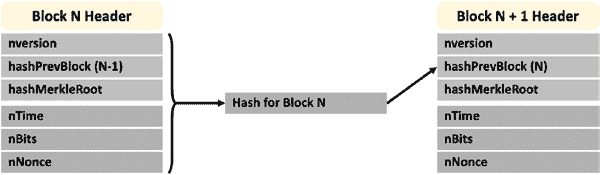
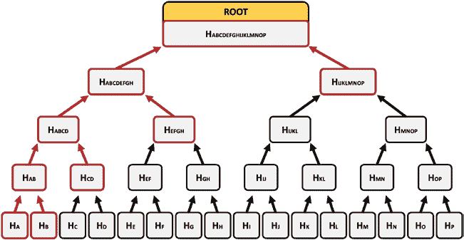

# 比特币交易结构

一笔比特币交易由若干输入和若干输出组成。交易中的输入是我们钱包里打算花费的比特币，输出则描述了我们打算如何使用这些比特币。一笔交易的输出会成为后续交易的输入——这巩固了经济中价值交换的概念。稍后我们会介绍一种特殊类型的交易，它只有输出而没有输入。

为了理解这种输入与输出的结构，我们以实体钱包中的现金为例。假设你的实体钱包里有两张五美元钞票、一张十美元钞票和一张一美元钞票。现在需要花费 17 美元。用比特币交易的结构来描述这笔交易，你将拥有三个输入：十美元钞票和两张五美元钞票。以你手头的钞票面额来看，这是唯一能凑够 17 美元的方式。这笔交易至少需要一个输出，即你想要花费的 17 美元（根据比特币交易的构造方式，即使没有 17 美元面额的钞票也不影响），这笔钱将被发送到你想要转账的地址。如果你在交易中不设置其他输出，那么输入与输出之间的差额将成为矿工节点的交易费——这些矿工会将你的交易打包进区块。在这种情况下，交易费将是 20 减 17，即 3 美元。假设你只想支付 1 美元交易费，那么你需要两个输出：你想要花费的 17 美元，以及返还给你的 2 美元"找零"（请参考以下流程图）。

交易中的任何输入都必须是其他交易的某个输出。这就是比特币对所有已花费资金进行审计追踪或溯源的方式。当我们深入分析交易输入和输出的结构时，会进一步解释这一点——表 5-2 展示的是概念性说明。

**表 5-2.** 假设交易中的数值汇总

| 字段名称 | 数值 |
|---|---|
| `tx_in_count` | |
| `tx_in` | |
| `tx_out_count` | |
| `tx_out` | |
| 接收方地址 | 17 |
| 你的地址 | 2 |

## Coinbase 交易

在进一步讨论之前，我们先了解一种特殊类型的交易——coinbase 交易。这种交易只有输出，没有输入。Coinbase 交易包含区块中所有交易的交易费总和，以及给予矿工的奖励——矿工因消耗算力发现创建区块所需的哈希值而获得报酬。从这个意义上说，coinbase 交易中的奖励部分"创造"了新的比特币，或者我们可以说 coinbase 交易使得新比特币被"挖出"。因此，coinbase 交易中的比特币奖励部分有时也被称为挖矿奖励、coinbase 奖励或区块奖励。Coinbase 交易中的比特币会被发送到矿工指定的一个或多个地址。

例如，如果某个区块包含十笔交易，每笔交易的交易费为 0.01 BTC，那么由于当前区块奖励为 6.25 BTC，coinbase 交易将向矿工发送 6.35 BTC。在后续讨论比特币均衡经济学时，我们会探讨区块奖励的历史演变。

## 比特币的审计追踪

除了 coinbase 交易，交易中的每个输入都必须是前一笔交易的某个输出。图 5-3 展示了比特币区块链如何对所有已花费资金创建并维护审计追踪。

**图 5-3.** 比特币中已花费资金的审计追踪

交易`T1`有三个输入，这些输入都是其他交易的输出。

交易（图 5-3 中未显示）有三个输出；其中两个是交易`T2`的输入，第三个输出是交易`T3`的输入。交易`T2`有两个输出，第一个输出是交易`T4`的输入。交易`T2`的第二个输出以及交易`T3`的两个输出尚未成为任何交易的输入；这些输出尚未被花费，被称为“未花费交易输出”（UTXO）。比特币跟踪区块链中的所有 UTXO，并确保新交易中的所有输入都是 UTXO，因此这些输入包含可花费的货币。比特币中这种广泛的“从摇篮到坟墓”审计跟踪有时被称为三式记账法 6，因为我们可以追踪货币从其来源到其被花费以及将要被花费的地点。这是比特币区块链的一个巧妙特性；我们可以在一个账本中实际追踪我们的经济活动和所有价值交换，尽管这是一个分布式账本。

接下来，让我们进一步深入分析交易中输入和输出的结构，以理解比特币如何维护此审计跟踪，以及如何在交易中包含条款（或智能合约）。表 5-3 显示了比特币交易输入数据结构中与我们目的相关的字段。

6 相对于众所周知的单式记账法和复式记账法。

**表 5-3.** 比特币交易输入字段

| **字段名** | **字段描述** |
| :--- | :--- |
| `txid` | 此输入对应输出所在交易的标识符 |
| `vout` | 交易`txid`中用于获取输入值的输出索引编号 |
| `scriptSig` | 花费`vout`中表示的未花费货币所需的签名 |

字段`txid`是此输入对应输出所在交易的标识符或地址。对于图 5-3 中的交易`T3`，输入`31`的`txid`是`T1`。7 字段`vout`标识交易`txid`中对应于输入的输出索引中的值。对于交易`T3`，输入`31`的`vout`将对应于输出`13`中的值。

表 5-4 显示了比特币交易输出数据结构中与我们目的相关的字段。

**表 5-4.** 比特币交易输出字段

| **字段名** | **字段描述** |
| :--- | :--- |
| `value` | 可供花费的比特币数量 |
| `scriptPubKey` | 在`value`字段中的比特币可被花费之前必须满足的条件——有时被称为锁定脚本 |

7 请注意，为帮助理解，我们进行了简化。所有标识符都是序列化的十六进制数。

字段`value`表示可供花费的比特币数量。此值正是对应输入中`vout`字段将引用的索引。字段`scriptPubKey`规定了花费`value`字段中比特币的条款或条件——用本书使用的语言来说，这就是智能合约。正如我们将要看到的，比特币支持非常基础的智能合约。

要使一个输入能够花费`value`字段中的比特币，`scriptSig`字段应包含`scriptPubKey`所要求的内容。在这种意义上，`scriptPubKey`被称为锁定脚本，而`scriptSig`被称为解锁脚本。另一种常见的术语将`scriptPubKey`称为挑战脚本，将`scriptSig`称为应答脚本。这两个字段均使用一种名为 Bitcoin 的编程语言指定。

Script，一种简单的类 Forth 的堆栈式编程语言。

侧边栏展示了一个关于堆栈式编程语言如何工作的简单示例。比特币脚本语言是受限的，因为它不支持循环，并且条件分支仅限于简单条件测试的评估。比特币会提取`scriptSig`和`scriptPubKey`中指定的比特币脚本程序，如果执行这两个程序中所有命令的输出结果为`TRUE`，则资金可以被使用。通常，这些程序包含对公钥和数字签名的引用。它们通过安全算法进行哈希和加密，以保护隐私。

接下来，我们深入探讨区块头的详细结构。

如图 5-2 所示，比特币中的一个区块由一组交易和一个区块头组成。比特币节点维护一个列表，其中包含所有有效但尚未添加到区块中的交易。这些交易被称为未验证交易，保存这些交易的结构被称为`mempool`。矿工节点通过优化其将在 1MB 大小的比特币区块中赚取的交易费用，来选择要包含在区块中的交易子集。

[8 https://forth-standard.org/](https://forth-standard.org/)

第 5 章 区块链实现概述：比特币、以太坊和超级账本

表 5-5 展示了比特币中区块头的相关字段。

***表 5-5.** 比特币区块头的字段*

| **字段名称** | **字段描述** |
| :--- | :--- |
| `nVersion` | 此版本向其他节点通信，应使用哪个版本规则来验证矿工是否已发现哈希值。 |
| `hashPrevBlock` | 上一个区块头的哈希值。 |
| `hashMerkleRoot` | 这是区块中所有交易信息的编码。 |
| `nTime` | 一个时间戳，标识矿工开始发现哈希值这一过程的数据和时间。 |
| `nBits` | 发现的哈希值需要具备的前导零数量——前导零数量越大，矿工找到哈希值的难度就越大，即需要更多的时间和计算能力；`nBits`表示难度阈值。 |
| `nNonce` | 这是一个矿工可以更改的数字，以便生成一个具有适当数量前导零的哈希值——一个小于或等于难度阈值的哈希值。 |

为了开始创建区块的过程，矿工节点从`mempool`中选择要包含在该区块中的交易。然后，它访问最后添加到区块链的区块，从其头部提取所有字段，并对这些字段进行哈希操作⁹，以确定其正在尝试创建的区块的`hashPrevBlock`字段的值，如图 5-4 所示。

[9 为了易于理解，我们描述了一个略微简化的过程版本。]

第 5 章 区块链实现概述：比特币、以太坊和超级账本

***图 5-4.** 区块创建过程中的区块链接*

然后，它创建`hashMerkleRoot`字段。默克尔根是区块中所有交易的哈希值。软件每次取两个交易进行哈希，并重复此过程，直到得到一个哈希值，如图 5-5 所示。这个哈希值被称为默克尔根哈希，它代表所有交易中包含的信息。因此，从某种意义上说，默克尔根过程将所有交易的体积缩减为这一个哈希值。任何交易的更改都会导致默克尔根哈希改变区块头，从而使该区块的哈希值无效。

***图 5-5.** 一个区块中交易的哈希默克尔根*

`nVersion`和`nBits`字段不需要由矿工节点计算。它们是矿工可用的全局配置变量。`nTime`字段由系统生成。

