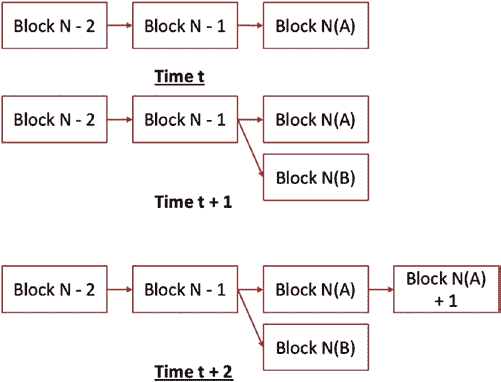

# 第 5 章 区块链实现概述：比特币、以太坊和超级账本

矿工节点现在已准备好开始挖矿过程。挖矿过程涉及生成哈希值。哈希函数的输入是`nVersion`、`hashPrevBlock`、`hashMerkleRoot`、`nTime`、`nBits`和`nNonce`字段的值。`nNonce`的值由矿工设置。如果计算出的哈希具有`nBits`指定的前导零数量，则矿工已找到该区块的哈希。如果生成的哈希没有适当数量的前导零，矿工可以更改`nNonce`的值并重新计算。`nNonce`是区块头中矿工可以更改以搜索有效哈希的唯一字段。更改`nNonce`以重新计算哈希，直到找到有效哈希的迭代过程就是比特币的挖矿过程。比特币中的这种挖矿算法被称为工作量证明（`PoW`）。¹⁰

我们之前在[第 2 章](https://doi.org/10.1007/978-1-4842-8164-2_2)中了解到，计算哈希是一个非常高效的计算过程。然而，搜索`nNonce`可能值的大搜索空间可能需要大量的计算能力。这种计算需求对于比特币的安全性和可信度非常重要。由于发现区块的哈希需要大量的计算能力，对区块的任何更改都需要重新发现该区块以及在该区块之后添加的所有其他区块的哈希。这降低了尝试更改已提交区块的可能性。随着更多的区块随后链接到该区块，尝试更改任何区块的可能性会进一步降低。

虽然发现区块的哈希在计算上非常昂贵，但验证哈希是否有效却是一个计算高效的过程。一旦矿工节点确定了区块头的`nNonce`值，它就会将该区块（区块头和所有交易）传输给其对等节点。¹⁰ 当节点接收到该区块时，它会（一次）重新计算哈希以验证其有效性，并确认所有交易也是有效的。一旦该区块被验证，它就会将其链接到具有匹配`hashPrevHeader`的区块。

当一个节点收到一个有效区块并将其添加到其区块链中后，如果它参与了挖矿过程，它会停止该过程，重置其内存池，并选择一个新的有效交易子集来开始创建下一个区块的过程。

在任何给定时间，多个比特币矿工节点都在努力创建新区块。假设有两个节点正在努力创建区块 N。我们将这些新区块称为候选区块：区块 N(A)和区块 N(B)。假设区块 N(A)首先完成并广播其区块。另一个节点——我们称之为节点 Q——接收区块 N(A)并将其添加到其区块链中，如图 5-6 所示（时间 T = t）。由于网络延迟，比特币网络中的所有节点不会同时收到区块 N(A)。事实上，正在努力创建区块 N(B)的节点没有收到区块 N(A)，而是继续完成区块 N(B)的创建，并将其广播给其对等节点。当节点 Q 收到区块 N(B)时，它也将此区块附加到区块 N 上，如图 5-6 所示（时间 T = t + 1）。区块链现在出现了一个分叉。这种分叉被称为自然分叉，因为它是区块链网络自然运行的产物。在时间 T = t + 1 时，我们无法做出判断。

在时间`T = t + 2`时，节点`Q`收到了`Block N(A)+1`。如图 5-6 所示，节点`Q`将`Block N(A)+1`添加到`Block N`上。



**图 5-6.** 自然分叉示意图

在时间`T = t + 2`时，`Block N(A)`最终成为区块链一部分的可能性高于`Block N(B)`成为区块链一部分的可能性。在任何给定时间，比特币都将最长的链视为有效区块链。每个节点都试图延长最长的链。此图例与[第 2 章](https://doi.org/10.1007/978-1-4842-8164-2_2)中讨论的最终一致性的`BASE`语义一致。

与前述描述类似，我们还应该承认，有些节点可能在收到`Block N`之前就收到了`Block N(A)+1`。如果一个节点收到了一个块，但由于`hashPrevBlock`与其链中已有的块不匹配而无法将其添加到区块链，则它会将该块保存为孤儿块。如果稍后该节点收到了`Block N(A)`，那么此时，`Block N(A)`和`Block N(A)+1`都会被添加到区块链中。

在任何给定时间，区块链的叶节点不一致的可能性很高。最终一致性的概念向我们保证，最终所有节点都将达成一致，并且远离区块链叶节点的节点保持一致的可能性很高。

基于上述原因，谨慎的做法是，在一笔交易所在区块之上又链接了几个区块之前，不应认为该交易已结算。对于大额交易，经验法则是等待六个区块链接到某个区块之后，才认为该区块已被不可变地添加到区块链中。

让我们为一位决定接受比特币作为支付方式的商家解释这一点。商家将分享他们的地址（公钥），潜在客户可以使用该地址向其付款。如果客户在时间`t`从该商家处购买商品，他们将发起一笔交易；在时间`t`之后的某个时刻，该交易将被添加到一个候选区块中；再之后某个时刻，该候选区块将被添加到区块链中。一旦商家确认包含该交易的区块已被添加到区块链，他们可以再等待几个区块添加到该区块之后，然后将该交易视为完全确认。此时，商家就可以将货物运送给客户。¹¹

比特币软件被设计为每十分钟向区块链添加一个新区块。这是一个设计决策，代表了一种权衡，即在尽可能快地结算交易的同时，确保各个节点上的区块链不同步的时间尽可能短。

比特币软件如何确保实现这一设计目标？在每创建 2016 个区块后，比特币软件会计算矿工创建新区块所花费的平均时间。如果这个时间大于十分钟，那么它会降低由`nBits`表示的难度级别，以便矿工能够更快地创建区块。为了降低难度级别，比特币软件会减少矿工需要找到的哈希值中所需的前导零的数量。另一方面，如果创建区块的平均时间少于十分钟，那么比特币软件会增加所需的前导零数量。

```
is programmed to automatically increase the difficulty level represented by nBits
```

比特币软件会增加有效哈希值中前导零的数量，从而使哈希值更难寻找。

本节对比特币的工作原理进行了深入介绍。虽然技术细节有所简化，但并未遗漏任何关键的技术信息。接下来，我们将探讨比特币的经济学原理。

## 比特币经济学

在前一节中，我们描述了比特币的交易结构、交易验证方式、用于创建区块的挖矿过程，以及将区块添加到区块链中的流程。我们还讨论了当矿工创建一个区块时，他们会通过 `coinbase` 交易获得补偿，其中包括交易费用和区块奖励。区块奖励导致了新比特币的“创建”、“铸造”或“挖掘”。

中本聪在创建比特币区块链网络时，其设计目标之一就是限制比特币的供应量。这一动机源于一种观点：政府通过扩大货币供应量滥用了其对货币供应的权力。这被认为是通货膨胀性的，并且过多的供应量可能导致货币贬值和价值下降。因此，中本聪不仅希望比特币不受政府干预，还为了保护比特币的价值而限制了其供应量。比特币软件的设计使得总共只会产生 2100 万个比特币。

比特币网络平稳且可靠的运行依赖于挖矿节点自愿投入计算能力、电力和其他资源来创建新区块。由于矿工消耗了资源，他们通过 `coinbase` 交易获得区块奖励作为补偿。比特币于 2008 年推出时，区块奖励为 50 个比特币。比特币软件在每创建 210,000 个区块（大约每四年）后，会将奖励“减半”，如图 5-7 所示。

**图 5-7.** 比特币区块奖励减半

2012 年，区块奖励减半至 25 个比特币。2016 年 7 月，减至 12.5 个比特币。2020 年 5 月 11 日东部时间下午 3 点左右，奖励降至 6.25 个比特币。到 2140 年，我们将达到比特币软件中 2100 万比特币的上限。从那时起，矿工将不再获得区块奖励。矿工因挖矿而消耗的资源所能获得的唯一补偿将来自交易费用。

当不再有区块奖励时，我们便说比特币达到了均衡经济学。

让我们做一些简单的数学计算，以了解挖矿过程可能给经济带来的成本。我们已经知道我们每十分钟创建一个区块，这意味着我们每小时创建六个区块，即每天创建 144 个区块，这相当于每年创建 52,560 个区块，如图 5-8 所示。

**图 5-8.** 比特币经济学

对于前 210,000 个区块，每个区块的奖励为 50 个比特币，我们可以计算出大约 1000 万个比特币是在头四年内被挖出的。接下来的四年大约挖出了 500 万个比特币，以此类推。按照当前美元兑比特币的汇率，这相当于为矿工创造了数百亿到数千亿美元的财富。

这是一笔巨款。比特币经济体系规模之大，令人不禁思考这是否可持续。这种事情能继续下去吗？如果志愿矿工只能获得交易费用作为补偿，他们还会继续创建区块吗？交易费用会足够低以支撑价值交换吗？我会不会

---
¹⁰ 发现能够产生有效哈希的`nNonce`正确值要求矿工在消耗计算能力方面做工作。呈现已发现的`nNonce`值以及区块头中所有其他字段的值，代表了矿工已完成工作的证明。

¹¹ 交易的智能合约可以有一个条件，即商家在能够确认已发货之前，不能花费这笔钱。