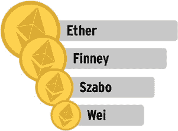
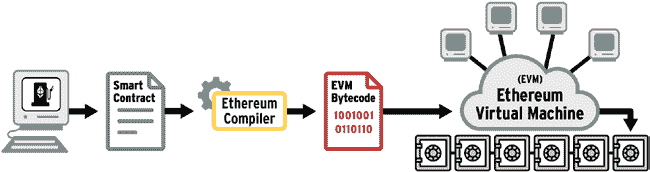

# 区块链实现概述：比特币、以太坊和 HyperLedger

编程语言方面，以太坊还简化并加强了对交易和支出的追踪。比特币软件会追踪每一笔交易、其输入、输出以及所有交易中的未花费交易输出（UTXO），即使需要一直追溯到最初的创世区块。

在比特币中，如果一笔交易产生一个比特币的输出，另一笔交易产生半个比特币的输出，第三笔交易产生另外半个比特币的输出，我们无法将这三者合并以在钱包中创建两个比特币，除非创建一笔新交易并为此支付交易费用。比特币会分别追踪这三笔交易的`UTXO`，如图 5-9 所示。

**图 5-9.** 比特币 UTXO 与以太坊账户对比

## 第 5 章 区块链实现概述：比特币、以太坊和 HyperLedger

以太坊没有仅仅追踪交易，而是创建了一种账户结构，其中归属于同一账户的交易可以被汇集和聚合。这带来了其他优势，例如我们理论上可以在账户中隔离并持有基于以太坊原生代币或以太坊货币（Ether）的各种不同类型资产或代币。

当然，Solidity 为使以太币成为一种高度可编程货币而提供的广泛功能也伴随着相关风险。

-   Solidity 的灵活性使得部署的智能合约更可能存在缺陷。这是一个不可避免的现实——软件越多，出现错误的可能性就越大；当软件容易创建时，也容易犯错，等等。在区块链中，一旦智能合约被部署并提交到区块链，它便是不可变的。软件缺陷无法修复。唯一可行的补救措施是希望人们不再使用有缺陷的智能合约——但如果智能合约缺陷能为用户创造经济利益，这种情况就不太可能发生。因此，这带来了很大的风险。
-   以太坊的状态比比特币更大；也就是说，以太坊在链上存储的数据比比特币更多。这可能会引入延迟和计算问题。
-   执行智能合约的交易需要补偿区块链网络执行该智能合约的计算成本。这种成本被称为 Gas，它取决于智能合约的复杂性和规模。

## 第 5 章 区块链实现概述：比特币、以太坊和 HyperLedger

-   在 Solidity 智能合约部署到区块链之前，它会被编译成字节码。然而，有一种选项允许除了字节码之外，还可以部署智能合约的可读版本。虽然这提高了透明度，但也可能带来隐私和保密性风险。

以太坊背后的货币是 Ether。Ether 的较低面额分别为`Finney`、`Szabo`和`Wei`，如图 5-10 所示。`Finney`、`Szabo`和`Wei`都是加密货币世界的杰出人物，他们早期都参与了比特币社区。

**图 5-10.** Ether 面额

以太坊有两种类型的账户：外部拥有账户和合约账户。外部拥有账户是最常见的。它们拥有余额，并存储在钱包中。合约账户存储并执行智能合约代码。合约账户还关联着一个余额，代表相关智能合约持有的可编程货币余额。

区块链中的交易请求改变区块链的状态。与比特币所有交易都是同一类型（即从一个地址向另一个地址发送比特币的支付交易）不同，以太坊有三种类型的交易；交易不限于发送支付。

## 第 5 章 区块链实现概述：比特币、以太坊和 HyperLedger

1. 支付交易用于将以太币从一个账户发送到另一个账户。
2. 智能合约创建交易用于在区块链上实例化智能合约。
3. 智能合约执行交易则根据智能合约中的业务逻辑，在账户之间转移资金。

以太坊的关键成就之一是创建了以太坊虚拟机（EVM），即世界计算机。以太坊虚拟机位于区块链之上，充当编译器，将以 Solidity 语言编写的智能合约软件编译成 EVM 可执行的所谓 EVM 字节码，如图 5-11 所示。正是这种字节码在区块链上被执行。区块链网络需要耗费算力来运行智能合约，所有节点都必须执行该智能合约；执行智能合约的交易所有者需要支付 Gas（以以太币计价）作为执行智能合约的费用。

**图 5-11.** 以太坊虚拟机

以太坊的愿景是创建分布式应用程序（dApps）。这一愿景已经实现，目前已有数千个以太坊 dApp 投入生产，并推动了围绕区块链的热潮。创建 dApp 涉及智能合约以及与之交互的前端的开发、测试和部署。图 5-12 展示了 dApp 的架构以及可供 dApp 开发者使用的开发工具示例。

**图 5-12.** 以太坊 dApp 架构和开发工具

- Truffle 是一个用于创建 Solidity 软件的交互式开发环境。
- Ganache 提供了一个开发区块链，用于在开发过程中测试智能合约软件。
- Drizzle 是一组库，提供了从 dApp 前端进行账户和合约实例化的功能。我们将 dApp 架构称为 Web 3.0 架构，以区别于 Web 2.0 架构，并将 dApp 的前端称为 Web3 前端。
- dApp 前端通过一组远程过程调用（RPC）与 EVM 和区块链交互。Infura 将这些 RPC 封装成一个 API（应用程序编程接口），从而简化了 dApp 的开发。
- MetaMask 是一个 Chrome 插件和一个软件钱包。

这些工具简化了分布式应用程序（dApps）的开发。

## Hyperledger

Hyperledger 是一种区块链实现，用于在交易方之间（例如供应链中的各方）开发企业级商业应用。

Hyperledger 区块链解决方案由 Linux 基金会提供和管理。这是一项旨在推进跨行业区块链技术应用于企业商业应用的协作成果。自 2016 年 2 月成立以来，Hyperledger 协作组织现已拥有超过 200 个成员组织。

Hyperledger 拥有开源、开放标准、开放透明的治理机制。这种治理模式为软件界的许多人熟悉且适应，因为它长期被 Linux 和 Apache 这两个知名的操作系统和 Web 开发平台所采用。

Hyperledger 附带高度模块化的框架和工具，可以集成在一起使用。

让我们看看 Hyperledger 提供的一些工具和框架（另请参见图 5-13）：

- Hyperledger Aries、Indy 和 URSA 是用于管理加密身份并在区块链网络中传递这些身份的工具和框架。
- Hyperledger Fabric 是其中的核心分布式账本。

