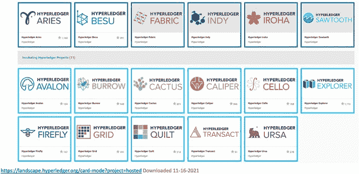

# Hyperledger 生态系统概述

## 智能合约与共识机制

在 Hyperledger 生态系统中，针对 Hyperledger Fabric，您可以使用`Go`编程语言编写智能合约。您还可以插入不同的共识机制。

- **Hyperledger Besu** 是一个为 Hyperledger 生态系统构建的以太坊客户端。在这里，您可以使用 Solidity 编程语言编写智能合约，并创建私有或公共的许可区块链。
- **Hyperledger Sawtooth** 是一个框架和工具集，帮助您使用经过时间证明（PoET）或实用拜占庭容错（PBFT）共识机制构建区块链应用程序。
- **Iroha** 专为基于物联网的区块链应用程序设计，并使用`C++`编程语言。
- **Hyperledger Cactus** 是一个区块链集成工具，运行在不同区块链上的应用程序可以相互通信和协作。
- **Cello** 是一个操作仪表板，可用于跟踪多个区块链应用程序。
- **Hyperledger Explorer** 提供了一个非常简单的基于 Web 的界面来查询区块链中的数据。

* **Hyperledger Quilt** 是一个用于跨账本支付机制的 Java 实现。在这里，您可以处理加密货币支付以及法定货币支付。法定货币是由主权政府发行的货币。

***图 5-13.** Hyperledger 生态系统*

Hyperledger 提供了非常丰富的开发工具集，可用于构建企业级业务应用程序。迄今为止，所有使用 Hyperledger 构建的应用程序都使用了许可区块链。其中许多应用程序是私有许可的，但也可以是公共许可的。

## Bitcoin、Ethereum 和 Hyperledger 对比

在本节中，我们将对比 Bitcoin、Ethereum 和 Hyperledger，然后快速回顾过去几年区块链领域发生的令人兴奋的发展。

Bitcoin 是区块链的原始实现，我们将使用以下标准对比 Bitcoin、Ethereum 和 Hyperledger：

- 它们的目的分别是什么？
- 它们使用什么治理机制？
- 它们使用什么货币？
- 它们的挖矿奖励是什么？
- 它们的底层数据结构和共识机制是什么？

Bitcoin 用于支付。它原生地用于将价值从一方转移到另一方。Ethereum 被构建为一个通用开发平台，您可以在其中促进支付，同时构建分布式应用程序。Hyperledger 也被设计为一个通用的企业级应用程序开发工具。

Bitcoin 由比特币改进提案（BIP）治理，该提案试图在所有 Bitcoin 节点之间达成共识。一旦一定比例的 Bitcoin 节点同意提议的更改，共识即被视为达成，社区同意迁移到下一个版本。那些不同意的节点可以通过创建硬分叉来走自己的路。

Ethereum 区块链也使用以太坊改进提案（EIP），并且在 Vitalik Buterin 的领导下有一个核心小组来推动这一过程。

Hyperledger 的治理基于 Linux 基金会，人员和公司在此合作，贡献他们的服务、项目、框架和工具。

Bitcoin 的原生货币是`BTC`，较低面额的单位是`Satoshi`。Ethereum 的原生货币是`Ether`，较低面额的单位是`Finney`、`Wei`和`Szabo`。Hyperledger 没有原生货币。它的目的较少基于支付，更多是关于数据共享和建立信任。

Bitcoin 当前的挖矿奖励是`6.25 BTC`。我们看到，在 2020 年 5 月，这一奖励从`12.5 BTC`减半。Ethereum 的挖矿奖励是`2 Ether`。Hyperledger 没有挖矿奖励的概念。

Bitcoin 的核心数据结构是交易。在 Ethereum 中，……

