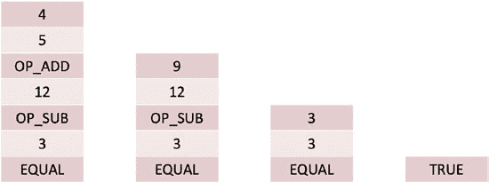

# 区块链实现概览：比特币、以太坊和 Hyperledger

Ethereum 主网致力于提升可扩展性并降低交易费用。Polygon 最初是 Ethereum 的一个侧链，但现在被用于开发多链 Ethereum 系统，这同样有助于提升可扩展性。

Cardano 被一些人称为下一代区块链。它拥有一种名为`Ada`的加密货币，以及一种名为`Ouroboros`的共识机制，这是对权益证明（proof of stake）的一项创新。Cardano 拥有智能合约开发平台`Plutus`，它类似于以太坊虚拟机（Ethereum Virtual Machine），基于 Haskell 编程语言。

Solana 是另一个下一代区块链，它采用了一种名为历史证明（proof of history）的共识机制。这种共识机制能够实现非常高的交易吞吐量。

最后，Polkadot 与 Polygon 一样，是一个新兴的多链系统。

---

## 第五章 区块链实现概览：比特币、以太坊和 Hyperledger

区块链的研究与开发仍在如火如荼地进行中，许多激动人心的进展正在推进。

## 章节总结/关键要点

本章的关键要点如下：

- 比特币于 2008 年发布，旨在实现无需中介的点对点交易。每笔比特币交易都包含输入和输出。一笔比特币交易中的输入对应于其他交易的输出，从而为所有比特币支付提供了审计追踪（溯源）。
- 比特币输出创建了挑战脚本，当这些输出被用作输入时，需要响应脚本来解锁并花费该输出。这些脚本使用`Bitcoin Script`实现，这是一种功能非常受限的、用于实现智能合约的语言。
- 在比特币中，交易通过工作量证明（proof-of-work）共识机制被打包成区块。平均每十分钟创建一个新区块。创建一个区块的比特币节点被称为矿工，矿工会获得奖励，该奖励是区块奖励与区块内所有交易手续费之和。截至 2020 年，区块奖励为 6.25 BTC。区块奖励每四年减半，到 2140 年，区块奖励将降至零。
- 比特币软件包含四个组件：钱包、分布式账本、矿工和网络通信。

    

- 以太坊是一个包含图灵完备编程语言`Solidity`的区块链，用于开发智能合约。以太坊催生了创新的分布式应用（dApps）的诞生。
- 以太坊目前也使用工作量证明共识机制，但计划迁移至权益证明（proof-of-stake）共识机制。
- Hyperledger 是一个适合开发企业级应用的区块链。
- 区块链开发仍处于初期阶段，一些第二代区块链，如`Cardano`、`Solana`、`Polkadot`和`Polygon`，正获得越来越多的采用。

## 侧边栏 – 基于栈的编程语言

图 5-14 演示了基于栈的编程语言如何运行一个简单程序：`4 5 OP_ADD 12 OP_SUB 3 EQUAL`。

***图 5-14.** 基于栈的编程语言示意图*

该程序中的每个元素都被推入一个栈中，如图所示。元素从栈中弹出，直到遇到运算符为止。该运算符作用于被弹出的元素，然后将结果压回栈中。对于我们的程序，首先，`4`被弹出栈；然后`5`被弹出栈；当`OP_ADD`被弹出栈时，它作用于`4`和`5`，即，由于`OP_ADD`运算符执行加法运算，它们被加在一起，结果`9`被压回栈中。接下来，我们弹出`9`和`12`，当运算符`OP_SUB`被弹出时，从`12`中减去`9`，结果`3`被压回栈中。接着，我们弹出`3`和`3`；当`EQUAL`被弹出时，我们检查`3`是否等于`3`；结果为`TRUE`，并被压回栈中。当`TRUE`被弹出时...

成为我们简单程序的最终输出。

像 `OP_ADD`、`OP_SUB` 和 `EQUAL` 这样的运算符在比特币脚本中被称为操作码。14

## 测验题

1. 哪种区块链实现最适合开发企业级区块链应用？
   a. 比特币
   b. 以太坊
   c. 超级账本

2. 哪种区块链实现最适合开发分布式应用？
   a. 比特币
   b. 以太坊
   c. 超级账本

3. 比特币使用的共识机制是什么？
   a. 工作量证明
   b. 权益证明
   c. 分布式权益证明
   d. 权威证明

4. 以下哪一项**不是**以太币的面额？
   a. 芬尼
   b. 萨博
   c. 韦
   d. 聪

5. 超级账本使用的共识机制是什么？
   a. 工作量证明
   b. 权益证明
   c. 分布式权益证明
   d. 以上都不是

6. 在一个包含十笔交易的区块链区块中，每笔交易的输入与输出差额为 0.05 BTC。矿工挖出这个区块总共能获得多少 BTC？

7. 在一个包含十笔交易的区块链区块中，每笔交易的输入与输出差额为 0.03 BTC。矿工挖出这个区块总共能获得多少 BTC？

8. 在一个包含十笔交易的区块链区块中，每笔交易的输入与输出差额为 0.06 BTC。矿工挖出这个区块总共能获得多少 BTC？

9. 一笔比特币交易的输入总额为 5.25 BTC，输出总额为 5.15 BTC。这笔交易的交易费是多少？

10. 请简要解释比特币如何维护所有花费的审计跟踪。

11. 比特币中哪种交易没有输入？
    a. 创世交易
    b. 铸币交易
    c. 孤儿交易
    d. 简单交易

12. 描述以太坊支持的三种交易类型。

13. 解释比特币如何确保平均每十分钟创建一个区块。

14. 当不再有区块奖励时，我们称比特币已进入 _____________ 经济。

15. 以太坊中使用的智能合约编程语言是什么？
    a. Script
    b. JavaScript
    c. Solidity
    d. Go

16. 在比特币中，保存所有未验证交易的结构被称为 ________________。

17. 这些尚未被花费的比特币输出被称为 __________ ____________ ___________ 或 ____________。

18. 用于创建 Solidity 软件的交互式开发环境是什么？
    a. Ganache
    b. Truffle
    c. MetaMask
    d. Infura

## 参考文献

Nakamoto, S. (2008) Bitcoin: A peer-to-peer electronic cash system. [`bitcoin.org/bitcoin.pdf`](https://bitcoin.org/bitcoin.pdf)

Lee, H., Choi, M., Rhee, C., (2003) Traceability of double spending in secure electronic cash system, 2003 International Conference on Computer Networks and Mobile Computing, 2003. ICCNMC 2003. 2003, pp. 330–333, doi: 10.1109/ICCNMC.2003.1243063

Antonopoulos, A. (2017). Mastering Bitcoin: Programming the open blockchain. (2nd. ed.). O'Reilly Media, Inc.

Yaga, D., Mell, P., Roby, N., Scarfone, K. (2018) Blockchain technology overview. National Institutes of Standards and Technology. October 2018. [`doi.org/10.6028/NIST.IR.8202`](https://doi.org/10.6028/NIST.IR.8202)

Oyinloye, D. P., Teh, J. S., Jamil, N., & Alawida, M. (2021). Blockchain Consensus: An Overview of Alternative Protocols. Symmetry, 13(8), 1363.

