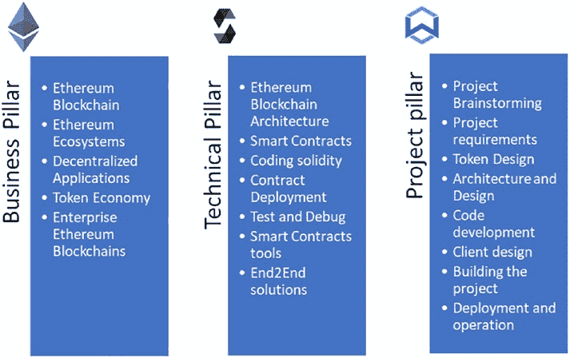
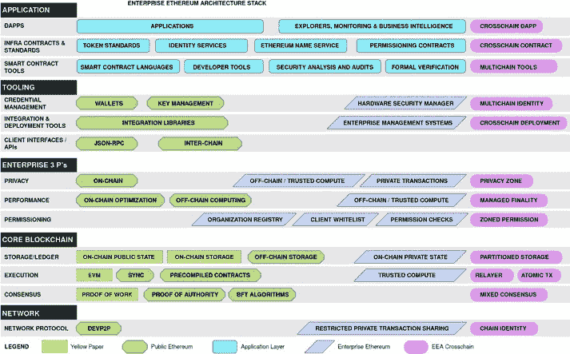

# 第 6 章

## 以太坊架构与概述

### 简介

以太坊区块链是一个极具吸引力的平台，它利用创新的智能合约能力，为几乎所有主要业务领域的去中心化应用赋能。由维塔利克·布特林及多位联合创始人开创，以太坊经历了初始发布、稳定币、ICO（首次代币发行）、DeFi（去中心化金融）、DAO（去中心化自治组织）、NFT（非同质化代币）以及用于扩展性的 L2（第二层）等里程碑。以太坊区块链及其基础设施正过渡至采用分片技术的 POS（权益证明），并有望对 CBDC（中央银行数字货币）和企业级区块链产生重大影响，潜力巨大。经过数年的飞速增长，以太坊的市值已达到 4000 亿美元，仅次于比特币。与比特币相比，以太坊区块链具有支持以太坊虚拟机（EVM）和智能合约、支持更多样化的用例、以及通过将共识机制从 POW 改为 POS 来节约能源成本从而更具灵活性的优势。

© Weijia Zhang and Tej Anand 2022
W. Zhang and T. Anand, *Blockchain and Ethereum Smart Contract Solution Development*,
[`doi.org/10.1007/978-1-4842-8164-2_6`](https://doi.org/10.1007/978-1-4842-8164-2_6#DOI)

以太坊是一个复杂且动态的平台，一直在持续扩展。学习以太坊区块链并非易事。真正理解以太坊架构并掌握进行智能合约和去中心化应用开发所需的技能，需要付出巨大的努力。为了降低以太坊区块链平台的学习门槛，我们将本书此部分的内容分为三条主线，如图 6-1 所示。第一条主线以业务为导向，侧重于以太坊概述、其生态系统、去中心化以及代币经济设计。第二条主线面向技术编程，用于开发一个智能合约项目，涵盖以太坊架构、Solidity 编程、调试、测试、安全检查和部署。第三条主线是一个项目实践线，用于构建并交付一个动手的去中心化应用，涵盖从用户需求到代币设计，再到区块链智能合约和客户端实现的全过程。

**图 6-1.** 以太坊智能合约开发的三大主线/支柱

业务和技术主线的内容将在后续章节中介绍。本章主要聚焦于以下三个主题：（1）以太坊架构及其组件；（2）以太坊生态项目；（3）智能合约开发所需的以太坊工具。

## 以太坊架构

有多种方式可以呈现以太坊区块链的架构。其中一种架构表示由企业以太坊联盟（EEA）开发，如图 6-2 所示。类似于将互联网网络表示建模为七层的开放系统互连（OSI）模型，EEA 将以太坊架构分为五层：网络层、核心区块链层、企业组件层、工具层和应用层。

**图 6-2.** 以太坊区块链组件架构与概述

### 网络层

位于架构图底部的网络层与 TCP/IP/P2P 互联网网络完全相同。尽管有时人们将区块链视为新一代互联网，但以太坊区块链本身并未在网络层面上做出任何改变。网络层为以太坊区块链提供了三项关键能力：发现区块链、与网络节点通信以及管理对等节点。

### 以太坊架构与概述

以太坊是一个无需许可的公有区块链，这意味着任何客户端节点都可以在无需中心化机构的情况下加入以太坊区块链。每个客户端节点都可以通过 secp256k1 椭圆曲线加密算法生成的一对公钥和私钥进行标识。客户端节点的私钥也被称为 `nodeKey`，公钥则被称为 `nodeId`。`nodeKey` 用于对通信数据包进行签名，而公钥则用于让对等节点验证签名的消息，以确保数据包未被篡改。`nodeId` 还可以与节点的 IP 地址和端口号共同组成一个名为 `enode` 的条目。`enode` 被用作客户端节点在对等通信中的公共标识符。

以太坊使用引导节点帮助客户端节点发现区块链。当客户端节点启动时，它可以接收诸如引导节点的 `enode` 和最大对等节点数量等输入信息。如果未指定引导节点信息，客户端将使用以太坊区块链中的默认引导节点。客户端节点首先连接到引导节点，获取其他对等节点的 `enode` 信息，然后开始与新的对等节点连接以扩展其对等节点池。客户端节点的默认对等节点数量是 25，管理员可以将其扩展到更大的数量，例如 256 甚至 1024。以太坊客户端节点通过对等节点池相互连接，形成整个以太坊区块链。

一旦客户端节点通过对等连接加入以太坊网络，它就可以开始同步区块、接收和发送交易、提议新区块等。以太坊客户端节点会不断将新区块下载到本地数据存储中，因此节点运行需要快速的网络和大量的磁盘空间。保护 `nodeKey` 至关重要，因为客户端节点需要使用其 `nodeKey` 对等通信数据包进行签名。

有时，由于对等节点不足、对等节点网络速度慢甚至对等节点故障，对等节点池可能无法正常连接。在这种情况下，客户端节点管理员可以手动在其对等节点池中添加或删除对等节点。可以使用 Web3 API 检索已连接的对等节点数量及其信息。

### 核心区块链层

区块链关键的技术创新之一在于其核心区块链层。这一层有三个重要的组成部分：共识机制、EVM 和存储。

区块链的一个独特创新在于它能够在参与节点之间达成计算共识。第一个区块链共识机制是 POW，即工作量证明，它诞生于比特币区块链。POW 通过矿场中一排排重型计算设备反复计算加密哈希值，消耗了大量能源。目前，比特币的计算能力所消耗的能源已经超过了一个中等国家的用电量。

以太坊当前的 mainnet 也使用工作量证明，但它正在向以太坊 2 中的权益证明（POS）过渡。权益证明与工作量证明的区别在于，权益证明实际上会考虑在以太坊系统中质押的以太币数量，因此质押的以太币越多，被选中提议区块的机会就越大。

除了 POW 和 POS，还有其他区块链共识机制，例如 POA 和 BFT。POA，即权威证明，更多地用于企业区块链或以太坊测试网。只有其 `nodeId` 记录在白名单配置文件中的授权节点才能加入区块链来提议区块。对于企业区块链，还存在 BFT（拜占庭容错）共识机制。这是一种非常成熟的联盟链共识机制。使用 BFT 时，任何节点都可以提议一个区块，该提议在经过一定数量的验证投票后才会被接受。例如，你可以为一个 BFT 共识区块链设置十个节点，当三个节点验证通过该区块时，它们就会接受它。你还可以调整这个百分比。

#### BFT 共识的验证投票机制

BFT 共识的一个优势是其**单一区块最终性**，这意味着一旦一个区块被提议并验证，它就是最终的，并且不会回滚。

#### 与以太坊兼容区块链的共识机制

除了与以太坊兼容的区块链中提到的四种共识机制外，还有其他共识机制正在被其他区块链采用或正在开发中。基本上，所有公共区块链都是无许可网络，所有企业区块链都是许可网络。`POW` 和 `POS` 共识适用于公共区块链的无许可网络，而 `POA` 和 `BFT` 适用于企业区块链的许可网络。

### EVM（以太坊虚拟机）

`EVM`，即以太坊虚拟机，是以太坊区块链的另一项创新。`EVM` 是以太坊节点的关键组件，因为它执行智能合约的字节码。`EVM` 和智能合约的能力驱动了数千个去中心化应用，使以太坊区块链成为继比特币之后的第二代区块链。关于 `EVM` 的更多细节将在第 [7](https://doi.org/10.1007/978-1-4842-8164-2_7) 章的智能合约编程中讨论。

### 核心区块链层的存储

存储是核心区块链层中的另一个重要组件。当 `EVM` 运行智能合约时，它需要存储大量数据，并且需要存储状态。当你查看 `EVM` 时，有数千台机器在运行相同的程序，并且相同的状态必须保存在每台机器上。你不能把所有东西都扔到以太坊存储上。有些人询问是否可以在以太坊区块链上存储视频，答案是否定的，因为他们的视频需要存储在数千台机器上，这太昂贵了。也许你只能存储媒体的 32 字节哈希值，但不能存储整个视频。

### 智能合约的 Gas 费用

在编写智能合约程序时，你还需要注意每次存储的 Gas 费用。Gas 费用可能很昂贵。如今，对于一个正常大小的智能合约交易，以太坊 Gas 费用几乎达到 100 美元，因此如果智能合约消耗大量 CPU 时间或大量存储，它就无法运行。这是以太坊公共区块链面临的挑战——目前，它的成本太高了。当 Gas 费用高时，单笔交易可能花费 60 到 100 美元。因此，在编写和运行智能合约程序时，你需要考虑 Gas 消耗。

### 企业组件层

以太坊公共区块链存在一些局限性；因此，`EEA`（企业以太坊联盟）在其架构中添加了企业区块链组件。对企业来说，有三件重要的事情：首先是隐私，其次是性能，第三是企业的许可。

在原始架构中，以太坊公共区块链在设计上并未考虑这些企业特性。以太坊公共区块链不支持隐私。公共区块链上的所有交易都是公开的。发送方和接收方的地址以及交易金额对于扫描区块链状态和日志的外部人员是可见的。

第二点是，以太坊区块链的性能不佳，因为 Gas 机制、交易和存储结构以及 `EVM` 不够快速和优化。这为 Polkadot 等替代区块链提供了竞争机会。以太坊区块链的联合创始人 Galvin Wood 提出了另一个名为 Polkadot 的区块链，他们声称该区块链运行更快更好。Polkadot 还用 `WASM` 替换了 `EVM`，使智能合约开发更类似于 Web 开发。

以太坊公共区块链还有另一个缺点，与权限相关。以太坊的公共区块链是无许可的，每个人都可以加入区块链并挖掘区块。这增加了以太坊公共区块链的安全性和稳定性挑战。

### 工具层

以太坊区块链拥有最全面的工具来帮助开发者。

开发者与用户构建并使用去中心化应用。首先，存在诸如`Truffle`和`Remix`等编译工具，它们可以编译和部署用`Solidity`编写的智能合约。还有其他工具能够编译其他编程语言。除了编译工具，还有集成库，例如`OpenZeppelin`源码库，它可以被导入到`Solidity`智能合约代码中，以加速开发并实现模块化。

以太坊还拥有丰富的钱包工具，用于访问资产和使用`dApp`。存在硬件钱包，如`Ledger`和`Trezor`，它们将私钥存储在硬件设备中。对于硬件钱包，所有交易都在硬件设备内签名，私钥永远不会离开该设备。对于加密货币用户来说，硬件钱包是最安全的选择。

此外，还有桌面钱包，需要安装在笔记本电脑或台式机系统上才能与区块链账户交互。此外，还有移动钱包，作为独立应用程序在手持设备上运行。对于使用网页界面运行`dApp`的用户，`MetaMask`是最流行的一款。它是一个网络插件或扩展程序，适用于`Chrome`或`Firefox`等网页浏览器。它也可以与硬件钱包集成，以结合网络的便利性和硬件设备的安全性。当你安装`MetaMask`时，它会生成一个 12 个单词的助记词短语，并创建一个与该助记词短语关联的账户。用户需要写下这个短语，以便在扩展程序或插件被意外卸载时恢复`MetaMask`账户。

对于钱包或客户端连接以太坊区块链，使用`JSON RPC`协议来连接以太坊区块链和智能合约。`JSON RPC`是区块链节点与`Web3`客户端之间的通信协议。区块链节点运行在以太坊区块链上，可以通过专用端口开放一个`RPC`服务。然后，`Web3`客户端连接到此`RPC`端口，并在客户端和区块链之间交换信息。`RPC`服务器可以是`dApp`应用提供的独立区块链节点，也可以是像`Infura`这样的第三方提供的代理节点。诸如`Infura`的项目提供大量的以太坊节点供客户端使用。客户端应用程序可以使用 API 密钥连接到`Infura`节点。

总之，编译工具（如`Remix`和`Truffle`）、智能合约库（如`OpenZeppelin`）、钱包（如硬件钱包、移动钱包和`MetaMask`钱包）以及`JSON RPC`，为在以太坊区块链上开发和构建去中心化应用提供了主要的工具能力。

### 应用层

应用层包含软件应用、代币和智能合约语言。

首先，软件应用包含以下三个要素：

*   **一个 Web 界面**：去中心化应用需要一个 Web 图形用户界面（`GUI`）。
*   **一个 dApp 连接器**：连接器使用`web3`将网页与区块链智能合约连接起来。
*   **区块链上的智能合约**：智能合约为你的应用提供业务和交易逻辑。

应用层中第二个重要组成部分是代币。这是区块链所独有的，并且代币经济对于维持区块链和去中心化应用至关重要。代币设计包括：发行哪种类型的代币、代币的供应量、谁管理代币供应的控制权，以及是应该生成新代币还是复用以太坊上的现有代币。

智能合约语言也是一个需要考虑的主要因素。除了`Solidity`，还有诸如`Vyper`、`Yul`、`FE`和`Serpent`等其他语言可以用来编写智能合约。

总之，以太坊区块链架构包含以下层：网络层、核心区块链层、企业区块链层、工具层和应用层。每一层都为以太坊区块链提供基本功能。我们将在后续篇幅中对其进行描述。

## 以太坊区块链生态系统与 DeFi 项目

在使用智能合约开发技术构建项目之前，了解当前的以太坊生态系统至关重要。目前已有数千个智能合约和去中心化应用部署在以太坊区块链上。我们将介绍其中一些项目，以便你了解已有项目的类型。与其重复造轮子，不如集思广益，构思新的创意。

更详细地说，面向开发者的工具层和应用层将在后续章节中讨论。

### 管理资产的钱包

第一类区块链应用是用于管理资产的钱包。

在传统金融领域，如果你想要管理自己的资产，很可能需要去银行开户，让银行代为管理。但在以太坊区块链上，资产存储在分布式账本中，因此有多种管理方式。

#### 托管服务

你可以在 `Coinbase` 开设账户，让 `Coinbase` 代为管理你的加密资产。当 `Coinbase` 托管你的资产时，你无需管理资产的私钥；而是通过 `Coinbase` 服务创建一个登录账户，让 `Coinbase` 代表你进行交易。这类服务是中心化的。全球有许多资产管理服务提供商提供类似 `Coinbase` 的服务。

对于喜欢无需中心化门户管理资产的用户，他们可以通过 `Coinbase` 钱包将私钥存储在本地，从而完全掌控自己的资产。`Coinbase` 钱包允许用户自行创建账户，直接与区块链进行资产管理，无需经过托管机构。

#### MetaMask

`MetaMask` 是最流行、用途最广泛的网络浏览器扩展钱包之一。图 6-3 展示了 `MetaMask` 如何与区块链交互来管理资产。

**图 6-3.** MetaMask 工作流程

`MetaMask` 可以安装在 Chrome 或 Firefox 浏览器上。在 Chrome 上安装时，你只需从 Chrome 网上应用店下载并安装到浏览器中。首次启动 `MetaMask` 时，它会为你创建加密账户。`MetaMask` 并非直接生成私钥，而是使用 BIP39 规范生成助记词（即种子短语），这些助记词是 12 个常用且易于记忆的英文单词。该种子短语可用于生成多个私钥和地址。你需要记下这些种子短语，以便在扩展程序被卸载后恢复 `MetaMask` 账户。

#### MyEtherWallet

`MyEtherWallet`（`MEW`）是一个开源的客户端界面，允许用户直接与以太坊区块链交互，而无需加入中心化交易所。图 6-4 展示了从用户操作到区块链的交易工作流程。

**图 6-4.** MyEtherWallet 工作流程

尽管 `MyEtherWallet` 仅在客户端运行，不会将区块链信息回传至 Web 服务器进行处理和存储，但仍存在网络钓鱼攻击的可能性。建议使用 `MyEtherWallet` 的硬件钱包或移动钱包。不推荐使用基于网页的 `MyEtherWallet`，且应仅在离线环境中使用。

#### Fortmatic

`Fortmatic` 是另一种钱包，允许用户使用其社交身份创建账户。这类似于 PayPal 服务，你可以通过电子邮件地址创建账户。`Fortmatic` 提供 API 连接各类基于网络的去中心化应用，对于不介意使用托管钱包进行加密交易和应用的用户来说非常方便。

在本节中，我们提到了多种资产管理工具，例如网页钱包、网页扩展钱包、移动钱包和托管钱包。

### 选择或开发钱包时需考虑的因素

选择或开发钱包时，需要考虑许多因素：

- **私钥（`Private keys`）** – 谁生成、存储和管理私钥？
- **去中心化（`Decentralization`）** – 钱包是否由中心化服务或托管机构管理？
- **安全性（`Security`）** – 该钱包是否曾报告过安全漏洞或攻击事件？
- **易用性（`Ease of use`）** – 钱包的图形用户界面（GUI）和用户体验（UX）是否友好？
- **开源（`Open source`）** – 钱包是开源还是专有？
- **中心化控制（`Central control`）** – 钱包是客户端应用还是服务端应用？
- **恢复（`Recovery`）** – 如果钱包丢失或损坏，是否有可靠的方式恢复账户？

由于加密货币钱包是管理区块链资产所必需的，因此值得花一些时间研究并选择最值得信赖的钱包。

#### 智能合约驱动的银行去中心化应用（dApp）

在传统银行中，客户可以开设账户、存款和借款。银行必须维护庞大的数据库和 IT 系统，以跟踪所有交易并计算储蓄账户和贷款的利息。以太坊区块链是一种公共分布式账本，诸如借贷等加密货币银行功能可以通过智能合约轻松实现。

该类别中一个流行的 DeFi 项目是 `Compound`。`Compound` 是一个去中心化的 DeFi 协议（开放 API），通过智能合约实现加密货币的借贷。出借人（`lender`）将支持的加密货币（如 `ETH`、`USDT`、`USDC` 和 `DAI`）存入 `Compound` 平台以赚取利息。当出借人将加密货币 `X` 存入 `Compound` 时，智能合约会锁定该资产，并向存款人发行同等数量的 `cX` 代币。出借人可以使用 `cX` 代币进行交易，或稍后赎回 `X` 代币。智能合约还会计算出借人每个存款周期所赚取的利息。借款人（`borrower`）可以借取出借人存入 `Compound` 资金池的加密货币。借款人需要存入抵押资产才能借入他们想要的加密货币。借款人需为借入的加密货币支付利息，并且可以偿还借入的加密货币以取回抵押品。

如果借款人的抵押物价值系数低于贷款余额，则借款账户将变得资不抵债，并触发清算事件。第三方可以偿还部分贷款，并获得最初存入该账户的相应抵押品。为了激励第三方参与清算，`Compound` 治理系统会提供一定激励。

在智能合约驱动的银行功能中，没有中央机构管理资产；社区需要审查智能合约并检查安全风险。智能合约被攻破导致客户资金损失的风险始终存在。为最大程度降低风险，智能合约通常都是开源的，项目团队在将其发布到公共区块链主网之前，通常会进行第三方安全审计。

#### 以太坊中的去中心化交易所

加密货币交易所用于在两个不同用户之间转移资产所有权。已有一些中心化交易所，例如 `Coinbase` 和 `Binance`。去中心化交易所完全基于智能合约构建，无需为交易所构建集中管理的数据库。流行的去中心化交易所包括 `DDEX`、`Loopring`、`Uniswap` 等。

使用自动做市商（`Automated Market Maker`，`AMM`）的去中心化交易所（`Decentralized Exchange`，`DEX`）相比中心化或传统交易所具有一些创新。`AMM` 使用智能合约和算法来调整流动性池中资产的价格，并实现无需维护订单簿的交易。例如，`Uniswap` 是一个流行的 `AMM DEX`，它通过智能合约使用以下机制：

- **自动流动性协议（`Automatic Liquidity Protocol`）** – `Uniswap` 允许用户通过向智能合约存入等值的交易对来设置流动性池。交易者...

#### 以太坊架构与概述

用户随后可以用自己的代币与流动性池中的资产进行交易。

#### 自动价格调整

在 Uniswap 流动性池中，代币对 `(X, Y)` 中的两种代币数量需要保持平衡。如果代币 `X` 的数量增加，那么代币 `Y` 的数量就会减少，同时代币 `Y` 的价格上涨。这会触发负反馈机制来平衡资金池。

#### 套利

套利是交易者平衡流动性池中价格波动的过程。当代币对 `(X, Y)` 中的代币 `X` 数量增加时，代币 `Y` 的数量减少，代币 `Y` 的价格上涨。套利者看到代币 `Y` 的价格高于其他交易所后，会从其他交易所卖出代币 `Y` 到 Uniswap，以增加代币 `Y` 的供应量来平衡流动性池。当流动性池恢复平衡时，代币价格应与其他交易所的价格相近。

通过使用自动化做市商机制，Uniswap 在三年内将 TVL（总锁仓价值）增长到了 50 亿美元，并实现了惊人的 5% 的日环比增长率。

#### NFT 应用

NFT 是一种具有唯一标识且不可被其他代币替换或交换的代币。NFT 的规范定义在 `ERC721` 以及后续版本 `ERC1440` 中。`ERC721` 的一个关键特性是名为 `id` 的字段，它为每个代币包含一个唯一值。`ERC721` 最常用于代表创意艺术作品。NFT 领域的项目包括 0xcert、OpenSea、Decentraland、CryptoPunk 等。

`0xcert` 是一个允许你开发 NFT 的 SDK 工具集。以太坊上为 `ERC20` 发行的大多数代币是可互换的，这意味着代币项目之间没有区别。可互换代币基于价值，如同美元钞票一样可以互换。而对于 NFT，每个代币都是不同的，且不可替代。例如，证书或文凭可以表示为非同质化代币，因为它是由某个机构为特定个人唯一签发的。未来，将会有越来越多的 dApp 被开发出来以处理非同质化代币。例如，原创艺术品、法庭文件和大学证书都属于这一类。

OpenSea 允许用户提交 NFT 作品进行销售，或使用加密货币购买 NFT 藏品。它们还支持拍卖，使得出价最高者有权通过智能合约购买 NFT 艺术品。所有交易均由智能合约自动控制，无需人工干预或第三方托管。

#### 预言机服务

预言机服务用于提供区块链与传统 IT 系统之间的连接。区块链是自封闭的，区块链客户端无法直接与网络服务器通信。这很可能是出于安全考虑而设计的。无论是比特币还是以太坊区块链，都没有在链上集成 Web API 来调用由传统 IT 系统托管的网络服务。为了使区块链能够与传统 IT 系统交互，需要使用预言机服务。

Chainlink 是最流行的预言机服务之一，它允许将传统网络服务与以太坊区块链连接起来。如果你有一个需要获取外部数据的去中心化应用程序，你需要使用预言机服务。例如，如果你的智能合约需要获取天气信息，你必须使用预言机服务，因为区块链本身不包含任何天气信息。要获取法定货币/央行数字货币的价值、货币汇率或加密货币价值等信息，你也需要连接由银行或第三方服务提供的预言机服务。

还有由 Provable 和 Band 项目提供的其他预言机服务。Provable 项目还提供了一些 SDK 和示例代码，用于 dApp 与预言机服务协作，非常方便。

#### DAO 平台

DAO（去中心化自治组织）是一个使用智能合约来管理组织或社区的平台。DAO 平台提供注册服务，并为成员分配身份。社区中的每个成员都可以提出提案，也可以对提案进行投票。区块链领域已经存在许多 DAO 平台。事实上，诸如 Compound 和 Uniswap 等许多项目都拥有自己的 DAO 社区和治理代币，用于对社区提案进行投票。

#### 去中心化保险平台

去中心化保险平台允许智能合约管理保险服务的注册，提供来自不同来源的保险服务，然后为投保账户管理理赔。例如，如果你想防止因比特币价格暴跌而遭受重大损失，你可以向智能合约发送一笔交易来支付保费作为保险，而供应方会有人接受该保险请求。所有保险条款都通过智能合约记录并强制执行。如果发生意外事件并触发了保险行为，智能合约将执行相应功能并对投保人进行赔偿。

#### 去中心化 KYC 与身份

`KYC`（了解你的客户）和身份是用于识别真实人员并收集所需个人信息以符合监管要求的服务与工具。现有诸如 Civic、Hydro、Sovrin 和 uPort 等项目，为去中心化应用提供去中心化身份服务。在去中心化应用内构建 `KYC` 功能颇具挑战性。使用第三方 `KYC` 服务则要容易得多。

#### 稳定币

加密货币面临的挑战之一是其波动性。比特币和以太坊的价值波动很大，用它们来代表产品和服务的价值会导致价格不稳定。稳定币是一种在与法定货币挂钩时价值相对稳定的资产。这些稳定币通常是以太坊区块链上的 `ERC20` 代币。它们通过多种方式保持价值稳定。例如，一种稳定币可以与美元以一对一的比例挂钩。据一些出版物报道，这些稳定币包括 Gemini Dollar、TrueUSD、USD Coin 等。

还有其他类型，例如 MakerDAO 的 Dai，它是多种资产的聚合，通过自动销毁和铸造稳定币来控制其价值，使其保持稳定。

总而言之，以太坊上已经构建了许多大型的去中心化应用，几乎涵盖了所有主要类别。还有一些应用仍在兴起中。小型智能合约项目，例如租赁共享、按需音乐服务和去中心化投票平台，都是可以用智能合约构建的潜在项目。智能合约开发是一个迷人的领域。开发者一旦学会如何编写智能合约，就能发现无限的可能性，去开发革命性的去中心化应用。