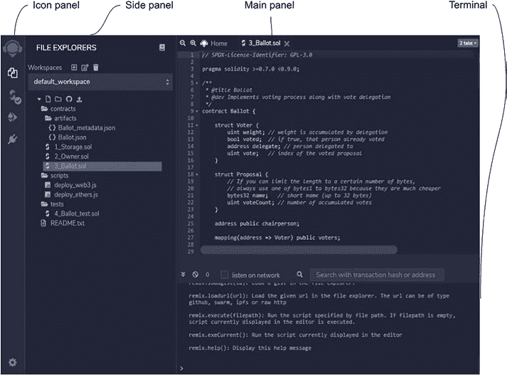

# 第 6 章 以太坊架构与概览

一旦启动 `Truffle` 控制台，开发者便可使用它查询区块链信息、发送和接收代币，以及调用智能合约函数。要调用智能合约函数，需遵循以下步骤：

- 在控制台中，根据合约地址和相应的 ABI 实例化一个智能合约对象。
- 从区块链中获取一个账户。
- 使用发送方账户及其他参数调用实例化的智能合约函数。

完整示例可参考以下位置：

[www.trufflesuite.com/docs/truffle/getting-started/interacting-with-your-contracts](https://www.trufflesuite.com/docs/truffle/getting-started/interacting-with-your-contracts)

Truffle 是一个功能非常全面且复杂的系统。本节仅提及编译、部署及测试智能合约所需的功能。详情请参阅 Truffle 官方网站：

[www.trufflesuite.com/docs/truffle/quickstart](http://www.trufflesuite.com/docs/truffle/quickstart)

#### Remix：最便捷的基于 Web 的智能合约开发工具

Remix 是一套基于 Web 的智能合约编程套件，使用起来非常方便。Remix 可以以浏览器网页形式运行，也可以作为桌面应用程序运行。要在浏览器中使用 Remix，只需打开 Chrome 或 Firefox 浏览器，并访问以下地址：

[`remix.ethereum.org`](https://remix.ethereum.org)

